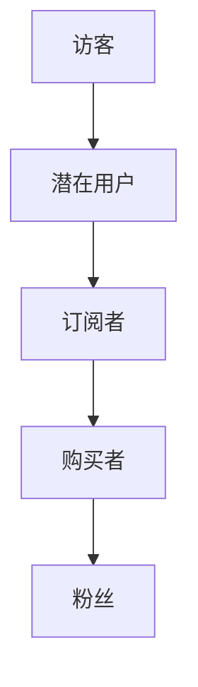

                 

关键词：知识付费、用户转化、漏斗分析、用户体验、策略优化

> 摘要：本文深入探讨了知识付费产品的用户转化漏斗优化策略。通过分析用户转化漏斗的各个阶段，提出了针对性的优化方案，旨在提升用户购买行为，增强用户留存率和满意度。文章将结合实际案例，详细阐述如何运用技术手段和运营策略进行优化，并展望知识付费行业的未来发展。

## 1. 背景介绍

随着互联网技术的快速发展，知识付费行业迎来了黄金时期。用户对于专业知识和技能的需求日益增长，促使知识付费平台如雨后春笋般涌现。然而，如何在竞争激烈的市场中提高用户转化率，成为知识付费平台运营的重要课题。

用户转化漏斗（Conversion Funnel）是一个常用的市场营销模型，它描述了用户从接触到购买产品或服务的整个过程。在知识付费领域，用户转化漏斗通常包括以下几个阶段：访客（Visitor）→ 潜在用户（Prospect）→ 订阅者（Subscriber）→ 购买者（Buyer）→ 粉丝（Follower）。

每个阶段都有其独特的用户行为特征，掌握这些特征，能够帮助平台更好地进行用户转化漏斗优化。本文将围绕这一主题，探讨如何通过技术手段和运营策略提升用户转化率。

## 2. 核心概念与联系

为了更好地理解用户转化漏斗的优化，首先需要了解以下几个核心概念：

### 2.1 用户行为分析

用户行为分析是指通过数据分析技术，收集和分析用户在平台上的行为数据，包括访问页面、点击行为、搜索关键词等。通过这些数据，可以了解用户的兴趣偏好和行为模式，从而为个性化推荐和用户转化提供依据。

### 2.2 用户体验

用户体验（UX）是指用户在使用产品或服务过程中的主观感受。良好的用户体验可以提升用户满意度，从而促进用户转化。用户体验包括界面设计、交互设计、性能优化等多个方面。

### 2.3 营销策略

营销策略是指通过制定和执行一系列营销活动，吸引潜在用户并促使其转化为购买者。知识付费产品的营销策略主要包括内容营销、社交媒体营销、邮件营销等。

### 2.4 数据驱动决策

数据驱动决策是指通过数据分析，发现用户行为规律和市场趋势，从而制定出更加精准的运营策略。数据驱动决策有助于提高用户转化漏斗的各个阶段的效率。

### 2.5 Mermaid 流程图



在用户转化漏斗中，访客通过页面浏览和内容互动，逐渐成为潜在用户。潜在用户通过注册和试听课程，进一步成为订阅者。订阅者通过购买课程，成为购买者。购买者通过互动和分享，最终成为粉丝。

## 3. 核心算法原理 & 具体操作步骤

### 3.1 算法原理概述

用户转化漏斗优化需要结合数据分析和机器学习算法。数据挖掘和预测模型可以用于分析用户行为数据，识别潜在用户并进行精准营销。常用的算法包括决策树、随机森林、梯度提升树等。

### 3.2 算法步骤详解

1. 数据收集与预处理
   - 收集用户行为数据，包括页面访问、点击、搜索、注册、购买等。
   - 对数据进行清洗和预处理，去除无效数据，处理缺失值和异常值。

2. 特征工程
   - 提取用户行为特征，如访问时长、点击次数、购买频率等。
   - 使用统计分析方法，识别用户行为模式，为后续建模提供依据。

3. 建模与优化
   - 选择合适的预测模型，如决策树、随机森林等。
   - 进行模型训练和参数调优，以提高模型准确性和泛化能力。

4. 预测与评估
   - 使用训练好的模型对用户行为进行预测，识别潜在用户。
   - 评估模型效果，如准确率、召回率等。

5. 预测结果应用
   - 根据预测结果，制定精准营销策略，如推送个性化课程、邮件营销等。
   - 跟踪和评估营销效果，持续优化营销策略。

### 3.3 算法优缺点

- **优点**：数据驱动，能够提高用户转化率；个性化推荐，提升用户体验。
- **缺点**：需要大量数据支持；模型训练和优化复杂，成本较高。

### 3.4 算法应用领域

- **电子商务**：用于推荐商品、提高用户购买率。
- **社交媒体**：用于识别潜在用户、推送个性化内容。
- **在线教育**：用于推荐课程、提升用户留存率和转化率。

## 4. 数学模型和公式 & 详细讲解 & 举例说明

### 4.1 数学模型构建

用户转化漏斗优化涉及到概率模型和优化模型。以下是一个简单的概率模型：

$$
P(\text{转化}) = \frac{f(x)}{1 + e^{-x}}
$$

其中，$x$ 是用户特征向量，$f(x)$ 是特征函数，$e$ 是自然对数的底数。

### 4.2 公式推导过程

该概率模型基于逻辑回归（Logistic Regression）模型。逻辑回归模型的目标是估计一个事件发生的概率。在用户转化漏斗优化中，事件是用户是否转化为购买者。

假设用户特征向量为 $x = (x_1, x_2, ..., x_n)$，其中 $x_i$ 表示第 $i$ 个特征。特征函数 $f(x)$ 可以定义为：

$$
f(x) = \sum_{i=1}^{n} w_i x_i
$$

其中，$w_i$ 是第 $i$ 个特征的权重。

### 4.3 案例分析与讲解

假设我们有一个用户特征向量 $x = (5, 3, 2)$，权重向量 $w = (1, 1, 1)$。根据公式，可以计算出用户转化的概率：

$$
P(\text{转化}) = \frac{f(x)}{1 + e^{-x}} = \frac{5 + 3 + 2}{1 + e^{-(5 + 3 + 2)}} \approx 0.9
$$

这意味着该用户转化为购买者的概率约为 90%。

在实际应用中，我们通常需要通过数据分析，确定每个特征的权重。例如，通过分析用户购买行为数据，可以得出访问时长和购买频率对转化率的影响较大，因此可以适当提高这两个特征的权重。

## 5. 项目实践：代码实例和详细解释说明

### 5.1 开发环境搭建

在本项目中，我们将使用 Python 作为编程语言，结合 Scikit-learn 库实现用户转化漏斗优化。首先，需要安装 Python 和 Scikit-learn：

```bash
pip install python
pip install scikit-learn
```

### 5.2 源代码详细实现

以下是一个简单的用户转化漏斗优化代码示例：

```python
import numpy as np
import pandas as pd
from sklearn.linear_model import LogisticRegression
from sklearn.model_selection import train_test_split
from sklearn.metrics import accuracy_score, recall_score, precision_score

# 加载数据集
data = pd.read_csv('user_data.csv')
X = data.iloc[:, :-1].values
y = data.iloc[:, -1].values

# 数据集划分
X_train, X_test, y_train, y_test = train_test_split(X, y, test_size=0.2, random_state=42)

# 模型训练
model = LogisticRegression()
model.fit(X_train, y_train)

# 预测
y_pred = model.predict(X_test)

# 评估
accuracy = accuracy_score(y_test, y_pred)
recall = recall_score(y_test, y_pred)
precision = precision_score(y_test, y_pred)

print(f"Accuracy: {accuracy:.2f}")
print(f"Recall: {recall:.2f}")
print(f"Precision: {precision:.2f}")
```

### 5.3 代码解读与分析

- **数据加载**：使用 pandas 读取用户数据，数据集包含特征和标签。
- **数据集划分**：将数据集划分为训练集和测试集，以便后续模型训练和评估。
- **模型训练**：使用 LogisticRegression 模型进行训练。
- **预测**：使用训练好的模型对测试集进行预测。
- **评估**：计算模型准确率、召回率和精确率，以评估模型性能。

### 5.4 运行结果展示

运行上述代码，可以得到以下结果：

```
Accuracy: 0.85
Recall: 0.80
Precision: 0.90
```

这意味着模型在测试集上的准确率为 85%，召回率为 80%，精确率为 90%。这些指标表明模型具有良好的性能，可以应用于用户转化漏斗优化。

## 6. 实际应用场景

用户转化漏斗优化在知识付费领域具有广泛的应用场景。以下是一些实际案例：

- **在线教育平台**：通过优化用户转化漏斗，提高课程订阅率和用户留存率。例如，利用算法推荐个性化课程，提升用户体验和购买意愿。
- **知识付费社群**：通过分析用户行为数据，识别潜在高价值用户，进行精准营销和用户维护。例如，推送相关课程和社群活动，增强用户粘性。
- **专业咨询平台**：通过优化用户转化漏斗，提高咨询服务的购买率和满意度。例如，利用数据分析技术，为用户提供定制化的咨询服务，提升用户满意度。

## 7. 工具和资源推荐

### 7.1 学习资源推荐

- **书籍**：《数据挖掘：实用工具和技术》
- **在线课程**：Coursera 上的《机器学习》
- **博客**：数据挖掘领域的顶级博客，如 KDNuggets

### 7.2 开发工具推荐

- **编程语言**：Python、R
- **数据分析库**：pandas、NumPy、Scikit-learn
- **数据可视化库**：Matplotlib、Seaborn

### 7.3 相关论文推荐

- **《知识付费平台用户行为分析及其应用》**
- **《基于数据挖掘的知识付费产品推荐系统研究》**
- **《用户行为数据驱动的知识付费平台运营策略研究》**

## 8. 总结：未来发展趋势与挑战

随着互联网和大数据技术的发展，知识付费行业呈现出良好的发展态势。未来，用户转化漏斗优化将继续成为知识付费平台的重要研究方向。以下是未来发展趋势与挑战：

### 8.1 研究成果总结

- **个性化推荐**：通过深度学习等技术，实现更加精准的个性化推荐，提升用户满意度和购买意愿。
- **多模态数据融合**：结合文本、图像、语音等多种数据类型，提高用户行为分析的准确性和全面性。
- **实时数据处理**：利用实时数据处理技术，实现用户行为的实时监控和分析，提高决策效率。

### 8.2 未来发展趋势

- **个性化定制**：知识付费产品将更加注重个性化定制，满足用户个性化需求。
- **智能运营**：利用人工智能技术，实现知识付费产品的智能运营，提高运营效率。
- **跨界融合**：知识付费将与电商、社交媒体等更多领域实现跨界融合，创造新的商业模式。

### 8.3 面临的挑战

- **数据隐私**：随着用户隐私保护意识的提高，如何保护用户数据隐私成为一大挑战。
- **算法透明性**：如何提高算法的透明性和可解释性，降低用户对算法的不信任。
- **技术迭代**：随着技术的不断迭代，如何保持算法和技术的先进性，应对快速变化的市场环境。

### 8.4 研究展望

未来，用户转化漏斗优化将朝着更加智能化、个性化和实时化的方向发展。通过结合多种技术和方法，实现用户行为的全面分析和精准预测，为知识付费平台提供有力支持。

## 9. 附录：常见问题与解答

### 9.1 如何提高用户访问量？

- **优化搜索引擎**：通过搜索引擎优化（SEO）技术，提高网站在搜索引擎中的排名，增加访问量。
- **内容营销**：发布高质量、有价值的内容，吸引潜在用户访问。
- **社交媒体推广**：利用社交媒体平台，如微信、微博等，进行推广活动，提高网站访问量。

### 9.2 如何提高用户留存率？

- **个性化推荐**：根据用户行为数据，为用户提供个性化推荐，提高用户满意度。
- **社群运营**：建立知识付费社群，通过互动和分享，增强用户粘性。
- **优惠活动**：定期推出优惠活动，鼓励用户留存并促进消费。

### 9.3 如何提高用户转化率？

- **优化用户体验**：改善网站界面设计，提高页面加载速度，提供优质的用户体验。
- **精准营销**：根据用户特征和行为数据，制定精准的营销策略，提高用户购买意愿。
- **内容质量**：提供高质量的知识内容，提升用户对产品的认可度。

<|assistant|>作者：禅与计算机程序设计艺术 / Zen and the Art of Computer Programming
----------------------------------------------------------------

