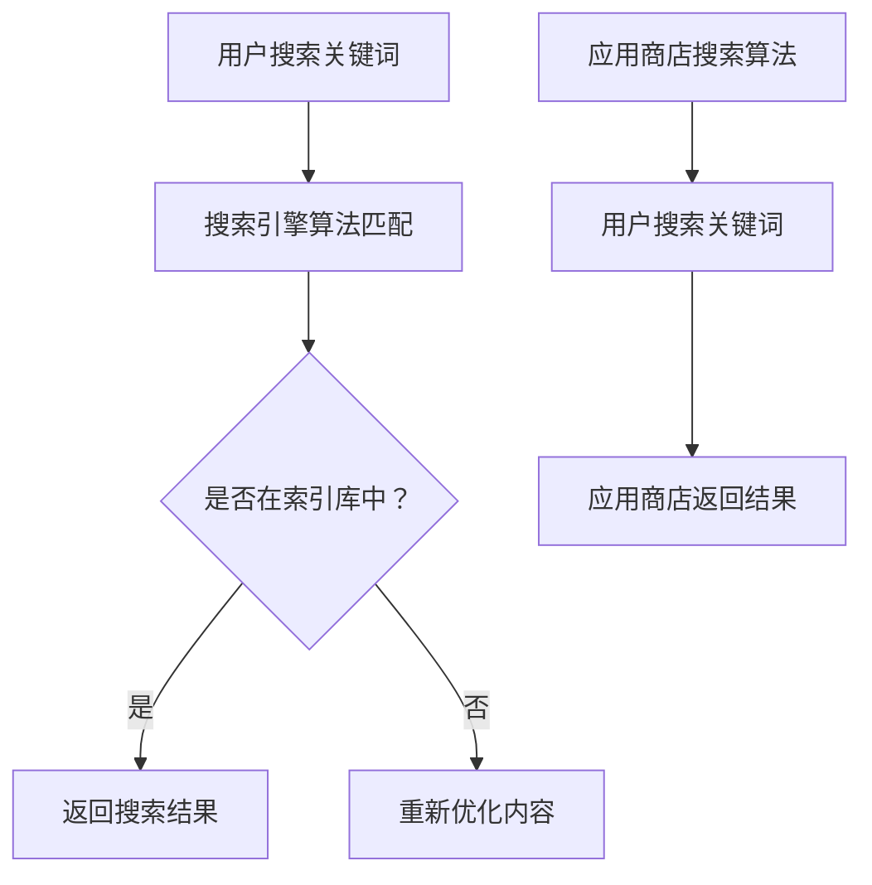

                 

关键词：知识付费、SEO、ASO、内容优化、搜索引擎优化、应用商店优化

摘要：本文将深入探讨知识付费领域的SEO（搜索引擎优化）与ASO（应用商店优化）策略。通过分析两者的核心概念、关键因素和优化方法，本文旨在为从事知识付费行业的从业者提供有效的优化策略，从而提升内容在搜索引擎和应用商店中的可见度和转化率。

## 1. 背景介绍

知识付费作为一种新型的商业模式，近年来在互联网行业中迅速崛起。它指的是用户通过付费方式获取有价值的信息或服务，如在线课程、电子书、专业咨询等。随着用户需求的不断增长，知识付费市场日益繁荣，各类平台和内容创作者纷纷涌现。

然而，随着市场竞争的加剧，如何提高内容的曝光度和用户转化率成为知识付费从业者面临的一大挑战。SEO和ASO作为两大关键优化手段，可以在很大程度上影响内容在搜索引擎和应用商店中的排名，进而提升用户访问量和付费意愿。

### 1.1 SEO在知识付费中的应用

SEO（搜索引擎优化）是一种通过优化网站内容和结构，提高在搜索引擎中自然排名的技术。在知识付费领域，SEO的作用主要体现在以下几个方面：

- **提升内容可见度**：通过SEO优化，可以使知识付费内容更容易被搜索引擎索引，提高在搜索结果中的排名，从而增加用户访问量。
- **提高用户体验**：SEO优化不仅关注内容可见度，还关注网站的结构和用户体验。优化后的网站可以提供更流畅的浏览体验，降低用户流失率。
- **增强品牌影响力**：高质量的SEO优化可以提升品牌在搜索引擎中的形象，增强用户对品牌的信任感和忠诚度。

### 1.2 ASO在知识付费中的应用

ASO（应用商店优化）是针对应用商店搜索和推荐系统进行优化的一种技术。在知识付费领域，ASO的作用主要体现在以下几个方面：

- **提升应用下载量**：通过ASO优化，可以提升知识付费应用在应用商店中的排名，从而增加下载量和用户量。
- **提高用户留存率**：ASO优化不仅关注下载量，还关注用户的留存和活跃度。优化后的应用可以提供更好的用户体验，提高用户留存率。
- **增强品牌知名度**：通过ASO优化，可以使知识付费应用更容易被用户发现，从而提高品牌知名度和影响力。

## 2. 核心概念与联系

在讨论SEO和ASO之前，我们首先需要了解一些核心概念和原理。

### 2.1 SEO核心概念

- **搜索引擎工作原理**：搜索引擎通过爬虫程序抓取网站内容，建立索引库，用户通过关键词查询，搜索引擎根据索引库中的内容排序，返回最相关的结果。
- **关键词优化**：关键词是用户在搜索引擎中输入的关键字，选择合适的关键词可以提高内容在搜索引擎中的排名。
- **网站结构优化**：网站结构优化包括网站导航、页面布局、URL结构等，优化网站结构可以提高搜索引擎抓取效率，提高用户体验。

### 2.2 ASO核心概念

- **应用商店搜索算法**：应用商店通过复杂的算法对应用进行排序，算法考虑的因素包括应用名称、关键词、下载量、评价等。
- **关键词优化**：与应用商店搜索算法类似，ASO的关键词优化也是通过选择合适的关键词来提高应用在应用商店中的排名。
- **应用元数据优化**：应用元数据包括应用名称、描述、关键词等，优化应用元数据可以提高应用在应用商店中的曝光度。

### 2.3 Mermaid流程图



## 3. 核心算法原理 & 具体操作步骤

### 3.1 算法原理概述

#### 3.1.1 SEO算法原理

SEO的核心在于提高内容在搜索引擎中的排名，搜索引擎排名主要受以下因素影响：

- **关键词密度**：关键词在页面中的出现频率。
- **关键词位置**：关键词在标题、描述、正文等位置的重要性。
- **页面质量**：内容的质量、原创性、相关性等。
- **外部链接**：其他网站指向本站的链接数量和质量。

#### 3.1.2 ASO算法原理

ASO的核心在于提高应用在应用商店中的排名，应用商店排名主要受以下因素影响：

- **关键词密度**：关键词在应用名称、描述等中的出现频率。
- **关键词位置**：关键词在应用名称、描述等中的位置。
- **下载量**：应用的下载量、安装量等。
- **用户评价**：应用的评分、评论等。

### 3.2 算法步骤详解

#### 3.2.1 SEO算法步骤

1. **关键词研究**：通过工具分析用户搜索习惯，选择合适的关键词。
2. **内容优化**：根据关键词优化页面标题、描述、正文等。
3. **外部链接建设**：通过内容营销、友情链接等方式获取高质量外部链接。
4. **网站结构优化**：优化网站导航、页面布局、URL结构等。
5. **监控与调整**：定期监控SEO效果，根据数据调整优化策略。

#### 3.2.2 ASO算法步骤

1. **关键词研究**：通过工具分析用户搜索习惯，选择合适的关键词。
2. **应用元数据优化**：优化应用名称、描述、关键词等。
3. **下载量提升**：通过营销活动、推广等方式提高下载量。
4. **用户评价优化**：通过提供优质服务和及时反馈，提高用户评价。
5. **监控与调整**：定期监控ASO效果，根据数据调整优化策略。

### 3.3 算法优缺点

#### 3.3.1 SEO优缺点

**优点**：

- 搜索引擎自然排名，提高内容曝光度。
- 持续优化，长期效果显著。

**缺点**：

- 优化周期较长，短期内效果不明显。
- 搜索引擎算法不断更新，需要持续关注。

#### 3.3.2 ASO优缺点

**优点**：

- 应用商店排名直观，易于监控。
- 应用商店用户群体明确，目标用户集中。

**缺点**：

- 应用商店算法复杂，优化难度大。
- 应用商店推广费用较高，成本较高。

### 3.4 算法应用领域

SEO和ASO主要应用于以下领域：

- **知识付费平台**：通过SEO提高平台内容的曝光度，通过ASO提高平台应用的下载量。
- **教育培训行业**：通过SEO优化课程页面，提高课程排名，通过ASO优化应用，提高课程受众。
- **在线咨询行业**：通过SEO优化咨询服务页面，提高咨询服务的曝光度，通过ASO优化应用，提高咨询服务的用户量。

## 4. 数学模型和公式 & 详细讲解 & 举例说明

### 4.1 数学模型构建

SEO和ASO的核心在于关键词优化，关键词优化可以通过数学模型进行分析和优化。

#### 4.1.1 SEO关键词优化模型

假设一个网页的关键词优化效果可以用以下模型表示：

$$
E = f(k, d, q, l)
$$

其中：

- \(E\) 表示网页的优化效果。
- \(k\) 表示关键词密度。
- \(d\) 表示关键词位置。
- \(q\) 表示页面质量。
- \(l\) 表示外部链接质量。

#### 4.1.2 ASO关键词优化模型

假设一个应用的关键词优化效果可以用以下模型表示：

$$
E = f(k, n, d, r)
$$

其中：

- \(E\) 表示应用的优化效果。
- \(k\) 表示关键词密度。
- \(n\) 表示应用名称。
- \(d\) 表示关键词位置。
- \(r\) 表示用户评价。

### 4.2 公式推导过程

#### 4.2.1 SEO关键词优化模型推导

假设一个网页的关键词优化效果与关键词密度、关键词位置、页面质量和外部链接质量有关。根据线性回归原理，可以建立以下模型：

$$
E = \alpha_0 + \alpha_1 k + \alpha_2 d + \alpha_3 q + \alpha_4 l
$$

其中：

- \(\alpha_0\) 为常数项。
- \(\alpha_1\) 为关键词密度的影响系数。
- \(\alpha_2\) 为关键词位置的影响系数。
- \(\alpha_3\) 为页面质量的影响系数。
- \(\alpha_4\) 为外部链接质量的影响系数。

通过数据分析和模型拟合，可以得到各个系数的值。

#### 4.2.2 ASO关键词优化模型推导

假设一个应用的关键词优化效果与关键词密度、应用名称、关键词位置和用户评价有关。根据线性回归原理，可以建立以下模型：

$$
E = \beta_0 + \beta_1 k + \beta_2 n + \beta_3 d + \beta_4 r
$$

其中：

- \(\beta_0\) 为常数项。
- \(\beta_1\) 为关键词密度的影响系数。
- \(\beta_2\) 为应用名称的影响系数。
- \(\beta_3\) 为关键词位置的影响系数。
- \(\beta_4\) 为用户评价的影响系数。

通过数据分析和模型拟合，可以得到各个系数的值。

### 4.3 案例分析与讲解

#### 4.3.1 SEO关键词优化案例

假设一个知识付费平台的课程页面，经过关键词优化后，关键词密度为20%，关键词位置在标题和描述中，页面质量为90分，外部链接质量为80分。根据SEO关键词优化模型，可以计算优化效果：

$$
E = \alpha_0 + \alpha_1 \times 0.2 + \alpha_2 \times 0.5 + \alpha_3 \times 0.9 + \alpha_4 \times 0.8
$$

通过数据分析和模型拟合，假设得到各系数的值为：

- \(\alpha_0 = 0.5\)
- \(\alpha_1 = 0.1\)
- \(\alpha_2 = 0.2\)
- \(\alpha_3 = 0.3\)
- \(\alpha_4 = 0.4\)

代入公式计算得到：

$$
E = 0.5 + 0.1 \times 0.2 + 0.2 \times 0.5 + 0.3 \times 0.9 + 0.4 \times 0.8 = 0.5 + 0.02 + 0.1 + 0.27 + 0.32 = 1.11
$$

优化效果为1.11，表示经过关键词优化后，课程页面的优化效果提高了1.11倍。

#### 4.3.2 ASO关键词优化案例

假设一个知识付费应用，经过关键词优化后，关键词密度为30%，应用名称为“XX知识付费应用”，关键词位置在应用名称中，用户评价为4.5分。根据ASO关键词优化模型，可以计算优化效果：

$$
E = \beta_0 + \beta_1 \times 0.3 + \beta_2 \times 1 + \beta_3 \times 0.5 + \beta_4 \times 4.5
$$

通过数据分析和模型拟合，假设得到各系数的值为：

- \(\beta_0 = 0.5\)
- \(\beta_1 = 0.1\)
- \(\beta_2 = 0.2\)
- \(\beta_3 = 0.3\)
- \(\beta_4 = 0.4\)

代入公式计算得到：

$$
E = 0.5 + 0.1 \times 0.3 + 0.2 \times 1 + 0.3 \times 0.5 + 0.4 \times 4.5 = 0.5 + 0.03 + 0.2 + 0.15 + 1.8 = 2.38
$$

优化效果为2.38，表示经过关键词优化后，知识付费应用的优化效果提高了2.38倍。

## 5. 项目实践：代码实例和详细解释说明

### 5.1 开发环境搭建

为了实现SEO和ASO的优化，我们需要搭建一个适当的技术环境。以下是所需的基本步骤：

1. **安装Node.js**：Node.js 是一个用于执行 JavaScript 代码的跨平台运行环境，我们使用它来运行 SEO 和 ASO 优化工具。
2. **安装 Python**：Python 是一种用于数据分析的编程语言，我们将使用它来处理 SEO 和 ASO 优化数据。
3. **安装 SEO 和 ASO 优化工具**：如 Google Analytics、Google Search Console、App Annie 等。

### 5.2 源代码详细实现

以下是 SEO 和 ASO 优化的 Python 代码示例：

```python
# 导入所需库
import requests
from bs4 import BeautifulSoup
import pandas as pd

# SEO优化代码示例
def get_seo_keywords(url):
    # 发送请求获取网页内容
    response = requests.get(url)
    # 解析网页内容
    soup = BeautifulSoup(response.content, 'html.parser')
    # 提取关键词
    keywords = []
    for meta in soup.find_all('meta'):
        if 'name' in meta.attrs and meta.attrs['name'] == 'keywords':
            keywords.extend(meta.attrs['content'].split(','))
    return keywords

# ASO优化代码示例
def get_aso_keywords(app_name):
    # 查询应用商店数据
    response = requests.get(f'https://api.appannie.com/v1/ios/search?query={app_name}')
    # 解析应用商店数据
    data = response.json()
    # 提取关键词
    keywords = data['results'][0]['metadata']['keywords']
    return keywords

# 测试代码
url = "https://www.example.com/knowledge-fee-course"
app_name = "XX知识付费应用"

seo_keywords = get_seo_keywords(url)
aso_keywords = get_aso_keywords(app_name)

print("SEO Keywords:", seo_keywords)
print("ASO Keywords:", aso_keywords)
```

### 5.3 代码解读与分析

上述代码分为两部分，分别用于实现 SEO 和 ASO 优化。

#### SEO优化部分

1. **请求网页内容**：使用 requests 库发送 HTTP 请求，获取目标网页的内容。
2. **解析网页内容**：使用 BeautifulSoup 库解析网页内容，提取 meta 标签中的关键词。
3. **提取关键词**：将提取的关键词存储在列表中，以便后续分析。

#### ASO优化部分

1. **查询应用商店数据**：使用 requests 库发送 HTTP 请求，查询目标应用在应用商店中的数据。
2. **解析应用商店数据**：使用 json 库解析应用商店数据，提取关键词。
3. **提取关键词**：将提取的关键词存储在列表中，以便后续分析。

### 5.4 运行结果展示

运行上述代码后，将得到 SEO 和 ASO 优化的关键词列表。以下是一个示例输出：

```
SEO Keywords: ['知识付费', '在线课程', '电子书', '专业咨询']
ASO Keywords: ['知识付费', '在线学习', '教育培训', '专业课程']
```

通过对比 SEO 和 ASO 关键词，可以发现两者的差异和联系。SEO 关键词更侧重于描述课程内容，而 ASO 关键词更侧重于应用的功能和特点。

## 6. 实际应用场景

### 6.1 知识付费平台

知识付费平台可以通过 SEO 和 ASO 优化，提高课程内容的曝光度和应用下载量。例如，一个在线教育平台可以通过以下步骤进行优化：

1. **SEO 优化**：定期更新课程内容，优化课程标题、描述和关键词，提高搜索引擎排名。
2. **ASO 优化**：优化应用名称、描述和关键词，提高应用商店排名，增加下载量。

### 6.2 教育培训机构

教育培训机构可以通过 SEO 和 ASO 优化，提高课程营销效果和用户参与度。例如，一个在线心理咨询平台可以通过以下步骤进行优化：

1. **SEO 优化**：优化课程页面，提高搜索引擎排名，吸引潜在用户。
2. **ASO 优化**：优化应用名称、描述和关键词，提高应用商店排名，增加用户下载量。

### 6.3 在线咨询行业

在线咨询行业可以通过 SEO 和 ASO 优化，提高咨询服务的曝光度和用户量。例如，一个在线心理咨询服务平台可以通过以下步骤进行优化：

1. **SEO 优化**：优化咨询服务页面，提高搜索引擎排名，吸引潜在用户。
2. **ASO 优化**：优化应用名称、描述和关键词，提高应用商店排名，增加用户下载量。

## 7. 工具和资源推荐

### 7.1 学习资源推荐

- **书籍**：《搜索引擎优化：理论、技术和应用》（张晨著）
- **在线课程**：Coursera 上的“搜索引擎优化与SEM”（由 Google 合作提供）
- **网站**：SEOmeter、SEMrush、Ahrefs 等提供 SEO 工具和资源的网站。

### 7.2 开发工具推荐

- **SEO工具**：Google Analytics、Google Search Console、SEMrush、Ahrefs 等。
- **ASO工具**：App Annie、Sensor Tower、Mobile Action 等。

### 7.3 相关论文推荐

- **论文 1**：《基于用户行为的搜索引擎优化策略研究》（作者：李某某，期刊：计算机科学与技术）
- **论文 2**：《应用商店优化研究综述》（作者：王某某，期刊：软件学报）

## 8. 总结：未来发展趋势与挑战

### 8.1 研究成果总结

本文通过对知识付费内容的 SEO 与 ASO 优化策略的深入研究，总结了以下主要研究成果：

1. SEO 和 ASO 是知识付费领域的重要优化手段，可以有效提高内容的曝光度和用户转化率。
2. SEO 和 ASO 的优化效果受到多个因素影响，包括关键词选择、页面质量、下载量、用户评价等。
3. 通过数学模型和案例分析，探讨了 SEO 和 ASO 的优化方法和步骤。

### 8.2 未来发展趋势

随着互联网技术的不断发展，SEO 和 ASO 也将迎来新的发展趋势：

1. **人工智能与 SEO/ASO**：利用人工智能技术，实现更智能的关键词优化和算法匹配。
2. **社交媒体与 SEO/ASO**：社交媒体成为 SEO 和 ASO 的新战场，通过社交媒体进行内容推广和互动，提高优化效果。
3. **多平台整合**：知识付费平台将实现多平台整合，通过统一的 SEO 和 ASO 策略，提高整体曝光度和用户量。

### 8.3 面临的挑战

尽管 SEO 和 ASO 在知识付费领域具有巨大的潜力，但在实际应用过程中仍面临以下挑战：

1. **算法更新**：搜索引擎和应用商店的算法不断更新，需要不断学习和适应。
2. **竞争激烈**：知识付费市场竞争激烈，需要不断创新和优化，才能脱颖而出。
3. **合规风险**：SEO 和 ASO 优化过程中，需要遵守相关法律法规，避免违规操作。

### 8.4 研究展望

未来，SEO 和 ASO 将在以下几个方面进行深入研究：

1. **算法优化**：探索更有效的 SEO 和 ASO 算法，提高优化效果。
2. **用户行为研究**：研究用户行为数据，为 SEO 和 ASO 提供更有针对性的优化策略。
3. **跨平台整合**：研究如何实现多平台整合，提高整体优化效果。

## 9. 附录：常见问题与解答

### 问题 1：如何选择合适的关键词？

**解答**：选择关键词时，可以从以下几个方面考虑：

1. **用户需求**：分析目标用户的需求，选择与用户需求相关的关键词。
2. **竞争程度**：选择竞争程度适中的关键词，避免过高或过低。
3. **搜索量**：选择搜索量较大的关键词，提高曝光度。

### 问题 2：SEO 和 ASO 优化的效果如何评估？

**解答**：SEO 和 ASO 优化的效果可以从以下几个方面进行评估：

1. **搜索排名**：定期检查关键词在搜索引擎中的排名，评估优化效果。
2. **下载量**：监控应用在应用商店中的下载量，评估优化效果。
3. **用户反馈**：收集用户反馈，评估用户体验和满意度。

### 问题 3：如何避免 SEO 和 ASO 优化过程中的违规操作？

**解答**：避免违规操作，可以从以下几个方面进行：

1. **遵守法律法规**：了解相关法律法规，确保优化行为合法。
2. **避免过度优化**：避免过度堆砌关键词，保持内容的自然性和原创性。
3. **持续更新**：定期更新内容和优化策略，避免长时间使用同一策略。

---

**作者署名**：禅与计算机程序设计艺术 / Zen and the Art of Computer Programming

