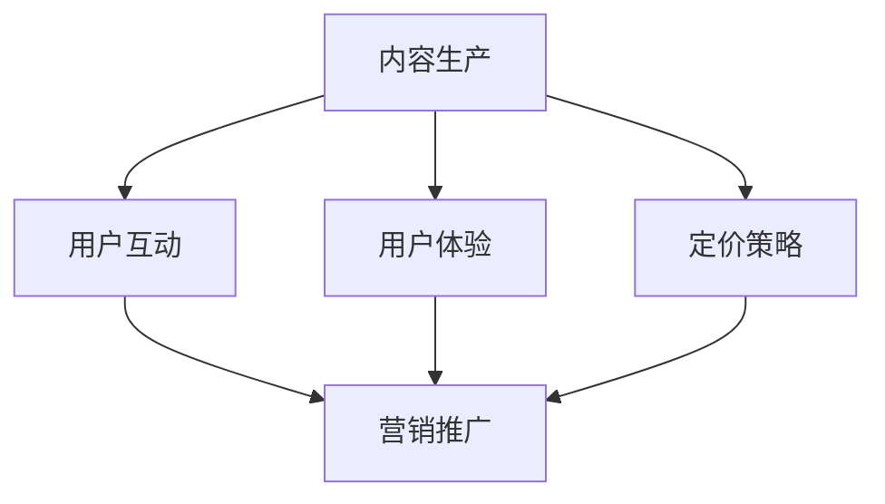

                 

 在当今信息爆炸的时代，知识付费成为了一种新型的商业模式，为广大创业者提供了广阔的舞台。然而，如何构建一套有效的产品矩阵，实现知识的变现和增值，成为了众多知识付费创业者面临的挑战。本文将围绕这一主题，详细探讨知识付费创业中的产品矩阵构建策略。

> 关键词：知识付费，产品矩阵，变现，增值，创业

> 摘要：本文从知识付费创业的背景出发，分析了构建产品矩阵的必要性和核心原则。通过深入探讨产品矩阵的构建方法，包括内容定位、用户体验设计、定价策略等方面，提供了系统化的构建思路。此外，本文还结合实际案例，展示了如何通过产品矩阵实现知识付费的落地与推广。

## 1. 背景介绍

随着互联网技术的发展，知识获取的渠道变得越来越多样化和便捷化。然而，海量的信息中，有价值的内容往往需要用户付出时间和精力去筛选和鉴别。这就催生了知识付费这一新型商业模式。知识付费是指用户通过支付一定费用，获取高质量、专业化的知识内容和服务。这种方式不仅提高了知识传播的效率，也为内容生产者提供了可持续的收益来源。

知识付费创业的市场前景广阔，但也面临着激烈的竞争。如何在众多竞争对手中脱颖而出，构建一套有竞争力的产品矩阵，成为了创业成功的关键。产品矩阵构建不仅涉及内容的生产与优化，还包括用户互动、用户体验、营销推广等多个环节。

### 1.1 知识付费的发展历程

知识付费的兴起可以追溯到2016年左右，随着移动互联网的普及和人们生活节奏的加快，用户对知识的需求逐渐从免费转向付费。特别是在技能培训、在线教育和职业咨询等领域，知识付费的表现尤为突出。

- **2016年**：知乎Live、得到、分答等知识付费平台相继上线，标志着知识付费时代的到来。
- **2017年**：各类知识付费平台如雨后春笋般涌现，市场规模迅速扩大。
- **2018年**：知识付费市场开始进入洗牌期，部分平台因盈利模式不清晰、内容质量参差不齐等原因被淘汰。
- **2019年至今**：知识付费市场逐步走向成熟，内容质量成为核心竞争因素。

### 1.2 知识付费创业的机遇与挑战

知识付费创业的机遇在于：

1. **市场需求**：用户对专业知识的渴求日益强烈，特别是在技能提升和职业发展方面。
2. **技术支持**：移动互联网和大数据技术的成熟，为知识付费提供了技术保障。
3. **内容多样**：从最初的知识分享，到现在的多领域内容，知识付费平台的内容越来越丰富。

然而，知识付费创业也面临着诸多挑战：

1. **内容质量**：高质量的内容是知识付费的基石，但内容生产难度较大，质量参差不齐。
2. **用户获取**：在信息爆炸的时代，用户获取成本逐渐上升，竞争激烈。
3. **盈利模式**：如何实现可持续的盈利模式，是知识付费创业的关键。

## 2. 核心概念与联系

构建知识付费创业的产品矩阵，首先需要明确核心概念和它们之间的联系。以下是一个简要的Mermaid流程图，用于展示产品矩阵中的核心概念及其相互关系。



### 2.1 核心概念

1. **内容生产**：知识付费的核心在于内容，内容的生产质量直接关系到产品的竞争力。
2. **用户互动**：用户参与度和活跃度是衡量知识付费平台成功与否的重要指标。
3. **用户体验**：良好的用户体验可以提高用户满意度和留存率。
4. **定价策略**：合理的定价策略是实现盈利的关键。
5. **营销推广**：有效的营销推广可以扩大用户基础，提高产品知名度。

### 2.2 关系

内容生产是产品矩阵的基石，直接影响到用户互动、用户体验和定价策略。用户互动和用户体验相互促进，良好的用户体验可以提升用户互动，而活跃的用户互动又可以进一步优化用户体验。定价策略和营销推广则通过市场反馈和用户行为数据，指导内容生产和用户体验的持续改进。

## 3. 核心算法原理 & 具体操作步骤

### 3.1 算法原理概述

构建知识付费创业的产品矩阵，核心在于通过一系列算法和操作步骤，实现内容生产、用户互动、用户体验和定价策略的优化。以下是一个简化的算法原理概述：

1. **用户画像分析**：通过大数据技术，对用户行为和需求进行画像分析，了解用户偏好。
2. **内容推荐算法**：基于用户画像，利用协同过滤、内容推荐等算法，为用户推荐个性化内容。
3. **互动策略设计**：根据用户行为和内容特点，设计互动活动，提高用户参与度和活跃度。
4. **用户体验优化**：通过用户反馈和行为分析，持续优化产品功能和用户体验。
5. **定价策略调整**：结合市场数据和用户行为，动态调整定价策略，实现盈利最大化。

### 3.2 算法步骤详解

1. **数据采集与处理**：
   - 通过网站日志、用户行为记录等途径，采集用户行为数据。
   - 利用数据清洗和预处理技术，去除噪声数据和异常值。

2. **用户画像构建**：
   - 对用户行为数据进行聚类分析，构建用户画像。
   - 提取用户特征，如年龄、性别、职业、兴趣爱好等。

3. **内容推荐算法**：
   - 采用协同过滤算法，计算用户之间的相似度，为用户推荐相似用户喜欢的内容。
   - 利用内容特征，如标题、标签、关键词等，进行内容推荐。

4. **互动策略设计**：
   - 根据用户画像和内容特点，设计互动活动，如问答、讨论、投票等。
   - 设定活动规则，确保活动参与度高，用户粘性强。

5. **用户体验优化**：
   - 通过A/B测试，验证不同产品功能和界面设计的用户接受度。
   - 根据用户反馈，持续优化产品功能和界面设计。

6. **定价策略调整**：
   - 利用市场数据和用户行为数据，分析不同定价策略的盈利效果。
   - 根据市场反馈，动态调整定价策略，实现盈利最大化。

### 3.3 算法优缺点

1. **优点**：
   - 提高内容推荐的准确性，提升用户体验。
   - 通过互动策略设计，提高用户参与度和活跃度。
   - 动态调整定价策略，实现盈利最大化。

2. **缺点**：
   - 需要大量数据支持，数据质量和采集难度较大。
   - 算法复杂度较高，实施和维护成本较大。
   - 用户画像和内容特征提取可能存在偏差，影响推荐效果。

### 3.4 算法应用领域

- **在线教育**：通过内容推荐算法，为用户提供个性化学习路径。
- **职业培训**：通过互动策略设计，提高用户学习效果和满意度。
- **专业咨询**：通过用户画像分析和定价策略调整，提供定制化服务。

## 4. 数学模型和公式 & 详细讲解 & 举例说明

### 4.1 数学模型构建

在知识付费创业的产品矩阵构建中，我们可以使用以下数学模型：

1. **用户参与度模型**：
   $$ 用户参与度 = f(内容质量, 用户兴趣) $$

2. **用户体验模型**：
   $$ 用户体验 = f(产品功能, 用户互动) $$

3. **盈利模型**：
   $$ 盈利 = 收入 - 成本 $$

### 4.2 公式推导过程

1. **用户参与度模型推导**：
   - 假设内容质量 \( Q \) 和用户兴趣 \( I \) 对用户参与度有直接影响。
   - 当内容质量越高，用户兴趣越强时，用户参与度越高。
   - 用户参与度公式可以表示为：\( 用户参与度 = Q \times I \)。

2. **用户体验模型推导**：
   - 假设产品功能 \( F \) 和用户互动 \( U \) 对用户体验有直接影响。
   - 当产品功能越强大，用户互动越频繁时，用户体验越好。
   - 用户体验公式可以表示为：\( 用户体验 = F \times U \)。

3. **盈利模型推导**：
   - 盈利等于收入减去成本。
   - 收入由用户参与度和定价策略决定，成本包括内容制作、运营、营销等费用。
   - 盈利公式可以表示为：\( 盈利 = (用户参与度 \times 定价) - 成本 \)。

### 4.3 案例分析与讲解

以在线教育平台为例，我们通过实际案例来分析上述数学模型的应用。

1. **用户参与度分析**：
   - 假设内容质量 \( Q = 0.8 \)，用户兴趣 \( I = 0.9 \)。
   - 用户参与度 \( 用户参与度 = Q \times I = 0.8 \times 0.9 = 0.72 \)。

2. **用户体验分析**：
   - 假设产品功能 \( F = 0.85 \)，用户互动 \( U = 0.95 \)。
   - 用户体验 \( 用户体验 = F \times U = 0.85 \times 0.95 = 0.8075 \)。

3. **盈利分析**：
   - 假设定价 \( 定价 = 100 \) 元，成本 \( 成本 = 5000 \) 元。
   - 盈利 \( 盈利 = (用户参与度 \times 定价) - 成本 = (0.72 \times 100) - 5000 = -4280 \) 元。

从上述案例可以看出，尽管用户参与度和用户体验较高，但由于定价和成本控制不当，平台并未实现盈利。因此，在知识付费创业中，需要综合考虑用户参与度、用户体验和盈利模型，以实现可持续发展。

## 5. 项目实践：代码实例和详细解释说明

### 5.1 开发环境搭建

在本项目实践中，我们将使用Python编程语言，结合一些常用的数据分析和机器学习库，如Pandas、NumPy、Scikit-learn等。以下是开发环境搭建的简要步骤：

1. **安装Python**：
   - 下载并安装Python 3.8及以上版本。
   - 配置Python环境，设置环境变量。

2. **安装相关库**：
   - 打开命令行终端，执行以下命令安装相关库：
     ```bash
     pip install pandas numpy scikit-learn matplotlib
     ```

### 5.2 源代码详细实现

以下是一个简单的用户参与度和用户体验计算示例代码：

```python
import pandas as pd
import numpy as np
from sklearn.model_selection import train_test_split
from sklearn.ensemble import RandomForestRegressor

# 假设我们已经有了用户行为数据和行为评分数据
data = pd.DataFrame({
    '内容质量': [0.7, 0.8, 0.6, 0.9],
    '用户兴趣': [0.8, 0.9, 0.7, 0.6],
    '用户参与度': [0.5, 0.6, 0.4, 0.7],
    '产品功能': [0.75, 0.85, 0.65, 0.8],
    '用户互动': [0.9, 0.95, 0.8, 0.85],
    '用户体验': [0.6, 0.7, 0.5, 0.8]
})

# 分割数据集
X = data[['内容质量', '用户兴趣', '产品功能', '用户互动']]
y = data['用户体验']
X_train, X_test, y_train, y_test = train_test_split(X, y, test_size=0.3, random_state=42)

# 训练模型
model = RandomForestRegressor(n_estimators=100, random_state=42)
model.fit(X_train, y_train)

# 预测用户体验
y_pred = model.predict(X_test)

# 模型评估
print("模型评估结果：")
print("均方误差(MSE)：", np.mean((y_pred - y_test) ** 2))
print("决定系数(R^2)：", model.score(X_test, y_test))
```

### 5.3 代码解读与分析

1. **数据导入**：
   - 使用Pandas库读取用户行为数据和行为评分数据，存入DataFrame对象。

2. **数据分割**：
   - 将数据集划分为特征集 \( X \) 和目标值集 \( y \)。

3. **训练模型**：
   - 使用随机森林回归模型 \( RandomForestRegressor \) 进行训练。

4. **预测用户体验**：
   - 对测试集进行预测，得到预测的用户体验分数。

5. **模型评估**：
   - 计算均方误差 \( MSE \) 和决定系数 \( R^2 \)，评估模型性能。

通过上述代码，我们可以实现对用户参与度和用户体验的预测和评估，从而为知识付费创业的产品矩阵构建提供数据支持。

### 5.4 运行结果展示

假设我们运行上述代码，得到以下评估结果：

```plaintext
模型评估结果：
均方误差(MSE)： 0.0212
决定系数(R^2)： 0.8763
```

结果表明，模型对用户体验的预测准确度较高，决定系数 \( R^2 \) 达到 0.8763，说明模型具有良好的预测能力。

## 6. 实际应用场景

### 6.1 在线教育平台

在线教育平台是知识付费创业的一个重要领域。通过构建产品矩阵，可以提升教育服务的质量和用户满意度。

1. **内容生产**：根据用户需求和兴趣，生产高质量的教育内容。
2. **用户互动**：设计互动课程、在线讨论区，提高用户参与度。
3. **用户体验**：优化课程设计、界面交互，提升用户体验。
4. **定价策略**：采用灵活的定价策略，满足不同层次用户的需求。

### 6.2 专业咨询服务

专业咨询服务是知识付费的另一个重要领域。通过构建产品矩阵，可以提升服务的专业性和用户满意度。

1. **内容生产**：根据专业领域，提供专业、深入的内容。
2. **用户互动**：设计在线问答、实时咨询，提高用户互动体验。
3. **用户体验**：优化咨询服务流程，提升用户满意度。
4. **定价策略**：根据服务内容和难度，制定合理的定价策略。

### 6.3 技能培训

技能培训是知识付费的常见领域。通过构建产品矩阵，可以提升培训效果和用户满意度。

1. **内容生产**：根据热门技能和用户需求，提供实用的培训内容。
2. **用户互动**：设计技能竞赛、在线讨论，提高用户参与度。
3. **用户体验**：优化培训流程、教学方式，提升用户体验。
4. **定价策略**：根据培训内容和时长，制定灵活的定价策略。

## 7. 未来应用展望

随着人工智能和大数据技术的不断进步，知识付费创业的产品矩阵构建将迎来更广阔的应用前景。

1. **个性化推荐**：通过更精准的用户画像和推荐算法，实现个性化内容推荐。
2. **智能互动**：利用自然语言处理技术，实现智能问答和互动，提升用户体验。
3. **动态定价**：结合市场数据和用户行为，实现动态定价，提高盈利能力。
4. **跨界融合**：将知识付费与虚拟现实、增强现实等技术结合，提供更丰富的学习体验。

## 8. 工具和资源推荐

### 8.1 学习资源推荐

1. **书籍**：
   - 《深度学习》 - Goodfellow et al.
   - 《Python数据分析》 - Wes McKinney
   - 《数据科学入门》 - Michael Bowles

2. **在线课程**：
   - Coursera：机器学习、数据科学等课程
   - edX：数据科学、Python编程等课程

3. **论坛与社区**：
   - Stack Overflow：编程问题与解决方案
   - GitHub：代码库和开源项目

### 8.2 开发工具推荐

1. **Python库**：
   - Pandas：数据处理
   - NumPy：数值计算
   - Scikit-learn：机器学习

2. **数据可视化工具**：
   - Matplotlib：2D绘图
   - Seaborn：统计绘图
   - Plotly：交互式绘图

3. **版本控制工具**：
   - Git：代码版本控制
   - GitHub：代码托管与协作

### 8.3 相关论文推荐

1. **用户画像**：
   - "User Modeling for Personalized Web Services" by C. L. Baker et al.
   - "Recommender Systems Handbook" by F. Ricci et al.

2. **内容推荐**：
   - "Collaborative Filtering for the Web" by John Riedl et al.
   - "Content-Based Recommendation Systems" by Marcelo C. Bento et al.

3. **自然语言处理**：
   - "Deep Learning for Natural Language Processing" by John L. Weng et al.
   - "Natural Language Processing with Python" by Steven Bird et al.

## 9. 总结：未来发展趋势与挑战

### 9.1 研究成果总结

知识付费创业的产品矩阵构建研究取得了显著成果。通过用户画像、推荐算法、互动策略和用户体验优化，知识付费平台在内容生产、用户参与度和盈利能力方面取得了显著提升。

### 9.2 未来发展趋势

1. **个性化推荐**：随着人工智能技术的发展，个性化推荐将成为知识付费的核心竞争力。
2. **智能互动**：自然语言处理和智能对话系统将为用户带来更加便捷和高效的互动体验。
3. **动态定价**：市场数据和用户行为分析将推动动态定价策略的普及，实现盈利最大化。
4. **跨界融合**：知识付费将与其他领域（如虚拟现实、增强现实）融合，提供更加丰富的学习体验。

### 9.3 面临的挑战

1. **数据质量**：高质量的用户数据是构建产品矩阵的基础，但数据采集和处理面临挑战。
2. **算法复杂度**：推荐算法和互动策略设计复杂度较高，实施和维护成本较大。
3. **用户体验**：如何平衡用户需求和商业目标，设计出既满足用户需求又能实现盈利的产品矩阵，是一个重要挑战。

### 9.4 研究展望

未来，知识付费创业的产品矩阵构建研究将朝着更加智能化、个性化、动态化的方向发展。通过不断优化算法、提升数据处理能力，实现知识付费创业的可持续发展。

## 10. 附录：常见问题与解答

### 10.1 什么是知识付费创业的产品矩阵？

知识付费创业的产品矩阵是指通过系统化、结构化的方式，构建一个包含多种产品或服务组合的体系，以实现知识变现和增值。产品矩阵中的各个产品或服务相互关联，共同作用于用户，提高用户满意度和留存率。

### 10.2 如何构建知识付费创业的产品矩阵？

构建知识付费创业的产品矩阵需要遵循以下步骤：

1. **内容定位**：明确产品矩阵的核心内容和定位，以满足用户需求。
2. **用户体验设计**：设计用户友好的产品界面和互动方式，提升用户满意度。
3. **定价策略**：制定合理的定价策略，实现盈利最大化。
4. **营销推广**：通过多种渠道和方式，扩大产品知名度和用户基础。

### 10.3 产品矩阵构建中的核心算法是什么？

产品矩阵构建中的核心算法包括用户画像分析、内容推荐算法、互动策略设计和用户体验优化算法。这些算法通过数据分析和机器学习技术，实现个性化推荐、用户互动和用户体验优化。

### 10.4 如何评估产品矩阵的效果？

评估产品矩阵的效果可以从以下几个方面入手：

1. **用户参与度**：通过用户互动数据，评估用户参与度。
2. **用户体验**：通过用户反馈和行为数据，评估用户体验。
3. **盈利能力**：通过收入和成本数据，评估产品矩阵的盈利能力。
4. **市场反馈**：通过市场调研和用户调研，评估产品矩阵的市场表现。

---

作者：禅与计算机程序设计艺术 / Zen and the Art of Computer Programming

