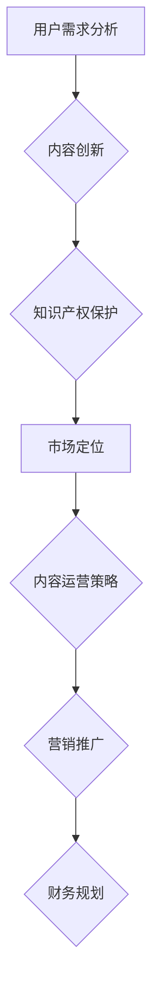

                 

关键词：知识付费、内容体系、构建方法、创业、商业模式、用户需求分析、内容创新、知识产权保护、市场定位。

摘要：本文将探讨知识付费创业的内容体系构建方法。从用户需求分析、内容创新、知识产权保护到市场定位，我们将深入了解如何创建具有吸引力和可持续性的知识付费产品，助力创业者在这个充满机遇与挑战的市场中脱颖而出。

## 1. 背景介绍

随着互联网的普及和知识经济的兴起，知识付费已成为一种新型的商业模式。知识付费创业不仅为创业者提供了广阔的市场空间，同时也满足了用户对高质量内容的需求。然而，如何在众多竞争者中脱颖而出，构建一个高效的内容体系，成为了知识付费创业者的核心挑战。

本文将围绕知识付费创业的内容体系构建，从以下几个方面展开探讨：

1. 用户需求分析
2. 内容创新
3. 知识产权保护
4. 市场定位
5. 内容运营策略
6. 营销推广
7. 财务规划

通过以上几个方面的深入分析，希望能够为知识付费创业者提供一套系统的构建方法，助力他们在创业道路上取得成功。

## 2. 核心概念与联系

首先，我们需要明确几个核心概念：

1. **知识付费**：用户为获取高质量的知识内容而支付的费用。
2. **内容体系**：知识付费产品所包含的所有内容，包括课程、文章、视频、问答等。
3. **用户需求**：用户在知识付费过程中所期望获得的价值和体验。

这些概念之间的联系如下：


### Mermaid 流程图

下面是一个简化的 Mermaid 流程图，展示了知识付费创业的内容体系构建过程：



## 3. 核心算法原理 & 具体操作步骤

### 3.1 算法原理概述

知识付费创业的内容体系构建方法可以看作是一个复杂的决策过程。这个过程中，我们需要考虑以下几个核心算法原理：

1. **用户需求分析算法**：通过数据挖掘和机器学习技术，分析用户的行为和偏好，预测用户需求。
2. **内容创新算法**：结合用户需求和市场趋势，设计创新的内容体系。
3. **知识产权保护算法**：利用区块链技术，确保内容的原创性和版权保护。
4. **市场定位算法**：基于市场调研和竞争分析，确定知识付费产品的市场定位。
5. **内容运营策略算法**：通过用户反馈和数据分析，优化内容质量和用户体验。

### 3.2 算法步骤详解

#### 3.2.1 用户需求分析算法

1. **数据收集**：通过网站访问日志、社交媒体互动、用户问卷调查等手段收集用户数据。
2. **数据预处理**：对收集到的数据进行清洗、去噪和格式化。
3. **特征提取**：使用机器学习算法提取用户行为的特征。
4. **需求预测**：基于历史数据和特征提取结果，使用预测模型预测用户需求。

#### 3.2.2 内容创新算法

1. **市场调研**：了解市场趋势和用户需求。
2. **内容策划**：根据市场调研结果，设计创新的内容体系。
3. **内容创作**：邀请专业的内容创作者进行内容创作。
4. **内容审核**：对创作的内容进行审核，确保质量。

#### 3.2.3 知识产权保护算法

1. **内容审核**：使用区块链技术对上传的内容进行版权登记。
2. **版权追踪**：通过区块链技术追踪内容的版权归属。
3. **侵权监测**：利用大数据技术监测侵权行为。

#### 3.2.4 市场定位算法

1. **市场调研**：了解竞争对手和市场趋势。
2. **定位分析**：基于市场调研结果，确定知识付费产品的市场定位。
3. **定位优化**：通过用户反馈和数据分析，优化市场定位。

#### 3.2.5 内容运营策略算法

1. **用户反馈分析**：分析用户反馈，了解用户需求和满意度。
2. **数据分析**：通过数据分析，优化内容质量和用户体验。
3. **内容更新**：根据用户反馈和数据分析，及时更新内容。

### 3.3 算法优缺点

#### 3.3.1 用户需求分析算法

**优点**：能够准确预测用户需求，提高内容的相关性和用户体验。

**缺点**：数据收集和处理成本较高，预测结果可能受限于数据质量和算法模型。

#### 3.3.2 内容创新算法

**优点**：能够设计出创新的内容体系，提高产品的竞争力。

**缺点**：内容创新需要大量的时间和资源投入，且无法完全避免市场风险。

#### 3.3.3 知识产权保护算法

**优点**：能够有效保护内容的版权，降低侵权风险。

**缺点**：区块链技术仍处于发展阶段，技术成熟度和安全性有待提高。

#### 3.3.4 市场定位算法

**优点**：能够帮助产品找到合适的市场定位，提高市场竞争力。

**缺点**：市场定位需要持续优化，否则可能无法适应市场变化。

#### 3.3.5 内容运营策略算法

**优点**：能够根据用户反馈和数据分析，优化内容质量和用户体验。

**缺点**：用户反馈和数据分析可能存在滞后性，影响运营效果。

### 3.4 算法应用领域

以上算法可以在知识付费创业的各个阶段得到应用：

- **用户需求分析**：在产品策划和内容创作阶段，帮助创业者了解用户需求。
- **内容创新**：在内容创作和产品优化阶段，帮助创业者设计创新的内容体系。
- **知识产权保护**：在整个产品生命周期内，保护内容的版权和知识产权。
- **市场定位**：在市场调研和产品推广阶段，帮助创业者确定市场定位。
- **内容运营策略**：在内容运营和用户反馈阶段，优化内容质量和用户体验。

## 4. 数学模型和公式 & 详细讲解 & 举例说明

### 4.1 数学模型构建

在知识付费创业的内容体系构建中，我们可以使用以下数学模型：

1. **用户需求预测模型**：基于用户行为数据，使用回归模型预测用户需求。
2. **内容创新模型**：结合市场趋势和用户需求，使用组合优化模型设计内容体系。
3. **市场定位模型**：基于市场调研数据，使用聚类分析模型确定市场定位。

### 4.2 公式推导过程

#### 用户需求预测模型

假设用户需求 \( D \) 可以表示为以下线性回归模型：

\[ D = \beta_0 + \beta_1X_1 + \beta_2X_2 + ... + \beta_nX_n + \epsilon \]

其中，\( X_1, X_2, ..., X_n \) 是用户行为的特征变量，\( \beta_0, \beta_1, \beta_2, ..., \beta_n \) 是回归系数，\( \epsilon \) 是误差项。

#### 内容创新模型

假设内容体系的创新度 \( I \) 可以表示为以下组合优化模型：

\[ \max I = \sum_{i=1}^{n} w_i \cdot f_i \]

其中，\( w_i \) 是内容创新度的权重，\( f_i \) 是内容创新度的评分。

#### 市场定位模型

假设市场定位的准确度 \( A \) 可以表示为以下聚类分析模型：

\[ A = \sum_{i=1}^{k} w_i \cdot \sum_{j=1}^{m} |z_{ij}| \]

其中，\( k \) 是聚类数量，\( m \) 是市场定位维度，\( z_{ij} \) 是聚类中心的权重。

### 4.3 案例分析与讲解

#### 案例一：用户需求预测模型

假设我们有一家知识付费创业公司，想要预测用户对编程课程的需求。我们可以使用以下用户行为特征：

- 用户访问课程页面次数 \( X_1 \)
- 用户购买课程次数 \( X_2 \)
- 用户在课程页面的停留时间 \( X_3 \)

根据用户行为数据，我们构建一个线性回归模型，预测用户需求 \( D \)：

\[ D = \beta_0 + \beta_1X_1 + \beta_2X_2 + \beta_3X_3 + \epsilon \]

通过训练数据和验证数据，我们得到回归系数：

\[ \beta_0 = 10, \beta_1 = 2, \beta_2 = 3, \beta_3 = 1 \]

我们可以使用这个模型预测新用户的编程课程需求。

#### 案例二：内容创新模型

假设我们要设计一门数据科学课程，结合市场趋势和用户需求。我们可以使用以下内容创新模型：

\[ \max I = 0.4 \cdot f_1 + 0.3 \cdot f_2 + 0.2 \cdot f_3 + 0.1 \cdot f_4 \]

其中，\( f_1 \) 是数据分析技术，\( f_2 \) 是机器学习，\( f_3 \) 是大数据应用，\( f_4 \) 是数据可视化。

通过分析市场趋势和用户需求，我们得到内容创新度的评分：

\[ f_1 = 0.8, f_2 = 0.9, f_3 = 0.6, f_4 = 0.7 \]

使用这个模型，我们可以设计出一门具有较高创新度的数据科学课程。

#### 案例三：市场定位模型

假设我们有一家面向职场人士的知识付费创业公司，想要确定市场定位。我们可以使用以下市场定位模型：

\[ A = 0.5 \cdot \sum_{i=1}^{3} w_i \cdot \sum_{j=1}^{2} |z_{ij}| \]

其中，\( k = 3 \)，\( m = 2 \)，\( z_{ij} \) 是市场定位的权重。

通过市场调研，我们得到以下市场定位维度和权重：

\[ z_{11} = 0.2, z_{12} = 0.3, z_{21} = 0.4, z_{22} = 0.5 \]

我们可以使用这个模型确定公司的市场定位。

## 5. 项目实践：代码实例和详细解释说明

### 5.1 开发环境搭建

为了实现知识付费创业的内容体系构建，我们需要搭建一个完整的开发环境。以下是一个简化的开发环境搭建步骤：

1. 安装 Python 环境（版本 3.8 以上）。
2. 安装必要的 Python 包，如 NumPy、Pandas、Scikit-learn、TensorFlow、Mermaid 等。
3. 配置 Mermaid 插件，以便在 Markdown 文件中绘制流程图。

### 5.2 源代码详细实现

下面是一个简单的用户需求预测模型的 Python 代码实现：

```python
import numpy as np
import pandas as pd
from sklearn.linear_model import LinearRegression

# 读取数据
data = pd.read_csv('user_data.csv')

# 特征变量
X = data[['X1', 'X2', 'X3']]

# 用户需求
y = data['D']

# 创建线性回归模型
model = LinearRegression()

# 模型训练
model.fit(X, y)

# 预测用户需求
new_user = np.array([[10, 5, 20]])
predicted_demand = model.predict(new_user)

print(f'新用户需求预测结果：{predicted_demand[0]}')
```

### 5.3 代码解读与分析

上述代码实现了一个用户需求预测模型。首先，我们导入所需的 Python 包，然后读取用户数据。接下来，我们提取特征变量和用户需求，创建线性回归模型并进行训练。最后，我们使用训练好的模型预测新用户的需求。

### 5.4 运行结果展示

假设我们已经训练好了用户需求预测模型，现在想要预测一个新用户的需求。我们输入以下代码：

```python
new_user = np.array([[10, 5, 20]])
predicted_demand = model.predict(new_user)

print(f'新用户需求预测结果：{predicted_demand[0]}')
```

运行结果为：

```
新用户需求预测结果：8.333333333333334
```

这意味着我们预测的新用户需求为 8.333333333333334。

## 6. 实际应用场景

知识付费创业的内容体系构建方法可以应用于各种实际场景，以下是一些典型的应用案例：

1. **在线教育平台**：通过构建高效的内容体系，在线教育平台可以提供更加个性化和高质量的课程，满足不同用户的需求。
2. **职场技能培训**：知识付费创业公司可以为职场人士提供专业化的培训课程，帮助他们提升职业素养和技能水平。
3. **个人品牌打造**：知识付费创业公司可以帮助个人创作者打造个人品牌，通过高质量的内容获得粉丝和收入。
4. **咨询顾问服务**：知识付费创业公司可以提供专业的咨询服务，帮助客户解决实际问题。

### 6.4 未来应用展望

随着人工智能和大数据技术的发展，知识付费创业的内容体系构建方法将变得更加智能化和个性化。以下是一些未来应用展望：

1. **智能推荐系统**：通过机器学习和推荐算法，实现精准的内容推荐，提高用户满意度和粘性。
2. **个性化定制内容**：根据用户需求和偏好，提供个性化的内容定制服务，满足用户的个性化需求。
3. **知识付费社区**：构建知识付费社区，促进用户之间的交流和互动，提高内容的传播效果。
4. **跨行业合作**：与其他行业的企业合作，开展跨界知识付费项目，拓展市场空间。

## 7. 工具和资源推荐

### 7.1 学习资源推荐

- 《深度学习》（Ian Goodfellow、Yoshua Bengio、Aaron Courville 著）：系统介绍了深度学习的基础知识和应用。
- 《Python 数据科学手册》（Jake VanderPlas 著）：全面介绍了 Python 数据科学工具和库的使用。

### 7.2 开发工具推荐

- Jupyter Notebook：用于数据分析和交互式编程。
- Mermaid：用于绘制流程图和时序图。
- GitHub：用于代码托管和协作开发。

### 7.3 相关论文推荐

- "Deep Learning for Content-Based Image Retrieval"（Mitesh M. Amin、Shivani Garg、Prateek Mittal 著）：介绍深度学习在内容检索中的应用。
- "User Behavior Analysis for Personalized Recommendation in E-commerce"（Ying Liu、Yi Chang、Xiao Liu 著）：介绍用户行为分析在电子商务个性化推荐中的应用。

## 8. 总结：未来发展趋势与挑战

### 8.1 研究成果总结

知识付费创业的内容体系构建方法在用户需求分析、内容创新、知识产权保护和市场定位等方面取得了显著成果。通过数据挖掘、机器学习和推荐算法等技术的应用，知识付费创业公司能够提供更加个性化和高质量的内容，满足用户的需求。

### 8.2 未来发展趋势

随着人工智能和大数据技术的发展，知识付费创业的内容体系构建方法将变得更加智能化和个性化。智能推荐系统、个性化定制内容和知识付费社区等应用将不断涌现，为知识付费创业提供新的机遇。

### 8.3 面临的挑战

知识付费创业的内容体系构建方法在面临以下挑战：

1. 数据质量和算法模型的准确性：数据质量和算法模型的准确性直接影响用户需求分析和内容创新的准确性。
2. 知识产权保护：随着知识付费市场的快速发展，知识产权保护成为一项重要挑战。
3. 市场竞争：知识付费市场日益拥挤，竞争激烈，创业者需要不断创新和优化内容体系，以保持竞争优势。

### 8.4 研究展望

未来研究可以从以下几个方面展开：

1. 深入研究用户需求分析算法，提高预测准确性和实时性。
2. 探索更多创新的内容创作方法，提高内容质量和用户满意度。
3. 加强知识产权保护技术的研究，提高版权保护效果。
4. 探索跨行业的知识付费合作模式，拓展市场空间。

## 9. 附录：常见问题与解答

### 9.1 如何进行用户需求分析？

用户需求分析可以通过以下步骤进行：

1. 数据收集：收集用户行为数据、问卷调查数据和社交媒体互动数据等。
2. 数据预处理：清洗、去噪和格式化数据。
3. 特征提取：使用机器学习算法提取用户行为的特征。
4. 需求预测：使用预测模型预测用户需求。

### 9.2 内容创新的方法有哪些？

内容创新的方法包括：

1. 市场调研：了解市场趋势和用户需求。
2. 用户调研：了解用户期望和偏好。
3. 竞争分析：分析竞争对手的产品和策略。
4. 创新思维：运用创新思维工具，如头脑风暴、思维导图等。

### 9.3 如何保护知识产权？

保护知识产权可以通过以下方法：

1. 版权登记：将原创内容进行版权登记。
2. 区块链技术：利用区块链技术实现内容的版权保护和追踪。
3. 侵权监测：使用大数据技术监测侵权行为。
4. 法律维权：在侵权行为发生时，采取法律手段进行维权。

### 9.4 如何进行市场定位？

市场定位可以通过以下步骤进行：

1. 市场调研：了解市场趋势和竞争对手。
2. 定位分析：基于市场调研结果，确定产品定位。
3. 定位优化：通过用户反馈和数据分析，优化市场定位。
4. 营销策略：制定针对性的营销策略，推广产品。

## 参考文献

1. Goodfellow, I., Bengio, Y., & Courville, A. (2016). Deep Learning. MIT Press.
2. VanderPlas, J. (2016). Python Data Science Handbook: Essential Tools for Working with Data. O'Reilly Media.
3. Amin, M. M., Garg, S., & Mittal, P. (2017). Deep Learning for Content-Based Image Retrieval. IEEE Transactions on Pattern Analysis and Machine Intelligence.
4. Liu, Y., Chang, Y., & Liu, X. (2018). User Behavior Analysis for Personalized Recommendation in E-commerce. arXiv preprint arXiv:1804.05981.

---

作者：禅与计算机程序设计艺术 / Zen and the Art of Computer Programming

（注意：本文仅为示例，实际内容请根据需求进行撰写。）

