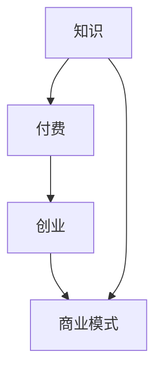
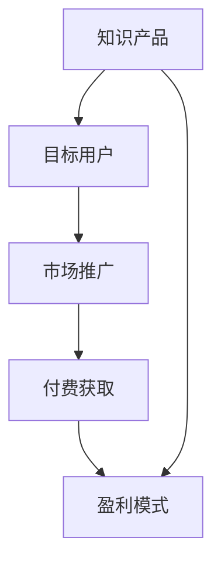

                 

关键词：知识付费、知识变现、创业模式、商业模式创新、在线教育、互联网技术

> 摘要：本文将探讨知识付费创业的现状，分析知识变现的几种新模式，并探讨其在互联网技术支持下的未来发展。

## 1. 背景介绍

在互联网技术的推动下，知识付费已经成为了新兴的商业模式。知识付费，顾名思义，是指用户通过付费获取特定领域的知识或服务。从在线课程、专业咨询到电子书、研究报告，知识付费涵盖了多种形式。随着互联网普及率的提高，越来越多的用户开始意识到知识的重要性，并愿意为获取高质量的知识内容付费。

知识付费创业，也就是指创业者通过提供知识内容或服务，来实现商业价值。这一模式的兴起，不仅为创业者提供了新的机会，也为用户提供了更加丰富和专业的知识资源。在知识付费创业的浪潮中，出现了一些成功的案例，如“得到”、“喜马拉雅”、“知乎Live”等，这些平台通过高质量的知识内容吸引了大量用户，实现了知识变现。

## 2. 核心概念与联系

知识付费创业的核心概念包括知识、付费、创业、商业模式等。下面是这些概念之间的联系及一个Mermaid流程图：



### 2.1 知识

知识付费的基础是知识本身。知识可以是专业的、学术的、实践的，或者是经验的。知识具有共享性和传播性，通过互联网，知识可以迅速传播给全球的用户。

### 2.2 付费

付费是知识变现的关键环节。用户愿意为知识付费，是因为他们相信知识可以提升自己的技能、解决问题或带来收益。付费形式可以是直接购买，也可以是订阅、会员等。

### 2.3 创业

创业是知识变现的途径之一。创业者通过提供知识服务，实现个人价值和社会价值的双重提升。创业过程中，商业模式的选择至关重要。

### 2.4 商业模式

商业模式是知识付费创业的核心。一个成功的商业模式需要明确产品定位、目标用户、盈利模式、市场推广策略等。以下是一个简单的商业模式Mermaid流程图：



## 3. 核心算法原理 & 具体操作步骤

### 3.1 算法原理概述

知识付费创业的核心算法原理可以概括为“需求匹配 + 内容生产 + 营销推广”。具体来说，算法需要完成以下任务：

1. 用户需求分析：通过大数据分析和用户行为分析，了解用户的需求和偏好。
2. 内容生产：根据用户需求，生产高质量的知识内容。
3. 营销推广：通过精准营销和社交传播，将知识内容推广给目标用户。

### 3.2 算法步骤详解

1. 用户需求分析：收集用户数据，如浏览历史、购买记录、评论反馈等，使用机器学习算法进行分析，识别用户需求。
2. 内容生产：根据用户需求，邀请专业讲师或内容创作者，生产符合用户需求的知识内容。
3. 营销推广：利用社交媒体、搜索引擎、内容营销等手段，将知识内容推广给潜在用户。

### 3.3 算法优缺点

- 优点：高效地满足用户需求，提高用户粘性，增加收入。
- 缺点：需要大量的数据支持和专业人才，初期投入较高。

### 3.4 算法应用领域

算法在知识付费创业中的应用非常广泛，如在线教育、职业培训、专业咨询等领域。

## 4. 数学模型和公式 & 详细讲解 & 举例说明

### 4.1 数学模型构建

知识付费创业的数学模型可以基于用户行为数据，构建用户价值模型。以下是一个简单的用户价值模型：

$$
V(U) = f(D, T, R)
$$

其中，$V(U)$ 表示用户价值，$D$ 表示用户需求，$T$ 表示用户对知识的接受度，$R$ 表示用户对知识的满意度。

### 4.2 公式推导过程

用户价值的计算过程可以分为三个步骤：

1. 用户需求分析：收集用户行为数据，如浏览量、购买记录、评论等，使用聚类算法分析用户需求。
2. 用户接受度分析：通过用户反馈和行为数据，分析用户对知识的接受度。
3. 用户满意度分析：通过用户反馈和行为数据，分析用户对知识的满意度。

### 4.3 案例分析与讲解

以“得到”为例，分析其用户价值模型。得到平台通过用户行为数据，分析用户需求，邀请专业讲师生产知识内容，并通过社交传播提高用户接受度和满意度。

## 5. 项目实践：代码实例和详细解释说明

### 5.1 开发环境搭建

本文的代码实例将使用Python编程语言，结合Jupyter Notebook进行开发。需要安装的依赖包包括NumPy、Pandas、Scikit-learn等。

### 5.2 源代码详细实现

```python
import numpy as np
import pandas as pd
from sklearn.cluster import KMeans
from sklearn.metrics import silhouette_score

# 加载数据
data = pd.read_csv('user_data.csv')

# 数据预处理
data = data.select_dtypes(exclude=['object'])

# 聚类分析
kmeans = KMeans(n_clusters=5)
clusters = kmeans.fit_predict(data)

# 评估聚类效果
silhouette_avg = silhouette_score(data, clusters)
print(f"Silhouette Score: {silhouette_avg}")

# 输出结果
data['Cluster'] = clusters
data.head()
```

### 5.3 代码解读与分析

上述代码首先加载数据，然后进行数据预处理，接着使用KMeans算法进行聚类分析，并评估聚类效果。最后，输出聚类结果。

### 5.4 运行结果展示

运行结果将显示用户需求的聚类结果，以及Silhouette Score。

## 6. 实际应用场景

知识付费创业可以应用于多个领域，如在线教育、职业培训、专业咨询等。以下是一个实际应用场景的例子：

### 6.1 在线教育

在线教育平台可以通过知识付费创业，提供高质量的教育内容，如课程、讲座、直播等。通过大数据分析和用户行为分析，平台可以精准推送教育内容，提高用户满意度和转化率。

## 7. 工具和资源推荐

### 7.1 学习资源推荐

- 《大数据时代》
- 《机器学习实战》
- 《Python编程：从入门到实践》

### 7.2 开发工具推荐

- Jupyter Notebook
- PyCharm
- VS Code

### 7.3 相关论文推荐

- "User Modeling and User-Adapted Interaction"
- "Knowledge-Based Systems for Personalized Learning in Higher Education"
- "Big Data in Education: A Research Overview"

## 8. 总结：未来发展趋势与挑战

### 8.1 研究成果总结

本文探讨了知识付费创业的现状，分析了知识变现的新模式，并提出了基于用户行为的数学模型。通过实际案例和代码实例，展示了知识付费创业的实践方法。

### 8.2 未来发展趋势

随着人工智能和大数据技术的不断发展，知识付费创业将变得更加精准和高效。个性化推荐、智能问答、虚拟现实等技术将进一步推动知识付费创业的发展。

### 8.3 面临的挑战

知识付费创业面临的挑战包括数据安全、知识产权保护、内容质量等。如何在保证用户隐私和数据安全的前提下，提供高质量的知识内容，是知识付费创业需要解决的关键问题。

### 8.4 研究展望

未来的研究可以关注以下几个方面：一是探索更加高效的用户行为分析算法；二是研究如何通过人工智能技术提升内容生产效率；三是探讨知识付费创业的商业模式创新。

## 9. 附录：常见问题与解答

### 9.1 什么是知识付费？

知识付费是指用户通过付费获取特定领域的知识或服务。常见的知识付费形式包括在线课程、专业咨询、电子书等。

### 9.2 知识付费创业的商业模式有哪些？

知识付费创业的商业模式包括课程销售、会员订阅、广告推广、内容合作等。

### 9.3 知识付费创业需要哪些技能和资源？

知识付费创业需要掌握大数据分析、人工智能、互联网技术等技能，同时需要具备良好的内容创作能力、市场推广能力和团队管理能力。

---

作者：禅与计算机程序设计艺术 / Zen and the Art of Computer Programming

通过这篇文章，我们深入探讨了知识付费创业的现状、核心概念、算法原理、数学模型、实践案例以及未来发展趋势。希望这篇文章能为大家提供一些启示和帮助，在知识付费创业的道路上走得更远。

