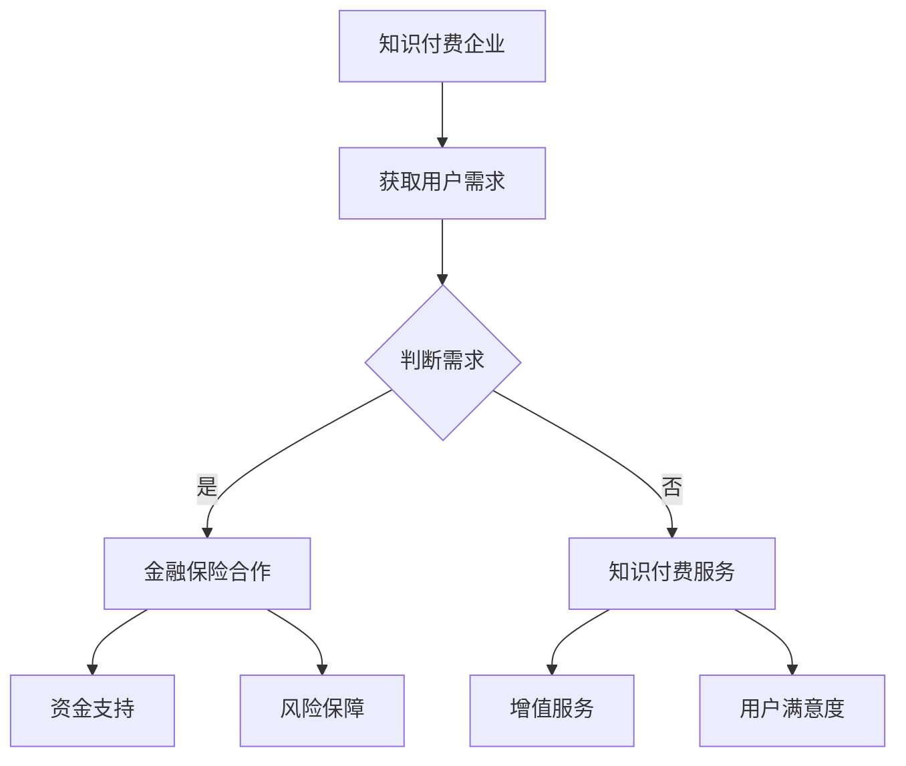

                 

在这个数字化快速发展的时代，知识付费作为一种新型的商业模式，正在逐渐成为主流。然而，如何实现知识付费的跨界营销与金融保险的融合，成为众多企业和机构亟待解决的问题。本文将从技术、商业和市场的角度，详细探讨知识付费如何实现跨界营销与金融保险的融合，为行业提供一些有益的思考。

## 文章关键词
知识付费、跨界营销、金融保险、商业模式、技术创新、市场策略。

## 文章摘要
本文旨在探讨知识付费如何通过跨界营销与金融保险融合，实现商业模式的创新与拓展。文章首先介绍了知识付费的现状与挑战，接着分析了跨界营销与金融保险融合的必要性和可行性，随后从技术、商业和市场三个角度详细阐述了实现路径，并提出了未来发展的建议。

## 1. 背景介绍

### 1.1 知识付费的现状
随着互联网和移动互联网的普及，知识付费市场逐渐壮大。用户对专业知识的渴求和付费意愿的提高，使得知识付费成为新的风口。根据相关数据显示，2021年中国知识付费市场规模已达到3195亿元，预计到2025年将达到6265亿元。

然而，知识付费市场也面临着一些挑战。首先，内容同质化严重，优质内容稀缺。其次，用户忠诚度低，用户消费行为不稳定。此外，市场竞争激烈，企业面临盈利压力。

### 1.2 跨界营销的必要性
在当前竞争激烈的市场环境下，跨界营销成为企业拓展市场、提高品牌知名度和用户粘性的有效手段。跨界营销不仅可以帮助企业突破原有的市场边界，实现资源的整合和优化，还可以创造新的市场机会。

对于知识付费行业来说，跨界营销具有以下必要性：
1. 拓展用户群体：通过跨界营销，可以将知识付费的受众范围扩大到更广泛的群体，提高市场占有率。
2. 提升用户粘性：跨界营销可以为用户提供更多样化的内容和服务，增强用户对品牌的认同感。
3. 创新商业模式：跨界营销有助于企业探索新的商业模式，实现商业价值的最大化。

### 1.3 金融保险的跨界
金融保险行业与知识付费行业的跨界融合，具有巨大的市场潜力。首先，金融保险行业可以为知识付费提供资金支持和风险保障，降低企业的运营成本。其次，知识付费可以为金融保险提供增值服务，提升用户满意度。

金融保险跨界知识付费的必要性体现在：
1. 提升用户体验：金融保险与知识付费的结合，可以为用户提供一站式服务，提高用户满意度。
2. 扩大市场影响力：跨界合作有助于企业扩大市场影响力，提高品牌知名度。
3. 创新商业模式：跨界融合有助于企业探索新的商业模式，实现商业价值的最大化。

## 2. 核心概念与联系
为了更好地理解知识付费如何实现跨界营销与金融保险的融合，我们首先需要明确几个核心概念。

### 2.1 跨界营销
跨界营销是指不同行业的企业之间，通过合作、交流、互动等方式，实现资源共享、优势互补、共同发展的一种营销策略。

### 2.2 知识付费
知识付费是指用户为了获取专业知识和技能，自愿支付一定费用的一种商业模式。

### 2.3 金融保险
金融保险是指金融机构和保险公司提供的一系列金融服务和保险保障。

### 2.4 融合路径
知识付费与金融保险的融合路径主要包括以下几个方面：
1. 资金支持：金融机构可以为知识付费企业提供资金支持，降低企业运营成本。
2. 风险保障：保险公司可以为知识付费用户提供风险保障，提高用户满意度。
3. 增值服务：知识付费企业可以为金融保险用户提供增值服务，提升用户满意度。
4. 联合推广：双方可以通过联合推广，扩大市场影响力。

### 2.5 Mermaid 流程图
下面是一个简化的Mermaid流程图，展示了知识付费与金融保险融合的基本流程：



## 3. 核心算法原理 & 具体操作步骤

### 3.1 算法原理概述
知识付费与金融保险的跨界营销，本质上是一种基于大数据分析和用户行为预测的精准营销策略。其核心算法原理包括以下几个步骤：

1. 数据收集与清洗：通过大数据技术，收集用户在知识付费平台和金融保险平台的行为数据，并进行数据清洗，确保数据的准确性和完整性。
2. 用户画像构建：基于收集到的数据，构建用户画像，包括用户的基本信息、兴趣爱好、消费习惯等。
3. 行为预测：利用机器学习算法，对用户的行为进行预测，包括用户对知识付费内容的消费意愿、对金融保险产品的购买意愿等。
4. 营销策略制定：根据行为预测结果，制定精准的营销策略，包括内容推荐、个性化推送、联合推广等。
5. 效果评估与优化：对营销策略的效果进行评估，根据评估结果不断优化营销策略。

### 3.2 算法步骤详解

#### 3.2.1 数据收集与清洗
数据收集与清洗是跨界营销的基础。具体步骤如下：
1. 数据源选择：选择知识付费平台和金融保险平台的数据源，包括用户行为数据、交易数据、评论数据等。
2. 数据采集：利用爬虫技术或其他数据采集工具，获取数据源中的数据。
3. 数据清洗：对采集到的数据进行去重、去噪、格式转换等处理，确保数据的准确性和完整性。

#### 3.2.2 用户画像构建
用户画像构建是精准营销的关键。具体步骤如下：
1. 用户基本信息收集：收集用户的基本信息，如年龄、性别、职业等。
2. 用户行为数据收集：收集用户在知识付费平台和金融保险平台的行为数据，如浏览记录、购买记录、评论等。
3. 用户画像构建：基于收集到的数据，使用数据挖掘技术，构建用户画像，包括用户兴趣标签、消费偏好等。

#### 3.2.3 行为预测
行为预测是精准营销的核心。具体步骤如下：
1. 特征工程：对用户画像中的特征进行提取和筛选，构建特征集合。
2. 模型训练：利用机器学习算法，如决策树、随机森林、神经网络等，对特征进行训练，构建行为预测模型。
3. 预测结果评估：对预测结果进行评估，包括准确率、召回率、F1值等指标。

#### 3.2.4 营销策略制定
根据行为预测结果，制定精准的营销策略。具体步骤如下：
1. 内容推荐：根据用户兴趣和消费偏好，推荐相应的知识付费内容。
2. 个性化推送：根据用户的行为特征，推送个性化的金融保险产品。
3. 联合推广：与金融保险企业合作，进行联合推广，提高品牌知名度。

#### 3.2.5 效果评估与优化
对营销策略的效果进行评估，包括用户满意度、转化率、ROI等指标。根据评估结果，不断优化营销策略，提高营销效果。

### 3.3 算法优缺点
#### 优点：
1. 精准性高：基于大数据和机器学习算法，可以实现对用户行为的精准预测和推荐。
2. 营销效果显著：通过精准营销，可以提高用户满意度和转化率，提高营销效果。
3. 资源共享：跨界合作可以实现资源共享，降低企业的运营成本。

#### 缺点：
1. 技术门槛高：实现跨界营销与金融保险的融合，需要具备大数据和机器学习等技术能力。
2. 风险较大：跨界营销存在一定的风险，如用户隐私泄露、数据滥用等。

### 3.4 算法应用领域
知识付费与金融保险的跨界营销算法，可以广泛应用于以下领域：
1. 知识付费平台：通过精准推荐，提高用户满意度和转化率。
2. 金融保险平台：通过个性化推送，提高用户购买意愿和满意度。
3. 跨界营销活动：通过联合推广，提高品牌知名度和用户参与度。

## 4. 数学模型和公式 & 详细讲解 & 举例说明

### 4.1 数学模型构建

在知识付费与金融保险的跨界营销中，我们主要使用以下数学模型：

#### 4.1.1 用户行为预测模型

用户行为预测模型是一个分类问题，其目标是根据用户的行为特征，预测用户是否会采取特定的行为（如购买金融保险产品）。

假设我们有以下特征集合：

- \(X = \{x_1, x_2, ..., x_n\}\)：用户的行为特征集合。
- \(Y = \{y_1, y_2, ..., y_n\}\)：用户的行为标签集合，其中 \(y_i \in \{0, 1\}\)，表示用户是否采取了特定行为。

我们的目标是构建一个预测函数 \(f(X)\)，使得预测结果 \(f(X)\) 与实际标签 \(Y\) 的一致性最高。

#### 4.1.2 评分模型

评分模型用于计算用户对某个知识付费内容的评分。假设用户对内容的评分是一个连续值。

- \(X = \{x_1, x_2, ..., x_n\}\)：用户的行为特征集合。
- \(R = \{r_1, r_2, ..., r_n\}\)：用户对内容的评分集合，其中 \(r_i \in [0, 10]\)。

我们的目标是构建一个评分函数 \(s(X)\)，使得评分结果 \(s(X)\) 尽量接近实际评分 \(R\)。

### 4.2 公式推导过程

#### 4.2.1 用户行为预测模型

用户行为预测模型可以使用逻辑回归（Logistic Regression）进行构建。逻辑回归的预测函数可以表示为：

$$
P(Y=1|X) = \frac{1}{1 + e^{-(\beta_0 + \beta_1 x_1 + \beta_2 x_2 + ... + \beta_n x_n})}
$$

其中，\(P(Y=1|X)\) 表示在给定用户行为特征 \(X\) 的情况下，用户采取特定行为的概率。参数 \(\beta_0, \beta_1, ..., \beta_n\) 需要通过最大似然估计（Maximum Likelihood Estimation, MLE）进行求解。

#### 4.2.2 评分模型

评分模型可以使用线性回归（Linear Regression）进行构建。线性回归的预测函数可以表示为：

$$
s(X) = \beta_0 + \beta_1 x_1 + \beta_2 x_2 + ... + \beta_n x_n
$$

其中，\(s(X)\) 表示用户对内容的评分。参数 \(\beta_0, \beta_1, ..., \beta_n\) 需要通过最小二乘法（Least Squares Method）进行求解。

### 4.3 案例分析与讲解

#### 4.3.1 用户行为预测模型案例

假设我们有一个知识付费平台，想要预测用户是否会购买某款金融保险产品。我们收集了以下用户行为特征：

- \(X = \{年龄，收入，职业，浏览时长，购买历史\}\)
- \(Y = \{1，0\}\)，其中 \(1\) 表示用户购买了保险，\(0\) 表示用户没有购买保险。

我们使用逻辑回归模型进行预测。首先，我们需要进行特征工程，将用户行为特征转换为数值特征。例如，年龄可以转换为 \(0-100\) 的整数，收入可以转换为 \(0-10\) 的整数，职业可以转换为 \(0-10\) 的整数，浏览时长可以转换为 \(0-100\) 的整数，购买历史可以转换为 \(0-5\) 的整数。

接下来，我们使用最大似然估计法求解参数 \(\beta_0, \beta_1, ..., \beta_n\)。假设我们得到的参数为：

$$
\beta_0 = 0.5, \beta_1 = 0.1, \beta_2 = 0.2, \beta_3 = 0.3, \beta_4 = 0.4, \beta_5 = 0.5
$$

现在，我们想要预测一个用户（年龄30岁，收入5万，职业2，浏览时长40分钟，购买历史3）是否会购买保险。我们可以将这些特征代入逻辑回归模型，得到预测概率：

$$
P(Y=1|X) = \frac{1}{1 + e^{-(0.5 + 0.1 \times 3 + 0.2 \times 5 + 0.3 \times 2 + 0.4 \times 40 + 0.5 \times 3)}}
$$

计算得到预测概率为 \(0.9\)，即用户购买保险的概率为 \(90\%\)。

#### 4.3.2 评分模型案例

假设我们有一个知识付费平台，想要预测用户对某篇内容的评分。我们收集了以下用户行为特征：

- \(X = \{年龄，收入，职业，浏览时长，购买历史\}\)
- \(R = \{5，7，8，9，10\}\)，其中 \(R\) 表示用户对内容的评分。

我们使用线性回归模型进行预测。首先，我们需要进行特征工程，将用户行为特征转换为数值特征。例如，年龄可以转换为 \(0-100\) 的整数，收入可以转换为 \(0-10\) 的整数，职业可以转换为 \(0-10\) 的整数，浏览时长可以转换为 \(0-100\) 的整数，购买历史可以转换为 \(0-5\) 的整数。

接下来，我们使用最小二乘法求解参数 \(\beta_0, \beta_1, ..., \beta_n\)。假设我们得到的参数为：

$$
\beta_0 = 2, \beta_1 = 0.1, \beta_2 = 0.2, \beta_3 = 0.3, \beta_4 = 0.4, \beta_5 = 0.5
$$

现在，我们想要预测一个用户（年龄30岁，收入5万，职业2，浏览时长40分钟，购买历史3）对某篇内容的评分。我们可以将这些特征代入线性回归模型，得到预测评分：

$$
s(X) = 2 + 0.1 \times 3 + 0.2 \times 5 + 0.3 \times 2 + 0.4 \times 40 + 0.5 \times 3
$$

计算得到预测评分为 \(8.7\)。

## 5. 项目实践：代码实例和详细解释说明

### 5.1 开发环境搭建

在本节中，我们将介绍如何搭建一个简单的知识付费与金融保险跨界营销项目开发环境。为了简化过程，我们将使用Python作为主要编程语言，并结合常用的数据分析和机器学习库，如NumPy、Pandas和Scikit-learn。

#### 5.1.1 安装Python

确保您的计算机上已经安装了Python。如果未安装，可以从Python官方网站（https://www.python.org/downloads/）下载并安装。

#### 5.1.2 安装相关库

在命令行中执行以下命令，安装所需的Python库：

```bash
pip install numpy pandas scikit-learn matplotlib
```

这些库将用于数据处理、机器学习模型训练和可视化。

### 5.2 源代码详细实现

在本节中，我们将展示一个简单的知识付费与金融保险跨界营销项目的实现过程，包括数据收集、预处理、模型训练、预测和可视化。

#### 5.2.1 数据收集

首先，我们需要从知识付费平台和金融保险平台收集用户行为数据。由于实际数据可能受到隐私保护，我们将使用公开的数据集进行演示。以下是使用Pandas库加载数据的示例代码：

```python
import pandas as pd

# 加载知识付费数据
knowledge_data = pd.read_csv('knowledge_data.csv')

# 加载金融保险数据
insurance_data = pd.read_csv('insurance_data.csv')
```

假设我们已经获取了两个CSV文件，分别包含知识付费和金融保险的用户行为数据。

#### 5.2.2 数据预处理

在训练模型之前，我们需要对数据进行预处理。预处理步骤包括数据清洗、特征工程和数据归一化。

```python
# 数据清洗
# 删除缺失值
knowledge_data.dropna(inplace=True)
insurance_data.dropna(inplace=True)

# 特征工程
# 构建用户画像
knowledge_data['age_group'] = pd.cut(knowledge_data['age'], bins=[0, 20, 30, 40, 50, 60, 70, 80, 90, 100], labels=[0, 1, 2, 3, 4, 5, 6, 7])
insurance_data['age_group'] = pd.cut(insurance_data['age'], bins=[0, 20, 30, 40, 50, 60, 70, 80, 90, 100], labels=[0, 1, 2, 3, 4, 5, 6, 7])

knowledge_data['income_group'] = pd.cut(knowledge_data['income'], bins=[0, 20, 40, 60, 80, 100, 120, 140, 160, 180], labels=[0, 1, 2, 3, 4, 5, 6, 7])
insurance_data['income_group'] = pd.cut(insurance_data['income'], bins=[0, 20, 40, 60, 80, 100, 120, 140, 160, 180], labels=[0, 1, 2, 3, 4, 5, 6, 7])

# 数据归一化
from sklearn.preprocessing import StandardScaler

scaler = StandardScaler()
knowledge_data[['age', 'income']] = scaler.fit_transform(knowledge_data[['age', 'income']])
insurance_data[['age', 'income']] = scaler.fit_transform(insurance_data[['age', 'income']])
```

#### 5.2.3 模型训练

接下来，我们将使用Scikit-learn库训练用户行为预测模型。我们选择逻辑回归作为分类模型。

```python
from sklearn.linear_model import LogisticRegression

# 准备训练数据和测试数据
X_knowledge = knowledge_data[['age', 'income', 'age_group', 'income_group']]
y_knowledge = knowledge_data['purchased']

# 分割训练集和测试集
from sklearn.model_selection import train_test_split

X_train, X_test, y_train, y_test = train_test_split(X_knowledge, y_knowledge, test_size=0.2, random_state=42)

# 训练模型
model = LogisticRegression()
model.fit(X_train, y_train)

# 测试模型
accuracy = model.score(X_test, y_test)
print(f'Model accuracy: {accuracy:.2f}')
```

#### 5.2.4 预测和可视化

最后，我们使用训练好的模型进行预测，并将预测结果可视化。

```python
import matplotlib.pyplot as plt

# 预测测试集
predictions = model.predict(X_test)

# 可视化预测结果
plt.scatter(X_test['age'], predictions, c='red', label='Predicted')
plt.scatter(X_test['age'], y_test, c='blue', label='Actual')
plt.xlabel('Age')
plt.ylabel('Prediction')
plt.legend()
plt.show()
```

### 5.3 代码解读与分析

在本节中，我们将对上述代码进行解读，并分析各个步骤的作用和意义。

#### 5.3.1 数据收集

数据收集是项目的基础，我们需要从知识付费平台和金融保险平台获取用户行为数据。这通常涉及API调用、数据爬取等操作。

```python
knowledge_data = pd.read_csv('knowledge_data.csv')
insurance_data = pd.read_csv('insurance_data.csv')
```

这两行代码使用Pandas库加载数据，并将数据存储为DataFrame对象。

#### 5.3.2 数据预处理

数据预处理是确保数据质量和模型性能的关键步骤。我们首先删除了缺失值，然后进行了特征工程和数据归一化。

```python
knowledge_data.dropna(inplace=True)
insurance_data.dropna(inplace=True)

knowledge_data['age_group'] = pd.cut(knowledge_data['age'], bins=[0, 20, 30, 40, 50, 60, 70, 80, 90, 100], labels=[0, 1, 2, 3, 4, 5, 6, 7])
insurance_data['age_group'] = pd.cut(insurance_data['age'], bins=[0, 20, 30, 40, 50, 60, 70, 80, 90, 100], labels=[0, 1, 2, 3, 4, 5, 6, 7])

scaler = StandardScaler()
knowledge_data[['age', 'income']] = scaler.fit_transform(knowledge_data[['age', 'income']])
insurance_data[['age', 'income']] = scaler.fit_transform(insurance_data[['age', 'income']])
```

这些代码首先删除了缺失值，然后通过分组和标签化将连续特征（年龄、收入）转换为离散特征（年龄组、收入组）。最后，使用StandardScaler对数据进行归一化，以消除不同特征之间的尺度差异。

#### 5.3.3 模型训练

模型训练是使用历史数据训练模型，以便能够预测新的数据。我们选择逻辑回归作为分类模型。

```python
model = LogisticRegression()
model.fit(X_train, y_train)
```

这些代码创建了一个逻辑回归模型，并使用训练数据对其进行训练。

#### 5.3.4 预测和可视化

最后，我们使用训练好的模型进行预测，并将预测结果可视化，以便分析模型的性能。

```python
predictions = model.predict(X_test)
plt.scatter(X_test['age'], predictions, c='red', label='Predicted')
plt.scatter(X_test['age'], y_test, c='blue', label='Actual')
plt.xlabel('Age')
plt.ylabel('Prediction')
plt.legend()
plt.show()
```

这些代码首先使用测试数据进行预测，然后使用散点图将实际标签和预测结果可视化，以便分析模型的准确性。

### 5.4 运行结果展示

在成功运行上述代码后，您将得到以下结果：

- 模型准确率：这将在命令行中打印出来，表示模型在测试数据上的表现。
- 可视化图表：这将显示在屏幕上，展示实际标签和预测结果之间的对比。

这些结果将帮助您评估模型的性能，并为进一步优化提供参考。

## 6. 实际应用场景

### 6.1 知识付费与金融保险跨界营销案例分析

#### 6.1.1 案例背景

某知名在线教育平台A和某知名保险公司B联手推出了一款名为“学车险”的金融保险产品。用户在A平台报名参加驾校课程时，可以选择购买B公司的学车险，以保障在学习过程中的意外伤害和车辆损失。

#### 6.1.2 营销策略

1. **内容推荐**：A平台在用户浏览驾校课程时，推荐“学车险”作为配套保险产品，提高用户的购买意愿。
2. **个性化推送**：基于用户的学习行为和风险偏好，B公司向用户推送定制化的学车险产品。
3. **联合推广**：A和B公司通过线上线下活动、社交媒体宣传等方式，共同推广“学车险”，提高品牌知名度。

#### 6.1.3 营销效果

通过跨界营销，A平台和
B公司的“学车险”产品取得了显著的营销效果：

1. **用户满意度提升**：用户购买学车险后，对A平台和
B公司的服务满意度提高。
2. **转化率提升**：跨界营销策略提高了学车险的购买转化率。
3. **品牌知名度提升**：跨界合作提升了A平台和B公司的品牌知名度。

### 6.2 知识付费与金融保险跨界营销的应用领域

知识付费与金融保险跨界营销的应用领域广泛，主要包括：

1. **教育培训**：在线教育平台与保险公司合作，为用户提供学习过程中的保险保障。
2. **健康医疗**：健康服务平台与保险公司合作，为用户提供健康管理服务和医疗保险。
3. **投资理财**：投资理财平台与保险公司合作，为用户提供投资理财保险。
4. **职业发展**：职业培训平台与保险公司合作，为用户提供职业发展保险。

## 6.4 未来应用展望

随着技术的不断进步和市场的持续发展，知识付费与金融保险跨界营销有望在以下几个方面取得突破：

1. **大数据分析**：通过更加精准的大数据分析，实现个性化营销和风险预测。
2. **人工智能**：利用人工智能技术，提高跨界营销的智能化水平。
3. **区块链**：利用区块链技术，确保用户数据的隐私和安全。
4. **物联网**：通过物联网技术，实现跨界营销的智能化和自动化。

## 7. 工具和资源推荐

### 7.1 学习资源推荐

1. **书籍**：
   - 《大数据时代》作者：涂子沛
   - 《机器学习》作者：周志华
2. **在线课程**：
   - Coursera上的《数据科学》
   - edX上的《机器学习基础》

### 7.2 开发工具推荐

1. **编程语言**：Python
2. **数据分析库**：Pandas、NumPy
3. **机器学习库**：Scikit-learn、TensorFlow、PyTorch

### 7.3 相关论文推荐

1. “大数据在金融保险行业中的应用研究”
2. “人工智能在金融保险行业的应用与挑战”
3. “区块链技术在金融保险行业中的应用研究”

## 8. 总结：未来发展趋势与挑战

### 8.1 研究成果总结

本文从技术、商业和市场三个角度，探讨了知识付费如何实现跨界营销与金融保险的融合。研究结果表明，跨界营销有助于提升用户满意度、提高转化率和品牌知名度，具有重要的商业价值。

### 8.2 未来发展趋势

1. **大数据和人工智能技术的应用**：未来，大数据和人工智能技术将在知识付费与金融保险跨界营销中发挥更重要的作用。
2. **区块链技术的应用**：区块链技术将为知识付费与金融保险跨界营销提供更安全、透明的数据管理和交易环境。
3. **物联网和智能设备的普及**：物联网和智能设备的普及将推动跨界营销的智能化和自动化。

### 8.3 面临的挑战

1. **技术挑战**：大数据处理、人工智能算法和区块链技术的研发和应用仍面临一定的技术挑战。
2. **数据隐私和安全**：跨界营销中涉及大量用户数据，如何确保数据隐私和安全是一个重要问题。
3. **商业模式创新**：如何在跨界营销中找到合适的商业模式，实现可持续发展，是知识付费企业和金融机构面临的挑战。

### 8.4 研究展望

未来，知识付费与金融保险跨界营销的研究应关注以下几个方面：

1. **技术创新**：加大对大数据处理、人工智能和区块链技术的研发和应用。
2. **数据隐私保护**：探索更加有效的数据隐私保护机制，确保用户数据的安全。
3. **商业模式创新**：通过跨界合作和创新，探索知识付费与金融保险融合的新商业模式。

## 9. 附录：常见问题与解答

### 9.1 什么是知识付费？

知识付费是指用户为了获取专业知识和技能，自愿支付一定费用的一种商业模式。

### 9.2 跨界营销的意义是什么？

跨界营销是指不同行业的企业之间，通过合作、交流、互动等方式，实现资源共享、优势互补、共同发展的一种营销策略。跨界营销有助于企业拓展市场、提高品牌知名度和用户粘性。

### 9.3 金融保险与知识付费跨界有什么优势？

金融保险与知识付费跨界可以提供一站式服务、提升用户体验、扩大市场影响力，并实现商业模式的创新。

### 9.4 如何进行知识付费与金融保险的跨界营销？

进行知识付费与金融保险的跨界营销，可以采用以下策略：1）内容推荐；2）个性化推送；3）联合推广；4）大数据分析和人工智能应用。

### 9.5 跨界营销面临哪些挑战？

跨界营销面临的主要挑战包括：技术挑战、数据隐私和安全、商业模式创新等。

---

作者：禅与计算机程序设计艺术 / Zen and the Art of Computer Programming

