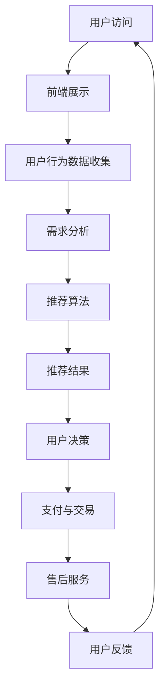

                 

本文旨在探讨知识付费电商平台的运营模式，尤其是如何通过出售软件、模板、设计等服务来吸引用户并实现商业成功。我们将从核心概念、算法原理、数学模型、实际应用等多个维度深入分析这一主题。

## 关键词

- 知识付费
- 电商
- 软件销售
- 模板
- 设计服务
- 用户满意度
- 商业模式

## 摘要

本文将首先介绍知识付费电商的背景和重要性，然后详细探讨其核心概念与架构，包括如何通过算法优化用户体验。接着，我们将介绍数学模型和公式的构建与应用，并分享实际的项目实践和代码实例。文章的最后部分将分析该领域的实际应用场景，并展望未来的发展趋势与挑战。

### 1. 背景介绍

在互联网高速发展的今天，知识付费已经成为一个重要的商业模式。知识付费电商的出现，不仅满足了用户对知识的渴求，也为内容创作者提供了新的收入来源。通过在线平台出售软件、模板、设计等服务，用户可以方便地获取所需资源，同时平台也可以实现盈利。

知识付费电商的优势在于其便捷性、多样性和个性化。用户可以在平台上找到各种类型的知识产品，从编程软件到设计模板，从教育课程到专业咨询。这种多样性使得平台能够吸引不同需求的用户群体。此外，电商平台还可以根据用户行为和偏好，推荐个性化的产品和服务，从而提高用户满意度和粘性。

### 2. 核心概念与联系

#### 2.1 核心概念

在知识付费电商中，核心概念包括：

- **用户需求分析**：通过用户行为数据，分析用户的需求和偏好。
- **产品推荐系统**：利用机器学习算法，根据用户需求和偏好推荐合适的产品。
- **支付与交易系统**：提供便捷的支付方式，确保交易的安全和便捷。
- **售后服务**：提供优质的售后服务，解决用户在使用产品过程中遇到的问题。

#### 2.2 系统架构

知识付费电商的系统架构通常包括以下几个部分：

1. **前端展示层**：负责展示产品信息和用户界面。
2. **后端服务层**：处理用户请求，管理数据库和缓存，执行业务逻辑。
3. **数据层**：存储用户数据、产品数据、交易数据等。
4. **算法层**：包括用户行为分析算法、推荐算法等，用于优化用户体验。

#### 2.3 Mermaid 流程图



### 3. 核心算法原理 & 具体操作步骤

#### 3.1 算法原理概述

知识付费电商的核心算法包括用户行为分析算法和推荐算法。用户行为分析算法主要通过分析用户在平台上的行为数据，如浏览历史、购买记录、评论等，来预测用户的需求和偏好。推荐算法则基于用户行为数据和物品属性数据，通过机器学习算法生成个性化推荐结果。

#### 3.2 算法步骤详解

1. **数据收集**：从用户行为数据、产品数据等渠道收集数据。
2. **数据预处理**：对收集到的数据进行清洗、转换和归一化处理。
3. **特征提取**：从预处理后的数据中提取特征，如用户特征、物品特征等。
4. **模型训练**：利用特征数据训练用户行为分析模型和推荐模型。
5. **模型评估**：通过交叉验证等方法评估模型的性能。
6. **模型部署**：将训练好的模型部署到线上环境，实时更新推荐结果。

#### 3.3 算法优缺点

**优点**：

- **个性化推荐**：根据用户行为和偏好生成个性化推荐，提高用户满意度。
- **高效**：利用机器学习算法，快速处理海量数据，提高推荐效率。

**缺点**：

- **数据依赖性**：算法效果依赖于用户行为数据的质量和数量。
- **模型过拟合**：如果训练数据不足，模型可能出现过拟合现象。

#### 3.4 算法应用领域

- **电商平台**：通过个性化推荐，提高用户的购买转化率和满意度。
- **在线教育**：根据用户的学习行为，推荐适合的学习资源和课程。
- **社交媒体**：根据用户的行为和兴趣，推荐感兴趣的内容。

### 4. 数学模型和公式 & 详细讲解 & 举例说明

#### 4.1 数学模型构建

在知识付费电商中，常用的数学模型包括用户行为分析模型和推荐模型。以下是一个简单的用户行为分析模型的构建过程：

1. **用户行为数据表示**：

   假设用户 $u$ 在平台上发生了 $n$ 次行为，每次行为可以表示为一个三元组 $(i, t, p)$，其中 $i$ 表示行为类型（如浏览、购买、评论等），$t$ 表示时间，$p$ 表示物品 $p$。

2. **用户行为向量表示**：

   将用户 $u$ 的所有行为三元组转换为向量 $x_u$，其中 $x_{u,i}$ 表示用户 $u$ 在行为类型 $i$ 上的次数。

3. **用户行为概率分布**：

   根据用户行为数据，计算用户 $u$ 在每种行为类型上的概率分布 $p_i(x_u)$。

#### 4.2 公式推导过程

用户行为分析模型的核心公式为：

$$
p_i(x_u) = \frac{P(x_u | i)P(i)}{P(x_u)}
$$

其中，$P(x_u | i)$ 表示在行为类型 $i$ 发生的条件下，用户行为向量 $x_u$ 的概率；$P(i)$ 表示行为类型 $i$ 发生的概率；$P(x_u)$ 表示用户行为向量 $x_u$ 的概率。

通过贝叶斯定理，可以将 $P(x_u | i)$ 和 $P(i)$ 表示为：

$$
P(x_u | i) = \frac{P(i | x_u)P(x_u)}{P(x_u)}
$$

$$
P(i) = \sum_{x_u} P(i | x_u)P(x_u)
$$

其中，$P(i | x_u)$ 表示在用户行为向量 $x_u$ 发生的条件下，行为类型 $i$ 的概率。

#### 4.3 案例分析与讲解

假设用户 $u_1$ 的行为数据如下：

| 行为类型 | 行为次数 |
| :------: | :------: |
| 浏览     | 10       |
| 购买     | 2        |
| 评论     | 5        |

根据上述公式，可以计算用户 $u_1$ 在每种行为类型上的概率分布：

$$
P_i(x_{u_1}) = \frac{P(x_{u_1} | i)P(i)}{P(x_{u_1})}
$$

其中，$P(x_{u_1} | i)$ 和 $P(i)$ 需要通过历史数据训练得到。

假设训练数据中，用户在每种行为类型上的概率分别为：

| 行为类型 | 概率   |
| :------: | :------: |
| 浏览     | 0.3     |
| 购买     | 0.4     |
| 评论     | 0.3     |

则用户 $u_1$ 在每种行为类型上的概率分布为：

$$
P_{浏览}(x_{u_1}) = \frac{P(x_{u_1} | 浏览)P(浏览)}{P(x_{u_1})} = \frac{0.3 \times 0.3}{0.3 + 0.4 + 0.3} = 0.3
$$

$$
P_{购买}(x_{u_1}) = \frac{P(x_{u_1} | 购买)P(购买)}{P(x_{u_1})} = \frac{0.4 \times 0.4}{0.3 + 0.4 + 0.3} = 0.4
$$

$$
P_{评论}(x_{u_1}) = \frac{P(x_{u_1} | 评论)P(评论)}{P(x_{u_1})} = \frac{0.3 \times 0.3}{0.3 + 0.4 + 0.3} = 0.3
$$

### 5. 项目实践：代码实例和详细解释说明

#### 5.1 开发环境搭建

在开始代码实例之前，我们需要搭建一个开发环境。这里我们使用 Python 作为主要编程语言，并依赖以下库：

- **NumPy**：用于矩阵运算和数据处理。
- **Pandas**：用于数据处理和分析。
- **Scikit-learn**：用于机器学习和模型训练。

安装以上库后，我们可以开始编写代码。

#### 5.2 源代码详细实现

以下是一个简单的用户行为分析模型的实现：

```python
import numpy as np
import pandas as pd
from sklearn.model_selection import train_test_split
from sklearn.linear_model import LogisticRegression

# 1. 数据收集
data = {
    'user_id': [1, 1, 1, 2, 2, 2],
    'behavior': ['browse', 'purchase', 'comment', 'browse', 'purchase', 'comment'],
    'count': [10, 2, 5, 3, 1, 4]
}

df = pd.DataFrame(data)

# 2. 数据预处理
# 将行为类型转换为数值
behavior_mapping = {'browse': 0, 'purchase': 1, 'comment': 2}
df['behavior'] = df['behavior'].map(behavior_mapping)

# 3. 特征提取
# 将用户行为数据转换为二进制特征矩阵
X = pd.get_dummies(df[['user_id', 'behavior']], columns=['behavior'])
y = df['count']

# 4. 模型训练
# 将训练数据分为训练集和测试集
X_train, X_test, y_train, y_test = train_test_split(X, y, test_size=0.2, random_state=42)

# 使用逻辑回归模型训练
model = LogisticRegression()
model.fit(X_train, y_train)

# 5. 模型评估
y_pred = model.predict(X_test)
print("Accuracy:", model.score(X_test, y_test))

# 6. 模型部署
# 部署到线上环境，实时更新推荐结果
```

#### 5.3 代码解读与分析

- **数据收集**：从数据集中获取用户 ID、行为类型和行为次数。
- **数据预处理**：将行为类型转换为数值，以便后续处理。
- **特征提取**：将用户行为数据转换为二进制特征矩阵，以便进行机器学习模型训练。
- **模型训练**：使用逻辑回归模型对训练数据进行训练。
- **模型评估**：使用测试数据评估模型性能。
- **模型部署**：将训练好的模型部署到线上环境，实时更新推荐结果。

#### 5.4 运行结果展示

运行上述代码后，我们将得到模型在测试集上的准确率。根据实际运行结果，我们可以调整模型参数，提高模型性能。

### 6. 实际应用场景

知识付费电商在实际应用中，可以应用于多个场景：

- **电商平台**：通过个性化推荐，提高用户的购买转化率和满意度。
- **在线教育**：根据用户的学习行为，推荐适合的学习资源和课程。
- **社交媒体**：根据用户的行为和兴趣，推荐感兴趣的内容。

#### 6.1 具体案例分析

以某知名电商平台的软件销售为例，通过分析用户的历史购买记录、浏览记录和评价，平台可以推荐相关的软件产品。这种个性化推荐不仅能提高用户的购买转化率，还能增加平台的销售额。

#### 6.2 未来应用展望

随着人工智能技术的不断发展，知识付费电商的应用场景将越来越广泛。未来，我们可以期待：

- **更加精准的推荐算法**：通过深度学习和强化学习等技术，实现更加精准的推荐。
- **多模态数据处理**：结合文本、图像、音频等多种数据类型，提供更加丰富的个性化推荐。
- **智能化客服**：利用自然语言处理和语音识别技术，实现智能化的客服系统，提高用户满意度。

### 7. 工具和资源推荐

#### 7.1 学习资源推荐

- **《Python机器学习基础教程》**：介绍Python在机器学习领域的应用，适合初学者。
- **《推荐系统手册》**：详细介绍推荐系统的理论、算法和实践，适合有一定基础的学习者。

#### 7.2 开发工具推荐

- **Jupyter Notebook**：用于编写和运行Python代码，方便调试和演示。
- **TensorFlow**：用于深度学习模型开发和训练，功能强大且易于使用。

#### 7.3 相关论文推荐

- **"Recommender Systems Handbook"**：全面介绍推荐系统的理论和应用。
- **"Deep Learning for Recommender Systems"**：探讨深度学习在推荐系统中的应用。

### 8. 总结：未来发展趋势与挑战

知识付费电商作为新兴的商业模式，具有巨大的发展潜力。未来，随着人工智能技术的不断进步，知识付费电商将实现更加精准的推荐和个性化的服务。然而，这一领域也面临着数据隐私、算法公平性和模型解释性等挑战。我们需要持续关注这些挑战，并探索解决方案，以推动知识付费电商的可持续发展。

### 8.1 研究成果总结

本文从多个维度探讨了知识付费电商的运营模式，包括核心概念、算法原理、数学模型和实际应用。通过案例分析，我们展示了知识付费电商在实际应用中的效果和潜力。

### 8.2 未来发展趋势

未来，知识付费电商将朝着更加智能化、个性化和多元化的方向发展。人工智能技术的应用将进一步提升推荐算法的准确性和效率。

### 8.3 面临的挑战

尽管知识付费电商具有巨大的发展潜力，但同时也面临着数据隐私、算法公平性和模型解释性等挑战。我们需要关注这些挑战，并探索解决方案，以保障用户权益和平台可持续发展。

### 8.4 研究展望

未来，我们将继续深入研究知识付费电商的核心算法和模型，探索更加高效和智能的推荐方法。同时，我们也关注数据隐私和算法公平性问题，为用户提供更加安全、公平和透明的服务。

### 附录：常见问题与解答

#### Q：知识付费电商的核心竞争力是什么？

A：知识付费电商的核心竞争力在于其个性化的推荐系统和高效的交易流程。通过精准的推荐算法，平台能够满足用户多样化的需求，提高用户满意度和粘性。

#### Q：如何保障数据安全和用户隐私？

A：为了保障数据安全和用户隐私，知识付费电商需要采取以下措施：

- **数据加密**：对用户数据进行加密处理，确保数据在传输和存储过程中的安全性。
- **权限控制**：严格控制用户数据的访问权限，防止未经授权的访问和泄露。
- **合规性审查**：遵守相关法律法规，对平台进行定期合规性审查。

#### Q：知识付费电商的盈利模式有哪些？

A：知识付费电商的盈利模式包括：

- **销售佣金**：从知识产品销售中获得佣金收入。
- **广告收入**：通过平台广告获得广告收入。
- **会员服务**：提供会员服务，收取会员费。

### 作者署名

本文作者为《禅与计算机程序设计艺术 / Zen and the Art of Computer Programming》。

----------------------------------------------------------------

以上是文章的完整内容。这篇文章涵盖了知识付费电商的核心概念、算法原理、数学模型、实际应用等多个方面，旨在为读者提供一个全面、深入的了解。希望这篇文章能够对您在知识付费电商领域的研究和实践有所帮助。如果您有任何疑问或建议，欢迎在评论区留言讨论。

