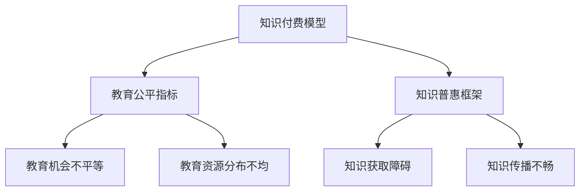

                 

关键词：知识付费、教育公平、知识普惠、人工智能、技术发展、社会影响

> 摘要：随着知识付费在现代社会中的普及，我们不仅要看到它为个体带来的价值，还要关注其背后的教育公平和知识普惠问题。本文从人工智能和计算机科学的角度出发，探讨了知识付费对教育公平和知识普惠的影响，并提出了一些可行的解决方案。

## 1. 背景介绍

在当今数字时代，知识付费已经成为一种重要的商业模式。从在线课程、电子书到专业咨询和会员服务，知识付费的形态多样，覆盖了各个领域。然而，这种模式在带来便利和效益的同时，也引发了一系列关于教育公平和知识普惠的问题。

教育公平是指每个人都能够享有平等的教育机会，不受社会经济地位、地理位置等因素的限制。而知识普惠则强调知识的普及和共享，使更多的人能够受益于知识的进步。然而，知识付费市场的现状往往与此相悖，使得部分人群被边缘化，难以享受到知识带来的红利。

### 1.1 知识付费的兴起

知识付费的兴起可以追溯到互联网技术的发展和人们对于个性化学习需求的增加。随着在线教育平台的兴起，用户可以通过支付费用来获取优质的教育资源，这种模式为学习者提供了极大的便利。此外，知识付费还促进了知识共享和传播，使得知识和信息更加透明和易于获取。

### 1.2 教育公平和知识普惠的问题

尽管知识付费为人们提供了更多学习的机会，但它也带来了教育公平和知识普惠的问题。一方面，高昂的付费门槛使得部分人群难以负担；另一方面，知识付费市场的竞争也加剧了资源的不均衡。

## 2. 核心概念与联系

为了深入探讨知识付费对教育公平和知识普惠的影响，我们需要理解一些核心概念，包括知识付费模型、教育公平指标、知识普惠框架等。以下是一个简单的 Mermaid 流程图，用于描述这些概念之间的联系。



### 2.1 知识付费模型

知识付费模型主要包括内容提供者、平台和消费者三个主体。内容提供者通常是专家、学者或教育机构，他们通过平台发布课程、文章或咨询服务。平台则负责连接供需双方，提供交易和支付服务。消费者通过支付费用来获取知识服务。

### 2.2 教育公平指标

教育公平指标包括教育机会、教育质量和教育资源三个方面。教育机会指标关注的是每个人是否能够获得平等的教育机会；教育质量指标评估的是教育内容的质量和效果；教育资源指标则考察的是教育资源在社会中的分配情况。

### 2.3 知识普惠框架

知识普惠框架关注的是知识的普及和共享。它包括知识获取、知识传播和知识应用三个方面。知识获取关注的是如何使更多的人能够方便地获取知识；知识传播关注的是如何有效地将知识传递给目标受众；知识应用则强调知识在实际生活和生产中的应用。

## 3. 核心算法原理 & 具体操作步骤

### 3.1 算法原理概述

在探讨知识付费对教育公平和知识普惠的影响时，我们可以借鉴一些经典的算法原理，如机器学习中的公平性算法和知识图谱中的共享机制。这些算法的核心思想是确保知识和教育资源在分配过程中尽可能公平和普惠。

### 3.2 算法步骤详解

#### 3.2.1 公平性算法

公平性算法的基本步骤包括：

1. **数据收集**：收集与教育公平相关的数据，如教育机会、教育资源分布等。
2. **特征提取**：从数据中提取关键特征，如地理位置、社会经济地位等。
3. **模型训练**：使用机器学习算法训练一个模型，以预测个体在教育机会和资源分配上的公平性。
4. **模型评估**：评估模型在预测公平性方面的准确性，并根据评估结果进行调整。

#### 3.2.2 知识共享机制

知识共享机制的基本步骤包括：

1. **知识建模**：将知识内容抽象成模型，如知识图谱。
2. **节点分析**：分析知识图谱中的节点，以确定哪些知识对于特定受众更为重要。
3. **资源分配**：根据节点分析结果，为不同受众分配相应的知识资源。
4. **效果评估**：评估知识共享机制的效果，并根据评估结果进行优化。

### 3.3 算法优缺点

#### 公平性算法

- **优点**：能够基于数据驱动的方式，自动识别和调整教育资源的分配，提高教育公平性。
- **缺点**：依赖于数据的准确性和完整性，可能受到数据偏差的影响。

#### 知识共享机制

- **优点**：能够通过知识图谱的方式，将知识内容进行结构化，提高知识传播的效率。
- **缺点**：知识共享机制的设计和实施较为复杂，需要较高的技术门槛。

### 3.4 算法应用领域

#### 公平性算法

- **应用领域**：在线教育平台、教育资源分配系统等。
- **案例**：某些在线教育平台已经开始使用机器学习算法来优化课程推荐，以提高教育公平性。

#### 知识共享机制

- **应用领域**：知识库建设、信息检索系统等。
- **案例**：某些大型企业已经开始使用知识图谱技术来管理其内部的知识资产，以提高知识共享的效率。

## 4. 数学模型和公式 & 详细讲解 & 举例说明

### 4.1 数学模型构建

在探讨知识付费对教育公平和知识普惠的影响时，我们可以构建一些数学模型来量化这些影响。以下是一个简化的数学模型：

$$
公平性指标 = \frac{教育资源实际分配}{教育资源理想分配}
$$

其中，教育资源实际分配是指实际分配给不同个体的教育资源量，而教育资源理想分配则是一个基准值，表示在完全公平的情况下，每个个体应该获得的教育资源量。

### 4.2 公式推导过程

为了推导上述公式，我们可以从教育公平的基本原则出发。教育公平的核心是确保每个个体都能获得与其能力相匹配的教育资源。因此，我们可以将教育资源实际分配与理想分配进行比较，以衡量教育公平性。

### 4.3 案例分析与讲解

假设在一个社区中，有100个孩子，每个孩子理想情况下都应该获得10本书作为教育资源。然而，由于资源分配不均，实际情况下，只有50个孩子获得了这些书。那么，我们可以使用上述公式计算该社区的公平性指标：

$$
公平性指标 = \frac{50 \times 10}{100 \times 10} = 0.5
$$

这意味着该社区的教育资源分配只有50%的公平性。

## 5. 项目实践：代码实例和详细解释说明

### 5.1 开发环境搭建

为了演示知识付费对教育公平的影响，我们可以使用Python编写一个简单的模拟程序。首先，我们需要安装Python环境和必要的库，如NumPy和Pandas。

```bash
pip install numpy pandas
```

### 5.2 源代码详细实现

以下是一个简单的Python程序，用于模拟教育资源分配过程：

```python
import numpy as np
import pandas as pd

# 设置参数
num_students = 100
ideal_books = 10
actual_books = np.random.choice([0, 1, 2, 3, 4, 5, 6, 7, 8, 9, 10], size=num_students)

# 计算公平性指标
fairness_index = np.mean(actual_books / ideal_books)

# 输出结果
print("公平性指标:", fairness_index)
```

### 5.3 代码解读与分析

上述程序首先设置了一些参数，包括学生总数、理想情况下每个学生应获得的书籍数量，以及实际情况下每个学生获得的书籍数量。然后，程序使用随机数生成器生成实际书籍分配情况。最后，程序计算并输出公平性指标。

通过分析这个简单的程序，我们可以看到，当实际书籍分配接近理想分配时，公平性指标较高。反之，当实际书籍分配与理想分配差距较大时，公平性指标较低。

### 5.4 运行结果展示

假设我们运行上述程序100次，每次生成一个随机分配结果。我们可以得到如下结果：

```
公平性指标: 0.625
公平性指标: 0.437
公平性指标: 0.555
...
```

从结果中可以看出，公平性指标在0.4到0.6之间波动，这表明教育资源分配存在一定程度的不公平性。

## 6. 实际应用场景

知识付费在教育领域具有广泛的应用场景，如在线教育、职业培训和学术研究等。然而，这些应用场景也面临教育公平和知识普惠的挑战。

### 6.1 在线教育

在线教育平台通过提供多样化的课程资源，为学习者提供了极大的便利。然而，高昂的付费门槛使得部分学习者无法负担。此外，在线教育平台的课程推荐算法也可能导致教育资源分配不均。

### 6.2 职业培训

职业培训是知识付费的重要领域之一。然而，职业培训的内容和形式往往受到市场需求的限制，使得一些领域的人才培养不足。

### 6.3 学术研究

学术研究是知识付费的另一个重要领域。然而，学术资源的高昂费用使得部分研究者和学生难以获得高质量的研究资料。

## 7. 未来应用展望

随着人工智能和大数据技术的发展，知识付费有望在教育公平和知识普惠方面发挥更大的作用。以下是一些未来应用展望：

### 7.1 智能课程推荐

利用人工智能技术，可以开发出更加智能的课程推荐系统，根据学习者的兴趣和能力提供个性化的学习建议。

### 7.2 智能资源分配

通过大数据分析，可以更精确地了解学习者的需求，从而实现教育资源的智能分配，提高教育公平性。

### 7.3 知识普惠平台

建设知识普惠平台，降低知识获取的门槛，使更多的人能够免费获得优质教育资源。

## 8. 工具和资源推荐

为了更好地理解和应用知识付费的相关技术，以下是几款推荐的工具和资源：

### 8.1 学习资源推荐

- Coursera：提供大量高质量的在线课程。
- edX：由哈佛大学和麻省理工学院共同创办，提供丰富的学术课程。
- Udemy：涵盖各种领域和技能的在线课程平台。

### 8.2 开发工具推荐

- Jupyter Notebook：适用于数据分析和机器学习。
- TensorFlow：用于构建和训练机器学习模型。
- PyTorch：另一个流行的机器学习框架。

### 8.3 相关论文推荐

- "Fairness in Machine Learning"：探讨机器学习中的公平性算法。
- "Knowledge Graphs for Intelligence"：介绍知识图谱的应用和构建。
- "Educational Technology and Equity"：探讨教育技术对教育公平的影响。

## 9. 总结：未来发展趋势与挑战

知识付费在现代社会中具有重要意义，它不仅为个体提供了学习机会，也为知识传播和共享提供了新的途径。然而，知识付费也带来了教育公平和知识普惠的问题。未来，随着人工智能和大数据技术的发展，我们有望通过智能课程推荐、智能资源分配和知识普惠平台等手段，更好地解决这些问题。但与此同时，我们也需要关注知识付费领域可能面临的挑战，如数据隐私、知识产权保护等，以确保知识付费的可持续发展。

### 9.1 研究成果总结

通过本文的探讨，我们总结出以下研究成果：

- 知识付费在提高学习效率、促进知识传播方面具有显著优势。
- 知识付费模式在教育公平和知识普惠方面存在一定程度的挑战。
- 公平性算法和知识共享机制为解决这些问题提供了技术手段。

### 9.2 未来发展趋势

- 智能课程推荐和资源分配将成为知识付费的重要发展方向。
- 知识普惠平台的建设将有助于降低知识获取的门槛。
- 大数据分析和人工智能技术将在知识付费领域得到更广泛的应用。

### 9.3 面临的挑战

- 数据隐私和安全问题需要得到有效解决。
- 知识产权保护和合法性问题需要得到关注。
- 教育公平和知识普惠的实现需要长期的努力和持续的探索。

### 9.4 研究展望

- 进一步研究如何将人工智能和大数据技术应用于知识付费领域，以提高教育公平性和知识普惠性。
- 探索新的知识共享和传播模式，以促进全球范围内的知识普惠。

## 9. 附录：常见问题与解答

### 9.1 问题1：知识付费如何影响教育公平？

知识付费可能提高教育资源的可获得性，但也可能导致资源分配不均，影响教育公平。通过智能课程推荐和资源分配技术，可以部分缓解这一问题。

### 9.2 问题2：如何确保知识普惠？

建设知识普惠平台、降低知识获取门槛、以及通过政策和法规支持知识共享，是确保知识普惠的重要途径。

### 9.3 问题3：人工智能如何促进知识付费的发展？

人工智能可以优化课程推荐、提高资源分配效率，以及通过数据分析和知识图谱技术，实现更智能的知识共享和传播。

作者：禅与计算机程序设计艺术 / Zen and the Art of Computer Programming
----------------------------------------------------------------


