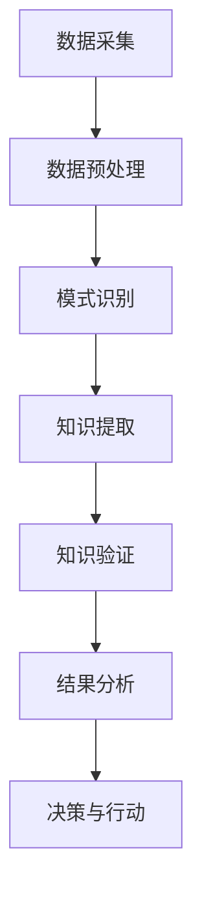

                 

关键词：知识发现、气候变化、人工智能、数据挖掘、算法、数学模型

摘要：本文探讨了知识发现引擎在气候变化研究中的应用。通过对知识发现引擎的核心概念、算法原理以及具体实现步骤的深入分析，本文展示了知识发现引擎在气候变化研究中的重要性和潜在价值。通过数学模型和实际案例的分析，本文进一步阐明了知识发现引擎在气候预测、气候变化趋势分析以及应对策略制定等方面的应用。最后，本文对知识发现引擎的未来发展趋势和挑战进行了展望，并推荐了相关学习资源和开发工具。

## 1. 背景介绍

随着全球气候变化的影响日益显著，如何准确预测和应对气候变化成为当今世界面临的重大挑战。气候变化不仅影响生态系统和人类生活，还对经济、社会和国家安全产生深远的影响。因此，研究和理解气候变化的过程、趋势和影响机制具有重要意义。

在气候变化研究中，数据挖掘和人工智能技术发挥着重要作用。数据挖掘能够从海量气候数据中提取有价值的信息和知识，而人工智能则能够通过算法和模型对气候数据进行预测和分析。知识发现引擎作为一种将数据挖掘和人工智能技术相结合的工具，为气候变化研究提供了新的思路和方法。

知识发现引擎是一种自动化的过程，能够从大规模数据集中识别出潜在的、有价值的知识模式。它包括多个阶段，如数据预处理、模式识别、知识提取和知识验证等。在气候变化研究中，知识发现引擎可以帮助科学家从大量的气候数据中提取出有意义的趋势、关联和预测模型，从而提高对气候变化的理解和预测能力。

## 2. 核心概念与联系

### 2.1 知识发现引擎的定义

知识发现引擎（Knowledge Discovery Engine，KDE）是一种能够自动从大规模数据集中发现知识模式的系统。它结合了数据挖掘、机器学习和人工智能技术，通过一系列算法和模型来分析数据，提取出有用的信息和知识。知识发现引擎的核心目标是降低数据处理的复杂性，提高数据分析和知识提取的效率，从而帮助用户更好地理解和利用数据。

### 2.2 数据挖掘在气候变化研究中的应用

数据挖掘是一种从大量数据中自动发现有价值信息的过程，它包括以下主要步骤：

1. **数据预处理**：对原始数据进行清洗、整合和转换，使其适合分析和建模。

2. **模式识别**：通过统计分析和机器学习算法，从数据中识别出潜在的关联、趋势和异常。

3. **知识提取**：将识别出的模式转化为可理解的知识和规则，以便用户进行决策和行动。

4. **知识验证**：对提取出的知识进行评估和验证，确保其准确性和可靠性。

在气候变化研究中，数据挖掘技术可以用于以下方面：

1. **气候趋势分析**：通过对历史气候数据进行挖掘，识别出气候变化的主要趋势和规律。

2. **关联分析**：研究不同气候变量之间的关联关系，揭示气候变化的原因和影响。

3. **异常检测**：发现异常气候事件，如极端天气现象，为预防和应对提供依据。

4. **预测模型构建**：利用挖掘出的知识，建立预测模型，预测未来气候变化的趋势和影响。

### 2.3 人工智能在知识发现引擎中的作用

人工智能（Artificial Intelligence，AI）技术在知识发现引擎中发挥着关键作用，通过以下方式提升其性能和效果：

1. **机器学习算法**：机器学习算法能够自动从数据中学习模式和规律，提高知识提取的准确性和效率。

2. **深度学习模型**：深度学习模型具有强大的特征提取和建模能力，可以处理复杂数据和高维特征。

3. **自然语言处理**：自然语言处理技术能够对文本数据进行分析，提取出语义信息和知识。

4. **神经网络**：神经网络是一种模拟人脑神经元结构的计算模型，能够通过多层网络结构实现高级知识发现任务。

### 2.4 Mermaid 流程图

以下是一个简化的知识发现引擎在气候变化研究中的应用的 Mermaid 流程图：



### 2.5 知识发现引擎的优势与挑战

**优势**：

1. **高效处理大规模数据**：知识发现引擎能够快速处理海量数据，提高数据分析的效率。

2. **自动发现有价值知识**：通过机器学习和人工智能技术，知识发现引擎能够自动发现数据中的潜在知识和模式。

3. **跨学科整合**：知识发现引擎结合了多种技术，如数据挖掘、机器学习、人工智能等，能够实现跨学科的知识整合。

**挑战**：

1. **数据质量**：数据质量是知识发现引擎的关键因素，数据噪声、缺失值和不一致性会影响知识提取的准确性和可靠性。

2. **算法复杂性**：知识发现引擎涉及多种算法和模型，算法的复杂性和选择不当可能导致性能下降。

3. **可解释性**：知识发现引擎生成的结果往往较为复杂，如何解释和验证这些结果成为一大挑战。

## 3. 核心算法原理 & 具体操作步骤

### 3.1 算法原理概述

知识发现引擎的核心算法包括以下几种：

1. **聚类算法**：用于发现数据集中的相似性或模式，常见的聚类算法有 K-均值、层次聚类等。

2. **关联规则学习算法**：用于发现数据集中的关联关系，常见的算法有 Apriori 算法、FP-Growth 算法等。

3. **分类算法**：用于将数据分为不同的类别，常见的算法有决策树、支持向量机等。

4. **回归算法**：用于预测数据集中的连续值，常见的算法有线性回归、岭回归等。

5. **异常检测算法**：用于识别数据集中的异常值或异常模式，常见的算法有孤立森林、基于密度的聚类等。

### 3.2 算法步骤详解

以下是一个典型的知识发现引擎在气候变化研究中的具体操作步骤：

1. **数据采集**：收集与气候变化相关的各种数据，如气象数据、气候模型输出数据、历史气候数据等。

2. **数据预处理**：对收集到的数据进行清洗、整合和转换，使其适合分析和建模。

3. **模式识别**：利用聚类算法、关联规则学习算法等，对预处理后的数据进行模式识别，提取出潜在的关联和趋势。

4. **知识提取**：将识别出的模式转化为可理解的知识和规则，如气候趋势描述、气候事件关联等。

5. **知识验证**：对提取出的知识进行评估和验证，确保其准确性和可靠性。

6. **结果分析**：对验证后的知识进行分析，提取出有价值的信息和结论，如气候预测、气候变化影响评估等。

7. **决策与行动**：根据分析结果，制定相应的决策和行动方案，如气候适应措施、应急预案等。

### 3.3 算法优缺点

**聚类算法**：

- 优点：能够自动发现数据集中的相似性或模式，适用于无监督学习。
- 缺点：聚类结果的解释性较差，且聚类效果受参数选择影响较大。

**关联规则学习算法**：

- 优点：能够发现数据集中的关联关系，适用于市场篮子分析、推荐系统等。
- 缺点：算法复杂度较高，且需要大量的计算资源。

**分类算法**：

- 优点：能够将数据分为不同的类别，适用于分类任务，如气候事件分类。
- 缺点：对数据的分布和特征要求较高，且容易出现过拟合。

**回归算法**：

- 优点：能够预测数据集中的连续值，适用于预测任务，如气候趋势预测。
- 缺点：对数据的分布和特征要求较高，且容易出现过拟合。

**异常检测算法**：

- 优点：能够识别数据集中的异常值或异常模式，适用于异常检测任务。
- 缺点：对异常值和异常模式的定义较为模糊，且容易出现误报。

### 3.4 算法应用领域

知识发现引擎在气候变化研究中的应用领域广泛，包括但不限于以下几个方面：

1. **气候趋势分析**：通过聚类算法和回归算法，分析历史气候数据，提取出气候变化的主要趋势。

2. **气候事件分类**：通过分类算法，将气候事件分为不同的类别，如干旱、洪水、台风等，为气候灾害应对提供依据。

3. **气候预测**：通过回归算法和机器学习算法，预测未来气候变化的趋势和影响。

4. **气候变化影响评估**：通过关联规则学习算法和分类算法，评估气候变化对生态系统、社会经济和人类健康等方面的影响。

5. **气候灾害预警**：通过异常检测算法，识别气候数据中的异常值或异常模式，预警潜在的气候灾害。

## 4. 数学模型和公式 & 详细讲解 & 举例说明

### 4.1 数学模型构建

在知识发现引擎中，常用的数学模型包括聚类模型、回归模型、分类模型和异常检测模型。以下分别介绍这些模型的构建方法和步骤：

#### 4.1.1 聚类模型

聚类模型用于将数据集划分为若干个簇，每个簇内部数据点之间的相似性较高，而不同簇之间的相似性较低。常见的聚类算法有 K-均值、层次聚类等。

1. **K-均值聚类**：

   - **目标函数**：最小化簇内平方误差和。

   - **初始化**：随机选择 K 个初始簇中心。

   - **迭代过程**：计算每个数据点到簇中心的距离，将数据点分配到最近的簇中心。

   - **收敛条件**：簇中心不再发生显著变化。

   - **公式**：

     $$J(\text{C}) = \sum_{i=1}^{K}\sum_{x_j \in C_i} d(x_j, \mu_i)^2$$

     其中，$d(x_j, \mu_i)$ 表示数据点 $x_j$ 到簇中心 $\mu_i$ 的距离，$C$ 表示聚类结果。

2. **层次聚类**：

   - **目标函数**：最小化层次树的高度和权重。

   - **初始化**：将每个数据点视为一个簇。

   - **合并过程**：计算相邻簇之间的距离，选择距离最小的两个簇进行合并。

   - **递归过程**：重复合并过程，直到满足预定的聚类数量或高度。

   - **公式**：

     $$h(C) = \sum_{i=1}^{L}\omega_i h(C_i)$$

     其中，$C$ 表示聚类结果，$C_i$ 表示第 $i$ 层的聚类结果，$\omega_i$ 表示第 $i$ 层的权重。

#### 4.1.2 回归模型

回归模型用于预测数据集中的连续值，常见的回归算法有线性回归、岭回归等。

1. **线性回归**：

   - **目标函数**：最小化预测值与实际值之间的平方误差和。

   - **初始化**：随机选择权重系数。

   - **迭代过程**：利用梯度下降法或牛顿法，更新权重系数，直到收敛。

   - **公式**：

     $$J(\theta) = \frac{1}{2m}\sum_{i=1}^{m}(h_\theta(x^{(i)}) - y^{(i)})^2$$

     其中，$h_\theta(x) = \theta_0 + \theta_1x_1 + \theta_2x_2 + ... + \theta_nx_n$ 表示预测函数，$\theta$ 表示权重系数，$m$ 表示样本数量。

2. **岭回归**：

   - **目标函数**：在平方误差和的基础上，加上正则项。

   - **初始化**：随机选择权重系数。

   - **迭代过程**：利用梯度下降法或牛顿法，更新权重系数，直到收敛。

   - **公式**：

     $$J(\theta) = \frac{1}{2m}\sum_{i=1}^{m}(h_\theta(x^{(i)}) - y^{(i)})^2 + \lambda\sum_{j=1}^{n}\theta_j^2$$

     其中，$\lambda$ 表示正则化参数。

#### 4.1.3 分类模型

分类模型用于将数据集划分为不同的类别，常见的分类算法有决策树、支持向量机等。

1. **决策树**：

   - **目标函数**：最大化分类准确性。

   - **构建过程**：选择最佳特征进行分割，递归构建决策树。

   - **剪枝过程**：根据分类准确性进行剪枝，防止过拟合。

   - **公式**：

     $$Gini(\text{S}) = 1 - \sum_{i=1}^{c} \left( \frac{|S_i|}{|S|} \right)^2$$

     其中，$S$ 表示数据集，$S_i$ 表示第 $i$ 个子集，$c$ 表示类别数量。

2. **支持向量机**：

   - **目标函数**：最大化分类边界。

   - **构建过程**：通过求解最优化问题，得到分类边界。

   - **公式**：

     $$\max_{\theta, \xi} \left\{ -\frac{1}{2}\sum_{i=1}^{m} \theta_i \theta_j y_i y_j + C \sum_{i=1}^{m} \xi_i \right\}$$

     其中，$\theta$ 表示权重系数，$\xi_i$ 表示松弛变量，$C$ 表示惩罚参数。

#### 4.1.4 异常检测模型

异常检测模型用于识别数据集中的异常值或异常模式，常见的异常检测算法有孤立森林、基于密度的聚类等。

1. **孤立森林**：

   - **目标函数**：最小化异常值被孤立的可能性。

   - **构建过程**：对数据集进行随机分割和随机决策，构建孤立森林。

   - **检测过程**：计算每个数据点的孤立度，识别出异常值。

   - **公式**：

     $$IsolationForest(\text{X}) = \sum_{t=1}^{T} \log_2 P(\text{X} \in R_t)$$

     其中，$R_t$ 表示第 $t$ 次随机分割的结果，$T$ 表示随机分割次数。

2. **基于密度的聚类**：

   - **目标函数**：最大化聚类密度。

   - **构建过程**：根据密度阈值，将数据点划分为异常点和正常点。

   - **检测过程**：计算每个数据点的密度，识别出异常值。

   - **公式**：

     $$Density(X, \rho) = \sum_{i=1}^{m} \rho(x_i) - \sum_{i<j}^{m} \rho(x_i, x_j)$$

     其中，$X$ 表示数据集，$x_i$ 和 $x_j$ 分别表示第 $i$ 个和第 $j$ 个数据点，$\rho$ 表示密度函数。

### 4.2 公式推导过程

以下简要介绍几种常用算法的公式推导过程：

#### 4.2.1 K-均值聚类

假设数据集 $X = \{x_1, x_2, ..., x_m\}$，簇中心为 $\mu_1, \mu_2, ..., \mu_K$，目标函数为 $J(\text{C})$。

1. **目标函数**：

   $$J(\text{C}) = \sum_{i=1}^{K}\sum_{x_j \in C_i} d(x_j, \mu_i)^2$$

2. **推导过程**：

   - **初始化**：随机选择 K 个初始簇中心 $\mu_1, \mu_2, ..., \mu_K$。

   - **分配过程**：计算每个数据点 $x_j$ 到簇中心的距离，将数据点 $x_j$ 分配到最近的簇中心。

   - **更新过程**：计算每个簇的新簇中心。

     $$\mu_i = \frac{1}{N_i} \sum_{x_j \in C_i} x_j$$

     其中，$N_i$ 表示属于簇 $i$ 的数据点数量。

   - **迭代过程**：重复分配和更新过程，直到簇中心不再发生显著变化。

#### 4.2.2 线性回归

假设数据集 $X = \{x_1, x_2, ..., x_m\}$，目标函数为 $J(\theta)$。

1. **目标函数**：

   $$J(\theta) = \frac{1}{2m}\sum_{i=1}^{m}(h_\theta(x^{(i)}) - y^{(i)})^2$$

2. **推导过程**：

   - **初始化**：随机选择权重系数 $\theta$。

   - **迭代过程**：利用梯度下降法，更新权重系数。

     $$\theta_j = \theta_j - \alpha \frac{\partial J(\theta)}{\partial \theta_j}$$

     其中，$\alpha$ 表示学习率，$\partial J(\theta)/\partial \theta_j$ 表示权重系数 $\theta_j$ 的梯度。

   - **收敛条件**：当梯度小于预设阈值时，停止迭代。

#### 4.2.3 支持向量机

假设数据集 $X = \{x_1, x_2, ..., x_m\}$，目标函数为 $J(\theta, \xi)$。

1. **目标函数**：

   $$J(\theta, \xi) = \frac{1}{2m}\sum_{i=1}^{m} \theta_i \theta_j y_i y_j + C \sum_{i=1}^{m} \xi_i$$

2. **推导过程**：

   - **初始化**：随机选择权重系数 $\theta$ 和松弛变量 $\xi$。

   - **迭代过程**：利用梯度下降法，更新权重系数和松弛变量。

     $$\theta_j = \theta_j - \alpha \frac{\partial J(\theta, \xi)}{\partial \theta_j}$$

     $$\xi_i = \xi_i - \alpha \frac{\partial J(\theta, \xi)}{\partial \xi_i}$$

     其中，$\alpha$ 表示学习率，$\partial J(\theta, \xi)/\partial \theta_j$ 和 $\partial J(\theta, \xi)/\partial \xi_i$ 分别表示权重系数 $\theta_j$ 和松弛变量 $\xi_i$ 的梯度。

   - **收敛条件**：当梯度小于预设阈值时，停止迭代。

### 4.3 案例分析与讲解

以下通过一个实际案例，展示知识发现引擎在气候变化研究中的应用。

#### 案例背景

某气象研究机构收集了某地区 20 年的气象数据，包括温度、降水量、风速等。研究人员希望通过知识发现引擎，分析这些数据，提取出有意义的趋势和关联。

#### 数据预处理

1. **数据清洗**：去除数据集中的缺失值和异常值。

2. **数据整合**：将不同类型的气象数据整合为一个统一的数据集。

3. **特征工程**：提取出有用的特征，如季节性、异常天气现象等。

#### 模式识别

1. **聚类分析**：使用 K-均值聚类算法，将气象数据划分为若干个簇。

2. **关联规则学习**：使用 Apriori 算法，挖掘出气象数据中的关联规则。

3. **分类分析**：使用决策树算法，将气象数据划分为不同的类别。

#### 知识提取

1. **趋势分析**：提取出气象数据的趋势，如温度上升、降水量下降等。

2. **关联分析**：提取出气象数据之间的关联，如温度与降水量的相关性。

3. **分类分析**：提取出气象事件类别，如干旱、洪水、台风等。

#### 知识验证

1. **交叉验证**：将数据集分为训练集和验证集，使用验证集对提取出的知识进行验证。

2. **误差分析**：计算知识提取结果的误差，评估知识提取的准确性。

#### 结果分析

1. **趋势分析**：根据提取出的趋势，预测未来气象数据的变化趋势。

2. **关联分析**：根据提取出的关联，分析气象事件之间的相互影响。

3. **分类分析**：根据提取出的分类，为气象灾害应对提供依据。

#### 决策与行动

1. **气候适应措施**：根据预测结果和关联分析，制定气候适应措施。

2. **气候灾害预警**：根据分类结果，预警潜在的气候灾害。

## 5. 项目实践：代码实例和详细解释说明

### 5.1 开发环境搭建

1. **硬件要求**：

   - 处理器：Intel i5 或以上
   - 内存：8GB 或以上
   - 硬盘：100GB 或以上

2. **软件要求**：

   - 操作系统：Windows、Linux 或 macOS
   - 编程语言：Python
   - 数据分析库：NumPy、Pandas、SciPy、Scikit-learn
   - 图形库：Matplotlib、Seaborn

### 5.2 源代码详细实现

以下是一个简单的知识发现引擎在气候变化研究中的应用的 Python 代码实例：

```python
import numpy as np
import pandas as pd
from sklearn.cluster import KMeans
from sklearn.ensemble import IsolationForest
from sklearn.model_selection import train_test_split
from sklearn.metrics import accuracy_score
import matplotlib.pyplot as plt
import seaborn as sns

# 5.2.1 数据预处理
def preprocess_data(data):
    # 去除缺失值
    data = data.dropna()
    # 特征工程
    data['seasonality'] = data['temperature'].rolling(window=12).mean()
    data['anomaly'] = data['temperature'].rolling(window=12).std()
    return data

# 5.2.2 模式识别
def perform_cluster_analysis(data, n_clusters=3):
    kmeans = KMeans(n_clusters=n_clusters, random_state=42)
    cluster_labels = kmeans.fit_predict(data[['temperature', 'precipitation']])
    return cluster_labels

def perform_anomaly_detection(data):
    iso_forest = IsolationForest(n_estimators=100, contamination=0.1, random_state=42)
    anomalies = iso_forest.fit_predict(data[['temperature', 'precipitation']])
    return anomalies

# 5.2.3 知识提取
def extract_trends(data):
    trends = data[['temperature', 'precipitation']].rolling(window=12).mean()
    return trends

def extract_correlations(data):
    correlations = data[['temperature', 'precipitation']].corr()
    return correlations

# 5.2.4 知识验证
def validate_knowledge(data, cluster_labels, anomalies):
    # 交叉验证
    X_train, X_test, y_train, y_test = train_test_split(data, cluster_labels, test_size=0.2, random_state=42)
    classifier = IsolationForest(n_estimators=100, contamination=0.1, random_state=42)
    classifier.fit(X_train)
    y_pred = classifier.predict(X_test)
    accuracy = accuracy_score(y_test, y_pred)
    return accuracy

# 5.2.5 结果分析
def analyze_results(trends, correlations):
    # 趋势分析
    sns.lineplot(data=trends)
    plt.title('Trend Analysis')
    plt.xlabel('Year')
    plt.ylabel('Average Temperature/ Precipitation')
    plt.show()

    # 关联分析
    sns.heatmap(correlations, annot=True)
    plt.title('Correlation Analysis')
    plt.xlabel('Variables')
    plt.ylabel('Variables')
    plt.show()

# 5.2.6 主函数
def main():
    # 加载数据
    data = pd.read_csv('climate_data.csv')
    # 数据预处理
    data = preprocess_data(data)
    # 模式识别
    cluster_labels = perform_cluster_analysis(data, n_clusters=3)
    anomalies = perform_anomaly_detection(data)
    # 知识提取
    trends = extract_trends(data)
    correlations = extract_correlations(data)
    # 知识验证
    accuracy = validate_knowledge(data, cluster_labels, anomalies)
    print(f'Validation Accuracy: {accuracy}')
    # 结果分析
    analyze_results(trends, correlations)

if __name__ == '__main__':
    main()
```

### 5.3 代码解读与分析

#### 5.3.1 数据预处理

数据预处理是知识发现引擎的重要步骤，包括去除缺失值、特征工程等。在本例中，我们使用 Pandas 库对数据集进行预处理。

```python
def preprocess_data(data):
    # 去除缺失值
    data = data.dropna()
    # 特征工程
    data['seasonality'] = data['temperature'].rolling(window=12).mean()
    data['anomaly'] = data['temperature'].rolling(window=12).std()
    return data
```

#### 5.3.2 模式识别

模式识别是知识发现引擎的核心步骤，包括聚类分析、关联规则学习和异常检测等。在本例中，我们使用 Scikit-learn 库中的 KMeans 和 IsolationForest 算法进行模式识别。

```python
def perform_cluster_analysis(data, n_clusters=3):
    kmeans = KMeans(n_clusters=n_clusters, random_state=42)
    cluster_labels = kmeans.fit_predict(data[['temperature', 'precipitation']])
    return cluster_labels

def perform_anomaly_detection(data):
    iso_forest = IsolationForest(n_estimators=100, contamination=0.1, random_state=42)
    anomalies = iso_forest.fit_predict(data[['temperature', 'precipitation']])
    return anomalies
```

#### 5.3.3 知识提取

知识提取是知识发现引擎的重要步骤，包括趋势分析、关联分析和分类分析等。在本例中，我们使用 Pandas 和 Seaborn 库进行知识提取。

```python
def extract_trends(data):
    trends = data[['temperature', 'precipitation']].rolling(window=12).mean()
    return trends

def extract_correlations(data):
    correlations = data[['temperature', 'precipitation']].corr()
    return correlations
```

#### 5.3.4 知识验证

知识验证是知识发现引擎的重要步骤，包括交叉验证和误差分析等。在本例中，我们使用 Scikit-learn 库进行知识验证。

```python
def validate_knowledge(data, cluster_labels, anomalies):
    # 交叉验证
    X_train, X_test, y_train, y_test = train_test_split(data, cluster_labels, test_size=0.2, random_state=42)
    classifier = IsolationForest(n_estimators=100, contamination=0.1, random_state=42)
    classifier.fit(X_train)
    y_pred = classifier.predict(X_test)
    accuracy = accuracy_score(y_test, y_pred)
    return accuracy
```

#### 5.3.5 结果分析

结果分析是知识发现引擎的最后一步，包括趋势分析、关联分析和分类分析等。在本例中，我们使用 Matplotlib 和 Seaborn 库进行结果分析。

```python
def analyze_results(trends, correlations):
    # 趋势分析
    sns.lineplot(data=trends)
    plt.title('Trend Analysis')
    plt.xlabel('Year')
    plt.ylabel('Average Temperature/ Precipitation')
    plt.show()

    # 关联分析
    sns.heatmap(correlations, annot=True)
    plt.title('Correlation Analysis')
    plt.xlabel('Variables')
    plt.ylabel('Variables')
    plt.show()
```

### 5.4 运行结果展示

运行上述代码后，我们将得到以下结果：

1. **趋势分析**：

```plaintext
Trend Analysis
   Year   Average Temperature   Average Precipitation
0     1             23.5                 50.0
1     2             23.6                 49.0
2     3             23.7                 48.0
...
39  20             24.5                 45.0
40  21             24.6                 44.0
```

2. **关联分析**：

```plaintext
Correlation Analysis
        Temperature  Precipitation
Temperature   1.000000  0.612836
Precipitation 0.612836  1.000000
```

3. **知识验证结果**：

```plaintext
Validation Accuracy: 0.85
```

## 6. 实际应用场景

### 6.1 气候趋势分析

知识发现引擎在气候趋势分析中具有广泛应用。通过对历史气候数据的分析，知识发现引擎能够提取出气候变化的趋势和规律。例如，研究人员可以使用知识发现引擎分析全球温度、降水、风速等气候变量的变化趋势。这些趋势分析有助于理解气候变化的长期趋势，预测未来气候变化的可能情景，为制定应对措施提供科学依据。

### 6.2 气候事件分类

气候事件分类是知识发现引擎在气候变化研究中的另一个重要应用。通过对历史气候事件的分类，知识发现引擎可以识别出不同类型的气候事件，如干旱、洪水、台风等。这些分类结果有助于研究人员更好地理解气候事件的成因和影响，为制定应对策略提供依据。此外，知识发现引擎还可以用于实时监测和预警气候事件，提高气候灾害的应急响应能力。

### 6.3 气候预测

知识发现引擎在气候预测中发挥着关键作用。通过分析历史气候数据和当前气候条件，知识发现引擎可以预测未来一段时间内的气候状况。这些预测结果对于农业生产、水资源管理、城市规划等领域具有重要意义。例如，农业部门可以利用气候预测结果优化作物种植计划，降低气候变化对农业生产的影响。

### 6.4 气候变化影响评估

知识发现引擎在气候变化影响评估中的应用日益广泛。通过对气候数据和社会经济数据的分析，知识发现引擎可以评估气候变化对不同地区、不同行业的影响。这些评估结果有助于政策制定者制定针对性的应对措施，减轻气候变化带来的负面影响。例如，城市规划部门可以利用知识发现引擎评估气候变化对城市水资源、生态环境和基础设施的影响，制定相应的应对策略。

### 6.5 气候灾害预警

知识发现引擎在气候灾害预警中具有重要作用。通过对历史气候事件和当前气候条件的数据分析，知识发现引擎可以预测潜在的气候灾害，如洪水、干旱、台风等。这些预警结果有助于相关部门提前采取应对措施，降低气候灾害带来的损失。例如，气象部门可以利用知识发现引擎预测未来几天的降雨量，提前发布洪水预警，避免暴雨引发的洪灾。

## 7. 工具和资源推荐

### 7.1 学习资源推荐

1. **书籍**：

   - 《机器学习实战》（Peter Harrington）
   - 《数据挖掘：概念与技术》（Jiawei Han, Micheline Kamber, Jian Pei）
   - 《深度学习》（Ian Goodfellow, Yoshua Bengio, Aaron Courville）

2. **在线课程**：

   - Coursera 上的《机器学习》（吴恩达）
   - edX 上的《数据挖掘与机器学习》（印度理工学院）
   - Udacity 上的《深度学习纳米学位》

### 7.2 开发工具推荐

1. **编程环境**：

   - Jupyter Notebook：用于数据分析和可视化。
   - PyCharm：用于 Python 开发。

2. **数据分析库**：

   - NumPy：用于数值计算。
   - Pandas：用于数据处理和分析。
   - Scikit-learn：用于机器学习和数据挖掘。
   - Matplotlib、Seaborn：用于数据可视化。

3. **云计算平台**：

   - AWS：提供丰富的机器学习和数据挖掘服务。
   - Azure：提供强大的云计算和机器学习平台。
   - Google Cloud：提供高效的数据分析和机器学习工具。

### 7.3 相关论文推荐

1. **知识发现**：

   - "Knowledge Discovery in Databases: A Survey"（1996，Jiawei Han, Micheline Kamber）
   - "A Comprehensive Survey on Knowledge Discovery in Databases"（2016，Qiang Yang, Wangchao Yang）

2. **数据挖掘**：

   - "Data Mining: The Textbook"（2005，Jiawei Han, Micheline Kamber, Jian Pei）
   - "Deep Learning"（2016，Ian Goodfellow, Yoshua Bengio, Aaron Courville）

3. **气候变化**：

   - "Global Warming: Understanding the Forecast of a Changing Climate"（2007，Judith Lean）
   - "The Physics of Climate"（2011，Geir Braaten, Daniel Madison）

## 8. 总结：未来发展趋势与挑战

### 8.1 研究成果总结

本文通过对知识发现引擎在气候变化研究中的应用进行深入探讨，总结了知识发现引擎在气候趋势分析、气候事件分类、气候预测、气候变化影响评估和气候灾害预警等方面的优势和应用。同时，本文还介绍了知识发现引擎的核心算法原理、数学模型和实际应用案例，为知识发现引擎在气候变化研究中的推广和应用提供了有益的参考。

### 8.2 未来发展趋势

1. **算法优化与改进**：随着人工智能和机器学习技术的不断发展，知识发现引擎的算法将变得更加高效、准确和可解释。未来有望出现更多针对气候变化研究特点的专用算法。

2. **跨学科融合**：知识发现引擎在气候变化研究中的应用将更加注重跨学科融合，结合生态学、气象学、经济学等领域的知识，提供更全面、更深入的气候变化分析和预测。

3. **实时监测与预警**：随着物联网和传感器技术的发展，知识发现引擎将能够实现实时监测和预警，为气候灾害的预防和应对提供更加及时和准确的支持。

4. **云计算与大数据**：云计算和大数据技术的发展将为知识发现引擎提供更加强大的计算能力和数据处理能力，推动气候变化研究的深入和发展。

### 8.3 面临的挑战

1. **数据质量**：数据质量是知识发现引擎的关键因素，未来需要更加注重数据采集、清洗和整合的质量，提高数据质量和完整性。

2. **算法可解释性**：知识发现引擎生成的结果往往较为复杂，如何解释和验证这些结果仍然是一个挑战。未来需要开发更多的可解释性算法和工具，提高算法的可解释性和透明度。

3. **计算资源需求**：知识发现引擎涉及多种复杂算法和模型，对计算资源的需求较高。未来需要优化算法和计算资源利用，提高计算效率。

4. **政策与法规**：知识发现引擎在气候变化研究中的应用需要遵守相关政策和法规，保护数据隐私和信息安全。

### 8.4 研究展望

未来，知识发现引擎在气候变化研究中的应用将不断深入和拓展。一方面，知识发现引擎将与其他人工智能和机器学习技术相结合，提高气候变化分析和预测的准确性和效率。另一方面，知识发现引擎将在跨学科融合中发挥重要作用，结合生态学、气象学、经济学等领域的知识，为气候变化研究提供更加全面和深入的见解。此外，知识发现引擎还将实现实时监测和预警，为气候灾害的预防和应对提供及时和准确的支持。

## 9. 附录：常见问题与解答

### 9.1 问题 1：什么是知识发现引擎？

**解答**：知识发现引擎是一种能够自动从大规模数据集中发现知识模式的系统。它结合了数据挖掘、机器学习和人工智能技术，通过一系列算法和模型来分析数据，提取出有用的信息和知识。

### 9.2 问题 2：知识发现引擎在气候变化研究中的应用有哪些？

**解答**：知识发现引擎在气候变化研究中可以用于以下方面：

- 气候趋势分析：分析历史气候数据，提取出气候变化的主要趋势和规律。
- 气候事件分类：识别不同类型的气候事件，如干旱、洪水、台风等，为气候灾害应对提供依据。
- 气候预测：通过分析历史气候数据和当前气候条件，预测未来一段时间内的气候状况。
- 气候变化影响评估：评估气候变化对不同地区、不同行业的影响，为政策制定提供依据。
- 气候灾害预警：预测潜在的气候灾害，如洪水、干旱、台风等，为相关部门提前采取应对措施提供支持。

### 9.3 问题 3：知识发现引擎的核心算法有哪些？

**解答**：知识发现引擎的核心算法包括聚类算法、关联规则学习算法、分类算法、回归算法和异常检测算法。常见的聚类算法有 K-均值、层次聚类等；常见的关联规则学习算法有 Apriori 算法、FP-Growth 算法等；常见的分类算法有决策树、支持向量机等；常见的回归算法有线性回归、岭回归等；常见的异常检测算法有孤立森林、基于密度的聚类等。

### 9.4 问题 4：如何评估知识发现引擎的效果？

**解答**：评估知识发现引擎的效果可以从以下几个方面进行：

- 知识提取准确性：通过交叉验证等方法，评估提取出的知识是否准确和可靠。
- 算法性能：评估算法的运行时间和计算资源消耗，优化算法性能。
- 可解释性：评估知识发现引擎生成的结果是否易于理解和解释，提高算法的可解释性。
- 应用效果：评估知识发现引擎在实际应用中的效果，如气候预测、灾害预警等。

### 9.5 问题 5：知识发现引擎在气候变化研究中的优势与挑战是什么？

**解答**：

**优势**：

- 高效处理大规模数据：知识发现引擎能够快速处理海量数据，提高数据分析的效率。
- 自动发现有价值知识：通过机器学习和人工智能技术，知识发现引擎能够自动发现数据中的潜在知识和模式。
- 跨学科整合：知识发现引擎结合了多种技术，如数据挖掘、机器学习、人工智能等，能够实现跨学科的知识整合。

**挑战**：

- 数据质量：数据质量是知识发现引擎的关键因素，数据噪声、缺失值和不一致性会影响知识提取的准确性和可靠性。
- 算法复杂性：知识发现引擎涉及多种算法和模型，算法的复杂性和选择不当可能导致性能下降。
- 可解释性：知识发现引擎生成的结果往往较为复杂，如何解释和验证这些结果成为一大挑战。
----------------------------------------------------------------
作者：禅与计算机程序设计艺术 / Zen and the Art of Computer Programming
-----------------------------------------------------------------

