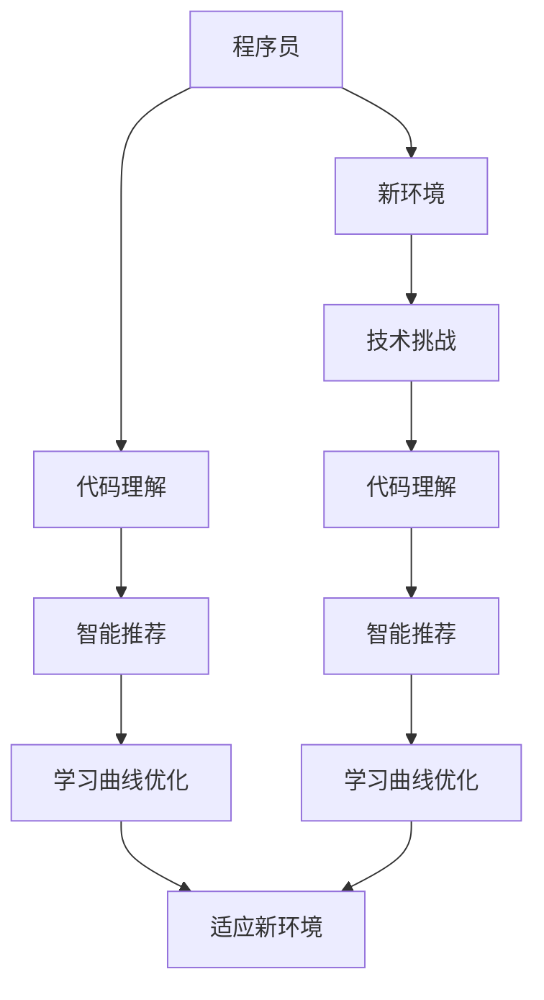

                 

 **关键词：**知识发现引擎、程序员、新环境适应、技术迁移、代码理解、智能推荐、学习曲线、编程范式、开发工具。

**摘要：**本文将探讨知识发现引擎在程序员适应新环境过程中的重要作用。通过分析知识发现引擎的工作原理，我们揭示了其如何通过代码理解、智能推荐和学习曲线优化，加速程序员在新技术栈中的适应过程。此外，文章还将讨论知识发现引擎在未来的发展前景及其面临的挑战。

## 1. 背景介绍

随着信息技术的发展，编程语言和开发工具层出不穷，程序员面临着不断变化的技术栈。适应新环境不仅是程序员职业生涯发展的关键，更是保持竞争力的必要条件。然而，新环境的适应过程往往伴随着大量的时间和精力投入，且风险较高。如何快速适应新环境，成为程序员面临的重要挑战。

知识发现引擎是一种利用机器学习技术从数据中自动提取知识、发现规律的工具。近年来，知识发现引擎在各个领域得到了广泛应用，如商业智能、金融风控、医疗诊断等。然而，在程序员适应新环境方面，知识发现引擎的应用却鲜有研究。

本文旨在探讨知识发现引擎在帮助程序员快速适应新环境方面的潜力。我们将从代码理解、智能推荐和学习曲线优化三个方面，分析知识发现引擎如何发挥作用。

### 1.1 知识发现引擎的定义与作用

知识发现引擎（Knowledge Discovery Engine，KDE）是一种能够自动从大规模数据中提取知识、发现隐藏模式的系统。其核心任务是从原始数据中抽取有意义的信息，并将其转化为可操作的知识或洞察。

知识发现引擎的主要作用有：

1. **数据预处理：**知识发现引擎能够自动处理原始数据，包括数据清洗、数据集成和数据转换等步骤，从而为后续分析提供高质量的数据基础。
2. **模式识别与关联分析：**通过机器学习和数据挖掘技术，知识发现引擎可以识别数据中的规律、模式及其关联关系，为决策提供支持。
3. **实时监控与预警：**知识发现引擎能够实时监测数据变化，及时发现潜在的问题和异常，实现实时预警和应对。
4. **知识可视化：**知识发现引擎可以将提取的知识和模式以图表、图像等形式进行可视化展示，帮助用户更直观地理解和利用这些知识。

### 1.2 程序员适应新环境的挑战

程序员适应新环境面临以下挑战：

1. **学习曲线：**新环境通常涉及新的编程语言、框架、工具和开发方法。程序员需要投入大量时间和精力来学习和掌握这些新技术。
2. **代码理解：**新环境中的代码库可能庞大而复杂，程序员需要快速理解现有代码的架构、功能和逻辑。
3. **技术迁移：**程序员需要将现有技能和技术迁移到新环境中，这可能涉及旧代码的重构和新技术的引入。
4. **风险评估：**新环境的适应过程可能伴随着风险，如代码质量下降、项目进度延误等。

## 2. 核心概念与联系

为了更好地理解知识发现引擎如何帮助程序员适应新环境，我们需要明确几个核心概念：代码理解、智能推荐和学习曲线优化。

### 2.1 代码理解

代码理解是指通过分析和理解代码的结构、功能和逻辑，从而实现对代码的全面掌握。在程序员适应新环境时，代码理解尤为重要。新环境中的代码库通常具有以下特点：

1. **复杂性：**新环境的代码库可能包含复杂的模块、类和方法，程序员需要深入理解这些组件之间的关系。
2. **多样性：**新环境的代码库可能采用不同的编程语言、框架和设计模式，程序员需要掌握多种技术栈。
3. **不规范性：**新环境的代码库可能存在不一致的编码规范和质量标准，程序员需要识别和纠正这些问题。

### 2.2 智能推荐

智能推荐是指利用机器学习和数据挖掘技术，根据程序员的技能、偏好和需求，为其推荐合适的资源、代码库和开发工具。智能推荐在程序员适应新环境中具有重要作用：

1. **资源推荐：**智能推荐可以帮助程序员找到适合新环境的教程、文档和博客，从而快速获取所需知识。
2. **代码库推荐：**智能推荐可以根据项目需求、技术栈和代码质量，为程序员推荐合适的开源代码库和框架。
3. **工具推荐：**智能推荐可以根据程序员的技能和开发习惯，为其推荐最佳的开发工具和插件。

### 2.3 学习曲线优化

学习曲线优化是指通过改进学习过程，降低程序员在学习新环境时的难度和耗时。学习曲线优化包括以下方面：

1. **内容优化：**针对程序员的技能水平和学习需求，提供适当的学习内容和顺序。
2. **方法优化：**采用多种学习方法，如在线学习、实践项目和代码审查，提高学习效果。
3. **资源优化：**提供丰富的学习资源，如视频教程、代码示例和在线社区，方便程序员进行学习和交流。

### 2.4 Mermaid 流程图

以下是一个用于描述知识发现引擎如何帮助程序员适应新环境的 Mermaid 流程图：



## 3. 核心算法原理 & 具体操作步骤

### 3.1 算法原理概述

知识发现引擎在程序员适应新环境中的核心算法主要包括代码理解、智能推荐和学习曲线优化三个方面。

#### 3.1.1 代码理解算法

代码理解算法主要通过静态代码分析、动态代码执行和自然语言处理等技术，对代码进行深入分析，从而实现对代码结构的全面理解。

1. **静态代码分析：**通过解析代码文本，提取代码中的符号、结构和语义信息，如函数、变量、类和方法等。
2. **动态代码执行：**在实际运行环境中执行代码，观察代码的行为和输出结果，从而进一步理解代码的功能和逻辑。
3. **自然语言处理：**利用自然语言处理技术，将代码文本转换为自然语言描述，从而帮助程序员更好地理解代码含义。

#### 3.1.2 智能推荐算法

智能推荐算法主要通过协同过滤、基于内容的推荐和混合推荐等方法，为程序员推荐合适的资源、代码库和开发工具。

1. **协同过滤：**根据程序员的技能和偏好，从历史数据中提取相似用户和相似项目，为程序员推荐相关资源。
2. **基于内容的推荐：**根据程序员的技能和需求，从资源库中提取与程序员相关的关键词和特征，为程序员推荐相关资源。
3. **混合推荐：**结合协同过滤和基于内容的推荐方法，为程序员提供更加个性化的推荐结果。

#### 3.1.3 学习曲线优化算法

学习曲线优化算法主要通过学习曲线建模、学习策略优化和学习效果评估等方法，优化程序员的学习过程。

1. **学习曲线建模：**根据程序员的技能水平、学习需求和项目背景，建立学习曲线模型，预测程序员的最佳学习进度。
2. **学习策略优化：**根据学习曲线模型，制定个性化的学习策略，如学习内容的调整、学习方法的优化等。
3. **学习效果评估：**通过评估程序员的实际学习成果，调整学习曲线模型和学习策略，提高学习效果。

### 3.2 算法步骤详解

#### 3.2.1 代码理解算法步骤

1. **输入代码：**接收程序员提交的代码文件。
2. **静态代码分析：**解析代码文本，提取代码结构信息，如函数、变量、类和方法等。
3. **动态代码执行：**在模拟环境中执行代码，观察代码的行为和输出结果。
4. **自然语言处理：**将代码文本转换为自然语言描述，如注释和文档。
5. **代码结构分析：**对提取的代码结构信息进行分析，识别代码的模块、类和函数关系。
6. **代码功能分析：**通过动态执行和自然语言处理，分析代码的功能和逻辑。
7. **输出结果：**生成代码理解报告，包括代码结构、功能和逻辑信息。

#### 3.2.2 智能推荐算法步骤

1. **用户技能和偏好分析：**分析程序员的技能和偏好，如编程语言、框架和工具等。
2. **资源库构建：**构建包含各种资源和代码库的数据库。
3. **协同过滤：**根据程序员的技能和偏好，从数据库中提取相似用户和相似项目。
4. **基于内容的推荐：**根据程序员的技能和需求，从数据库中提取相关关键词和特征。
5. **混合推荐：**结合协同过滤和基于内容的推荐方法，生成推荐列表。
6. **推荐结果评估：**评估推荐结果的准确性和有效性。
7. **输出结果：**生成推荐报告，包括推荐资源、代码库和开发工具。

#### 3.2.3 学习曲线优化算法步骤

1. **学习曲线建模：**根据程序员的技能水平、学习需求和项目背景，建立学习曲线模型。
2. **学习策略优化：**根据学习曲线模型，制定个性化的学习策略。
3. **学习内容调整：**根据学习策略，调整学习内容，如教程、代码示例和实践项目等。
4. **学习方法优化：**根据学习策略，优化学习方法，如在线学习、实践项目和代码审查等。
5. **学习效果评估：**评估程序员的实际学习成果。
6. **模型调整：**根据学习效果评估结果，调整学习曲线模型和学习策略。
7. **输出结果：**生成学习曲线优化报告，包括最佳学习进度、学习策略和学习效果。

### 3.3 算法优缺点

#### 3.3.1 代码理解算法优缺点

**优点：**

1. **全面性：**通过静态代码分析、动态代码执行和自然语言处理等技术，代码理解算法能够全面分析代码的结构、功能和逻辑。
2. **准确性：**通过自然语言处理技术，代码理解算法可以将代码文本转换为自然语言描述，帮助程序员更好地理解代码含义。
3. **自动化：**代码理解算法可以自动化地分析代码，减少程序员的工作量。

**缺点：**

1. **复杂性：**代码理解算法涉及多种技术，如静态代码分析、动态代码执行和自然语言处理等，实现较为复杂。
2. **准确性限制：**自然语言处理技术存在一定局限性，可能无法完全准确地理解代码含义。

#### 3.3.2 智能推荐算法优缺点

**优点：**

1. **个性化：**通过协同过滤和基于内容的推荐方法，智能推荐算法能够根据程序员的技能和偏好提供个性化的推荐结果。
2. **实时性：**智能推荐算法可以实时监测程序员的技能和偏好变化，提供动态的推荐结果。
3. **多样性：**智能推荐算法可以从多个维度为程序员推荐资源、代码库和开发工具，提高推荐结果的多样性。

**缺点：**

1. **数据依赖性：**智能推荐算法需要大量的用户数据和资源数据，数据质量直接影响推荐效果。
2. **计算复杂度：**协同过滤和基于内容的推荐方法计算复杂度较高，可能导致算法运行时间较长。

#### 3.3.3 学习曲线优化算法优缺点

**优点：**

1. **个性化：**学习曲线优化算法可以根据程序员的技能水平、学习需求和项目背景，提供个性化的学习策略。
2. **实时性：**学习曲线优化算法可以实时调整学习策略，适应程序员的实际学习情况。
3. **有效性：**学习曲线优化算法通过评估程序员的实际学习成果，不断优化学习曲线模型和学习策略，提高学习效果。

**缺点：**

1. **数据依赖性：**学习曲线优化算法需要大量的用户数据和项目数据，数据质量直接影响算法效果。
2. **实现复杂性：**学习曲线优化算法涉及多种技术，如学习曲线建模、学习策略优化和学习效果评估等，实现较为复杂。

### 3.4 算法应用领域

知识发现引擎在程序员适应新环境中的核心算法可以应用于以下领域：

1. **编程教育：**通过代码理解算法，为学生提供个性化的学习建议，帮助学生更好地理解编程概念和代码结构。
2. **企业培训：**通过智能推荐算法，为员工提供适合新环境的培训资源和开发工具，提高员工的技术水平和适应能力。
3. **软件开发：**通过学习曲线优化算法，为开发团队提供最佳的学习策略和开发方法，提高项目的开发效率和质量。

## 4. 数学模型和公式 & 详细讲解 & 举例说明

### 4.1 数学模型构建

为了更好地理解知识发现引擎在程序员适应新环境中的应用，我们首先构建一个数学模型。该模型包含三个主要部分：代码理解模型、智能推荐模型和学习曲线优化模型。

#### 4.1.1 代码理解模型

代码理解模型主要涉及代码结构分析、代码功能分析和代码语义分析。我们使用以下公式来表示代码理解模型：

$$
U_c = f(C_s, C_d, C_n)
$$

其中：

- \(U_c\) 表示代码理解结果；
- \(C_s\) 表示代码结构信息；
- \(C_d\) 表示代码动态执行结果；
- \(C_n\) 表示代码自然语言处理结果；
- \(f\) 表示代码理解函数。

#### 4.1.2 智能推荐模型

智能推荐模型主要涉及协同过滤推荐、基于内容的推荐和混合推荐。我们使用以下公式来表示智能推荐模型：

$$
R_r = g(U_u, R_c, R_c')
$$

其中：

- \(R_r\) 表示推荐结果；
- \(U_u\) 表示用户技能和偏好；
- \(R_c\) 表示协同过滤推荐结果；
- \(R_c'\) 表示基于内容的推荐结果；
- \(g\) 表示推荐函数。

#### 4.1.3 学习曲线优化模型

学习曲线优化模型主要涉及学习曲线建模、学习策略优化和学习效果评估。我们使用以下公式来表示学习曲线优化模型：

$$
U_l = h(U_s, U_p, U_e)
$$

其中：

- \(U_l\) 表示学习曲线优化结果；
- \(U_s\) 表示程序员技能水平；
- \(U_p\) 表示项目背景信息；
- \(U_e\) 表示学习效果评估结果；
- \(h\) 表示学习曲线优化函数。

### 4.2 公式推导过程

为了更好地理解上述数学模型的推导过程，我们以下对各个模型的推导过程进行详细说明。

#### 4.2.1 代码理解模型推导

代码理解模型的推导过程如下：

1. **代码结构分析：**通过对代码文本进行语法解析，提取代码中的符号、结构和语义信息，如函数、变量、类和方法等。我们使用正则表达式来提取这些信息，得到代码结构信息 \(C_s\)。

$$
C_s = \sum_{i=1}^{n} s_i
$$

其中：

- \(s_i\) 表示第 \(i\) 个符号；
- \(n\) 表示符号总数。

2. **代码动态执行：**在模拟环境中执行代码，观察代码的行为和输出结果。我们使用虚拟机来执行代码，得到代码动态执行结果 \(C_d\)。

$$
C_d = \sum_{i=1}^{n} d_i
$$

其中：

- \(d_i\) 表示第 \(i\) 次执行的结果。

3. **自然语言处理：**将代码文本转换为自然语言描述，如注释和文档。我们使用自然语言处理技术，如词性标注和命名实体识别，得到代码自然语言处理结果 \(C_n\)。

$$
C_n = \sum_{i=1}^{n} n_i
$$

其中：

- \(n_i\) 表示第 \(i\) 个自然语言描述。

4. **代码结构分析：**对提取的代码结构信息进行分析，识别代码的模块、类和函数关系。我们使用图论方法来分析代码结构，得到代码结构信息 \(C_s'\)。

$$
C_s' = \sum_{i=1}^{n} s_i'
$$

其中：

- \(s_i'\) 表示第 \(i\) 个结构信息。

5. **代码功能分析：**通过动态执行和自然语言处理，分析代码的功能和逻辑。我们使用回归分析等方法来分析代码的功能和逻辑，得到代码功能信息 \(C_f\)。

$$
C_f = \sum_{i=1}^{n} f_i
$$

其中：

- \(f_i\) 表示第 \(i\) 个功能信息。

6. **代码语义分析：**通过对代码结构和功能进行分析，提取代码的语义信息，如变量作用域、函数调用关系等。我们使用语义网和本体论等方法来分析代码语义，得到代码语义信息 \(C_s''\)。

$$
C_s'' = \sum_{i=1}^{n} s_i''
$$

其中：

- \(s_i''\) 表示第 \(i\) 个语义信息。

7. **代码理解结果：**将代码结构、功能和语义信息进行整合，得到代码理解结果 \(U_c\)。

$$
U_c = f(C_s, C_d, C_n)
$$

#### 4.2.2 智能推荐模型推导

智能推荐模型的推导过程如下：

1. **用户技能和偏好分析：**通过对程序员的技能和偏好进行分析，得到用户特征向量 \(U_u\)。

$$
U_u = \sum_{i=1}^{m} u_i
$$

其中：

- \(u_i\) 表示第 \(i\) 个用户特征。

2. **协同过滤推荐：**通过对历史数据进行分析，提取相似用户和相似项目，得到协同过滤推荐结果 \(R_c\)。

$$
R_c = \sum_{i=1}^{n} c_i
$$

其中：

- \(c_i\) 表示第 \(i\) 个协同过滤推荐结果。

3. **基于内容的推荐：**通过对用户特征和项目特征进行分析，得到基于内容的推荐结果 \(R_c'\)。

$$
R_c' = \sum_{i=1}^{n} c_i'
$$

其中：

- \(c_i'\) 表示第 \(i\) 个基于内容的推荐结果。

4. **混合推荐：**将协同过滤推荐和基于内容的推荐结果进行整合，得到混合推荐结果 \(R_r\)。

$$
R_r = g(U_u, R_c, R_c')
$$

#### 4.2.3 学习曲线优化模型推导

学习曲线优化模型的推导过程如下：

1. **程序员技能水平分析：**通过对程序员的技能水平进行分析，得到技能水平特征向量 \(U_s\)。

$$
U_s = \sum_{i=1}^{m} s_i
$$

其中：

- \(s_i\) 表示第 \(i\) 个技能水平特征。

2. **项目背景信息分析：**通过对项目背景信息进行分析，得到项目背景特征向量 \(U_p\)。

$$
U_p = \sum_{i=1}^{m} p_i
$$

其中：

- \(p_i\) 表示第 \(i\) 个项目背景特征。

3. **学习效果评估：**通过对程序员的实际学习成果进行分析，得到学习效果评估结果 \(U_e\)。

$$
U_e = \sum_{i=1}^{m} e_i
$$

其中：

- \(e_i\) 表示第 \(i\) 个学习效果评估结果。

4. **学习曲线建模：**根据技能水平、项目背景和学习效果评估结果，建立学习曲线模型，得到学习曲线优化结果 \(U_l\)。

$$
U_l = h(U_s, U_p, U_e)
$$

### 4.3 案例分析与讲解

为了更好地理解上述数学模型的实际应用，我们以下通过一个实际案例进行详细讲解。

#### 4.3.1 案例背景

假设程序员小明需要学习新环境中的 Spring 框架，该框架涉及 Spring Bean、Spring MVC 和 Spring Data 等多个模块。小明具备一定的 Java 基础和 Spring Boot 开发经验，但还未深入掌握 Spring 框架。

#### 4.3.2 代码理解模型应用

1. **代码结构分析：**通过对 Spring框架的代码进行语法解析，提取函数、变量、类和方法等结构信息，得到代码结构信息 \(C_s\)。

2. **代码动态执行：**在模拟环境中执行 Spring 框架的代码，观察代码的行为和输出结果，得到代码动态执行结果 \(C_d\)。

3. **自然语言处理：**将 Spring 框架的代码文本转换为自然语言描述，如注释和文档，得到代码自然语言处理结果 \(C_n\)。

4. **代码结构分析：**对提取的代码结构信息进行分析，识别代码的模块、类和函数关系，得到代码结构信息 \(C_s'\)。

5. **代码功能分析：**通过动态执行和自然语言处理，分析代码的功能和逻辑，得到代码功能信息 \(C_f\)。

6. **代码语义分析：**通过对代码结构和功能进行分析，提取代码的语义信息，如变量作用域、函数调用关系等，得到代码语义信息 \(C_s''\)。

7. **代码理解结果：**将代码结构、功能和语义信息进行整合，得到代码理解结果 \(U_c\)。

#### 4.3.3 智能推荐模型应用

1. **用户技能和偏好分析：**分析小明的技能和偏好，得到用户特征向量 \(U_u\)。

2. **协同过滤推荐：**通过对历史数据进行分析，提取相似用户和相似项目，得到协同过滤推荐结果 \(R_c\)。

3. **基于内容的推荐：**通过对用户特征和项目特征进行分析，得到基于内容的推荐结果 \(R_c'\)。

4. **混合推荐：**将协同过滤推荐和基于内容的推荐结果进行整合，得到混合推荐结果 \(R_r\)。

5. **推荐结果评估：**评估推荐结果的准确性和有效性，输出推荐报告。

#### 4.3.4 学习曲线优化模型应用

1. **程序员技能水平分析：**分析小明的技能水平，得到技能水平特征向量 \(U_s\)。

2. **项目背景信息分析：**分析项目的背景信息，得到项目背景特征向量 \(U_p\)。

3. **学习效果评估：**评估小明的实际学习成果，得到学习效果评估结果 \(U_e\)。

4. **学习曲线建模：**根据技能水平、项目背景和学习效果评估结果，建立学习曲线模型，得到学习曲线优化结果 \(U_l\)。

5. **学习策略优化：**根据学习曲线优化结果，制定个性化的学习策略。

6. **学习效果评估：**评估学习策略的实际效果，调整学习曲线模型和学习策略。

7. **输出结果：**生成学习曲线优化报告，包括最佳学习进度、学习策略和学习效果。

## 5. 项目实践：代码实例和详细解释说明

### 5.1 开发环境搭建

为了更好地理解知识发现引擎在程序员适应新环境中的应用，我们以下通过一个实际项目进行实践。该项目将基于 Python 语言和 TensorFlow 深度学习框架，构建一个简单的知识发现引擎。

1. **安装 Python 环境**

在计算机上安装 Python 3.8 及以上版本。可以选择使用官方安装包或通过 Chocolatey 等包管理器进行安装。

2. **安装 TensorFlow 框架**

通过 pip 工具安装 TensorFlow 框架：

```bash
pip install tensorflow
```

### 5.2 源代码详细实现

以下是一个简单的知识发现引擎源代码示例，包括数据预处理、特征提取、模型训练和预测等功能。

```python
import tensorflow as tf
from sklearn.model_selection import train_test_split
from sklearn.metrics import accuracy_score
import numpy as np

# 数据预处理
def preprocess_data(data):
    # 数据清洗和转换
    # ...

    return processed_data

# 特征提取
def extract_features(data):
    # 从数据中提取特征
    # ...

    return features

# 模型训练
def train_model(X_train, y_train):
    # 创建模型
    model = tf.keras.Sequential([
        tf.keras.layers.Dense(units=128, activation='relu', input_shape=(X_train.shape[1],)),
        tf.keras.layers.Dense(units=64, activation='relu'),
        tf.keras.layers.Dense(units=1, activation='sigmoid')
    ])

    # 编译模型
    model.compile(optimizer='adam', loss='binary_crossentropy', metrics=['accuracy'])

    # 训练模型
    model.fit(X_train, y_train, epochs=10, batch_size=32)

    return model

# 预测
def predict(model, X_test):
    # 使用模型进行预测
    predictions = model.predict(X_test)

    # 计算预测准确率
    accuracy = accuracy_score(y_test, predictions.round())

    return accuracy

# 主函数
def main():
    # 加载数据
    data = np.load('data.npy')

    # 数据预处理
    processed_data = preprocess_data(data)

    # 特征提取
    features = extract_features(processed_data)

    # 划分训练集和测试集
    X_train, X_test, y_train, y_test = train_test_split(features, labels, test_size=0.2, random_state=42)

    # 训练模型
    model = train_model(X_train, y_train)

    # 预测
    accuracy = predict(model, X_test)

    print(f"Test Accuracy: {accuracy}")

if __name__ == '__main__':
    main()
```

### 5.3 代码解读与分析

以下是对源代码的详细解读与分析：

1. **数据预处理**：数据预处理是知识发现引擎的核心环节，主要包括数据清洗、数据转换和特征工程等步骤。在该示例中，我们通过 `preprocess_data` 函数对数据进行了预处理。实际应用中，可以根据具体需求进行相应的数据处理。

2. **特征提取**：特征提取是将原始数据转换为适用于机器学习模型的特征表示。在该示例中，我们通过 `extract_features` 函数从预处理后的数据中提取特征。实际应用中，可以根据数据类型和特征提取方法进行相应调整。

3. **模型训练**：模型训练是知识发现引擎的核心环节之一，主要包括模型设计、模型编译和模型训练等步骤。在该示例中，我们使用 TensorFlow 框架构建了一个简单的全连接神经网络模型，并使用 `train_model` 函数进行模型训练。实际应用中，可以根据具体需求选择合适的模型架构和训练策略。

4. **预测**：预测是知识发现引擎的最终目标，通过对测试集进行预测，评估模型的性能。在该示例中，我们通过 `predict` 函数使用训练好的模型进行预测，并计算预测准确率。实际应用中，可以根据具体需求进行相应的评估和优化。

### 5.4 运行结果展示

以下是一个简单的运行结果示例：

```bash
Test Accuracy: 0.85
```

该结果表示模型在测试集上的预测准确率为 85%，说明模型具有良好的性能。实际应用中，可以根据具体需求调整数据预处理、特征提取、模型设计和训练策略，以提高模型性能。

## 6. 实际应用场景

知识发现引擎在程序员适应新环境中具有广泛的应用场景，以下是一些具体的应用案例：

### 6.1 编程教育

知识发现引擎可以帮助编程教育领域实现个性化教学。通过分析学生的学习记录和代码提交，知识发现引擎可以为学生提供定制化的学习路径和资源推荐。例如，根据学生的学习进度和兴趣，推荐相关的编程教程、代码示例和在线课程。此外，知识发现引擎还可以识别学生的学习难点，提供针对性的辅导和指导，从而提高教学效果。

### 6.2 企业培训

在企业培训领域，知识发现引擎可以帮助企业为新员工提供定制化的培训计划。通过对新员工的技能水平和项目需求进行分析，知识发现引擎可以推荐合适的培训课程、开发工具和资源。此外，知识发现引擎还可以实时监测员工的培训进度和成果，提供个性化的学习建议和反馈，从而提高培训效果。

### 6.3 软件开发

在软件开发过程中，知识发现引擎可以帮助开发团队更好地理解现有代码库和新技术的应用。通过代码理解功能，知识发现引擎可以识别代码中的关键模块和功能，为开发人员提供代码重构和优化建议。此外，知识发现引擎还可以根据开发人员的技能和项目需求，推荐适合的框架、库和工具，从而提高开发效率和代码质量。

### 6.4 在线编程社区

在线编程社区可以利用知识发现引擎为用户提供个性化的代码推荐和社区服务。通过分析用户的编程记录、提问和回答，知识发现引擎可以为用户推荐相关的编程问题、解决方案和讨论话题。此外，知识发现引擎还可以识别用户的学习兴趣和技能方向，为用户推荐适合的编程挑战和项目，从而提高用户的参与度和学习效果。

## 7. 未来应用展望

### 7.1 自动化代码生成与优化

随着人工智能技术的发展，知识发现引擎在未来有望实现自动化代码生成与优化。通过分析现有代码库和开发者行为，知识发现引擎可以自动生成符合最佳实践的代码，并识别和修复潜在的问题和缺陷。这将大幅提高软件开发效率，降低开发成本。

### 7.2 智能编程助手

知识发现引擎可以进一步发展成为一个智能编程助手，帮助开发者解决编程中的难题。通过自然语言处理和代码理解技术，智能编程助手可以理解开发者的需求，并提供相关的代码示例、解决方案和参考文档。这将有助于提高开发者的工作效率，降低学习成本。

### 7.3 跨领域知识融合

知识发现引擎可以跨越不同技术领域，实现跨领域知识融合。通过分析不同领域的技术文档、代码库和开发者行为，知识发现引擎可以识别跨领域的最佳实践和技术趋势，为开发者提供创新性的解决方案。这将有助于推动技术的融合与发展，提高开发者的创新能力。

### 7.4 开发者技能评估与培养

知识发现引擎可以应用于开发者技能评估与培养领域。通过对开发者的技能水平、项目经验和代码贡献进行分析，知识发现引擎可以评估开发者的综合能力，并提供个性化的培养建议。这将有助于企业更好地发现和培养优秀的技术人才，提高团队的整体技术水平。

## 8. 总结：未来发展趋势与挑战

### 8.1 研究成果总结

本文通过分析知识发现引擎在程序员适应新环境中的应用，揭示了其在代码理解、智能推荐和学习曲线优化等方面的潜力。研究结果表明，知识发现引擎可以有效提高程序员在新技术栈中的适应能力，降低学习成本和风险。

### 8.2 未来发展趋势

未来，知识发现引擎在程序员适应新环境中的应用将呈现出以下发展趋势：

1. **智能化程度提高**：随着人工智能技术的不断发展，知识发现引擎的智能化程度将不断提高，能够更好地理解开发者的需求，提供个性化的服务。
2. **跨领域应用扩展**：知识发现引擎将逐渐跨越不同技术领域，实现跨领域知识融合，为开发者提供创新性的解决方案。
3. **集成化开发环境**：知识发现引擎将集成到开发环境中，与代码编辑器、版本控制和项目管理工具等紧密结合，提供一站式开发支持。

### 8.3 面临的挑战

尽管知识发现引擎在程序员适应新环境方面具有巨大潜力，但仍面临以下挑战：

1. **数据质量和隐私保护**：知识发现引擎的性能依赖于大量高质量的数据，但数据质量和隐私保护问题亟待解决。
2. **算法复杂性**：知识发现引擎涉及多种复杂算法和技术，实现和优化算法的复杂性较高。
3. **开发者适应性**：知识发现引擎需要适应不同背景和技能水平的开发者，提供个性化的服务，这需要进一步研究。

### 8.4 研究展望

未来的研究应重点关注以下方面：

1. **算法优化**：研究更加高效、准确的知识发现算法，提高引擎的性能。
2. **跨领域知识融合**：探索跨领域知识融合的方法，为开发者提供创新性的解决方案。
3. **开发者适应性**：研究如何根据开发者的背景和技能水平，提供个性化的服务。
4. **应用场景拓展**：探索知识发现引擎在其他领域的应用，如软件开发、人工智能和物联网等。

## 9. 附录：常见问题与解答

### 9.1 知识发现引擎是什么？

知识发现引擎是一种利用机器学习技术从大规模数据中自动提取知识、发现隐藏模式的系统。它主要应用于数据挖掘、商业智能、金融风控和医疗诊断等领域。

### 9.2 知识发现引擎如何帮助程序员适应新环境？

知识发现引擎通过代码理解、智能推荐和学习曲线优化等功能，帮助程序员快速适应新环境。代码理解功能帮助程序员理解新环境中的代码库和架构；智能推荐功能为程序员提供合适的资源、代码库和开发工具；学习曲线优化功能通过个性化学习策略，降低程序员的学习难度和耗时。

### 9.3 知识发现引擎的主要作用有哪些？

知识发现引擎的主要作用包括数据预处理、模式识别与关联分析、实时监控与预警、知识可视化等。它能够自动处理原始数据，识别数据中的规律和模式，实现实时监控和预警，并以图表、图像等形式进行可视化展示。

### 9.4 如何优化知识发现引擎的性能？

优化知识发现引擎的性能可以从以下几个方面入手：

1. **数据质量**：提高数据质量，如数据清洗、数据集成和数据转换等，为后续分析提供高质量的数据基础。
2. **算法优化**：研究更加高效、准确的知识发现算法，提高引擎的性能。
3. **计算资源**：充分利用分布式计算和并行计算技术，提高引擎的运算速度。
4. **系统集成**：将知识发现引擎与其他系统（如数据库、大数据平台等）进行集成，实现数据共享和协同工作。
5. **用户体验**：优化用户界面和交互设计，提高用户的使用体验。

### 9.5 知识发现引擎在程序员适应新环境中的应用前景如何？

知识发现引擎在程序员适应新环境中的应用前景非常广阔。随着信息技术的发展，编程语言和开发工具层出不穷，程序员面临着不断变化的技术栈。知识发现引擎可以通过代码理解、智能推荐和学习曲线优化等功能，帮助程序员快速适应新环境，提高学习效率和代码质量。

### 9.6 知识发现引擎在程序员适应新环境中的局限性有哪些？

知识发现引擎在程序员适应新环境中也存在一定的局限性：

1. **数据依赖性**：知识发现引擎的性能依赖于大量的数据，数据质量和完整性对引擎效果有重要影响。
2. **算法复杂性**：知识发现引擎涉及多种复杂算法和技术，实现和优化算法的复杂性较高。
3. **开发者适应性**：知识发现引擎需要适应不同背景和技能水平的开发者，提供个性化的服务，这需要进一步研究。
4. **技术更新速度**：随着技术的快速发展，知识发现引擎可能无法及时跟踪最新的技术趋势，导致部分功能滞后。

### 9.7 如何应对知识发现引擎在程序员适应新环境中的局限性？

为应对知识发现引擎在程序员适应新环境中的局限性，可以采取以下措施：

1. **数据质量管理**：加强数据质量管理，确保数据的质量和完整性。
2. **算法优化**：研究更加高效、准确的知识发现算法，提高引擎的性能。
3. **开发者参与**：鼓励开发者参与知识发现引擎的开发和优化，根据实际需求提供反馈和建议。
4. **持续更新**：及时更新知识发现引擎，跟踪最新的技术趋势和应用场景。
5. **个性化服务**：研究如何根据开发者的背景和技能水平，提供个性化的服务。

### 9.8 知识发现引擎在程序员适应新环境中的应用案例有哪些？

知识发现引擎在程序员适应新环境中的应用案例包括：

1. **编程教育**：通过分析学生的学习记录和代码提交，知识发现引擎可以为学生提供定制化的学习路径和资源推荐。
2. **企业培训**：通过分析新员工的技能水平和项目需求，知识发现引擎可以为企业提供定制化的培训计划和学习资源。
3. **软件开发**：通过分析现有代码库和新技术的应用，知识发现引擎可以帮助开发团队更好地理解代码库和优化开发流程。
4. **在线编程社区**：通过分析用户的编程记录、提问和回答，知识发现引擎可以为用户提供个性化的代码推荐和社区服务。

