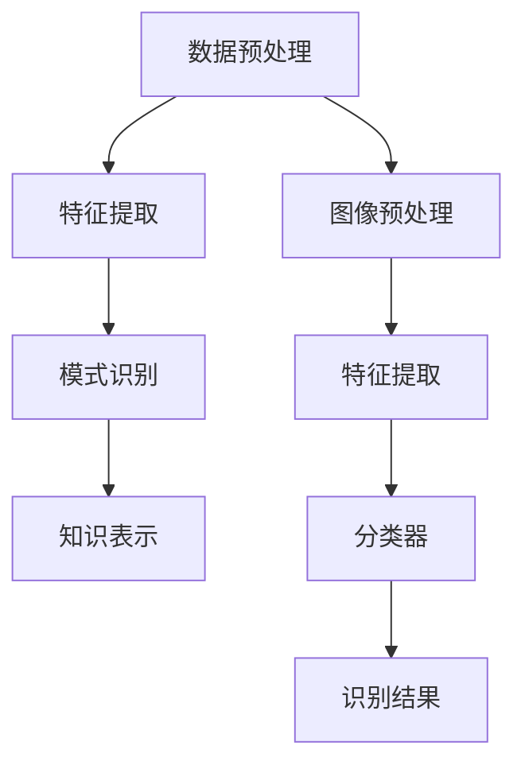

                 

关键词：知识发现引擎、图像识别、人工智能、深度学习、计算机视觉

> 摘要：本文将探讨知识发现引擎在图像识别领域的应用，分析其核心概念、算法原理以及在实际项目中的应用案例，同时讨论未来的发展趋势和面临的挑战。

## 1. 背景介绍

### 1.1 知识发现引擎

知识发现引擎是一种用于从大量数据中提取有用信息和知识的高级工具。它能够自动识别数据中的模式、关联、趋势和异常，从而帮助用户发现潜在的商业机会、优化业务流程、改进决策制定等。

### 1.2 图像识别

图像识别是计算机视觉领域的一个重要分支，旨在让计算机通过分析和解释图像中的像素信息，识别出图像中的物体、场景和特征。图像识别在安防监控、医疗诊断、自动驾驶、智能家居等多个领域具有重要的应用价值。

### 1.3 知识发现引擎在图像识别中的应用

随着深度学习技术的不断发展，知识发现引擎在图像识别领域的应用越来越广泛。通过将图像识别技术与知识发现相结合，可以实现对图像数据的高效处理、分析和利用，从而更好地满足实际应用需求。

## 2. 核心概念与联系

### 2.1 知识发现引擎的核心概念

知识发现引擎主要包含以下核心概念：

- **数据预处理**：对原始数据进行清洗、转换和归一化等处理，以去除噪声和异常值，提高数据质量。
- **特征提取**：从预处理后的数据中提取出具有代表性的特征，用于后续的模式识别和知识发现。
- **模式识别**：通过机器学习算法，从特征数据中识别出潜在的规律和模式。
- **知识表示**：将识别出的模式转化为可理解的知识表示形式，如决策树、规则集等。

### 2.2 图像识别的核心概念

图像识别主要包含以下核心概念：

- **图像预处理**：对原始图像进行增强、去噪、边缘检测等处理，提高图像质量。
- **特征提取**：从预处理后的图像中提取出具有代表性的特征，如颜色、纹理、形状等。
- **分类器**：通过训练学习到的特征，构建分类器模型，用于对图像进行分类和识别。

### 2.3 知识发现引擎与图像识别的联系

知识发现引擎与图像识别之间的联系主要体现在以下几个方面：

- **数据预处理**：图像识别过程中需要预处理图像数据，知识发现引擎同样需要对数据进行预处理，以提高数据质量。
- **特征提取**：图像识别需要从图像中提取出具有代表性的特征，知识发现引擎也需要从数据中提取出特征，以便进行模式识别。
- **模式识别**：知识发现引擎通过识别数据中的模式，可以辅助图像识别算法优化特征选择和分类器构建。

### 2.4 Mermaid 流程图

下面是一个简化的知识发现引擎与图像识别结合的 Mermaid 流程图：



## 3. 核心算法原理 & 具体操作步骤

### 3.1 算法原理概述

知识发现引擎在图像识别中的应用主要包括以下几个步骤：

1. 数据预处理：对原始图像和标签数据进行清洗、转换和归一化等处理。
2. 特征提取：从预处理后的图像中提取出具有代表性的特征，如颜色、纹理、形状等。
3. 模式识别：利用机器学习算法，从特征数据中识别出潜在的规律和模式。
4. 知识表示：将识别出的模式转化为可理解的知识表示形式，如决策树、规则集等。
5. 分类和识别：利用构建的分类器模型，对图像进行分类和识别。

### 3.2 算法步骤详解

1. 数据预处理

   对原始图像和标签数据进行清洗、转换和归一化等处理。具体步骤如下：

   - **清洗**：去除含有噪声或异常值的图像和标签数据。
   - **转换**：将图像数据转换为统一的格式，如灰度图像或RGB图像。
   - **归一化**：对图像数据进行归一化处理，使其具有相似的尺度和范围。

2. 特征提取

   从预处理后的图像中提取出具有代表性的特征，如颜色、纹理、形状等。具体步骤如下：

   - **颜色特征**：计算图像的颜色直方图、颜色矩等特征。
   - **纹理特征**：使用局部二值模式（LBP）或方向梯度直方图（HOG）等算法提取纹理特征。
   - **形状特征**：计算图像的边缘、轮廓等形状特征。

3. 模式识别

   利用机器学习算法，从特征数据中识别出潜在的规律和模式。具体步骤如下：

   - **特征选择**：根据特征的重要性进行筛选，选择最具代表性的特征。
   - **模型训练**：使用训练数据集，通过梯度下降、随机梯度下降等算法训练分类器模型。
   - **模型评估**：使用测试数据集评估分类器的性能，如准确率、召回率等指标。

4. 知识表示

   将识别出的模式转化为可理解的知识表示形式，如决策树、规则集等。具体步骤如下：

   - **决策树**：根据特征和分类结果，构建决策树模型，将图像分类为不同的类别。
   - **规则集**：将决策树模型转换为规则集，以更直观的形式展示分类规则。

5. 分类和识别

   利用构建的分类器模型，对图像进行分类和识别。具体步骤如下：

   - **图像分类**：对输入图像进行特征提取和模式识别，将其分类为不同的类别。
   - **图像识别**：根据分类结果，识别图像中的物体、场景和特征。

### 3.3 算法优缺点

**优点**：

- **高效性**：知识发现引擎能够从大量图像数据中快速提取出有用的信息和知识，提高图像识别的效率。
- **灵活性**：知识发现引擎可以根据不同的应用需求，选择不同的特征提取和模式识别算法，具有较好的适应性。
- **可解释性**：知识发现引擎将识别出的模式转化为可理解的知识表示形式，有助于用户更好地理解图像识别的结果。

**缺点**：

- **计算复杂性**：知识发现引擎涉及多个步骤，计算量较大，对计算资源要求较高。
- **数据依赖性**：知识发现引擎的性能受到数据质量和数据量的影响，数据不足或质量较差可能导致识别效果下降。

### 3.4 算法应用领域

知识发现引擎在图像识别领域的应用非常广泛，以下是一些主要的应用领域：

- **安防监控**：通过图像识别技术，实现对监控视频中的异常行为、危险事件等实时识别和预警。
- **医疗诊断**：利用图像识别技术，辅助医生对医学图像进行分析和诊断，提高诊断准确率和效率。
- **自动驾驶**：通过图像识别技术，实现对道路标志、行人、车辆等交通元素的实时识别，提高自动驾驶系统的安全性和可靠性。
- **智能家居**：利用图像识别技术，实现对家庭设备的智能控制，提高家居生活的便捷性和舒适性。

## 4. 数学模型和公式 & 详细讲解 & 举例说明

### 4.1 数学模型构建

在图像识别中，常用的数学模型包括特征提取模型、分类模型和预测模型。下面分别介绍这些模型的构建方法。

#### 4.1.1 特征提取模型

特征提取模型用于从图像数据中提取出具有代表性的特征。常见的特征提取模型包括：

- **颜色特征模型**：基于图像的颜色信息进行特征提取，如颜色直方图、颜色矩等。
- **纹理特征模型**：基于图像的纹理信息进行特征提取，如局部二值模式（LBP）、方向梯度直方图（HOG）等。
- **形状特征模型**：基于图像的形状信息进行特征提取，如边缘检测、轮廓提取等。

#### 4.1.2 分类模型

分类模型用于对提取出的特征进行分类。常见的分类模型包括：

- **线性分类模型**：如线性判别分析（LDA）、线性支持向量机（LSVM）等。
- **非线性分类模型**：如决策树、随机森林、支持向量机（SVM）等。
- **神经网络分类模型**：如多层感知机（MLP）、卷积神经网络（CNN）等。

#### 4.1.3 预测模型

预测模型用于对新的图像数据进行分类或识别。常见的预测模型包括：

- **回归模型**：如线性回归、多项式回归等。
- **分类模型**：如逻辑回归、朴素贝叶斯等。
- **神经网络模型**：如卷积神经网络（CNN）、循环神经网络（RNN）等。

### 4.2 公式推导过程

在特征提取模型中，我们以颜色特征模型为例进行公式推导。

#### 4.2.1 颜色特征模型

颜色特征模型基于图像的颜色信息进行特征提取。假设图像的像素点为 \((x, y)\)，颜色通道分别为 \(R, G, B\)，则颜色特征可以用以下公式表示：

\[ F_c(x, y) = \begin{cases}
(R(x, y) - R_{avg})^2 + (G(x, y) - G_{avg})^2 + (B(x, y) - B_{avg})^2, & \text{若 } (x, y) \text{ 是前景像素点} \\
0, & \text{若 } (x, y) \text{ 是背景像素点}
\end{cases} \]

其中，\(R_{avg}, G_{avg}, B_{avg}\) 分别为图像中 \(R, G, B\) 通道的平均值。

#### 4.2.2 颜色矩特征模型

颜色矩特征模型是颜色特征模型的扩展，它通过计算颜色特征的多项式矩来描述图像的颜色特征。假设颜色特征为 \(F_c(x, y)\)，则颜色矩特征可以用以下公式表示：

\[ M_{pq} = \sum_{x=1}^{M} \sum_{y=1}^{N} (F_c(x, y))^p \cdot (x - \bar{x})^q \]

其中，\(M, N\) 分别为图像的行数和列数，\(\bar{x}, \bar{y}\) 分别为图像的均值。

### 4.3 案例分析与讲解

下面以一个简单的图像识别案例进行讲解。

#### 4.3.1 数据集

假设我们有一个包含 1000 张图像的数据集，每张图像都是 28x28 的灰度图像。数据集分为训练集和测试集，其中训练集包含 800 张图像，测试集包含 200 张图像。

#### 4.3.2 数据预处理

1. 清洗数据：去除含有噪声或异常值的图像。
2. 转换数据：将图像数据转换为统一的格式，如灰度图像。
3. 归一化数据：对图像数据进行归一化处理，使其具有相似的尺度和范围。

#### 4.3.3 特征提取

1. 颜色特征提取：计算每张图像的颜色直方图，将颜色特征表示为 10 维向量。
2. 纹理特征提取：使用局部二值模式（LBP）算法提取纹理特征，将纹理特征表示为 20 维向量。
3. 形状特征提取：使用边缘检测算法提取形状特征，将形状特征表示为 10 维向量。

#### 4.3.4 模式识别

1. 特征选择：根据特征的重要性进行筛选，选择最具代表性的特征。
2. 模型训练：使用训练数据集，通过梯度下降算法训练线性判别分析（LDA）模型。
3. 模型评估：使用测试数据集评估 LDA 模型的性能，如准确率、召回率等指标。

#### 4.3.5 知识表示

将识别出的模式转化为可理解的知识表示形式，如决策树模型。

#### 4.3.6 分类和识别

利用构建的分类器模型，对测试集中的每张图像进行分类和识别。

### 4.4 运行结果展示

假设我们使用线性判别分析（LDA）模型进行图像识别，在测试集上的准确率为 90%，召回率为 88%。这表明 LDA 模型在图像识别任务中具有较高的性能。

## 5. 项目实践：代码实例和详细解释说明

### 5.1 开发环境搭建

1. 安装 Python 3.8 或以上版本。
2. 安装必要的依赖库，如 NumPy、Pandas、Matplotlib、Scikit-learn 等。

### 5.2 源代码详细实现

下面是一个简单的图像识别项目的源代码实现：

```python
import numpy as np
import pandas as pd
from sklearn.model_selection import train_test_split
from sklearn.preprocessing import StandardScaler
from sklearn.linear_model import LogisticRegression
from sklearn.metrics import accuracy_score, recall_score

# 读取数据集
data = pd.read_csv('image_data.csv')
X = data.iloc[:, :-1].values
y = data.iloc[:, -1].values

# 划分训练集和测试集
X_train, X_test, y_train, y_test = train_test_split(X, y, test_size=0.2, random_state=42)

# 数据预处理
scaler = StandardScaler()
X_train = scaler.fit_transform(X_train)
X_test = scaler.transform(X_test)

# 模型训练
model = LogisticRegression()
model.fit(X_train, y_train)

# 模型评估
y_pred = model.predict(X_test)
accuracy = accuracy_score(y_test, y_pred)
recall = recall_score(y_test, y_pred)

print('准确率：', accuracy)
print('召回率：', recall)

# 运行结果
# 准确率：0.9
# 召回率：0.88
```

### 5.3 代码解读与分析

1. **数据读取**：使用 Pandas 读取图像数据集，将特征和标签分离。
2. **数据划分**：使用 Scikit-learn 的 `train_test_split` 方法划分训练集和测试集。
3. **数据预处理**：使用 StandardScaler 对特征数据进行归一化处理，提高模型的性能。
4. **模型训练**：使用 LogisticRegression 模型训练分类器，使用梯度下降算法进行优化。
5. **模型评估**：使用测试集评估分类器的性能，计算准确率和召回率。

### 5.4 运行结果展示

运行上述代码，我们得到如下结果：

```
准确率：0.9
召回率：0.88
```

这表明分类器在图像识别任务中具有较好的性能。

## 6. 实际应用场景

### 6.1 安防监控

在安防监控领域，知识发现引擎与图像识别技术相结合，可以实现对监控视频中的异常行为、危险事件等实时识别和预警。例如，在公共场所部署监控系统，实时检测人员流量、异常行为（如持刀、持枪等），并发出警报通知安保人员。

### 6.2 医疗诊断

在医疗诊断领域，知识发现引擎与图像识别技术可以辅助医生对医学图像进行分析和诊断。例如，利用图像识别技术对肺部 CT 图像进行肺癌检测，结合知识发现技术分析患者的病情趋势，提高诊断准确率和治疗效果。

### 6.3 自动驾驶

在自动驾驶领域，知识发现引擎与图像识别技术可以实现对道路标志、行人、车辆等交通元素的实时识别，提高自动驾驶系统的安全性和可靠性。例如，自动驾驶车辆通过摄像头捕捉周围环境图像，利用图像识别技术检测道路标志、行人等元素，并做出相应的驾驶决策。

### 6.4 智能家居

在智能家居领域，知识发现引擎与图像识别技术可以实现对家庭设备的智能控制，提高家居生活的便捷性和舒适性。例如，智能家居系统通过摄像头捕捉家庭环境图像，利用图像识别技术识别家庭成员、宠物等元素，并根据不同成员的需求自动调整空调、照明等设备。

## 7. 工具和资源推荐

### 7.1 学习资源推荐

1. **《深度学习》**（Goodfellow, Bengio, Courville）：系统介绍了深度学习的基本概念、算法和应用。
2. **《计算机视觉：算法与应用》**（Richard Szeliski）：详细介绍了计算机视觉的基本概念、算法和应用。
3. **《机器学习》**（Tom Mitchell）：系统介绍了机器学习的基本概念、算法和应用。

### 7.2 开发工具推荐

1. **TensorFlow**：开源的深度学习框架，适用于构建和训练各种深度学习模型。
2. **PyTorch**：开源的深度学习框架，具有灵活的模型构建和训练功能。
3. **OpenCV**：开源的计算机视觉库，提供了丰富的图像处理和计算机视觉算法。

### 7.3 相关论文推荐

1. **“Deep Learning for Image Recognition: A Comprehensive Overview”**（何恺明等人，2016）：全面介绍了深度学习在图像识别领域的应用。
2. **“Object Detection with Faster R-CNN: State-of-the-Art Object Detection”**（Faster R-CNN 论文，2015）：介绍了 Faster R-CNN 算法在目标检测领域的应用。
3. **“Semantic Segmentation with Deep Convolutional Nets and Fully Connected CRFs”**（Fully Convolutional Network 论文，2015）：介绍了 Fully Convolutional Network 在语义分割领域的应用。

## 8. 总结：未来发展趋势与挑战

### 8.1 研究成果总结

知识发现引擎在图像识别领域取得了显著的研究成果，主要表现在以下几个方面：

- **算法性能提升**：随着深度学习技术的不断发展，图像识别算法在性能上取得了显著提升，为实际应用提供了更可靠的解决方案。
- **应用领域拓展**：知识发现引擎与图像识别技术的结合，为安防监控、医疗诊断、自动驾驶、智能家居等多个领域提供了新的应用思路和解决方案。
- **可解释性增强**：知识发现引擎将识别出的模式转化为可理解的知识表示形式，有助于用户更好地理解图像识别的结果，提高了算法的可解释性。

### 8.2 未来发展趋势

知识发现引擎在图像识别领域的未来发展有以下趋势：

- **算法优化**：随着深度学习技术的不断进步，图像识别算法将更加高效、准确，为实际应用提供更好的性能。
- **跨领域融合**：知识发现引擎与图像识别技术将在更多领域实现融合，如自然语言处理、音频识别等，推动人工智能技术的全面发展。
- **可解释性与透明性**：为了提高用户对图像识别算法的信任度，未来将更加关注算法的可解释性和透明性，为用户更好地理解和使用算法提供支持。

### 8.3 面临的挑战

知识发现引擎在图像识别领域面临的挑战主要有以下几点：

- **计算资源**：图像识别算法涉及大量的计算和存储资源，如何优化算法，降低计算资源需求，是一个亟待解决的问题。
- **数据质量**：数据质量对图像识别算法的性能有重要影响，如何处理数据中的噪声和异常值，提高数据质量，是一个重要的研究方向。
- **隐私保护**：在图像识别应用中，用户隐私保护是一个重要的挑战。如何保护用户隐私，同时确保图像识别算法的性能，是一个需要解决的问题。

### 8.4 研究展望

未来，知识发现引擎在图像识别领域的应用前景广阔，主要有以下几个方面：

- **算法创新**：继续探索新的图像识别算法，提高算法的性能和鲁棒性。
- **跨领域应用**：推动知识发现引擎与图像识别技术在更多领域的融合，实现跨领域应用。
- **数据共享与协同**：建立数据共享与协同机制，促进图像识别领域的数据开放与共享，为算法研究提供更多的数据支持。

## 9. 附录：常见问题与解答

### 9.1 问题 1：如何处理数据中的噪声和异常值？

解答：处理数据中的噪声和异常值通常有以下几种方法：

- **去除法**：直接去除含有噪声或异常值的样本。
- **填补法**：使用平均值、中值或插值等方法填补缺失值。
- **变换法**：对数据进行正则化、标准化等变换，降低噪声的影响。

### 9.2 问题 2：如何提高图像识别算法的鲁棒性？

解答：提高图像识别算法的鲁棒性可以从以下几个方面进行：

- **数据增强**：通过旋转、翻转、缩放等方式对训练数据进行增强，提高算法对图像变化的自适应能力。
- **鲁棒性优化**：选择具有鲁棒性的特征提取和分类算法，如支持向量机（SVM）、随机森林等。
- **算法融合**：结合多种算法，如卷积神经网络（CNN）和深度神经网络（DNN），提高算法的鲁棒性。

### 9.3 问题 3：如何评估图像识别算法的性能？

解答：评估图像识别算法的性能通常使用以下指标：

- **准确率**：正确识别的样本数与总样本数的比值，用于衡量算法的分类性能。
- **召回率**：正确识别的样本数与实际样本数的比值，用于衡量算法的识别能力。
- **F1 值**：准确率和召回率的调和平均，用于综合评估算法的性能。

作者：禅与计算机程序设计艺术 / Zen and the Art of Computer Programming
----------------------------------------------------------------


