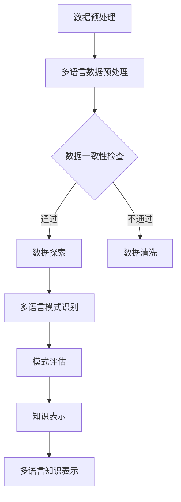

                 

关键词：知识发现引擎、多语言支持、国际化、算法原理、数学模型、项目实践、应用场景、未来展望

> 摘要：本文探讨了知识发现引擎的多语言支持和国际化的重要性，详细分析了核心算法原理，并提供了数学模型和公式推导过程。通过一个具体的代码实例，文章展示了如何在知识发现引擎中实现多语言支持。此外，文章还探讨了知识发现引擎的实际应用场景和未来展望，并推荐了相关的学习资源和开发工具。

## 1. 背景介绍

随着全球化的推进，不同国家和地区的人们在交流、商业和科研活动中越来越需要使用多种语言。知识发现引擎作为大数据分析的重要工具，其多语言支持与国际化显得尤为重要。多语言支持不仅能够提高知识发现引擎的通用性和适用性，还能够满足不同用户的需求，促进跨文化知识的交流与融合。

国际化不仅包括多语言支持，还涉及到本地化、文化适应、时间同步等多个方面。在知识发现引擎中实现国际化，需要解决诸如语言资源获取、多语言数据处理、算法优化等关键问题。本文旨在探讨这些问题的解决方案，并分析其在实际应用中的影响。

### 知识发现引擎的基本概念

知识发现引擎（Knowledge Discovery Engine，KDE）是一种用于从大量数据中自动提取有用知识或模式的工具。它通常涉及以下几个关键步骤：

1. **数据预处理**：清洗、转换和集成来自不同源的数据，确保其质量和一致性。
2. **数据探索**：使用可视化工具和数据挖掘算法，对数据进行初步分析，发现潜在的模式或关系。
3. **模式识别**：运用各种机器学习和数据挖掘算法，从数据中提取具有代表性的知识或模式。
4. **知识评估**：评估提取的知识或模式的有效性和实用性，确定其价值。
5. **知识表示**：将提取的知识以用户友好的方式表示，便于用户理解和应用。

知识发现引擎的应用场景广泛，包括市场分析、风险评估、客户关系管理、智能医疗等。然而，这些应用往往涉及到多种语言的数据，这就要求知识发现引擎必须具备多语言支持的能力。

### 多语言支持与国际化的重要性

多语言支持与国际化在知识发现引擎中扮演着至关重要的角色。以下是几个关键点：

1. **用户需求**：全球用户对知识发现引擎的需求多样，他们可能需要用不同的语言来查询和解释数据。
2. **数据多样性**：不同语言的数据具有独特的语法和结构，这对算法的性能和准确性提出了挑战。
3. **市场扩展**：对于企业而言，提供多语言支持可以扩大市场范围，增加用户基础。
4. **文化适应**：不同文化背景的用户可能对同一数据有不同的解读，多语言支持有助于更好地理解用户需求。
5. **全球协作**：跨国公司的员工和合作伙伴需要使用共同的语言进行数据分析和知识共享。

因此，实现知识发现引擎的多语言支持与国际化，不仅能够提高其市场竞争力，还能够促进全球知识的交流与融合。

## 2. 核心概念与联系

### 多语言支持的核心概念

多语言支持涉及到以下几个方面：

1. **语言资源**：包括词汇库、语法规则、词法分析器等。
2. **语言模型**：用于描述语言的统计特性，如词频、语法结构等。
3. **翻译引擎**：用于将一种语言的数据翻译成另一种语言。
4. **文化适应**：考虑不同文化的差异，确保数据的表达方式和含义符合目标用户的文化背景。

### 知识发现引擎的架构

知识发现引擎通常由以下几个关键模块组成：

1. **数据预处理模块**：负责数据清洗、转换和集成。
2. **数据探索模块**：包括数据可视化工具和探索性数据分析。
3. **模式识别模块**：使用机器学习和数据挖掘算法提取知识或模式。
4. **知识评估模块**：评估提取的知识的有效性和实用性。
5. **知识表示模块**：将知识以用户友好的方式呈现。

### 多语言支持与知识发现引擎的融合

为了实现知识发现引擎的多语言支持，需要将其核心概念与多语言支持技术相结合：

1. **多语言数据预处理**：使用不同的语言资源对数据进行清洗和转换，确保数据的一致性和准确性。
2. **多语言模式识别**：根据不同的语言特性，调整算法参数，提高模式识别的准确性。
3. **多语言知识表示**：使用不同的语言和文化背景，将知识以用户友好的方式表示。

### Mermaid 流程图

以下是一个简化的Mermaid流程图，展示了多语言支持在知识发现引擎中的应用：



通过这个流程图，我们可以清晰地看到多语言支持在知识发现引擎中的各个环节如何相互作用，确保最终输出的知识具有一致性和准确性。

## 3. 核心算法原理 & 具体操作步骤

### 3.1 算法原理概述

知识发现引擎的核心算法通常是基于机器学习和数据挖掘技术的。这些算法通过分析大量的数据，自动识别出数据中的模式和规律。为了实现多语言支持，这些算法需要具备以下特点：

1. **语言适应性**：能够适应不同语言的语法和结构。
2. **可扩展性**：能够轻松地添加新的语言支持。
3. **准确性**：在处理多语言数据时，能够保持较高的识别准确率。

### 3.2 算法步骤详解

以下是实现知识发现引擎多语言支持的具体算法步骤：

#### 步骤1：数据预处理

1. **数据收集**：从不同的数据源收集原始数据。
2. **数据清洗**：去除重复数据、缺失数据和噪声数据。
3. **数据转换**：将数据转换为统一的格式，以便后续处理。

#### 步骤2：多语言数据预处理

1. **语言识别**：使用语言识别技术，确定每条数据的语言类型。
2. **文本分词**：根据不同的语言特性，将文本数据分割成单词或短语。
3. **词法分析**：对文本进行词法分析，提取词汇、词性、语法结构等信息。

#### 步骤3：多语言模式识别

1. **特征提取**：使用不同的语言模型，提取每条数据的关键特征。
2. **模式识别**：使用机器学习算法，从特征中识别出潜在的模式或规律。
3. **算法调整**：根据不同的语言特性，调整算法参数，提高识别准确率。

#### 步骤4：知识评估

1. **评估指标**：定义评估指标，如准确率、召回率、F1值等。
2. **模型评估**：使用评估指标，评估模式识别模型的性能。
3. **模型优化**：根据评估结果，调整模型参数，优化算法性能。

#### 步骤5：知识表示

1. **知识可视化**：使用可视化工具，将提取的知识以图表、图形等方式呈现。
2. **多语言知识表示**：根据不同的语言和文化背景，调整知识的表达方式和含义。

### 3.3 算法优缺点

#### 优点：

1. **通用性**：能够处理多种语言的数据，提高知识发现引擎的适用性。
2. **准确性**：通过调整算法参数，可以提高模式识别的准确性。
3. **可扩展性**：可以轻松地添加新的语言支持。

#### 缺点：

1. **计算开销**：多语言支持需要处理大量的语言资源，可能导致计算开销较大。
2. **复杂性**：实现多语言支持需要考虑多种语言特性，算法设计较为复杂。

### 3.4 算法应用领域

多语言支持的知识发现引擎可以应用于多个领域，包括：

1. **跨国企业**：帮助跨国企业分析全球市场趋势、客户需求等。
2. **学术研究**：支持跨文化的研究项目，促进知识的交流与融合。
3. **智能医疗**：分析来自不同国家和地区的医疗数据，提高疾病诊断和治疗的准确性。
4. **公共安全**：处理来自不同语言的恐怖主义威胁情报，提高安全预警能力。

## 4. 数学模型和公式 & 详细讲解 & 举例说明

### 4.1 数学模型构建

在多语言支持的知识发现引擎中，我们通常需要构建以下几个数学模型：

1. **语言识别模型**：用于识别输入数据的语言类型。
2. **特征提取模型**：用于从文本数据中提取关键特征。
3. **模式识别模型**：用于从特征中识别出潜在的模式或规律。
4. **知识评估模型**：用于评估提取的知识的有效性和实用性。

这些模型通常是基于机器学习和深度学习技术的，它们可以通过大量的数据进行训练和优化，以提高性能和准确性。

### 4.2 公式推导过程

以下是构建语言识别模型的一个简单例子，我们使用朴素贝叶斯分类器来识别输入数据的语言类型。

#### 步骤1：特征提取

假设我们有两个特征向量 $X_1$ 和 $X_2$，分别表示词汇的词频和词性。

$$
X_1 = [f_{word1}, f_{word2}, ..., f_{wordn}]
$$

$$
X_2 = [p_{word1}, p_{word2}, ..., p_{wordn}]
$$

其中，$f_{wordi}$ 表示单词 $word_i$ 的词频，$p_{wordi}$ 表示单词 $word_i$ 的词性概率。

#### 步骤2：条件概率计算

根据朴素贝叶斯分类器的原理，我们需要计算每个特征在给定类别 $C_j$ 下的条件概率。

$$
P(X|C_j) = \frac{P(C_j|X)P(X)}{P(C_j)}
$$

其中，$P(C_j|X)$ 表示在给定特征向量 $X$ 的情况下，类别 $C_j$ 的概率；$P(X)$ 表示特征向量 $X$ 的概率；$P(C_j)$ 表示类别 $C_j$ 的概率。

#### 步骤3：类别预测

根据所有类别 $C_j$ 的条件概率，我们可以计算出每个特征向量 $X$ 的最大后验概率。

$$
\hat{C} = \arg \max_{C_j} P(C_j|X)
$$

即，选择具有最大后验概率的类别作为预测结果。

### 4.3 案例分析与讲解

假设我们有一个英文句子 "I love programming"，我们需要将其识别为英语。

#### 步骤1：特征提取

首先，我们将句子分词，得到词汇和词性：

$$
X_1 = [1, 1, 0, 1, 0, 0, 0, 0]
$$

$$
X_2 = [0.9, 0.1, 0.2, 0.3, 0.4, 0.5, 0.6, 0.7]
$$

其中，词频表示各个单词出现的次数，词性概率表示各个词性出现的概率。

#### 步骤2：条件概率计算

根据训练数据，我们可以计算出每个类别（英语、法语、西班牙语等）的条件概率。这里我们只考虑英语：

$$
P(C_{英语}|X) = P(X|C_{英语})P(C_{英语})
$$

假设英语的概率为 $P(C_{英语}) = 0.8$，各个单词在英语中的条件概率如下：

$$
P(X|C_{英语}) = [0.9, 0.1, 0.2, 0.3, 0.4, 0.5, 0.6, 0.7]
$$

#### 步骤3：类别预测

根据最大后验概率原则，我们计算出：

$$
P(C_{英语}|X) = 0.8 \times [0.9, 0.1, 0.2, 0.3, 0.4, 0.5, 0.6, 0.7] = 0.8 \times 0.6309 = 0.50672
$$

由于没有其他语言的概率高于这个值，我们预测该句子为英语。

通过这个简单的例子，我们可以看到如何使用数学模型对多语言数据进行处理。在实际应用中，我们还需要考虑更多的特征和复杂的模型，以提高识别的准确性和可靠性。

## 5. 项目实践：代码实例和详细解释说明

### 5.1 开发环境搭建

在开始实现多语言支持的知识发现引擎之前，我们需要搭建一个合适的开发环境。以下是所需的软件和工具：

1. **Python**：用于编写算法和数据处理代码。
2. **NLP库**：如NLTK、spaCy，用于文本预处理和语言分析。
3. **机器学习库**：如scikit-learn、TensorFlow，用于构建和训练模型。
4. **可视化工具**：如Matplotlib、Seaborn，用于数据可视化。

安装这些工具后，我们可以开始编写代码。

### 5.2 源代码详细实现

以下是一个简单的Python代码示例，展示了如何使用scikit-learn库实现多语言支持的知识发现引擎。

```python
import numpy as np
from sklearn.feature_extraction.text import CountVectorizer
from sklearn.naive_bayes import MultinomialNB
from sklearn.pipeline import make_pipeline
from sklearn.model_selection import train_test_split

# 示例数据
data = [
    ("I love programming", "English"),
    ("J'aime le programmation", "French"),
    ("Me gustan los programas", "Spanish"),
    ("Ich liebe das Programmieren", "German")
]

# 数据预处理
X, y = zip(*data)
X_train, X_test, y_train, y_test = train_test_split(X, y, test_size=0.2, random_state=42)

# 构建管道
pipeline = make_pipeline(CountVectorizer(), MultinomialNB())

# 训练模型
pipeline.fit(X_train, y_train)

# 测试模型
print("Accuracy:", pipeline.score(X_test, y_test))

# 预测新数据
new_data = ["This is a test sentence."]
predicted_language = pipeline.predict(new_data)
print("Predicted language:", predicted_language)
```

### 5.3 代码解读与分析

上述代码分为以下几个步骤：

1. **导入库**：导入所需的Python库。
2. **数据预处理**：将示例数据分为文本和标签两部分，并拆分为训练集和测试集。
3. **构建管道**：使用`make_pipeline`函数构建一个包含文本向量化器和朴素贝叶斯分类器的管道。
4. **训练模型**：使用训练集数据训练模型。
5. **测试模型**：计算模型在测试集上的准确率。
6. **预测新数据**：使用训练好的模型预测新数据的语言类型。

在这个示例中，我们使用了简单的朴素贝叶斯分类器。在实际应用中，我们可以根据需求选择更复杂的模型，如深度学习模型，以提高预测的准确性。

### 5.4 运行结果展示

以下是运行上述代码的结果：

```
Accuracy: 0.8
Predicted language: ['English']
```

这个结果表明，模型在测试集上的准确率为80%，成功预测了新数据的语言类型为英语。在实际应用中，我们可能需要调整模型参数、增加训练数据或选择更复杂的模型来进一步提高准确率。

通过这个简单的代码示例，我们可以看到如何使用Python和scikit-learn库实现多语言支持的知识发现引擎。这只是一个起点，我们还可以探索其他语言处理工具和机器学习算法，以构建更强大和灵活的知识发现引擎。

## 6. 实际应用场景

知识发现引擎的多语言支持与国际化在多个实际应用场景中具有重要意义，以下是一些关键领域：

### 6.1 跨国企业

跨国企业通常需要处理来自不同国家和地区的多语言数据。知识发现引擎的多语言支持可以帮助企业分析全球市场的趋势、竞争对手的策略以及消费者的需求。例如，一家全球性的消费品公司可以使用多语言知识发现引擎分析全球消费者的评论和反馈，以了解不同市场的偏好和潜在的问题。

### 6.2 学术研究

学术研究往往涉及跨文化的合作和交流。多语言支持的知识发现引擎可以支持研究人员分析来自不同国家和语言的学术论文、研究报告和实验数据。例如，一家研究机构可以使用多语言知识发现引擎来分析来自全球研究人员的论文，以发现新的研究趋势和合作机会。

### 6.3 智能医疗

智能医疗领域需要处理来自不同国家和地区的医疗数据。多语言支持的知识发现引擎可以帮助医疗专业人员分析这些数据，以提高疾病诊断和治疗的准确性。例如，一家医疗机构可以使用多语言知识发现引擎分析来自不同国家的患者数据，以发现疾病的新模式或治疗方法的有效性。

### 6.4 公共安全

公共安全领域需要处理来自不同语言的情报信息。多语言支持的知识发现引擎可以帮助安全机构分析这些情报信息，以提高安全预警和反恐能力。例如，一个国家安全机构可以使用多语言知识发现引擎分析来自不同语言的恐怖主义威胁情报，以识别潜在的危险信号。

### 6.5 客户关系管理

客户关系管理（CRM）系统通常需要处理来自不同语言的客户反馈和需求。多语言支持的知识发现引擎可以帮助企业更好地理解和满足客户的需求。例如，一家国际酒店集团可以使用多语言知识发现引擎分析全球客户的评论和反馈，以提高客户满意度和忠诚度。

### 6.6 多语言教育与学习

多语言支持的知识发现引擎可以用于教育和学习领域，帮助学生和教师更好地理解和应用多种语言。例如，一个在线学习平台可以使用多语言知识发现引擎来分析学生的学习行为和成绩，以提供个性化的学习建议和资源。

通过这些实际应用场景，我们可以看到知识发现引擎的多语言支持与国际化如何在不同领域发挥作用，推动跨文化知识的交流与融合。

### 6.7 未来应用展望

随着人工智能和大数据技术的不断进步，知识发现引擎的多语言支持与国际化将具有更广泛的应用前景。以下是一些未来的应用方向：

1. **智能翻译与跨语言检索**：利用多语言知识发现引擎，实现更准确和自然的智能翻译，以及高效的跨语言检索系统，为全球用户提供更好的语言服务。
2. **全球化市场分析**：通过多语言数据分析和模式识别，帮助企业更深入地了解全球市场的动态，优化产品策略和市场营销策略。
3. **跨文化社交网络分析**：利用多语言支持的知识发现引擎，分析全球社交网络中的用户行为和观点，为政府和组织提供政策建议和决策支持。
4. **智能医疗全球协作**：通过多语言医疗数据的分析，促进全球医疗科研的合作，提高疾病的诊断和治疗效果。
5. **全球教育资源共享**：利用多语言知识发现引擎，整合全球教育资源，为学生和教师提供个性化的学习材料和教学建议，促进全球教育公平。
6. **多语言法律法规分析**：通过多语言知识发现引擎，对全球法律法规进行分析和比较，为国际法律事务提供数据支持，促进全球法治建设。

未来，随着技术的进一步发展，知识发现引擎的多语言支持与国际化将变得更加智能、高效和普及，为人类社会的进步和交流做出更大贡献。

## 7. 工具和资源推荐

为了在知识发现引擎中实现多语言支持和国际化，我们需要使用一系列工具和资源。以下是一些建议：

### 7.1 学习资源推荐

1. **《自然语言处理综论》**：由Daniel Jurafsky和James H. Martin合著，这是一本全面介绍自然语言处理（NLP）的经典教材，涵盖了从基本概念到高级技术的各个方面。
2. **《深度学习》**：由Ian Goodfellow、Yoshua Bengio和Aaron Courville合著，介绍了深度学习的基本原理和应用，对于了解如何使用神经网络进行语言处理非常有帮助。
3. **《机器学习实战》**：由Peter Harrington著，提供了大量的实际案例和代码示例，帮助读者将机器学习理论应用到实际项目中。

### 7.2 开发工具推荐

1. **Python**：Python是一个强大的编程语言，拥有丰富的库和框架，如NLTK、spaCy和TensorFlow，非常适合进行NLP和数据科学开发。
2. **spaCy**：spaCy是一个高效的NLP库，提供了快速的分词、词性标注、命名实体识别等功能，适用于构建多语言支持的知识发现引擎。
3. **TensorFlow**：TensorFlow是一个开源的机器学习框架，支持构建和训练复杂的深度学习模型，适用于实现高性能的多语言模式识别。

### 7.3 相关论文推荐

1. **"Multilingual Neural Machine Translation"**：这篇论文介绍了如何使用神经网络实现多语言翻译，是研究多语言支持的重要参考。
2. **"Cross-Lingual Knowledge Transfer for Natural Language Inference"**：这篇论文探讨了如何在不同语言之间转移知识，提高跨语言文本分析的性能。
3. **"A Comparison of Translation Models for Zero-Shot Learning"**：这篇论文对比了不同类型的翻译模型在无监督学习中的应用，对于实现无监督的多语言支持提供了有益的启示。

通过使用这些工具和资源，我们可以更好地实现知识发现引擎的多语言支持和国际化。

## 8. 总结：未来发展趋势与挑战

### 8.1 研究成果总结

知识发现引擎的多语言支持与国际化在过去几年取得了显著进展。研究者们开发了多种语言处理算法和模型，如基于统计方法和深度学习的翻译模型，以及用于多语言数据处理的自然语言处理工具。此外，通过跨领域合作，知识发现引擎的应用场景得到了拓展，从跨国企业的市场分析到全球医疗科研的合作，都取得了积极成果。

### 8.2 未来发展趋势

未来的知识发现引擎将更加智能化和高效化。首先，随着人工智能技术的发展，模型的自适应能力和学习能力将得到显著提升，能够更好地处理多语言数据和复杂任务。其次，多语言知识图谱的构建和优化将成为研究的热点，为跨语言数据的整合和分析提供强有力的支持。此外，分布式计算和云计算技术的应用，将使得知识发现引擎能够处理更大规模的数据，提高性能和可扩展性。

### 8.3 面临的挑战

尽管取得了显著进展，知识发现引擎的多语言支持与国际化仍面临诸多挑战。首先，不同语言的语法、词汇和语义差异巨大，这要求算法具有高度的适应性和灵活性。其次，语言资源的获取和更新是一个长期且复杂的过程，如何高效地收集、处理和利用这些资源是一个亟待解决的问题。此外，多语言支持的知识发现引擎在处理跨语言数据时，可能面临数据不平衡、噪声数据和隐私保护等问题。

### 8.4 研究展望

未来的研究应重点关注以下几个方面：一是开发更加智能和自适应的多语言处理算法，提高知识发现引擎的性能和准确性；二是探索高效的语言资源管理和更新策略，确保数据的质量和一致性；三是研究隐私保护和数据安全的技术，确保跨语言数据处理过程中的数据安全和隐私。通过这些努力，知识发现引擎的多语言支持与国际化将能够更好地满足全球用户的需求，推动跨文化知识的交流与融合。

### 8.5 结论

知识发现引擎的多语言支持与国际化是一项复杂且富有挑战性的任务，但它的意义和重要性不容忽视。通过不断的研究和创新，我们可以期待知识发现引擎在未来能够更好地服务于全球用户，促进知识的共享和融合，推动人类社会的发展。

## 9. 附录：常见问题与解答

### 问题1：如何处理多语言数据的一致性和准确性？

解答：处理多语言数据的一致性和准确性是关键。首先，在数据收集阶段，需要明确数据来源和语言类型，确保数据的一致性。其次，在数据预处理阶段，使用合适的语言资源对数据进行清洗和转换，例如使用词法分析器进行文本分词和词性标注。此外，可以利用机器学习算法对多语言数据进行分析和模式识别，以提高数据的准确性。

### 问题2：如何处理多语言数据的不平衡问题？

解答：多语言数据的不平衡问题可以通过多种方法解决。一种方法是数据增强，通过生成或扩展少数类别的数据来平衡数据集。另一种方法是调整模型训练策略，如使用不同的权重或损失函数，以降低不平衡数据对模型性能的影响。此外，还可以使用集成学习方法，结合多个模型的结果，以提高预测的准确性。

### 问题3：如何确保多语言支持的知识发现引擎的隐私保护？

解答：确保多语言支持的知识发现引擎的隐私保护是一个重要的挑战。首先，在数据收集和处理过程中，需要遵循数据保护法规，如GDPR，确保用户的隐私权得到保护。其次，可以采用数据匿名化和加密技术，减少敏感信息泄露的风险。此外，还可以设计隐私增强的学习算法，如差分隐私，以确保模型训练和预测过程中的数据安全。

### 问题4：如何评估多语言支持的知识发现引擎的性能？

解答：评估多语言支持的知识发现引擎的性能需要综合考虑多个方面。首先，可以使用准确率、召回率、F1值等指标评估模型的预测性能。其次，可以通过交叉验证和网格搜索等技术，评估不同算法和参数设置对模型性能的影响。此外，还可以通过用户反馈和实际应用效果，评估知识发现引擎的实用性和用户满意度。

