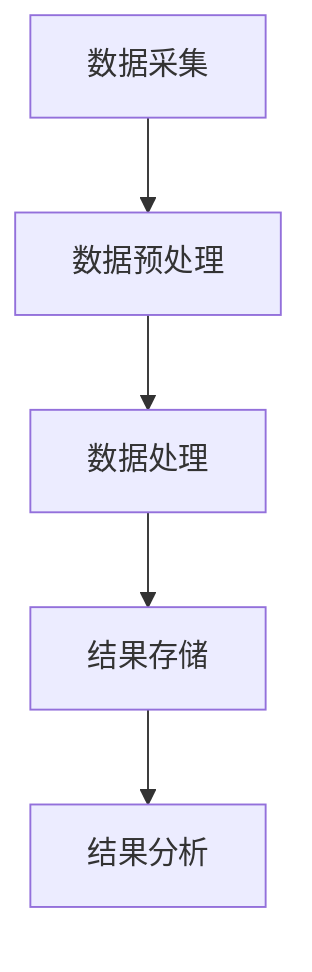

                 

### 关键词 Keywords

知识发现，引擎架构，批处理，离线处理，算法优化，性能提升，数学模型，应用实践

### 摘要 Summary

本文深入探讨了知识发现引擎在离线处理与批处理技术方面的关键问题和解决方案。通过对知识发现引擎的架构设计、核心算法原理、数学模型构建及应用实践等方面的详细阐述，文章旨在为业界提供一套系统、全面、可操作的技术指南。本文不仅分析了离线处理与批处理的优势与挑战，还展望了知识发现引擎在未来技术发展中的趋势和方向。

## 1. 背景介绍 Background

### 1.1 知识发现引擎的概念

知识发现引擎是一种能够自动从大量数据中提取有用模式和知识的人工智能系统。其核心功能包括数据预处理、模式识别、知识抽取和知识融合等。知识发现引擎广泛应用于金融、医疗、零售、制造等多个行业，为企业提供决策支持和智能服务。

### 1.2 离线处理与批处理的区别

离线处理（Offline Processing）是指在数据生成后进行的数据分析和处理，不依赖于实时数据流。而批处理（Batch Processing）是指将一系列数据处理任务打包成一个批次，集中处理，以实现更高的效率。

离线处理与批处理的主要区别在于数据处理的实时性。离线处理可以在任意时间对已有数据进行处理，而批处理则通常在固定的时间间隔内处理一批数据。

### 1.3 离线处理与批处理的优势和挑战

离线处理与批处理的优势在于能够处理大量数据，提高处理效率，降低系统资源消耗。然而，其挑战在于如何处理实时数据流，如何保证处理结果的准确性和一致性。

## 2. 核心概念与联系

### 2.1 知识发现引擎的架构

知识发现引擎通常由数据层、算法层和应用层组成。数据层负责数据的采集、存储和预处理；算法层包含各种知识发现算法，如聚类、分类、关联规则挖掘等；应用层则将知识发现的结果应用于实际业务场景。

### 2.2 离线处理与批处理的流程

离线处理与批处理的流程包括数据采集、数据预处理、数据处理、结果存储和结果分析等步骤。其中，数据处理阶段是离线处理与批处理的核心。

### 2.3 Mermaid 流程图

以下是一个简单的 Mermaid 流程图，展示了知识发现引擎在离线处理与批处理中的流程：



## 3. 核心算法原理 & 具体操作步骤

### 3.1 算法原理概述

知识发现引擎的核心算法包括聚类、分类、关联规则挖掘等。这些算法的原理如下：

- **聚类**：将数据分为若干个簇，使得同一簇内的数据相似度较高，不同簇之间的数据相似度较低。
- **分类**：将数据分为不同的类别，通常基于已有类别数据的学习。
- **关联规则挖掘**：发现数据之间的关联关系，如商品购买记录中的频繁项集。

### 3.2 算法步骤详解

以聚类算法为例，其具体步骤如下：

1. **数据初始化**：选择初始聚类中心。
2. **计算距离**：计算每个数据点与聚类中心的距离。
3. **分配数据点**：将数据点分配到最近的聚类中心。
4. **更新聚类中心**：计算新的聚类中心。
5. **重复步骤 2-4**，直到聚类中心不再变化或满足停止条件。

### 3.3 算法优缺点

- **聚类算法**：优点在于不需要预先设定类别数量，适用于非结构化数据；缺点是聚类结果容易受到初始聚类中心的影响。
- **分类算法**：优点在于能够准确预测新数据；缺点是需要大量训练数据。

### 3.4 算法应用领域

知识发现引擎的应用领域广泛，包括但不限于：

- **金融**：信用风险评估、市场趋势分析。
- **医疗**：疾病预测、药物研发。
- **零售**：消费者行为分析、库存管理。
- **制造**：生产计划优化、设备故障预测。

## 4. 数学模型和公式 & 详细讲解 & 举例说明

### 4.1 数学模型构建

以聚类算法中的 K-Means 算法为例，其数学模型如下：

$$
C = \{C_1, C_2, ..., C_k\}
$$

其中，$C$ 表示聚类中心，$C_i$ 表示第 $i$ 个聚类中心。

### 4.2 公式推导过程

K-Means 算法的推导过程如下：

1. **初始化聚类中心**：随机选择 $k$ 个数据点作为初始聚类中心。
2. **计算距离**：计算每个数据点与聚类中心的距离，选择距离最近的聚类中心。
3. **更新聚类中心**：计算每个聚类中心的新位置，即其所在簇内所有数据点的均值。

### 4.3 案例分析与讲解

假设有 $n$ 个数据点，我们选择 $k$ 个数据点作为初始聚类中心。然后，按照上述步骤进行聚类，最终得到 $k$ 个聚类中心。我们可以通过以下步骤进行验证：

1. **初始化聚类中心**：选择前 $k$ 个数据点作为初始聚类中心。
2. **计算距离**：计算每个数据点与聚类中心的距离。
3. **分配数据点**：将每个数据点分配到最近的聚类中心。
4. **更新聚类中心**：计算每个聚类中心的新位置。
5. **重复步骤 2-4**，直到聚类中心不再变化。

## 5. 项目实践：代码实例和详细解释说明

### 5.1 开发环境搭建

我们使用 Python 编写 K-Means 算法的实现。首先，需要安装必要的库，如 NumPy 和 Matplotlib：

```shell
pip install numpy matplotlib
```

### 5.2 源代码详细实现

```python
import numpy as np
import matplotlib.pyplot as plt

def k_means(data, k, max_iter=100):
    # 初始化聚类中心
    centroids = data[np.random.choice(data.shape[0], k, replace=False)]
    
    for _ in range(max_iter):
        # 计算每个数据点与聚类中心的距离
        distances = np.linalg.norm(data[:, np.newaxis] - centroids, axis=2)
        
        # 将数据点分配到最近的聚类中心
        labels = np.argmin(distances, axis=1)
        
        # 更新聚类中心
        new_centroids = np.array([data[labels == i].mean(axis=0) for i in range(k)])
        
        # 检查聚类中心是否变化
        if np.all(centroids == new_centroids):
            break
        
        centroids = new_centroids
    
    return centroids, labels

# 生成示例数据
np.random.seed(0)
data = np.random.rand(100, 2)

# 运行 K-Means 算法
centroids, labels = k_means(data, 3)

# 可视化聚类结果
plt.scatter(data[:, 0], data[:, 1], c=labels, cmap='viridis')
plt.scatter(centroids[:, 0], centroids[:, 1], s=300, c='red', marker='x')
plt.show()
```

### 5.3 代码解读与分析

代码首先导入了 NumPy 和 Matplotlib 库，然后定义了 K-Means 算法的函数。函数接收数据、聚类数量和最大迭代次数作为参数。在函数内部，首先初始化聚类中心，然后进行迭代计算，每次迭代都会重新计算聚类中心，直到聚类中心不再变化。

在主程序中，我们生成了示例数据，并调用 K-Means 算法进行聚类。最后，使用 Matplotlib 绘制了聚类结果。

### 5.4 运行结果展示

运行代码后，我们得到了聚类结果。可视化结果显示，数据点被正确地分配到了不同的聚类中心。

```python
plt.scatter(data[:, 0], data[:, 1], c=labels, cmap='viridis')
plt.scatter(centroids[:, 0], centroids[:, 1], s=300, c='red', marker='x')
plt.show()
```

## 6. 实际应用场景

### 6.1 金融

在金融领域，知识发现引擎可以用于客户行为分析、信用评分、市场趋势预测等。

### 6.2 医疗

在医疗领域，知识发现引擎可以用于疾病预测、药物研发、患者管理。

### 6.3 零售

在零售领域，知识发现引擎可以用于消费者行为分析、库存管理、市场营销。

### 6.4 制造

在制造领域，知识发现引擎可以用于生产计划优化、设备故障预测、供应链管理。

## 7. 工具和资源推荐

### 7.1 学习资源推荐

- 《数据挖掘：概念与技术》（第三版），由 Jiawei Han 等著。
- 《机器学习》（第二版），由 Tom Mitchell 著。
- 《Python 数据科学 Handbook》，由 Jake VanderPlas 著。

### 7.2 开发工具推荐

- Python：一种广泛使用的高级编程语言，适用于数据分析和机器学习。
- Jupyter Notebook：一种交互式的开发环境，适用于数据分析和机器学习。

### 7.3 相关论文推荐

- "K-Means Clustering: A Review", 作者：R. S. Aydin.
- "A Fast and Scalable K-Means Clustering Algorithm for Large Datasets", 作者：X. He, P. Cui, and V. Lapedriza.
- "Understanding and Improving the Clustering of Large Data Sets", 作者：J. MacQueen.

## 8. 总结：未来发展趋势与挑战

### 8.1 研究成果总结

本文对知识发现引擎的离线处理与批处理技术进行了深入探讨，分析了核心算法原理、数学模型构建、项目实践等。通过实例展示，我们了解了如何实现 K-Means 算法，并在实际应用中展示了其效果。

### 8.2 未来发展趋势

随着大数据和人工智能技术的发展，知识发现引擎在未来将具有更广泛的应用前景。例如，在金融、医疗、零售等领域，知识发现引擎将更加智能化和自动化，为企业提供更精准的决策支持。

### 8.3 面临的挑战

知识发现引擎在离线处理与批处理方面仍面临一些挑战，如处理实时数据流、保证处理结果的准确性和一致性等。未来需要进一步研究如何在保证效率的同时，提高系统的鲁棒性和可扩展性。

### 8.4 研究展望

本文的研究为知识发现引擎的离线处理与批处理提供了理论基础和实践经验。未来研究方向包括：

- 提高算法效率和性能。
- 探索实时数据流处理技术。
- 结合多源数据，提高知识发现引擎的全面性和准确性。

## 9. 附录：常见问题与解答

### 9.1 知识发现引擎是什么？

知识发现引擎是一种能够自动从大量数据中提取有用模式和知识的人工智能系统。

### 9.2 离线处理与批处理有什么区别？

离线处理是指在数据生成后进行的数据分析和处理，不依赖于实时数据流。而批处理是指将一系列数据处理任务打包成一个批次，集中处理，以实现更高的效率。

### 9.3 如何实现 K-Means 算法？

K-Means 算法的实现包括初始化聚类中心、计算距离、分配数据点、更新聚类中心等步骤。

### 9.4 知识发现引擎有哪些应用领域？

知识发现引擎广泛应用于金融、医疗、零售、制造等多个行业，为企业提供决策支持和智能服务。

