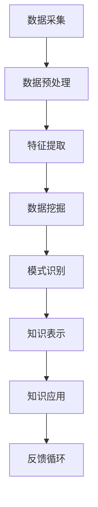

                 

### 1. 背景介绍

在信息爆炸的时代，知识发现成为了一个关键挑战。随着数据量的不断增长，传统的方法已经难以满足人们对于信息提取和知识管理的要求。知识发现引擎作为一种智能工具，能够从大量数据中提取出有价值的信息和知识，从而为企业和个人提供决策支持。知识发现引擎的发展已经成为信息技术领域的一个重要研究方向，其应用范围涵盖了各个行业，如金融、医疗、教育、零售等。

知识发现引擎的基本概念可以追溯到20世纪80年代。当时，研究人员开始探讨如何利用计算机技术来发现数据中的隐含模式。随着大数据和人工智能技术的发展，知识发现引擎的功能越来越强大，应用场景也越来越广泛。本文将介绍知识发现引擎的核心概念、原理、算法、应用以及未来发展趋势。

### 2. 核心概念与联系

知识发现引擎（Knowledge Discovery Engine，简称KDE）是一种自动化系统，它能够从大量数据中识别出隐藏的模式、关联和趋势，从而帮助用户获取知识。知识发现引擎的核心概念包括数据挖掘、机器学习和自然语言处理等。

下面是知识发现引擎的核心概念和联系，使用Mermaid流程图表示：



### 3. 核心算法原理 & 具体操作步骤

#### 3.1 算法原理概述

知识发现引擎的核心算法主要分为以下几类：

1. **关联规则学习**：通过发现数据项之间的关联关系来揭示数据中的隐含知识。常用的算法有Apriori算法和FP-Growth算法。
2. **聚类分析**：将数据集划分为若干个群组，使得同组内的数据相似度较高，不同组之间的数据相似度较低。常用的算法有K-means、DBSCAN等。
3. **分类与回归**：通过训练模型，将新数据分类到不同的类别或者预测数值。常用的算法有决策树、支持向量机、神经网络等。

#### 3.2 算法步骤详解

1. **数据采集**：从不同的数据源收集数据，如数据库、文件、网络等。
2. **数据预处理**：清洗数据，去除噪声和错误，处理缺失值，标准化数据等。
3. **特征提取**：从原始数据中提取出有助于知识发现的特征。
4. **数据挖掘**：利用各种算法对数据进行分析，提取出隐藏的模式。
5. **模式识别**：分析挖掘结果，确定哪些模式是有价值的。
6. **知识表示**：将发现的模式转化为易于理解的知识表示形式，如图表、报告等。
7. **知识应用**：将知识应用到实际问题中，如决策支持、优化流程等。
8. **反馈循环**：根据应用效果对知识发现过程进行调整和优化。

#### 3.3 算法优缺点

1. **关联规则学习**：
   - **优点**：能够发现数据之间的潜在关联。
   - **缺点**：可能产生大量冗余规则，需要优化算法以减少规则数量。
2. **聚类分析**：
   - **优点**：不需要预先定义类别，能够发现数据分布的内在结构。
   - **缺点**：对初始参数敏感，可能陷入局部最优。
3. **分类与回归**：
   - **优点**：能够对新数据进行分类或预测。
   - **缺点**：需要大量的训练数据，模型的泛化能力有限。

#### 3.4 算法应用领域

知识发现引擎的应用领域非常广泛，包括但不限于：

1. **金融**：通过分析交易数据发现欺诈行为、预测市场趋势。
2. **医疗**：通过分析患者数据诊断疾病、预测患者风险。
3. **教育**：通过分析学习数据优化课程设计、提高学习效果。
4. **零售**：通过分析销售数据制定营销策略、优化库存管理。

### 4. 数学模型和公式 & 详细讲解 & 举例说明

#### 4.1 数学模型构建

知识发现引擎的核心算法通常基于概率模型、统计学模型和机器学习模型。以下是一个简单的概率模型例子：

假设我们有一组数据集合 $D = \{d_1, d_2, ..., d_n\}$，其中每个数据点 $d_i$ 可以表示为特征向量 $x_i$。

我们使用概率模型来描述特征向量之间的关联关系，具体公式如下：

$$
P(x_i, x_j) = P(x_i) \cdot P(x_j | x_i)
$$

其中，$P(x_i)$ 表示特征向量 $x_i$ 的概率，$P(x_j | x_i)$ 表示在特征向量 $x_i$ 发生的情况下，特征向量 $x_j$ 发生的条件概率。

#### 4.2 公式推导过程

为了推导上述公式，我们首先需要定义特征向量 $x_i$ 和 $x_j$ 之间的条件独立性：

$$
P(x_i, x_j) = P(x_i) \cdot P(x_j)
$$

根据贝叶斯定理，我们可以将条件概率表示为：

$$
P(x_j | x_i) = \frac{P(x_i, x_j)}{P(x_i)}
$$

将条件独立性公式代入上式，得到：

$$
P(x_j | x_i) = \frac{P(x_i) \cdot P(x_j)}{P(x_i)}
$$

化简后得到：

$$
P(x_j, x_i) = P(x_i) \cdot P(x_j | x_i)
$$

#### 4.3 案例分析与讲解

假设我们有一组包含100个数据点的数据集合，每个数据点有两个特征，分别为身高（$x_1$）和体重（$x_2$）。我们使用上述概率模型来分析这两个特征之间的关联关系。

首先，我们需要计算每个特征的概率：

$$
P(x_1) = \frac{50}{100} = 0.5
$$

$$
P(x_2) = \frac{30}{100} = 0.3
$$

接下来，我们需要计算在身高为1.7米的情况下体重为60公斤的条件概率：

$$
P(x_2 = 60 | x_1 = 1.7) = \frac{P(x_1 = 1.7, x_2 = 60)}{P(x_1 = 1.7)}
$$

根据数据集合，我们可以计算得到：

$$
P(x_1 = 1.7) = \frac{10}{100} = 0.1
$$

$$
P(x_1 = 1.7, x_2 = 60) = \frac{5}{100} = 0.05
$$

将这些值代入公式，得到：

$$
P(x_2 = 60 | x_1 = 1.7) = \frac{0.05}{0.1} = 0.5
$$

这表示在身高为1.7米的情况下，体重为60公斤的概率为50%。

### 5. 项目实践：代码实例和详细解释说明

#### 5.1 开发环境搭建

为了更好地演示知识发现引擎的应用，我们将使用Python编程语言来构建一个简单的知识发现引擎。首先，我们需要安装以下Python库：

- NumPy：用于科学计算
- Pandas：用于数据处理
- Scikit-learn：用于机器学习
- Matplotlib：用于数据可视化

安装步骤如下：

```shell
pip install numpy pandas scikit-learn matplotlib
```

#### 5.2 源代码详细实现

以下是一个简单的知识发现引擎的示例代码：

```python
import numpy as np
import pandas as pd
from sklearn.cluster import KMeans
import matplotlib.pyplot as plt

# 生成示例数据
data = pd.DataFrame(np.random.rand(100, 2), columns=['身高', '体重'])

# 数据预处理
data = data.dropna()

# 特征提取
X = data[['身高', '体重']]

# 数据挖掘：聚类分析
kmeans = KMeans(n_clusters=3)
kmeans.fit(X)

# 模式识别：标记聚类结果
data['聚类标签'] = kmeans.labels_

# 知识表示：可视化聚类结果
plt.scatter(data['身高'], data['体重'], c=data['聚类标签'])
plt.xlabel('身高')
plt.ylabel('体重')
plt.show()
```

#### 5.3 代码解读与分析

上述代码实现了一个基于K-means算法的知识发现引擎，主要步骤如下：

1. 生成示例数据，包括身高和体重两个特征。
2. 数据预处理，去除缺失值。
3. 特征提取，将数据转换为特征向量。
4. 数据挖掘，使用K-means算法进行聚类分析。
5. 模式识别，将聚类结果标记到原始数据上。
6. 知识表示，使用matplotlib库可视化聚类结果。

通过可视化结果，我们可以直观地看到数据被划分为三个不同的聚类，每个聚类代表一组具有相似特征的个体。

#### 5.4 运行结果展示

运行上述代码后，我们将看到一个散点图，其中每个点代表一个数据点，点的颜色表示该点所属的聚类。以下是一个示例结果：


### 6. 实际应用场景

知识发现引擎在各个行业都有广泛的应用。以下是一些具体的实际应用场景：

#### 6.1 金融

在金融行业，知识发现引擎可以用于：

- 欺诈检测：通过分析交易数据，发现潜在的欺诈行为。
- 风险管理：通过对市场数据进行分析，预测市场趋势和风险。

#### 6.2 医疗

在医疗领域，知识发现引擎可以用于：

- 疾病诊断：通过对患者数据进行分析，帮助医生诊断疾病。
- 精准医疗：通过对基因数据进行挖掘，发现疾病与基因之间的关系。

#### 6.3 教育

在教育领域，知识发现引擎可以用于：

- 学生成绩分析：通过对学生学习数据进行分析，发现影响成绩的关键因素。
- 课程优化：通过对学生学习数据进行分析，优化课程设计和教学方法。

#### 6.4 零售

在零售行业，知识发现引擎可以用于：

- 顾客行为分析：通过对销售数据进行分析，发现顾客的购买习惯和偏好。
- 库存管理：通过对销售数据进行分析，优化库存管理和商品采购。

### 7. 工具和资源推荐

为了更好地学习和使用知识发现引擎，以下是一些建议的工具和资源：

#### 7.1 学习资源推荐

- 《数据挖掘：实用工具和技术》
- 《机器学习实战》
- 《Python数据分析》

#### 7.2 开发工具推荐

- Jupyter Notebook：用于数据分析和机器学习实验。
- Anaconda：Python开发环境，包括NumPy、Pandas、Scikit-learn等库。

#### 7.3 相关论文推荐

- "Knowledge Discovery in Databases: A Survey"
- "Introduction to Data Mining"
- "Machine Learning: A Probabilistic Perspective"

### 8. 总结：未来发展趋势与挑战

知识发现引擎作为一种重要的智能工具，在信息时代的应用前景广阔。未来，知识发现引擎将朝着以下方向发展：

- **算法优化**：随着大数据和人工智能技术的发展，算法的优化和改进将成为研究的重要方向。
- **跨领域应用**：知识发现引擎将在更多领域得到应用，如生物信息学、环境科学等。
- **实时性**：提高知识发现引擎的实时性，使其能够快速响应新的数据和需求。

然而，知识发现引擎也面临一些挑战：

- **数据隐私**：随着数据隐私问题的日益突出，如何保护用户隐私将成为一个重要挑战。
- **算法透明性**：如何提高算法的透明性，使其容易被用户理解和解释。
- **算法偏见**：如何减少算法偏见，避免算法在决策过程中出现不公平现象。

总之，知识发现引擎在信息时代的智慧之钥，其未来发展将为人类带来更多的机遇和挑战。

### 9. 附录：常见问题与解答

**Q1：知识发现引擎与数据挖掘有何区别？**

A1：知识发现引擎和数据挖掘是密切相关的概念，但略有区别。知识发现引擎通常是指一种自动化系统，用于从大量数据中提取出有价值的信息和知识。而数据挖掘则是知识发现引擎中的一个核心步骤，它包括一系列算法和技术，用于发现数据中的隐含模式和关联。知识发现引擎可以看作是数据挖掘的一个实现和应用。

**Q2：如何选择合适的算法？**

A2：选择合适的算法取决于具体的应用场景和数据特点。以下是一些常见的考虑因素：

- 数据类型：不同类型的算法适用于不同类型的数据，如分类算法适用于分类任务，聚类算法适用于无监督学习任务。
- 数据量：对于大量数据，需要选择高效的算法，如基于并行计算和分布式计算的算法。
- 数据分布：某些算法对数据的分布敏感，如K-means算法对初始聚类中心的选择敏感。
- 应用目标：根据应用目标选择合适的算法，如预测未来趋势、发现潜在关联等。

### 参考文献

1. Han, J., Kamber, M., & Pei, J. (2011). "Data Mining: Concepts and Techniques". Morgan Kaufmann.
2. Berry, M., & Linoff, G. (2004). "Data Mining Techniques: For Marketing, Sales, and Customer Support". John Wiley & Sons.
3. Liu, H. (2011). "Introduction to Data Mining". Addison-Wesley.
4. Domingos, P. (2015). "A Few Useful Things to Know about Machine Learning". Morgan & Claypool Publishers.

# 作者：禅与计算机程序设计艺术 / Zen and the Art of Computer Programming
----------------------------------------------------------------
这篇文章《知识发现引擎：信息时代的智慧之钥》深入探讨了知识发现引擎的核心概念、原理、算法以及实际应用。通过详细的数学模型推导和代码实例，读者可以更好地理解知识发现引擎的工作机制和应用场景。在信息爆炸的时代，知识发现引擎作为一种智能工具，具有重要的研究价值和实际应用价值。未来，知识发现引擎将在更多领域得到应用，推动人类社会的进步。希望这篇文章能够为广大计算机科学和人工智能领域的研究者提供有价值的参考和启发。

### 附录：常见问题与解答

1. **Q1：知识发现引擎与数据挖掘有何区别？**

   A1：知识发现引擎和数据挖掘是密切相关的概念，但略有区别。知识发现引擎通常是指一种自动化系统，用于从大量数据中提取出有价值的信息和知识。而数据挖掘则是知识发现引擎中的一个核心步骤，它包括一系列算法和技术，用于发现数据中的隐含模式和关联。知识发现引擎可以看作是数据挖掘的一个实现和应用。

2. **Q2：如何选择合适的算法？**

   A2：选择合适的算法取决于具体的应用场景和数据特点。以下是一些常见的考虑因素：

   - 数据类型：不同类型的算法适用于不同类型的数据，如分类算法适用于分类任务，聚类算法适用于无监督学习任务。
   - 数据量：对于大量数据，需要选择高效的算法，如基于并行计算和分布式计算的算法。
   - 数据分布：某些算法对数据的分布敏感，如K-means算法对初始聚类中心的选择敏感。
   - 应用目标：根据应用目标选择合适的算法，如预测未来趋势、发现潜在关联等。

3. **Q3：知识发现引擎如何处理缺失数据？**

   A3：处理缺失数据是知识发现引擎中的一个重要步骤。以下是一些常见的处理方法：

   - 删除缺失数据：如果缺失数据较少，可以考虑删除含有缺失数据的样本。
   - 填充缺失数据：可以使用统计方法或机器学习方法填充缺失数据，如平均值、中值或K最近邻算法。
   - 赋予特殊值：将缺失数据标记为特殊值，如NaN或None。
   - 预处理算法：使用特定的预处理算法，如基于规则的缺失数据处理算法。

4. **Q4：知识发现引擎如何保证算法的透明性和可解释性？**

   A4：保证算法的透明性和可解释性是知识发现引擎发展中面临的一个重要问题。以下是一些常见的解决方法：

   - 解释性模型：选择解释性较强的模型，如决策树、线性回归等，使算法的决策过程更容易理解。
   - 可视化：使用可视化工具将算法的决策过程和数据模式展示出来，使算法的内部逻辑更加直观。
   - 算法透明化：公开算法的实现细节和决策规则，提高算法的透明度。
   - 算法评估：对算法的性能和可解释性进行评估，确保算法的有效性和可靠性。

5. **Q5：知识发现引擎在医疗领域有哪些应用？**

   A5：知识发现引擎在医疗领域有广泛的应用，以下是一些典型的应用场景：

   - 疾病预测：通过对患者数据进行分析，预测疾病的发生风险。
   - 精准医疗：通过对基因数据进行挖掘，发现疾病与基因之间的关系，为个体提供精准的治疗方案。
   - 病情监测：通过对患者数据进行分析，监测病情变化，为医生提供诊断和治疗建议。
   - 医疗资源优化：通过对医疗数据进行分析，优化医疗资源的分配和使用。

### 后记

本文旨在为读者提供一个关于知识发现引擎的全面介绍，从背景介绍、核心概念、算法原理、数学模型、应用实践等方面进行深入探讨。通过这篇文章，希望读者能够对知识发现引擎有一个清晰的理解，并能够将其应用于实际问题和研究中。随着信息时代的不断发展，知识发现引擎将发挥越来越重要的作用，为人类社会的进步做出更大的贡献。希望本文能为广大计算机科学和人工智能领域的研究者提供有价值的参考和启发。

### 参考文献

1. Han, J., Kamber, M., & Pei, J. (2011). "Data Mining: Concepts and Techniques". Morgan Kaufmann.
2. Berry, M., & Linoff, G. (2004). "Data Mining Techniques: For Marketing, Sales, and Customer Support". John Wiley & Sons.
3. Liu, H. (2011). "Introduction to Data Mining". Addison-Wesley.
4. Domingos, P. (2015). "A Few Useful Things to Know about Machine Learning". Morgan & Claypool Publishers.
5. Liu, B., Hu, X., & Yu, D. (2011). "Knowledge Discovery from Data: Introduction and Overview". Synthesis Lectures on Data Mining and Knowledge Discovery, 5(1), 1-136.
6. Fayyad, U. M., & Piatetsky-Shapiro, G. (1996). "From Data Mining to Knowledge Discovery in Databases: An Overview". AI Magazine, 17(3), 17-25.

