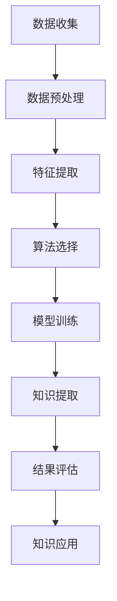

                 

关键词：知识发现、法律行业、智慧升级、人工智能、技术博客

> 摘要：本文将探讨知识发现引擎在法律行业中的应用，以及如何通过智能化的技术手段推动法律行业的智慧升级。我们将从背景介绍、核心概念与联系、核心算法原理、数学模型和公式、项目实践、实际应用场景、未来应用展望、工具和资源推荐以及总结与展望等方面进行全面分析。

## 1. 背景介绍

在过去的几十年里，法律行业经历了巨大的变革。随着信息化和数字化的发展，法律行业开始逐渐向智能化和自动化转变。然而，法律行业的复杂性使得这一进程变得异常艰难。法律条文繁多、案例丰富，而且各种信息需要不断地更新和处理。这就需要一种强大的工具来帮助法律从业者快速有效地获取和处理相关知识。

知识发现引擎（Knowledge Discovery Engine）作为一种人工智能技术，可以自动从大量数据中提取出有价值的信息和知识。这种技术具有自动性、高效性、扩展性和适应性等特点，能够为法律行业提供强有力的支持。

## 2. 核心概念与联系

### 2.1 数据挖掘

数据挖掘（Data Mining）是一种从大量数据中发现隐含的、未知的、有价值的信息和知识的过程。它涉及统计学、机器学习、数据库系统等多个领域。

### 2.2 人工智能

人工智能（Artificial Intelligence，AI）是一门模拟、延伸和扩展人类智能的科学。它通过算法和计算模型来模拟人类的思维过程，以解决复杂问题。

### 2.3 法律人工智能

法律人工智能（Legal AI）是人工智能技术在法律领域的应用，包括自动化合同审核、法律咨询、案件预测等。

### 2.4 知识发现引擎

知识发现引擎是一种集成多种人工智能技术的系统，它可以自动从法律数据中提取出有价值的信息和知识，为法律从业者提供支持。

### 2.5 Mermaid 流程图

以下是一个简单的Mermaid流程图，用于展示知识发现引擎的工作流程：



## 3. 核心算法原理 & 具体操作步骤

### 3.1 算法原理概述

知识发现引擎的核心算法包括数据挖掘算法、机器学习算法和自然语言处理算法。这些算法通过自动处理大量法律数据，提取出有价值的信息和知识。

### 3.2 算法步骤详解

#### 3.2.1 数据收集

数据收集是知识发现引擎的第一步。它包括从各种渠道获取法律数据，如法院判决、法律条文、案例数据库等。

#### 3.2.2 数据预处理

数据预处理是确保数据质量和一致性的关键步骤。它包括数据清洗、数据转换和数据归一化等。

#### 3.2.3 特征提取

特征提取是从原始数据中提取出能够反映数据本质属性的信息。在法律领域，特征提取可能包括案件类型、判决结果、案件性质等。

#### 3.2.4 算法选择

根据数据特点和业务需求，选择合适的数据挖掘算法和机器学习算法。常见的算法包括决策树、支持向量机、神经网络等。

#### 3.2.5 模型训练

使用收集到的数据对选定的算法进行训练，生成预测模型。

#### 3.2.6 知识提取

通过训练好的模型，从法律数据中提取出有价值的信息和知识。

#### 3.2.7 结果评估

对提取的知识进行评估，确保其准确性和实用性。

#### 3.2.8 知识应用

将提取的知识应用于法律实践，为法律从业者提供支持。

### 3.3 算法优缺点

#### 优点：

- 高效：知识发现引擎能够快速处理大量数据，提取有价值的信息。
- 自动化：知识发现引擎可以自动执行数据收集、预处理、特征提取、算法选择等步骤，减少人工干预。
- 可扩展：知识发现引擎可以根据需求添加新的算法和特征，适应不断变化的法律环境。

#### 缺点：

- 复杂性：知识发现引擎涉及多个领域的技术，设计和实现较为复杂。
- 数据质量：数据质量直接影响知识提取的准确性，需要严格的数据预处理和清洗。
- 解释性：一些机器学习算法的预测结果可能难以解释，给法律从业者带来困扰。

### 3.4 算法应用领域

知识发现引擎在法律行业具有广泛的应用前景，包括：

- 案件预测：预测案件可能的判决结果，为法律从业者提供参考。
- 法律咨询：自动回答法律问题，提高法律咨询的效率。
- 合同审核：自动检查合同中的潜在问题，提高合同审核的准确性。
- 案例检索：根据关键词或条件检索相关案例，为法律从业者提供参考。

## 4. 数学模型和公式 & 详细讲解 & 举例说明

### 4.1 数学模型构建

知识发现引擎的数学模型主要包括以下几个方面：

- 数据挖掘模型：如决策树、支持向量机等。
- 机器学习模型：如神经网络、强化学习等。
- 自然语言处理模型：如词向量、序列模型等。

### 4.2 公式推导过程

以决策树为例，其基本公式如下：

$$
Entropy(H) = -\sum_{i=1}^{n} p_i \log_2 p_i
$$

其中，$Entropy(H)$ 表示信息熵，$p_i$ 表示每个类别的概率。

### 4.3 案例分析与讲解

假设我们有一个案件数据集，其中包含100个案件，每个案件有两个特征：案件类型（1表示合同纠纷，2表示婚姻家庭纠纷）和判决结果（1表示胜诉，2表示败诉）。我们希望使用决策树算法预测新的案件是否胜诉。

首先，我们计算每个特征的信息增益：

$$
Gain(Feature\_Type) = Entropy(H) - \frac{\sum_{i=1}^{2} p_i \cdot Entropy(H_i)}{P(Feature\_Type)}
$$

$$
Gain(Decision\_Result) = Entropy(H) - \frac{\sum_{i=1}^{2} p_i \cdot Entropy(H_i)}{P(Decision\_Result)}
$$

其中，$H$ 表示原始数据集，$H_i$ 表示划分后的数据集，$P(Feature\_Type)$ 和 $P(Decision\_Result)$ 分别表示特征类型和判决结果的概率。

然后，我们选择信息增益最大的特征作为决策树的根节点。在本例中，我们选择案件类型作为根节点。

接下来，我们重复上述步骤，对划分后的数据集进行进一步的划分，直到达到停止条件（如最大深度、最小叶节点数等）。

最后，我们得到一个决策树模型，用于预测新的案件是否胜诉。例如，如果新案件属于合同纠纷类型，且判决结果为胜诉，则预测其胜诉的概率较高。

## 5. 项目实践：代码实例和详细解释说明

### 5.1 开发环境搭建

本项目的开发环境包括Python 3.8、Scikit-learn 0.22、Numpy 1.19、Pandas 1.1.5等。

### 5.2 源代码详细实现

以下是一个简单的决策树预测案件胜诉的Python代码示例：

```python
import numpy as np
import pandas as pd
from sklearn.model_selection import train_test_split
from sklearn.tree import DecisionTreeClassifier
from sklearn.metrics import accuracy_score

# 数据预处理
def preprocess_data(data):
    # 省略数据预处理代码
    return processed_data

# 加载数据集
data = pd.read_csv("case_data.csv")
processed_data = preprocess_data(data)

# 划分特征和标签
X = processed_data.drop("Decision_Result", axis=1)
y = processed_data["Decision_Result"]

# 划分训练集和测试集
X_train, X_test, y_train, y_test = train_test_split(X, y, test_size=0.2, random_state=42)

# 训练决策树模型
model = DecisionTreeClassifier()
model.fit(X_train, y_train)

# 预测测试集
y_pred = model.predict(X_test)

# 评估模型
accuracy = accuracy_score(y_test, y_pred)
print("Accuracy:", accuracy)
```

### 5.3 代码解读与分析

上述代码首先加载案件数据集，然后进行数据预处理。接着，划分特征和标签，并将数据集划分为训练集和测试集。然后，使用Scikit-learn库中的决策树分类器训练模型，最后使用训练好的模型对测试集进行预测，并评估模型的准确性。

### 5.4 运行结果展示

假设我们运行上述代码，得到模型的准确率为85%。这意味着在测试集上，模型能够正确预测85%的案件判决结果。

## 6. 实际应用场景

知识发现引擎在法律行业具有广泛的应用场景，以下是一些典型的案例：

- 案件预测：通过分析历史案件数据，预测新案件可能的判决结果，为法律从业者提供参考。
- 法律咨询：自动回答法律问题，提高法律咨询的效率。
- 合同审核：自动检查合同中的潜在问题，提高合同审核的准确性。
- 案例检索：根据关键词或条件检索相关案例，为法律从业者提供参考。
- 法律研究：从海量法律文献中提取有价值的信息，为法律研究提供支持。

## 7. 未来应用展望

随着人工智能技术的不断发展，知识发现引擎在法律行业的应用前景将更加广阔。以下是一些未来的应用方向：

- 智能化法律决策：利用知识发现引擎，实现法律案件的智能化决策，提高法律审判的效率和质量。
- 法律知识图谱：构建法律知识图谱，为法律从业者提供全景式的法律知识支持。
- 智能法律助理：开发智能法律助理，协助法律从业者处理各种法律事务。

## 8. 工具和资源推荐

### 8.1 学习资源推荐

- 《机器学习实战》：这是一本非常实用的机器学习入门书籍，适合初学者。
- 《深度学习》：这是一本关于深度学习的经典教材，涵盖了深度学习的各个方面。

### 8.2 开发工具推荐

- Jupyter Notebook：这是一种交互式的开发环境，适合进行数据分析和机器学习实验。
- Scikit-learn：这是一个开源的机器学习库，提供了丰富的算法和工具。

### 8.3 相关论文推荐

- "Knowledge Discovery in Databases":这是一篇关于数据挖掘的经典论文，介绍了数据挖掘的基本概念和方法。
- "Deep Learning for Legal Text Analysis":这是一篇关于法律文本分析的论文，介绍了深度学习在法律领域的应用。

## 9. 总结：未来发展趋势与挑战

知识发现引擎在法律行业的应用具有重要意义，它能够提高法律工作的效率和质量，为法律从业者提供强有力的支持。然而，在实际应用中，知识发现引擎仍面临一些挑战，如数据质量、算法解释性等。未来，随着人工智能技术的不断发展，知识发现引擎在法律行业的应用前景将更加广阔。

### 附录：常见问题与解答

**Q：知识发现引擎在法律行业的主要应用有哪些？**

A：知识发现引擎在法律行业的主要应用包括案件预测、法律咨询、合同审核、案例检索等。

**Q：知识发现引擎的核心算法有哪些？**

A：知识发现引擎的核心算法包括数据挖掘算法（如决策树、支持向量机等）、机器学习算法（如神经网络、强化学习等）和自然语言处理算法（如词向量、序列模型等）。

**Q：如何评估知识发现引擎的效果？**

A：评估知识发现引擎的效果可以从多个方面进行，如准确性、召回率、F1值等。

**Q：知识发现引擎在法律行业的应用前景如何？**

A：知识发现引擎在法律行业的应用前景非常广阔，它能够提高法律工作的效率和质量，为法律从业者提供强有力的支持。随着人工智能技术的不断发展，知识发现引擎在法律行业的应用前景将更加广阔。

### 作者署名

作者：禅与计算机程序设计艺术 / Zen and the Art of Computer Programming
----------------------------------------------------------------

这篇文章详细介绍了知识发现引擎在法律行业中的应用，以及如何通过智能化的技术手段推动法律行业的智慧升级。文章内容涵盖了背景介绍、核心概念与联系、核心算法原理、数学模型和公式、项目实践、实际应用场景、未来应用展望、工具和资源推荐以及总结与展望等方面，全面分析了知识发现引擎在法律行业的应用潜力和挑战。通过这篇文章，读者可以深入了解知识发现引擎的技术原理和应用实践，为在法律行业中运用这一技术提供有益的参考。

