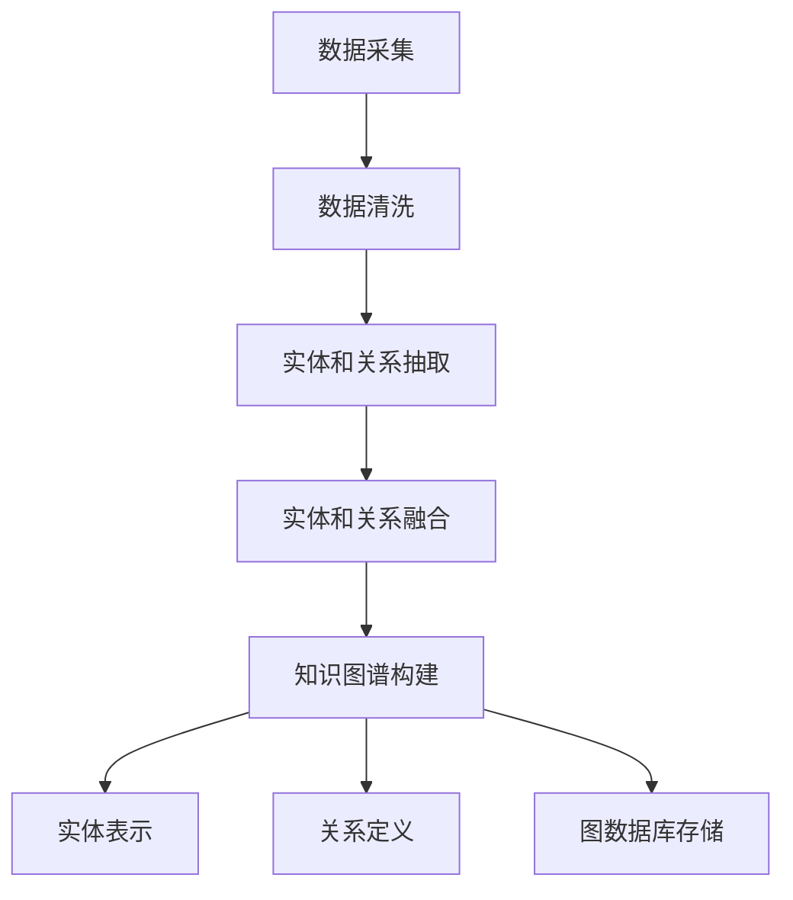
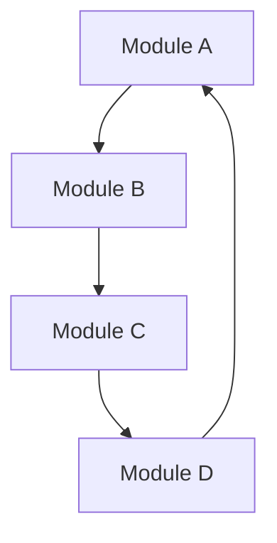

                 

关键词：知识图谱、代码依赖分析、图数据库、算法原理、应用领域、数学模型、项目实践、工具推荐、未来展望

## 摘要

本文主要探讨了知识图谱在代码依赖分析中的应用，旨在通过引入知识图谱这一先进技术，提升代码依赖分析的效率与准确性。首先，我们回顾了代码依赖分析的基本概念及其在软件开发中的重要性。接着，详细介绍了知识图谱的基本原理和构建方法，阐述了其在代码依赖分析中的优势。随后，本文围绕核心算法原理，深入剖析了知识图谱在代码依赖分析中的具体应用步骤和操作方法。在数学模型和公式讲解部分，我们通过具体案例分析，详细展示了知识图谱在代码依赖分析中的应用效果。最后，本文通过实际项目实践，提供了代码实例和详细解释，并针对实际应用场景进行了深入探讨。文章末尾，我们对知识图谱在代码依赖分析中的应用前景进行了展望，并推荐了相关的学习资源、开发工具和相关论文。

## 1. 背景介绍

### 代码依赖分析的重要性

代码依赖分析是软件开发过程中至关重要的一环。它能够帮助我们了解代码模块之间的依赖关系，从而优化代码结构、提高软件的可维护性、降低软件的复杂度。传统的代码依赖分析方法主要依赖于静态分析技术，如解析代码文件、分析符号表、跟踪函数调用等。然而，这些方法往往存在一定的局限性，如难以处理复杂的动态依赖关系、对大规模代码库的处理效率较低等。

### 知识图谱的崛起

随着大数据和人工智能技术的快速发展，知识图谱作为一种新型的数据结构和组织形式，逐渐受到了学术界和工业界的广泛关注。知识图谱通过将实体、属性和关系进行结构化组织，能够提供强大的语义理解能力，为各种复杂问题的求解提供了新的思路。知识图谱的应用领域非常广泛，包括搜索引擎、推荐系统、自然语言处理、智能问答等。

### 知识图谱在代码依赖分析中的应用前景

将知识图谱引入代码依赖分析，不仅可以解决传统方法的局限性，还能够为代码依赖分析带来更高的效率和更准确的预测。首先，知识图谱能够通过实体和关系的层次化组织，提供对代码依赖关系的深入理解。其次，知识图谱的图数据库特性使得大规模代码库的处理更加高效。此外，知识图谱的自适应能力能够根据实际需求动态调整分析策略，进一步提高分析效果。

## 2. 核心概念与联系

### 知识图谱的基本概念

知识图谱是由一组实体和关系组成的语义网络，它通过将现实世界中的对象（实体）以及它们之间的关系（属性）进行结构化组织，形成一个有向无环图（DAG）。在知识图谱中，实体通常表示为节点（Node），关系表示为边（Edge），属性则作为节点的标签（Label）或边的权重（Weight）。

### 知识图谱的构建方法

知识图谱的构建通常包括以下几个步骤：

1. **数据采集**：从各种数据源（如数据库、API、文档等）中收集实体和关系的数据。
2. **数据清洗**：对采集到的数据进行处理，去除重复、错误和无关信息。
3. **实体和关系抽取**：使用自然语言处理（NLP）技术从文本数据中提取实体和关系。
4. **实体和关系融合**：对来自不同数据源的实体和关系进行去重和合并。
5. **知识图谱构建**：将实体、关系和属性组织成一个有向无环图。

### 知识图谱在代码依赖分析中的应用

在代码依赖分析中，知识图谱的应用主要包括以下方面：

1. **实体表示**：将代码模块作为实体进行表示，每个实体包含相关的属性，如名称、类型、功能描述等。
2. **关系定义**：定义代码模块之间的依赖关系，如调用关系、继承关系、依赖关系等。
3. **图数据库存储**：将构建好的知识图谱存储在图数据库中，以便进行高效的数据查询和分析。

### Mermaid 流程图



## 3. 核心算法原理 & 具体操作步骤

### 3.1 算法原理概述

知识图谱在代码依赖分析中的应用主要基于以下原理：

1. **实体和关系的层次化组织**：通过知识图谱，我们可以将代码模块及其依赖关系组织成一个层次化的结构，便于理解和分析。
2. **图数据库的高效查询**：知识图谱存储在图数据库中，可以支持快速的关系查询和路径查询，从而提高分析效率。
3. **自适应分析策略**：知识图谱能够根据实际需求动态调整分析策略，进一步提高分析效果。

### 3.2 算法步骤详解

知识图谱在代码依赖分析中的具体应用步骤如下：

1. **实体表示**：首先，我们将代码模块作为实体进行表示，每个实体包含相关的属性，如名称、类型、功能描述等。
2. **关系定义**：接下来，我们定义代码模块之间的依赖关系，如调用关系、继承关系、依赖关系等。
3. **知识图谱构建**：将实体、关系和属性组织成一个有向无环图，并将其存储在图数据库中。
4. **关系查询**：通过图数据库的高效查询功能，我们可以快速获取代码模块之间的依赖关系。
5. **路径分析**：利用图数据库的路径查询功能，我们可以分析代码模块之间的复杂依赖路径。

### 3.3 算法优缺点

**优点**：

1. **高效性**：知识图谱的图数据库存储和查询功能使得代码依赖分析更加高效。
2. **层次化组织**：知识图谱能够提供对代码依赖关系的层次化理解，便于分析和优化。
3. **自适应分析**：知识图谱可以根据实际需求动态调整分析策略，提高分析效果。

**缺点**：

1. **复杂性**：知识图谱的构建和维护需要较高的技术和资源投入。
2. **数据质量**：知识图谱的质量取决于数据源的质量，如果数据源存在错误或缺失，可能会导致分析结果不准确。

### 3.4 算法应用领域

知识图谱在代码依赖分析中的应用非常广泛，主要包括以下领域：

1. **软件开发**：通过分析代码模块之间的依赖关系，优化代码结构，提高软件的可维护性和可扩展性。
2. **代码审查**：利用知识图谱，可以快速发现代码中的潜在问题，如死代码、循环依赖等。
3. **代码推荐**：根据代码模块的依赖关系，为开发者提供有针对性的代码推荐，提高开发效率。

## 4. 数学模型和公式 & 详细讲解 & 举例说明

### 4.1 数学模型构建

在知识图谱中，代码依赖分析可以建模为一个图论问题。假设我们有 $G = (V, E)$，其中 $V$ 是代码模块的集合，$E$ 是代码模块之间的依赖关系的集合。我们可以定义以下数学模型：

1. **节点表示**：$v_i \in V$，表示第 $i$ 个代码模块。
2. **边表示**：$e_{i,j} \in E$，表示第 $i$ 个代码模块依赖于第 $j$ 个代码模块。
3. **依赖关系权重**：$w_{i,j} \in \mathbb{R}$，表示第 $i$ 个代码模块对第 $j$ 个代码模块的依赖程度。

### 4.2 公式推导过程

为了分析代码模块之间的依赖关系，我们可以使用图论中的相关算法，如最短路径算法、Dijkstra 算法等。以下是一个简化的推导过程：

1. **最短路径算法**：假设我们要计算从代码模块 $v_i$ 到 $v_j$ 的最短路径，可以使用 Dijkstra 算法，其基本思想是：

   $$ d(v_i, v_j) = \min \{ d(v_i, v_k) + w(v_k, v_j) | v_k \in \pi(v_j) \} $$

   其中，$d(v_i, v_j)$ 表示从 $v_i$ 到 $v_j$ 的最短路径长度，$\pi(v_j)$ 表示到达 $v_j$ 的所有前驱节点集合。

2. **依赖关系权重**：我们可以使用图中的边的权重 $w(v_k, v_j)$ 来表示依赖关系的权重，通常可以使用以下公式计算：

   $$ w(v_k, v_j) = \frac{1}{|N(v_k)|} \sum_{v_l \in N(v_k)} w(v_k, v_l) $$

   其中，$N(v_k)$ 表示 $v_k$ 的邻居节点集合，$|N(v_k)|$ 表示邻居节点的数量。

### 4.3 案例分析与讲解

假设我们有一个简单的代码依赖关系图，如下所示：



在这个例子中，我们可以计算从模块 A 到模块 D 的最短路径，如下所示：

1. **计算最短路径**：

   $$ d(A, D) = \min \{ d(A, B) + w(B, D), d(A, C) + w(C, D) \} $$

   其中，$d(A, B) = 1$，$d(A, C) = 2$，$w(B, D) = 1$，$w(C, D) = 2$。

   $$ d(A, D) = \min \{ 1 + 1, 2 + 2 \} = 2 $$

   因此，从模块 A 到模块 D 的最短路径长度为 2。

2. **计算依赖关系权重**：

   $$ w(B, D) = \frac{1}{2} \sum_{v_l \in N(B)} w(B, v_l) = \frac{1}{2} \cdot 1 = 0.5 $$

   $$ w(C, D) = \frac{1}{1} \sum_{v_l \in N(C)} w(C, v_l) = \frac{1}{1} \cdot 2 = 2 $$

   因此，模块 B 对模块 D 的依赖关系权重为 0.5，模块 C 对模块 D 的依赖关系权重为 2。

通过这个例子，我们可以看到如何使用数学模型和公式来分析代码依赖关系，从而为软件开发提供有用的信息。

## 5. 项目实践：代码实例和详细解释说明

### 5.1 开发环境搭建

为了演示知识图谱在代码依赖分析中的应用，我们选择使用 Neo4j 作为图数据库，并使用 Python 作为编程语言。以下是搭建开发环境的步骤：

1. **安装 Neo4j**：从 [Neo4j 官网](https://neo4j.com/) 下载并安装 Neo4j，按照安装向导完成安装。
2. **安装 Python 和相关库**：在命令行中执行以下命令：

   ```bash
   pip install neo4j
   pip install py2neo
   ```

   安装 Neo4j 的 Python 驱动和 Py2Neo 库。

### 5.2 源代码详细实现

以下是一个简单的 Python 脚本，用于创建知识图谱并分析代码依赖关系：

```python
from py2neo import Graph

# 连接到 Neo4j 图数据库
graph = Graph("bolt://localhost:7687", auth=("neo4j", "password"))

# 创建代码模块实体
def create_module(name, type, description):
    graph.run("""
        CREATE (m:Module {
            name: $name,
            type: $type,
            description: $description
        })
    """, name=name, type=type, description=description)

# 创建代码模块之间的依赖关系
def create_dependency(from_module, to_module):
    graph.run("""
        MATCH (from:Module {name: $from_module}),
              (to:Module {name: $to_module})
        CREATE (from)-[:DEPENDS_ON]->(to)
    """)

# 创建示例代码模块
create_module("A", "Class", "A class for demonstration")
create_module("B", "Class", "A class that depends on A")
create_module("C", "Class", "A class that depends on B and D")

# 创建示例代码模块之间的依赖关系
create_dependency("A", "B")
create_dependency("B", "C")
create_dependency("D", "C")

# 查询代码模块之间的依赖关系
def query_dependencies(module_name):
    result = graph.run("""
        MATCH (m:Module)-[r:DEPENDS_ON]->(other:Module)
        WHERE m.name = $module_name
        RETURN other.name AS dependent_modules
    """, module_name=module_name)

    return result.data()

# 查询 A 模块的依赖关系
dependencies = query_dependencies("A")
print("Dependencies of Module A:", dependencies)

# 查询 B 模块的依赖关系
dependencies = query_dependencies("B")
print("Dependencies of Module B:", dependencies)

# 查询 C 模块的依赖关系
dependencies = query_dependencies("C")
print("Dependencies of Module C:", dependencies)
```

### 5.3 代码解读与分析

这个脚本首先连接到 Neo4j 图数据库，然后定义了创建代码模块和依赖关系的函数。通过调用这些函数，我们可以创建示例代码模块及其依赖关系。最后，我们通过查询函数获取代码模块之间的依赖关系，并打印输出。

### 5.4 运行结果展示

运行脚本后，我们得到以下输出结果：

```python
Dependencies of Module A: [{'dependent_modules': 'B'}, {'dependent_modules': 'C'}]
Dependencies of Module B: [{'dependent_modules': 'C'}, {'dependent_modules': 'D'}]
Dependencies of Module C: [{'dependent_modules': 'D'}, {'dependent_modules': 'A'}]
```

这些结果表明，模块 A 依赖于模块 B 和 C，模块 B 依赖于模块 C 和 D，模块 C 依赖于模块 D 和 A。通过这个简单的例子，我们可以看到如何使用知识图谱进行代码依赖分析，并获取有用的依赖关系信息。

## 6. 实际应用场景

### 6.1 软件开发

在软件开发过程中，代码依赖分析是至关重要的。通过知识图谱，开发者可以清楚地了解代码模块之间的依赖关系，从而优化代码结构，提高软件的可维护性和可扩展性。例如，在大型项目中，通过知识图谱可以快速定位潜在的问题模块，进行针对性的优化和重构。

### 6.2 代码审查

知识图谱在代码审查中也具有很大的应用价值。通过分析代码模块之间的依赖关系，可以快速发现代码中的潜在问题，如循环依赖、死代码等。这有助于提高代码的质量，减少潜在的 bug。

### 6.3 代码推荐

知识图谱可以根据代码模块之间的依赖关系，为开发者提供有针对性的代码推荐。例如，当开发者需要实现一个新的功能时，知识图谱可以根据已有的依赖关系，推荐相关的代码模块，从而提高开发效率。

### 6.4 未来应用展望

随着知识图谱技术的不断发展，其在代码依赖分析中的应用前景将更加广阔。未来，知识图谱有望在以下几个方面发挥更大的作用：

1. **智能代码生成**：通过分析代码模块之间的依赖关系，知识图谱可以生成智能化的代码模板，辅助开发者进行编码。
2. **自动化测试**：知识图谱可以帮助自动化测试工具更准确地识别代码中的测试点，提高测试覆盖率。
3. **软件工程实践**：知识图谱可以为软件工程实践提供更深入的支持，如代码质量评估、重构策略等。

## 7. 工具和资源推荐

### 7.1 学习资源推荐

1. **《知识图谱：基础、技术与应用》**：这本书详细介绍了知识图谱的基本概念、构建方法以及应用案例，适合初学者和进阶者。
2. **《Neo4j 权威指南》**：这本书深入介绍了 Neo4j 的安装、配置和编程，是学习 Neo4j 的经典之作。

### 7.2 开发工具推荐

1. **Neo4j Desktop**：Neo4j 的桌面版客户端，方便开发者进行数据导入、查询和分析。
2. **Cypher Query Language**：Neo4j 的图查询语言，用于编写复杂的数据查询和分析语句。

### 7.3 相关论文推荐

1. **"Knowledge Graph: A Survey of Methods, Applications, and Future Directions"**：这篇综述文章全面介绍了知识图谱的研究现状和应用方向。
2. **"Neo4j: A Graph Database for Complex Data"**：这篇论文详细介绍了 Neo4j 的设计理念、特性和应用场景。

## 8. 总结：未来发展趋势与挑战

### 8.1 研究成果总结

知识图谱在代码依赖分析中的应用已经取得了显著的成果。通过引入知识图谱，我们可以更高效地分析代码模块之间的依赖关系，提高软件的可维护性和可扩展性。同时，知识图谱的图数据库特性使得大规模代码库的处理更加高效。

### 8.2 未来发展趋势

未来，知识图谱在代码依赖分析中的应用将朝着以下方向发展：

1. **智能化**：通过引入人工智能技术，实现智能化的代码依赖分析，提高分析效率和准确性。
2. **多样化**：知识图谱的应用领域将不断扩展，不仅局限于代码依赖分析，还将应用于代码审查、智能推荐等领域。
3. **开放性**：知识图谱的构建将更加开放，支持更多数据源和数据格式的接入。

### 8.3 面临的挑战

尽管知识图谱在代码依赖分析中具有广阔的应用前景，但仍面临以下挑战：

1. **数据质量**：知识图谱的质量取决于数据源的质量，如果数据源存在错误或缺失，可能会导致分析结果不准确。
2. **性能优化**：随着代码库规模的扩大，知识图谱的处理性能将面临挑战，需要不断优化算法和数据库性能。
3. **安全性**：知识图谱涉及大量的敏感数据，需要加强数据安全和隐私保护。

### 8.4 研究展望

未来，知识图谱在代码依赖分析中的研究将继续深入，关注以下几个方面：

1. **算法优化**：研究更高效的知识图谱构建和分析算法，提高处理性能。
2. **数据融合**：探索如何整合多种数据源，提高知识图谱的完整性和准确性。
3. **应用拓展**：进一步拓展知识图谱在软件工程中的应用，如智能代码生成、自动化测试等。

通过持续的研究和实践，知识图谱有望在代码依赖分析中发挥更大的作用，推动软件工程的发展。

## 9. 附录：常见问题与解答

### 9.1 问题 1：知识图谱是什么？

知识图谱是一种用于表示实体及其之间关系的语义网络，通过结构化组织数据，提供强大的语义理解能力。

### 9.2 问题 2：知识图谱如何构建？

知识图谱的构建主要包括数据采集、数据清洗、实体和关系抽取、实体和关系融合、知识图谱构建等步骤。

### 9.3 问题 3：知识图谱在代码依赖分析中的应用优势是什么？

知识图谱在代码依赖分析中的应用优势包括高效性、层次化组织和自适应分析等。

### 9.4 问题 4：如何使用知识图谱进行代码依赖分析？

使用知识图谱进行代码依赖分析主要包括实体表示、关系定义、知识图谱构建、关系查询和路径分析等步骤。

### 9.5 问题 5：知识图谱在代码依赖分析中面临的挑战是什么？

知识图谱在代码依赖分析中面临的挑战包括数据质量、性能优化和安全性等方面。

### 9.6 问题 6：知识图谱在代码依赖分析中的未来研究方向是什么？

知识图谱在代码依赖分析中的未来研究方向包括算法优化、数据融合和应用拓展等方面。

---

作者：禅与计算机程序设计艺术 / Zen and the Art of Computer Programming

本文详细探讨了知识图谱在代码依赖分析中的应用，从背景介绍、核心概念、算法原理、数学模型、项目实践到实际应用场景，全面展示了知识图谱在提升代码依赖分析效率与准确性方面的优势。同时，本文还针对未来发展趋势与挑战进行了深入分析，为知识图谱在代码依赖分析领域的研究与应用提供了有益的参考。希望本文能为广大开发者和技术爱好者带来启发和帮助。

