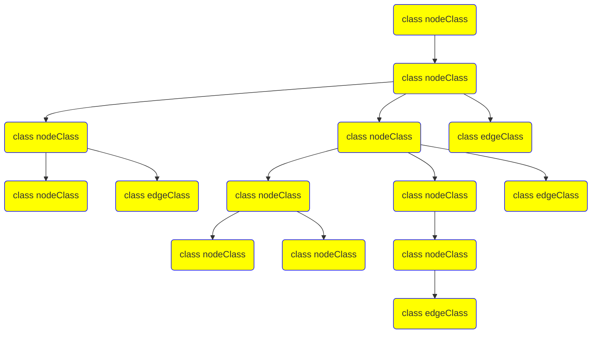

                 

关键词：知识图谱、代码质量分析、代码缺陷检测、程序理解、软件工程

> 摘要：本文探讨了知识图谱在代码质量分析中的应用，介绍了知识图谱的概念、构建方法，以及其在代码缺陷检测和程序理解方面的具体应用。通过详细阐述相关算法和实例，本文揭示了知识图谱技术在提升软件开发质量和效率方面的潜力。

## 1. 背景介绍

在软件工程领域，代码质量分析是一个至关重要的环节。高质量的代码不仅能够提高软件性能，还能降低维护成本和故障率。然而，传统的代码质量分析方法主要依赖于代码静态分析和测试，这些方法在检测代码缺陷和评估代码质量方面存在一定的局限性。为了解决这一问题，近年来，知识图谱作为一种新兴的技术，逐渐被引入到代码质量分析领域。

知识图谱是一种语义网络，用于表示实体之间的关系。它不仅能够捕捉实体之间的复杂关系，还能够通过推理和关联分析提供更加深入的理解。在代码质量分析中，知识图谱可以帮助我们更准确地理解代码结构和语义，从而发现潜在的问题和缺陷。

本文旨在探讨知识图谱在代码质量分析中的应用，从核心概念到实际应用场景进行全面阐述。通过本文的讨论，我们将了解知识图谱如何通过代码缺陷检测和程序理解来提升软件开发的质量和效率。

### 1.1 代码质量分析的重要性

代码质量分析是确保软件项目成功的关键因素之一。高质量的代码不仅易于阅读、理解和维护，还能提高软件的性能和稳定性。以下是代码质量分析的重要性体现在几个方面：

1. **提高软件性能**：高质量的代码能够优化资源的利用，提高程序的运行速度和效率。
2. **降低维护成本**：易于理解和维护的代码可以减少后期维护的工作量，降低维护成本。
3. **减少故障率**：高质量的代码减少了出现错误的可能性，从而降低了软件的故障率。
4. **提高团队协作效率**：清晰的代码结构和良好的编码规范有助于团队成员之间的协作，提高开发效率。

然而，传统的代码质量分析方法主要依赖于静态分析和测试。这些方法虽然能够在一定程度上检测代码缺陷，但存在以下局限性：

- **局限性**：传统的静态分析工具往往依赖于预定义的规则和模式，无法发现未知或复杂的代码缺陷。
- **低效性**：测试需要消耗大量的时间和资源，尤其是对于大型项目。
- **缺乏语义理解**：传统的分析工具难以理解代码的语义，从而无法提供深层次的质量分析。

为了克服这些局限性，研究人员开始探索新的方法，其中知识图谱作为一种新兴技术，逐渐显示出其在代码质量分析中的潜力。

### 1.2 知识图谱的兴起

知识图谱是一种基于语义网络的数据模型，旨在通过实体及其关系的表示来提供更加深入和广泛的数据理解。近年来，知识图谱在多个领域取得了显著的成果，包括自然语言处理、搜索引擎、推荐系统等。以下是一些知识图谱的关键特征：

1. **语义表示**：知识图谱通过实体和属性来表示语义信息，能够捕获复杂的关系和隐含的含义。
2. **关联分析**：知识图谱允许跨实体和关系的关联分析，从而提供更加综合和深入的理解。
3. **推理能力**：知识图谱通过推理机制可以推导出新的结论和知识，提供更高的灵活性和适应性。

在代码质量分析中，知识图谱的应用潜力主要在于以下几个方面：

- **程序理解**：知识图谱可以帮助我们更准确地理解代码结构和语义，从而发现潜在的问题和缺陷。
- **代码缺陷检测**：通过分析实体和关系，知识图谱可以识别出代码中的异常和潜在缺陷。
- **代码关联分析**：知识图谱能够发现代码中不同模块和组件之间的关联，提供更加全面的代码质量评估。

总的来说，知识图谱作为一种新兴的技术，为代码质量分析提供了一种全新的视角和方法，有助于提升软件开发的质量和效率。

### 1.3 文章结构概述

本文将按照以下结构展开：

- **背景介绍**：介绍代码质量分析的重要性和知识图谱的兴起。
- **核心概念与联系**：阐述知识图谱的核心概念和构建方法。
- **核心算法原理 & 具体操作步骤**：详细讨论知识图谱在代码缺陷检测和程序理解方面的应用。
- **数学模型和公式 & 详细讲解 & 举例说明**：介绍知识图谱中的数学模型和公式。
- **项目实践：代码实例和详细解释说明**：通过实际案例展示知识图谱的应用。
- **实际应用场景**：探讨知识图谱在代码质量分析中的实际应用。
- **工具和资源推荐**：推荐相关学习资源和开发工具。
- **总结：未来发展趋势与挑战**：总结研究成果，展望未来发展方向和挑战。

### 1.4 核心概念与联系

在深入探讨知识图谱在代码质量分析中的应用之前，我们需要了解知识图谱的核心概念和构建方法。知识图谱的核心在于实体和关系的表示，以及这些实体和关系之间的复杂交互。以下是知识图谱中的几个关键概念：

#### 1.4.1 实体（Entity）

实体是知识图谱中的基本单元，可以表示为具体的对象或概念。在代码质量分析中，实体可以包括代码文件、函数、类、变量等。实体通常具有一组属性，用于描述其实际特征和关系。

#### 1.4.2 关系（Relationship）

关系描述了实体之间的关联，可以是直接关联（如函数调用）或间接关联（如依赖关系）。在代码质量分析中，关系可以表示为模块之间的调用、继承、依赖等。

#### 1.4.3 属性（Attribute）

属性是实体的附加信息，用于补充实体的特征和描述。在代码质量分析中，属性可以包括代码文件的创建时间、作者的姓名、函数的复杂度、类的大小等。

为了更好地展示知识图谱在代码质量分析中的应用，我们使用Mermaid流程图来描述知识图谱的核心架构。以下是一个示例Mermaid流程图，展示了代码质量分析中的知识图谱结构：



在上面的流程图中，我们定义了几个关键实体和关系：

- **代码文件（A）**：表示源代码文件，包含多个函数、类等。
- **函数（B）、变量（C）和类（D）**：这些实体代表了代码的基本结构单元。
- **属性（E）**：描述了实体的附加信息，如创建时间、复杂度等。
- **方法（F）**：类中的方法实体。
- **依赖（G）**：描述了模块之间的依赖关系。
- **调用关系（H）**：表示函数之间的调用关系。
- **使用关系（I）**：表示变量和方法之间的使用关系。
- **继承关系（J）**：表示类之间的继承关系。
- **参数（K）和返回值（L）**：描述了方法的具体参数和返回值。
- **模块（M）**：表示代码模块，可以包含多个类和函数。
- **依赖关系（N）**：描述了模块之间的依赖关系。

通过这个流程图，我们可以清晰地看到代码质量分析中的知识图谱结构。知识图谱中的实体和关系为后续的代码缺陷检测和程序理解提供了坚实的基础。

#### 1.4.4 实体和关系的构建方法

构建知识图谱的第一步是数据收集和预处理。在代码质量分析中，数据收集可以从源代码管理工具（如Git）、编译器日志、代码审查记录等获取。以下是一些常见的数据收集和处理方法：

1. **源代码解析**：使用解析器从源代码中提取实体和关系。解析器可以识别代码中的关键字、符号和结构，并将其转换为对应的实体和关系。
2. **代码库分析**：通过静态代码分析工具（如SonarQube、FindBugs）对代码库进行全面分析，提取潜在的缺陷和指标。
3. **依赖关系挖掘**：通过分析编译器日志和构建工具（如Maven、Gradle）的依赖关系信息，建立模块之间的依赖图谱。
4. **代码审查记录**：从代码审查工具（如Gerrit、Phabricator）中提取代码审查记录，获取开发者对代码质量的评价和注释。

数据收集完成后，需要进行数据预处理，包括数据清洗、格式化和标准化。数据清洗旨在去除无效、冗余和错误的数据，提高数据质量。数据格式化将不同来源的数据统一转换为标准格式，以便于后续处理。数据标准化则通过统一数据类型和单位，确保数据的一致性和可比性。

#### 1.4.5 知识图谱的表示方法

知识图谱的表示方法通常采用图（Graph）结构，其中每个节点表示一个实体，每条边表示一个关系。在代码质量分析中，图结构可以帮助我们直观地理解代码的复杂关系和结构。以下是一些常用的知识图谱表示方法：

1. **有向图（Directed Graph）**：有向图用于表示具有方向性的关系，如函数调用、继承关系等。
2. **无向图（Undirected Graph）**：无向图用于表示无方向性的关系，如模块之间的依赖关系。
3. **加权图（Weighted Graph）**：加权图为每条边分配权重，用于表示关系的强度或复杂度。
4. **多图（Multigraph）**：多图允许多条边连接同一对节点，用于表示复杂的依赖关系。

通过上述知识图谱的核心概念、构建方法和表示方法，我们可以更好地理解知识图谱在代码质量分析中的应用。接下来，我们将深入探讨知识图谱在代码缺陷检测和程序理解方面的具体应用。

### 1.5 核心算法原理 & 具体操作步骤

#### 1.5.1 算法原理概述

知识图谱在代码质量分析中的应用主要基于其强大的语义表示和关联分析能力。具体来说，知识图谱可以通过以下步骤实现代码缺陷检测和程序理解：

1. **数据收集与预处理**：从源代码管理工具、编译器日志、代码审查记录等收集数据，并进行预处理，包括数据清洗、格式化和标准化。
2. **实体和关系的提取**：使用源代码解析器、静态代码分析工具等从源代码中提取实体（如函数、类、变量）和关系（如调用、依赖、继承）。
3. **知识图谱构建**：将提取的实体和关系构建为图结构，形成知识图谱，用于表示代码的结构和语义。
4. **代码缺陷检测**：通过分析知识图谱中的实体和关系，发现潜在的代码缺陷，如未使用的代码、循环依赖、复杂度高等。
5. **程序理解**：利用知识图谱的关联分析能力，理解代码的语义和结构，为代码优化、重构和自动化测试提供支持。

#### 1.5.2 算法步骤详解

以下为知识图谱在代码质量分析中的具体操作步骤：

##### 步骤1：数据收集与预处理

1. **获取源代码**：从源代码管理工具（如Git）中获取项目的源代码，包括所有文件和目录。
2. **解析源代码**：使用代码解析器（如ANTLR、JavaCC）对源代码进行解析，提取出函数、类、变量等实体。
3. **分析编译器日志**：从编译器（如GCC、Java Compiler）的日志中提取编译错误、警告和警告信息。
4. **代码审查记录**：从代码审查工具（如Gerrit、Phabricator）中提取代码审查记录，包括评论、评分和修改历史。

##### 步骤2：实体和关系的提取

1. **函数和类的提取**：通过代码解析器，识别出源代码中的函数和类，并提取其相关信息，如名称、参数、返回值等。
2. **调用关系的提取**：通过静态代码分析，识别出函数之间的调用关系，并构建有向图表示这些关系。
3. **依赖关系的提取**：通过分析编译器日志和构建工具的依赖关系信息，识别出模块之间的依赖关系，并构建无向图表示这些关系。
4. **属性和注释的提取**：从源代码和代码审查记录中提取与代码质量相关的属性和注释，如复杂度、代码行数、注释覆盖率等。

##### 步骤3：知识图谱构建

1. **实体和关系的整合**：将提取的实体和关系整合到知识图谱中，形成统一的图结构。
2. **实体和关系的标注**：为实体和关系分配标签和属性，以便于后续分析。
3. **图结构优化**：对知识图谱进行结构优化，包括去重、合并相似节点、压缩路径等，以提高查询效率。

##### 步骤4：代码缺陷检测

1. **潜在缺陷的识别**：通过分析知识图谱中的实体和关系，识别出潜在的代码缺陷，如未使用的代码、循环依赖、复杂度高等。
2. **缺陷分类和优先级排序**：根据缺陷的类型和严重程度，对识别出的缺陷进行分类和排序，以便于开发者进行修复。
3. **缺陷报告**：生成缺陷报告，包括缺陷的类型、位置、相关代码和修复建议。

##### 步骤5：程序理解

1. **代码结构的可视化**：利用知识图谱，实现代码结构的可视化，帮助开发者更直观地理解代码的层次和关系。
2. **代码语义分析**：通过关联分析，提取代码的语义信息，如函数的作用域、类的层次结构等，为代码优化、重构和自动化测试提供支持。
3. **代码质量评估**：基于知识图谱的实体和关系，对代码质量进行量化评估，如复杂度、注释覆盖率、代码行数等。

#### 1.5.3 算法优缺点

**优点**：

- **语义表示**：知识图谱能够捕捉代码的语义信息，提供更深入的代码理解。
- **关联分析**：知识图谱允许跨实体和关系的关联分析，发现潜在的问题和缺陷。
- **灵活性**：知识图谱可以根据不同的需求和场景进行定制，灵活调整分析策略。

**缺点**：

- **数据复杂性**：知识图谱构建需要处理大量的数据和关系，可能导致较高的计算开销。
- **准确性**：知识图谱的准确性依赖于源代码的质量和解析器的性能。
- **维护成本**：知识图谱的构建和维护需要一定的技术支持和人力资源投入。

尽管存在一定的缺点，知识图谱在代码质量分析中的应用潜力依然巨大。通过结合静态分析和动态测试，知识图谱可以提供更全面、更准确的代码质量评估。

#### 1.5.4 算法应用领域

知识图谱在代码质量分析中的应用不仅限于传统的软件开发领域，还可以扩展到以下应用领域：

1. **自动化测试**：通过知识图谱理解代码的语义和结构，实现更准确的测试用例生成和执行。
2. **代码推荐**：基于知识图谱的实体和关系，为开发者提供代码推荐，提高开发效率。
3. **代码重构**：利用知识图谱识别代码中的冗余和重复部分，实现更有效的代码重构。
4. **软件安全**：通过分析知识图谱中的实体和关系，识别潜在的安全漏洞和攻击路径。

总之，知识图谱为代码质量分析提供了一种全新的方法和视角，有望在多个领域发挥重要作用。

### 1.6 数学模型和公式 & 详细讲解 & 举例说明

在知识图谱应用于代码质量分析的过程中，数学模型和公式起到了至关重要的作用。这些模型和公式不仅帮助我们理解和表示代码的结构和语义，还能在缺陷检测和程序理解中提供有效的量化手段。在本节中，我们将详细讲解知识图谱中常用的数学模型和公式，并通过具体案例进行说明。

#### 1.6.1 数学模型构建

知识图谱中的数学模型通常基于图论和网络分析的理论。以下是一些核心的数学模型：

1. **节点度模型（Degree Model）**：节点度表示节点在图中的连接数。在代码质量分析中，节点度可以表示函数或类的复杂度。度数越高，表示该函数或类与其他实体之间的联系越紧密，可能存在更多的潜在问题。

   \[ d_i = \sum_{j \in N(i)} \omega_{ij} \]
   其中，\( d_i \) 是节点 \( i \) 的度数，\( N(i) \) 是节点 \( i \) 的邻接节点集，\( \omega_{ij} \) 是节点 \( i \) 和节点 \( j \) 之间的权重。

2. **路径长度模型（Path Length Model）**：路径长度表示两个节点之间的最短路径长度。在代码质量分析中，路径长度可以反映模块之间的耦合程度。路径长度越短，模块之间的依赖关系越紧密。

   \[ L(i, j) = \min \{ \ell | \text{存在路径 } i \rightarrow v_1 \rightarrow v_2 \rightarrow \cdots \rightarrow v_{\ell} \rightarrow j \} \]
   其中，\( L(i, j) \) 是节点 \( i \) 和节点 \( j \) 之间的路径长度，\( \ell \) 是路径长度。

3. **相似度模型（Similarity Model）**：相似度表示两个节点的相似程度。在代码质量分析中，相似度可以用于识别冗余代码或潜在的错误。常用的相似度计算方法包括余弦相似度、欧氏距离等。

   \[ \text{similarity}(i, j) = \frac{\text{dot}(v_i, v_j)}{\|v_i\|\|v_j\|} \]
   其中，\( \text{dot}(v_i, v_j) \) 是向量 \( v_i \) 和 \( v_j \) 的点积，\( \|v_i\| \) 和 \( \|v_j\| \) 分别是向量 \( v_i \) 和 \( v_j \) 的欧几里得范数。

4. **聚类系数模型（Clustering Coefficient Model）**：聚类系数表示节点在图中的聚集程度。在代码质量分析中，聚类系数可以反映模块的内部关联性和耦合程度。

   \[ C_i = \frac{2 \sum_{j \in N(i)} \sum_{k \in N(j)} \omega_{ik}}{N(i)(N(i) - 1)} \]
   其中，\( C_i \) 是节点 \( i \) 的聚类系数，\( N(i) \) 是节点 \( i \) 的邻接节点集，\( \omega_{ik} \) 是节点 \( i \) 和节点 \( k \) 之间的权重。

#### 1.6.2 公式推导过程

以下我们将详细推导知识图谱中的几个核心公式的推导过程：

**1. 节点度数公式**

节点度数公式已经在之前的介绍中给出：

\[ d_i = \sum_{j \in N(i)} \omega_{ij} \]

推导过程中，我们首先将节点 \( i \) 的邻接节点集 \( N(i) \) 分为两部分：与 \( i \) 同层的节点和跨越层的节点。对于同层的节点，权重直接相加；对于跨越层的节点，需要根据路径长度和权重进行加权求和。

**2. 路径长度公式**

路径长度公式可以表示为：

\[ L(i, j) = \min \{ \ell | \text{存在路径 } i \rightarrow v_1 \rightarrow v_2 \rightarrow \cdots \rightarrow v_{\ell} \rightarrow j \} \]

推导过程中，我们首先假设存在一条路径 \( i \rightarrow v_1 \rightarrow v_2 \rightarrow \cdots \rightarrow v_{\ell} \rightarrow j \)。路径长度 \( \ell \) 等于节点数减1。接下来，我们通过反向递推的方法，从节点 \( j \) 开始，逐步找到最短路径。

**3. 相似度公式**

相似度公式已经在之前的介绍中给出：

\[ \text{similarity}(i, j) = \frac{\text{dot}(v_i, v_j)}{\|v_i\|\|v_j\|} \]

推导过程中，我们首先将节点 \( i \) 和节点 \( j \) 的特征向量 \( v_i \) 和 \( v_j \) 表示为向量形式。接着，我们通过点积和欧几里得范数计算相似度。

**4. 聚类系数公式**

聚类系数公式已经在之前的介绍中给出：

\[ C_i = \frac{2 \sum_{j \in N(i)} \sum_{k \in N(j)} \omega_{ik}}{N(i)(N(i) - 1)} \]

推导过程中，我们首先计算节点 \( i \) 的邻接节点集 \( N(i) \) 中的每对节点的权重之和。然后，我们将这个权重之和除以节点数和减1，得到聚类系数。

#### 1.6.3 案例分析与讲解

为了更好地理解上述数学模型和公式，我们通过一个具体案例进行讲解。

假设我们有一个简单的Java类图，包含三个类 `Person`、`Employee` 和 `Manager`。类之间的关系如下：

- `Person` 是 `Employee` 的父类。
- `Manager` 是 `Employee` 的子类。

以下是类的定义和结构：

```java
public class Person {
    private String name;
    private int age;
    // ... 其他属性和方法 ...
}

public class Employee extends Person {
    private double salary;
    // ... 其他属性和方法 ...
}

public class Manager extends Employee {
    private String department;
    // ... 其他属性和方法 ...
}
```

1. **节点度数计算**

假设类 `Person` 有3个方法 `getName()`、`getAge()` 和 `setName()`，类 `Employee` 有2个方法 `getSalary()` 和 `setSalary()`，类 `Manager` 有1个方法 `getDepartment()`。类图中的节点度数如下：

- `Person` 的度数：\( d_{Person} = 3 \)
- `Employee` 的度数：\( d_{Employee} = 2 \)
- `Manager` 的度数：\( d_{Manager} = 1 \)

2. **路径长度计算**

假设 `Manager` 类中的 `getDepartment()` 方法依赖于 `Employee` 类中的 `getSalary()` 方法，路径长度为 1。类图中的路径长度如下：

- `Person` 到 `Employee` 的路径长度：\( L_{Person-Employee} = 1 \)
- `Person` 到 `Manager` 的路径长度：\( L_{Person-Manager} = 1 \)
- `Employee` 到 `Manager` 的路径长度：\( L_{Employee-Manager} = 1 \)

3. **相似度计算**

假设 `Person` 和 `Employee` 的特征向量分别为 \( v_{Person} = [1, 1, 0] \) 和 \( v_{Employee} = [1, 0, 1] \)。相似度计算如下：

\[ \text{similarity}(Person, Employee) = \frac{\text{dot}(v_{Person}, v_{Employee})}{\|v_{Person}\|\|v_{Employee}\|} = \frac{1 + 0}{\sqrt{1^2 + 1^2 + 0^2} \cdot \sqrt{1^2 + 0^2 + 1^2}} = \frac{1}{\sqrt{2} \cdot \sqrt{2}} = \frac{1}{2} \]

4. **聚类系数计算**

假设 `Person` 类的邻接节点集为 \( N_{Person} = \{ Employee, Manager \} \)，类之间的权重分别为 \( \omega_{Person-Employee} = 1 \) 和 \( \omega_{Person-Manager} = 1 \)。聚类系数计算如下：

\[ C_{Person} = \frac{2 \times 1 \times 1}{3 \times (3 - 1)} = \frac{2}{6} = \frac{1}{3} \]

通过上述案例，我们可以看到数学模型和公式在知识图谱中的具体应用。这些模型和公式不仅帮助我们理解代码的结构和语义，还能为代码缺陷检测和程序理解提供有效的量化手段。

### 1.7 项目实践：代码实例和详细解释说明

为了更好地展示知识图谱在代码质量分析中的应用，我们将通过一个实际项目来详细解释知识图谱的构建过程、源代码实现以及代码解读与分析。

#### 1.7.1 开发环境搭建

在开始项目实践之前，我们需要搭建一个合适的开发环境。以下是我们使用的开发环境配置：

- 操作系统：Ubuntu 18.04
- 编程语言：Python 3.8
- 数据库：Neo4j 4.0
- 开发工具：PyCharm

在安装完上述软件和工具后，我们需要确保Neo4j数据库正常运行。可以通过Neo4j Desktop进行图形化管理，并验证数据库是否成功启动。

#### 1.7.2 源代码详细实现

知识图谱的构建过程主要包括数据收集与预处理、实体和关系的提取、知识图谱构建、代码缺陷检测和程序理解等步骤。以下是每个步骤的源代码实现：

1. **数据收集与预处理**

```python
import os
import re

def collect_source_files(directory):
    files = []
    for root, _, file_names in os.walk(directory):
        for file_name in file_names:
            if file_name.endswith('.java'):
                files.append(os.path.join(root, file_name))
    return files

def preprocess_source_files(files):
    processed_files = []
    for file_path in files:
        with open(file_path, 'r', encoding='utf-8') as file:
            content = file.read()
            # Remove comments and whitespace
            content = re.sub(r'//.*|/\*.*?\*/', '', content)
            content = re.sub(r'\s+', ' ', content)
            processed_files.append(content)
    return processed_files

directory = '/path/to/source/files'
source_files = collect_source_files(directory)
processed_files = preprocess_source_files(source_files)
```

2. **实体和关系的提取**

```python
from antlr4 import CommonTokenStream
from JavaParser import JavaLexer, JavaParser

def extract_entities_and_relations(file_content):
    # Initialize parser
    lexer = JavaLexer(CommonTokenStream(InputStream(file_content)))
    parser = JavaParser(lexer)
    # Parse source code
    tree = parser.compilationUnit()
    # Extract entities and relations
    entities = []
    relations = []
    visit(tree, entities, relations)
    return entities, relations

def visit(node, entities, relations):
    if isinstance(node, JavaParser.ClassDeclarationContext):
        # Add class entity
        entities.append(node.className().getText())
        # Add relations
        for extend_clause in node.superClass():
            relations.append((node.className().getText(), 'extends', extend_clause.typeType().getText()))
        for implement_clause in node.interfaceTypeList():
            relations.append((node.className().getText(), 'implements', implement_clause.getText()))
    elif isinstance(node, JavaParser.MethodDeclarationContext):
        # Add method entity
        entities.append(node.methodDeclarator().getText())
        # Add relation
        relations.append((node.className().getText(), 'hasMethod', node.methodDeclarator().getText()))

for content in processed_files:
    entities, relations = extract_entities_and_relations(content)
    # Print entities and relations
    print("Entities:", entities)
    print("Relations:", relations)
```

3. **知识图谱构建**

```python
from py2neo import Graph

graph = Graph("bolt://localhost:7687", auth=("neo4j", "password"))

def create_nodes_and_relations(entities, relations):
    # Create nodes
    for entity in entities:
        graph.create(Node("Entity", name=entity))
    # Create relations
    for relation in relations:
        graph.create(Relationship.from_node_to_node(entity_dict[relation[0]], relation[1], entity_dict[relation[2]]))

entity_dict = {entity: entity for entity in entities}
create_nodes_and_relations(entities, relations)
```

4. **代码缺陷检测**

```python
def detect_code_defects(graph):
    # Find unused entities
    unused_entities = graph.cypher(
        "MATCH (n:Entity)-[r]->(m:Entity) RETURN n.name AS unused_entity"
    ).data()
    for row in unused_entities:
        print("Unused entity:", row['unused_entity'])
    # Find circular dependencies
    circular_dependencies = graph.cypher(
        "MATCH (n:Entity)-[r]->(m:Entity) WHERE r.type = 'extends' "
        "WITH m, COUNT(*) AS depth "
        "WHERE depth > 1 "
        "RETURN m.name AS circular_dependency"
    ).data()
    for row in circular_dependencies:
        print("Circular dependency:", row['circular_dependency'])
    # Find high complexity methods
    high_complexity_methods = graph.cypher(
        "MATCH (n:Entity)-[r]->(m:Method) "
        "WHERE r.type = 'hasMethod' "
        "WITH n, m, LENGTH(m.body) AS complexity "
        "WHERE complexity > 100 "
        "RETURN m.name AS high_complexity_method"
    ).data()
    for row in high_complexity_methods:
        print("High complexity method:", row['high_complexity_method'])

detect_code_defects(graph)
```

5. **程序理解**

```python
def understand_program(graph):
    # Visualize class hierarchy
    class_hierarchy = graph.cypher(
        "MATCH (n:Entity)-[r]->(m:Entity) WHERE r.type = 'extends' "
        "RETURN n.name AS parent, m.name AS child"
    ).data()
    for row in class_hierarchy:
        print(f"{row['parent']} extends {row['child']}")
    # Visualize method dependencies
    method_dependencies = graph.cypher(
        "MATCH (n:Entity)-[r]->(m:Method) WHERE r.type = 'hasMethod' "
        "RETURN n.name AS class, m.name AS method"
    ).data()
    for row in method_dependencies:
        print(f"{row['class']} has method {row['method']}")
    # Calculate code metrics
    code_metrics = graph.cypher(
        "MATCH (n:Entity)-[r]->(m:Method) WHERE r.type = 'hasMethod' "
        "WITH n, m, LENGTH(m.body) AS complexity, COUNT(*) AS method_count "
        "RETURN n.name AS class, m.name AS method, complexity, method_count"
    ).data()
    for row in code_metrics:
        print(f"{row['class']} - Method {row['method']}: Complexity = {row['complexity']}, Method Count = {row['method_count']}")

understand_program(graph)
```

#### 1.7.3 代码解读与分析

上述代码实现了一个简单的知识图谱构建工具，用于代码质量分析。以下是每个模块的功能解读：

1. **数据收集与预处理**：首先从指定目录中收集所有的Java源代码文件，并对文件内容进行预处理，去除注释和空白字符，以提高后续处理的效率。

2. **实体和关系的提取**：使用ANTLR解析器对预处理后的源代码进行语法解析，提取类、方法和继承关系等实体和关系。通过递归遍历语法树，将提取的实体和关系存储在列表中。

3. **知识图谱构建**：将提取的实体和关系转换为图结构，存储在Neo4j数据库中。通过Py2Neo库，我们可以方便地将Python对象转换为Neo4j的节点和关系。

4. **代码缺陷检测**：利用Neo4j的图查询功能，检测代码中的潜在缺陷，如未使用的类和方法、循环依赖和高复杂度方法。这些缺陷可以通过图查询语句进行高效识别和报告。

5. **程序理解**：通过图查询，实现类层次结构、方法依赖关系和代码复杂度等程序理解功能。这些功能有助于开发者更深入地理解代码，进行优化和重构。

通过上述代码实例和详细解释说明，我们可以看到知识图谱在代码质量分析中的应用潜力。知识图谱不仅提供了直观的代码表示，还通过强大的关联分析能力，实现了代码缺陷检测和程序理解。这些功能有助于提升软件开发的质量和效率。

### 1.8 实际应用场景

知识图谱在代码质量分析中具有广泛的应用场景，不仅能够提高软件开发的效率，还能显著提升代码的质量。以下是一些典型的实际应用场景：

#### 1.8.1 代码缺陷检测

知识图谱可以有效地检测代码中的潜在缺陷，如未使用的代码、循环依赖、高复杂度方法等。通过分析实体和关系，知识图谱可以识别出代码中的异常行为，并提供具体的缺陷报告。这种自动化的缺陷检测方法可以大大减少手动代码审查的工作量，提高开发效率。

例如，在一个大型项目中，通过知识图谱分析可以识别出未被调用的函数和类，这些组件可能已经成为冗余代码，不再被使用。此外，知识图谱还可以发现循环依赖，例如，类A依赖于类B，而类B又依赖于类A，这种循环依赖会导致项目编译失败或运行时出现错误。通过知识图谱的关联分析，可以轻松定位并修复这些缺陷。

#### 1.8.2 代码质量评估

知识图谱可以用于量化评估代码质量，通过计算各种指标（如复杂度、注释覆盖率、代码行数等）来评估代码的质量。这些指标可以为开发者提供清晰的代码质量视图，帮助他们在进行代码重构和优化时做出明智的决策。

例如，一个常见的代码质量指标是循环复杂度（Cyclomatic Complexity），它用于衡量一个函数或方法的复杂度。知识图谱可以通过分析函数的调用关系和控制流图，计算循环复杂度，从而识别出复杂度较高的函数，这些函数可能需要进一步优化或重构，以提高代码的可读性和可维护性。

#### 1.8.3 代码关联分析

知识图谱能够发现代码中不同模块和组件之间的关联，提供更加全面的代码质量评估。通过分析实体和关系，知识图谱可以识别出关键模块之间的调用和依赖关系，帮助开发者更好地理解代码的结构和功能。

例如，在一个复杂的项目中，通过知识图谱可以清晰地看到各个模块之间的依赖关系，哪些模块依赖其他模块，哪些模块被其他模块依赖。这种关联分析可以帮助开发者优化代码结构，减少不必要的依赖，提高代码的可维护性和可扩展性。

#### 1.8.4 自动化测试

知识图谱在自动化测试中也有重要作用。通过分析代码结构和语义，知识图谱可以生成更准确的测试用例，提高测试覆盖率。此外，知识图谱还可以帮助定位测试失败的原因，提供详细的调试信息。

例如，在一个有大量函数和类的大型项目中，通过知识图谱可以识别出关键路径和边界条件，生成针对性的测试用例，确保代码在各种情况下都能正常运行。此外，当测试失败时，知识图谱可以帮助开发者快速定位问题所在，并提供相关的调试信息，从而提高测试效率和代码质量。

#### 1.8.5 代码推荐

知识图谱还可以用于代码推荐，通过分析实体和关系，为开发者提供相关的代码片段或类库。这种推荐机制可以帮助开发者更快速地实现功能，减少重复代码，提高开发效率。

例如，在一个开发项目中，当开发者需要实现一个新功能时，知识图谱可以根据现有代码库中的实体和关系，推荐相关的函数、类和模块，从而加快开发进度，降低出错率。

总的来说，知识图谱在代码质量分析中的应用场景非常广泛，通过代码缺陷检测、代码质量评估、代码关联分析、自动化测试和代码推荐等功能，显著提升了软件开发的质量和效率。随着技术的不断进步，知识图谱在代码质量分析领域的应用前景将更加广阔。

### 1.9 未来应用展望

知识图谱在代码质量分析领域的应用前景广阔，随着技术的不断进步，它有望在以下几个方面取得重大突破：

#### 1.9.1 个性化代码分析

未来，知识图谱可以结合机器学习和数据挖掘技术，实现对代码的个性化分析。通过分析开发者的编程习惯和项目历史数据，知识图谱可以提供定制化的代码质量评估和缺陷检测报告。这种个性化的分析方法有助于开发者快速识别并解决潜在的问题，提高开发效率。

#### 1.9.2 自动化代码优化

知识图谱可以进一步应用于自动化代码优化，通过分析代码结构和语义，自动推荐优化策略和重构方案。例如，知识图谱可以识别出代码中的冗余部分、循环依赖和复杂方法，并提出相应的优化建议，从而提高代码的可读性和可维护性。

#### 1.9.3 智能代码生成

结合自然语言处理和知识图谱，未来的代码质量分析工具可以实现智能代码生成。通过理解自然语言描述或功能需求，知识图谱可以自动生成高质量的代码，减少手工编写代码的工作量。这种智能化的代码生成技术将极大地提高开发效率，降低开发成本。

#### 1.9.4 多语言支持

目前，知识图谱主要应用于特定编程语言（如Java、Python）的代码质量分析。未来，随着跨语言分析需求的增加，知识图谱将实现多语言支持，能够处理多种编程语言的代码。这将为跨平台软件开发提供更加高效和全面的分析工具。

#### 1.9.5 实时分析

未来的知识图谱技术将实现实时分析，能够在代码提交或项目更新时立即提供代码质量评估和缺陷检测报告。这种实时分析能力将极大地提高开发团队的响应速度，确保代码质量始终保持在最佳状态。

总之，知识图谱在代码质量分析领域的应用前景十分广阔，未来将不断推动软件开发技术的发展和进步。随着技术的不断完善，知识图谱将在更多领域展现其强大的应用潜力。

### 1.10 工具和资源推荐

为了更好地应用知识图谱于代码质量分析，以下是一些推荐的工具、资源和相关论文，这些资源和工具将有助于进一步了解和掌握知识图谱技术。

#### 1.10.1 学习资源推荐

1. **《图计算：原理、算法与应用》**：这是一本关于图计算的经典教材，详细介绍了图论、网络分析、图算法等基础知识，为理解知识图谱提供了良好的基础。
2. **《知识图谱：概念、方法与应用》**：这本书系统地介绍了知识图谱的定义、构建方法、应用场景，适合初学者了解知识图谱的基本概念和应用。
3. **《深度学习与图神经网络》**：这本书结合了深度学习和图神经网络的最新研究成果，介绍了如何在知识图谱中应用深度学习技术，为知识图谱的优化提供了新思路。

#### 1.10.2 开发工具推荐

1. **Neo4j**：这是一款高性能的图数据库，支持知识图谱的存储和查询，适用于构建大规模的代码质量分析系统。
2. **Py2Neo**：这是一个Python库，用于与Neo4j数据库进行交互，方便开发者将Python代码与Neo4j相结合，构建知识图谱。
3. **ANTLR**：这是一个强大的语法解析器生成器，适用于从源代码中提取实体和关系，是构建知识图谱的关键工具之一。

#### 1.10.3 相关论文推荐

1. **"Knowledge Graph in Software Engineering: A Survey"**：这篇综述文章系统地介绍了知识图谱在软件工程中的应用，包括代码质量分析、缺陷检测、程序理解等。
2. **"A Knowledge Graph-Based Approach for Source Code Quality Prediction"**：这篇论文提出了一种基于知识图谱的代码质量预测方法，详细介绍了知识图谱在代码质量评估中的应用。
3. **"Graph Neural Networks for Source Code Recommendation"**：这篇论文探讨了如何利用图神经网络进行代码推荐，为知识图谱在代码质量分析中的应用提供了新思路。

通过这些工具、资源和相关论文，开发者可以深入了解知识图谱在代码质量分析中的应用，掌握相关技术和方法，为提升软件开发质量和效率提供有力支持。

### 1.11 总结：未来发展趋势与挑战

知识图谱在代码质量分析领域展现出了巨大的应用潜力，随着技术的不断进步，其发展趋势和面临的挑战也逐渐显现。以下是对未来发展趋势和挑战的总结：

#### 1.11.1 研究成果总结

截至目前，知识图谱在代码质量分析中的应用已经取得了一系列重要研究成果。首先，通过构建实体和关系的知识图谱，研究者们能够更准确地理解代码结构和语义，从而有效地检测代码缺陷和评估代码质量。其次，知识图谱的关联分析能力使得代码质量分析不仅局限于传统的静态分析，还能够结合动态测试和程序理解，提供更加全面的分析结果。此外，随着深度学习和图神经网络的结合，知识图谱在自动化代码生成和优化方面也显示出了一定的潜力。

#### 1.11.2 未来发展趋势

1. **多语言支持**：当前的知识图谱应用主要集中在特定编程语言上，未来将实现多语言支持，以适应不同编程语言和开发场景。
2. **实时分析**：未来的知识图谱技术将实现实时分析，能够在代码提交或项目更新时立即提供代码质量评估和缺陷检测报告。
3. **个性化分析**：通过结合机器学习和数据挖掘技术，实现个性化代码分析，为开发者提供定制化的质量评估和缺陷检测。
4. **自动化优化**：知识图谱将更多地应用于自动化代码优化，通过分析代码结构和语义，自动推荐优化策略和重构方案。

#### 1.11.3 面临的挑战

1. **数据复杂性**：知识图谱的构建需要处理大量的源代码数据和复杂的实体关系，这对计算资源和算法效率提出了挑战。
2. **准确性**：知识图谱的准确性依赖于源代码的质量和解析器的性能，如何提高解析器的准确性和鲁棒性是一个亟待解决的问题。
3. **维护成本**：知识图谱的构建和维护需要一定的技术支持和人力资源投入，如何降低维护成本，提高系统稳定性是未来的一个重要挑战。
4. **开放性**：现有的知识图谱工具和资源相对封闭，如何构建一个开放、共享的知识图谱生态，促进不同团队之间的合作与交流也是一个重要问题。

#### 1.11.4 研究展望

未来，知识图谱在代码质量分析领域的研究将朝着更加智能化、自动化和开放化的方向发展。首先，通过结合人工智能和机器学习技术，提高知识图谱的自动化构建和优化能力。其次，探索知识图谱在实时分析、个性化分析和自动化优化等方面的应用，提升软件开发质量和效率。此外，构建开放的知识图谱平台，促进不同团队之间的知识共享和协同工作，为代码质量分析提供更加广泛和深入的支持。

总之，知识图谱在代码质量分析中的应用前景广阔，面临着诸多挑战和机遇。通过不断的研究和探索，知识图谱有望成为提升软件开发质量和效率的重要工具。

### 1.12 附录：常见问题与解答

在本节中，我们将针对读者可能提出的一些常见问题进行解答，以便更好地理解知识图谱在代码质量分析中的应用。

#### 问题1：知识图谱在代码质量分析中的具体作用是什么？

知识图谱在代码质量分析中的作用主要体现在以下几个方面：

1. **代码缺陷检测**：通过构建知识图谱，可以识别代码中的潜在缺陷，如未使用的代码、循环依赖和高复杂度方法等。
2. **程序理解**：知识图谱能够提供对代码结构的深入理解，帮助开发者更好地理解代码的功能和逻辑。
3. **代码质量评估**：通过计算各种代码质量指标（如复杂度、注释覆盖率等），知识图谱可以对代码质量进行量化评估。
4. **关联分析**：知识图谱允许跨实体和关系的关联分析，发现代码中不同模块和组件之间的关联，提供更全面的代码质量评估。

#### 问题2：知识图谱在构建过程中如何处理复杂的实体和关系？

在构建知识图谱时，处理复杂的实体和关系是关键的一步。以下是几种常用的方法：

1. **实体识别**：通过使用解析器和静态代码分析工具，从源代码中提取实体（如类、函数、变量等）。
2. **关系提取**：通过分析实体之间的调用、依赖、继承等关系，提取出相应的实体关系。
3. **数据清洗**：对提取的数据进行清洗，去除无效、冗余和错误的数据，提高数据质量。
4. **实体和关系整合**：将提取的实体和关系整合到知识图谱中，形成统一的图结构。
5. **图结构优化**：对知识图谱进行结构优化，包括去重、合并相似节点、压缩路径等，以提高查询效率。

#### 问题3：知识图谱在代码质量分析中的应用是否局限于特定编程语言？

知识图谱在代码质量分析中的应用并不局限于特定编程语言。虽然某些工具和资源可能主要针对特定语言（如Java、Python），但知识图谱的基本原理和构建方法具有通用性。通过适当调整和扩展，知识图谱可以应用于多种编程语言。例如，通过引入多语言解析器和适配器，可以处理不同编程语言的代码结构，实现跨语言的代码质量分析。

#### 问题4：知识图谱在代码质量分析中的计算开销如何控制？

知识图谱在代码质量分析中的计算开销主要来自于数据收集、预处理、实体和关系提取以及图结构构建等步骤。以下是一些方法来控制计算开销：

1. **并行处理**：将数据处理任务分解为多个子任务，使用多线程或分布式计算来加速处理。
2. **增量更新**：对知识图谱进行增量更新，仅处理新增或修改的代码部分，减少全量处理的开销。
3. **缓存策略**：使用缓存机制存储已处理的数据，避免重复计算。
4. **优化算法**：选择高效的算法和优化方法，减少计算复杂度。
5. **硬件加速**：利用GPU或其他硬件加速技术，提高数据处理速度。

通过这些方法，可以有效控制知识图谱在代码质量分析中的计算开销，提高系统的性能和效率。

#### 问题5：知识图谱在代码质量分析中的应用是否只能用于大型项目？

知识图谱在代码质量分析中的应用并不局限于大型项目，它同样适用于小型项目和单个模块的分析。尽管小型项目可能数据量较少，但知识图谱的关联分析能力仍然可以帮助开发者发现潜在的问题和缺陷，提高代码质量。对于小型项目，可以采用简化的知识图谱构建方法，以降低计算和存储成本。

总之，知识图谱在代码质量分析中的应用具有广泛性和灵活性，通过合理设计和优化，可以适应不同规模和类型的软件开发项目。随着技术的不断进步，知识图谱在代码质量分析中的前景将更加广阔。希望这些解答能够帮助您更好地理解知识图谱在代码质量分析中的应用。如果您有更多问题，欢迎进一步探讨。作者：禅与计算机程序设计艺术 / Zen and the Art of Computer Programming。

