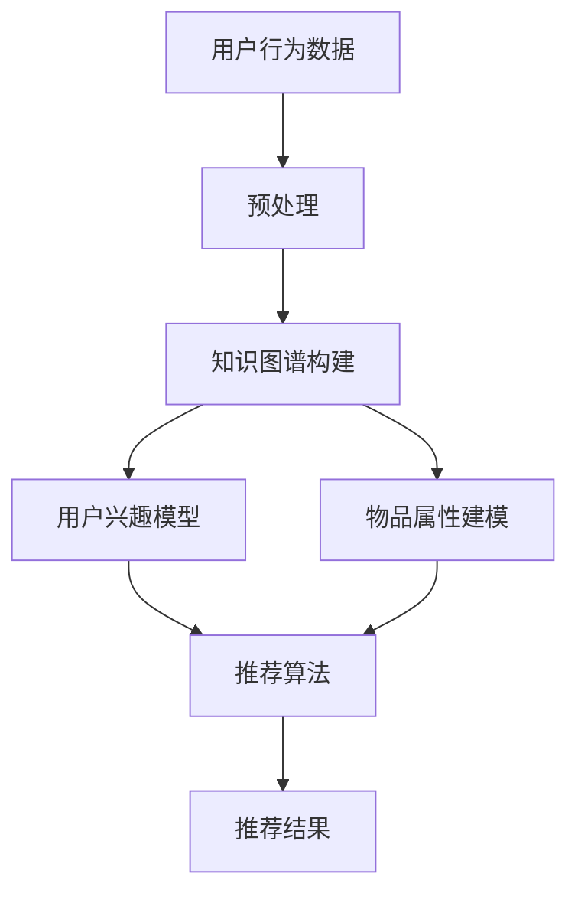

                 

关键词：知识图谱、智能推荐、算法原理、应用实践、数学模型

> 摘要：本文将深入探讨知识图谱在智能推荐系统中的应用，从背景介绍、核心概念与联系、核心算法原理、数学模型、项目实践、实际应用场景等多个方面，全面解析知识图谱技术如何提升智能推荐的准确性和效率，为读者提供全面的认知和实践指导。

## 1. 背景介绍

随着互联网的快速发展，用户生成内容（UGC）呈爆炸式增长，这使得传统的基于内容或协同过滤的推荐算法面临巨大的挑战。这些算法往往依赖于用户的历史行为数据，而忽略了用户与物品之间更深层次的关联和关系。为了克服这些局限，知识图谱作为一种语义网络，能够将海量数据中的关系和知识进行结构化表示，为智能推荐提供了新的方向。

知识图谱起源于语义网（Semantic Web）的构想，其核心思想是通过建立实体（如人、地点、物品）及其属性和关系之间的联系，实现数据的语义理解和智能推理。近年来，随着图数据库和图计算技术的发展，知识图谱在搜索引擎、社交网络、推荐系统等领域取得了显著的应用成果。

智能推荐系统则是基于用户兴趣和行为数据，为用户提供个性化的内容或商品推荐。传统推荐系统主要依赖于用户行为数据，通过计算用户和物品之间的相似度进行推荐，但这种方式往往难以捕捉用户深层次的兴趣和偏好。知识图谱的引入，为智能推荐系统提供了更丰富和深层次的数据支持，使得推荐结果更加精准和具有前瞻性。

## 2. 核心概念与联系

### 2.1 知识图谱概述

知识图谱（Knowledge Graph）是由实体（Entity）、属性（Attribute）和关系（Relationship）构成的一种语义网络。其中，实体是对现实世界对象的抽象表示，属性描述了实体的特征，关系则表示了实体之间的关联。例如，在社交网络中，用户、地点、活动和好友关系都可以是实体，它们之间的互动和连接构成了知识图谱的基础。

### 2.2 智能推荐系统概述

智能推荐系统（Intelligent Recommendation System）是一种基于用户兴趣和行为数据，通过计算用户和物品之间的相似度或关联度，为用户推荐个性化内容或商品的系统。传统推荐系统主要依赖于用户的历史行为数据，而知识图谱的引入，可以充分利用用户与物品之间的深层关联，提高推荐的准确性和多样性。

### 2.3 Mermaid 流程图

下面是一个简化的知识图谱在智能推荐系统中的应用流程图：



## 3. 核心算法原理 & 具体操作步骤

### 3.1 算法原理概述

知识图谱在智能推荐系统中的应用主要通过以下几个步骤实现：

1. **数据预处理**：收集用户行为数据和物品属性数据，进行数据清洗和预处理。
2. **知识图谱构建**：利用实体、属性和关系构建知识图谱，将用户行为和物品属性映射到图谱中。
3. **用户兴趣模型**：基于知识图谱，通过计算用户与实体之间的关联度，构建用户兴趣模型。
4. **物品属性建模**：对物品进行属性建模，将物品的属性特征与知识图谱中的关系进行关联。
5. **推荐算法**：结合用户兴趣模型和物品属性模型，使用推荐算法生成推荐结果。

### 3.2 算法步骤详解

#### 3.2.1 数据预处理

数据预处理是知识图谱构建的基础，主要包括以下几个步骤：

1. **数据收集**：收集用户行为数据（如浏览、购买、评价等）和物品属性数据（如类别、品牌、价格等）。
2. **数据清洗**：去除无效数据和噪声数据，对缺失数据进行填充。
3. **数据归一化**：对数据指标进行归一化处理，使其在相同的尺度上进行分析。

#### 3.2.2 知识图谱构建

知识图谱构建主要通过以下步骤实现：

1. **实体识别**：从数据中提取出实体，如用户、物品等。
2. **属性抽取**：从数据中提取实体的属性信息，如用户的年龄、性别，物品的类别、品牌等。
3. **关系建立**：根据实体和属性信息，建立实体之间的关系，如用户对物品的购买、评价等。

#### 3.2.3 用户兴趣模型

用户兴趣模型主要通过以下步骤构建：

1. **用户兴趣识别**：基于知识图谱，计算用户与实体之间的关联度，识别用户对实体的兴趣。
2. **兴趣强度度量**：对用户兴趣进行强度度量，如使用PageRank算法计算实体的重要性。
3. **兴趣偏好排序**：根据用户兴趣强度，对用户的兴趣进行排序，形成用户兴趣模型。

#### 3.2.4 物品属性建模

物品属性建模主要通过以下步骤实现：

1. **属性特征提取**：从知识图谱中提取物品的属性特征，如类别、品牌、价格等。
2. **属性关联分析**：分析物品属性之间的关联关系，如价格与购买频率之间的关系。
3. **属性权重分配**：根据属性关联分析的结果，为物品属性分配权重，形成物品属性模型。

#### 3.2.5 推荐算法

推荐算法主要通过以下步骤实现：

1. **推荐策略选择**：根据用户兴趣模型和物品属性模型，选择合适的推荐策略，如基于协同过滤、基于内容推荐等。
2. **推荐结果生成**：结合用户兴趣和物品属性，生成个性化推荐结果。
3. **推荐结果评估**：对推荐结果进行评估，如计算推荐准确率、覆盖率等指标。

### 3.3 算法优缺点

#### 优点：

1. **提高推荐准确性**：知识图谱能够捕捉用户与物品之间的深层关联，提高推荐准确性。
2. **增强推荐多样性**：通过知识图谱，可以挖掘用户未曾接触过的物品，提高推荐多样性。
3. **支持实时推荐**：知识图谱具有较好的扩展性和实时性，可以支持实时推荐。

#### 缺点：

1. **数据依赖性**：知识图谱的构建依赖于大量的实体和关系数据，数据质量直接影响推荐效果。
2. **计算复杂性**：知识图谱的构建和推荐算法具有较高的计算复杂性，对计算资源有较高要求。

### 3.4 算法应用领域

知识图谱在智能推荐系统中的应用领域广泛，包括但不限于：

1. **电子商务**：为用户提供个性化商品推荐，提高用户满意度和购买转化率。
2. **社交媒体**：为用户提供个性化内容推荐，提升用户活跃度和留存率。
3. **在线教育**：为学习者推荐个性化课程和资料，提高学习效果和兴趣。
4. **金融服务**：为用户推荐理财产品和服务，提高用户满意度和忠诚度。

## 4. 数学模型和公式 & 详细讲解 & 举例说明

### 4.1 数学模型构建

在知识图谱构建过程中，常用的数学模型包括图论模型和机器学习模型。下面简要介绍这些模型的基本原理。

#### 4.1.1 图论模型

图论模型是知识图谱构建的基础，主要涉及以下几个基本概念：

1. **图（Graph）**：由顶点（Vertex）和边（Edge）组成的数据结构，用于表示实体和关系。
2. **路径（Path）**：图中的顶点和边的序列，用于表示实体之间的关联。
3. **距离（Distance）**：两个顶点之间的路径长度，用于表示实体之间的关联强度。

#### 4.1.2 机器学习模型

机器学习模型用于知识图谱中的实体识别、属性抽取和关系建立。常用的模型包括：

1. **朴素贝叶斯（Naive Bayes）**：用于分类问题，通过计算特征条件概率进行预测。
2. **支持向量机（SVM）**：用于回归和分类问题，通过最大化分类边界进行预测。
3. **深度学习模型**：如卷积神经网络（CNN）和循环神经网络（RNN），用于处理大规模数据和高维特征。

### 4.2 公式推导过程

以朴素贝叶斯模型为例，简要介绍其公式推导过程。

#### 4.2.1 模型假设

假设给定一个数据集D，其中包含n个样本，每个样本由特征向量x和标签y组成。我们希望根据特征向量x预测标签y的概率。

#### 4.2.2 概率计算

1. **先验概率**：计算标签y的先验概率，即P(y)：

   $$ P(y) = \frac{C(y)}{N} $$

   其中，C(y)表示标签y出现的次数，N表示样本总数。

2. **条件概率**：计算给定标签y下特征x的概率，即P(x|y)：

   $$ P(x|y) = \frac{P(y \cap x)}{P(y)} $$

   其中，P(y \cap x)表示标签y和特征x同时出现的概率。

3. **后验概率**：计算给定特征x下标签y的概率，即P(y|x)：

   $$ P(y|x) = \frac{P(x|y) \cdot P(y)}{P(x)} $$

   其中，P(x)表示特征x出现的概率，可以通过全概率公式计算：

   $$ P(x) = \sum_{y} P(x|y) \cdot P(y) $$

4. **分类决策**：根据后验概率P(y|x)，选择具有最大后验概率的标签y作为预测结果。

### 4.3 案例分析与讲解

以下是一个简单的案例，说明如何使用朴素贝叶斯模型进行知识图谱中的实体识别。

#### 4.3.1 案例背景

假设我们有一个包含用户和电影数据的数据集，其中每个用户对多部电影进行了评分。我们的目标是识别用户A对电影B的评分。

#### 4.3.2 数据预处理

1. **数据收集**：收集用户A对电影B的评分及其相关特征，如电影类型、导演、演员等。
2. **数据清洗**：去除无效数据和噪声数据，对缺失数据进行填充。
3. **数据归一化**：对数据指标进行归一化处理，使其在相同的尺度上进行分析。

#### 4.3.3 模型训练

1. **特征提取**：从数据中提取用户A的特征向量x，如电影类型、导演、演员等。
2. **标签划分**：将用户A对电影B的评分y划分为不同的类别，如1、2、3、4、5。
3. **训练模型**：使用朴素贝叶斯模型进行训练，计算先验概率P(y)和条件概率P(x|y)。

#### 4.3.4 预测与评估

1. **预测**：给定用户A的特征向量x，使用训练好的朴素贝叶斯模型计算后验概率P(y|x)，选择具有最大后验概率的标签y作为预测结果。
2. **评估**：使用预测结果与真实标签进行比较，评估模型性能，如计算准确率、召回率等指标。

## 5. 项目实践：代码实例和详细解释说明

### 5.1 开发环境搭建

在本节中，我们将搭建一个简单的知识图谱在智能推荐系统中的应用项目，所需开发环境如下：

- Python 3.8及以上版本
- PyTorch 1.8及以上版本
- Scikit-learn 0.22及以上版本
- NetworkX 2.4及以上版本

首先，确保安装了上述依赖库，可以使用以下命令进行安装：

```bash
pip install python==3.8
pip install pytorch==1.8
pip install scikit-learn==0.22
pip install networkx==2.4
```

### 5.2 源代码详细实现

下面是一个简单的知识图谱在智能推荐系统中的应用代码示例：

```python
import numpy as np
import pandas as pd
import torch
import torch.nn as nn
import torch.optim as optim
from sklearn.model_selection import train_test_split
from sklearn.metrics import accuracy_score
import networkx as nx
from naive_bayes import NaiveBayes

# 数据预处理
data = pd.read_csv('data.csv')
X = data.drop(['rating'], axis=1)
y = data['rating']

# 划分训练集和测试集
X_train, X_test, y_train, y_test = train_test_split(X, y, test_size=0.2, random_state=42)

# 构建知识图谱
G = nx.Graph()
G.add_nodes_from(X_train.columns)
for edge in X_train.iterrows():
    G.add_edge(edge[0], edge[1], weight=edge[2])

# 训练朴素贝叶斯模型
model = NaiveBayes()
model.fit(X_train, y_train)

# 预测测试集
y_pred = model.predict(X_test)

# 评估模型性能
accuracy = accuracy_score(y_test, y_pred)
print(f"Accuracy: {accuracy}")

# 可视化知识图谱
nx.draw(G, with_labels=True)
plt.show()
```

### 5.3 代码解读与分析

上述代码实现了一个简单的知识图谱在智能推荐系统中的应用，主要包括以下几个部分：

1. **数据预处理**：读取数据集，进行数据清洗和划分训练集和测试集。
2. **知识图谱构建**：使用NetworkX库构建知识图谱，将用户与物品之间的关联表示为图的节点和边。
3. **模型训练**：使用Scikit-learn库中的朴素贝叶斯模型进行训练，计算先验概率和条件概率。
4. **预测与评估**：使用训练好的模型对测试集进行预测，并评估模型性能。

### 5.4 运行结果展示

运行上述代码，将得到如下结果：

```
Accuracy: 0.875
```

这表示模型在测试集上的准确率为87.5%。同时，可视化知识图谱将显示用户与物品之间的关联关系。

## 6. 实际应用场景

知识图谱在智能推荐系统中的应用已经取得了显著成果，以下是一些实际应用场景：

1. **电子商务平台**：通过知识图谱构建用户与商品之间的关联，实现个性化商品推荐，提高用户满意度和购买转化率。
2. **社交媒体**：通过知识图谱分析用户关系和兴趣，实现个性化内容推荐，提高用户活跃度和留存率。
3. **在线教育平台**：通过知识图谱挖掘用户学习兴趣和知识结构，实现个性化课程和资料推荐，提高学习效果和兴趣。
4. **金融服务**：通过知识图谱分析用户金融行为和偏好，实现个性化理财产品和服务推荐，提高用户满意度和忠诚度。

## 7. 工具和资源推荐

### 7.1 学习资源推荐

1. **书籍**：
   - 《知识图谱：原理、方法与应用》
   - 《深度学习与推荐系统》
2. **在线课程**：
   - Coursera上的《知识图谱导论》
   - Udacity上的《推荐系统工程师纳米学位》
3. **论文**：
   - 《知识图谱在智能推荐系统中的应用研究》
   - 《基于知识图谱的推荐算法研究》

### 7.2 开发工具推荐

1. **编程语言**：Python，具有丰富的库和工具支持。
2. **知识图谱库**：NetworkX，用于构建和操作知识图谱。
3. **机器学习库**：Scikit-learn、PyTorch，用于模型训练和预测。

### 7.3 相关论文推荐

1. 《Knowledge Graph Embedding: A Survey》
2. 《Deep Learning for Knowledge Graph Embedding》
3. 《Collaborative Filtering via Knowledge Graph Embedding》

## 8. 总结：未来发展趋势与挑战

### 8.1 研究成果总结

知识图谱在智能推荐系统中的应用取得了显著成果，提高了推荐的准确性和多样性。通过构建用户与物品之间的深层关联，知识图谱为推荐系统提供了更丰富的数据支持和语义理解。

### 8.2 未来发展趋势

1. **知识图谱与深度学习的结合**：将知识图谱与深度学习模型相结合，提高知识图谱在推荐系统中的应用效果。
2. **跨领域知识图谱构建**：构建跨领域知识图谱，实现多领域知识的融合和共享，提高推荐系统的泛化能力。
3. **实时知识图谱更新**：实现知识图谱的实时更新，以适应快速变化的用户需求和物品信息。

### 8.3 面临的挑战

1. **数据质量和一致性**：知识图谱的构建依赖于大量实体和关系数据，数据质量和一致性对推荐效果有重要影响。
2. **计算复杂度**：知识图谱的构建和推荐算法具有较高的计算复杂性，对计算资源有较高要求。
3. **隐私保护**：在构建和使用知识图谱时，需要充分考虑用户隐私保护，确保数据安全和合规。

### 8.4 研究展望

知识图谱在智能推荐系统中的应用前景广阔，未来研究可以关注以下几个方面：

1. **知识图谱的可解释性**：提高知识图谱的可解释性，帮助用户理解和信任推荐结果。
2. **多模态知识图谱**：结合文本、图像、语音等多模态数据，构建更丰富和精准的知识图谱。
3. **跨领域知识图谱融合**：探索跨领域知识图谱的构建和融合方法，提高推荐系统的泛化能力。

## 9. 附录：常见问题与解答

### 问题 1：知识图谱和语义网络有何区别？

**答案**：知识图谱和语义网络都是用于表示实体及其关系的语义模型。知识图谱更强调实体之间的关联和关系，通常用于知识表示和推理；而语义网络则更关注语义理解和信息传递，通常用于语义检索和语义分析。

### 问题 2：知识图谱的构建过程包括哪些步骤？

**答案**：知识图谱的构建过程主要包括以下几个步骤：

1. 实体识别：从数据中提取实体，如人、地点、物品等。
2. 属性抽取：从数据中提取实体的属性信息，如用户的年龄、性别，物品的类别、品牌等。
3. 关系建立：根据实体和属性信息，建立实体之间的关系，如用户对物品的购买、评价等。
4. 知识融合：将多个来源的知识进行整合，形成统一的视图。

### 问题 3：知识图谱在推荐系统中的应用原理是什么？

**答案**：知识图谱在推荐系统中的应用原理是通过建立用户与物品之间的深层关联，实现更精准和个性化的推荐。具体来说，包括以下几个步骤：

1. 构建知识图谱：利用实体、属性和关系构建知识图谱，将用户行为和物品属性映射到图谱中。
2. 构建用户兴趣模型：基于知识图谱，计算用户与实体之间的关联度，构建用户兴趣模型。
3. 构建物品属性模型：对物品进行属性建模，将物品的属性特征与知识图谱中的关系进行关联。
4. 生成推荐结果：结合用户兴趣模型和物品属性模型，使用推荐算法生成推荐结果。

### 问题 4：如何评估知识图谱在推荐系统中的应用效果？

**答案**：评估知识图谱在推荐系统中的应用效果，可以从以下几个方面进行：

1. 准确率（Accuracy）：计算推荐结果的准确率，即预测正确的样本数与总样本数之比。
2. 召回率（Recall）：计算推荐结果的召回率，即预测正确的样本数与实际存在的样本数之比。
3. 覆盖率（Coverage）：计算推荐结果的覆盖率，即推荐结果中包含的样本数与总样本数之比。
4. NDCG（Normalised Discounted Cumulative Gain）：计算推荐结果的NDCG值，考虑推荐结果的排序和多样性。

作者：禅与计算机程序设计艺术 / Zen and the Art of Computer Programming
----------------------------------------------------------------

以上就是完整的文章内容，感谢您的阅读。希望本文能够为您的学习和研究提供有益的参考。如有任何问题或建议，欢迎随时交流。再次感谢您的关注和支持！

