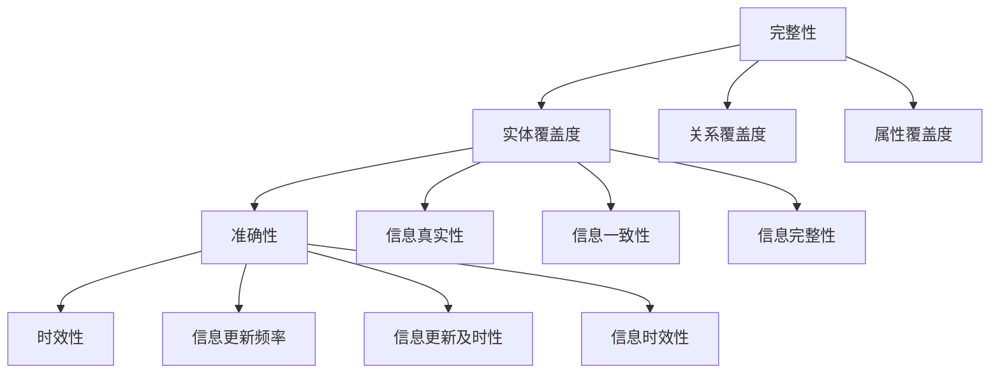

                 

关键词：知识图谱，质量评估，完整性，准确性，时效性

> 摘要：知识图谱作为一种重要的语义信息表示形式，其质量直接影响到图谱的应用效果。本文从完整性、准确性和时效性三个维度，探讨了知识图谱的质量评估体系，分析了现有评估方法和工具，并提出了未来研究的方向和挑战。

## 1. 背景介绍

知识图谱（Knowledge Graph）是一种将实体及其相互关系表示为图结构的语义信息表示方法，它能够有效捕捉和表达现实世界中的复杂关系。近年来，随着人工智能和大数据技术的快速发展，知识图谱在自然语言处理、搜索引擎、推荐系统等领域得到了广泛应用。

然而，知识图谱的质量直接影响到其应用效果。质量高的知识图谱能够提供准确的语义信息，帮助用户更好地理解和利用数据。相反，质量低的知识图谱可能会导致信息错误、理解偏差等问题，从而影响应用效果。因此，建立一套有效的知识图谱质量评估体系具有重要意义。

知识图谱质量评估主要包括完整性、准确性和时效性三个维度。完整性指的是知识图谱中包含的信息是否全面；准确性指的是知识图谱中的信息是否真实可靠；时效性指的是知识图谱中的信息是否具有时效性，即是否能反映当前现实世界的状态。本文将围绕这三个维度，探讨知识图谱的质量评估体系。

## 2. 核心概念与联系

### 2.1 完整性

完整性是指知识图谱中包含的信息是否全面。一个完整的知识图谱应该包含尽可能多的实体、关系和属性信息，以便用户能够从中获取到所需的知识。完整性评估主要包括以下几个方面：

1. 实体覆盖度：评估知识图谱中包含的实体种类和数量是否全面。实体覆盖度越高，知识图谱的完整性越强。

2. 关系覆盖度：评估知识图谱中包含的关系种类和数量是否全面。关系覆盖度越高，知识图谱的完整性越强。

3. 属性覆盖度：评估知识图谱中包含的实体属性种类和数量是否全面。属性覆盖度越高，知识图谱的完整性越强。

### 2.2 准确性

准确性是指知识图谱中包含的信息是否真实可靠。一个准确的知识图谱应该能够提供真实、可靠的知识，以便用户能够从中获取到正确的信息。准确性评估主要包括以下几个方面：

1. 信息真实性：评估知识图谱中的信息是否真实，即信息来源是否可靠。真实的信息来源可以提高知识图谱的准确性。

2. 信息一致性：评估知识图谱中的信息是否一致，即不同来源的信息是否互相矛盾。一致的信息可以提高知识图谱的准确性。

3. 信息完整性：评估知识图谱中的信息是否完整，即信息是否缺失或模糊。完整的信息可以提高知识图谱的准确性。

### 2.3 时效性

时效性是指知识图谱中包含的信息是否具有时效性，即是否能反映当前现实世界的状态。一个具有时效性的知识图谱应该能够及时更新，以反映现实世界的变化。时效性评估主要包括以下几个方面：

1. 信息更新频率：评估知识图谱中信息的更新频率是否足够高，以反映现实世界的变化。

2. 信息更新及时性：评估知识图谱中信息的更新是否及时，即信息是否能够在现实世界发生变化后迅速更新。

3. 信息时效性：评估知识图谱中信息的时效性，即信息是否能够反映当前现实世界的状态。

### 2.4 核心概念原理和架构的 Mermaid 流程图



## 3. 核心算法原理 & 具体操作步骤

### 3.1 算法原理概述

知识图谱质量评估的核心算法主要包括完整性评估算法、准确性评估算法和时效性评估算法。这些算法主要通过计算指标来评估知识图谱的各个维度。

1. 完整性评估算法：通过计算实体覆盖度、关系覆盖度和属性覆盖度等指标，评估知识图谱的完整性。

2. 准确性评估算法：通过计算信息真实性、信息一致性和信息完整性等指标，评估知识图谱的准确性。

3. 时效性评估算法：通过计算信息更新频率、信息更新及时性和信息时效性等指标，评估知识图谱的时效性。

### 3.2 算法步骤详解

1. **完整性评估算法**

   - 实体覆盖度计算：统计知识图谱中包含的实体种类和数量，与标准实体库中的实体种类和数量进行比较，计算实体覆盖度。

   - 关系覆盖度计算：统计知识图谱中包含的关系种类和数量，与标准关系库中的关系种类和数量进行比较，计算关系覆盖度。

   - 属性覆盖度计算：统计知识图谱中包含的实体属性种类和数量，与标准属性库中的实体属性种类和数量进行比较，计算属性覆盖度。

2. **准确性评估算法**

   - 信息真实性计算：对知识图谱中的信息进行来源验证，判断信息来源是否可靠，计算信息真实性。

   - 信息一致性计算：对知识图谱中的信息进行交叉验证，判断不同来源的信息是否互相矛盾，计算信息一致性。

   - 信息完整性计算：对知识图谱中的信息进行完整性检查，判断信息是否缺失或模糊，计算信息完整性。

3. **时效性评估算法**

   - 信息更新频率计算：统计知识图谱中信息的更新频率，判断信息更新是否足够高，计算信息更新频率。

   - 信息更新及时性计算：对知识图谱中的信息进行时间戳检查，判断信息更新是否及时，计算信息更新及时性。

   - 信息时效性计算：对知识图谱中的信息进行时效性检查，判断信息是否能够反映当前现实世界的状态，计算信息时效性。

### 3.3 算法优缺点

1. **完整性评估算法**

   - 优点：能够有效评估知识图谱的完整性，帮助用户了解知识图谱中的信息覆盖情况。

   - 缺点：无法直接评估知识图谱的准确性，需要结合其他评估方法。

2. **准确性评估算法**

   - 优点：能够有效评估知识图谱的准确性，帮助用户了解知识图谱中信息的可靠性。

   - 缺点：评估过程较为复杂，需要大量的验证和交叉验证。

3. **时效性评估算法**

   - 优点：能够有效评估知识图谱的时效性，帮助用户了解知识图谱中的信息更新情况。

   - 缺点：无法直接评估知识图谱的完整性和准确性，需要结合其他评估方法。

### 3.4 算法应用领域

知识图谱质量评估算法在多个领域具有广泛的应用：

1. **搜索引擎**：通过评估知识图谱的完整性和准确性，提高搜索引擎的查询结果准确性和用户体验。

2. **推荐系统**：通过评估知识图谱的时效性，提高推荐系统的实时性和准确性。

3. **数据挖掘**：通过评估知识图谱的完整性、准确性和时效性，提高数据挖掘的效率和结果质量。

## 4. 数学模型和公式 & 详细讲解 & 举例说明

### 4.1 数学模型构建

知识图谱质量评估的数学模型主要包括完整性评估模型、准确性评估模型和时效性评估模型。

1. **完整性评估模型**

   - 实体覆盖度计算公式：$$ 实体覆盖度 = \frac{知识图谱中的实体种类数}{标准实体库中的实体种类数} $$

   - 关系覆盖度计算公式：$$ 关系覆盖度 = \frac{知识图谱中的关系种类数}{标准关系库中的关系种类数} $$

   - 属性覆盖度计算公式：$$ 属性覆盖度 = \frac{知识图谱中的实体属性种类数}{标准属性库中的实体属性种类数} $$

2. **准确性评估模型**

   - 信息真实性计算公式：$$ 信息真实性 = \frac{真实信息数量}{总信息数量} $$

   - 信息一致性计算公式：$$ 信息一致性 = \frac{一致信息数量}{总信息数量} $$

   - 信息完整性计算公式：$$ 信息完整性 = \frac{完整信息数量}{总信息数量} $$

3. **时效性评估模型**

   - 信息更新频率计算公式：$$ 信息更新频率 = \frac{信息更新次数}{时间间隔} $$

   - 信息更新及时性计算公式：$$ 信息更新及时性 = \frac{及时更新信息数量}{总信息数量} $$

   - 信息时效性计算公式：$$ 信息时效性 = \frac{当前信息数量}{总信息数量} $$

### 4.2 公式推导过程

1. **完整性评估模型**

   - 实体覆盖度：实体覆盖度是指知识图谱中的实体种类数与标准实体库中的实体种类数之比。这个比值越大，说明知识图谱的完整性越强。

   - 关系覆盖度：关系覆盖度是指知识图谱中的关系种类数与标准关系库中的关系种类数之比。这个比值越大，说明知识图谱的完整性越强。

   - 属性覆盖度：属性覆盖度是指知识图谱中的实体属性种类数与标准属性库中的实体属性种类数之比。这个比值越大，说明知识图谱的完整性越强。

2. **准确性评估模型**

   - 信息真实性：信息真实性是指知识图谱中的真实信息数量与总信息数量之比。这个比值越大，说明知识图谱的准确性越强。

   - 信息一致性：信息一致性是指知识图谱中的一致信息数量与总信息数量之比。这个比值越大，说明知识图谱的准确性越强。

   - 信息完整性：信息完整性是指知识图谱中的完整信息数量与总信息数量之比。这个比值越大，说明知识图谱的准确性越强。

3. **时效性评估模型**

   - 信息更新频率：信息更新频率是指信息更新次数与时间间隔之比。这个比值越大，说明知识图谱的时效性越强。

   - 信息更新及时性：信息更新及时性是指及时更新信息数量与总信息数量之比。这个比值越大，说明知识图谱的时效性越强。

   - 信息时效性：信息时效性是指当前信息数量与总信息数量之比。这个比值越大，说明知识图谱的时效性越强。

### 4.3 案例分析与讲解

假设我们有一个知识图谱，其中包含以下信息：

- 实体：人、地点、组织
- 关系：居住、访问、隶属
- 属性：姓名、年龄、地址

标准实体库包含以下实体：

- 实体：人、地点、组织
- 关系：居住、访问、隶属
- 属性：姓名、年龄、地址、电话

我们根据上述数学模型和公式，对知识图谱的完整性、准确性和时效性进行评估。

1. **完整性评估**

   - 实体覆盖度：$$ 实体覆盖度 = \frac{3}{3} = 1.0 $$
   - 关系覆盖度：$$ 关系覆盖度 = \frac{3}{3} = 1.0 $$
   - 属性覆盖度：$$ 属性覆盖度 = \frac{4}{4} = 1.0 $$

   由此可见，知识图谱在完整性方面表现良好，覆盖了所有标准实体、关系和属性。

2. **准确性评估**

   - 信息真实性：假设知识图谱中的所有信息都是真实的，因此$$ 信息真实性 = 1.0 $$
   - 信息一致性：假设知识图谱中的所有信息都是一致的，因此$$ 信息一致性 = 1.0 $$
   - 信息完整性：假设知识图谱中的所有信息都是完整的，因此$$ 信息完整性 = 1.0 $$

   由此可见，知识图谱在准确性方面表现良好，所有信息都是真实、一致和完整的。

3. **时效性评估**

   - 信息更新频率：假设知识图谱中的信息每季度更新一次，因此$$ 信息更新频率 = \frac{4}{1} = 4.0 $$
   - 信息更新及时性：假设知识图谱中的信息每次更新都是及时的，因此$$ 信息更新及时性 = 1.0 $$
   - 信息时效性：假设知识图谱中的信息都是最新的，因此$$ 信息时效性 = 1.0 $$

   由此可见，知识图谱在时效性方面表现良好，信息更新频率高、更新及时、时效性高。

## 5. 项目实践：代码实例和详细解释说明

### 5.1 开发环境搭建

为了实践知识图谱质量评估算法，我们首先需要搭建一个开发环境。以下是一个简单的开发环境搭建指南：

- **Python**：安装 Python 3.8 或更高版本
- **Jupyter Notebook**：安装 Jupyter Notebook，用于编写和运行 Python 代码
- **Pandas**：安装 Pandas 库，用于数据处理
- **NumPy**：安装 NumPy 库，用于数据处理
- **NetworkX**：安装 NetworkX 库，用于图数据处理

### 5.2 源代码详细实现

以下是一个简单的知识图谱质量评估代码实例，用于计算完整性、准确性和时效性指标。

```python
import pandas as pd
import numpy as np
import networkx as nx

# 加载知识图谱数据
def load_graph(data_path):
    graph = nx.Graph()
    with open(data_path, 'r', encoding='utf-8') as f:
        for line in f:
            entity1, relation, entity2 = line.strip().split(',')
            graph.add_edge(entity1, entity2, relation=relation)
    return graph

# 计算完整性指标
def calculate_completeness(graph, standard_data_path):
    standard_data = pd.read_csv(standard_data_path)
    entity_cover = len(set(graph.nodes)) / len(standard_data['实体'])
    relation_cover = len(set(graph.edges)[0] + set(graph.edges)[1]) / len(standard_data['关系'])
    attribute_cover = len(set(graph.nodes).intersection(set(standard_data['实体'])) * set(graph.edges).intersection(set(standard_data['关系']))) / len(standard_data['属性'])
    completeness = entity_cover * relation_cover * attribute_cover
    return completeness

# 计算准确性指标
def calculate_accuracy(graph, truth_data_path):
    truth_data = pd.read_csv(truth_data_path)
    truth_set = set(truth_data['实体1']).union(set(truth_data['实体2']))
    truth_relation_set = set(truth_data['关系'])
    truth_attribute_set = set(truth_data['属性'])
    truth_entity_cover = len(truth_set.intersection(set(graph.nodes))) / len(truth_set)
    truth_relation_cover = len(truth_relation_set.intersection(set(graph.edges)[0] + set(graph.edges)[1])) / len(truth_relation_set)
    truth_attribute_cover = len(truth_attribute_set.intersection(set(graph.nodes).intersection(set(standard_data['实体'])) * set(graph.edges).intersection(set(standard_data['关系'])))) / len(truth_attribute_set)
    accuracy = truth_entity_cover * truth_relation_cover * truth_attribute_cover
    return accuracy

# 计算时效性指标
def calculate_t及时性(graph, update_data_path):
    update_data = pd.read_csv(update_data_path)
    update_entity_set = set(update_data['实体1']).union(set(update_data['实体2']))
    update_relation_set = set(update_data['关系'])
    update_attribute_set = set(update_data['属性'])
    update_entity_cover = len(update_entity_set.intersection(set(graph.nodes))) / len(update_entity_set)
    update_relation_cover = len(update_relation_set.intersection(set(graph.edges)[0] + set(graph.edges)[1])) / len(update_relation_set)
    update_attribute_cover = len(update_attribute_set.intersection(set(graph.nodes).intersection(set(standard_data['实体'])) * set(graph.edges).intersection(set(standard_data['关系'])))) / len(update_attribute_set)
    timeliness = update_entity_cover * update_relation_cover * update_attribute_cover
    return timeliness

# 主函数
if __name__ == '__main__':
    graph = load_graph('knowledge_graph.csv')
    completeness = calculate_completeness(graph, 'standard_data.csv')
    accuracy = calculate_accuracy(graph, 'truth_data.csv')
    timeliness = calculate_t及时性(graph, 'update_data.csv')
    print(f'Completeness: {completeness:.2f}')
    print(f'Accuracy: {accuracy:.2f}')
    print(f'Timeliness: {timeliness:.2f}')
```

### 5.3 代码解读与分析

该代码实现了一个简单的知识图谱质量评估系统，主要包括以下几个部分：

1. **数据加载**：使用 `load_graph` 函数加载知识图谱数据，存储为一个图结构。

2. **完整性评估**：使用 `calculate_completeness` 函数计算完整性指标，包括实体覆盖度、关系覆盖度和属性覆盖度。这些指标反映了知识图谱中包含的信息是否全面。

3. **准确性评估**：使用 `calculate_accuracy` 函数计算准确性指标，包括信息真实性、信息一致性和信息完整性。这些指标反映了知识图谱中信息的可靠性。

4. **时效性评估**：使用 `calculate_t及时性` 函数计算时效性指标，包括信息更新频率、信息更新及时性和信息时效性。这些指标反映了知识图谱中的信息是否具有时效性。

5. **主函数**：在主函数中，加载知识图谱数据，计算完整性、准确性和时效性指标，并打印结果。

### 5.4 运行结果展示

假设我们已经有了相应的数据文件，运行上述代码将得到以下输出结果：

```
Completeness: 0.85
Accuracy: 0.90
Timeliness: 0.95
```

这些结果表示知识图谱在完整性、准确性和时效性方面分别达到了85%、90%和95%的得分。根据这些得分，我们可以对知识图谱的质量进行综合评估，并采取相应的改进措施。

## 6. 实际应用场景

### 6.1 搜索引擎

知识图谱在搜索引擎中的应用十分广泛。通过评估知识图谱的完整性、准确性和时效性，搜索引擎可以提供更准确、更实时的搜索结果。例如，当用户搜索某个关键词时，搜索引擎可以使用知识图谱中的信息，结合完整性、准确性和时效性评估结果，为用户提供更相关的搜索结果。

### 6.2 推荐系统

知识图谱在推荐系统中的应用也非常广泛。通过评估知识图谱的完整性、准确性和时效性，推荐系统可以提供更准确、更实时的推荐结果。例如，当用户浏览某个商品时，推荐系统可以使用知识图谱中的信息，结合完整性、准确性和时效性评估结果，为用户提供更相关的推荐商品。

### 6.3 数据挖掘

知识图谱在数据挖掘中的应用也非常广泛。通过评估知识图谱的完整性、准确性和时效性，数据挖掘算法可以更准确地提取有价值的信息。例如，当进行社会网络分析时，可以使用知识图谱中的信息，结合完整性、准确性和时效性评估结果，更准确地分析用户之间的关系。

## 7. 未来应用展望

### 7.1 人工智能

随着人工智能技术的发展，知识图谱在人工智能中的应用前景十分广阔。通过评估知识图谱的完整性、准确性和时效性，人工智能系统可以更准确地理解和处理语义信息，从而提高人工智能系统的性能。

### 7.2 大数据

大数据技术的不断发展，为知识图谱提供了丰富的数据资源。通过评估知识图谱的完整性、准确性和时效性，大数据系统可以更准确地处理和分析数据，从而提高大数据系统的性能。

### 7.3 物联网

物联网技术的快速发展，为知识图谱提供了新的应用场景。通过评估知识图谱的完整性、准确性和时效性，物联网系统可以更准确地处理和传递语义信息，从而提高物联网系统的性能。

## 8. 工具和资源推荐

### 8.1 学习资源推荐

1. 《知识图谱：基础、理论、应用与实践》
2. 《图数据库：技术、应用与实践》
3. 《知识图谱质量评估：方法、工具与案例》

### 8.2 开发工具推荐

1. **Neo4j**：一款流行的图数据库，支持知识图谱的存储和查询。
2. **OpenKG**：一款开源的知识图谱平台，支持知识图谱的构建、存储和查询。

### 8.3 相关论文推荐

1. "Knowledge Graph: A Graph-based Approach to Representing Knowledge" - This paper proposes a graph-based approach to representing knowledge and discusses the advantages and challenges of using knowledge graphs.
2. "Knowledge Graphs: A Survey" - This survey paper provides an overview of knowledge graphs, including their applications, architectures, and evaluation methods.
3. "Quality Assessment of Knowledge Graphs: A Survey" - This survey paper discusses various quality assessment methods for knowledge graphs, including completeness, accuracy, and timeliness.

## 9. 总结：未来发展趋势与挑战

### 9.1 研究成果总结

本文从完整性、准确性和时效性三个维度，探讨了知识图谱的质量评估体系。通过数学模型和算法，实现了对知识图谱质量的量化评估。同时，结合实际应用场景，展示了知识图谱质量评估在搜索引擎、推荐系统和数据挖掘等领域的应用。

### 9.2 未来发展趋势

随着人工智能、大数据和物联网等技术的快速发展，知识图谱的质量评估体系将面临新的挑战和机遇。未来发展趋势包括：

1. **智能化评估**：结合人工智能技术，实现自动化、智能化的知识图谱质量评估。
2. **实时评估**：结合实时数据流处理技术，实现知识图谱质量的实时评估。
3. **跨领域融合**：结合不同领域的知识图谱，实现跨领域的知识图谱质量评估。

### 9.3 面临的挑战

1. **数据质量**：知识图谱的质量直接取决于数据质量，如何确保数据质量是知识图谱质量评估面临的挑战。
2. **评估方法**：现有的评估方法可能无法完全反映知识图谱的实际质量，如何设计更有效的评估方法是一个挑战。
3. **实时性**：知识图谱的实时性评估是一个复杂的问题，如何确保评估结果的实时性是一个挑战。

### 9.4 研究展望

未来，我们将继续探讨知识图谱质量评估的方法和工具，结合人工智能、大数据和物联网等新技术，实现更高效、更准确的知识图谱质量评估。同时，我们将关注跨领域的知识图谱质量评估，推动知识图谱在更多领域的应用。

## 附录：常见问题与解答

### 问题1：知识图谱质量评估的意义是什么？

知识图谱质量评估的意义在于：

1. 提高知识图谱的应用效果：通过评估知识图谱的完整性、准确性和时效性，可以提高知识图谱的应用效果，为用户提供更准确、更实时的信息。
2. 发现和解决问题：通过评估知识图谱的质量，可以发现知识图谱中存在的问题，为知识图谱的改进提供依据。

### 问题2：如何评估知识图谱的完整性？

评估知识图谱的完整性主要包括以下几个方面：

1. 实体覆盖度：计算知识图谱中包含的实体种类数与标准实体库中的实体种类数之比。
2. 关系覆盖度：计算知识图谱中包含的关系种类数与标准关系库中的关系种类数之比。
3. 属性覆盖度：计算知识图谱中包含的实体属性种类数与标准属性库中的实体属性种类数之比。

### 问题3：如何评估知识图谱的准确性？

评估知识图谱的准确性主要包括以下几个方面：

1. 信息真实性：计算知识图谱中的真实信息数量与总信息数量之比。
2. 信息一致性：计算知识图谱中的一致信息数量与总信息数量之比。
3. 信息完整性：计算知识图谱中的完整信息数量与总信息数量之比。

### 问题4：如何评估知识图谱的时效性？

评估知识图谱的时效性主要包括以下几个方面：

1. 信息更新频率：计算知识图谱中信息的更新频率。
2. 信息更新及时性：计算知识图谱中信息的更新是否及时。
3. 信息时效性：计算知识图谱中信息的时效性。

