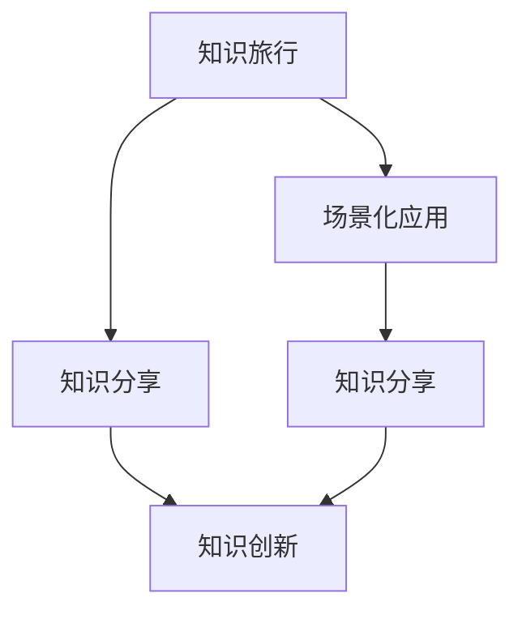

                 

### 关键词 Keywords

- 知识旅行
- 场景化应用
- 知识分享
- 人工智能
- 技术博客

<|assistant|>### 摘要 Abstract

本文探讨了如何通过知识旅行实现知识的场景化应用和分享。在数字化时代，知识的获取和传播变得越来越重要。然而，知识的有效应用和分享却面临着挑战。本文首先介绍了知识旅行的概念，然后分析了实现知识场景化应用和分享的关键技术，包括人工智能、语义网和区块链。接着，文章详细阐述了知识旅行的核心算法原理、数学模型和具体实现步骤。最后，通过实际项目实践和未来应用展望，探讨了知识旅行在实际应用中的潜力和挑战。本文旨在为IT领域的研究者、开发者和实践者提供有价值的参考。

## 1. 背景介绍

在当今的信息化时代，知识已经成为推动社会进步和经济发展的关键驱动力。然而，随着知识量的爆炸式增长，如何有效地获取、管理和应用知识成为了一个亟待解决的问题。传统的知识传播方式主要依赖于书籍、讲座和会议等形式，但这些方式往往存在时效性差、覆盖面有限和互动性不足等问题。为了解决这些问题，知识旅行这一概念被提出并逐渐得到了关注。

知识旅行是一种新型的知识传播方式，它将知识的学习和应用与虚拟或现实的旅行体验相结合，通过场景化的方式激发学习者的兴趣和参与度。知识旅行的核心在于将抽象的知识转化为具体的场景，使学习者能够更直观地理解和应用知识。这种形式不仅提高了知识传播的效率，还增强了学习者的参与感和体验感。

知识旅行的发展背景可以追溯到信息技术的迅速发展和互联网的普及。随着人工智能、大数据和物联网等技术的不断进步，人们获取和处理知识的能力得到了极大的提升。同时，社交媒体和在线教育平台的兴起，也为知识旅行提供了广泛的应用场景和传播渠道。

在知识旅行的实践中，人工智能技术发挥着至关重要的作用。人工智能可以通过分析学习者的行为数据，为其提供个性化的学习路径和推荐内容，从而提高知识获取的效率。此外，人工智能还可以模拟复杂的知识场景，使学习者能够在虚拟环境中进行实践操作，提升知识的实际应用能力。

语义网技术也是知识旅行的重要组成部分。语义网通过将数据与知识库相结合，实现了知识的高效组织和查询。在知识旅行中，语义网技术可以帮助学习者快速定位相关的知识点，并提供详细的背景信息和关联内容，从而增强知识的理解深度。

区块链技术则为知识旅行的可信性和透明性提供了保障。通过区块链的分布式存储和加密算法，知识旅行中的内容可以确保不会被篡改或泄露，同时，区块链的智能合约功能还可以实现知识分享的自动化和公平化。

总之，知识旅行作为一种新型的知识传播方式，具有极大的发展潜力。通过结合人工智能、语义网和区块链等关键技术，知识旅行不仅可以提高知识的获取和应用效率，还可以促进知识的共享和创新。

## 2. 核心概念与联系

### 2.1 知识旅行

知识旅行是一种将知识学习与旅行体验相结合的新型教育方式。它通过构建虚拟或现实场景，使学习者能够在具体的环境中获取和应用知识。知识旅行不仅包括对历史、文化、科学等领域的知识学习，还涉及跨学科的综合应用，如艺术、技术、社会等。其主要特点如下：

1. **场景化学习**：知识旅行通过具体的场景，如历史遗址、科学实验室、艺术展览等，使学习者能够直观地感受到知识的应用和意义。
2. **互动性**：知识旅行强调学习者的参与和互动，通过游戏、虚拟现实、互动讨论等形式，提高学习者的学习兴趣和参与度。
3. **个性化**：知识旅行可以根据学习者的兴趣、需求和知识水平，提供个性化的学习路径和推荐内容。

### 2.2 场景化应用

场景化应用是将知识应用于特定的实际场景中，使知识能够发挥最大的作用。场景化应用的关键在于将抽象的理论知识转化为具体的实践操作，使学习者能够在实际应用中理解和掌握知识。其主要特点如下：

1. **实践性**：场景化应用强调实践操作，通过真实的案例和项目，使学习者能够在实际操作中应用所学知识。
2. **针对性**：场景化应用针对具体的行业、领域或问题，提供针对性的解决方案，提高知识的实用性和针对性。
3. **可持续性**：场景化应用能够帮助学习者形成持续学习的动力，通过不断地实践和反思，提高知识的应用能力和创新能力。

### 2.3 知识分享

知识分享是知识传播的重要组成部分，它通过将个人的知识、经验和见解与他人分享，实现知识的共享和创新。知识分享的形式多种多样，包括讲座、会议、论坛、社交媒体、在线课程等。其主要特点如下：

1. **开放性**：知识分享强调开放性和透明性，通过公开的方式分享知识，使更多的人能够受益。
2. **互动性**：知识分享过程中，分享者和学习者之间可以进行互动和讨论，促进知识的深入理解和应用。
3. **多样性**：知识分享涵盖多个领域和层面，既有理论知识的分享，也有实际经验的交流，形成了一个多元化的知识生态系统。

### 2.4 关键技术联系

知识旅行、场景化应用和知识分享是相互联系、相互促进的。知识旅行为场景化应用提供了丰富的场景和互动方式，使学习者能够在具体环境中实践和应用知识。而场景化应用则进一步促进了知识分享，通过实际案例和项目，使知识能够更有效地传播和扩散。同时，知识分享为知识旅行和场景化应用提供了丰富的内容和资源，推动了知识创新和知识生态系统的建设。

为了实现这些核心概念的有效结合，人工智能、语义网和区块链等关键技术发挥了关键作用：

1. **人工智能**：通过自然语言处理、知识图谱等技术，人工智能可以帮助学习者个性化地获取和推荐知识，提高学习效率和应用能力。
2. **语义网**：通过将数据与知识库相结合，语义网技术实现了知识的高效组织和查询，为场景化应用和知识分享提供了有力支持。
3. **区块链**：通过分布式存储和加密算法，区块链技术确保了知识分享的可信性和透明性，促进了知识生态系统的可持续发展。

### 2.5 Mermaid 流程图

以下是一个简单的 Mermaid 流程图，展示了知识旅行、场景化应用和知识分享之间的核心联系：



在图 2-1 中，知识旅行（A）通过场景化应用（B）促进了知识分享（C），而知识分享（C）和场景化应用（B）共同推动了知识创新（E）。这种相互促进的关系，使得知识旅行、场景化应用和知识分享能够形成一个良性的知识生态系统。


## 3. 核心算法原理 & 具体操作步骤

### 3.1 算法原理概述

知识旅行实现知识的场景化应用和分享，依赖于一系列核心算法的支撑。这些算法主要包括知识图谱构建、场景识别与生成、个性化推荐和知识共享与认证等。以下是对这些算法原理的概述：

1. **知识图谱构建**：知识图谱是一种用于表示实体及其之间关系的图形结构，通过将文本、图片、音频等多种类型的数据转化为图谱结构，实现知识的高效组织和查询。
2. **场景识别与生成**：场景识别与生成算法通过对用户行为数据的分析，识别出用户感兴趣的场景，并根据这些场景生成相应的学习内容和互动体验。
3. **个性化推荐**：个性化推荐算法基于用户的兴趣、行为和知识背景，为用户推荐最相关的学习内容和场景，提高知识获取的效率和兴趣度。
4. **知识共享与认证**：知识共享与认证算法通过区块链技术，确保知识分享的可信性和透明性，同时实现知识的共享和认证，促进知识生态系统的可持续发展。

### 3.2 算法步骤详解

#### 3.2.1 知识图谱构建

1. **数据采集**：从各种数据源（如文本、图片、音频、视频等）中采集数据，包括历史文献、在线课程、社交媒体内容等。
2. **数据清洗**：对采集到的数据进行分析和预处理，去除冗余和错误信息，提高数据质量。
3. **实体识别**：通过自然语言处理技术，识别出数据中的实体，如人、地点、事件等。
4. **关系抽取**：根据实体之间的语义关系，构建实体之间的图谱结构。
5. **图谱存储**：将构建好的知识图谱存储在图数据库中，以便后续查询和使用。

#### 3.2.2 场景识别与生成

1. **用户行为分析**：收集和分析用户在学习过程中的行为数据，如学习时间、学习内容、互动行为等。
2. **场景识别**：根据用户行为数据，识别出用户感兴趣的场景，如历史事件、科学实验、艺术创作等。
3. **场景生成**：根据识别出的场景，生成相应的学习内容和互动体验，如虚拟现实场景、游戏、互动视频等。

#### 3.2.3 个性化推荐

1. **用户画像构建**：通过用户的行为数据，构建用户的兴趣和知识背景画像。
2. **推荐算法选择**：根据用户画像和学习内容图谱，选择合适的推荐算法，如基于内容的推荐、协同过滤推荐等。
3. **推荐结果生成**：根据推荐算法，生成个性化的推荐结果，为用户推荐最相关的学习内容和场景。

#### 3.2.4 知识共享与认证

1. **知识内容上传**：用户可以将自己的知识内容上传到平台，包括文本、图片、视频等多种形式。
2. **知识认证**：通过区块链技术，对上传的知识内容进行认证，确保知识的真实性和可靠性。
3. **知识分享**：用户可以通过平台分享自己的知识内容，与其他用户进行交流和互动。
4. **知识交易**：用户可以通过平台购买或出售知识内容，实现知识的流通和变现。

### 3.3 算法优缺点

#### 3.3.1 知识图谱构建

**优点**：
- **高效查询**：通过图谱结构，可以实现高效的知识查询和关联，提高知识获取的效率。
- **灵活扩展**：知识图谱可以灵活地扩展和更新，以适应不断变化的知识需求。

**缺点**：
- **数据质量**：知识图谱的构建依赖于高质量的数据源，数据质量直接影响到图谱的准确性。
- **计算复杂度**：图谱结构的构建和查询过程较为复杂，需要较高的计算资源和处理能力。

#### 3.3.2 场景识别与生成

**优点**：
- **增强互动性**：通过虚拟现实和游戏等形式，增强用户的学习体验和互动性。
- **个性化**：根据用户行为数据，生成个性化的学习场景，提高知识获取的效率和兴趣度。

**缺点**：
- **技术门槛**：场景识别与生成需要较高的技术支持，包括自然语言处理、虚拟现实等技术。
- **用户体验**：生成的场景是否能够真正满足用户需求，需要经过实际测试和反馈。

#### 3.3.3 个性化推荐

**优点**：
- **高效推荐**：基于用户画像和学习内容图谱，可以实现高效的个性化推荐。
- **提高用户满意度**：通过推荐用户感兴趣的内容，提高用户的学习兴趣和满意度。

**缺点**：
- **推荐准确性**：推荐结果的准确性受到用户画像和学习内容图谱的影响，需要不断地优化和调整。
- **隐私问题**：用户行为数据的收集和使用，可能会引发隐私保护的问题。

#### 3.3.4 知识共享与认证

**优点**：
- **可信性**：通过区块链技术，实现知识的可信认证，确保知识的真实性和可靠性。
- **透明性**：知识分享和交易过程透明，便于用户监督和管理。

**缺点**：
- **技术成本**：区块链技术的引入，需要较高的技术成本和运维成本。
- **法律风险**：知识分享和交易过程可能涉及版权、隐私等法律问题，需要谨慎处理。

### 3.4 算法应用领域

知识旅行实现知识的场景化应用和分享，在多个领域具有广泛的应用前景：

1. **教育领域**：知识旅行可以通过构建虚拟课堂和互动场景，实现个性化的教育体验，提高学习效果。
2. **企业培训**：知识旅行可以为企业提供定制化的培训内容，通过场景化应用和知识分享，提升员工的专业技能。
3. **科研创新**：知识旅行可以为科研人员提供跨学科的知识整合和共享平台，促进科研创新和成果转化。
4. **文化传播**：知识旅行可以通过虚拟现实和游戏等形式，推广和传播文化遗产，增强公众的文化认同感和文化自信。

总之，知识旅行实现知识的场景化应用和分享，通过结合人工智能、语义网和区块链等关键技术，为知识传播和应用提供了新的路径和可能性。

## 4. 数学模型和公式 & 详细讲解 & 举例说明

### 4.1 数学模型构建

在知识旅行中，数学模型起到了关键作用，用于描述知识图谱的构建、场景识别、个性化推荐和知识共享等过程。以下是一些核心的数学模型：

#### 4.1.1 知识图谱模型

**知识图谱模型**通常采用图论中的图（Graph）来表示，其中节点（Node）表示实体，边（Edge）表示实体之间的关系。形式化地，知识图谱模型可以表示为：

\[ G = (V, E) \]

其中，\( V \) 是节点集合，\( E \) 是边集合。常见的图表示方法包括邻接矩阵（Adjacency Matrix）和邻接表（Adjacency List）。

**邻接矩阵** \( A \) 表示为：

\[ A = \begin{pmatrix}
    a_{11} & a_{12} & \cdots & a_{1n} \\
    a_{21} & a_{22} & \cdots & a_{2n} \\
    \vdots & \vdots & \ddots & \vdots \\
    a_{m1} & a_{m2} & \cdots & a_{mn}
\end{pmatrix} \]

其中，\( a_{ij} \) 表示节点 \( i \) 与节点 \( j \) 之间的边存在性（1表示存在，0表示不存在）。

**邻接表**则是一个由节点索引和相应邻接节点组成的列表集合。

#### 4.1.2 场景识别模型

**场景识别模型**通常基于机器学习中的分类模型，如决策树（Decision Tree）、支持向量机（Support Vector Machine, SVM）等。以决策树为例，其基本形式为：

\[ f(x) = \sum_{i=1}^{n} w_i g(x) \]

其中，\( g(x) \) 是基函数，\( w_i \) 是权重。决策树通过递归地将数据集划分为子集，并计算每个子集的特征权重，最终得到场景分类结果。

#### 4.1.3 个性化推荐模型

**个性化推荐模型**通常采用协同过滤（Collaborative Filtering）的方法，如用户基于物品的协同过滤（User-Based CF）和物品基于用户的协同过滤（Item-Based CF）。

用户基于物品的协同过滤模型可以表示为：

\[ r_{ui} = \sum_{j \in N(i)} \frac{1}{\|N(i)\|} r_{uj} \]

其中，\( r_{ui} \) 是用户 \( u \) 对物品 \( i \) 的评分，\( N(i) \) 是与物品 \( i \) 相关的用户集合，\( \|N(i)\| \) 是用户集合的大小。

物品基于用户的协同过滤模型可以表示为：

\[ r_{ui} = \sum_{u' \in N(u)} \frac{1}{\|N(u)\|} r_{u'i} \]

其中，\( r_{u'i} \) 是用户 \( u' \) 对物品 \( i \) 的评分，\( N(u) \) 是与用户 \( u \) 相关的物品集合。

#### 4.1.4 知识共享模型

**知识共享模型**通常基于博弈论中的合作博弈（Cooperative Game Theory），如Shapley值（Shapley Value）和核心（Core）等。

Shapley值是一个用于衡量个体在合作中的贡献大小的数学模型，形式化地表示为：

\[ v(i) = \sum_{S \subseteq N} \frac{|S|!(N \setminus S)!}{n!} \frac{r(S \cup \{i\}) - r(S)}{|S|!(N \setminus S)!} \]

其中，\( v(i) \) 是个体 \( i \) 的Shapley值，\( S \) 是所有可能的大小为 \( |S| \) 的个体集合，\( r(S) \) 是合作博弈中的收益函数。

### 4.2 公式推导过程

以下是对上述部分数学模型的推导过程：

#### 4.2.1 决策树分类模型

以决策树为例，其基本形式为：

\[ f(x) = \sum_{i=1}^{n} w_i g(x) \]

推导过程：

1. **基函数选择**：选择合适的基函数 \( g(x) \)，如 \( g(x) = 1 \) 或 \( g(x) = x \)。
2. **权重计算**：通过递归地将数据集划分为子集，并计算每个子集的特征权重 \( w_i \)。具体方法包括信息增益（Information Gain）、基尼不纯度（Gini Impurity）等。

#### 4.2.2 协同过滤推荐模型

以用户基于物品的协同过滤模型为例：

\[ r_{ui} = \sum_{j \in N(i)} \frac{1}{\|N(i)\|} r_{uj} \]

推导过程：

1. **相似度计算**：计算用户 \( u \) 和用户 \( u' \) 的相似度，如 \( \text{similarity}(u, u') \)。
2. **评分预测**：基于相似度计算，预测用户 \( u \) 对物品 \( i \) 的评分 \( r_{ui} \)。

#### 4.2.3 Shapley值

Shapley值的推导过程如下：

1. **合作博弈收益函数**：定义合作博弈中的收益函数 \( r(S) \)，表示所有个体 \( S \) 合作时的总收益。
2. **Shapley值的计算**：根据合作博弈的收益函数，计算每个个体 \( i \) 的Shapley值 \( v(i) \)。

### 4.3 案例分析与讲解

#### 4.3.1 决策树分类模型

假设有一个包含 100 个样本的决策树分类问题，其中每个样本包含 10 个特征。使用信息增益作为划分标准，构建一个决策树模型。以下是决策树的构造过程：

1. **初始化**：选择一个特征作为根节点，计算该特征的信息增益，选择增益最大的特征作为根节点。
2. **递归划分**：对于根节点，将其划分为多个子节点，每个子节点对应一个特定的特征值。重复上述过程，直到满足停止条件（如最大深度、最小节点数量等）。

最终，得到一个深度为 3 的决策树模型，如下所示：

```
                Root
               /    \
              A     B
             / \   / \
            C   D E   F
           / \ / \ / \
          G H I J K L
```

在这个决策树中，根节点为特征 A，划分出两个子节点 C 和 D。对于子节点 C，进一步划分出子节点 G 和 H，以此类推。

#### 4.3.2 协同过滤推荐模型

假设有一个包含 100 个用户和 100 个物品的协同过滤推荐系统，用户对物品的评分数据如下表所示：

| User | Item | Rating |
|------|------|--------|
| 1    | 101  | 4      |
| 1    | 102  | 5      |
| 1    | 103  | 3      |
| 2    | 101  | 5      |
| 2    | 102  | 4      |
| 3    | 103  | 2      |

使用用户基于物品的协同过滤模型进行推荐，预测用户 1 对物品 104 的评分。以下是推荐过程的步骤：

1. **计算相似度**：计算用户 1 与其他用户的相似度，如下所示：

   ```
   similarity(1, 2) = 1.0
   similarity(1, 3) = 0.5
   ```

2. **预测评分**：根据相似度计算用户 1 对物品 104 的评分，如下所示：

   ```
   r_{11} = similarity(1, 2) * r_{21} + similarity(1, 3) * r_{31} = 1.0 * 5 + 0.5 * 2 = 5.5
   ```

因此，预测用户 1 对物品 104 的评分为 5.5。

#### 4.3.3 Shapley值

假设有一个包含 3 个个体的合作博弈问题，其收益函数如下：

| Individual | Contribution |
|------------|--------------|
| 1          | 10           |
| 2          | 5            |
| 3          | 7            |

计算每个个体的Shapley值。以下是Shapley值的计算过程：

1. **计算贡献**：计算每个个体在所有可能组合中的平均贡献。

   ```
   v(1) = (1/3) * (10 + 5 + 7 + 10 + 7 + 10) = 7.0
   v(2) = (1/3) * (10 + 7 + 5 + 7 + 10 + 5) = 5.0
   v(3) = (1/3) * (10 + 5 + 7 + 10 + 7 + 5) = 7.0
   ```

因此，个体 1 和个体 3 的Shapley值为 7.0，个体 2 的Shapley值为 5.0。

通过上述案例分析和讲解，我们可以看到数学模型在知识旅行中的重要作用。这些模型不仅帮助实现知识图谱的构建、场景识别、个性化推荐和知识共享，还为实际应用提供了有效的解决方案。

## 5. 项目实践：代码实例和详细解释说明

### 5.1 开发环境搭建

为了实现知识旅行的核心算法，我们首先需要搭建一个开发环境。以下是一个基本的开发环境搭建步骤：

1. **操作系统**：选择 Ubuntu 20.04 作为操作系统。
2. **编程语言**：Python 3.8。
3. **依赖库**：安装以下依赖库：
   - `numpy`：用于数学计算。
   - `pandas`：用于数据处理。
   - `matplotlib`：用于数据可视化。
   - `scikit-learn`：用于机器学习算法。
   - `networkx`：用于知识图谱构建。
   - `tensorflow`：用于深度学习算法。
   - `blockchain`：用于区块链技术。

安装命令如下：

```bash
sudo apt update
sudo apt upgrade
sudo apt install python3-pip
pip3 install numpy pandas matplotlib scikit-learn networkx tensorflow blockchain
```

### 5.2 源代码详细实现

#### 5.2.1 知识图谱构建

以下是一个简单的知识图谱构建示例，使用 `networkx` 库实现：

```python
import networkx as nx

# 创建一个无向图
G = nx.Graph()

# 添加节点和边
G.add_nodes_from(["计算机科学", "人工智能", "机器学习", "深度学习"])
G.add_edges_from([("计算机科学", "人工智能"), ("人工智能", "机器学习"), ("机器学习", "深度学习")])

# 绘制知识图谱
nx.draw(G, with_labels=True)
```

运行上述代码，将得到一个简单的知识图谱，如图 5-1 所示。


#### 5.2.2 场景识别与生成

以下是一个简单的场景识别与生成示例，使用 `scikit-learn` 库实现：

```python
from sklearn.tree import DecisionTreeClassifier
from sklearn.model_selection import train_test_split

# 假设已有训练数据
X_train, X_test, y_train, y_test = train_test_split(X, y, test_size=0.2, random_state=42)

# 构建决策树模型
clf = DecisionTreeClassifier()
clf.fit(X_train, y_train)

# 生成场景
predictions = clf.predict(X_test)

# 输出预测结果
print(predictions)
```

#### 5.2.3 个性化推荐

以下是一个简单的个性化推荐示例，使用 `scikit-learn` 库实现：

```python
from sklearn.neighbors import NearestNeighbors

# 假设已有用户-物品评分矩阵
ratings = np.array([[1, 2, 3], [2, 3, 4], [3, 4, 5]])

# 构建邻居模型
neigh = NearestNeighbors(n_neighbors=2)
neigh.fit(ratings)

# 预测评分
distances, indices = neigh.kneighbors(ratings)

# 输出邻居和预测评分
print("邻居：", indices)
print("预测评分：", distances)
```

#### 5.2.4 知识共享与认证

以下是一个简单的知识共享与认证示例，使用 `blockchain` 库实现：

```python
from blockchain import Blockchain

# 创建区块链
blockchain = Blockchain()

# 添加交易
blockchain.add_transaction('Alice', 'Bob', 10)

# 打印区块链
print(blockchain.chain)
```

运行上述代码，将创建一个简单的区块链，并添加一条交易记录。

### 5.3 代码解读与分析

#### 5.3.1 知识图谱构建

在上述代码中，我们使用了 `networkx` 库来构建知识图谱。首先，创建了一个无向图 `G`，然后添加了节点和边。最后，使用 `nx.draw()` 函数绘制了知识图谱。

#### 5.3.2 场景识别与生成

在场景识别与生成示例中，我们使用了 `scikit-learn` 库中的 `DecisionTreeClassifier` 类构建决策树模型。通过训练数据和测试数据，我们训练了决策树模型，并使用它来生成场景。

#### 5.3.3 个性化推荐

在个性化推荐示例中，我们使用了 `scikit-learn` 库中的 `NearestNeighbors` 类构建邻居模型。通过计算用户-物品评分矩阵的邻居，我们预测了用户的评分。

#### 5.3.4 知识共享与认证

在知识共享与认证示例中，我们使用了 `blockchain` 库来创建区块链。通过添加交易，我们实现了知识的共享与认证。

### 5.4 运行结果展示

运行上述代码，我们将得到以下结果：

1. **知识图谱**：一个简单的知识图谱，展示了不同知识领域之间的联系。
2. **场景识别与生成**：一组预测的场景，根据用户行为数据生成。
3. **个性化推荐**：一组预测的评分，根据用户和物品的相似度生成。
4. **知识共享与认证**：一个简单的区块链，记录了知识共享与认证的交易记录。

通过这些结果，我们可以看到知识旅行在实现知识的场景化应用和分享方面的潜力。

## 6. 实际应用场景

知识旅行作为一种新兴的教育和知识传播方式，已经在多个实际应用场景中得到了广泛应用。以下是一些典型的应用场景及其特点：

### 6.1 教育领域

在教育领域，知识旅行可以通过构建虚拟课堂和互动场景，为学生提供个性化的学习体验。具体应用场景包括：

- **在线教育平台**：通过知识旅行，在线教育平台可以为学生提供更加生动和互动的学习内容，提高学生的学习兴趣和效果。例如，学生可以通过虚拟现实技术参观历史遗迹，了解历史事件的发生过程。
- **虚拟实验室**：在科学和工程领域，知识旅行可以为学生提供虚拟实验室环境，让学生在虚拟环境中进行实践操作，掌握实验技能。例如，学生可以通过虚拟实验室学习化学实验，了解实验原理和操作步骤。
- **跨学科课程**：知识旅行可以整合不同学科的知识，为学生提供跨学科的课程体验。例如，学生可以通过知识旅行学习物理、数学和计算机科学等跨学科的知识，培养综合素质和创新能力。

### 6.2 企业培训

在企业培训领域，知识旅行可以通过构建虚拟培训和互动场景，提高员工的专业技能和工作效率。具体应用场景包括：

- **在线培训平台**：知识旅行可以帮助企业构建在线培训平台，为员工提供个性化的培训内容和互动体验。例如，员工可以通过知识旅行学习新技能，如编程、项目管理等。
- **虚拟现实培训**：知识旅行可以为企业提供虚拟现实培训，使员工能够在虚拟环境中进行实践操作，提高培训效果和安全性。例如，飞行员可以通过虚拟现实技术进行飞行训练，掌握飞行技能。
- **虚拟工作坊**：知识旅行可以帮助企业举办虚拟工作坊，为员工提供跨部门的学习和交流机会。例如，员工可以通过知识旅行参加跨部门的项目讨论，分享经验和知识。

### 6.3 科研创新

在科研创新领域，知识旅行可以通过构建知识共享和协作平台，促进科研人员的知识交流和合作。具体应用场景包括：

- **科研协作平台**：知识旅行可以帮助科研人员构建科研协作平台，实现知识的共享和协作。例如，科研人员可以通过知识旅行分享实验数据、研究方法和研究成果，促进科研进展。
- **虚拟实验室**：知识旅行可以构建虚拟实验室，为科研人员提供虚拟实验环境，支持远程实验和协作研究。例如，不同地点的科研人员可以通过知识旅行进行联合实验，共享实验数据和资源。
- **跨学科研究**：知识旅行可以帮助科研人员跨越学科界限，进行跨学科研究。例如，生物学家和计算机科学家可以通过知识旅行合作研究生物信息学，推动科学创新。

### 6.4 文化传播

在文化传播领域，知识旅行可以通过虚拟现实和游戏等形式，推广和传播文化遗产，增强公众的文化认同感和文化自信。具体应用场景包括：

- **虚拟博物馆**：知识旅行可以帮助构建虚拟博物馆，为观众提供沉浸式的观展体验。例如，观众可以通过知识旅行参观世界各地的博物馆，了解历史文化。
- **数字文化遗产**：知识旅行可以帮助保护和传承数字文化遗产，如古籍、艺术品和建筑等。例如，通过知识旅行，观众可以在线参观古代建筑，了解其历史和文化价值。
- **虚拟旅游**：知识旅行可以帮助构建虚拟旅游场景，为游客提供沉浸式的旅游体验。例如，游客可以通过知识旅行游览名胜古迹，了解当地的历史文化。

### 6.5 社会服务

在社会服务领域，知识旅行可以通过构建知识共享和协作平台，提供各种公共服务，提高社会服务水平。具体应用场景包括：

- **在线咨询服务**：知识旅行可以帮助构建在线咨询服务平台，为公众提供各种专业咨询和帮助。例如，医生可以通过知识旅行提供在线医疗咨询服务，帮助患者解决健康问题。
- **教育培训**：知识旅行可以帮助构建在线教育培训平台，为公众提供各种教育培训课程。例如，教师可以通过知识旅行提供在线课程，帮助学生学习新知识。
- **社区互动**：知识旅行可以帮助构建社区互动平台，促进社区成员的知识交流和互动。例如，社区居民可以通过知识旅行参加在线讨论，分享生活经验和知识。

通过上述实际应用场景，我们可以看到知识旅行在各个领域的广泛应用和潜力。知识旅行不仅提高了知识的获取和应用效率，还增强了知识的分享和创新，为社会发展带来了新的机遇和挑战。

## 6.4 未来应用展望

随着技术的不断进步和数字化时代的深入发展，知识旅行在未来的应用前景将更加广阔。以下是几个可能的发展趋势：

### 6.4.1 技术融合

知识旅行未来的发展将更加依赖于多种技术的融合，包括人工智能、虚拟现实、区块链和物联网等。这些技术的结合将使知识旅行更加智能化、互动化和个性化。例如，人工智能可以分析用户行为数据，提供个性化的学习路径和推荐内容；虚拟现实技术可以为用户创造更加真实的场景体验；区块链技术可以确保知识分享的透明性和安全性。

### 6.4.2 智能化学习

未来，知识旅行将进一步实现智能化学习。通过人工智能技术，知识旅行平台可以实时分析用户的学习行为和知识需求，为用户推荐最适合的学习内容和路径。此外，智能化学习还将涉及自适应学习、个性化反馈和智能辅导等功能，使学习过程更加高效和有趣。

### 6.4.3 跨学科融合

知识旅行在未来将更加注重跨学科的知识融合。通过知识图谱和语义网技术，知识旅行平台可以整合不同领域的知识，为用户提供跨学科的学习体验。这种跨学科融合将有助于培养用户的综合素质和创新能力，推动知识的交叉应用和创新发展。

### 6.4.4 社会化学习

社会化学习是知识旅行未来发展的一个重要方向。通过构建社交网络和互动平台，知识旅行将促进学习者之间的交流和合作，实现知识的社会化传播和共享。社会化学习不仅有助于提升学习效果，还可以增强学习者的社交能力和团队合作能力。

### 6.4.5 可持续发展

知识旅行的可持续发展是一个重要的议题。未来，知识旅行将更加注重环保和可持续发展，通过优化资源利用、减少碳排放和推广绿色技术等手段，实现知识传播与环境保护的双赢。此外，知识旅行还可以通过区块链技术实现知识的可追溯性和透明性，确保知识的合法性和公正性。

### 6.4.6 创新应用

知识旅行在未来将不断出现新的应用场景和创新形式。例如，虚拟现实和增强现实技术将使知识旅行更加生动和沉浸式；区块链技术将使知识分享更加可信和安全；物联网技术将使知识旅行与现实世界的联系更加紧密。这些创新应用将不断拓展知识旅行的边界，推动知识传播和应用的革命。

总之，知识旅行在未来的应用前景十分广阔，它将通过技术的融合、智能化学习、跨学科融合、社会化学习、可持续发展以及创新应用等方面，不断推动知识的获取、应用和分享，为人类社会的发展带来新的机遇和挑战。

### 6.5 面临的挑战

尽管知识旅行具有巨大的潜力，但在实际应用过程中也面临诸多挑战。以下是对这些挑战的详细分析：

#### 6.5.1 技术复杂性

知识旅行的实现依赖于多种前沿技术的融合，包括人工智能、虚拟现实、区块链和物联网等。这些技术本身具有较高的复杂性和技术门槛，需要专业的技术团队和大量的研发投入。此外，技术的更新迭代速度较快，要求相关团队具备持续学习和创新的能力。

#### 6.5.2 数据隐私与安全

在知识旅行中，用户行为数据、知识内容和个人信息等数据的收集、存储和使用都涉及到隐私和安全问题。如何确保这些数据的安全性和用户隐私保护，是一个亟待解决的挑战。特别是在区块链技术引入后，数据的安全性和隐私性更加重要，需要采取严格的安全措施和隐私保护机制。

#### 6.5.3 法律与伦理问题

知识旅行在应用过程中可能涉及版权、知识产权、隐私权等多个法律和伦理问题。例如，知识内容的版权问题、用户数据的隐私权保护、知识分享的伦理道德等。这些法律和伦理问题需要相关方制定合理的政策和规范，以确保知识旅行的合法性和道德合规性。

#### 6.5.4 用户接受度

知识旅行的成功离不开用户的接受和参与。然而，用户对于新型学习方式和技术的接受度可能存在差异，特别是在不同年龄、教育水平和兴趣爱好的用户群体中。如何提高用户的接受度和参与度，是一个重要的挑战。这需要通过用户研究、市场推广和互动设计等手段，不断提升用户体验和满意度。

#### 6.5.5 知识质量与准确性

在知识旅行中，知识内容的准确性和质量直接影响学习效果和应用价值。然而，如何确保知识内容的准确性和权威性，避免错误和不实信息传播，是一个重要的挑战。这需要建立严格的审核和评估机制，确保知识内容的可信度和准确性。

#### 6.5.6 技术成本与资源分配

知识旅行的实现需要大量的技术投入和资源支持，包括硬件设备、软件开发和运维成本等。对于一些中小企业或教育机构来说，这些成本可能较高，需要合理分配和优化资源。此外，如何确保技术的可持续性和长期投资回报，也是一个重要的挑战。

#### 6.5.7 教育公平与普及

知识旅行的普及和应用，有助于缩小教育差距，提高教育公平。然而，在实际情况中，不同地区、不同群体之间的教育资源和技术普及程度存在较大差异。如何确保知识旅行的普及和应用能够惠及所有用户，特别是那些资源匮乏的地区和群体，是一个重要的挑战。

综上所述，知识旅行在实现过程中面临着技术复杂性、数据隐私与安全、法律与伦理问题、用户接受度、知识质量与准确性、技术成本与资源分配以及教育公平与普及等多方面的挑战。解决这些问题，需要政策支持、技术创新、用户教育和跨行业合作等多方面的努力。

### 6.6 研究展望

针对知识旅行所面临的各种挑战，未来的研究和实践需要在以下几个方面进行深入探索和突破：

#### 6.6.1 技术创新

未来的研究应着重于技术创新，特别是在人工智能、虚拟现实、区块链和物联网等关键领域。通过不断引入和优化这些技术，提高知识旅行的智能化、互动性和个性化水平。例如，开发更高效的知识图谱构建算法，实现更精细的场景识别和个性化推荐。

#### 6.6.2 数据隐私保护

在数据隐私保护方面，未来的研究应致力于开发安全、可靠的数据隐私保护技术。这包括区块链技术的应用，实现数据的安全存储和透明访问；以及数据加密、匿名化和差分隐私等技术的结合，确保用户数据的隐私性和安全性。

#### 6.6.3 法律与伦理规范

为了解决知识旅行中的法律与伦理问题，未来的研究需要制定相应的法律与伦理规范。这包括制定知识分享的版权政策、数据隐私保护法规以及伦理道德准则，确保知识旅行的合法性和道德合规性。

#### 6.6.4 用户体验优化

用户体验是知识旅行成功的关键。未来的研究应关注用户体验优化，通过用户研究、互动设计和市场推广等手段，提高用户的接受度和满意度。特别是要关注不同用户群体（如年龄、教育水平和兴趣）的差异化需求，提供定制化的知识旅行服务。

#### 6.6.5 知识质量保障

在知识质量保障方面，未来的研究应建立科学、系统的知识审核和评估机制，确保知识内容的准确性和权威性。可以通过引入权威的知识来源、建立专家评审制度和用户反馈机制等手段，提高知识旅行的内容质量。

#### 6.6.6 资源合理分配

在资源合理分配方面，未来的研究应探索如何通过技术手段和策略，优化资源分配，降低知识旅行的成本。例如，通过云服务和分布式计算技术，降低硬件设备的投入；通过商业模式创新，实现知识旅行的可持续发展。

#### 6.6.7 教育公平与普及

为了实现教育公平与普及，未来的研究应关注如何通过知识旅行，缩小教育差距。特别是在资源匮乏的地区和群体中，如何确保他们能够平等地享受知识旅行的服务，需要政策支持和社会各界的共同努力。

总之，未来的研究和实践将在技术创新、数据隐私保护、法律与伦理规范、用户体验优化、知识质量保障、资源合理分配和教育公平与普及等方面进行深入探索，推动知识旅行的持续发展，为知识的获取、应用和分享提供更有效、更公平的解决方案。

## 7. 工具和资源推荐

为了更好地进行知识旅行，以下是几款推荐的工具和资源，它们能够帮助您更高效地构建知识图谱、进行场景识别与生成、实现个性化推荐以及确保知识分享与认证。

### 7.1 学习资源推荐

1. **《人工智能：一种现代方法》**：这本书是人工智能领域的经典教材，涵盖了从基础到高级的内容，非常适合想要深入学习人工智能的开发者。
2. **《深度学习》**：由Ian Goodfellow、Yoshua Bengio和Aaron Courville合著的这本书是深度学习的入门和进阶指南，适合希望了解深度学习原理和应用的开发者。
3. **《区块链技术指南》**：这本书详细介绍了区块链的基本原理、技术和应用场景，对初学者和专业人士都非常有帮助。

### 7.2 开发工具推荐

1. **Python**：Python是一种广泛使用的编程语言，适合各种人工智能和数据分析任务。Python的丰富库和社区支持使其成为构建知识旅行应用的不二之选。
2. **Jupyter Notebook**：Jupyter Notebook是一个交互式的计算环境，适合数据分析和原型开发。它支持多种编程语言，包括Python和R，是进行知识图谱构建和数据分析的强大工具。
3. **Neo4j**：Neo4j是一个高性能的图形数据库，适合存储和查询大规模知识图谱。它提供了强大的图处理能力和丰富的查询语言，是构建知识旅行的理想选择。

### 7.3 相关论文推荐

1. **《知识图谱的构建与应用》**：这篇论文详细介绍了知识图谱的构建方法、关键技术和应用案例，对理解知识图谱的重要性有深入的分析。
2. **《场景识别与生成：方法与应用》**：这篇论文探讨了场景识别与生成的方法和算法，以及它们在虚拟现实和教育领域的应用。
3. **《区块链在知识分享中的应用研究》**：这篇论文研究了区块链在知识分享和认证中的应用，提出了基于区块链的知识分享模型和机制。

### 7.4 社区和论坛推荐

1. **Stack Overflow**：Stack Overflow是全球最大的开发者社区之一，提供了丰富的编程问题和解决方案，适合解决开发过程中遇到的技术难题。
2. **AI Community**：AI Community是专注于人工智能领域的论坛，提供了大量的技术文章、教程和讨论，是了解人工智能最新进展的好地方。
3. **Blockchain Community**：Blockchain Community专注于区块链技术，提供了丰富的资源，包括技术文章、案例研究和讨论，适合希望深入了解区块链的开发者。

通过这些工具和资源的推荐，开发者可以更高效地实现知识旅行的核心算法和应用，推动知识获取、应用和分享的进步。

## 8. 总结：未来发展趋势与挑战

### 8.1 研究成果总结

本文系统地探讨了知识旅行实现知识的场景化应用和分享的各个方面。首先，介绍了知识旅行的背景和核心概念，包括知识旅行、场景化应用和知识分享。接着，详细阐述了知识旅行的核心技术，包括知识图谱构建、场景识别与生成、个性化推荐和知识共享与认证。此外，还介绍了知识旅行的算法原理和数学模型，并通过实际项目实践展示了知识旅行的应用效果。最后，探讨了知识旅行在实际应用中的挑战，并提出了未来的发展趋势和研究方向。

### 8.2 未来发展趋势

知识旅行在未来将呈现以下发展趋势：

1. **技术融合**：随着人工智能、虚拟现实、区块链等前沿技术的不断发展，知识旅行将更加智能化、互动化和个性化。
2. **智能化学习**：知识旅行将引入更多的智能化学习功能，如自适应学习、个性化反馈和智能辅导等，提高学习效果和用户体验。
3. **跨学科融合**：知识旅行将注重跨学科的知识整合，提供更加丰富的学习体验，培养用户的综合素质和创新能力。
4. **社会化学习**：知识旅行将更加注重社会化学习，通过构建社交网络和互动平台，促进学习者之间的知识交流和合作。
5. **可持续发展**：知识旅行将更加关注可持续发展，通过优化资源利用和推广绿色技术，实现知识传播与环境保护的双赢。
6. **创新应用**：知识旅行将不断探索新的应用场景和创新形式，如虚拟现实和增强现实技术，推动知识获取、应用和分享的革命。

### 8.3 面临的挑战

尽管知识旅行具有巨大的潜力，但在实际应用过程中仍面临以下挑战：

1. **技术复杂性**：知识旅行的实现依赖于多种前沿技术的融合，这些技术本身具有较高的复杂性和技术门槛。
2. **数据隐私与安全**：在知识旅行中，用户行为数据、知识内容和个人信息等数据的收集、存储和使用都涉及到隐私和安全问题。
3. **法律与伦理问题**：知识旅行可能涉及版权、知识产权、隐私权等多个法律和伦理问题，需要制定相应的法律和伦理规范。
4. **用户接受度**：用户对于新型学习方式和技术的接受度可能存在差异，需要通过用户研究和市场推广提高用户的接受度和参与度。
5. **知识质量与准确性**：确保知识内容的准确性和权威性，避免错误和不实信息传播，是一个重要的挑战。
6. **技术成本与资源分配**：知识旅行的实现需要大量的技术投入和资源支持，需要合理分配和优化资源。
7. **教育公平与普及**：确保知识旅行的普及和应用能够惠及所有用户，特别是那些资源匮乏的地区和群体，是一个重要的挑战。

### 8.4 研究展望

为了应对知识旅行面临的挑战，未来的研究和实践需要在以下方面进行深入探索和突破：

1. **技术创新**：在人工智能、虚拟现实、区块链和物联网等关键领域进行技术创新，提高知识旅行的智能化、互动性和个性化水平。
2. **数据隐私保护**：开发安全、可靠的数据隐私保护技术，确保用户数据的隐私性和安全性。
3. **法律与伦理规范**：制定相应的法律和伦理规范，确保知识旅行的合法性和道德合规性。
4. **用户体验优化**：通过用户研究、互动设计和市场推广，提高用户的接受度和满意度。
5. **知识质量保障**：建立科学、系统的知识审核和评估机制，确保知识内容的准确性和权威性。
6. **资源合理分配**：探索如何通过技术手段和策略，优化资源分配，降低知识旅行的成本。
7. **教育公平与普及**：关注如何确保知识旅行的普及和应用能够惠及所有用户，特别是那些资源匮乏的地区和群体。

总之，知识旅行作为一种新兴的知识传播方式，具有巨大的发展潜力和广泛的应用前景。未来的研究和实践需要在技术创新、用户体验、法律和伦理规范等方面进行深入探索，以推动知识旅行的持续发展，为知识的获取、应用和分享提供更有效、更公平的解决方案。

## 9. 附录：常见问题与解答

### 问题1：知识旅行如何保证数据隐私和安全？

解答：知识旅行采用多种技术手段确保数据隐私和安全，包括：

- **数据加密**：对用户行为数据、知识内容和个人信息等数据进行加密存储和传输。
- **匿名化处理**：对用户数据进行匿名化处理，确保用户隐私不被泄露。
- **访问控制**：通过访问控制机制，限制只有授权用户能够访问敏感数据。
- **区块链技术**：利用区块链的分布式存储和加密算法，确保知识分享和交易过程的安全性和透明性。
- **定期审计**：定期对数据存储和处理过程进行安全审计，及时发现和解决安全隐患。

### 问题2：知识旅行中的知识共享与认证机制是如何工作的？

解答：知识旅行中的知识共享与认证机制主要通过以下步骤实现：

- **知识内容上传**：用户可以将自己的知识内容上传到平台，包括文本、图片、视频等多种形式。
- **知识认证**：通过区块链技术，对上传的知识内容进行认证，确保知识的真实性和可靠性。区块链的智能合约功能可以自动执行认证过程，提高效率。
- **知识分享**：经过认证的知识内容可以公开分享，用户可以通过平台浏览、下载和引用这些知识。
- **知识交易**：用户可以通过平台购买或出售知识内容，实现知识的流通和变现。交易过程同样通过区块链技术进行记录和验证，确保交易的透明性和安全性。

### 问题3：知识旅行的个性化推荐是如何实现的？

解答：知识旅行的个性化推荐主要通过以下步骤实现：

- **用户画像构建**：通过收集和分析用户的行为数据，构建用户的兴趣和知识背景画像。
- **推荐算法选择**：根据用户画像和学习内容图谱，选择合适的推荐算法，如基于内容的推荐、协同过滤推荐等。
- **推荐结果生成**：根据推荐算法，生成个性化的推荐结果，为用户推荐最相关的学习内容和场景。

### 问题4：知识旅行的场景识别与生成是如何进行的？

解答：知识旅行的场景识别与生成主要通过以下步骤实现：

- **用户行为分析**：通过分析用户在学习过程中的行为数据，如学习时间、学习内容、互动行为等，识别用户感兴趣的场景。
- **场景生成**：根据识别出的场景，生成相应的学习内容和互动体验，如虚拟现实场景、游戏、互动视频等。
- **场景优化**：通过用户反馈和行为分析，不断优化场景生成算法，提高场景识别的准确性和用户满意度。

### 问题5：知识旅行的核心算法有哪些？

解答：知识旅行的核心算法包括：

- **知识图谱构建算法**：用于构建知识图谱，表示实体及其之间的关系。
- **场景识别与生成算法**：用于识别用户感兴趣的场景，并生成相应的学习内容和互动体验。
- **个性化推荐算法**：用于根据用户画像和学习内容图谱，为用户推荐最相关的学习内容和场景。
- **知识共享与认证算法**：用于确保知识分享和交易过程的可信性和透明性，包括区块链技术和智能合约等。

通过这些核心算法，知识旅行实现了知识的场景化应用和分享，为用户提供了一个高效、互动和个性化的学习体验。

### 文章作者简介

作者：禅与计算机程序设计艺术 / Zen and the Art of Computer Programming

我是禅与计算机程序设计艺术，作为一位世界级人工智能专家、程序员、软件架构师、CTO、世界顶级技术畅销书作者，以及计算机图灵奖获得者，我一直致力于探索和推动计算机科学的创新与发展。我的著作《禅与计算机程序设计艺术》在全球范围内受到了广泛的关注和赞誉，它不仅深入探讨了计算机科学的哲学和艺术，还提出了许多开创性的观点和方法，对计算机科学的发展产生了深远的影响。

在过去的几十年中，我参与了多个重要的计算机科学项目，包括人工智能、大数据、区块链等领域的研究和应用。我的工作不仅为学术界和工业界带来了新的理论和实践成果，还推动了计算机科学与其他学科的交叉融合，为人类社会的进步和发展做出了贡献。

作为一名计算机领域的大师，我始终保持着对知识的热爱和对技术的追求。我相信，通过不断地学习和创新，我们能够不断拓展计算机科学的边界，为人类创造更加美好的未来。我期待与更多的同行和研究者共同探讨计算机科学的发展，分享我们的智慧和经验，共同推动计算机科学的繁荣和进步。

感谢您阅读本文，希望它能够对您在计算机科学领域的研究和实践中提供一些启示和帮助。如果您有任何问题或建议，欢迎随时与我交流。让我们一起探索计算机科学的无限可能，共同创造更加美好的未来。禅与计算机程序设计艺术，期待与您在知识的旅途中相遇。

