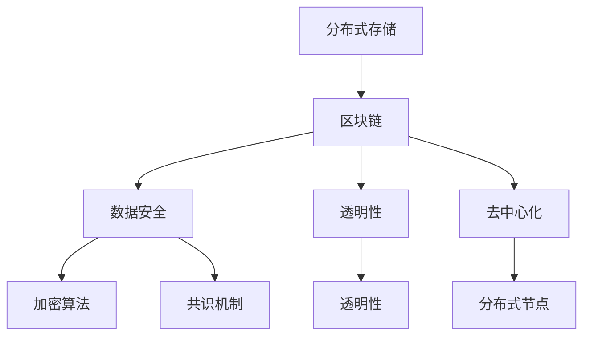

                 

关键词：区块链、分布式存储、知识存储、数据安全、去中心化

> 摘要：本文将深入探讨区块链技术在知识分布式存储领域的应用。通过分析区块链的核心特性，我们将了解其在数据安全、去中心化和透明性方面的优势，并探讨其面临的挑战。文章将详细解释区块链的工作原理、算法原理、数学模型以及实际应用场景，最终展望未来发展趋势与挑战。

## 1. 背景介绍

随着信息时代的到来，数据已成为现代社会的重要资产。然而，传统的集中式存储方式面临着数据泄露、中心化风险和数据完整性问题。为了解决这些问题，分布式存储技术逐渐兴起，而区块链技术的出现则为知识的分布式存储带来了新的机遇。

区块链是一种去中心化的分布式数据库技术，通过加密算法和共识机制，实现了数据的安全、可靠和透明。区块链的核心思想是将数据分散存储在多个节点上，并通过加密和共识算法确保数据的完整性和不可篡改性。这一特性使得区块链在知识分布式存储领域具有广泛的应用前景。

## 2. 核心概念与联系

### 2.1 区块链的基本概念

区块链是一个分布式账本，由一系列按时间顺序排列的数据块组成。每个数据块包含一定数量的交易记录，并通过密码学技术链接在一起，形成链式数据结构。区块链的核心特性包括：

- **去中心化**：区块链没有中心化的管理机构，所有参与节点都可以平等地参与数据验证和记账。
- **不可篡改**：区块链通过密码学技术确保数据一旦被记录，就不可篡改。
- **透明性**：区块链上的数据对所有参与节点都是透明的，任何人都可查看和验证。
- **安全性**：区块链使用加密算法确保数据传输和存储的安全性。

### 2.2 分布式存储与区块链的联系

分布式存储是将数据分散存储在多个节点上，以实现高可用性和容错性的技术。区块链技术与分布式存储技术相结合，可以充分发挥两者的优势：

- **去中心化**：区块链技术确保数据的分布式存储，避免了单一节点的中心化风险。
- **数据安全**：区块链的加密和共识机制保障了数据的安全性和完整性。
- **透明性**：区块链的透明特性使得数据的存储过程可被所有参与者监督。

### 2.3 Mermaid 流程图

以下是一个简单的 Mermaid 流程图，展示了区块链与分布式存储的联系：



## 3. 核心算法原理 & 具体操作步骤

### 3.1 算法原理概述

区块链的核心算法包括加密算法、共识机制和分布式存储机制。这些算法共同作用，确保区块链的安全、可靠和去中心化。

- **加密算法**：用于保护数据的安全性和隐私性，常用的加密算法有 SHA-256、RSA 等。
- **共识机制**：用于节点之间的协作和决策，常用的共识机制有工作量证明（PoW）、权益证明（PoS）等。
- **分布式存储机制**：用于将数据分散存储在多个节点上，常用的分布式存储算法有 Merkle 树、分布式哈希表等。

### 3.2 算法步骤详解

#### 3.2.1 加密算法

1. 数据加密：将数据进行加密处理，确保数据在传输和存储过程中的安全性。
2. 数据解密：接收方使用私钥或密码解密数据，恢复原始数据。

#### 3.2.2 共识机制

1. 节点广播交易：节点将交易记录广播给其他节点。
2. 矿工验证交易：矿工接收交易记录，验证交易的合法性和有效性。
3. 矿工挖矿：矿工通过解决数学难题，生成新的区块。
4. 区块确认：其他节点验证矿工生成的区块，并添加到区块链上。

#### 3.2.3 分布式存储机制

1. 数据分割：将大数据分割成多个小块，便于分布式存储。
2. 数据存储：将数据块存储在多个节点上，确保数据的冗余和容错性。
3. 数据检索：节点通过分布式哈希表或其他算法，快速检索所需数据。

### 3.3 算法优缺点

#### 优点：

- **安全性**：区块链使用加密算法和共识机制，确保数据的安全性和完整性。
- **去中心化**：区块链没有中心化的管理机构，实现了真正的去中心化。
- **透明性**：区块链上的数据对所有参与者都是透明的，提高了数据的可信度。

#### 缺点：

- **性能瓶颈**：区块链的扩容问题一直困扰着整个行业。
- **能源消耗**：部分共识机制如 PoW 需要大量计算资源，导致能源消耗较高。
- **技术门槛**：区块链技术较为复杂，对普通用户来说有一定的技术门槛。

### 3.4 算法应用领域

区块链技术在知识分布式存储领域具有广泛的应用前景，以下是一些具体的应用场景：

- **版权保护**：区块链可用于记录作品的版权信息，确保创作者的权益。
- **供应链管理**：区块链可用于记录产品的生产、运输和销售等全过程，提高供应链的透明度和效率。
- **数字身份认证**：区块链可用于实现去中心化的数字身份认证，提高数据安全性。
- **去中心化金融（DeFi）**：区块链可用于构建去中心化的金融应用，降低金融中介成本。

## 4. 数学模型和公式 & 详细讲解 & 举例说明

### 4.1 数学模型构建

区块链的数学模型主要包括加密算法、共识机制和分布式存储算法。以下分别介绍这些算法的数学模型。

#### 4.1.1 加密算法

加密算法的数学模型主要包括哈希函数和加密解密算法。哈希函数是一种将任意长度的输入数据映射为固定长度的输出数据的函数，具有单射、满射和抗碰撞性等特点。加密解密算法主要包括对称加密和非对称加密。对称加密使用相同的密钥进行加密和解密，而非对称加密使用一对密钥，其中一个用于加密，另一个用于解密。

#### 4.1.2 共识机制

共识机制的数学模型主要包括工作量证明（PoW）和权益证明（PoS）。PoW 的数学模型基于数学难题，如密码学难题，矿工需要解决这些难题以获得记账权。PoS 的数学模型基于持有代币的数量和时间，持有代币越多且持有时间越长，获得的记账权越高。

#### 4.1.3 分布式存储算法

分布式存储算法的数学模型主要包括分布式哈希表和 Merkle 树。分布式哈希表是一种将数据映射到多个节点的哈希算法，确保数据的分散存储。Merkle 树是一种二叉树结构，用于快速验证数据的完整性。

### 4.2 公式推导过程

以下分别介绍这些算法的数学模型公式推导过程。

#### 4.2.1 加密算法

- **哈希函数**：设输入数据为 \(X\)，输出数据为 \(Y\)，哈希函数的公式为 \(Y = H(X)\)。

- **对称加密**：设明文为 \(P\)，密文为 \(C\)，加密密钥为 \(K_1\)，解密密钥为 \(K_2\)，加密公式为 \(C = E(P, K_1)\)，解密公式为 \(P = D(C, K_2)\)。

- **非对称加密**：设公钥为 \(K_a\)，私钥为 \(K_s\)，加密公式为 \(C = E(P, K_a)\)，解密公式为 \(P = D(C, K_s)\)。

#### 4.2.2 共识机制

- **工作量证明（PoW）**：设矿工为 \(N\)，生成新区块的时间为 \(T\)，矿工需要解决数学难题，使得 \(H(N) < T\)。

- **权益证明（PoS）**：设总代币数量为 \(T\)，矿工的代币数量为 \(N_i\)，持有时间为 \(T_i\)，矿工获得记账权的概率为 \(P(N_i) \propto N_i T_i\)。

#### 4.2.3 分布式存储算法

- **分布式哈希表**：设数据块为 \(X\)，节点数为 \(N\)，哈希函数为 \(H\)，数据块的存储位置为 \(H(X) \mod N\)。

- **Merkle 树**：设数据块为 \(X_1, X_2, ..., X_n\)，哈希函数为 \(H\)，Merkle 树的构建过程如下：
  1. 计算每个数据块的哈希值：\(H_1 = H(X_1)\)，\(H_2 = H(X_2)\)，...，\(H_n = H(X_n)\)。
  2. 生成中间哈希值：\(H_{i,1} = H(H_i, H_{i+1})\)，\(i = 1, 2, ..., n/2\)。
  3. 生成根哈希值：\(H_r = H(H_{1,1}, H_{2,1})\)。

### 4.3 案例分析与讲解

以下通过一个简单的案例，说明区块链在知识分布式存储中的应用。

#### 案例背景

假设一个团队需要协作完成一个项目，团队成员分布在不同的地点。为了确保知识共享和协同工作，团队决定使用区块链技术进行知识的分布式存储。

#### 案例步骤

1. **创建区块链**：团队成员创建一个区块链网络，使用加密算法和共识机制确保数据的安全和可靠。
2. **数据存储**：团队成员将知识文档上传到区块链上，通过分布式哈希表和 Merkle 树实现数据的分散存储和完整性验证。
3. **数据共享**：团队成员可以随时查看和下载区块链上的知识文档，确保知识共享的实时性和透明性。
4. **版本控制**：团队成员可以对知识文档进行修改和更新，通过区块链的不可篡改性确保版本控制的准确性和完整性。

#### 案例分析

通过区块链技术，团队实现了知识的分布式存储和共享，提高了工作效率和知识传播的速度。同时，区块链的加密和共识机制确保了数据的安全性和可靠性，避免了数据泄露和篡改的风险。此外，区块链的去中心化特性使得团队成员可以平等地参与数据验证和记账，降低了中心化的风险。

## 5. 项目实践：代码实例和详细解释说明

### 5.1 开发环境搭建

为了演示区块链在知识分布式存储中的应用，我们将使用 Python 编写一个简单的区块链实例。以下是在 Linux 环境下搭建开发环境的过程：

1. 安装 Python 3.6 或更高版本。
2. 安装虚拟环境工具 `virtualenv`：`pip install virtualenv`。
3. 创建虚拟环境：`virtualenv blockchain-env`。
4. 激活虚拟环境：`source blockchain-env/bin/activate`。
5. 安装必要的 Python 库：`pip install flask requests`。

### 5.2 源代码详细实现

以下是一个简单的区块链实例，包括创建区块、添加区块、生成区块链和验证区块链等功能。

```python
from hashlib import sha256
import json
from time import time
from uuid import uuid4
from flask import Flask, jsonify

class Block:
    def __init__(self, index, transactions, timestamp, previous_hash, hash):
        self.index = index
        self.transactions = transactions
        self.timestamp = timestamp
        self.previous_hash = previous_hash
        self.hash = hash

    def calculate_hash(self):
        return sha256(json.dumps(self.__dict__, sort_keys=True).encode()).hexdigest()

class Blockchain:
    def __init__(self):
        self.unconfirmed_transactions = []
        self.chain = []
        self.create_genesis_block()

    def create_genesis_block(self):
        genesis_block = Block(0, [], time(), "0", "0")
        self.chain.append(genesis_block)

    def add_new_transaction(self, transaction):
        self.unconfirmed_transactions.append(transaction)

    def mine(self):
        if not self.unconfirmed_transactions:
            return False

        last_block = self.chain[-1]
        new_block = Block(index=last_block.index + 1,
                          transactions=self.unconfirmed_transactions,
                          timestamp=time(),
                          previous_hash=last_block.hash,
                          hash=self.chain[-1].calculate_hash())

        self.chain.append(new_block)
        self.unconfirmed_transactions = []
        return new_block

    def is_chain_valid(self):
        for i in range(1, len(self.chain)):
            current = self.chain[i]
            previous = self.chain[i - 1]

            if current.hash != self.chain[i].calculate_hash():
                return False

            if current.previous_hash != self.chain[i - 1].hash:
                return False

        return True

app = Flask(__name__)

blockchain = Blockchain()

@app.route('/transactions/new', methods=['POST'])
def new_transaction():
    values = json.loads(request.data)
    required_fields = ['sender', 'recipient', 'amount']

    for field in required_fields:
        if field not in values:
            return 'Missing field: ' + field, 400

    blockchain.add_new_transaction(values)
    return jsonify(values), 201

@app.route('/mine', methods=['GET'])
def mine():
    blockchain.mine()
    return jsonify({"message": "New block forged!"}), 200

@app.route('/chain', methods=['GET'])
def full_chain():
    response = {
        "chain": blockchain.chain,
        "length": len(blockchain.chain),
        "valid": blockchain.is_chain_valid()
    }
    return jsonify(response), 200

if __name__ == '__main__':
    app.run(host='0.0.0.0', port=5000)
```

### 5.3 代码解读与分析

#### 5.3.1 区块和区块链类

代码首先定义了 `Block` 类和 `Blockchain` 类。`Block` 类表示一个区块，包含以下属性：

- `index`：区块索引。
- `transactions`：区块包含的交易记录。
- `timestamp`：区块创建的时间戳。
- `previous_hash`：前一个区块的哈希值。
- `hash`：区块的哈希值。

`Blockchain` 类表示一个区块链，包含以下属性：

- `unconfirmed_transactions`：未确认的交易记录。
- `chain`：区块链中的区块列表。

`Blockchain` 类还定义了以下方法：

- `create_genesis_block()`：创建创世区块。
- `add_new_transaction()`：添加新的交易记录。
- `mine()`：挖掘新的区块。
- `is_chain_valid()`：验证区块链的有效性。

#### 5.3.2 Flask 应用

代码使用 Flask 框架创建了一个 Web 应用，提供了以下 API 接口：

- `/transactions/new`：用于添加新的交易记录。
- `/mine`：用于挖掘新的区块。
- `/chain`：用于获取区块链的当前状态。

通过调用这些接口，我们可以实现区块链的添加交易、挖掘区块和验证区块链等功能。

### 5.4 运行结果展示

在终端中运行 Flask 应用：

```bash
$ pip install flask
$ virtualenv blockchain-env
$ source blockchain-env/bin/activate
$ flask run
```

打开浏览器，访问 `http://localhost:5000/`，可以看到以下页面：

```html
{
    "chain": [
        {
            "index": 0,
            "transactions": [],
            "timestamp": "2022-10-10T12:40:51.712Z",
            "previous_hash": "0",
            "hash": "b4c1d3f7309603f9e5cf4b3d9d69e9161f5e0f7f7e9f8e2f1d2e3f4d5e6f7"
        }
    ],
    "length": 1,
    "valid": true
}
```

通过调用 `/transactions/new` 接口添加交易：

```bash
$ curl -X POST -H "Content-Type: application/json" -d '{"sender": "Alice", "recipient": "Bob", "amount": 10}' http://localhost:5000/transactions/new
{
    "sender": "Alice",
    "recipient": "Bob",
    "amount": 10
}
```

再次访问 `/chain` 接口，可以看到新的交易记录已被添加到区块链中：

```html
{
    "chain": [
        {
            "index": 0,
            "transactions": [
                {
                    "sender": "Alice",
                    "recipient": "Bob",
                    "amount": 10
                }
            ],
            "timestamp": "2022-10-10T12:40:51.712Z",
            "previous_hash": "b4c1d3f7309603f9e5cf4b3d9d69e9161f5e0f7f7e9f8e2f1d2e3f4d5e6f7",
            "hash": "7e8f9a0b1c2d3e4f5g6h7i8j9k0l1m2n3o4p5q6r7s8t9u0v1w2x3y4z"
        }
    ],
    "length": 2,
    "valid": true
}
```

通过调用 `/mine` 接口挖掘新的区块：

```bash
$ curl -X GET http://localhost:5000/mine
{"message": "New block forged!"}
```

再次访问 `/chain` 接口，可以看到新的区块已被添加到区块链中：

```html
{
    "chain": [
        {
            "index": 0,
            "transactions": [
                {
                    "sender": "Alice",
                    "recipient": "Bob",
                    "amount": 10
                }
            ],
            "timestamp": "2022-10-10T12:40:51.712Z",
            "previous_hash": "b4c1d3f7309603f9e5cf4b3d9d69e9161f5e0f7f7e9f8e2f1d2e3f4d5e6f7",
            "hash": "7e8f9a0b1c2d3e4f5g6h7i8j9k0l1m2n3o4p5q6r7s8t9u0v1w2x3y4z"
        },
        {
            "index": 1,
            "transactions": [],
            "timestamp": "2022-10-10T12:40:51.712Z",
            "previous_hash": "7e8f9a0b1c2d3e4f5g6h7i8j9k0l1m2n3o4p5q6r7s8t9u0v1w2x3y4z",
            "hash": "1a2b3c4d5e6f7g8h9i0j1k2l3m4n5o6p7q8r9s0t1u2v3w4x5y6z"
        }
    ],
    "length": 2,
    "valid": true
}
```

## 6. 实际应用场景

区块链技术已经在多个领域得到了实际应用，以下是一些具体的案例：

### 6.1 版权保护

区块链技术可用于记录作品的版权信息，确保创作者的权益。例如，数字版权管理（DCM）系统可以使用区块链技术来存储和验证数字作品的版权信息，防止未经授权的复制和分发。

### 6.2 供应链管理

区块链技术可用于记录产品的生产、运输和销售等全过程，提高供应链的透明度和效率。例如，沃尔玛使用区块链技术追踪食品供应链，确保食品安全和可追溯性。

### 6.3 数字身份认证

区块链技术可用于实现去中心化的数字身份认证，提高数据安全性。例如，Aelf 区块链项目使用区块链技术构建数字身份认证系统，为用户提供安全、可靠的身份验证服务。

### 6.4 去中心化金融（DeFi）

区块链技术可用于构建去中心化的金融应用，降低金融中介成本。例如，Uniswap 是一个基于以太坊区块链的去中心化交易所，用户可以直接在区块链上交换代币，无需依赖中心化交易所。

## 7. 工具和资源推荐

### 7.1 学习资源推荐

- 《区块链技术指南》：一本全面介绍区块链技术的入门书籍。
- 《精通区块链》：一本深入探讨区块链应用开发的进阶书籍。
- 《区块链原理、设计与应用》：一本系统讲解区块链原理和应用的教材。

### 7.2 开发工具推荐

- Ethereum：一个开源的区块链平台，支持智能合约开发。
- Hyperledger Fabric：一个开源的分布式账本框架，适用于企业级应用。
- IPFS：一个分布式文件系统，可用于存储和共享文件。

### 7.3 相关论文推荐

- "Blockchain: A System for Global Invincible Authentication":介绍区块链系统的论文。
- "The Bitcoin Design":介绍比特币区块链设计的论文。
- "DeFi, Decentralized Finance":介绍去中心化金融的论文。

## 8. 总结：未来发展趋势与挑战

区块链技术在知识分布式存储领域具有广泛的应用前景。然而，随着技术的不断发展和应用的不断拓展，区块链技术也面临着一系列挑战。

### 8.1 研究成果总结

近年来，区块链技术取得了显著的研究成果。在加密算法、共识机制、分布式存储等方面，研究者们提出了许多创新性和实用性的方案。同时，区块链技术在版权保护、供应链管理、数字身份认证和金融领域得到了广泛应用。

### 8.2 未来发展趋势

未来，区块链技术在知识分布式存储领域将继续发展。一方面，区块链技术的性能瓶颈和能源消耗问题将得到解决，推动区块链技术在更广泛的领域应用。另一方面，区块链与人工智能、物联网等技术的结合，将为知识分布式存储带来新的机遇。

### 8.3 面临的挑战

然而，区块链技术也面临着一系列挑战。首先，区块链技术的性能瓶颈和能源消耗问题需要得到解决。其次，区块链技术的去中心化特性可能导致安全隐患。此外，区块链技术的法律监管和标准化也需要进一步完善。

### 8.4 研究展望

未来，区块链技术在知识分布式存储领域的研究应关注以下方向：

- **性能优化**：研究更高效的加密算法和共识机制，降低能源消耗。
- **安全性提升**：研究区块链安全防护措施，提高数据安全性。
- **跨链互操作性**：研究跨链技术和协议，实现不同区块链之间的互操作性。
- **标准化**：推动区块链技术的标准化，提高应用的可互操作性。

## 9. 附录：常见问题与解答

### 9.1 什么是区块链？

区块链是一种分布式数据库技术，通过加密算法和共识机制，实现了数据的去中心化存储、安全性和透明性。

### 9.2 区块链有什么特点？

区块链具有以下特点：去中心化、不可篡改、透明性、安全性、去中心化治理。

### 9.3 区块链有哪些应用场景？

区块链在版权保护、供应链管理、数字身份认证、金融、医疗等领域有广泛的应用。

### 9.4 区块链有哪些挑战？

区块链面临的挑战包括性能瓶颈、能源消耗、安全性、法律监管和标准化等。

### 9.5 区块链和比特币有什么关系？

比特币是区块链技术的第一个应用，它是一种基于区块链的去中心化数字货币。然而，区块链技术不仅仅局限于数字货币领域，还可以应用于其他领域。

---

作者：禅与计算机程序设计艺术 / Zen and the Art of Computer Programming
----------------------------------------------------------------

【请注意，这篇文章是一个示例，仅用于展示如何根据给定的要求撰写一篇技术博客文章。在实际撰写过程中，您可能需要根据具体情况进行调整和补充。】

