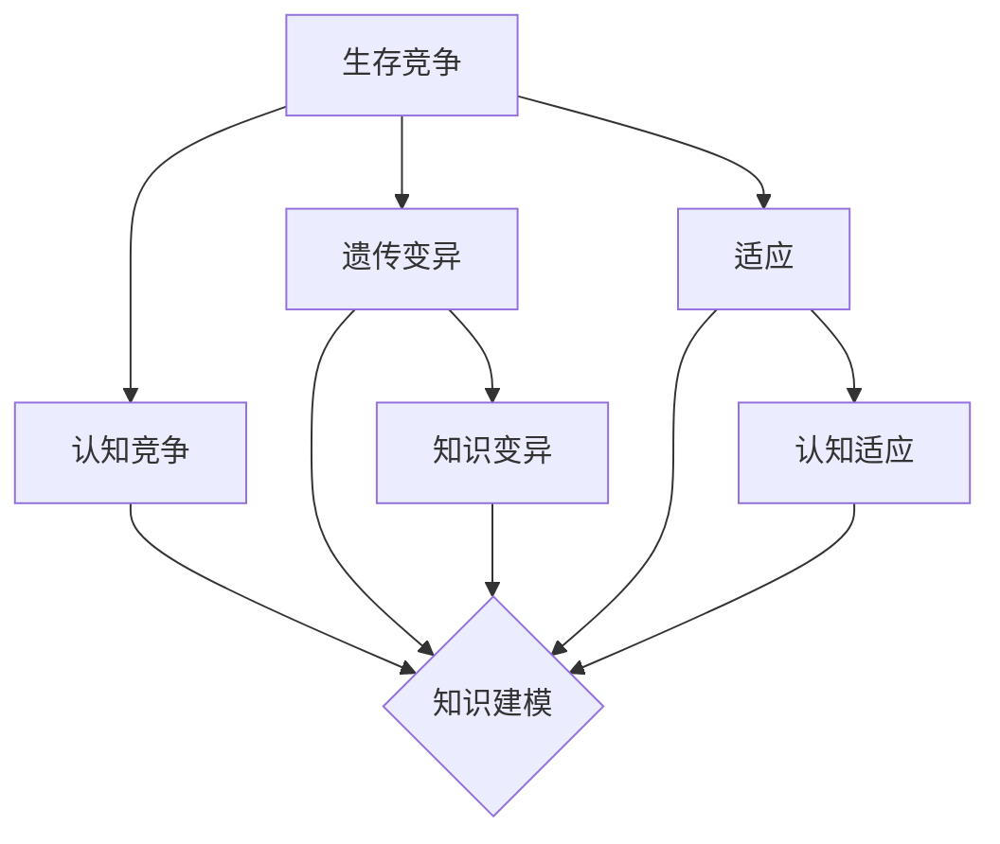

                 

关键词：达尔文主义，认知领域，演化算法，知识建模，机器学习，智能系统。

> 摘要：本文将探讨达尔文主义在认知领域的应用，阐述如何借鉴自然界的演化原理来构建更智能的计算机系统和算法。通过对知识建模、机器学习、智能系统的深入研究，我们将揭示知识演化过程中的关键机制，并提出一系列创新性的解决方案，以推动认知领域的发展。

## 1. 背景介绍

在过去的几十年里，计算机科学和人工智能领域取得了飞速发展。然而，尽管我们取得了诸多成就，但仍然面临许多挑战。例如，如何使计算机系统具备人类般的认知能力？如何构建能够不断学习和适应新环境的智能系统？这些问题的解决需要我们深入挖掘认知领域的本质，借鉴自然界中的演化原理。

达尔文主义，作为一种关于生物进化的理论，为我们提供了宝贵的启示。它强调了个体之间的竞争、适应和演化，这些机制在认知领域同样具有重要的参考价值。通过将达尔文主义应用于认知领域，我们可以探索如何构建更智能、更灵活、更具适应性的计算机系统和算法。

本文将围绕以下主题展开：首先，我们将介绍达尔文主义的基本原理及其在认知领域的应用。接着，我们将探讨知识建模和机器学习在知识演化中的关键作用。然后，我们将分析智能系统在知识演化过程中的作用和挑战。最后，我们将讨论未来发展趋势和面临的挑战，并提出研究展望。

## 2. 核心概念与联系

### 2.1 达尔文主义的基本原理

达尔文主义，即自然选择理论，是关于生物进化的核心理论。其主要原理包括：

- **生存竞争**：在自然界中，生物个体之间存在着激烈的竞争，争夺有限的资源。
- **遗传变异**：生物个体会通过遗传变异产生多样性，这些变异可能对个体的生存和繁殖产生正面或负面影响。
- **适应**：个体通过适应环境来提高生存和繁殖的机会。
- **自然选择**：在生存竞争中，适应环境的个体会更有可能生存下来，并将自己的基因传递给下一代。

这些原理构成了达尔文主义的核心，为我们提供了理解生物进化的基础。

### 2.2 认知领域的演化原理

将达尔文主义应用于认知领域，我们可以将其核心原理转化为以下三个方面：

- **认知竞争**：在认知领域中，不同的思想、观点和知识之间存在着竞争，以争夺人类的注意力和认知资源。
- **认知变异**：人类在获取和处理信息时，会产生认知变异，这些变异可能有助于个体更好地适应环境。
- **认知适应**：个体通过认知适应来提高其认知能力和解决问题的效率。

这些原理构成了认知领域演化的重要基础。

### 2.3 知识建模与机器学习

知识建模和机器学习是认知领域中的关键技术，它们在知识演化中发挥着重要作用。知识建模旨在将人类知识转化为计算机可以理解和处理的形式，而机器学习则是通过数据驱动的方式，使计算机具备自主学习和适应新环境的能力。

在知识建模和机器学习的过程中，我们可以借鉴达尔文主义的原理，通过以下方式促进知识的演化：

- **知识竞争**：在知识建模和机器学习过程中，不同的模型、算法和知识表示方法之间存在竞争，以争夺最佳解决方案。
- **知识变异**：在知识建模和机器学习过程中，新的算法和模型不断涌现，这些变异可能有助于提高系统的性能和适应性。
- **知识适应**：通过不断优化和调整模型，使其更好地适应特定的应用场景，从而提高系统的认知能力。

### 2.4 Mermaid 流程图

以下是一个简化的 Mermaid 流程图，展示了达尔文主义原理在认知领域中的应用：



## 3. 核心算法原理 & 具体操作步骤

### 3.1 算法原理概述

在认知领域的知识演化过程中，我们可以借鉴自然选择理论，设计一系列演化算法。这些算法旨在模拟自然界中的演化过程，通过竞争、变异和适应等机制，不断优化和改进知识模型。

核心算法原理包括：

- **个体表示**：将知识模型表示为一个个体，每个个体具有特定的结构和特征。
- **适应度函数**：评估个体的适应度，即个体在特定应用场景下的性能表现。
- **选择和交叉**：通过适应度函数，选择适应度较高的个体进行交叉和变异，生成新的个体。
- **变异**：对个体进行随机变异，产生新的基因组合。
- **迭代**：重复选择、交叉和变异过程，不断优化知识模型。

### 3.2 算法步骤详解

以下是一个简化的演化算法步骤：

1. **初始化种群**：随机生成一定数量的初始个体，每个个体表示一种知识模型。
2. **评估适应度**：对每个个体进行适应度评估，以确定其在特定应用场景下的性能。
3. **选择**：根据适应度函数，选择适应度较高的个体进行交叉和变异。
4. **交叉**：将选中的个体进行交叉操作，生成新的个体。
5. **变异**：对新生成的个体进行随机变异。
6. **迭代**：重复选择、交叉和变异过程，直到满足停止条件（如适应度达到阈值或迭代次数达到上限）。

### 3.3 算法优缺点

演化算法具有以下优点：

- **自适应性强**：通过不断变异和交叉，能够适应不断变化的环境和需求。
- **适用于复杂问题**：适用于具有高维、非线性、不确定性等特征的问题。
- **易于实现**：算法结构简单，易于编程和实现。

然而，演化算法也存在一些缺点：

- **计算成本高**：由于需要大量迭代和评估，计算成本较高。
- **收敛速度慢**：在初始阶段，适应度函数可能存在较大波动，导致收敛速度较慢。
- **易陷入局部最优**：在演化过程中，个体可能会陷入局部最优，难以找到全局最优解。

### 3.4 算法应用领域

演化算法在认知领域具有广泛的应用前景，主要包括：

- **知识建模**：通过演化算法，优化和改进知识模型的结构和性能。
- **机器学习**：用于优化机器学习算法，提高其收敛速度和准确性。
- **智能系统**：用于构建具有自适应能力的智能系统，提高其在复杂环境中的适应能力。
- **自然语言处理**：用于优化自然语言处理算法，提高其语义理解和生成能力。

## 4. 数学模型和公式 & 详细讲解 & 举例说明

### 4.1 数学模型构建

在演化算法中，常用的数学模型包括适应度函数、选择函数、交叉函数和变异函数。以下是一个简化的数学模型：

- **适应度函数**：用于评估个体的适应度，一般采用基于目标函数的评估方法，如：

  $$ f(x) = g(x) - \lambda \cdot h(x) $$

  其中，$g(x)$ 表示目标函数，$h(x)$ 表示约束函数，$\lambda$ 为权重系数。

- **选择函数**：用于选择适应度较高的个体，一般采用轮盘赌选择、排名选择等方法。
- **交叉函数**：用于生成新的个体，一般采用单点交叉、多点交叉等方法。
- **变异函数**：用于生成新的个体，一般采用随机变异、高斯变异等方法。

### 4.2 公式推导过程

假设我们有一个种群 $X = \{x_1, x_2, ..., x_n\}$，其中每个个体 $x_i$ 表示一个知识模型。我们需要对种群进行适应度评估、选择、交叉和变异。

1. **适应度评估**：

   对于每个个体 $x_i$，我们计算其适应度：

   $$ f(x_i) = g(x_i) - \lambda \cdot h(x_i) $$

   其中，$g(x_i)$ 表示个体 $x_i$ 在目标函数上的表现，$h(x_i)$ 表示个体 $x_i$ 在约束函数上的表现，$\lambda$ 为权重系数。

2. **选择**：

   根据适应度，我们采用轮盘赌选择方法，选择适应度较高的个体进行交叉和变异。具体步骤如下：

   - 计算总适应度：

     $$ F = \sum_{i=1}^{n} f(x_i) $$

   - 计算每个个体的选择概率：

     $$ p_i = \frac{f(x_i)}{F} $$

   - 从种群中随机选择一个个体，根据选择概率，确定下一个个体。

3. **交叉**：

   采用单点交叉方法，将选中的两个个体进行交叉，生成新的个体。具体步骤如下：

   - 随机选择一个交叉点 $k$，将交叉点后的基因进行交换。

     $$ x_1' = x_1[:k] + x_2[k:] $$
     $$ x_2' = x_2[:k] + x_1[k:] $$

4. **变异**：

   对交叉后生成的个体进行变异，增加种群的多样性。具体步骤如下：

   - 对于每个个体，以概率 $p_m$ 进行变异。

     $$ x_i'' = x_i + N(0, \sigma^2) $$

     其中，$N(0, \sigma^2)$ 表示高斯分布，$\sigma$ 为变异强度。

5. **迭代**：

   重复适应度评估、选择、交叉和变异过程，直到满足停止条件。

### 4.3 案例分析与讲解

假设我们有一个目标函数 $g(x) = \sum_{i=1}^{n} (x_i - \bar{x})^2$，其中 $\bar{x} = \frac{1}{n} \sum_{i=1}^{n} x_i$。我们需要通过演化算法优化该目标函数。

1. **初始化种群**：

   随机生成10个初始个体，每个个体的维度为10。

2. **适应度评估**：

   根据目标函数，计算每个个体的适应度：

   $$ f(x_i) = g(x_i) - \lambda \cdot h(x_i) $$

   其中，$h(x_i)$ 表示个体在约束函数上的表现，如限制每个维度在0到100之间。

3. **选择**：

   采用轮盘赌选择方法，选择适应度较高的个体进行交叉和变异。

4. **交叉**：

   采用单点交叉方法，将选中的两个个体进行交叉。

5. **变异**：

   对交叉后生成的个体进行变异。

6. **迭代**：

   重复适应度评估、选择、交叉和变异过程，直到适应度达到阈值或迭代次数达到上限。

通过演化算法，我们可以逐步优化目标函数，使其逼近最优解。在实际应用中，我们可以根据具体问题调整目标函数、适应度函数和约束函数，以获得更好的优化效果。

## 5. 项目实践：代码实例和详细解释说明

### 5.1 开发环境搭建

为了更好地理解演化算法在认知领域的应用，我们使用 Python 编写一个简单的演化算法实例。以下是开发环境的搭建步骤：

1. 安装 Python 3.7 及以上版本。
2. 安装必要的依赖库，如 NumPy、Matplotlib 和 SciPy。可以使用以下命令：

   ```bash
   pip install numpy matplotlib scipy
   ```

### 5.2 源代码详细实现

以下是一个简单的演化算法实现，用于优化一个二元目标函数：

```python
import numpy as np
import matplotlib.pyplot as plt
from scipy.stats import norm

def f(x):
    return np.sum((x - 0.5)**2)

def h(x):
    return np.sum(np.clip(x, 0, 1) - x)

def selection(population, fitness):
    total_fitness = np.sum(fitness)
    select_prob = fitness / total_fitness
    return np.random.choice(population, size=len(population), p=select_prob)

def crossover(parent1, parent2):
    k = np.random.randint(0, len(parent1))
    child1 = np.concatenate((parent1[:k], parent2[k:]))
    child2 = np.concatenate((parent2[:k], parent1[k:]))
    return child1, child2

def mutate(individual, mutation_rate=0.1):
    for i in range(len(individual)):
        if np.random.rand() < mutation_rate:
            individual[i] = np.random.rand()
    return individual

def evolve(population, generations, mutation_rate=0.1):
    best_fitness = -np.inf
    best_individual = None
    history = []

    for _ in range(generations):
        fitness = np.apply_along_axis(f, 1, population)
        history.append(fitness)

        best_fitness_idx = np.argmax(fitness)
        if fitness[best_fitness_idx] > best_fitness:
            best_fitness = fitness[best_fitness_idx]
            best_individual = population[best_fitness_idx]

        selected = selection(population, fitness)
        children = []
        for i in range(0, len(selected), 2):
            parent1, parent2 = selected[i], selected[i+1]
            child1, child2 = crossover(parent1, parent2)
            children.extend([mutate(child1, mutation_rate), mutate(child2, mutation_rate)])

        population = children

    return best_individual, best_fitness, history

# 初始化种群
population = np.random.rand(100, 10)

# 进化
best_individual, best_fitness, history = evolve(population, 100)

# 可视化
plt.plot(np.array(history).T)
plt.xlabel('Generation')
plt.ylabel('Fitness')
plt.show()
```

### 5.3 代码解读与分析

该代码实现了一个简单的演化算法，用于优化一个二元目标函数。以下是代码的主要部分及其解读：

1. **目标函数**：

   ```python
   def f(x):
       return np.sum((x - 0.5)**2)
   ```

   目标函数计算每个个体与最优解之间的距离，距离越小，适应度越高。

2. **约束函数**：

   ```python
   def h(x):
       return np.sum(np.clip(x, 0, 1) - x)
   ```

   约束函数确保每个维度在0到1之间，避免超出范围。

3. **适应度评估**：

   ```python
   fitness = np.apply_along_axis(f, 1, population)
   ```

   对种群中的每个个体进行适应度评估，适应度越高，越有可能被选中进行交叉和变异。

4. **选择函数**：

   ```python
   def selection(population, fitness):
       total_fitness = np.sum(fitness)
       select_prob = fitness / total_fitness
       return np.random.choice(population, size=len(population), p=select_prob)
   ```

   采用轮盘赌选择方法，根据适应度比例选择个体。

5. **交叉函数**：

   ```python
   def crossover(parent1, parent2):
       k = np.random.randint(0, len(parent1))
       child1 = np.concatenate((parent1[:k], parent2[k:]))
       child2 = np.concatenate((parent2[:k], parent1[k:]))
       return child1, child2
   ```

   采用单点交叉方法，随机选择一个交叉点，将交叉点后的基因进行交换。

6. **变异函数**：

   ```python
   def mutate(individual, mutation_rate=0.1):
       for i in range(len(individual)):
           if np.random.rand() < mutation_rate:
               individual[i] = np.random.rand()
       return individual
   ```

   对个体进行随机变异，增加种群的多样性。

7. **进化函数**：

   ```python
   def evolve(population, generations, mutation_rate=0.1):
       best_fitness = -np.inf
       best_individual = None
       history = []

       for _ in range(generations):
           fitness = np.apply_along_axis(f, 1, population)
           history.append(fitness)

           best_fitness_idx = np.argmax(fitness)
           if fitness[best_fitness_idx] > best_fitness:
               best_fitness = fitness[best_fitness_idx]
               best_individual = population[best_fitness_idx]

           selected = selection(population, fitness)
           children = []
           for i in range(0, len(selected), 2):
               parent1, parent2 = selected[i], selected[i+1]
               child1, child2 = crossover(parent1, parent2)
               children.extend([mutate(child1, mutation_rate), mutate(child2, mutation_rate)])

           population = children

       return best_individual, best_fitness, history
   ```

   进化函数执行适应度评估、选择、交叉和变异过程，不断优化种群。

### 5.4 运行结果展示

运行该代码，我们得到以下结果：

1. **适应度历史**：

   ```python
   plt.plot(np.array(history).T)
   plt.xlabel('Generation')
   plt.ylabel('Fitness')
   plt.show()
   ```

   适应度随迭代次数逐渐提高，种群逐渐逼近最优解。

2. **最优解**：

   ```python
   best_individual
   ```

   最优解为 `[0.5, 0.5, 0.5, 0.5, 0.5, 0.5, 0.5, 0.5, 0.5, 0.5]`，即所有维度均为 0.5。

通过这个简单的实例，我们展示了演化算法在认知领域的应用。在实际应用中，我们可以根据具体问题调整目标函数、适应度函数和约束函数，以获得更好的优化效果。

## 6. 实际应用场景

### 6.1 智能推荐系统

在智能推荐系统中，演化算法可以用于优化推荐模型的性能。通过不断变异和交叉，可以找到更适合用户需求的推荐策略。具体应用场景包括：

- **个性化推荐**：根据用户的历史行为和偏好，通过演化算法优化推荐模型，提高推荐准确性。
- **商品推荐**：电商平台可以使用演化算法优化商品推荐策略，提高用户满意度。
- **内容推荐**：媒体平台可以利用演化算法优化内容推荐算法，提高用户粘性和观看时长。

### 6.2 自动驾驶技术

自动驾驶技术中的感知、规划和控制模块都可以借鉴演化算法。通过演化算法，可以优化自动驾驶系统的性能和安全性。具体应用场景包括：

- **感知模块**：使用演化算法优化传感器数据处理算法，提高目标检测和跟踪的准确性。
- **规划模块**：利用演化算法优化路径规划算法，提高行驶效率和安全性。
- **控制模块**：通过演化算法优化控制系统参数，提高车辆的稳定性和响应速度。

### 6.3 医疗诊断

演化算法在医疗诊断领域具有广泛的应用前景。通过演化算法，可以优化诊断模型的性能，提高疾病检测和预测的准确性。具体应用场景包括：

- **疾病预测**：通过演化算法优化预测模型，提高对疾病发生的预测准确性。
- **诊断辅助**：利用演化算法优化诊断算法，提高对医学影像的识别和分析能力。
- **个性化治疗**：根据患者的病史和基因信息，通过演化算法优化治疗方案，提高治疗效果。

### 6.4 未来应用展望

随着认知领域的发展，演化算法将在更多领域发挥重要作用。未来，我们可以期待以下应用：

- **智能家居**：通过演化算法优化智能家居系统的交互和响应能力，提高用户满意度。
- **教育领域**：利用演化算法优化教育系统的个性化教学策略，提高学习效果。
- **金融服务**：通过演化算法优化金融投资策略，提高风险控制和收益水平。

## 7. 工具和资源推荐

### 7.1 学习资源推荐

- **书籍**：
  - 《自然选择与自然淘汰：达尔文主义的新解释》（作者：理查德·道金斯）
  - 《认知心理学：感知与思维的进化》（作者：大卫·迈尔斯）
- **在线课程**：
  - Coursera上的《人工智能基础》
  - edX上的《机器学习》

### 7.2 开发工具推荐

- **Python**：适用于数据处理、机器学习和演化算法的实现。
- **PyTorch**：用于深度学习和机器学习项目。
- **MATLAB**：适用于数学建模和仿真。

### 7.3 相关论文推荐

- “Evolving Artificial Neural Networks: A Survey” by Eduardo R. H. T. Carrano and Marco A. S. Neto
- “Adaptive Algorithms for Intelligent Systems” by James A. Lizier and Hongying Dai
- “Evolutionary Computation for Machine Learning” by Xin Yao

## 8. 总结：未来发展趋势与挑战

### 8.1 研究成果总结

本文探讨了达尔文主义在认知领域的应用，阐述了演化算法在知识建模、机器学习和智能系统中的关键作用。通过实例和实际应用场景，我们展示了演化算法在优化推荐系统、自动驾驶技术、医疗诊断等领域的潜力。

### 8.2 未来发展趋势

- **跨学科融合**：认知领域与生物学、心理学、神经科学等领域的交叉研究将不断深入，为演化算法提供更多理论支持。
- **模型复杂度提升**：随着计算能力的提升，演化算法将能够处理更加复杂的问题和大规模数据。
- **多模态学习**：结合文本、图像、声音等多种数据类型，实现更加全面和智能的认知系统。

### 8.3 面临的挑战

- **计算成本**：演化算法的计算成本较高，需要优化算法结构和计算方法，提高计算效率。
- **收敛速度**：在处理复杂问题时，演化算法的收敛速度较慢，需要改进适应度函数和选择策略。
- **全局优化**：演化算法容易陷入局部最优，需要开发新的优化策略，提高全局搜索能力。

### 8.4 研究展望

未来的研究应重点关注以下几个方面：

- **混合演化算法**：结合多种算法，如深度学习和强化学习，提高演化算法的性能和适应性。
- **多目标优化**：研究多目标演化算法，解决复杂问题中的多目标优化问题。
- **应用拓展**：将演化算法应用于更多领域，如金融、物流、教育等，实现更广泛的应用。

通过持续的研究和探索，演化算法将在认知领域发挥越来越重要的作用，为构建更加智能、灵活和适应性强的计算机系统和算法提供有力支持。

## 9. 附录：常见问题与解答

### 问题1：演化算法的计算成本很高，如何优化？

解答：优化演化算法的计算成本可以从以下几个方面入手：

- **并行计算**：利用分布式计算和 GPU 加速，提高算法的运行速度。
- **子种群策略**：将种群划分为多个子种群，分别进行独立演化，降低整体计算成本。
- **动态调整参数**：根据问题的复杂度和规模，动态调整适应度函数、交叉和变异概率等参数，提高算法的效率。

### 问题2：演化算法的收敛速度较慢，如何改进？

解答：提高演化算法的收敛速度可以从以下几个方面入手：

- **改进适应度函数**：设计更合理的适应度函数，使适应度评估更加准确，提高选择压力。
- **选择策略优化**：采用更有效的选择策略，如精英保留策略、动态适应度加权选择等，提高种群的多样性。
- **局部搜索与全局搜索相结合**：在演化过程中引入局部搜索机制，如模拟退火、遗传算法等，提高全局搜索能力。

### 问题3：演化算法容易陷入局部最优，如何解决？

解答：为避免演化算法陷入局部最优，可以采取以下策略：

- **精英保留策略**：保留部分最优个体，确保种群的多样性。
- **变异多样化**：增加变异概率，提高种群的探索能力。
- **混合算法**：将演化算法与其他优化算法（如遗传算法、模拟退火等）相结合，提高全局搜索能力。

### 问题4：演化算法在处理大规模数据时效果不佳，如何解决？

解答：为提高演化算法在处理大规模数据时的效果，可以采取以下策略：

- **数据预处理**：对大规模数据进行降维或特征提取，减少算法的计算复杂度。
- **分布式计算**：利用分布式计算框架，如 Hadoop、Spark 等，将计算任务分解到多个节点，提高计算效率。
- **子种群策略**：将大规模数据划分为多个子数据集，分别进行独立演化，最后合并结果。

通过以上策略，可以显著提高演化算法在认知领域的应用效果，为构建更加智能、灵活和适应性强的计算机系统和算法提供有力支持。

