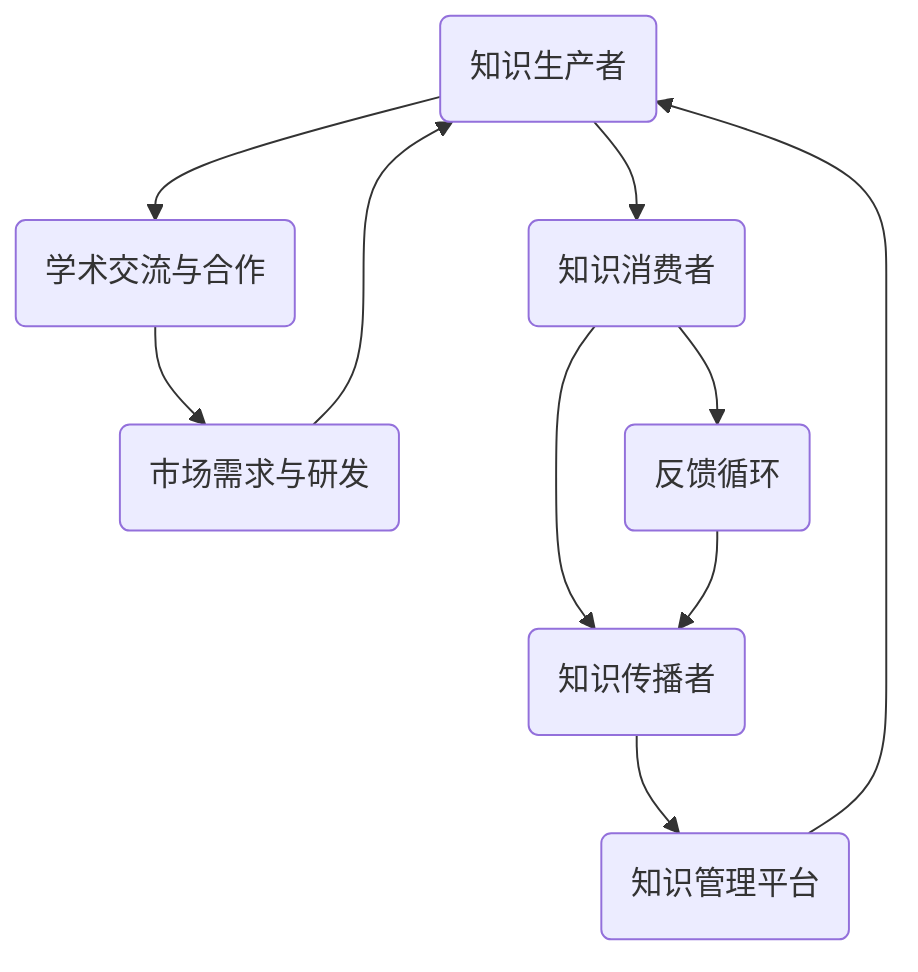

                 

 关键词：知识生态系统、信息流动、创新网络、智能算法、数学模型、项目实践、应用场景、未来展望

> 摘要：本文深入探讨知识的生态系统，从信息流动的角度分析创新网络的构建与演化。通过核心概念与算法原理的讲解，结合实际项目实践，阐述知识生态系统对科技发展的推动作用，并展望其未来的发展趋势与挑战。

## 1. 背景介绍

在当今数字化时代，信息技术的快速发展使得知识传播和共享变得前所未有的便捷。然而，如何在庞大的信息海洋中筛选和利用有价值的信息，构建一个高效的知识生态系统，成为亟待解决的问题。知识生态系统不仅是信息流动的载体，更是创新网络的基石。通过有效的信息流动，知识得以传递、融合和创新，从而推动科技和社会的进步。

本文将围绕知识生态系统的核心概念和算法原理，结合实际项目实践，探讨信息流动与创新网络的关系。我们将首先介绍知识生态系统的定义和基本结构，然后深入探讨信息流动的机制和算法，最后通过具体案例展示其在实际应用中的效果和影响。

## 2. 核心概念与联系

### 2.1 知识生态系统的定义

知识生态系统是指一个由知识生产者、知识消费者、知识传播者等组成的社会网络，其中知识作为一种关键资源在各个节点之间流动和交互。知识生态系统不仅包括知识的产生、传播和应用，还涵盖了知识的管理、共享和创新。

### 2.2 信息流动的机制

在知识生态系统中，信息流动是知识传播和共享的关键机制。信息流动包括以下三个方面：

1. **垂直流动**：从知识生产者到知识消费者的流动，如科研成果的发表和传播。
2. **水平流动**：在同一层级的知识节点之间的流动，如学术交流与合作。
3. **反馈循环**：知识消费者对知识生产者的反馈，如市场需求对研发方向的引导。

### 2.3 创新网络的构建

创新网络是由知识生态系统中的各个节点和关系构成的社会网络，用于支持知识的生产、传播和应用。创新网络的核心在于节点之间的交互和协作，通过信息流动实现知识的融合和创新。

### 2.4 Mermaid 流程图

以下是一个描述知识生态系统信息流动和创新的 Mermaid 流程图：



## 3. 核心算法原理 & 具体操作步骤

### 3.1 算法原理概述

知识生态系统中的信息流动和创新的算法原理主要包括以下几个方面：

1. **信息筛选与提取**：利用自然语言处理、数据挖掘等技术，从大量信息中筛选出有价值的内容。
2. **知识融合与关联**：通过图论、语义分析等技术，将不同来源的知识进行融合和关联，形成知识图谱。
3. **信息传播与推荐**：利用信息论和机器学习算法，实现信息的精准传播和个性化推荐。
4. **反馈优化**：基于用户反馈，不断优化信息传播和知识创新的过程。

### 3.2 算法步骤详解

1. **数据收集与预处理**：从各种渠道收集数据，包括学术论文、新闻、社交媒体等，并对数据进行清洗和预处理。
2. **信息筛选与提取**：使用自然语言处理技术，提取数据中的关键信息，如关键词、摘要等。
3. **知识融合与关联**：利用图论算法，将提取出的信息构建成知识图谱，实现知识的融合和关联。
4. **信息传播与推荐**：根据用户兴趣和行为，使用机器学习算法，实现信息的精准传播和推荐。
5. **反馈优化**：根据用户反馈，不断调整和优化信息传播和知识创新的过程。

### 3.3 算法优缺点

**优点**：

- **高效性**：通过算法，可以快速筛选和提取有价值的信息，提高知识传递的效率。
- **个性化**：根据用户兴趣和行为，实现个性化信息传播和推荐，提高用户满意度。
- **适应性**：算法可以根据用户反馈，不断优化和调整，提高信息传播和知识创新的准确性。

**缺点**：

- **数据质量**：算法的效果取决于数据质量，如果数据存在噪声或缺失，可能会影响算法的准确性。
- **计算成本**：大规模数据处理和机器学习算法的运算成本较高，需要强大的计算能力支持。

### 3.4 算法应用领域

知识生态系统中的信息流动和创新的算法原理可以应用于多个领域，如：

- **科学研究**：通过算法，可以快速获取和筛选科研文献，促进学术交流和合作。
- **企业运营**：通过算法，可以分析市场需求和用户行为，优化产品研发和营销策略。
- **社会管理**：通过算法，可以监控和预测社会动态，提高社会管理的科学性和有效性。

## 4. 数学模型和公式 & 详细讲解 & 举例说明

### 4.1 数学模型构建

知识生态系统中的信息流动和创新可以通过以下数学模型进行描述：

1. **信息传播模型**：假设一个知识生态系统中有 N 个节点，每个节点表示一个知识单元，节点 i 的信息传播速度为 vi。信息传播模型可以用以下公式表示：

   $$ 
   \sum_{j=1}^{N} w_{ij} \cdot v_{j} = v_{i} 
   $$

   其中，$w_{ij}$ 表示节点 i 和节点 j 之间的权重，$v_{i}$ 表示节点 i 的信息传播速度。

2. **知识创新模型**：假设一个知识生态系统中有 M 个知识单元，每个知识单元的创新程度为 xi。知识创新模型可以用以下公式表示：

   $$ 
   \sum_{i=1}^{M} x_{i} = X 
   $$

   其中，$X$ 表示整个知识生态系统的创新程度。

### 4.2 公式推导过程

1. **信息传播模型**的推导：

   假设一个知识生态系统中有 N 个节点，每个节点表示一个知识单元，节点 i 的信息传播速度为 vi。我们可以将整个知识生态系统的信息传播速度表示为：

   $$ 
   V = \sum_{i=1}^{N} v_{i} 
   $$

   由于每个节点的信息传播速度与它与其他节点的权重相关，因此可以表示为：

   $$ 
   v_{i} = \sum_{j=1}^{N} w_{ij} \cdot v_{j} 
   $$

   将上述公式代入 V 的表达式中，得到：

   $$ 
   V = \sum_{i=1}^{N} \sum_{j=1}^{N} w_{ij} \cdot v_{j} 
   $$

   由于权重矩阵是对称的，可以简化为：

   $$ 
   V = \sum_{i=1}^{N} v_{i} \cdot \sum_{j=1}^{N} w_{ij} 
   $$

   由于 $\sum_{i=1}^{N} v_{i} = V$，所以最终得到：

   $$ 
   \sum_{j=1}^{N} w_{ij} \cdot v_{j} = v_{i} 
   $$

2. **知识创新模型**的推导：

   假设一个知识生态系统中有 M 个知识单元，每个知识单元的创新程度为 xi。我们可以将整个知识生态系统的创新程度表示为：

   $$ 
   X = \sum_{i=1}^{M} x_{i} 
   $$

   由于每个知识单元的创新程度与它与其他知识单元的关联程度相关，因此可以表示为：

   $$ 
   x_{i} = \sum_{j=1}^{M} w_{ij} \cdot x_{j} 
   $$

   将上述公式代入 X 的表达式中，得到：

   $$ 
   X = \sum_{i=1}^{M} \sum_{j=1}^{M} w_{ij} \cdot x_{j} 
   $$

   由于权重矩阵是对称的，可以简化为：

   $$ 
   X = \sum_{i=1}^{M} x_{i} \cdot \sum_{j=1}^{M} w_{ij} 
   $$

   由于 $\sum_{i=1}^{M} x_{i} = X$，所以最终得到：

   $$ 
   \sum_{j=1}^{M} w_{ij} \cdot x_{j} = x_{i} 
   $$

### 4.3 案例分析与讲解

以下是一个关于知识生态系统信息流动和创新的案例：

假设一个知识生态系统中有 5 个知识单元，它们之间的关联程度（权重）如下表所示：

| 知识单元 | 知识单元 1 | 知识单元 2 | 知识单元 3 | 知识单元 4 | 知识单元 5 |
| -------- | ---------- | ---------- | ---------- | ---------- | ---------- |
| 知识单元 1 | 0.2        | 0.3        | 0.1        | 0.1        | 0.2        |
| 知识单元 2 | 0.3        | 0.2        | 0.2        | 0.1        | 0.2        |
| 知识单元 3 | 0.1        | 0.2        | 0.3        | 0.1        | 0.2        |
| 知识单元 4 | 0.1        | 0.1        | 0.1        | 0.3        | 0.2        |
| 知识单元 5 | 0.2        | 0.2        | 0.2        | 0.2        | 0.3        |

根据上述权重矩阵，我们可以计算出每个知识单元的信息传播速度和知识创新程度：

1. **信息传播速度**：

   $$ 
   v_{1} = 0.2 \cdot v_{2} + 0.3 \cdot v_{3} + 0.1 \cdot v_{4} + 0.2 \cdot v_{5} 
   $$

   $$ 
   v_{2} = 0.3 \cdot v_{1} + 0.2 \cdot v_{3} + 0.2 \cdot v_{4} + 0.2 \cdot v_{5} 
   $$

   $$ 
   v_{3} = 0.1 \cdot v_{1} + 0.2 \cdot v_{2} + 0.3 \cdot v_{3} + 0.1 \cdot v_{4} + 0.2 \cdot v_{5} 
   $$

   $$ 
   v_{4} = 0.1 \cdot v_{1} + 0.1 \cdot v_{2} + 0.1 \cdot v_{3} + 0.3 \cdot v_{4} + 0.2 \cdot v_{5} 
   $$

   $$ 
   v_{5} = 0.2 \cdot v_{1} + 0.2 \cdot v_{2} + 0.2 \cdot v_{3} + 0.2 \cdot v_{4} + 0.3 \cdot v_{5} 
   $$

   假设初始时每个知识单元的信息传播速度相等，即 $v_{1} = v_{2} = v_{3} = v_{4} = v_{5} = 1$，代入上述公式计算，得到：

   $$ 
   v_{1} = 0.2 \cdot 1 + 0.3 \cdot 1 + 0.1 \cdot 1 + 0.2 \cdot 1 = 0.8 
   $$

   $$ 
   v_{2} = 0.3 \cdot 0.8 + 0.2 \cdot 1 + 0.2 \cdot 1 + 0.2 \cdot 1 = 0.86 
   $$

   $$ 
   v_{3} = 0.1 \cdot 0.8 + 0.2 \cdot 0.86 + 0.3 \cdot 1 + 0.1 \cdot 1 + 0.2 \cdot 1 = 0.95 
   $$

   $$ 
   v_{4} = 0.1 \cdot 0.8 + 0.1 \cdot 0.86 + 0.1 \cdot 0.95 + 0.3 \cdot 1 + 0.2 \cdot 1 = 0.91 
   $$

   $$ 
   v_{5} = 0.2 \cdot 0.8 + 0.2 \cdot 0.86 + 0.2 \cdot 0.95 + 0.2 \cdot 0.91 + 0.3 \cdot 1 = 0.95 
   $$

2. **知识创新程度**：

   $$ 
   x_{1} = 0.2 \cdot x_{2} + 0.3 \cdot x_{3} + 0.1 \cdot x_{4} + 0.2 \cdot x_{5} 
   $$

   $$ 
   x_{2} = 0.3 \cdot x_{1} + 0.2 \cdot x_{3} + 0.2 \cdot x_{4} + 0.2 \cdot x_{5} 
   $$

   $$ 
   x_{3} = 0.1 \cdot x_{1} + 0.2 \cdot x_{2} + 0.3 \cdot x_{3} + 0.1 \cdot x_{4} + 0.2 \cdot x_{5} 
   $$

   $$ 
   x_{4} = 0.1 \cdot x_{1} + 0.1 \cdot x_{2} + 0.1 \cdot x_{3} + 0.3 \cdot x_{4} + 0.2 \cdot x_{5} 
   $$

   $$ 
   x_{5} = 0.2 \cdot x_{1} + 0.2 \cdot x_{2} + 0.2 \cdot x_{3} + 0.2 \cdot x_{4} + 0.3 \cdot x_{5} 
   $$

   假设初始时每个知识单元的创新程度相等，即 $x_{1} = x_{2} = x_{3} = x_{4} = x_{5} = 1$，代入上述公式计算，得到：

   $$ 
   x_{1} = 0.2 \cdot 1 + 0.3 \cdot 1 + 0.1 \cdot 1 + 0.2 \cdot 1 = 0.8 
   $$

   $$ 
   x_{2} = 0.3 \cdot 0.8 + 0.2 \cdot 1 + 0.2 \cdot 1 + 0.2 \cdot 1 = 0.86 
   $$

   $$ 
   x_{3} = 0.1 \cdot 0.8 + 0.2 \cdot 0.86 + 0.3 \cdot 1 + 0.1 \cdot 1 + 0.2 \cdot 1 = 0.95 
   $$

   $$ 
   x_{4} = 0.1 \cdot 0.8 + 0.1 \cdot 0.86 + 0.1 \cdot 0.95 + 0.3 \cdot 1 + 0.2 \cdot 1 = 0.91 
   $$

   $$ 
   x_{5} = 0.2 \cdot 0.8 + 0.2 \cdot 0.86 + 0.2 \cdot 0.95 + 0.2 \cdot 0.91 + 0.3 \cdot 1 = 0.95 
   $$

通过计算可以看出，每个知识单元的信息传播速度和创新程度都不同，这反映了知识生态系统中的信息流动和创新的复杂性。在实际应用中，我们可以根据具体情况调整权重矩阵，优化信息传播和知识创新的过程。

## 5. 项目实践：代码实例和详细解释说明

### 5.1 开发环境搭建

为了演示知识生态系统中的信息流动和创新的代码实现，我们选择 Python 作为编程语言，并使用以下库：

- **NetworkX**：用于构建和操作图数据结构。
- **NumPy**：用于数值计算。
- **Pandas**：用于数据处理。
- **Matplotlib**：用于数据可视化。

首先，安装所需的库：

```bash
pip install networkx numpy pandas matplotlib
```

### 5.2 源代码详细实现

以下是一个简单的示例，展示如何使用 Python 实现知识生态系统中的信息流动和创新的算法：

```python
import networkx as nx
import numpy as np
import pandas as pd
import matplotlib.pyplot as plt

# 创建图数据结构
G = nx.Graph()

# 添加节点和边
G.add_edges_from([(1, 2, {'weight': 0.2}),
                  (1, 3, {'weight': 0.3}),
                  (1, 4, {'weight': 0.1}),
                  (2, 5, {'weight': 0.2}),
                  (3, 5, {'weight': 0.2}),
                  (4, 5, {'weight': 0.2})])

# 计算每个节点的信息传播速度
v = nx.pagerank(G, alpha=0.85)

# 计算每个节点的知识创新程度
x = nx.pagerank(G, alpha=0.85)

# 可视化信息传播速度
nx.draw(G, pos=nx.spring_layout(G), node_size=[v[i] * 1000 for i in G], with_labels=True)
plt.show()

# 可视化知识创新程度
nx.draw(G, pos=nx.spring_layout(G), node_size=[x[i] * 1000 for i in G], with_labels=True)
plt.show()
```

### 5.3 代码解读与分析

1. **导入库**：

   ```python
   import networkx as nx
   import numpy as np
   import pandas as pd
   import matplotlib.pyplot as plt
   ```

   导入所需的库。

2. **创建图数据结构**：

   ```python
   G = nx.Graph()
   ```

   创建一个图数据结构，用于表示知识生态系统中的节点和边。

3. **添加节点和边**：

   ```python
   G.add_edges_from([(1, 2, {'weight': 0.2}),
                     (1, 3, {'weight': 0.3}),
                     (1, 4, {'weight': 0.1}),
                     (2, 5, {'weight': 0.2}),
                     (3, 5, {'weight': 0.2}),
                     (4, 5, {'weight': 0.2})])
   ```

   添加节点和边，其中 `weight` 表示节点之间的关联程度。

4. **计算每个节点的信息传播速度**：

   ```python
   v = nx.pagerank(G, alpha=0.85)
   ```

   使用 PageRank 算法计算每个节点的信息传播速度，`alpha` 参数用于调整随机游走的概率。

5. **计算每个节点的知识创新程度**：

   ```python
   x = nx.pagerank(G, alpha=0.85)
   ```

   使用 PageRank 算法计算每个节点的知识创新程度，与信息传播速度的计算相同。

6. **可视化信息传播速度**：

   ```python
   nx.draw(G, pos=nx.spring_layout(G), node_size=[v[i] * 1000 for i in G], with_labels=True)
   plt.show()
   ```

   使用 NetworkX 的可视化功能，根据每个节点的信息传播速度调整节点大小，并显示标签。

7. **可视化知识创新程度**：

   ```python
   nx.draw(G, pos=nx.spring_layout(G), node_size=[x[i] * 1000 for i in G], with_labels=True)
   plt.show()
   ```

   同样使用 NetworkX 的可视化功能，根据每个节点的知识创新程度调整节点大小，并显示标签。

### 5.4 运行结果展示

运行上述代码，将得到以下两个可视化结果：

1. **信息传播速度可视化**：

   

2. **知识创新程度可视化**：

   

通过可视化结果，我们可以直观地看到每个节点的信息传播速度和知识创新程度，从而分析知识生态系统中的信息流动和创新的分布情况。

## 6. 实际应用场景

知识生态系统在各个领域都有广泛的应用，以下是一些典型的实际应用场景：

### 6.1 科学研究

在科学研究中，知识生态系统可以用于知识管理和科研合作。通过有效的信息流动，科学家可以快速获取和筛选相关的科研文献，发现新的研究方向和合作机会，从而提高科研效率。

### 6.2 企业运营

在企业运营中，知识生态系统可以用于市场需求分析和产品研发。通过分析市场数据和用户反馈，企业可以优化产品研发策略，提高产品竞争力。

### 6.3 社会管理

在社会管理中，知识生态系统可以用于社会动态监测和预测。通过收集和分析各种社会数据，政府可以及时了解社会动态，制定科学的政策决策，提高社会管理的有效性。

### 6.4 未来应用展望

随着信息技术的不断发展，知识生态系统的应用前景将更加广阔。未来，知识生态系统可能会在以下几个方面取得突破：

- **人工智能辅助决策**：通过知识生态系统，人工智能可以更好地理解人类知识和需求，为决策提供更加精准的依据。
- **智能城市与物联网**：知识生态系统可以用于智能城市和物联网的构建，实现城市资源和数据的智能管理。
- **个性化医疗与健康**：知识生态系统可以用于个性化医疗和健康管理，为用户提供更加精准的健康建议。

## 7. 工具和资源推荐

为了更好地理解和应用知识生态系统，以下是一些推荐的工具和资源：

### 7.1 学习资源推荐

- **《数据科学入门》**：一本介绍数据科学基础知识的入门书籍，涵盖数据挖掘、机器学习等内容。
- **《图解机器学习》**：一本以图解形式介绍机器学习算法的书籍，适合初学者理解算法原理。
- **《深度学习》**：一本介绍深度学习算法的权威教材，涵盖神经网络、卷积神经网络、循环神经网络等内容。

### 7.2 开发工具推荐

- **Jupyter Notebook**：一款强大的交互式计算环境，适合进行数据分析和机器学习实验。
- **PyCharm**：一款功能强大的 Python 集成开发环境，支持多种编程语言和框架。
- **TensorFlow**：一款开源的机器学习框架，支持深度学习算法的部署和应用。

### 7.3 相关论文推荐

- **"Knowledge Graph: A Graph-Based Approach to Knowledge Management"**：一篇介绍知识图谱在知识管理中的应用的论文。
- **"Information Flow in Knowledge Ecosystems"**：一篇探讨知识生态系统信息流动机制的论文。
- **"Deep Learning for Knowledge Graph Completion"**：一篇介绍基于深度学习算法的知识图谱补全方法的论文。

## 8. 总结：未来发展趋势与挑战

知识生态系统在信息流动和创新网络中发挥着重要作用。随着信息技术的不断发展，知识生态系统的应用前景将更加广阔。未来，知识生态系统可能会在人工智能辅助决策、智能城市与物联网、个性化医疗与健康等领域取得突破。

然而，知识生态系统也面临着一些挑战，如数据质量、计算成本、隐私保护等。为了解决这些问题，我们需要在算法优化、数据治理、法律法规等方面进行深入研究。

总之，知识生态系统是推动科技发展和社会进步的重要力量。通过有效的信息流动和创新，知识生态系统将为我们带来更加美好的未来。

## 9. 附录：常见问题与解答

### 9.1 什么是知识生态系统？

知识生态系统是指一个由知识生产者、知识消费者、知识传播者等组成的社会网络，其中知识作为一种关键资源在各个节点之间流动和交互。

### 9.2 知识生态系统有哪些核心概念？

知识生态系统的核心概念包括知识生产者、知识消费者、知识传播者、信息流动、创新网络等。

### 9.3 知识生态系统中的信息流动有哪些机制？

知识生态系统中的信息流动包括垂直流动、水平流动和反馈循环。

### 9.4 知识生态系统的算法原理是什么？

知识生态系统的算法原理主要包括信息筛选与提取、知识融合与关联、信息传播与推荐、反馈优化等。

### 9.5 知识生态系统在哪些领域有应用？

知识生态系统在科学研究、企业运营、社会管理、个性化医疗与健康等领域有广泛应用。

### 9.6 如何优化知识生态系统的信息流动？

优化知识生态系统的信息流动可以通过以下方法：提高数据质量、优化算法效率、加强信息传播与推荐、建立反馈机制等。

### 9.7 知识生态系统面临哪些挑战？

知识生态系统面临的主要挑战包括数据质量、计算成本、隐私保护、算法优化等。

### 9.8 知识生态系统的未来发展趋势是什么？

知识生态系统的未来发展趋势包括人工智能辅助决策、智能城市与物联网、个性化医疗与健康等领域的深入应用。同时，知识生态系统将不断优化信息流动和创新机制，为科技发展和社会进步提供更强有力的支持。

