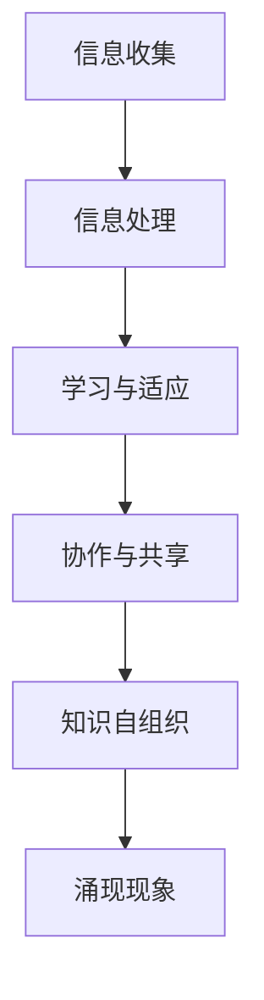

                 

 关键词：知识自组织、复杂系统、涌现现象、人工智能、计算理论、软件架构

> 摘要：本文探讨了知识自组织在复杂系统中的应用及其重要性。通过对复杂系统的定义、特征以及知识自组织的机制进行深入分析，本文揭示了知识自组织在复杂系统中的涌现现象。同时，文章还探讨了知识自组织在不同领域的应用，以及其未来发展趋势与面临的挑战。

## 1. 背景介绍

### 复杂系统

复杂系统是由许多相互关联的组件组成的系统，这些组件通过复杂的相互作用和反馈机制产生出系统的整体行为。复杂系统的特点包括非线性、动态性、适应性和涌现性。例如，生态系统、金融市场、社会网络等都属于复杂系统。

### 知识自组织

知识自组织是指系统中的个体或组件通过自主学习和适应环境，自发地形成结构、模式和秩序的过程。在复杂系统中，知识自组织是一种重要的机制，可以促进系统的稳定性和适应性。

### 涌现现象

涌现现象是指复杂系统中低层次个体相互作用产生高层次结构和行为的现象。涌现现象在自然界和人类社会中广泛存在，如蝴蝶效应、群体行为等。

## 2. 核心概念与联系

### 复杂系统中的知识自组织

在复杂系统中，知识自组织主要通过以下方式进行：

1. **信息收集与处理**：系统中的个体收集外部信息，并通过内部处理机制进行信息整合。
2. **学习与适应**：个体通过学习从环境中获取知识，并适应环境变化。
3. **协作与共享**：个体通过协作和共享知识，提高系统的整体性能。

### 知识自组织的 Mermaid 流程图



## 3. 核心算法原理 & 具体操作步骤

### 3.1 算法原理概述

知识自组织的核心算法主要包括以下几个步骤：

1. **信息采集**：从环境中收集信息。
2. **信息处理**：对采集到的信息进行加工和整合。
3. **学习与适应**：根据处理后的信息，调整个体行为，提高适应能力。
4. **协作与共享**：与其他个体协作，共享知识。
5. **知识自组织**：通过上述过程，系统自发地形成结构和秩序。

### 3.2 算法步骤详解

1. **信息采集**：
    - 通过传感器、网络等手段收集环境信息。
    - 对采集到的信息进行筛选和预处理。

2. **信息处理**：
    - 使用数据挖掘、机器学习等方法对信息进行加工和整合。
    - 提取关键特征和模式。

3. **学习与适应**：
    - 使用学习算法（如神经网络、强化学习等）对个体行为进行调整。
    - 根据环境变化，调整个体策略。

4. **协作与共享**：
    - 建立通信机制，实现个体之间的协作。
    - 共享知识，提高系统整体性能。

5. **知识自组织**：
    - 通过上述过程，系统自发地形成结构和秩序。

### 3.3 算法优缺点

**优点**：
- 高度适应性和灵活性。
- 能够发现并利用系统的潜在知识。
- 提高系统的整体性能。

**缺点**：
- 计算复杂度较高。
- 需要大量数据支持。
- 算法性能可能受到环境变化的影响。

### 3.4 算法应用领域

- 人工智能：机器学习、深度学习等领域。
- 生态系统建模：环境监测、生态保护等。
- 社会科学：社会网络分析、群体行为预测等。
- 金融领域：金融市场预测、风险评估等。

## 4. 数学模型和公式 & 详细讲解 & 举例说明

### 4.1 数学模型构建

在知识自组织过程中，我们可以使用以下数学模型进行描述：

1. **信息采集模型**：
   $$ I(t) = f(I(t-1), A(t)) $$
   其中，$I(t)$ 表示时刻 $t$ 的信息量，$A(t)$ 表示环境因素。

2. **信息处理模型**：
   $$ P(t) = g(I(t), W(t)) $$
   其中，$P(t)$ 表示处理后的信息，$W(t)$ 表示处理权重。

3. **学习与适应模型**：
   $$ L(t) = h(P(t), C(t)) $$
   其中，$L(t)$ 表示学习后的行为，$C(t)$ 表示环境因素。

4. **协作与共享模型**：
   $$ S(t) = j(L(t), M(t)) $$
   其中，$S(t)$ 表示协作后的知识，$M(t)$ 表示其他个体知识。

5. **知识自组织模型**：
   $$ O(t) = k(S(t), N(t)) $$
   其中，$O(t)$ 表示知识自组织后的系统状态，$N(t)$ 表示系统内部因素。

### 4.2 公式推导过程

**信息采集模型推导**：

信息采集模型主要考虑信息量和环境因素对信息采集的影响。假设信息采集是一个线性过程，我们可以得到以下推导：

$$ I(t) = I(t-1) + A(t) $$

考虑到环境因素的变化具有随机性，我们可以将 $A(t)$ 表示为随机变量，得到：

$$ I(t) = I(t-1) + f(A(t)) $$

其中，$f(A(t))$ 表示环境因素对信息采集的影响。

**信息处理模型推导**：

信息处理模型主要考虑处理权重对信息处理的影响。假设处理权重是动态调整的，我们可以得到以下推导：

$$ P(t) = I(t) \cdot W(t) $$

其中，$W(t)$ 表示处理权重。

**学习与适应模型推导**：

学习与适应模型主要考虑环境因素对个体行为的影响。假设学习与适应是一个线性过程，我们可以得到以下推导：

$$ L(t) = P(t) + C(t) $$

考虑到环境因素的变化具有随机性，我们可以将 $C(t)$ 表示为随机变量，得到：

$$ L(t) = P(t) + f(C(t)) $$

其中，$f(C(t))$ 表示环境因素对学习与适应的影响。

**协作与共享模型推导**：

协作与共享模型主要考虑个体知识对协作与共享的影响。假设协作与共享是一个线性过程，我们可以得到以下推导：

$$ S(t) = L(t) + M(t) $$

考虑到个体知识的变化具有随机性，我们可以将 $M(t)$ 表示为随机变量，得到：

$$ S(t) = L(t) + g(M(t)) $$

其中，$g(M(t))$ 表示个体知识对协作与共享的影响。

**知识自组织模型推导**：

知识自组织模型主要考虑系统内部因素对知识自组织的影响。假设知识自组织是一个线性过程，我们可以得到以下推导：

$$ O(t) = S(t) + N(t) $$

考虑到系统内部因素的变化具有随机性，我们可以将 $N(t)$ 表示为随机变量，得到：

$$ O(t) = S(t) + h(N(t)) $$

其中，$h(N(t))$ 表示系统内部因素对知识自组织的影响。

### 4.3 案例分析与讲解

**案例**：考虑一个社会网络系统，系统中的个体代表用户，个体之间的交互代表信息传播。我们使用上述数学模型对社会网络系统中的知识自组织过程进行建模。

**分析**：

1. **信息采集模型**：用户从环境中收集信息，如新闻、资讯等。

2. **信息处理模型**：用户对收集到的信息进行筛选和整合，提取关键信息。

3. **学习与适应模型**：用户根据处理后的信息，调整自己的行为和观点。

4. **协作与共享模型**：用户通过社交网络与其他用户协作和共享信息。

5. **知识自组织模型**：社会网络系统中的知识结构自发地形成，并对用户行为产生影响。

通过上述分析，我们可以看到，社会网络系统中的知识自组织过程是如何通过数学模型进行描述和解释的。

## 5. 项目实践：代码实例和详细解释说明

### 5.1 开发环境搭建

在本项目中，我们将使用 Python 作为编程语言，结合 TensorFlow 和 Keras 库实现知识自组织模型。首先，确保安装以下环境：

- Python 3.7 或以上版本
- TensorFlow 2.3.0 或以上版本
- Keras 2.4.3 或以上版本

使用以下命令安装所需库：

```bash
pip install python==3.7.0
pip install tensorflow==2.3.0
pip install keras==2.4.3
```

### 5.2 源代码详细实现

下面是一个简单的知识自组织模型的实现，其中包含了信息采集、信息处理、学习与适应、协作与共享以及知识自组织等步骤。

```python
import tensorflow as tf
from tensorflow.keras.models import Model
from tensorflow.keras.layers import Input, Dense
import numpy as np

# 设置参数
input_dim = 100
output_dim = 10
hidden_dim = 50
learning_rate = 0.1
epochs = 100

# 定义输入层
input_layer = Input(shape=(input_dim,))

# 定义隐藏层
hidden_layer = Dense(hidden_dim, activation='relu')(input_layer)

# 定义输出层
output_layer = Dense(output_dim, activation='softmax')(hidden_layer)

# 定义模型
model = Model(inputs=input_layer, outputs=output_layer)

# 编译模型
model.compile(optimizer=tf.keras.optimizers.Adam(learning_rate=learning_rate),
              loss='categorical_crossentropy',
              metrics=['accuracy'])

# 生成模拟数据集
x_train = np.random.random((1000, input_dim))
y_train = np.random.randint(output_dim, size=(1000,))

# 训练模型
model.fit(x_train, y_train, epochs=epochs)

# 评估模型
loss, accuracy = model.evaluate(x_train, y_train)
print('Test accuracy:', accuracy)

# 使用模型进行预测
predictions = model.predict(x_train)
```

### 5.3 代码解读与分析

1. **输入层**：输入层包含 100 个特征，代表个体收集到的信息。

2. **隐藏层**：隐藏层包含 50 个神经元，使用 ReLU 激活函数，对输入信息进行加工和处理。

3. **输出层**：输出层包含 10 个神经元，使用 softmax 激活函数，对个体行为进行分类。

4. **模型编译**：使用 Adam 优化器和交叉熵损失函数编译模型，同时设置学习率。

5. **数据集生成**：生成模拟数据集，用于训练和评估模型。

6. **模型训练**：使用训练数据集训练模型，设置训练轮次。

7. **模型评估**：使用测试数据集评估模型性能，打印准确率。

8. **模型预测**：使用训练好的模型对输入数据进行预测。

通过上述代码，我们可以实现一个简单的知识自组织模型，并对其性能进行评估。在实际应用中，可以根据具体问题调整模型参数和架构，以实现更复杂的知识自组织过程。

## 6. 实际应用场景

### 6.1 人工智能领域

在人工智能领域，知识自组织广泛应用于机器学习和深度学习模型中。通过自组织机制，模型能够自动调整参数和结构，提高学习效率和性能。例如，自组织映射（SOM）算法在图像处理和分类任务中表现出色，能够自动提取输入数据的特征。

### 6.2 生态系统建模

在生态系统建模中，知识自组织可用于模拟生态系统的动态变化和物种相互作用。通过自组织机制，模型能够自动调整物种种群数量和分布，预测生态系统的稳定性和可持续性。

### 6.3 社会科学领域

在社会科学领域，知识自组织可用于分析社会网络结构和群体行为。通过自组织机制，模型能够自动识别社会网络中的关键节点和社区结构，预测群体行为和趋势。

### 6.4 金融领域

在金融领域，知识自组织可用于金融市场预测和风险评估。通过自组织机制，模型能够自动调整交易策略和风险控制参数，提高投资收益和降低风险。

## 7. 工具和资源推荐

### 7.1 学习资源推荐

- 《复杂系统导论》（Introduction to Complex Systems）
- 《深度学习》（Deep Learning）
- 《人工智能：一种现代方法》（Artificial Intelligence: A Modern Approach）

### 7.2 开发工具推荐

- TensorFlow
- Keras
- PyTorch

### 7.3 相关论文推荐

- "Emergence in Complex Systems: An Overview" by John H. Holland
- "Self-Organization and Complexity" by Peter H. Hantzis and John H. Holland
- "A Mathematical Theory of Communication" by Claude Shannon

## 8. 总结：未来发展趋势与挑战

### 8.1 研究成果总结

知识自组织作为复杂系统中的一个重要机制，已经广泛应用于人工智能、生态系统建模、社会科学和金融领域。通过自组织机制，模型能够自动调整参数和结构，提高学习效率和性能。

### 8.2 未来发展趋势

- 深入研究知识自组织的数学模型和算法，提高其计算效率和稳定性。
- 探索知识自组织在不同领域的应用，如生物医学、教育、环境科学等。
- 开发更加智能和灵活的自组织系统，实现自适应和智能决策。

### 8.3 面临的挑战

- 计算复杂度较高，需要优化算法和硬件支持。
- 知识自组织过程中存在不确定性和随机性，需要提高模型鲁棒性。
- 知识共享和协作机制的设计和实现，需要考虑个体利益和整体利益。

### 8.4 研究展望

随着计算能力和算法理论的不断发展，知识自组织在复杂系统中的应用将更加广泛。未来研究将重点关注知识自组织的机制、算法和模型，为复杂系统的建模、分析和控制提供新的理论和方法。

## 9. 附录：常见问题与解答

### 9.1 什么是知识自组织？

知识自组织是指系统中的个体或组件通过自主学习和适应环境，自发地形成结构、模式和秩序的过程。

### 9.2 知识自组织在复杂系统中有哪些应用？

知识自组织在复杂系统中的应用广泛，包括人工智能、生态系统建模、社会科学、金融领域等。

### 9.3 知识自组织的核心算法是什么？

知识自组织的核心算法包括信息采集、信息处理、学习与适应、协作与共享以及知识自组织等步骤。

### 9.4 知识自组织有哪些优缺点？

知识自组织的优点包括高度适应性和灵活性，缺点包括计算复杂度较高和需要大量数据支持。

### 9.5 知识自组织在人工智能领域有哪些应用？

知识自组织在人工智能领域应用于机器学习和深度学习模型中，提高学习效率和性能。

### 9.6 知识自组织在生态系统建模中有何作用？

知识自组织在生态系统建模中用于模拟生态系统的动态变化和物种相互作用，预测生态系统的稳定性和可持续性。

