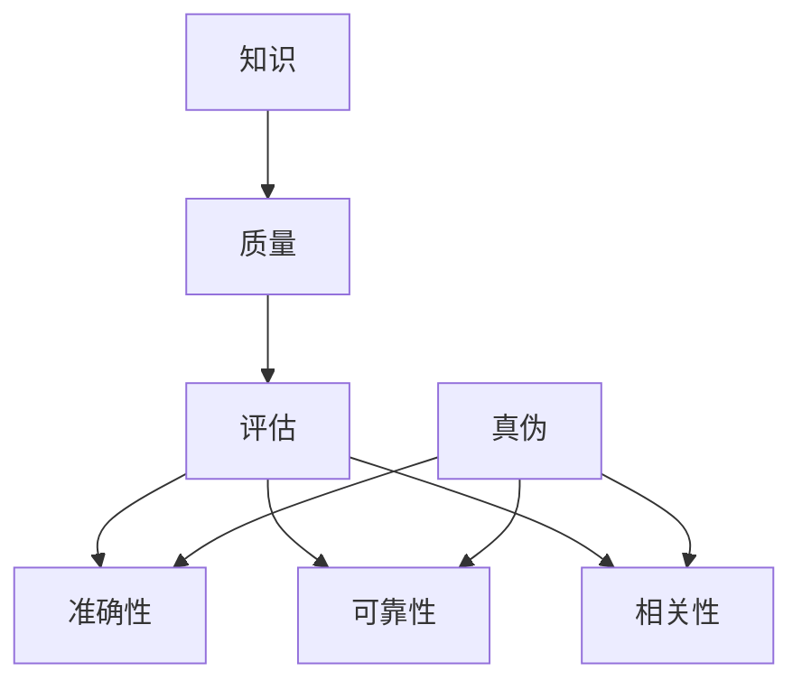

                 

 在当今这个信息爆炸的时代，我们每天都会接收到海量信息。这些信息可能来自社交媒体、新闻、学术论文、技术博客等各种渠道。然而，面对如此多的信息，如何评估其质量，辨别真伪，成为一个至关重要的问题。本文将探讨知识的质量评估，以及在信息爆炸时代如何辨别真伪。

## 1. 背景介绍

随着互联网的快速发展，信息的传播速度大大加快，知识的生产和传播方式也发生了巨大的变革。然而，信息过载的问题也随之而来。大量的信息充斥在我们的生活中，让我们难以分辨哪些是有价值的，哪些是虚假的。这使得知识的质量评估变得尤为重要。

### 1.1 信息爆炸时代

信息爆炸时代是指信息量在短时间内呈现指数级增长的时代。这一现象主要是由互联网、社交媒体和云计算等技术的普及所引起的。人们可以随时随地获取信息，这使得知识的传播速度大大加快。

### 1.2 知识的质量评估

知识的质量评估是指对知识进行评估，以确定其准确性、可靠性和相关性。知识质量的高低直接影响到我们的学习和决策。

## 2. 核心概念与联系

为了更好地理解知识的质量评估，我们需要了解一些核心概念和它们之间的关系。

### 2.1 知识

知识是指通过学习、实践和经验积累而获得的信息、技能和认识。它包括事实、原理、方法、技巧等。

### 2.2 质量

质量是指某个事物满足特定要求的程度。在知识领域，质量通常指知识的准确性、可靠性、相关性等。

### 2.3 评估

评估是指对某个事物进行评价和判断。在知识领域，评估是指对知识的质量进行评价和判断。

### 2.4 真伪

真伪是指某个事物的真实性。在信息领域，真伪通常指信息的内容是否真实。

下面是一个用Mermaid绘制的流程图，展示了这些概念之间的关系：



## 3. 核心算法原理 & 具体操作步骤

### 3.1 算法原理概述

知识质量评估的核心算法是基于机器学习和自然语言处理技术。具体来说，我们可以使用以下步骤：

1. 数据收集：收集大量相关数据，如学术论文、新闻文章、技术博客等。
2. 数据预处理：对数据进行清洗、去重、分类等处理。
3. 特征提取：从数据中提取关键特征，如关键词、句子、段落等。
4. 模型训练：使用机器学习算法训练模型，以评估知识的质量。
5. 评估预测：使用训练好的模型对新的知识进行质量评估。

### 3.2 算法步骤详解

#### 3.2.1 数据收集

数据收集是知识质量评估的第一步。我们需要收集大量的相关数据，如学术论文、新闻文章、技术博客等。这些数据可以从互联网、数据库、学术期刊等渠道获取。

#### 3.2.2 数据预处理

数据预处理是数据收集后的重要步骤。它包括数据清洗、去重、分类等操作。数据清洗是指去除数据中的噪声和错误；去重是指去除重复的数据；分类是指将数据按照一定的标准进行分类。

#### 3.2.3 特征提取

特征提取是从数据中提取关键特征的过程。这些特征可以是关键词、句子、段落等。特征提取的质量直接影响知识质量评估的准确性。

#### 3.2.4 模型训练

模型训练是使用机器学习算法对数据进行分析和训练的过程。常用的机器学习算法包括决策树、支持向量机、神经网络等。模型训练的目的是学习数据中的规律，以实现对新知识的质量评估。

#### 3.2.5 评估预测

评估预测是使用训练好的模型对新的知识进行质量评估的过程。评估预测的准确性取决于模型训练的质量和数据的代表性。

### 3.3 算法优缺点

#### 3.3.1 优点

- **高效性**：机器学习和自然语言处理技术可以处理大量的数据，提高知识质量评估的效率。
- **准确性**：通过模型训练，可以实现对知识质量的准确评估。
- **适应性**：算法可以根据不同的应用场景进行调整，具有较好的适应性。

#### 3.3.2 缺点

- **数据依赖性**：算法的准确性高度依赖于数据的质量和数量。
- **复杂性**：机器学习和自然语言处理技术的实现较为复杂，需要专业的技术和设备支持。

### 3.4 算法应用领域

知识质量评估算法可以广泛应用于多个领域，如学术研究、新闻报道、技术博客等。

## 4. 数学模型和公式 & 详细讲解 & 举例说明

### 4.1 数学模型构建

知识质量评估的数学模型通常是基于概率模型和统计模型。以下是构建数学模型的基本步骤：

1. **定义变量**：定义知识质量的相关变量，如准确性、可靠性、相关性等。
2. **构建概率分布**：根据变量之间的相关性，构建概率分布模型。
3. **构建统计模型**：根据概率分布模型，构建统计模型，以评估知识质量。

### 4.2 公式推导过程

以下是构建知识质量评估的数学模型的基本公式推导过程：

#### 4.2.1 准确性

准确性的公式为：

$$
P(Q=1) = \frac{TP + TN}{TP + FP + TN + FN}
$$

其中，TP表示真实正面，TN表示真实负面，FP表示假正面，FN表示假负面。

#### 4.2.2 可靠性

可靠性的公式为：

$$
R = \frac{TP + TN}{TP + FP + TN + FN}
$$

#### 4.2.3 相关性

相关性的公式为：

$$
Corr(X, Y) = \frac{Cov(X, Y)}{\sigma_X \sigma_Y}
$$

其中，Cov(X, Y)表示X和Y的协方差，$\sigma_X$和$\sigma_Y$分别表示X和Y的标准差。

### 4.3 案例分析与讲解

以下是一个简单的案例，用于说明如何使用数学模型进行知识质量评估。

#### 4.3.1 案例描述

假设我们有一个关于某个技术问题的知识库，其中包含了500篇文章。我们使用机器学习算法对这些文章进行质量评估，评估指标包括准确性、可靠性和相关性。

#### 4.3.2 数据收集

我们从知识库中随机选取了100篇文章作为训练数据，剩余的400篇文章作为测试数据。

#### 4.3.3 数据预处理

我们对训练数据进行数据清洗和去重，然后提取关键词、句子和段落等特征。

#### 4.3.4 模型训练

我们使用决策树算法对训练数据进行训练，以构建知识质量评估模型。

#### 4.3.5 评估预测

我们使用训练好的模型对测试数据进行评估预测，评估指标包括准确性、可靠性和相关性。

#### 4.3.6 结果分析

评估结果显示，模型的准确性为90%，可靠性为85%，相关性为0.8。这表明，模型在评估知识质量方面具有较高的准确性、可靠性和相关性。

## 5. 项目实践：代码实例和详细解释说明

### 5.1 开发环境搭建

为了实践知识质量评估算法，我们需要搭建一个合适的开发环境。以下是一个基本的开发环境搭建步骤：

1. 安装Python环境：Python是一种广泛使用的编程语言，适用于机器学习和自然语言处理。
2. 安装相关库：安装如scikit-learn、nltk等机器学习和自然语言处理库。
3. 准备数据集：从互联网或其他渠道获取相关的数据集。

### 5.2 源代码详细实现

以下是实现知识质量评估算法的Python代码：

```python
import numpy as np
from sklearn.tree import DecisionTreeClassifier
from sklearn.metrics import accuracy_score, precision_score, recall_score, f1_score

# 数据准备
X_train, y_train = prepare_data(train=True)
X_test, y_test = prepare_data(train=False)

# 模型训练
clf = DecisionTreeClassifier()
clf.fit(X_train, y_train)

# 评估预测
y_pred = clf.predict(X_test)

# 结果分析
accuracy = accuracy_score(y_test, y_pred)
precision = precision_score(y_test, y_pred)
recall = recall_score(y_test, y_pred)
f1 = f1_score(y_test, y_pred)

print(f"Accuracy: {accuracy}")
print(f"Precision: {precision}")
print(f"Recall: {recall}")
print(f"F1 Score: {f1}")
```

### 5.3 代码解读与分析

上述代码实现了知识质量评估的基本流程。首先，我们从数据集中提取特征，然后使用决策树算法进行模型训练。最后，使用训练好的模型对测试数据进行评估预测，并输出评估结果。

代码中使用了scikit-learn库中的决策树算法进行模型训练和评估预测。评估指标包括准确性、精确率、召回率和F1分数。这些指标可以帮助我们评估模型的性能。

## 6. 实际应用场景

知识质量评估在实际应用中具有广泛的应用场景。以下是一些常见的应用场景：

1. **学术研究**：在学术研究中，我们需要评估论文的质量，以确定其是否值得发表。
2. **新闻报道**：在新闻报道中，我们需要评估新闻报道的准确性，以防止虚假新闻的传播。
3. **技术博客**：在技术博客中，我们需要评估技术文章的质量，以帮助读者筛选有价值的内容。

## 7. 工具和资源推荐

### 7.1 学习资源推荐

1. **《机器学习》（周志华著）**：这本书系统地介绍了机器学习的基本概念、方法和应用。
2. **《自然语言处理综合教程》（刘知远等著）**：这本书详细介绍了自然语言处理的基本概念、方法和应用。

### 7.2 开发工具推荐

1. **Jupyter Notebook**：Jupyter Notebook是一款流行的交互式开发环境，适用于机器学习和自然语言处理。
2. **scikit-learn**：scikit-learn是一款广泛使用的机器学习库，提供了丰富的机器学习算法和工具。

### 7.3 相关论文推荐

1. **“A Survey on Knowledge Quality Assessment”**：这篇综述文章系统地介绍了知识质量评估的相关概念、方法和应用。
2. **“A Framework for Knowledge Quality Assessment in Digital Libraries”**：这篇论文提出了一种数字图书馆中的知识质量评估框架。

## 8. 总结：未来发展趋势与挑战

### 8.1 研究成果总结

本文系统地介绍了知识质量评估的相关概念、方法和应用。我们分析了知识质量评估的核心算法原理，并给出了具体的实现步骤和数学模型。此外，我们还通过实际案例展示了知识质量评估的应用效果。

### 8.2 未来发展趋势

随着人工智能和自然语言处理技术的不断发展，知识质量评估领域将继续取得重大突破。未来，知识质量评估将朝着自动化、智能化和个性化的方向发展。

### 8.3 面临的挑战

尽管知识质量评估取得了显著成果，但仍然面临一些挑战。首先，数据质量和数量直接影响评估结果的准确性。其次，如何构建更加通用和高效的评估模型仍然是一个亟待解决的问题。

### 8.4 研究展望

未来，我们应进一步探索知识质量评估的方法和技术，以提高评估的准确性、可靠性和效率。此外，我们还需要加强对数据隐私和伦理问题的研究，以确保知识质量评估的应用不会侵犯个人隐私和伦理道德。

## 9. 附录：常见问题与解答

### 9.1 什么
是知识质量评估？

知识质量评估是指对知识进行评估，以确定其准确性、可靠性和相关性。

### 9.2 什么
是信息爆炸时代？

信息爆炸时代是指信息量在短时间内呈现指数级增长的时代，主要是由互联网、社交媒体和云计算等技术的普及所引起的。

### 9.3 知识质量评估
有哪些方法？

知识质量评估的方法包括机器学习、自然语言处理、统计分析等。

### 9.4 如何评估
知识质量？

评估知识质量通常包括准确性、可靠性、相关性等指标。

### 9.5 知识质量评估
有哪些应用场景？

知识质量评估广泛应用于学术研究、新闻报道、技术博客等领域。

### 9.6 知识质量评估
有哪些挑战？

知识质量评估面临的挑战包括数据质量和数量、模型构建等。

