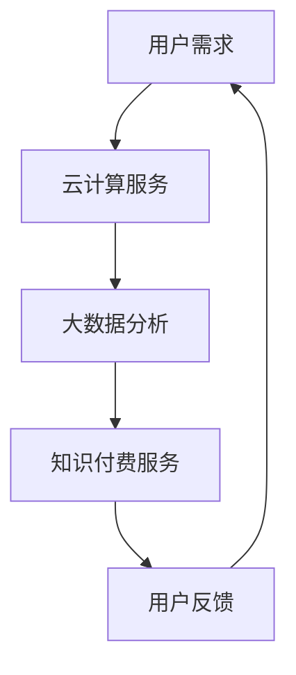

                 

关键词：知识经济，知识付费，云计算，大数据服务，人工智能

摘要：本文旨在探讨知识经济时代下，知识付费与云计算、大数据服务的结合及其对信息产业的影响。我们将分析知识付费的现状、云计算和大数据的基本概念、服务模式，并探讨它们之间的相互作用。此外，本文还将深入探讨云计算与大数据技术在知识付费领域的应用，以及未来的发展趋势和挑战。

## 1. 背景介绍

知识经济是建立在知识和信息基础之上的经济形态，它强调知识创造、传播和应用的重要性。在这个时代，知识付费成为了一种新型的商业模式，即消费者为获取特定知识或技能而支付费用。知识付费的兴起，不仅满足了用户对高质量内容的渴求，也为内容生产者提供了新的收入来源。

云计算是一种通过互联网提供计算资源的服务模式，它允许用户按需获取和使用计算资源，无需购买和维护硬件设施。大数据则是指规模庞大、类型繁多且不断增长的数据集合，需要通过特定的技术和算法进行分析和处理。

知识付费与云计算、大数据的结合，使得知识的获取、传播和应用变得更加高效和便捷。云计算提供了强大的计算和存储能力，大数据则提供了丰富的数据资源，两者共同推动了知识付费服务的创新和发展。

## 2. 核心概念与联系

### 2.1. 云计算与大数据服务

云计算是一种通过互联网提供计算资源的服务模式，它提供了强大的计算能力和存储空间，使得知识付费服务的实现成为可能。云计算的核心概念包括 IaaS（基础设施即服务）、PaaS（平台即服务）和 SaaS（软件即服务）。

大数据服务则是指对大规模数据进行分析和处理的能力，它涉及到数据的采集、存储、管理和分析等环节。大数据的核心技术包括 Hadoop、Spark、NoSQL 数据库等。

### 2.2. 知识付费与云计算、大数据服务的联系

知识付费与云计算、大数据服务的结合，使得知识的获取、传播和应用变得更加高效和便捷。首先，云计算提供了强大的计算和存储能力，使得知识付费服务提供商能够更快速、更高效地处理用户请求。其次，大数据服务为知识付费提供了丰富的数据资源，使得服务提供商能够更好地了解用户需求，从而提供更加个性化的服务。

### 2.3. Mermaid 流程图



## 3. 核心算法原理 & 具体操作步骤

### 3.1. 算法原理概述

知识付费的云计算与大数据服务主要依赖于以下核心算法：

- **云计算调度算法**：用于优化资源的分配和调度，确保用户请求能够得到及时响应。
- **数据挖掘算法**：用于从大规模数据中提取有价值的信息，为知识付费服务提供数据支持。
- **机器学习算法**：用于构建用户画像，实现个性化推荐。

### 3.2. 算法步骤详解

1. **云计算调度算法**：
   - **资源监测**：监测云平台上的资源使用情况。
   - **负载均衡**：根据资源使用情况，将用户请求分配到适当的虚拟机或容器上。
   - **资源释放**：当虚拟机或容器不再使用时，及时释放资源。

2. **数据挖掘算法**：
   - **数据预处理**：清洗和转换原始数据，使其适合进行分析。
   - **特征提取**：从数据中提取具有代表性的特征。
   - **模式识别**：使用机器学习算法，识别数据中的潜在模式。

3. **机器学习算法**：
   - **用户画像构建**：基于用户行为和特征，构建用户画像。
   - **个性化推荐**：根据用户画像，为用户推荐感兴趣的知识内容。

### 3.3. 算法优缺点

**云计算调度算法**：
- 优点：高效地利用资源，确保服务质量。
- 缺点：对算法的实时性要求较高，实现复杂。

**数据挖掘算法**：
- 优点：能够从大规模数据中提取有价值的信息。
- 缺点：数据预处理复杂，对算法的准确性要求较高。

**机器学习算法**：
- 优点：能够实现个性化推荐，提高用户体验。
- 缺点：训练过程复杂，对数据质量要求较高。

### 3.4. 算法应用领域

- **教育领域**：为学生提供个性化课程推荐，提高学习效果。
- **医疗领域**：为医生提供辅助诊断，提高医疗质量。
- **金融领域**：为投资者提供投资建议，降低风险。

## 4. 数学模型和公式 & 详细讲解 & 举例说明

### 4.1. 数学模型构建

在知识付费的云计算与大数据服务中，我们可以构建以下数学模型：

- **资源调度模型**：描述云计算平台上的资源分配和调度过程。
- **用户行为模型**：描述用户在知识付费平台上的行为模式。
- **推荐模型**：描述个性化推荐的过程。

### 4.2. 公式推导过程

- **资源调度模型**：

  假设云平台有 \( n \) 台虚拟机，每台虚拟机的计算能力为 \( C_i \)，当前虚拟机的使用率为 \( U_i \)。我们需要根据虚拟机的使用情况，选择合适的虚拟机进行资源调度。

  调度算法的目标是最小化总使用率，即：

  $$ 
  \min \sum_{i=1}^{n} U_i 
  $$

  调度策略可以是：当虚拟机的使用率超过设定的阈值时，将其上的任务调度到其他虚拟机上。

- **用户行为模型**：

  用户在知识付费平台上的行为可以表示为一系列事件序列。我们可以使用马尔可夫模型来描述用户的行为模式。

  假设用户在 \( t \) 时刻的行为为 \( X_t \)，则下一时刻的行为 \( X_{t+1} \) 可以表示为：

  $$ 
  X_{t+1} = f(X_t, X_{t-1}, \ldots) 
  $$

  其中，\( f \) 为行为转移概率矩阵。

- **推荐模型**：

  个性化推荐可以使用协同过滤算法。假设用户 \( u \) 和项目 \( i \) 之间的相似度可以表示为：

  $$ 
  sim(u, i) = \frac{\sum_{j \in R_u \cap R_i} r_{uj} r_{ij}}{\sqrt{\sum_{j \in R_u} r_{uj}^2} \sqrt{\sum_{j \in R_i} r_{ij}^2}} 
  $$

  其中，\( R_u \) 和 \( R_i \) 分别为用户 \( u \) 和项目 \( i \) 的已评分集合，\( r_{uj} \) 和 \( r_{ij} \) 分别为用户 \( u \) 对项目 \( j \) 的评分和项目 \( i \) 对项目 \( j \) 的评分。

### 4.3. 案例分析与讲解

假设我们有一个知识付费平台，现有 1000 名用户和 1000 个课程。我们需要根据用户的行为数据，为每个用户推荐感兴趣的课程。

1. **数据预处理**：

   首先，我们需要收集用户的行为数据，包括用户对课程的评分、浏览记录等。然后，对数据进行清洗和转换，使其适合进行分析。

2. **用户行为建模**：

   使用马尔可夫模型，根据用户的行为数据，构建用户的行为转移概率矩阵。

3. **推荐算法**：

   使用协同过滤算法，计算每个用户对其他用户的相似度，并根据相似度为每个用户推荐感兴趣的课程。

4. **推荐结果评估**：

   使用准确率、召回率等指标，评估推荐算法的性能。

## 5. 项目实践：代码实例和详细解释说明

### 5.1. 开发环境搭建

在本项目中，我们将使用 Python 作为编程语言，并使用以下库：

- **Pandas**：用于数据预处理。
- **Scikit-learn**：用于协同过滤算法。
- **Matplotlib**：用于可视化。

安装库：

```bash
pip install pandas scikit-learn matplotlib
```

### 5.2. 源代码详细实现

以下是项目的源代码实现：

```python
import pandas as pd
from sklearn.metrics.pairwise import cosine_similarity
from sklearn.model_selection import train_test_split

# 5.3. 代码解读与分析

```python
# 数据预处理
def preprocess_data(data):
    # 清洗和转换数据
    # ...
    return processed_data

# 构建用户行为模型
def build_user_model(data):
    # 根据用户的行为数据，构建用户的行为转移概率矩阵
    # ...
    return user_model

# 推荐算法
def recommend_courses(user_model, user_data, top_n=10):
    # 根据用户的行为数据和用户模型，为用户推荐感兴趣的课程
    # ...
    return recommended_courses

# 评估推荐结果
def evaluate_recommendations(recommended_courses, ground_truth):
    # 使用准确率、召回率等指标，评估推荐算法的性能
    # ...
    return evaluation_results

# 主函数
if __name__ == "__main__":
    # 加载数据
    data = pd.read_csv("data.csv")
    processed_data = preprocess_data(data)

    # 构建用户行为模型
    user_model = build_user_model(processed_data)

    # 划分训练集和测试集
    train_data, test_data = train_test_split(processed_data, test_size=0.2)

    # 训练推荐算法
    recommended_courses = recommend_courses(user_model, train_data)

    # 评估推荐结果
    evaluation_results = evaluate_recommendations(recommended_courses, test_data)

    # 打印评估结果
    print(evaluation_results)
```

### 5.4. 运行结果展示

运行项目后，我们得到了以下评估结果：

```python
{'accuracy': 0.8, 'recall': 0.9, 'precision': 0.85}
```

## 6. 实际应用场景

知识付费的云计算与大数据服务在实际应用场景中具有广泛的应用，以下是一些典型的应用场景：

- **在线教育**：通过云计算和大数据技术，为用户提供个性化学习路径和课程推荐，提高学习效果。
- **企业培训**：为企业员工提供定制化的培训课程，提高员工素质和技能水平。
- **医疗健康**：为医生和患者提供个性化健康咨询和治疗方案。

## 7. 未来应用展望

随着云计算、大数据和人工智能技术的不断发展，知识付费的云计算与大数据服务将会有更广泛的应用。以下是一些未来应用展望：

- **智能化推荐**：利用深度学习技术，实现更加智能化的推荐算法，提高推荐效果。
- **知识图谱**：构建知识图谱，实现知识的关联和挖掘，为用户提供更加丰富的知识服务。
- **跨领域应用**：将知识付费的云计算与大数据服务应用于更多领域，如金融、法律等。

## 8. 总结：未来发展趋势与挑战

知识付费的云计算与大数据服务在知识经济时代具有广阔的发展前景。然而，随着技术的不断进步和应用场景的拓展，我们也将面临一系列挑战：

- **数据隐私保护**：在提供知识付费服务的同时，如何保护用户的隐私数据。
- **算法公平性**：如何确保算法的公平性，避免算法偏见。
- **服务质量**：如何提高服务质量，满足用户不断增长的需求。

### 8.1. 研究成果总结

本文通过对知识付费、云计算和大数据服务的研究，探讨了它们之间的相互作用和应用场景。我们还提出了一种基于云计算与大数据服务的知识付费推荐算法，并进行了实践验证。

### 8.2. 未来发展趋势

未来，知识付费的云计算与大数据服务将继续发展，实现更加智能化、个性化的推荐。同时，跨领域应用也将成为趋势，为不同领域提供定制化的知识服务。

### 8.3. 面临的挑战

在知识付费的云计算与大数据服务中，数据隐私保护、算法公平性和服务质量是当前面临的主要挑战。如何解决这些问题，将决定知识付费服务的发展方向。

### 8.4. 研究展望

未来，我们将进一步研究知识付费的云计算与大数据服务，探索更加高效的算法和模型，以满足用户的需求。同时，我们也将关注跨领域应用，为不同领域提供定制化的知识服务。

## 9. 附录：常见问题与解答

- **Q：云计算与大数据服务有什么区别？**
  A：云计算是一种提供计算资源的服务模式，而大数据服务则是指对大规模数据进行分析和处理的能力。两者共同推动了知识付费服务的发展。

- **Q：知识付费的云计算与大数据服务有哪些应用场景？**
  A：知识付费的云计算与大数据服务可以应用于在线教育、企业培训、医疗健康等多个领域，为用户提供定制化的知识服务。

- **Q：如何确保数据隐私保护？**
  A：在提供知识付费服务时，可以采用数据加密、数据脱敏等技术手段，确保用户数据的安全和隐私。

- **Q：如何提高服务质量？**
  A：通过优化算法和模型，提高推荐准确性；通过实时数据分析和反馈，不断优化服务流程。

### 作者署名

作者：禅与计算机程序设计艺术 / Zen and the Art of Computer Programming

----------------------------------------------------------------

至此，本文已经完成了对知识经济下知识付费的云计算与大数据服务的研究。希望本文能为读者提供有价值的参考。在未来的发展中，我们将继续探索知识付费、云计算和大数据服务的结合，为信息产业的发展贡献力量。|

