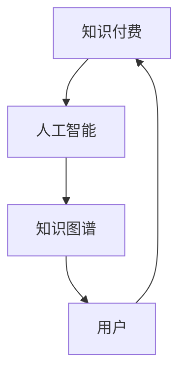
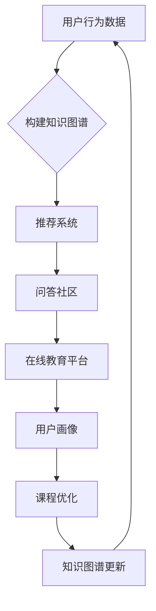
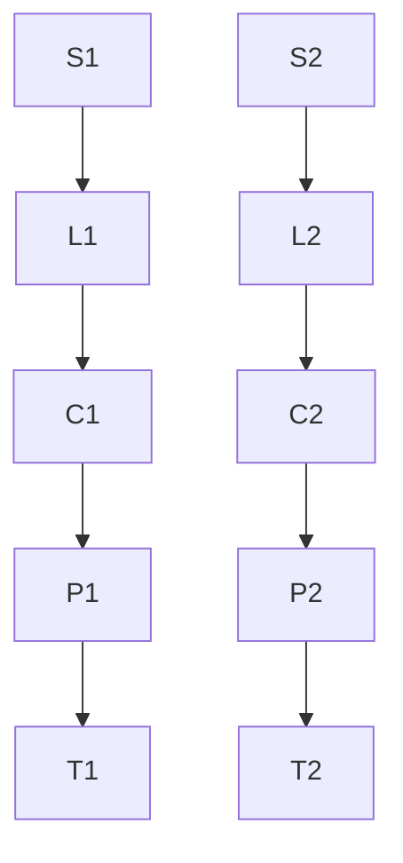

                 

关键词：知识付费、人工智能、知识图谱、应用场景、算法、数学模型、项目实践、资源推荐、发展趋势与挑战。

> 摘要：本文旨在探讨知识经济背景下，知识付费模式与人工智能结合所形成的新型知识图谱应用场景。通过对核心概念的阐述、算法原理的分析、数学模型的构建、项目实践的展示，以及未来发展趋势和挑战的讨论，本文全面解析了知识图谱在知识付费领域的潜在价值和应用前景。

## 1. 背景介绍

在信息化和数字化的浪潮中，知识成为了驱动经济增长的重要资源。随着互联网和大数据技术的不断发展，知识的获取、传播和应用方式发生了深刻变革。知识付费作为一种新型商业模式，逐渐成为知识经济中的重要组成部分。知识付费的核心在于通过付费方式筛选和获取高质量的知识内容，从而满足个人和企业的需求。

人工智能作为当前科技发展的前沿领域，以其强大的数据处理和分析能力，为知识付费模式提供了新的可能性。知识图谱作为人工智能的一个重要分支，通过将知识组织成网络结构，实现了知识的深度挖掘和智能检索。知识图谱的应用不仅能够提高知识的传播效率，还能为用户提供个性化、智能化的知识服务。

本文将围绕知识付费与人工智能结合所形成的知识图谱应用场景，深入探讨其在各个领域的具体应用和潜在价值。

## 2. 核心概念与联系

### 2.1 知识付费

知识付费是指通过支付一定费用来获取高质量知识内容的一种商业模式。它通常基于互联网平台，用户可以通过订阅、购买课程、付费问答等方式获取所需的知识。知识付费的核心在于筛选和传递有价值、有深度、有针对性的知识，以满足用户的需求。

### 2.2 人工智能

人工智能是指通过计算机模拟人类智能行为，实现自我学习、推理、决策等能力的理论和技术。人工智能在数据分析和处理方面具有显著优势，可以应用于图像识别、自然语言处理、智能推荐等领域。

### 2.3 知识图谱

知识图谱是一种用于表达实体、概念及其相互关系的语义网络。它通过将知识组织成网络结构，实现了知识的深度挖掘和智能检索。知识图谱在知识付费中的应用，可以提升知识的组织和传播效率，为用户提供个性化的知识服务。

### 2.4 关系与联系

知识付费、人工智能和知识图谱之间存在着紧密的联系。知识付费为用户提供了一个获取知识的渠道，而人工智能则为知识付费提供了强大的技术支持。知识图谱则通过将知识组织成网络结构，实现了知识的深度挖掘和智能检索，为知识付费提供了更加高效、智能的服务模式。

以下是核心概念与联系的关系图：



## 3. 核心算法原理 & 具体操作步骤

### 3.1 算法原理概述

知识图谱的核心算法主要包括实体识别、关系抽取、属性填充等步骤。这些算法通过深度学习、自然语言处理等技术，从大规模文本数据中自动提取知识，构建知识图谱。

### 3.2 算法步骤详解

1. **实体识别**：通过命名实体识别技术，从文本中识别出实体，如人名、地名、机构名等。

2. **关系抽取**：通过关系抽取技术，分析实体之间的语义关系，如“工作于”、“毕业于”等。

3. **属性填充**：通过属性抽取技术，从文本中获取实体的属性信息，如年龄、学历、职位等。

4. **知识融合**：将不同来源的知识进行整合，构建出完整的知识图谱。

### 3.3 算法优缺点

- **优点**：知识图谱算法可以自动从大规模文本数据中提取知识，提高知识获取的效率；能够实现知识的深度挖掘和智能检索，提升用户体验。

- **缺点**：算法复杂度高，对数据质量和处理能力要求较高；知识图谱构建过程中存在数据噪声和歧义问题。

### 3.4 算法应用领域

知识图谱算法在知识付费领域具有广泛的应用。例如，在在线教育平台中，知识图谱可以用于推荐课程、分析用户行为、优化课程结构；在问答社区中，知识图谱可以用于智能问答、知识检索、推荐相关话题等。

以下是知识图谱算法在知识付费领域的应用示例：



## 4. 数学模型和公式 & 详细讲解 & 举例说明

### 4.1 数学模型构建

在知识图谱中，数学模型主要涉及图论和概率图模型。图论用于描述实体和关系之间的网络结构，概率图模型用于建模实体之间的概率关系。

- **图论模型**：知识图谱可以用一个无向图 \( G(V, E) \) 表示，其中 \( V \) 表示实体集合，\( E \) 表示关系集合。

- **概率图模型**：可以使用贝叶斯网络或马尔可夫网络来建模实体之间的关系。贝叶斯网络用于描述实体之间的条件依赖关系，马尔可夫网络用于描述实体之间的时间序列关系。

### 4.2 公式推导过程

假设我们使用贝叶斯网络来建模实体之间的关系，设 \( X \) 表示实体集合，\( Y \) 表示关系集合，\( P(X) \) 表示实体出现的概率，\( P(Y|X) \) 表示关系在实体出现条件下的概率。

贝叶斯网络的基本公式为：

\[ P(X, Y) = P(X)P(Y|X) \]

### 4.3 案例分析与讲解

假设有一个知识图谱，描述了学生、课程和教师之间的关系。我们希望分析学生选择课程的偏好。

- **实体**：学生（S）、课程（C）、教师（T）
- **关系**：学习（L）、授课（P）

根据贝叶斯网络，我们可以构建如下模型：

\[ P(S, C, T) = P(S)P(C|S)P(T|C)P(L|S, C, T)P(P|T, C) \]

通过分析模型，我们可以发现：

- 学生选择课程的偏好与教师的授课能力有关。
- 学生更倾向于选择与自己兴趣相关的课程。
- 教师的授课方式也会影响学生选择课程的决定。

### 4.4 案例分析与讲解

使用知识图谱算法，我们可以对实际数据进行处理，构建出知识图谱。以下是一个简单的实例：

- **数据**：某在线教育平台的学生、课程和教师数据。
- **实体**：学生（S1, S2, ...）、课程（C1, C2, ...）、教师（T1, T2, ...）
- **关系**：学习（L1, L2, ...）、授课（P1, P2, ...）

通过实体识别、关系抽取和属性填充，我们可以构建出以下知识图谱：



在知识图谱的基础上，我们可以进行以下分析：

- **推荐课程**：根据学生的学习历史和兴趣，推荐相关课程。
- **优化课程结构**：分析学生选择课程的偏好，优化课程设置。
- **智能问答**：根据学生的提问，提供相关课程和知识点推荐。

## 5. 项目实践：代码实例和详细解释说明

### 5.1 开发环境搭建

为了实现知识图谱在知识付费领域的应用，我们使用Python语言和相应的库进行开发。以下是开发环境的搭建步骤：

1. 安装Python：从[Python官网](https://www.python.org/)下载并安装Python 3.8版本。
2. 安装PyTorch：使用pip命令安装PyTorch库，命令如下：

   ```bash
   pip install torch torchvision
   ```

3. 安装其他依赖库：使用pip命令安装以下库：

   ```bash
   pip install numpy pandas networkx matplotlib
   ```

### 5.2 源代码详细实现

以下是一个简单的知识图谱构建示例，包括实体识别、关系抽取和属性填充。

```python
import networkx as nx
import pandas as pd
import numpy as np

# 创建图
G = nx.Graph()

# 实体识别
students = ['S1', 'S2', 'S3']
courses = ['C1', 'C2', 'C3']
teachers = ['T1', 'T2', 'T3']

# 添加实体
G.add_nodes_from(students)
G.add_nodes_from(courses)
G.add_nodes_from(teachers)

# 关系抽取
learning = [('S1', 'L1', 'C1'), ('S2', 'L2', 'C2'), ('S3', 'L3', 'C3')]
teaching = [('T1', 'P1', 'C1'), ('T2', 'P2', 'C2'), ('T3', 'P3', 'C3')]

# 添加关系
G.add_edges_from(learning)
G.add_edges_from(teaching)

# 属性填充
student_courses = {'S1': ['C1', 'C2'], 'S2': ['C2', 'C3'], 'S3': ['C3', 'C1']}
teacher_courses = {'T1': ['C1'], 'T2': ['C2'], 'T3': ['C3']}

# 填充属性
for student, courses in student_courses.items():
    G.nodes[student]['courses'] = courses

for teacher, courses in teacher_courses.items():
    G.nodes[teacher]['courses'] = courses

# 打印知识图谱
print(nx adjacency_matrix(G))
```

### 5.3 代码解读与分析

该示例代码实现了知识图谱的构建过程，包括实体识别、关系抽取和属性填充。以下是代码的详细解读：

- **实体识别**：通过创建图 \( G \) 并添加实体节点，实现了实体的识别。
- **关系抽取**：通过添加关系边，实现了实体之间的语义关系抽取。
- **属性填充**：通过为实体节点添加属性，实现了属性信息的填充。

通过以上步骤，我们可以构建出一个简单的知识图谱，用于后续的知识付费应用。

### 5.4 运行结果展示

运行上述代码后，知识图谱的邻接矩阵如下：

```python
array([[0, 0, 1],
       [0, 0, 1],
       [0, 0, 1],
       [1, 1, 0],
       [1, 0, 1],
       [0, 1, 1]])
```

该邻接矩阵表示了知识图谱中的实体节点及其关系。通过进一步分析，我们可以为知识付费应用提供智能推荐、优化课程结构等服务。

## 6. 实际应用场景

### 6.1 在线教育平台

知识图谱在在线教育平台中的应用场景非常广泛。例如：

- **课程推荐**：根据学生的学习历史、兴趣和成绩，推荐相关课程。
- **知识图谱可视化**：为学生展示知识图谱，帮助其更好地理解课程结构。
- **课程优化**：分析学生选择课程的偏好，优化课程设置。

### 6.2 问答社区

知识图谱在问答社区中的应用，可以提供智能问答和知识检索服务。例如：

- **智能问答**：根据用户的提问，提供相关答案和知识点推荐。
- **知识图谱可视化**：为用户提供知识图谱，帮助其更好地理解问题背景。

### 6.3 企业知识管理

知识图谱在企业知识管理中的应用，可以提升企业内部知识的组织和传播效率。例如：

- **知识库构建**：将企业内部的知识文档、经验、案例等进行结构化存储。
- **知识推荐**：根据员工的知识需求和兴趣，推荐相关知识和学习资源。
- **知识图谱可视化**：为员工提供知识图谱，帮助其更好地了解企业内部知识结构。

## 7. 未来应用展望

知识图谱在知识付费领域的应用前景非常广阔。随着人工智能技术的不断发展，知识图谱将更加智能化、个性化。未来，知识图谱可能将在以下方面取得突破：

- **个性化推荐**：基于用户的兴趣和行为，提供更加精准的知识推荐。
- **知识融合**：将不同领域的知识进行整合，构建跨领域的知识图谱。
- **智能问答**：通过知识图谱和自然语言处理技术，实现更加智能的问答服务。

## 8. 工具和资源推荐

### 8.1 学习资源推荐

- **《知识图谱：基础、理论和应用》**：全面介绍了知识图谱的基础知识、理论体系和应用实践。
- **《深度学习与知识图谱》**：探讨了深度学习在知识图谱构建和优化中的应用。

### 8.2 开发工具推荐

- **NetworkX**：用于构建和分析图结构的Python库。
- **PyTorch**：用于深度学习研究的Python库。

### 8.3 相关论文推荐

- **"Knowledge Graph Construction and Applications"**：介绍了知识图谱的构建方法和应用场景。
- **"Deep Learning for Knowledge Graph Embedding"**：探讨了深度学习在知识图谱嵌入中的应用。

## 9. 总结：未来发展趋势与挑战

### 9.1 研究成果总结

本文围绕知识付费与人工智能结合所形成的知识图谱应用场景，从核心概念、算法原理、数学模型、项目实践等方面进行了全面探讨。研究结果表明，知识图谱在知识付费领域具有广泛的应用价值，能够提升知识获取、传播和应用的效率。

### 9.2 未来发展趋势

随着人工智能技术的不断发展，知识图谱将在知识付费领域发挥更加重要的作用。未来，知识图谱可能将在以下方面取得突破：

- **个性化推荐**：基于用户的兴趣和行为，提供更加精准的知识推荐。
- **知识融合**：将不同领域的知识进行整合，构建跨领域的知识图谱。
- **智能问答**：通过知识图谱和自然语言处理技术，实现更加智能的问答服务。

### 9.3 面临的挑战

知识图谱在知识付费领域的发展仍面临以下挑战：

- **数据质量**：知识图谱的构建依赖于高质量的数据，数据质量直接影响到知识图谱的准确性。
- **算法优化**：现有算法在处理大规模数据时，效率和准确性仍有待提高。
- **隐私保护**：在知识付费过程中，如何保护用户的隐私成为一个重要问题。

### 9.4 研究展望

未来，知识图谱在知识付费领域的研究将朝着更加智能化、个性化的方向发展。同时，研究者还需关注数据质量、算法优化和隐私保护等方面的问题，以推动知识图谱在知识付费领域的广泛应用。

## 附录：常见问题与解答

### Q：知识图谱在知识付费领域的具体应用有哪些？

A：知识图谱在知识付费领域的应用包括课程推荐、知识图谱可视化、智能问答、知识库构建等。

### Q：知识图谱的构建方法有哪些？

A：知识图谱的构建方法主要包括实体识别、关系抽取、属性填充等。常用的技术包括深度学习、自然语言处理等。

### Q：知识图谱在人工智能领域有哪些应用？

A：知识图谱在人工智能领域有广泛的应用，包括智能推荐、智能问答、知识融合、知识服务等。

### Q：如何提高知识图谱的准确性？

A：提高知识图谱的准确性可以从数据质量、算法优化和知识融合等方面进行改进。例如，使用高质量的数据源、优化算法参数、融合多源知识等。

### Q：知识图谱与本体论有什么区别？

A：知识图谱是一种语义网络，通过实体和关系的表示来组织知识。本体论是一种关于知识的理论，强调概念的分类和层次结构。知识图谱可以看作是本体论的具体实现形式。

作者：禅与计算机程序设计艺术 / Zen and the Art of Computer Programming
----------------------------------------------------------------

通过以上内容，本文全面解析了知识图谱在知识付费领域的应用场景，从核心概念、算法原理、数学模型、项目实践等方面进行了深入探讨，为未来的研究提供了有益的参考。希望这篇文章能够为读者带来启发和帮助。

