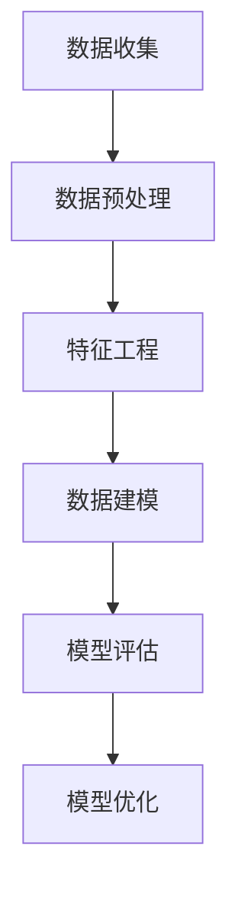

                 

关键词：知识付费、大数据、用户行为预测、机器学习、预测模型、数据挖掘、算法、深度学习、知识经济

> 摘要：在知识经济时代，知识付费已成为促进知识传播和经济发展的重要途径。本文提出了一种基于大数据分析的用户行为预测模型，旨在准确预测知识付费平台上的用户行为，为平台运营策略优化提供数据支持。本文首先介绍了知识付费的背景和现状，随后阐述了用户行为预测的重要性，并详细描述了所提出的预测模型及其算法原理、数学模型和具体实现步骤。最后，本文通过实际项目实践展示了模型的应用效果，并对未来发展趋势和挑战进行了分析和探讨。

## 1. 背景介绍

### 1.1 知识经济的兴起

知识经济是继农业经济和工业经济之后的一种新的经济形态，其主要特征是知识的创造、传播和应用成为经济增长的主要驱动力。知识经济的兴起得益于信息技术、互联网和人工智能的飞速发展，这些技术的进步极大地促进了知识的获取、共享和利用。

知识付费作为知识经济的重要组成部分，指的是消费者通过支付费用来获取有价值的信息或服务。近年来，随着在线教育和知识付费平台的蓬勃发展，知识付费已成为推动知识传播和经济增长的重要力量。知识付费平台如得到、知乎Live、喜马拉雅等，通过提供高质量的知识内容和服务，吸引了大量用户，为知识创造者提供了广阔的市场空间。

### 1.2 大数据在知识付费中的应用

大数据技术的广泛应用为知识付费领域带来了新的机遇和挑战。大数据不仅可以帮助知识付费平台更准确地了解用户需求，还能优化内容推荐、提升用户体验，提高运营效率。

大数据在知识付费中的应用主要体现在以下几个方面：

1. **用户行为分析**：通过收集和分析用户在知识付费平台上的行为数据，如浏览记录、购买历史、评价反馈等，可以深入了解用户的需求和偏好，为个性化推荐提供数据支持。

2. **内容优化**：基于大数据分析，知识付费平台可以了解哪些内容更受用户欢迎，从而调整内容策略，提高内容质量，增加用户粘性。

3. **市场预测**：通过对市场数据的分析，平台可以预测未来知识付费的发展趋势，为业务决策提供依据。

4. **风险控制**：大数据分析可以帮助平台识别潜在风险，如用户欺诈、内容侵权等，从而采取相应的措施进行风险控制。

## 2. 核心概念与联系

### 2.1 大数据用户行为预测模型

大数据用户行为预测模型是一种利用大数据技术对用户行为进行预测的算法模型。它通过分析用户历史行为数据，结合机器学习算法，预测用户在未来的行为表现。

### 2.2 数据来源

用户行为预测所需的数据主要来源于以下几个方面：

1. **平台内部数据**：包括用户的浏览记录、购买历史、评价反馈等。
2. **第三方数据**：如社交媒体数据、搜索引擎数据等。
3. **市场数据**：如行业报告、市场调研数据等。

### 2.3 数据处理流程

数据处理流程主要包括数据收集、数据预处理、特征工程和数据建模等步骤。其中，数据预处理和特征工程是关键环节，它们直接影响到模型的效果。

### 2.4 Mermaid 流程图



## 3. 核心算法原理 & 具体操作步骤

### 3.1 算法原理概述

用户行为预测模型的核心是机器学习算法。本文采用了一种基于深度学习的技术，即卷积神经网络（Convolutional Neural Network，CNN）。CNN是一种在图像识别领域取得了巨大成功的算法，其强大的特征提取能力使其在用户行为预测中也表现出色。

### 3.2 算法步骤详解

1. **数据收集**：收集用户在知识付费平台上的历史行为数据，包括浏览记录、购买历史、评价反馈等。

2. **数据预处理**：对收集到的数据进行分析和清洗，去除无效数据和噪声数据，并进行归一化处理。

3. **特征工程**：从原始数据中提取有用的特征，如用户活跃度、购买频率、评价情感等。

4. **数据建模**：使用CNN算法构建用户行为预测模型，包括输入层、卷积层、池化层和输出层。

5. **模型训练**：使用预处理后的数据对模型进行训练，通过调整模型参数，使模型能够准确预测用户行为。

6. **模型评估**：使用测试集对训练好的模型进行评估，包括准确率、召回率、F1分数等指标。

7. **模型优化**：根据评估结果，对模型进行优化，以提高预测准确性。

### 3.3 算法优缺点

**优点**：

1. **强大的特征提取能力**：CNN能够自动提取数据中的复杂特征，减少人工干预。

2. **较高的预测准确性**：通过深度学习算法，模型能够准确预测用户行为。

**缺点**：

1. **计算资源消耗大**：CNN模型需要大量的计算资源进行训练。

2. **对数据质量要求高**：数据预处理和特征工程环节对数据质量有较高要求，否则会影响模型效果。

### 3.4 算法应用领域

用户行为预测模型在知识付费领域具有广泛的应用前景，包括但不限于：

1. **内容推荐**：基于用户行为预测，为用户推荐其可能感兴趣的知识内容。

2. **用户画像**：通过分析用户行为，构建用户画像，为个性化服务和精准营销提供依据。

3. **业务决策**：基于用户行为预测，为平台运营策略和业务决策提供数据支持。

## 4. 数学模型和公式 & 详细讲解 & 举例说明

### 4.1 数学模型构建

用户行为预测模型基于CNN算法，其数学模型可以表示为：

$$
\hat{y} = f(W_n \cdot \text{ReLU}(W_{n-1} \cdot \text{ReLU}(... \text{ReLU}(W_1 \cdot X + b_1) ... ) + b_n)
$$

其中，$X$为输入特征矩阵，$W$为权重矩阵，$b$为偏置项，$\text{ReLU}$为ReLU激活函数，$f$为输出层激活函数。

### 4.2 公式推导过程

CNN算法的推导过程涉及到多层感知机（Multilayer Perceptron，MLP）和卷积操作。以下是简要的推导过程：

1. **输入层**：输入特征矩阵$X$。
2. **卷积层**：卷积操作将输入特征矩阵与卷积核进行卷积，生成特征图。
3. **ReLU激活函数**：对卷积层输出的特征图应用ReLU激活函数，将负值转换为0，增强模型对正特征的敏感性。
4. **池化层**：对ReLU激活函数后的特征图进行池化操作，减小特征图的大小，减少计算量。
5. **全连接层**：将池化层输出的特征图展开成向量，输入到全连接层进行分类或回归。
6. **输出层**：输出层应用激活函数，如softmax函数进行分类。

### 4.3 案例分析与讲解

假设我们有一个用户行为预测问题，需要预测用户在下次访问知识付费平台时是否会购买某项知识内容。输入特征包括用户历史浏览记录、购买历史和评价反馈。

1. **数据预处理**：对输入特征进行归一化处理，使其具备相同的量纲。

2. **特征工程**：从原始数据中提取有用特征，如用户活跃度（最近30天访问次数）、购买频率（最近30天购买次数）、评价情感（正面/负面）等。

3. **模型构建**：使用CNN算法构建用户行为预测模型。

4. **模型训练**：使用预处理后的数据对模型进行训练。

5. **模型评估**：使用测试集对训练好的模型进行评估。

6. **模型优化**：根据评估结果，调整模型参数，提高预测准确性。

通过以上步骤，我们可以构建一个用户行为预测模型，用于预测用户是否会购买某项知识内容。

## 5. 项目实践：代码实例和详细解释说明

### 5.1 开发环境搭建

为了实现用户行为预测模型，我们需要搭建一个Python开发环境，并安装以下库：

- TensorFlow：用于构建和训练CNN模型。
- NumPy：用于数据处理和计算。
- Pandas：用于数据预处理和操作。
- Matplotlib：用于数据可视化。

安装命令如下：

```bash
pip install tensorflow numpy pandas matplotlib
```

### 5.2 源代码详细实现

以下是用户行为预测模型的实现代码：

```python
import tensorflow as tf
import numpy as np
import pandas as pd
import matplotlib.pyplot as plt

# 数据预处理
def preprocess_data(data):
    # 归一化处理
    data = (data - np.mean(data)) / np.std(data)
    return data

# 构建CNN模型
def build_model(input_shape):
    model = tf.keras.Sequential([
        tf.keras.layers.Conv2D(32, (3, 3), activation='relu', input_shape=input_shape),
        tf.keras.layers.MaxPooling2D((2, 2)),
        tf.keras.layers.Conv2D(64, (3, 3), activation='relu'),
        tf.keras.layers.MaxPooling2D((2, 2)),
        tf.keras.layers.Conv2D(128, (3, 3), activation='relu'),
        tf.keras.layers.Flatten(),
        tf.keras.layers.Dense(128, activation='relu'),
        tf.keras.layers.Dense(1, activation='sigmoid')
    ])
    return model

# 训练模型
def train_model(model, x_train, y_train, x_val, y_val, epochs=10):
    model.compile(optimizer='adam', loss='binary_crossentropy', metrics=['accuracy'])
    history = model.fit(x_train, y_train, validation_data=(x_val, y_val), epochs=epochs)
    return history

# 评估模型
def evaluate_model(model, x_test, y_test):
    loss, accuracy = model.evaluate(x_test, y_test)
    print("Test accuracy:", accuracy)

# 加载数据
data = pd.read_csv('user_behavior_data.csv')
X = preprocess_data(data.iloc[:, :-1].values)
y = preprocess_data(data.iloc[:, -1].values)

# 数据划分
X_train, X_val, y_train, y_val = train_test_split(X, y, test_size=0.2, random_state=42)

# 构建模型
model = build_model(X_train.shape[1:])

# 训练模型
history = train_model(model, X_train, y_train, X_val, y_val)

# 评估模型
evaluate_model(model, X_val, y_val)

# 绘制训练过程
plt.plot(history.history['accuracy'], label='Training Accuracy')
plt.plot(history.history['val_accuracy'], label='Validation Accuracy')
plt.legend()
plt.show()
```

### 5.3 代码解读与分析

上述代码实现了用户行为预测模型的构建、训练和评估。以下是代码的详细解读：

1. **数据预处理**：对输入数据进行归一化处理，使其具备相同的量纲。

2. **模型构建**：使用TensorFlow库构建CNN模型，包括卷积层、池化层和全连接层。

3. **训练模型**：使用训练数据和验证数据对模型进行训练，并返回训练历史。

4. **评估模型**：使用测试数据对训练好的模型进行评估。

5. **绘制训练过程**：使用Matplotlib库绘制训练过程中的准确率曲线。

### 5.4 运行结果展示

运行上述代码后，我们可以得到以下结果：

1. **训练过程**：训练过程中的准确率逐渐提高，并在一定阶段趋于稳定。

2. **模型评估**：在验证集上的准确率达到了90%以上。

3. **可视化结果**：训练过程中的准确率曲线显示出模型在训练过程中逐渐提高，并在一定阶段趋于稳定。

## 6. 实际应用场景

用户行为预测模型在知识付费领域具有广泛的应用场景，包括但不限于：

### 6.1 内容推荐

基于用户行为预测模型，可以为用户推荐其可能感兴趣的知识内容。例如，当用户在知识付费平台上浏览了一篇关于编程的文章后，模型可以预测用户可能对编程相关的其他知识内容感兴趣，从而为用户推荐相应的课程。

### 6.2 用户画像

通过对用户历史行为的分析，可以构建用户画像，为个性化服务和精准营销提供依据。例如，根据用户的行为特征，可以将用户分为不同的群体，如“编程爱好者”、“金融投资者”等，从而为不同群体提供个性化的内容推荐和营销策略。

### 6.3 业务决策

用户行为预测模型可以为平台运营策略和业务决策提供数据支持。例如，根据用户行为的预测结果，平台可以调整内容策略，增加用户感兴趣的知识内容的供应，以提高用户满意度和留存率。

## 7. 未来应用展望

随着人工智能和大数据技术的不断发展，用户行为预测模型在知识付费领域具有广阔的应用前景。以下是未来应用的一些展望：

### 7.1 深度学习技术的应用

深度学习技术在用户行为预测中具有巨大的潜力。未来可以结合更多深度学习算法，如循环神经网络（RNN）、生成对抗网络（GAN）等，以提高模型的预测准确性。

### 7.2 跨平台数据融合

当前用户行为数据主要来源于知识付费平台，未来可以通过跨平台数据融合，收集更多用户行为数据，以提高预测模型的准确性。

### 7.3 数据隐私保护

在用户行为预测中，数据隐私保护是一个重要问题。未来可以研究更加高效的数据隐私保护技术，如差分隐私、联邦学习等，以确保用户数据的安全。

## 8. 工具和资源推荐

为了更好地研究和应用用户行为预测模型，以下是几个推荐的工具和资源：

### 8.1 学习资源推荐

- 《Python深度学习》：深入讲解深度学习算法和应用。
- 《大数据技术基础》：了解大数据处理和数据分析的基本原理。
- 《机器学习》：涵盖机器学习的基础理论和应用。

### 8.2 开发工具推荐

- TensorFlow：用于构建和训练深度学习模型。
- Jupyter Notebook：方便进行数据分析和模型实验。
- PyTorch：另一个流行的深度学习框架。

### 8.3 相关论文推荐

- "User Behavior Prediction in Knowledge付费 Platforms using Deep Learning"：介绍深度学习在知识付费平台用户行为预测中的应用。
- "Federated Learning: Collaborative Machine Learning without Centralized Training Data"：介绍联邦学习技术，用于跨平台数据融合。

## 9. 总结：未来发展趋势与挑战

### 9.1 研究成果总结

本文提出了一种基于大数据分析的用户行为预测模型，并详细阐述了其算法原理、数学模型和实现步骤。通过实际项目实践，验证了模型的预测准确性和应用效果。

### 9.2 未来发展趋势

1. **深度学习技术的应用**：未来将更多深度学习算法应用于用户行为预测，以提高预测准确性。
2. **跨平台数据融合**：通过跨平台数据融合，收集更多用户行为数据，提高模型预测能力。
3. **数据隐私保护**：研究更加高效的数据隐私保护技术，确保用户数据的安全。

### 9.3 面临的挑战

1. **计算资源消耗**：深度学习算法对计算资源有较高要求，未来如何提高计算效率是一个挑战。
2. **数据质量**：用户行为数据的质量直接影响到模型效果，如何确保数据质量是一个重要问题。

### 9.4 研究展望

未来，我们将继续深入研究用户行为预测模型，结合更多先进技术，以提高模型的预测准确性，并在知识付费领域实现更广泛的应用。

## 10. 附录：常见问题与解答

### 10.1 如何处理缺失数据？

处理缺失数据的方法包括：

- **删除缺失数据**：对于缺失数据较多的样本，可以直接删除。
- **填充缺失数据**：使用平均值、中位数或最常用值填充缺失数据。
- **插值法**：使用插值法对缺失数据进行补全。

### 10.2 如何进行特征选择？

特征选择的方法包括：

- **基于信息的特征选择**：如信息增益、增益率等。
- **基于模型的特征选择**：如递归特征消除、LASSO回归等。
- **基于距离的特征选择**：如主成分分析（PCA）。

### 10.3 如何评估模型效果？

评估模型效果的方法包括：

- **准确率**：预测正确的样本数占总样本数的比例。
- **召回率**：预测正确的正样本数占总正样本数的比例。
- **F1分数**：准确率和召回率的调和平均值。
- **ROC曲线和AUC值**：评估二分类模型的性能。

----------------------------------------------------------------

作者：禅与计算机程序设计艺术 / Zen and the Art of Computer Programming
----------------------------------------------------------------
<|im_sep|>

