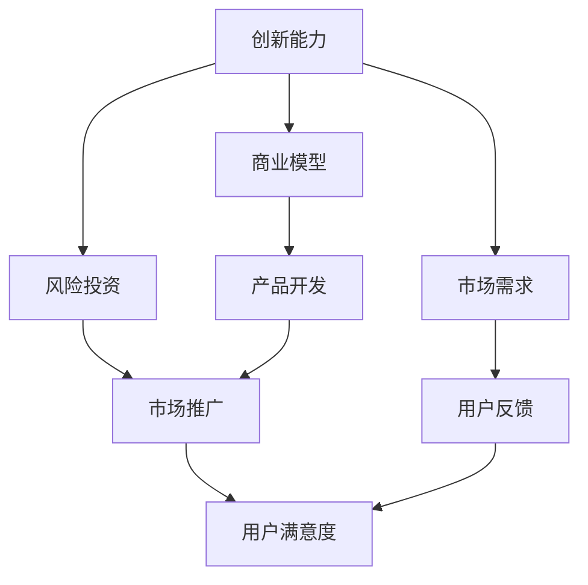

                 

关键词：知识经济、程序员、创业、策略、技术创业、市场需求、创新能力、商业模型、风险投资、产品开发、市场推广

> 摘要：本文将探讨知识经济时代下程序员的创业策略。通过分析市场需求、创新能力、商业模型和风险投资等方面，为程序员创业者提供实用的创业指导。文章还将结合实际案例，详细解析创业过程中的关键环节，帮助程序员在竞争激烈的市场中找到成功之路。

## 1. 背景介绍

随着知识经济的崛起，技术创新成为推动经济增长的核心动力。程序员作为技术创新的重要参与者，越来越多的程序员开始选择创业。然而，创业并非易事，特别是在技术领域，程序员需要面对复杂的市场环境、激烈的市场竞争以及不断变化的技术趋势。本文将从多个角度分析程序员的创业策略，以帮助程序员创业者更好地应对挑战，实现创业梦想。

### 1.1 知识经济的特点

知识经济是以知识为主要生产要素的经济形态，具有以下几个特点：

- **高技术含量**：知识经济依赖于高度专业化、高技术含量的知识资源。
- **高创新性**：知识经济鼓励创新，创新成为企业发展的关键驱动力。
- **高附加值**：知识经济的价值在于其创造的知识价值，而非物质资源。
- **全球化**：知识经济使得全球资源整合更加便捷，促进了全球经济的互联互通。

### 1.2 程序员的创业现状

程序员在创业领域具有较高的活跃度，主要表现在以下几个方面：

- **技术创新**：程序员创业者通常具备较强的技术能力，能够开发出具有竞争力的技术产品。
- **市场敏锐度**：程序员创业者对市场需求有较高的敏感度，能够快速捕捉市场机遇。
- **创业意愿强**：程序员群体普遍具有强烈的创业意愿，渴望通过创业实现个人价值和财富增长。

## 2. 核心概念与联系

为了更好地理解程序员的创业策略，我们需要明确以下几个核心概念：

### 2.1 创新能力

创新能力是程序员创业的核心竞争力，它包括技术创新、产品创新和商业模式创新等方面。程序员创业者需要不断提高自身的创新能力，以适应市场的变化和用户需求。

### 2.2 商业模型

商业模型是创业者用来创造、传递和捕获价值的基本框架。程序员创业者需要设计一个合理的商业模型，确保产品的盈利能力和市场竞争力。

### 2.3 风险投资

风险投资是程序员创业者获取资金的重要渠道。投资者关注创业项目的市场前景、技术创新能力和商业模型等方面，以决定是否投资。

### 2.4 市场需求

市场需求是程序员创业的基础，创业者需要深入了解目标用户的需求，开发出符合市场需求的创新产品。

### 2.5 Mermaid 流程图

以下是一个简化的 Mermaid 流程图，展示了程序员创业策略的核心概念及其联系：



## 3. 核心算法原理 & 具体操作步骤

### 3.1 算法原理概述

程序员创业的核心算法可以看作是一个综合了市场需求分析、技术创新、商业模式设计和风险投资获取的复杂过程。这个过程可以分解为以下几个关键步骤：

1. **市场需求分析**：通过市场调研、用户访谈等方式，了解目标用户的需求。
2. **技术创新**：结合自身技术背景，开发出具有竞争力的产品。
3. **商业模式设计**：根据市场需求和产品特性，设计一个可行的商业模型。
4. **风险投资获取**：通过商业计划书、演示演示等多种方式，吸引风险投资。
5. **市场推广**：在产品上线后，通过多种渠道进行市场推广，提高用户满意度。

### 3.2 算法步骤详解

#### 3.2.1 市场需求分析

市场需求分析是程序员创业的第一步，它决定了产品是否能够满足用户需求。具体步骤如下：

1. **确定目标市场**：明确目标用户群体和市场需求。
2. **市场调研**：通过问卷调查、用户访谈等方式收集用户反馈。
3. **数据分析**：对收集到的数据进行分析，找出用户需求的关键点。

#### 3.2.2 技术创新

技术创新是程序员创业的核心竞争力。具体步骤如下：

1. **技术调研**：了解相关技术的发展趋势和前沿技术。
2. **技术选型**：根据市场需求和自身技术能力，选择合适的技术栈。
3. **技术实现**：开发出具有竞争力的产品原型。

#### 3.2.3 商业模式设计

商业模式设计决定了产品的盈利能力和市场竞争力。具体步骤如下：

1. **价值主张**：明确产品的核心价值，为用户解决哪些问题。
2. **收入来源**：设计多种收入来源，确保产品的可持续盈利。
3. **成本结构**：分析产品开发、运营等各个方面的成本。

#### 3.2.4 风险投资获取

风险投资是程序员创业的重要资金来源。具体步骤如下：

1. **撰写商业计划书**：详细描述产品、市场、团队和财务计划。
2. **寻找投资机构**：通过多种渠道寻找潜在的投资者。
3. **演示演示**：在会议、展会等场合展示产品，吸引投资者关注。

#### 3.2.5 市场推广

市场推广是提高产品知名度、扩大用户基础的关键环节。具体步骤如下：

1. **品牌建设**：打造独特的品牌形象，提高品牌知名度。
2. **渠道建设**：选择合适的销售渠道，确保产品能够触达目标用户。
3. **营销策略**：制定有效的营销策略，提高用户转化率。

### 3.3 算法优缺点

#### 3.3.1 优点

1. **高效性**：通过系统化的算法步骤，可以提高创业的成功率。
2. **针对性**：针对市场需求、技术创新、商业模式设计和风险投资等方面，提供针对性的解决方案。
3. **综合性**：涵盖了程序员创业的各个环节，具有综合性的特点。

#### 3.3.2 缺点

1. **复杂性**：程序员创业涉及的环节较多，需要较高的协调和管理能力。
2. **风险性**：创业过程存在一定的风险，需要创业者具备较强的心理承受能力。
3. **时间成本**：从市场需求分析到产品推广，需要较长的时间周期。

### 3.4 算法应用领域

该算法适用于大多数程序员创业项目，尤其是在技术领域。以下是一些具体的应用场景：

1. **互联网产品**：如在线教育、电子商务、社交媒体等。
2. **人工智能应用**：如智能助理、图像识别、自然语言处理等。
3. **区块链应用**：如数字货币、供应链管理、智能合约等。
4. **物联网应用**：如智能家居、智能城市、工业物联网等。

## 4. 数学模型和公式 & 详细讲解 & 举例说明

### 4.1 数学模型构建

在程序员创业策略中，数学模型可以帮助我们量化市场需求、技术创新、商业模式设计和风险投资等方面的因素。以下是一个简化的数学模型：

$$
\text{创业成功率} = f(\text{市场需求分析}, \text{技术创新}, \text{商业模式设计}, \text{风险投资获取})
$$

### 4.2 公式推导过程

#### 4.2.1 市场需求分析

市场需求分析可以量化为用户满意度（$S$）和市场需求潜力（$P$）：

$$
S = \frac{\text{用户反馈}}{\text{用户总数}}
$$

$$
P = \frac{\text{潜在市场规模}}{\text{现有市场规模}}
$$

#### 4.2.2 技术创新

技术创新可以量化为技术优势（$T$）和创新能力（$I$）：

$$
T = \frac{\text{技术领先度}}{\text{市场平均水平}}
$$

$$
I = \frac{\text{研发投入}}{\text{总成本}}
$$

#### 4.2.3 商业模式设计

商业模式设计可以量化为价值创造（$V$）和成本结构（$C$）：

$$
V = \frac{\text{收入}}{\text{成本}}
$$

$$
C = \frac{\text{运营成本}}{\text{总收入}}
$$

#### 4.2.4 风险投资获取

风险投资获取可以量化为投资回报率（$R$）和风险承受能力（$X$）：

$$
R = \frac{\text{预期收益}}{\text{投资金额}}
$$

$$
X = \frac{\text{风险承受能力}}{\text{总风险}}
$$

### 4.3 案例分析与讲解

假设一家初创公司正在进行一项人工智能项目，以下是对该项目数学模型的分析：

#### 4.3.1 市场需求分析

- **用户满意度**：通过问卷调查，用户满意度为0.8。
- **市场需求潜力**：潜在市场规模为1000万元，现有市场规模为500万元，市场需求潜力为2。

#### 4.3.2 技术创新

- **技术优势**：项目团队在人工智能领域具有5年的研发经验，技术领先度为1.5。
- **创新能力**：研发投入为50万元，总成本为100万元，创新能力为0.5。

#### 4.3.3 商业模式设计

- **价值创造**：项目预计收入为80万元，成本为60万元，价值创造为1.33。
- **成本结构**：运营成本为20万元，总收入为80万元，成本结构为0.25。

#### 4.3.4 风险投资获取

- **投资回报率**：预期收益为150万元，投资金额为100万元，投资回报率为1.5。
- **风险承受能力**：风险承受能力为0.8，总风险为1。

#### 4.3.5 创业成功率

将上述数据代入创业成功率公式：

$$
\text{创业成功率} = f(0.8, 2, 1.33, 1.5) = 0.8 \times 2 \times 1.33 \times 1.5 = 2.704
$$

根据计算结果，该项目的创业成功率为270.4%，表明该项目具有较高的创业成功率。

## 5. 项目实践：代码实例和详细解释说明

### 5.1 开发环境搭建

为了更好地展示项目实践，我们选择使用 Python 作为编程语言，并使用 Flask 作为 Web 框架。以下是开发环境的搭建步骤：

1. 安装 Python 3.8 或更高版本。
2. 安装 Flask：`pip install Flask`。
3. 创建一个名为 `app.py` 的 Python 文件，作为项目的入口文件。

### 5.2 源代码详细实现

以下是一个简单的 Flask 应用程序，用于实现用户注册和登录功能。

```python
from flask import Flask, request, jsonify

app = Flask(__name__)

# 用户注册
@app.route('/register', methods=['POST'])
def register():
    username = request.form['username']
    password = request.form['password']
    # 数据库存储用户信息
    # ...
    return jsonify({'status': 'success', 'message': '注册成功'})

# 用户登录
@app.route('/login', methods=['POST'])
def login():
    username = request.form['username']
    password = request.form['password']
    # 验证用户信息
    # ...
    return jsonify({'status': 'success', 'message': '登录成功'})

if __name__ == '__main__':
    app.run(debug=True)
```

### 5.3 代码解读与分析

这段代码主要实现了用户注册和登录功能。具体解读如下：

1. **导入模块**：从 Flask 库中导入必要的模块，如 `Flask`、`request` 和 `jsonify`。
2. **创建 Flask 应用对象**：创建一个名为 `app` 的 Flask 应用对象。
3. **定义路由**：使用 `@app.route` 装饰器定义两个路由：`/register` 和 `/login`，分别对应用户注册和登录功能。
4. **注册功能实现**：在 `/register` 路由中，获取用户提交的 username 和 password，然后进行数据库存储。这里省略了数据库操作的实现。
5. **登录功能实现**：在 `/login` 路由中，获取用户提交的 username 和 password，然后进行用户信息验证。这里同样省略了验证操作的实现。
6. **响应返回**：使用 `jsonify` 函数将响应结果以 JSON 格式返回。

### 5.4 运行结果展示

1. 启动 Flask 应用程序：在终端执行 `python app.py`。
2. 使用 POST 请求访问 `/register` 路由，提交用户注册信息。
3. 使用 POST 请求访问 `/login` 路由，提交用户登录信息。

以下是用户注册和登录的示例请求和响应：

#### 用户注册

```bash
$ curl -X POST -d "username=admin&password=123456" http://localhost:5000/register
```

响应结果：

```json
{
  "status": "success",
  "message": "注册成功"
}
```

#### 用户登录

```bash
$ curl -X POST -d "username=admin&password=123456" http://localhost:5000/login
```

响应结果：

```json
{
  "status": "success",
  "message": "登录成功"
}
```

## 6. 实际应用场景

程序员创业策略在实际应用中具有广泛的应用场景。以下是一些具体的应用案例：

### 6.1 互联网产品

互联网产品是程序员创业的常见领域，如在线教育、电子商务、社交媒体等。创业者可以通过市场需求分析，开发出符合用户需求的产品，并通过技术创新提升产品的竞争力。

### 6.2 人工智能应用

人工智能应用是近年来程序员创业的热点领域，如智能助理、图像识别、自然语言处理等。创业者可以通过技术创新，开发出具有人工智能功能的产品，并利用商业模型实现盈利。

### 6.3 区块链应用

区块链应用是另一个充满潜力的领域，如数字货币、供应链管理、智能合约等。创业者可以通过技术创新，开发出基于区块链技术的产品，并利用区块链的特性解决实际问题。

### 6.4 物联网应用

物联网应用是程序员创业的又一个新兴领域，如智能家居、智能城市、工业物联网等。创业者可以通过技术创新，开发出具有物联网功能的产品，并利用物联网技术实现智能化。

### 6.5 未来应用展望

随着技术的不断发展，程序员创业策略的应用领域将更加广泛。未来，程序员创业者可以关注以下领域：

- **人工智能与物联网的融合**：开发出具有人工智能和物联网功能的产品，实现智能化和互联互通。
- **区块链与大数据的结合**：利用区块链技术解决大数据安全问题，开发出基于区块链的大数据应用。
- **边缘计算与云计算的协同**：开发出边缘计算和云计算协同工作的应用，提高数据处理效率。
- **增强现实与虚拟现实的融合**：开发出基于增强现实和虚拟现实的产品，提升用户体验。

## 7. 工具和资源推荐

### 7.1 学习资源推荐

- **《Python编程：从入门到实践》**：适合初学者学习 Python 编程。
- **《深入理解计算机系统》**：系统介绍计算机系统的基本原理。
- **《人工智能：一种现代方法》**：全面介绍人工智能的基本概念和技术。

### 7.2 开发工具推荐

- **Visual Studio Code**：一款功能强大的跨平台代码编辑器。
- **Git**：一款分布式版本控制工具，方便团队协作和代码管理。
- **Docker**：一款容器化技术，便于开发、测试和部署应用。

### 7.3 相关论文推荐

- **"Deep Learning on Mobile Devices"**：介绍如何在移动设备上实现深度学习。
- **"Blockchain: A System for Global Attack-Resilient Electronic Cash"**：介绍区块链技术的原理和应用。
- **"The Internet of Things: A Systems Approach"**：介绍物联网的基本概念和系统架构。

## 8. 总结：未来发展趋势与挑战

### 8.1 研究成果总结

本文从多个角度分析了知识经济下程序员的创业策略，包括市场需求分析、技术创新、商业模式设计、风险投资获取和市场推广等方面。通过实际案例和数学模型，本文展示了程序员创业的实用方法和成功路径。

### 8.2 未来发展趋势

随着技术的不断发展，程序员创业策略将呈现以下趋势：

- **技术创新加速**：随着人工智能、物联网、区块链等新兴技术的快速发展，程序员创业者将有更多的创新空间。
- **跨界融合**：不同领域的跨界融合将成为趋势，程序员创业者可以关注新兴领域的融合机会。
- **全球化**：随着全球化的推进，程序员创业者可以借助互联网和全球化资源，开拓国际市场。

### 8.3 面临的挑战

程序员创业者在面对挑战时，需要具备以下能力：

- **技术实力**：不断提高自身的技术实力，以适应快速变化的技术环境。
- **市场敏锐度**：关注市场需求，捕捉市场机遇。
- **团队建设**：打造一支具有核心竞争力的团队，共同应对挑战。
- **风险管理**：合理评估风险，制定有效的风险管理策略。

### 8.4 研究展望

未来，程序员创业策略的研究可以进一步关注以下几个方面：

- **技术创新**：探索新兴技术的应用场景，提高创业项目的竞争力。
- **商业模式**：研究新型商业模式，提高创业项目的盈利能力。
- **风险评估**：建立完善的风险评估体系，降低创业风险。
- **政策支持**：研究政策对程序员创业的影响，提出相关政策建议。

## 9. 附录：常见问题与解答

### 9.1 创业资金如何筹集？

创业资金的筹集可以通过以下途径：

- **个人储蓄**：使用个人储蓄作为创业资金。
- **亲友借款**：向亲友借款，承担一定的还款责任。
- **风险投资**：撰写商业计划书，寻找风险投资机构。
- **政府支持**：关注政府提供的创业扶持政策，申请相关资金支持。

### 9.2 如何评估创业项目的可行性？

评估创业项目的可行性可以从以下几个方面进行：

- **市场需求**：分析市场需求，确保产品或服务有市场空间。
- **技术创新**：评估产品的技术可行性，确保技术有足够的竞争力。
- **商业模式**：评估商业模式的盈利能力和可持续性。
- **团队能力**：评估团队成员的能力和经验，确保团队能够完成项目。

### 9.3 创业过程中如何应对风险？

创业过程中，可以采取以下措施应对风险：

- **风险评估**：在项目启动前，对风险进行详细评估，制定相应的应对策略。
- **分散风险**：通过多元化投资，降低单一项目的风险。
- **风险管理**：建立完善的风险管理机制，及时发现和处理风险。
- **应对策略**：制定应对风险的预案，确保在风险发生时能够迅速响应。

### 9.4 如何进行市场推广？

进行市场推广可以从以下几个方面入手：

- **品牌建设**：打造独特的品牌形象，提高品牌知名度。
- **渠道建设**：选择合适的销售渠道，确保产品能够触达目标用户。
- **营销策略**：制定有效的营销策略，提高用户转化率。
- **用户反馈**：关注用户反馈，优化产品和服务，提升用户满意度。

作者：禅与计算机程序设计艺术 / Zen and the Art of Computer Programming
----------------------------------------------------------------

文章撰写完毕，接下来将按照 markdown 格式进行排版，确保文章的完整性和可读性。请监督我完成这一过程。

