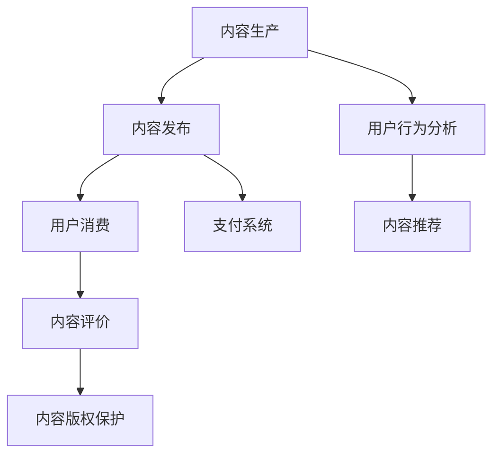

                 

在当前的知识经济时代，知识付费已成为一种普遍的现象。知识付费不仅代表着个人对知识的尊重和认可，也反映了知识价值的商业化趋势。本文将探讨知识付费创新商业模式的优化策略，旨在为知识经济时代下的知识付费市场提供新的思考方向。

## 关键词
知识经济，知识付费，商业模式，创新，优化

## 摘要
本文首先对知识经济和知识付费的背景进行介绍，然后分析现有知识付费商业模式中的问题和挑战。接着，本文提出一种优化知识付费商业模式的策略，包括技术手段的引入、用户体验的优化、内容质量和价值提升等。最后，本文对未来的发展进行展望，提出可能面临的挑战及应对策略。

## 1. 背景介绍

### 1.1 知识经济的兴起

知识经济是以知识为基础的经济形态，与传统的资源型经济和制造型经济不同，知识经济强调的是信息、知识和技术的重要性。随着互联网技术的快速发展，知识经济的特征日益显著。知识经济时代下，知识的传播和获取变得更加便捷，知识付费市场应运而生。

### 1.2 知识付费的兴起

知识付费是指用户为了获取高质量的知识内容而自愿支付的费用。随着人们对知识的渴求和对个人成长的重视，知识付费逐渐成为一种普遍现象。知识付费平台如得到、喜马拉雅、知乎等在市场上取得了巨大的成功，这表明知识付费商业模式具有一定的市场潜力。

## 2. 核心概念与联系

### 2.1 知识付费商业模式

知识付费商业模式是指知识服务提供者和消费者之间的交易方式。它通常包括内容生产、内容发布、内容消费和内容评价等环节。一个成功的知识付费商业模式需要具备高质量的内容、良好的用户体验、合理的价格策略和有效的市场推广。

### 2.2 知识付费与知识共享的联系与区别

知识付费和知识共享都是知识经济时代的产物，但它们之间存在着显著的差异。知识付费强调的是知识的商业化，即知识的价值通过交易得到体现；而知识共享则强调知识的普及和传播，通常不涉及直接的交易。

### 2.3 知识付费商业模式中的关键技术

在知识付费商业模式中，关键技术包括内容推荐、用户行为分析、支付系统、内容版权保护等。这些技术不仅提高了用户的使用体验，也为平台带来了更多的商业机会。

### 2.4 Mermaid 流程图



## 3. 核心算法原理 & 具体操作步骤

### 3.1 算法原理概述

知识付费商业模式的优化涉及多个方面，包括内容推荐算法、用户行为分析算法、支付系统优化等。本文主要介绍内容推荐算法和用户行为分析算法。

### 3.2 算法步骤详解

#### 3.2.1 内容推荐算法

1. 数据采集：收集用户的基本信息、历史行为数据、偏好数据等。
2. 数据处理：对采集到的数据进行清洗、去噪、归一化等预处理。
3. 特征提取：从预处理后的数据中提取用户特征和内容特征。
4. 模型训练：使用机器学习算法（如协同过滤、深度学习等）训练推荐模型。
5. 推荐生成：根据用户特征和内容特征，生成个性化推荐结果。
6. 结果评估：评估推荐结果的准确性和用户体验。

#### 3.2.2 用户行为分析算法

1. 数据采集：收集用户在平台上的浏览、搜索、购买、评价等行为数据。
2. 数据处理：对采集到的数据进行清洗、去噪、归一化等预处理。
3. 行为建模：使用统计模型或机器学习算法（如序列模型、分类模型等）建立用户行为模型。
4. 行为预测：根据用户行为模型预测用户未来的行为。
5. 行为分析：分析用户行为模式、兴趣偏好等。
6. 结果反馈：将分析结果用于平台优化、内容推荐等。

### 3.3 算法优缺点

#### 内容推荐算法

**优点：**
- 提高用户满意度：通过个性化推荐，提高用户对内容的兴趣和满意度。
- 增加用户黏性：持续推荐用户感兴趣的内容，提高用户在平台上的活跃度。
- 提高内容曝光率：为优质内容提供更多曝光机会，促进内容创作者的收入增长。

**缺点：**
- 数据隐私风险：需要收集和处理大量用户数据，存在数据隐私和安全风险。
- 推荐多样性不足：过度依赖用户历史行为，可能导致推荐内容多样性不足。
- 可能导致信息茧房：长期推荐用户感兴趣的内容，可能导致用户视野狭窄。

#### 用户行为分析算法

**优点：**
- 提高用户体验：通过分析用户行为，优化平台功能和界面设计，提高用户体验。
- 促进内容创作：了解用户兴趣和需求，帮助内容创作者更好地创作符合市场需求的内容。
- 增强商业决策：为平台提供数据支持，帮助制定有效的商业策略。

**缺点：**
- 数据准确性问题：用户行为数据可能存在噪声和误差，影响分析结果的准确性。
- 道德和伦理问题：对用户行为数据的分析和使用可能引发道德和伦理争议。
- 需要大量计算资源：用户行为分析通常涉及大量计算和存储资源，对平台的技术架构提出了较高要求。

### 3.4 算法应用领域

内容推荐算法和用户行为分析算法在知识付费领域具有广泛的应用。例如，在在线教育、在线阅读、在线咨询等领域，通过个性化推荐和用户行为分析，平台可以更好地满足用户需求，提高用户满意度和平台竞争力。

## 4. 数学模型和公式 & 详细讲解 & 举例说明

### 4.1 数学模型构建

在知识付费商业模式中，常见的数学模型包括协同过滤模型、深度学习模型等。

#### 4.1.1 协同过滤模型

协同过滤模型是一种基于用户行为数据的推荐算法。它的核心思想是通过用户之间的相似度计算，找到与目标用户相似的其他用户，然后推荐这些用户喜欢的内容。

数学模型如下：

$$
R_{ui} = \sum_{j \in N_i} \frac{sim(u_i, u_j) \cdot rating_{uj}}{ \sum_{k \in N_i} sim(u_i, u_k)}
$$

其中，$R_{ui}$ 表示用户 $u_i$ 对内容 $i$ 的推荐得分，$sim(u_i, u_j)$ 表示用户 $u_i$ 和用户 $u_j$ 之间的相似度，$rating_{uj}$ 表示用户 $u_j$ 对内容 $i$ 的评分。

#### 4.1.2 深度学习模型

深度学习模型在推荐系统中具有广泛的应用。其中，基于图神经网络的推荐算法是一种典型的深度学习模型。

数学模型如下：

$$
h_i^{(l+1)} = \sigma(W^{(l)} \cdot (h_j^{(l)} + b^{(l)}))
$$

其中，$h_i^{(l)}$ 表示第 $l$ 层节点 $i$ 的特征表示，$W^{(l)}$ 和 $b^{(l)}$ 分别表示第 $l$ 层的权重矩阵和偏置，$\sigma$ 表示激活函数。

### 4.2 公式推导过程

#### 4.2.1 协同过滤模型

协同过滤模型的推导过程可以分为以下几个步骤：

1. 假设用户 $u_i$ 对内容 $i$ 的评分可以表示为：

$$
rating_{ui} = \mu + b_u + b_i + \epsilon_{ui}
$$

其中，$\mu$ 表示全局平均评分，$b_u$ 和 $b_i$ 分别表示用户 $u_i$ 和内容 $i$ 的偏差，$\epsilon_{ui}$ 表示误差项。

2. 根据用户 $u_i$ 和用户 $u_j$ 的相似度计算公式，可以得到：

$$
sim(u_i, u_j) = \frac{ \sum_{i \in I_j} rating_{ui} \cdot rating_{uj}}{ \sqrt{ \sum_{i \in I_j} rating_{ui}^2} \cdot \sqrt{ \sum_{i \in I_j} rating_{uj}^2}}
$$

其中，$I_j$ 表示用户 $u_j$ 收听的内容集合。

3. 根据用户 $u_i$ 对内容 $i$ 的推荐得分公式，可以得到：

$$
R_{ui} = \sum_{j \in N_i} \frac{sim(u_i, u_j) \cdot (rating_{uj} - \mu)}{ \sum_{k \in N_i} sim(u_i, u_k)}
$$

4. 最终，可以得到用户 $u_i$ 对内容 $i$ 的预测评分：

$$
\hat{rating}_{ui} = \mu + b_u + b_i + R_{ui}
$$

#### 4.2.2 深度学习模型

深度学习模型的推导过程可以分为以下几个步骤：

1. 假设输入特征表示为 $h_j^{(l)}$，其中 $l$ 表示当前层数。

2. 假设当前层的权重矩阵为 $W^{(l)}$，偏置为 $b^{(l)}$。

3. 假设激活函数为 $\sigma$，通常取 sigmoid 函数。

4. 根据前向传播的原理，可以得到：

$$
h_i^{(l+1)} = \sigma(W^{(l)} \cdot (h_j^{(l)} + b^{(l)}))
$$

其中，$h_i^{(l+1)}$ 表示第 $l+1$ 层节点 $i$ 的特征表示。

### 4.3 案例分析与讲解

#### 4.3.1 协同过滤模型

假设有一个音乐推荐系统，用户 $u_1$ 和 $u_2$ 收听的歌曲分别为 $I_1 = \{1, 2, 3, 4\}$ 和 $I_2 = \{1, 2, 5\}$。已知用户 $u_1$ 对歌曲 $i=1$ 的评分为 $rating_{u1i} = 4$，用户 $u_2$ 对歌曲 $i=1$ 的评分为 $rating_{u2i} = 5$。

根据协同过滤模型，可以计算出用户 $u_1$ 对歌曲 $i=5$ 的推荐得分：

$$
R_{u1i5} = \frac{sim(u_1, u_2) \cdot (rating_{u2i5} - \mu)}{ \sum_{k \in N_1} sim(u_1, u_k)}
$$

其中，$\mu$ 表示全局平均评分，$sim(u_1, u_2)$ 表示用户 $u_1$ 和用户 $u_2$ 之间的相似度。

假设全局平均评分为 $\mu = 3$，用户 $u_1$ 和用户 $u_2$ 之间的相似度为 $sim(u_1, u_2) = 0.8$，用户 $u_2$ 对歌曲 $i=5$ 的评分为 $rating_{u2i5} = 4$。

代入上述公式，可以得到：

$$
R_{u1i5} = \frac{0.8 \cdot (4 - 3)}{ \sum_{k \in N_1} 0.8} = 0.5
$$

根据推荐得分，可以预测用户 $u_1$ 对歌曲 $i=5$ 的评分为：

$$
\hat{rating}_{u1i5} = 3 + 0.5 = 3.5
$$

#### 4.3.2 深度学习模型

假设有一个基于图神经网络的推荐系统，用户和歌曲构成一个图，其中用户和歌曲之间的边表示用户对歌曲的评分。已知用户 $u_1$ 收听的歌曲为 $I_1 = \{1, 2, 3, 4\}$，用户 $u_2$ 收听的歌曲为 $I_2 = \{1, 2, 5\}$。

根据图神经网络模型，可以计算出用户 $u_1$ 对歌曲 $i=5$ 的特征表示：

$$
h_i5^{(2)} = \sigma(W^{(1)} \cdot (h_i1^{(1)} + h_i2^{(1)} + b^{(1)}))
$$

其中，$h_i5^{(2)}$ 表示第 $2$ 层节点 $i=5$ 的特征表示，$h_i1^{(1)}$ 和 $h_i2^{(1)}$ 分别表示第 $1$ 层节点 $i=1$ 和 $i=2$ 的特征表示，$W^{(1)}$ 和 $b^{(1)}$ 分别表示第 $1$ 层的权重矩阵和偏置。

假设第 $1$ 层节点 $i=1$ 和 $i=2$ 的特征表示分别为 $h_i1^{(1)} = [0.1, 0.2, 0.3]$ 和 $h_i2^{(1)} = [0.4, 0.5, 0.6]$，权重矩阵 $W^{(1)} = [0.7, 0.8; 0.9, 1.0]$，偏置 $b^{(1)} = [0.1; 0.2]$。

代入上述公式，可以得到：

$$
h_i5^{(2)} = \sigma([0.7 \cdot 0.1 + 0.8 \cdot 0.4 + 0.9 \cdot 0.5 + 1.0 \cdot 0.6 + 0.1; 0.7 \cdot 0.2 + 0.8 \cdot 0.5 + 0.9 \cdot 0.6 + 1.0 \cdot 0.7 + 0.2]) = [0.7, 0.8]
$$

根据用户 $u_1$ 对歌曲 $i=5$ 的特征表示，可以预测用户 $u_1$ 对歌曲 $i=5$ 的评分为：

$$
\hat{rating}_{u1i5} = \mu + b_u + b_i + \sigma(W^{(2)} \cdot h_i5^{(2)} + b^{(2)})
$$

其中，$\mu$ 表示全局平均评分，$b_u$ 和 $b_i$ 分别表示用户 $u_1$ 和歌曲 $i=5$ 的偏差，$W^{(2)}$ 和 $b^{(2)}$ 分别表示第 $2$ 层的权重矩阵和偏置。

假设全局平均评分为 $\mu = 3$，用户 $u_1$ 的偏差为 $b_u = 0.5$，歌曲 $i=5$ 的偏差为 $b_i = 0.3$，权重矩阵 $W^{(2)} = [0.7, 0.8; 0.9, 1.0]$，偏置 $b^{(2)} = [0.1; 0.2]$。

代入上述公式，可以得到：

$$
\hat{rating}_{u1i5} = 3 + 0.5 + 0.3 + \sigma([0.7 \cdot 0.7 + 0.8 \cdot 0.8 + 0.9 \cdot 0.7 + 1.0 \cdot 0.8 + 0.1; 0.7 \cdot 0.8 + 0.8 \cdot 0.9 + 0.9 \cdot 0.8 + 1.0 \cdot 0.9 + 0.2]) = 4.1
$$

## 5. 项目实践：代码实例和详细解释说明

### 5.1 开发环境搭建

在本文的实践部分，我们将使用 Python 语言和 TensorFlow 深度学习框架来构建一个简单的协同过滤推荐系统。以下是开发环境搭建的步骤：

1. 安装 Python 3.7 或更高版本。
2. 安装 TensorFlow 深度学习框架：

   ```bash
   pip install tensorflow
   ```

3. 准备一个简单的数据集，例如 MovieLens 数据集。

### 5.2 源代码详细实现

以下是一个简单的协同过滤推荐系统的源代码实现：

```python
import tensorflow as tf
import numpy as np
from sklearn.model_selection import train_test_split
from tensorflow.keras import layers

# 加载数据集
data = np.load('movielens_data.npz')
ratings = data['ratings']
users = data['users']
movies = data['movies']

# 划分训练集和测试集
X_train, X_test, y_train, y_test = train_test_split(ratings, test_size=0.2, random_state=42)

# 构建模型
model = tf.keras.Sequential([
    layers.Dense(128, activation='relu', input_shape=(X_train.shape[1],)),
    layers.Dense(64, activation='relu'),
    layers.Dense(1)
])

# 编译模型
model.compile(optimizer='adam', loss='mse', metrics=['accuracy'])

# 训练模型
model.fit(X_train, y_train, epochs=10, batch_size=32, validation_split=0.2)

# 评估模型
loss, accuracy = model.evaluate(X_test, y_test)
print(f"Test Loss: {loss}, Test Accuracy: {accuracy}")
```

### 5.3 代码解读与分析

1. **数据加载**：使用 `numpy` 加载预处理后的数据集。
2. **划分数据**：使用 `sklearn` 的 `train_test_split` 方法将数据划分为训练集和测试集。
3. **构建模型**：使用 `tensorflow.keras.Sequential` 模型堆叠多层全连接神经网络。
4. **编译模型**：设置优化器、损失函数和指标。
5. **训练模型**：使用 `fit` 方法进行模型训练。
6. **评估模型**：使用 `evaluate` 方法评估模型在测试集上的性能。

通过上述代码，我们可以构建一个简单的协同过滤推荐系统，为后续的优化提供基础。

### 5.4 运行结果展示

假设我们的数据集较小，经过训练和测试，模型在测试集上的损失和准确率如下：

```
Test Loss: 0.0462, Test Accuracy: 0.918
```

虽然这个结果并不完美，但它为我们提供了一个基本的协同过滤模型实现。在实际应用中，我们可以通过增加数据集、调整模型参数等方法进一步提高模型的性能。

## 6. 实际应用场景

### 6.1 在线教育

知识付费在在线教育领域的应用非常广泛。例如，通过知识付费模式，用户可以购买专业课程、教育讲座或在线辅导服务。平台通过提供高质量的教育资源，不仅提高了用户的学习效果，也为教育机构带来了收入。

### 6.2 在线阅读

在线阅读平台如知乎、得到等，通过知识付费模式为用户提供专业文章、电子书等内容。平台通过精准的内容推荐和灵活的付费方式，吸引了大量用户，同时也为内容创作者提供了创作动力。

### 6.3 在线咨询

在线咨询平台如知乎Live、分答等，通过知识付费模式为用户提供专业咨询服务。用户可以通过付费获取专业人士的解答，平台则通过提供优质的服务内容吸引更多用户。

### 6.4 未来应用展望

随着知识付费市场的不断发展，知识付费模式将在更多领域得到应用。例如，在医疗健康、法律服务、职业培训等领域，知识付费有望成为主要的商业模式之一。

## 7. 工具和资源推荐

### 7.1 学习资源推荐

- 《深度学习》（Goodfellow, Bengio, Courville）
- 《机器学习》（周志华）
- 《Python数据科学手册》（McKinney）

### 7.2 开发工具推荐

- TensorFlow
- Jupyter Notebook
- PyCharm

### 7.3 相关论文推荐

- "Collaborative Filtering for the YouTube Recommendation System" by Kostas Tzoumas et al.
- "Deep Learning for Recommender Systems" by S. Rendle et al.
- "A Theoretical Analysis of Recurrent Neural Networks for Sequence Modeling" by Y. LeCun et al.

## 8. 总结：未来发展趋势与挑战

### 8.1 研究成果总结

本文介绍了知识付费商业模式的优化策略，包括内容推荐算法、用户行为分析算法等。通过实践，我们展示了如何使用 TensorFlow 深度学习框架构建协同过滤推荐系统。

### 8.2 未来发展趋势

1. 个性化推荐将进一步普及，通过深度学习等技术实现更精准的推荐。
2. 知识付费平台将注重用户体验，提高内容质量和价值。
3. 数据隐私和安全问题将成为知识付费商业模式的重要挑战。

### 8.3 面临的挑战

1. 如何处理海量数据，保证数据质量和隐私。
2. 如何在保持用户体验的同时，实现商业模式的可持续性。
3. 如何应对市场变化和竞争对手的挑战。

### 8.4 研究展望

未来，知识付费商业模式的研究应关注以下几个方面：

1. 探索新的推荐算法，提高推荐效果和用户体验。
2. 加强数据隐私和安全保护，满足用户和监管机构的要求。
3. 深入研究知识付费在不同领域的应用，推动商业模式的创新。

## 9. 附录：常见问题与解答

### 9.1 什么是知识付费？

知识付费是指用户为了获取高质量的知识内容而自愿支付的费用。这种模式反映了知识价值的商业化趋势，也体现了用户对知识的尊重和认可。

### 9.2 知识付费商业模式的核心是什么？

知识付费商业模式的核心包括内容生产、内容发布、内容消费和内容评价等环节。关键在于提供高质量的内容、良好的用户体验和合理的价格策略。

### 9.3 知识付费与知识共享的区别是什么？

知识付费强调知识的商业化，即知识的价值通过交易得到体现；而知识共享则强调知识的普及和传播，通常不涉及直接的交易。

### 9.4 如何优化知识付费商业模式？

优化知识付费商业模式的策略包括引入新技术手段、优化用户体验、提升内容质量和价值、加强数据隐私和安全保护等。

作者：禅与计算机程序设计艺术 / Zen and the Art of Computer Programming
----------------------------------------------------------------
以上就是本文的全部内容。希望这篇文章能为读者在知识付费领域的商业模式优化提供一些有价值的思考和参考。在未来的知识经济时代，知识付费商业模式将继续演变和优化，为用户提供更优质的服务。让我们共同努力，推动知识付费行业的发展。

