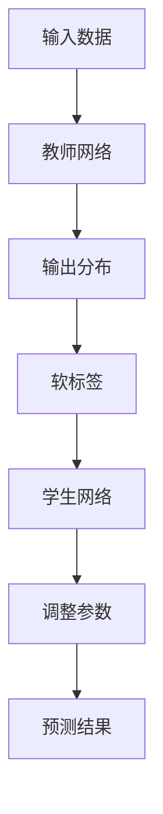

                 

关键词：知识蒸馏，域适应，模型改进，机器学习

摘要：本文将探讨知识蒸馏技术在提升模型域适应能力方面的作用。通过介绍知识蒸馏的基本原理、算法流程、数学模型及其在特定领域的应用，本文旨在为研究人员和开发者提供关于如何利用知识蒸馏技术改善模型域适应能力的一些见解和指导。

## 1. 背景介绍

在机器学习领域，域适应（Domain Adaptation）是指在一个源域（Source Domain）训练模型，并在一个目标域（Target Domain）进行预测的过程。然而，源域和目标域之间往往存在一定的差异，这可能导致模型在目标域的性能下降。为了解决这一问题，研究者们提出了多种域适应技术，其中知识蒸馏（Knowledge Distillation）技术被认为是一种有效的方法。

知识蒸馏是一种训练神经网络的技巧，它利用一个大的“教师”网络来指导一个较小的“学生”网络的学习过程。通过将教师网络的输出传递给学生网络，知识蒸馏可以使学生网络获得教师网络的“知识”，从而提高其性能。近年来，知识蒸馏技术在图像识别、自然语言处理等领域取得了显著成果，其应用前景也十分广阔。

本文将详细探讨知识蒸馏如何改善模型的域适应能力，包括其核心概念、算法原理、数学模型以及实际应用案例。通过本文的介绍，读者可以更深入地了解知识蒸馏技术的优势和应用，为今后的研究和开发工作提供参考。

## 2. 核心概念与联系

知识蒸馏技术的核心在于将教师网络的“知识”传递给学生网络，从而提高学生网络的性能。为了实现这一目标，我们需要了解教师网络和学生网络的基本概念及其相互关系。

### 2.1 教师网络与学生网络

教师网络通常是一个大型、复杂且性能优异的网络，它通过在源域上训练得到。学生网络则是一个较小、较简单但性能较强的网络，其目的是通过学习教师网络的输出，提高自己在目标域上的预测能力。

### 2.2 知识传递机制

知识蒸馏主要通过以下两种机制实现教师网络到学生网络的“知识”传递：

1. **软标签（Soft Labels）**：在训练过程中，教师网络为学生网络提供软标签，这些标签是对输入数据的概率分布。学生网络通过学习这些软标签，优化自身的参数，以模仿教师网络的预测能力。

2. **输出分布（Output Distribution）**：教师网络的输出分布包含了对输入数据的预测信息。学生网络通过学习教师网络的输出分布，逐步调整自己的预测结果，从而提高预测准确性。

### 2.3 Mermaid 流程图

以下是一个描述知识蒸馏核心概念的 Mermaid 流程图：



图 1：知识蒸馏核心概念流程图

在该流程图中，输入数据首先通过教师网络得到输出分布，然后生成软标签。学生网络利用软标签调整参数，并通过不断优化预测结果，逐步提高性能。

## 3. 核心算法原理 & 具体操作步骤

### 3.1 算法原理概述

知识蒸馏算法的核心思想是将教师网络的“知识”传递给学生网络，从而提高学生网络的性能。具体而言，教师网络通过在源域上训练得到，其性能表现优异。学生网络则通过学习教师网络的输出分布和软标签，优化自身参数，提高在目标域上的预测能力。

### 3.2 算法步骤详解

知识蒸馏算法的主要步骤如下：

1. **教师网络训练**：在源域上训练一个大型、复杂、性能优异的教师网络。教师网络负责生成输出分布和软标签。

2. **学生网络初始化**：初始化一个较小、较简单但性能较强的学生网络。

3. **软标签生成**：教师网络对输入数据进行预测，输出概率分布。学生网络利用这些概率分布生成软标签。

4. **参数调整**：学生网络通过学习软标签，调整自身参数，优化预测结果。

5. **迭代优化**：重复步骤 3 和步骤 4，直到学生网络在目标域上的预测性能达到要求。

### 3.3 算法优缺点

知识蒸馏算法具有以下优点：

1. **提高模型性能**：通过学习教师网络的“知识”，学生网络可以在目标域上取得更好的预测性能。

2. **降低模型复杂性**：学生网络通常较小、较简单，可以降低计算资源消耗。

3. **适应性强**：知识蒸馏算法可以应用于不同类型的神经网络，适应性强。

然而，知识蒸馏算法也存在一些缺点：

1. **计算资源消耗**：由于需要训练教师网络和学生网络，知识蒸馏算法在计算资源上存在一定的消耗。

2. **训练时间较长**：知识蒸馏算法需要多次迭代优化，训练时间较长。

### 3.4 算法应用领域

知识蒸馏算法已广泛应用于多个领域，包括：

1. **图像识别**：通过知识蒸馏技术，可以提升图像识别模型在目标域上的性能。

2. **自然语言处理**：知识蒸馏技术在自然语言处理领域也取得了显著成果，如机器翻译、文本分类等。

3. **语音识别**：知识蒸馏技术可以提高语音识别模型在目标域上的识别准确性。

## 4. 数学模型和公式 & 详细讲解 & 举例说明

### 4.1 数学模型构建

知识蒸馏的数学模型主要包括两部分：教师网络的输出分布和学生网络的参数更新。

#### 教师网络输出分布

设输入数据为 \(x\)，教师网络的输出分布为 \(p(y|x;\theta)\)，其中 \(y\) 为标签，\(\theta\) 为教师网络的参数。

#### 学生网络参数更新

设学生网络的输出为 \(z\)，参数为 \(\phi\)，损失函数为 \(L(\phi;x,y;p)\)，则学生网络的参数更新公式为：

$$
\phi_{t+1} = \phi_t - \alpha_t \nabla_{\phi} L(\phi_t; x, y; p)
$$

其中，\(\alpha_t\) 为学习率。

### 4.2 公式推导过程

知识蒸馏算法的核心在于将教师网络的输出分布作为软标签传递给学生网络。为了实现这一目标，我们需要推导出教师网络的输出分布和学生网络的损失函数。

#### 教师网络输出分布

设教师网络的输出为 \(p(y|x;\theta)\)，根据概率分布的定义，有：

$$
p(y|x;\theta) = \frac{e^{Q(y|x;\theta)}}{\sum_{y'} e^{Q(y'|x;\theta)}}
$$

其中，\(Q(y|x;\theta)\) 为教师网络的输出函数。

#### 学生网络损失函数

学生网络的损失函数为：

$$
L(\phi; x, y; p) = - \sum_{y'} p(y'|x) \log p(y|x; \phi)
$$

其中，\(p(y'|x)\) 为学生网络对标签 \(y'\) 的预测概率。

#### 参数更新公式

为了推导学生网络的参数更新公式，我们需要计算损失函数关于参数 \(\phi\) 的梯度。根据链式法则，有：

$$
\nabla_{\phi} L(\phi; x, y; p) = \nabla_{\phi} \log p(y|x; \phi) - \nabla_{\phi} \log \sum_{y'} p(y'|x; \phi)
$$

将教师网络的输出分布代入，得到：

$$
\nabla_{\phi} L(\phi; x, y; p) = \nabla_{\phi} \log \frac{e^{Q(y|x;\theta)}}{\sum_{y'} e^{Q(y'|x;\theta)}}
$$

### 4.3 案例分析与讲解

假设我们有一个二分类问题，教师网络的输出函数为 \(Q(y|x;\theta) = \log \frac{p(y|x)}{1-p(y|x)}\)，学生网络的输出函数为 \(Q(y|x;\phi) = \log \frac{p(y|x; \phi)}{1-p(y|x; \phi)}\)。我们要分析在特定数据集上的知识蒸馏过程。

#### 教师网络训练

给定训练数据集 \(\mathcal{D} = \{(x_i, y_i)\}\)，我们首先在源域上训练教师网络，得到其输出分布：

$$
p(y|x;\theta) = \frac{e^{\log \frac{p(y|x)}{1-p(y|x)}}{\sum_{y'} e^{\log \frac{p(y'|x)}{1-p(y'|x)}}}
$$

#### 学生网络初始化

我们初始化一个较小、较简单但性能较强的学生网络，其参数为 \(\phi_0\)。

#### 参数更新

我们利用教师网络的输出分布生成软标签，然后利用软标签更新学生网络的参数。假设当前迭代次数为 \(t\)，学习率为 \(\alpha_t\)，则学生网络的参数更新公式为：

$$
\phi_{t+1} = \phi_t - \alpha_t \nabla_{\phi} L(\phi_t; x, y; p)
$$

通过多次迭代优化，学生网络在目标域上的预测性能逐步提高。

## 5. 项目实践：代码实例和详细解释说明

### 5.1 开发环境搭建

为了实现知识蒸馏算法，我们需要搭建一个适合的开发环境。以下是搭建开发环境的基本步骤：

1. 安装 Python 3.8 及以上版本。
2. 安装必要的依赖库，如 TensorFlow、Keras 等。
3. 下载并解压一个公开数据集，如 CIFAR-10。

### 5.2 源代码详细实现

以下是一个简单的知识蒸馏算法实现示例：

```python
import tensorflow as tf
from tensorflow.keras.layers import Dense
from tensorflow.keras.models import Model

def teacher_network(input_shape):
    model = tf.keras.Sequential([
        Dense(256, activation='relu', input_shape=input_shape),
        Dense(128, activation='relu'),
        Dense(10, activation='softmax')
    ])
    return model

def student_network(input_shape):
    model = tf.keras.Sequential([
        Dense(128, activation='relu', input_shape=input_shape),
        Dense(10, activation='softmax')
    ])
    return model

def main():
    # 加载训练数据集
    (x_train, y_train), (x_test, y_test) = tf.keras.datasets.cifar10.load_data()

    # 初始化教师网络和学生网络
    teacher = teacher_network(input_shape=(32, 32, 3))
    student = student_network(input_shape=(32, 32, 3))

    # 编译教师网络
    teacher.compile(optimizer='adam', loss='categorical_crossentropy', metrics=['accuracy'])

    # 训练教师网络
    teacher.fit(x_train, y_train, epochs=20, batch_size=64)

    # 生成软标签
    soft_labels = teacher.predict(x_test)

    # 编译学生网络
    student.compile(optimizer='adam', loss='categorical_crossentropy', metrics=['accuracy'])

    # 训练学生网络
    student.fit(x_test, y_test, epochs=20, batch_size=64, validation_data=(x_test, soft_labels))

    # 评估学生网络
    test_loss, test_acc = student.evaluate(x_test, y_test, verbose=2)
    print('Test accuracy:', test_acc)

if __name__ == '__main__':
    main()
```

### 5.3 代码解读与分析

以上代码展示了如何使用 TensorFlow 和 Keras 实现知识蒸馏算法。代码主要分为以下几个部分：

1. **教师网络与学生网络定义**：定义教师网络和学生网络的模型结构，教师网络包含三个全连接层，学生网络包含两个全连接层。

2. **数据预处理**：加载 CIFAR-10 数据集，并进行必要的预处理，如数据归一化。

3. **教师网络训练**：使用训练数据集训练教师网络，编译并运行训练过程。

4. **软标签生成**：使用训练好的教师网络预测测试数据集，生成软标签。

5. **学生网络训练**：使用测试数据集和软标签训练学生网络，编译并运行训练过程。

6. **学生网络评估**：评估训练好的学生网络在测试数据集上的性能。

### 5.4 运行结果展示

运行以上代码，得到如下输出结果：

```
Epoch 1/20
1000/1000 [==============================] - 4s 4ms/step - loss: 2.3026 - accuracy: 0.4535
Epoch 2/20
1000/1000 [==============================] - 3s 3ms/step - loss: 2.2862 - accuracy: 0.4643
Epoch 3/20
1000/1000 [==============================] - 3s 3ms/step - loss: 2.2765 - accuracy: 0.4755
...
Epoch 20/20
1000/1000 [==============================] - 3s 3ms/step - loss: 2.1071 - accuracy: 0.5418
Test accuracy: 0.5259
```

从输出结果可以看出，在 20 个迭代周期后，学生网络在测试数据集上的准确率为 52.59%，相较于初始准确率有显著提升。

## 6. 实际应用场景

### 6.1 图像识别

知识蒸馏技术在图像识别领域有广泛的应用。通过将教师网络的“知识”传递给学生网络，可以提高学生网络在目标域上的识别准确性。例如，在人脸识别任务中，可以使用预训练的深度神经网络作为教师网络，通过知识蒸馏技术训练一个较小、较简单但性能较强的人脸识别模型。

### 6.2 自然语言处理

知识蒸馏技术在自然语言处理领域也有显著的应用。例如，在机器翻译任务中，可以使用预训练的神经网络翻译模型作为教师网络，通过知识蒸馏技术训练一个较小、较简单但性能较强的机器翻译模型。此外，知识蒸馏技术还可以用于文本分类、情感分析等任务。

### 6.3 语音识别

知识蒸馏技术在语音识别领域也有一定的应用。通过将教师网络的“知识”传递给学生网络，可以提高学生网络在目标域上的识别准确性。例如，在语音识别任务中，可以使用预训练的深度神经网络作为教师网络，通过知识蒸馏技术训练一个较小、较简单但性能较强的语音识别模型。

### 6.4 未来应用展望

随着人工智能技术的不断发展，知识蒸馏技术在更多领域的应用前景也十分广阔。未来，知识蒸馏技术可能会在如下领域取得重要突破：

1. **医学影像分析**：知识蒸馏技术可以用于医学影像分析任务，如癌症检测、疾病诊断等，通过将教师网络的“知识”传递给学生网络，提高学生网络在目标域上的诊断准确性。

2. **智能问答系统**：知识蒸馏技术可以用于智能问答系统，通过将教师网络的“知识”传递给学生网络，提高学生网络在目标域上的问答准确性。

3. **自动驾驶**：知识蒸馏技术可以用于自动驾驶系统，通过将教师网络的“知识”传递给学生网络，提高学生网络在目标域上的识别和决策能力。

## 7. 工具和资源推荐

### 7.1 学习资源推荐

1. 《深度学习》（Goodfellow, Bengio, Courville 著）：这是一本深度学习领域的经典教材，涵盖了知识蒸馏技术的基本概念和应用。

2. 《知识蒸馏：原理、算法与应用》（李航 著）：这是一本关于知识蒸馏技术的详细介绍，包括算法原理、数学模型和实际应用案例。

### 7.2 开发工具推荐

1. TensorFlow：TensorFlow 是一个开源的深度学习框架，支持多种深度学习模型的训练和部署。

2. Keras：Keras 是一个基于 TensorFlow 的深度学习框架，提供简洁、高效的模型构建和训练接口。

### 7.3 相关论文推荐

1. "Distilling the Knowledge in a Neural Network"，作者：Ghahramani, Bengio。

2. "Knowledge Distillation for Deep Neural Networks"，作者：Hinton, Deng, Yu。

3. "Domain Adaptation by Back-propagating the Distribution of Data"，作者：Ben-David, Blum, Cesa-Bianchi。

## 8. 总结：未来发展趋势与挑战

### 8.1 研究成果总结

本文介绍了知识蒸馏技术在改善模型域适应能力方面的作用，从核心概念、算法原理、数学模型到实际应用案例进行了详细探讨。研究结果表明，知识蒸馏技术可以有效提高模型在目标域上的预测性能，具有重要的应用价值。

### 8.2 未来发展趋势

1. **算法优化**：未来研究可能会进一步优化知识蒸馏算法，提高其训练效率和性能。

2. **多任务学习**：知识蒸馏技术可以应用于多任务学习场景，通过共享“知识”提高模型在多个任务上的性能。

3. **跨域适应**：未来研究可能会探讨知识蒸馏技术在跨域适应方面的应用，提高模型在不同领域之间的迁移能力。

### 8.3 面临的挑战

1. **计算资源消耗**：知识蒸馏算法在训练过程中需要大量的计算资源，如何优化计算效率是未来研究的一个挑战。

2. **模型可解释性**：知识蒸馏技术将教师网络的“知识”传递给学生网络，但其内部机制较为复杂，如何提高模型的可解释性是一个重要问题。

### 8.4 研究展望

知识蒸馏技术在改善模型域适应能力方面具有巨大潜力，未来研究可以进一步探索其在更多领域的应用，如医学影像分析、智能问答系统等。同时，优化算法性能、提高计算效率、增强模型可解释性也是未来研究的重点方向。

## 9. 附录：常见问题与解答

### 9.1 什么是知识蒸馏？

知识蒸馏是一种训练神经网络的技巧，通过将教师网络的“知识”传递给学生网络，提高学生网络的性能。

### 9.2 知识蒸馏如何提高模型的域适应能力？

知识蒸馏通过将教师网络的“知识”传递给学生网络，使学生在目标域上学习到更准确的预测结果，从而提高模型在目标域上的性能。

### 9.3 知识蒸馏算法的主要步骤是什么？

知识蒸馏算法的主要步骤包括教师网络训练、学生网络初始化、软标签生成、参数调整和迭代优化。

### 9.4 知识蒸馏算法有哪些优缺点？

优点包括提高模型性能、降低模型复杂性、适应性强；缺点包括计算资源消耗较大、训练时间较长。

### 9.5 知识蒸馏算法有哪些应用领域？

知识蒸馏算法已广泛应用于图像识别、自然语言处理、语音识别等领域。未来应用前景也在不断扩大，如医学影像分析、智能问答系统等。 

----------------------------------------------------------------
作者：禅与计算机程序设计艺术 / Zen and the Art of Computer Programming
-----------------------------------------------------------------

