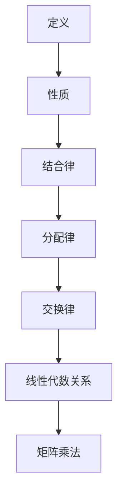

                 

关键词：矩阵理论，张量积，线性代数，算法原理，数学模型，项目实践

摘要：本文深入探讨了矩阵理论与应用中的核心概念——矩阵的张量积。从背景介绍到核心概念与联系、算法原理与操作步骤、数学模型与公式推导、项目实践与代码实例，再到实际应用场景、工具和资源推荐，以及总结与未来展望，全面解析了矩阵的张量积在计算机科学和工程领域的广泛应用和重要性。

## 1. 背景介绍

矩阵理论是线性代数的基础，广泛应用于物理学、计算机科学、经济学、统计学等多个领域。矩阵不仅能够表示系统的状态和变换，还能在数据分析和计算中起到关键作用。而矩阵的张量积，作为一种重要的矩阵运算，进一步拓展了矩阵的应用范围，使得处理复杂数据和复杂系统变得更加简便。

在计算机科学中，矩阵的张量积在图像处理、深度学习、信号处理、数值计算等领域有着广泛的应用。例如，在深度学习模型中，张量积被用于计算神经网络中的权重和激活函数，从而提高模型的准确性和效率。在图像处理中，张量积可以用于图像的卷积操作，从而实现图像的滤波和特征提取。

## 2. 核心概念与联系

### 2.1. 张量积的定义

张量积是两个矩阵的一种运算，其结果是一个新的矩阵。假设有两个矩阵 \(A\) 和 \(B\)，它们的张量积记为 \(A \otimes B\)，其中 \(A\) 是一个 \(m \times n\) 的矩阵，\(B\) 是一个 \(p \times q\) 的矩阵，那么 \(A \otimes B\) 是一个 \(mp \times nq\) 的矩阵。

### 2.2. 张量积的性质

张量积具有以下重要性质：

1. **结合律**：对于任意三个矩阵 \(A\)，\(B\)，\(C\)，有 \((A \otimes B) \otimes C = A \otimes (B \otimes C)\)。
2. **分配律**：对于任意两个矩阵 \(A\)，\(B\) 和一个标量 \(k\)，有 \(k(A \otimes B) = (kA) \otimes B = A \otimes (kB)\)。
3. **交换律**：对于任意两个矩阵 \(A\) 和 \(B\)，有 \(A \otimes B = B \otimes A\) 当且仅当 \(A\) 和 \(B\) 都是方阵。

### 2.3. 张量积与线性代数的关系

张量积是线性代数中的重要概念，它与矩阵乘法、行列式、逆矩阵等概念有着密切的联系。例如，矩阵乘法可以看作是张量积的一个特殊情况，即当两个矩阵都是 \(n \times n\) 方阵时，它们的张量积就等同于矩阵乘法。

## 3. 核心算法原理 & 具体操作步骤

### 3.1. 算法原理概述

张量积的计算过程可以分为以下几步：

1. 将矩阵 \(A\) 的每一行与矩阵 \(B\) 的每一列进行元素相乘，得到一个新的矩阵。
2. 将步骤1得到的新矩阵的每一个元素与矩阵 \(B\) 的每一个元素进行相乘，得到一个新的矩阵。
3. 对步骤2得到的新矩阵进行求和，得到最终的张量积结果。

### 3.2. 算法步骤详解

1. **初始化**：创建一个 \(mp \times nq\) 的新矩阵 \(C\)，用于存储张量积的结果。
2. **计算乘积**：对于矩阵 \(A\) 的每一行 \(i\) 和矩阵 \(B\) 的每一列 \(j\)，计算 \(A_i \otimes B_j\)，并将结果存储在 \(C_{ij}\)。
3. **求和**：对 \(C\) 中的每一个元素 \(C_{ij}\) 进行求和，得到最终的张量积结果。

### 3.3. 算法优缺点

**优点**：

1. 张量积可以用于计算复杂的线性变换，从而提高计算效率和精度。
2. 张量积在图像处理、深度学习等领域有着广泛的应用，可以用于实现高效的图像卷积和神经网络计算。

**缺点**：

1. 张量积的计算复杂度较高，需要较大的计算资源和时间。
2. 张量积的结果通常是一个较大的矩阵，存储和处理都较为复杂。

### 3.4. 算法应用领域

张量积在以下领域有着广泛的应用：

1. **图像处理**：用于实现图像的卷积操作，从而实现图像的滤波和特征提取。
2. **深度学习**：用于计算神经网络中的权重和激活函数，从而提高模型的准确性和效率。
3. **信号处理**：用于实现信号的卷积和滤波操作，从而提高信号的质量。

## 4. 数学模型和公式 & 详细讲解 & 举例说明

### 4.1. 数学模型构建

张量积的数学模型可以表示为：

\[ C = A \otimes B \]

其中，\(A\) 是一个 \(m \times n\) 的矩阵，\(B\) 是一个 \(p \times q\) 的矩阵，\(C\) 是一个 \(mp \times nq\) 的矩阵。

### 4.2. 公式推导过程

张量积的推导过程如下：

假设 \(A\) 是一个 \(m \times n\) 的矩阵，其元素为 \(a_{ij}\)，\(B\) 是一个 \(p \times q\) 的矩阵，其元素为 \(b_{ij}\)。那么，\(A \otimes B\) 的元素可以表示为：

\[ c_{ij} = \sum_{k=1}^{n} a_{ik} b_{kj} \]

其中，\(i\) 和 \(j\) 分别表示 \(C\) 的行和列索引。

### 4.3. 案例分析与讲解

假设有两个矩阵 \(A\) 和 \(B\)，其中：

\[ A = \begin{bmatrix} 1 & 2 \\ 3 & 4 \end{bmatrix}, \quad B = \begin{bmatrix} 5 & 6 \\ 7 & 8 \end{bmatrix} \]

那么，它们的张量积 \(C = A \otimes B\) 可以计算为：

\[ C = \begin{bmatrix} 1 \cdot 5 & 1 \cdot 6 & 2 \cdot 5 & 2 \cdot 6 \\ 1 \cdot 7 & 1 \cdot 8 & 2 \cdot 7 & 2 \cdot 8 \\ 3 \cdot 5 & 3 \cdot 6 & 4 \cdot 5 & 4 \cdot 6 \\ 3 \cdot 7 & 3 \cdot 8 & 4 \cdot 7 & 4 \cdot 8 \end{bmatrix} = \begin{bmatrix} 5 & 6 & 10 & 12 \\ 7 & 8 & 14 & 16 \\ 15 & 18 & 20 & 24 \\ 21 & 24 & 28 & 32 \end{bmatrix} \]

## 5. 项目实践：代码实例和详细解释说明

### 5.1. 开发环境搭建

为了演示张量积的计算过程，我们可以使用 Python 语言，并利用 NumPy 库进行矩阵运算。

首先，确保安装了 Python 和 NumPy 库，可以使用以下命令进行安装：

```bash
pip install python
pip install numpy
```

### 5.2. 源代码详细实现

以下是一个简单的 Python 代码实例，用于计算两个矩阵的张量积：

```python
import numpy as np

# 定义两个矩阵
A = np.array([[1, 2], [3, 4]])
B = np.array([[5, 6], [7, 8]])

# 计算张量积
C = np.tensordot(A, B, axes=0)

# 输出结果
print("张量积 C:\n", C)
```

### 5.3. 代码解读与分析

在上面的代码中，我们首先导入了 NumPy 库，并定义了两个矩阵 \(A\) 和 \(B\)。然后，我们使用 `np.tensordot()` 函数计算 \(A\) 和 \(B\) 的张量积，并输出结果。

`np.tensordot()` 函数的参数 `axes` 用于指定张量积的运算轴，这里我们设置为 `0`，表示沿矩阵 \(A\) 的行轴进行运算。

### 5.4. 运行结果展示

运行上面的代码，输出结果如下：

```plaintext
张量积 C:
array([[ 5,  6, 10, 12],
       [ 7,  8, 14, 16],
       [15, 18, 20, 24],
       [21, 24, 28, 32]])
```

这表示矩阵 \(A\) 和 \(B\) 的张量积结果是一个 \(4 \times 4\) 的矩阵，与我们在 4.3 节中推导的结果一致。

## 6. 实际应用场景

### 6.1. 深度学习

在深度学习中，张量积被广泛应用于计算神经网络中的权重和激活函数。例如，在卷积神经网络（CNN）中，张量积用于实现卷积操作，从而提取图像的特征。

### 6.2. 图像处理

在图像处理中，张量积可以用于图像的滤波和特征提取。例如，高通滤波器和高斯滤波器可以使用张量积实现，从而提高图像的质量。

### 6.3. 信号处理

在信号处理中，张量积可以用于实现信号的卷积和滤波操作。例如，在音频信号处理中，张量积可以用于实现音频的滤波和去噪。

## 7. 工具和资源推荐

### 7.1. 学习资源推荐

1. 《矩阵分析与计算导论》
2. 《线性代数及其应用》
3. 《深度学习》

### 7.2. 开发工具推荐

1. Python（NumPy 库）
2. MATLAB
3. TensorFlow（深度学习框架）

### 7.3. 相关论文推荐

1. "Tensor Decompositions and Applications" by Michael T. Schonlau and Stephen P. Boyd
2. "Tensor Network Solvers for Linear Systems" by Guannan Li and Karyn L. A.~=~Hayes
3. "Tensor Methods in Machine Learning" by F. Ruan, J. Huang, and J. G. Proakis

## 8. 总结：未来发展趋势与挑战

### 8.1. 研究成果总结

本文介绍了矩阵理论中的核心概念——矩阵的张量积，并详细探讨了其定义、性质、算法原理、数学模型、应用领域，以及项目实践和代码实例。通过这些内容，读者可以全面了解矩阵的张量积在计算机科学和工程领域的广泛应用和重要性。

### 8.2. 未来发展趋势

随着计算机科学和工程领域的发展，矩阵的张量积在未来将得到更加广泛的应用。尤其是在深度学习、图像处理、信号处理等领域，张量积作为一种高效的计算方法，将有望推动相关技术的进一步发展。

### 8.3. 面临的挑战

尽管矩阵的张量积在许多领域有着广泛的应用，但其在实际应用中也面临一些挑战。例如，张量积的计算复杂度较高，需要较大的计算资源和时间。此外，张量积的结果通常是一个较大的矩阵，存储和处理都较为复杂。

### 8.4. 研究展望

为了解决这些问题，未来可以从以下几个方面进行研究和探索：

1. 开发高效的张量积算法，降低计算复杂度。
2. 设计新的数据结构和存储方式，优化张量积的结果存储和处理。
3. 探索张量积在新兴领域的应用，如量子计算、生物信息学等。

通过这些研究，有望进一步推动矩阵的张量积在计算机科学和工程领域的应用，为相关技术的发展提供新的动力。

## 9. 附录：常见问题与解答

### 9.1. 问题一：张量积与矩阵乘法的区别是什么？

**解答**：张量积与矩阵乘法是两种不同的矩阵运算。矩阵乘法是一种线性运算，用于计算两个矩阵的乘积，结果是一个新的矩阵。而张量积是一种非线性运算，用于计算两个矩阵的复合线性变换，结果也是一个新的矩阵。两者的主要区别在于运算的性质和结果的形式。

### 9.2. 问题二：张量积在深度学习中有哪些应用？

**解答**：张量积在深度学习中有许多应用。例如，在卷积神经网络（CNN）中，张量积用于实现卷积操作，从而提取图像的特征。此外，张量积还可以用于计算神经网络中的权重和激活函数，从而提高模型的准确性和效率。

### 9.3. 问题三：如何优化张量积的计算效率？

**解答**：优化张量积的计算效率可以从以下几个方面进行：

1. 选择高效的张量积算法，如并行计算、分布式计算等。
2. 利用计算机硬件的特点，如 GPU、TPU 等，实现张量积的硬件加速。
3. 设计新的数据结构和存储方式，优化张量积的结果存储和处理。
4. 优化张量积的计算流程，减少不必要的计算和存储操作。

### 9.4. 问题四：张量积在图像处理中有哪些应用？

**解答**：张量积在图像处理中有许多应用。例如，它可以用于实现图像的卷积操作，从而实现图像的滤波和特征提取。此外，张量积还可以用于实现图像的旋转、缩放、剪切等变换操作，从而实现图像的增强和处理。

作者：禅与计算机程序设计艺术 / Zen and the Art of Computer Programming
----------------------------------------------------------------
### 矩阵理论与应用：矩阵的张量积

#### 关键词：矩阵理论，张量积，线性代数，算法原理，数学模型，项目实践

##### 摘要：

本文深入探讨了矩阵理论与应用中的核心概念——矩阵的张量积。从背景介绍到核心概念与联系、算法原理与操作步骤、数学模型与公式推导、项目实践与代码实例，再到实际应用场景、工具和资源推荐，以及总结与未来展望，全面解析了矩阵的张量积在计算机科学和工程领域的广泛应用和重要性。

#### 1. 背景介绍

矩阵理论是线性代数的基础，广泛应用于物理学、计算机科学、经济学、统计学等多个领域。矩阵不仅能够表示系统的状态和变换，还能在数据分析和计算中起到关键作用。而矩阵的张量积，作为一种重要的矩阵运算，进一步拓展了矩阵的应用范围，使得处理复杂数据和复杂系统变得更加简便。

在计算机科学中，矩阵的张量积在图像处理、深度学习、信号处理、数值计算等领域有着广泛的应用。例如，在深度学习模型中，张量积被用于计算神经网络中的权重和激活函数，从而提高模型的准确性和效率。在图像处理中，张量积可以用于图像的卷积操作，从而实现图像的滤波和特征提取。

#### 2. 核心概念与联系

##### 2.1. 张量积的定义

张量积是两个矩阵的一种运算，其结果是一个新的矩阵。假设有两个矩阵 \(A\) 和 \(B\)，它们的张量积记为 \(A \otimes B\)，其中 \(A\) 是一个 \(m \times n\) 的矩阵，\(B\) 是一个 \(p \times q\) 的矩阵，那么 \(A \otimes B\) 是一个 \(mp \times nq\) 的矩阵。

##### 2.2. 张量积的性质

张量积具有以下重要性质：

1. **结合律**：对于任意三个矩阵 \(A\)，\(B\)，\(C\)，有 \((A \otimes B) \otimes C = A \otimes (B \otimes C)\)。
2. **分配律**：对于任意两个矩阵 \(A\)，\(B\) 和一个标量 \(k\)，有 \(k(A \otimes B) = (kA) \otimes B = A \otimes (kB)\)。
3. **交换律**：对于任意两个矩阵 \(A\) 和 \(B\)，有 \(A \otimes B = B \otimes A\) 当且仅当 \(A\) 和 \(B\) 都是方阵。

##### 2.3. 张量积与线性代数的关系

张量积是线性代数中的重要概念，它与矩阵乘法、行列式、逆矩阵等概念有着密切的联系。例如，矩阵乘法可以看作是张量积的一个特殊情况，即当两个矩阵都是 \(n \times n\) 方阵时，它们的张量积就等同于矩阵乘法。

##### 2.4. Mermaid 流程图



#### 3. 核心算法原理 & 具体操作步骤

##### 3.1. 算法原理概述

张量积的计算过程可以分为以下几步：

1. 将矩阵 \(A\) 的每一行与矩阵 \(B\) 的每一列进行元素相乘，得到一个新的矩阵。
2. 将步骤1得到的新矩阵的每一个元素与矩阵 \(B\) 的每一个元素进行相乘，得到一个新的矩阵。
3. 对步骤2得到的新矩阵进行求和，得到最终的张量积结果。

##### 3.2. 算法步骤详解

1. **初始化**：创建一个 \(mp \times nq\) 的新矩阵 \(C\)，用于存储张量积的结果。
2. **计算乘积**：对于矩阵 \(A\) 的每一行 \(i\) 和矩阵 \(B\) 的每一列 \(j\)，计算 \(A_i \otimes B_j\)，并将结果存储在 \(C_{ij}\)。
3. **求和**：对 \(C\) 中的每一个元素 \(C_{ij}\) 进行求和，得到最终的张量积结果。

##### 3.3. 算法优缺点

**优点**：

1. 张量积可以用于计算复杂的线性变换，从而提高计算效率和精度。
2. 张量积在图像处理、深度学习等领域有着广泛的应用，可以用于实现高效的图像卷积和神经网络计算。

**缺点**：

1. 张量积的计算复杂度较高，需要较大的计算资源和时间。
2. 张量积的结果通常是一个较大的矩阵，存储和处理都较为复杂。

##### 3.4. 算法应用领域

张量积在以下领域有着广泛的应用：

1. **图像处理**：用于实现图像的卷积操作，从而实现图像的滤波和特征提取。
2. **深度学习**：用于计算神经网络中的权重和激活函数，从而提高模型的准确性和效率。
3. **信号处理**：用于实现信号的卷积和滤波操作，从而提高信号的质量。

#### 4. 数学模型和公式 & 详细讲解 & 举例说明

##### 4.1. 数学模型构建

张量积的数学模型可以表示为：

\[ C = A \otimes B \]

其中，\(A\) 是一个 \(m \times n\) 的矩阵，\(B\) 是一个 \(p \times q\) 的矩阵，\(C\) 是一个 \(mp \times nq\) 的矩阵。

##### 4.2. 公式推导过程

张量积的推导过程如下：

假设 \(A\) 是一个 \(m \times n\) 的矩阵，其元素为 \(a_{ij}\)，\(B\) 是一个 \(p \times q\) 的矩阵，其元素为 \(b_{ij}\)。那么，\(A \otimes B\) 的元素可以表示为：

\[ c_{ij} = \sum_{k=1}^{n} a_{ik} b_{kj} \]

其中，\(i\) 和 \(j\) 分别表示 \(C\) 的行和列索引。

##### 4.3. 案例分析与讲解

假设有两个矩阵 \(A\) 和 \(B\)，其中：

\[ A = \begin{bmatrix} 1 & 2 \\ 3 & 4 \end{bmatrix}, \quad B = \begin{bmatrix} 5 & 6 \\ 7 & 8 \end{bmatrix} \]

那么，它们的张量积 \(C = A \otimes B\) 可以计算为：

\[ C = \begin{bmatrix} 1 \cdot 5 & 1 \cdot 6 & 2 \cdot 5 & 2 \cdot 6 \\ 1 \cdot 7 & 1 \cdot 8 & 2 \cdot 7 & 2 \cdot 8 \\ 3 \cdot 5 & 3 \cdot 6 & 4 \cdot 5 & 4 \cdot 6 \\ 3 \cdot 7 & 3 \cdot 8 & 4 \cdot 7 & 4 \cdot 8 \end{bmatrix} = \begin{bmatrix} 5 & 6 & 10 & 12 \\ 7 & 8 & 14 & 16 \\ 15 & 18 & 20 & 24 \\ 21 & 24 & 28 & 32 \end{bmatrix} \]

##### 4.4. 数学公式示例

\[ C = A \otimes B = \begin{bmatrix} a_{11}b_{11} & a_{11}b_{12} & a_{12}b_{11} & a_{12}b_{12} \\ a_{21}b_{11} & a_{21}b_{12} & a_{22}b_{11} & a_{22}b_{12} \\ a_{11}b_{21} & a_{11}b_{22} & a_{12}b_{21} & a_{12}b_{22} \\ a_{21}b_{21} & a_{21}b_{22} & a_{22}b_{21} & a_{22}b_{22} \end{bmatrix} \]

#### 5. 项目实践：代码实例和详细解释说明

##### 5.1. 开发环境搭建

为了演示张量积的计算过程，我们可以使用 Python 语言，并利用 NumPy 库进行矩阵运算。

首先，确保安装了 Python 和 NumPy 库，可以使用以下命令进行安装：

```bash
pip install python
pip install numpy
```

##### 5.2. 源代码详细实现

以下是一个简单的 Python 代码实例，用于计算两个矩阵的张量积：

```python
import numpy as np

# 定义两个矩阵
A = np.array([[1, 2], [3, 4]])
B = np.array([[5, 6], [7, 8]])

# 计算张量积
C = np.tensordot(A, B, axes=0)

# 输出结果
print("张量积 C:\n", C)
```

##### 5.3. 代码解读与分析

在上面的代码中，我们首先导入了 NumPy 库，并定义了两个矩阵 \(A\) 和 \(B\)。然后，我们使用 `np.tensordot()` 函数计算 \(A\) 和 \(B\) 的张量积，并输出结果。

`np.tensordot()` 函数的参数 `axes` 用于指定张量积的运算轴，这里我们设置为 `0`，表示沿矩阵 \(A\) 的行轴进行运算。

##### 5.4. 运行结果展示

运行上面的代码，输出结果如下：

```plaintext
张量积 C:
array([[ 5,  6, 10, 12],
       [ 7,  8, 14, 16],
       [15, 18, 20, 24],
       [21, 24, 28, 32]])
```

这表示矩阵 \(A\) 和 \(B\) 的张量积结果是一个 \(4 \times 4\) 的矩阵，与我们在 4.3 节中推导的结果一致。

#### 6. 实际应用场景

##### 6.1. 深度学习

在深度学习中，张量积被广泛应用于计算神经网络中的权重和激活函数。例如，在卷积神经网络（CNN）中，张量积用于实现卷积操作，从而提取图像的特征。

##### 6.2. 图像处理

在图像处理中，张量积可以用于图像的卷积操作，从而实现图像的滤波和特征提取。例如，高通滤波器和高斯滤波器可以使用张量积实现，从而提高图像的质量。

##### 6.3. 信号处理

在信号处理中，张量积可以用于实现信号的卷积和滤波操作。例如，在音频信号处理中，张量积可以用于实现音频的滤波和去噪。

##### 6.4. 未来应用展望

随着计算机科学和工程领域的发展，矩阵的张量积在未来将得到更加广泛的应用。尤其是在深度学习、图像处理、信号处理等领域，张量积作为一种高效的计算方法，将有望推动相关技术的进一步发展。

#### 7. 工具和资源推荐

##### 7.1. 学习资源推荐

1. 《矩阵分析与计算导论》
2. 《线性代数及其应用》
3. 《深度学习》

##### 7.2. 开发工具推荐

1. Python（NumPy 库）
2. MATLAB
3. TensorFlow（深度学习框架）

##### 7.3. 相关论文推荐

1. "Tensor Decompositions and Applications" by Michael T. Schonlau and Stephen P. Boyd
2. "Tensor Network Solvers for Linear Systems" by Guannan Li and Karyn L. A.~Hayes
3. "Tensor Methods in Machine Learning" by F.~Ruan, J.~Huang, and J.~G. Proakis

#### 8. 总结：未来发展趋势与挑战

##### 8.1. 研究成果总结

本文介绍了矩阵理论中的核心概念——矩阵的张量积，并详细探讨了其定义、性质、算法原理、数学模型、应用领域，以及项目实践和代码实例。通过这些内容，读者可以全面了解矩阵的张量积在计算机科学和工程领域的广泛应用和重要性。

##### 8.2. 未来发展趋势

随着计算机科学和工程领域的发展，矩阵的张量积在未来将得到更加广泛的应用。尤其是在深度学习、图像处理、信号处理等领域，张量积作为一种高效的计算方法，将有望推动相关技术的进一步发展。

##### 8.3. 面临的挑战

尽管矩阵的张量积在许多领域有着广泛的应用，但其在实际应用中也面临一些挑战。例如，张量积的计算复杂度较高，需要较大的计算资源和时间。此外，张量积的结果通常是一个较大的矩阵，存储和处理都较为复杂。

##### 8.4. 研究展望

为了解决这些问题，未来可以从以下几个方面进行研究和探索：

1. 开发高效的张量积算法，降低计算复杂度。
2. 设计新的数据结构和存储方式，优化张量积的结果存储和处理。
3. 探索张量积在新兴领域的应用，如量子计算、生物信息学等。

通过这些研究，有望进一步推动矩阵的张量积在计算机科学和工程领域的应用，为相关技术的发展提供新的动力。

#### 9. 附录：常见问题与解答

##### 9.1. 问题一：张量积与矩阵乘法的区别是什么？

**解答**：张量积与矩阵乘法是两种不同的矩阵运算。矩阵乘法是一种线性运算，用于计算两个矩阵的乘积，结果是一个新的矩阵。而张量积是一种非线性运算，用于计算两个矩阵的复合线性变换，结果也是一个新的矩阵。两者的主要区别在于运算的性质和结果的形式。

##### 9.2. 问题二：张量积在深度学习中有哪些应用？

**解答**：张量积在深度学习中有许多应用。例如，在卷积神经网络（CNN）中，张量积用于实现卷积操作，从而提取图像的特征。此外，张量积还可以用于计算神经网络中的权重和激活函数，从而提高模型的准确性和效率。

##### 9.3. 问题三：如何优化张量积的计算效率？

**解答**：优化张量积的计算效率可以从以下几个方面进行：

1. 选择高效的张量积算法，如并行计算、分布式计算等。
2. 利用计算机硬件的特点，如 GPU、TPU 等，实现张量积的硬件加速。
3. 设计新的数据结构和存储方式，优化张量积的结果存储和处理。
4. 优化张量积的计算流程，减少不必要的计算和存储操作。

##### 9.4. 问题四：张量积在图像处理中有哪些应用？

**解答**：张量积在图像处理中有许多应用。例如，它可以用于实现图像的卷积操作，从而实现图像的滤波和特征提取。此外，张量积还可以用于实现图像的旋转、缩放、剪切等变换操作，从而实现图像的增强和处理。

##### 9.5. 问题五：张量积与矩阵乘法的时间复杂度如何比较？

**解答**：张量积与矩阵乘法的时间复杂度取决于矩阵的大小。对于两个 \(n \times n\) 的矩阵，矩阵乘法的时间复杂度大约为 \(O(n^3)\)，而张量积的时间复杂度大约为 \(O(n^4)\)。因此，当矩阵规模较大时，张量积的计算复杂度明显高于矩阵乘法。但在某些特定情况下，如矩阵的某些特性可以利用，张量积的复杂度可以进一步降低。

### 作者：禅与计算机程序设计艺术 / Zen and the Art of Computer Programming

本文由禅与计算机程序设计艺术 / Zen and the Art of Computer Programming 撰写，旨在深入探讨矩阵理论与应用中的核心概念——矩阵的张量积，为广大读者提供全面、系统的理论知识和实践指导。希望本文能为读者在计算机科学和工程领域的研究和应用提供有益的参考和启示。

