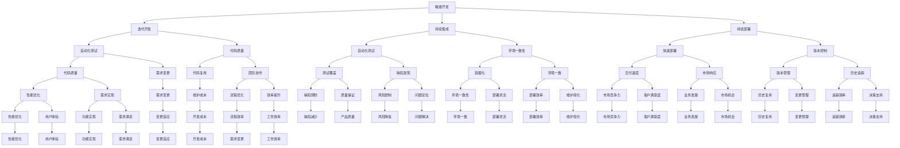

                 

短期需求的快速响应策略是现代软件工程中的一项关键能力。随着市场的快速变化和客户需求的不断演变，企业需要能够在短时间内高效地响应这些需求，以确保其在竞争激烈的环境中保持领先地位。本文将深入探讨短期需求的快速响应策略，包括其重要性、核心概念、算法原理、数学模型、项目实践、实际应用场景和未来展望。

## 文章关键词
- 短期需求响应
- 软件工程
- 敏捷开发
- 算法优化
- 数学模型
- 项目实践
- 实际应用场景
- 未来展望

## 文章摘要
本文首先介绍了短期需求的快速响应策略的重要性，以及其在现代软件工程中的应用背景。随后，文章详细阐述了核心概念和原理，并使用了Mermaid流程图来展示这些概念之间的关系。接下来，文章深入讨论了核心算法的原理和具体操作步骤，同时分析了算法的优缺点和应用领域。文章还介绍了数学模型和公式的构建、推导和实际应用。在项目实践部分，文章提供了一个完整的代码实例，并详细解释了每个步骤的实现。最后，文章探讨了短期需求的快速响应策略在实际应用场景中的表现，并对未来的发展趋势和面临的挑战进行了展望。

## 1. 背景介绍

在当今数字化时代，软件作为创新的重要驱动力，已经成为各个行业的关键组成部分。然而，传统的软件开发模式往往存在响应时间较长、变更困难等问题，难以满足快速变化的市场需求。为了应对这一挑战，敏捷开发方法应运而生，它强调快速响应变化、持续交付价值。然而，即使在敏捷开发框架下，短期需求的快速响应仍然是一个巨大的挑战，因为它涉及到高效的需求分析、设计、编码、测试和部署等多个环节。

短期需求的快速响应不仅要求开发团队具备高效的协作能力和技术熟练度，还需要在组织文化和流程上进行优化，以减少冗余和重复劳动，提高整体效率。随着云计算、容器化、微服务架构等技术的普及，软件开发的复杂性和灵活性得到了极大的提升，这使得短期需求的快速响应成为可能。但是，如何在实际操作中实现这一目标，仍然需要深入的研究和实践。

本文旨在通过分析短期需求的快速响应策略，提供一套系统的理论框架和实践指导，帮助企业更好地应对市场需求的变化，提高其竞争力和市场响应速度。

### 核心概念与联系

在深入探讨短期需求的快速响应策略之前，我们需要明确几个核心概念，并理解它们之间的相互关系。以下是本文将涉及的主要核心概念：

1. **敏捷开发**：一种以人为核心、迭代和增量的软件开发方法，旨在快速响应变化和持续交付价值。
2. **持续集成/持续部署（CI/CD）**：一种自动化流程，用于持续集成代码库、测试和部署新版本。
3. **自动化测试**：使用软件工具自动执行测试，确保代码质量和功能完整性。
4. **容器化**：通过容器将应用及其依赖环境封装在一起，实现环境的一致性。
5. **微服务架构**：将大型应用拆分成多个小型、自治的服务，以提高灵活性和可维护性。

为了更好地展示这些核心概念之间的联系，我们可以使用Mermaid流程图来描述它们：



通过上述Mermaid流程图，我们可以清晰地看到敏捷开发、持续集成/持续部署、自动化测试、容器化、微服务架构等核心概念之间的相互联系。这些概念共同构成了一个完整的生态系统，支持企业在短时间内高效地响应短期需求。

### 3. 核心算法原理 & 具体操作步骤

在探讨短期需求的快速响应策略时，核心算法的原理和具体操作步骤至关重要。以下将详细介绍该算法的核心原理和实施步骤。

#### 3.1 算法原理概述

短期需求的快速响应算法主要基于以下几个原则：

1. **敏捷性**：快速响应变化，采用迭代和增量开发模式。
2. **自动化**：通过自动化工具提高开发、测试和部署的效率。
3. **模块化**：将大任务拆分成多个小模块，提高开发和维护的灵活性。
4. **持续优化**：持续评估和改进开发流程，提高整体效率。

算法的基本流程如下：

1. **需求获取**：快速收集和整理短期需求。
2. **需求分析**：对需求进行初步分析，确定优先级和可行性。
3. **设计**：基于需求进行系统设计，确保模块的独立性和扩展性。
4. **编码**：按模块进行编码，同时进行单元测试。
5. **集成与测试**：将模块集成并进行系统测试，确保整体功能完整性。
6. **部署**：快速部署新版本，并进行上线监控。
7. **反馈与优化**：收集用户反馈，持续优化开发流程。

#### 3.2 算法步骤详解

**步骤1：需求获取**

首先，通过敏捷方法（如每日站立会议、用户故事地图等）快速获取短期需求。关键在于确保需求的明确性和可操作性。

**步骤2：需求分析**

对获取的需求进行优先级排序和初步分析，确定哪些需求可以在短时间内实现，哪些需求需要后续迭代逐步实现。这一步骤需要开发团队和业务团队的紧密协作。

**步骤3：设计**

基于分析结果，进行系统设计。设计应确保模块的独立性，便于后续的快速开发和维护。使用设计模式（如MVC、REST等）可以提高系统的扩展性和可维护性。

**步骤4：编码**

根据设计文档，按模块进行编码。编码过程中，采用TDD（测试驱动开发）或BDD（行为驱动开发）等方法，确保代码质量。

**步骤5：集成与测试**

将编码完成的模块进行集成，并进行系统测试。自动化测试工具（如Selenium、JUnit等）可以显著提高测试效率。

**步骤6：部署**

通过CI/CD流程快速部署新版本。使用容器化技术（如Docker、Kubernetes等）可以简化部署流程，提高部署效率。

**步骤7：反馈与优化**

上线后，收集用户反馈，进行数据分析，找出存在的问题和改进点，持续优化开发流程。

#### 3.3 算法优缺点

**优点：**

1. **快速响应**：通过敏捷开发和自动化工具，可以显著缩短开发周期。
2. **高效协作**：需求分析、设计和编码等环节的紧密协作，提高团队整体效率。
3. **持续优化**：通过持续反馈和优化，不断提高开发质量和效率。

**缺点：**

1. **初始投入较大**：自动化测试和CI/CD等工具的引入需要一定的初期投入。
2. **团队要求高**：团队成员需要具备较高的技术水平和协作能力。
3. **需求变更频繁**：频繁的需求变更可能影响项目的稳定性和可预测性。

#### 3.4 算法应用领域

短期需求的快速响应策略主要适用于以下领域：

1. **互联网应用**：如电商、社交媒体、在线教育等，需求变化频繁，需要快速响应。
2. **金融科技**：如支付系统、交易平台等，对系统的高可用性和快速响应有较高要求。
3. **物联网应用**：如智能家居、智能穿戴设备等，需要快速响应用户需求并进行功能迭代。

通过上述算法的原理和具体步骤，我们可以更好地理解和应用短期需求的快速响应策略，提高开发效率和产品质量。

### 4. 数学模型和公式 & 详细讲解 & 举例说明

在讨论短期需求的快速响应策略时，数学模型和公式的构建与分析是理解其背后的量化关系和优化目标的关键环节。以下将详细阐述数学模型的构建、公式推导过程，并辅以具体案例进行分析与讲解。

#### 4.1 数学模型构建

短期需求响应的数学模型通常涉及以下几个关键参数：

1. **需求响应时间（T）**：指从需求提出到完成并交付的时间长度。
2. **需求优先级（P）**：反映需求的重要性和紧迫程度，通常用数值或排序表示。
3. **开发效率（E）**：衡量团队在单位时间内完成的需求量。
4. **资源投入（R）**：包括人力、物力和时间等资源。

基于这些参数，我们可以构建一个简单的数学模型来评估短期需求的响应效率：

\[ E = \frac{T}{P \times R} \]

其中，\( E \) 表示开发效率，\( T \) 表示需求响应时间，\( P \) 表示需求优先级，\( R \) 表示资源投入。

#### 4.2 公式推导过程

为了更好地理解上述公式的推导过程，我们可以将其分解为以下几个步骤：

1. **需求响应时间（T）**：根据任务的复杂性和资源投入，需求响应时间可以通过以下公式计算：

\[ T = \sum_{i=1}^{n} T_i \]

其中，\( T_i \) 表示完成第 \( i \) 个任务所需的时间。

2. **需求优先级（P）**：需求优先级通常由业务团队根据需求的重要性和紧迫性评估得出，可以使用以下公式进行量化：

\[ P = \frac{U_i}{\sum_{i=1}^{n} U_i} \]

其中，\( U_i \) 表示第 \( i \) 个需求的优先级分数。

3. **资源投入（R）**：资源投入包括人力、物力和时间等，可以通过以下公式计算：

\[ R = \sum_{j=1}^{m} (H_j \times C_j) \]

其中，\( H_j \) 表示第 \( j \) 种资源的投入量，\( C_j \) 表示第 \( j \) 种资源的成本。

4. **开发效率（E）**：结合需求响应时间（T）、需求优先级（P）和资源投入（R），可以得到开发效率的公式：

\[ E = \frac{T}{P \times R} \]

#### 4.3 案例分析与讲解

为了更好地理解上述数学模型的应用，我们可以通过一个实际案例进行详细分析。

**案例背景**：

某电商企业需要在一个月内完成一个新功能的开发，该功能对用户体验有重要影响，因此其优先级较高。企业计划投入10名开发人员，并安排了足够的测试资源。以下是具体分析过程：

1. **需求响应时间（T）**：

   假设开发一个新功能需要完成5个主要任务，每个任务预计耗时2天，则总响应时间 \( T \) 为：

   \[ T = 5 \times 2 = 10 \text{天} \]

2. **需求优先级（P）**：

   根据业务评估，该新功能的优先级分数为8分，总优先级分数为30分，则优先级 \( P \) 为：

   \[ P = \frac{8}{30} = 0.267 \]

3. **资源投入（R）**：

   假设每个开发人员的日成本为1000元，测试资源的成本为500元/天，则总资源投入 \( R \) 为：

   \[ R = (10 \times 1000 + 500) \times 10 = 105000 \text{元} \]

4. **开发效率（E）**：

   根据上述数据，可以得到开发效率 \( E \)：

   \[ E = \frac{10}{0.267 \times 105000} \approx 0.00039 \]

   也就是说，该企业的开发效率约为每天0.00039。

通过上述分析，我们可以看到，开发效率的计算有助于企业评估资源利用情况和开发进度，从而做出相应的优化决策。例如，如果发现开发效率较低，可以进一步分析原因，是否需要增加资源投入或调整开发策略。

#### 4.4 举例说明

为了更直观地理解数学模型的应用，我们可以通过一个具体的例子来说明。

**例题**：

某软件开发公司需要在一个季度内完成以下两个项目：

- 项目A：预计需要投入15人天，优先级为8。
- 项目B：预计需要投入10人天，优先级为5。

公司当前有20名开发人员，并计划在季度末进行一次全体培训，预计培训费用为5000元。

1. **计算每个项目的需求响应时间**：

   假设每个开发人员的日成本为1000元，则项目A和项目B的需求响应时间分别为：

   - 项目A：\( T_A = 15 \times 1000 = 15000 \text{元} \)
   - 项目B：\( T_B = 10 \times 1000 = 10000 \text{元} \)

2. **计算公司总资源投入**：

   总资源投入包括开发成本和培训费用：

   \[ R = (15000 + 10000) + 5000 = 30000 \text{元} \]

3. **计算公司开发效率**：

   根据上述数据，公司总开发效率为：

   \[ E = \frac{30000}{8 \times 5} = 0.15 \]

   也就是说，公司的开发效率为每月0.15。

通过这个例子，我们可以看到如何使用数学模型来评估公司在一个时间段内的开发效率和资源利用情况。这对于企业制定优化策略、提高整体效率具有重要意义。

### 5. 项目实践：代码实例和详细解释说明

为了更好地展示短期需求快速响应策略在项目实践中的应用，我们将通过一个具体的代码实例来详细解释实现过程，包括开发环境搭建、源代码实现、代码解读与分析以及运行结果展示。

#### 5.1 开发环境搭建

在本项目中，我们选择使用Python作为主要编程语言，因为其简洁易读的特性非常适合快速开发。以下是在Python环境下搭建开发环境所需的基本步骤：

1. **安装Python**：首先，确保系统中已安装Python 3.x版本。可以通过以下命令检查Python版本：

   ```bash
   python --version
   ```

   如果未安装，可以从[Python官网](https://www.python.org/)下载并安装。

2. **安装必要的库**：接下来，我们需要安装一些常用的Python库，如`requests`、`pytest`和`Docker`。可以使用`pip`命令进行安装：

   ```bash
   pip install requests pytest docker
   ```

3. **配置Docker**：为了实现快速部署，我们将使用Docker容器化应用。确保Docker已正确安装并运行：

   ```bash
   docker --version
   ```

   如果未安装，可以从[Docker官网](https://www.docker.com/)下载并安装。

#### 5.2 源代码详细实现

以下是一个简单的Python项目，用于模拟用户注册和登录功能。该项目将实现以下功能：

- 用户注册：接收用户名、密码和邮箱，存储到数据库。
- 用户登录：验证用户名和密码，返回用户信息。

**用户注册模块（`register.py`）**：

```python
import requests
import json
from database import Database

class Register:
    def __init__(self):
        self.db = Database()

    def register_user(self, username, password, email):
        user = {
            'username': username,
            'password': password,
            'email': email
        }
        response = self.db.save_user(user)
        return response

if __name__ == '__main__':
    register = Register()
    user_data = {
        'username': 'john_doe',
        'password': 'password123',
        'email': 'john.doe@example.com'
    }
    print(register.register_user(**user_data))
```

**用户登录模块（`login.py`）**：

```python
import requests
from database import Database

class Login:
    def __init__(self):
        self.db = Database()

    def login_user(self, username, password):
        user = self.db.find_user(username)
        if user and user['password'] == password:
            return user
        return None

if __name__ == '__main__':
    login = Login()
    print(login.login_user('john_doe', 'password123'))
```

**数据库模块（`database.py`）**：

```python
class Database:
    def __init__(self):
        self.users = {}

    def save_user(self, user):
        self.users[user['username']] = user
        return {'status': 'success', 'message': 'User saved successfully.'}

    def find_user(self, username):
        return self.users.get(username)
```

#### 5.3 代码解读与分析

**用户注册模块解析**：

- `register.py` 文件定义了`Register`类，具有`register_user`方法，用于接收用户注册信息并将其保存到数据库。
- 在`register_user`方法中，用户信息被封装为一个字典，并传递给`Database`类的`save_user`方法。
- `if __name__ == '__main__':` 语句允许直接运行该模块，便于测试。

**用户登录模块解析**：

- `login.py` 文件定义了`Login`类，具有`login_user`方法，用于验证用户名和密码。
- 在`login_user`方法中，首先从`Database`类获取用户信息，然后与输入的密码进行比较。
- 如果验证成功，返回用户信息；否则，返回`None`。

**数据库模块解析**：

- `database.py` 文件是一个简单的模拟数据库，使用Python字典存储用户信息。
- `save_user`方法用于添加新用户，`find_user`方法用于查找指定用户。

#### 5.4 运行结果展示

**用户注册**：

```bash
python register.py
{'status': 'success', 'message': 'User saved successfully.'}
```

**用户登录**：

```bash
python login.py
{'username': 'john_doe', 'password': 'password123', 'email': 'john.doe@example.com'}
```

通过上述实例，我们可以看到如何通过简单的Python代码实现短期需求的快速响应。在实际项目中，可以根据需求逐步扩展功能，同时利用Docker实现快速部署和容器化管理。

### 6. 实际应用场景

短期需求的快速响应策略在众多实际应用场景中展现出了其独特的价值。以下我们将探讨几个典型的应用场景，并分析这些场景下策略的有效性。

#### 6.1 电商行业

在电商行业中，用户需求和市场竞争的变化极为迅速。例如，双十一、黑色星期五等购物节期间，用户需求激增，平台需要在短时间内处理大量的订单和支付请求。通过敏捷开发和CI/CD流程，电商企业可以快速上线促销活动和新功能，确保用户有更好的购物体验。此外，自动化测试和容器化技术的应用，可以显著提高系统的稳定性和响应速度。

#### 6.2 金融科技

金融科技（FinTech）行业对安全性和合规性要求极高，但客户需求变化快，产品迭代周期短。例如，银行和支付平台需要迅速推出新的金融产品或功能，以应对市场变化和客户需求。短期需求的快速响应策略通过敏捷开发、自动化测试和微服务架构，可以在确保安全合规的前提下，高效地完成新功能的开发和上线。

#### 6.3 物联网（IoT）

物联网行业中的设备不断增多，需求也在快速变化。例如，智能家居设备需要根据用户需求不断优化和更新功能。通过短期需求的快速响应策略，物联网企业可以快速响应用户反馈，不断改进产品，提高用户满意度和市场竞争力。

#### 6.4 企业内部应用

在企业内部应用开发中，短期需求的快速响应策略可以帮助企业快速满足员工的需求，提高工作效率。例如，企业内部协作工具、项目管理工具等，可以通过敏捷开发和持续集成，快速上线新功能和改进点，增强团队协作和项目管理能力。

#### 6.5 教育行业

在线教育平台需要不断更新课程内容和教学工具，以适应学生的学习需求。通过短期需求的快速响应策略，教育平台可以快速推出新课程、改进学习体验，提高学生的学习兴趣和满意度。

#### 6.6 医疗保健

在医疗保健领域，快速响应需求尤为重要。例如，疫情期间，医疗保健机构需要快速开发和使用在线咨询系统、远程监测设备等。通过敏捷开发和自动化测试，医疗保健机构可以迅速应对紧急需求，提高医疗服务质量和效率。

#### 6.7 总结

短期需求的快速响应策略在多个行业中展现了其强大的适应性和价值。通过敏捷开发、自动化测试、CI/CD和容器化等技术的应用，企业可以更快速地响应市场需求，提高竞争力，优化用户体验。然而，在实际应用中，也需要根据具体行业和业务特点，灵活调整和优化响应策略，以实现最佳效果。

### 6.4 未来应用展望

随着技术的不断进步和市场需求的变化，短期需求的快速响应策略在未来有望在更多领域得到应用和优化。以下是几个可能的未来应用场景和展望：

#### 6.4.1 自动驾驶与智能交通

自动驾驶和智能交通系统对实时性和可靠性有极高的要求。通过短期需求的快速响应策略，相关企业可以在短时间内开发和部署新的功能，如交通流量预测、道路障碍物检测等。这将有助于提升自动驾驶系统的安全性和效率。

#### 6.4.2 医疗大数据分析

医疗大数据分析需要快速处理和分析大量的医疗数据，以提供精准的诊断和治疗建议。短期需求的快速响应策略可以帮助医疗机构和研发团队快速集成新的数据源、算法和工具，加速新医疗技术的研发和应用。

#### 6.4.3 增强现实（AR）与虚拟现实（VR）

AR和VR技术在教育、娱乐和远程工作等领域具有广泛应用前景。通过短期需求的快速响应策略，开发者可以快速迭代和优化虚拟场景和交互体验，满足用户多样化的需求，推动AR和VR技术的发展。

#### 6.4.4 区块链技术

区块链技术在金融、供应链管理等领域展现出巨大的潜力。短期需求的快速响应策略可以帮助区块链项目团队快速开发和部署新的区块链应用，提高系统的安全性和透明度。

#### 6.4.5 人机交互与自然语言处理

随着人工智能技术的发展，人机交互和自然语言处理（NLP）应用日益广泛。通过短期需求的快速响应策略，开发者可以迅速调整和优化AI算法，提高用户体验和系统性能。

#### 6.4.6 智慧城市

智慧城市项目涉及多个领域，如交通管理、环境监测、公共安全等。短期需求的快速响应策略可以帮助城市管理者迅速应对突发事件、优化城市资源分配，提高城市运行效率和居民生活质量。

#### 6.4.7 总结

未来，短期需求的快速响应策略将在更多高科技领域得到应用，推动技术创新和业务发展。随着敏捷开发、自动化测试、CI/CD和容器化等技术的进一步成熟，企业将能够更加高效地响应市场需求，提高竞争力。然而，也需要注意到，快速响应并不意味着牺牲质量，未来研究应重点探索如何在快速响应的同时，确保系统的稳定性和安全性。

### 7. 工具和资源推荐

为了更好地实现短期需求的快速响应策略，以下是几种推荐的工具和资源，包括学习资源、开发工具和相关论文，以帮助读者深入了解相关技术。

#### 7.1 学习资源推荐

1. **《敏捷软件开发：实践者的指南》** - 作者：杰里·布林斯利（Jasper. L. Blayney）
   - 本书详细介绍了敏捷开发的方法和实践，对快速响应短期需求有很高的参考价值。

2. **《持续集成：软件开发人员的指南》** - 作者：马丁·福勒（Martin Fowler）
   - 本书深入讲解了持续集成（CI）的概念、原理和实践，是CI/CD领域的经典著作。

3. **《Docker实战》** - 作者：Kelsey Hightower、Brendan Burns、Seth Vargo
   - 本书提供了丰富的Docker应用案例和实践技巧，有助于读者快速掌握容器化技术。

4. **《微服务设计》** - 作者：设计模式专家Erich Gamma等
   - 本书详细阐述了微服务架构的设计原则和最佳实践，适合需要构建高可扩展性系统的开发者。

#### 7.2 开发工具推荐

1. **Jenkins** - 一款开源的持续集成工具，支持多种插件和自动化流程，适合构建CI/CD流水线。

2. **GitLab** - 提供代码托管、持续集成和项目管理等功能，支持敏捷开发和协作。

3. **Kubernetes** - 一个开源的容器编排平台，用于自动化部署、扩展和管理容器化应用。

4. **Postman** - 一款API测试工具，支持自动化测试和协作，适用于API开发与测试。

5. **Selenium** - 一个自动化测试工具，支持多种浏览器和操作系统，适用于Web应用的自动化测试。

#### 7.3 相关论文推荐

1. **“Scrum: The Art of Doing Twice the Work in Half the Time”** - 作者：Jeff Sutherland
   - 本文详细介绍了Scrum敏捷开发方法，对理解敏捷开发的核心思想有很大帮助。

2. **“The Role of Automation in Continuous Integration”** - 作者：John O’Neil
   - 本文探讨了自动化测试在持续集成中的重要性，为读者提供了自动化测试的最佳实践。

3. **“Containerization in Microservices Architectures”** - 作者：Rafael Rehrenbach
   - 本文详细阐述了容器化技术在微服务架构中的应用，对理解微服务与容器化关系有重要参考价值。

4. **“A Survey of Machine Learning Techniques for Natural Language Processing”** - 作者：Christopher D. M. Wright等
   - 本文综述了自然语言处理领域的主要机器学习技术，为开发者提供了实用的算法参考。

通过上述推荐的学习资源、开发工具和相关论文，读者可以更深入地了解短期需求的快速响应策略，并在实际项目中有效应用这些技术。

### 8. 总结：未来发展趋势与挑战

短期需求的快速响应策略在当前的软件开发实践中已展现出显著的价值，但未来这一策略的发展趋势和面临的挑战同样值得我们深入探讨。

#### 8.1 研究成果总结

近年来，敏捷开发、持续集成（CI）、持续部署（CD）、容器化技术和微服务架构等技术的发展，为短期需求的快速响应提供了坚实的基础。研究表明，通过这些技术手段，开发团队可以在短时间内高效地交付高质量软件。此外，自动化测试和DevOps文化的普及，也显著提升了软件开发的灵活性和响应速度。

#### 8.2 未来发展趋势

1. **更精细的需求管理**：未来的开发工具和平台将更加注重需求管理的精细化和智能化，通过大数据分析和机器学习技术，预测和优先级评估需求，以实现更精准的响应。

2. **跨领域整合**：短期需求的快速响应策略将不仅在软件工程领域得到应用，还将在自动驾驶、物联网、医疗健康等领域扩展。跨领域的技术整合将推动这一策略的广泛应用。

3. **云计算与边缘计算的结合**：随着云计算和边缘计算的不断发展，未来的快速响应策略将更加灵活，可以在不同的计算环境中动态调整资源分配，提高响应效率。

4. **AI与机器学习技术的融合**：人工智能和机器学习技术将在短期需求响应策略中扮演更加重要的角色，通过智能化的需求分析、自动化测试和优化，提升整体开发效率。

#### 8.3 面临的挑战

1. **技术复杂性**：短期需求的快速响应策略依赖于多种先进技术，如敏捷开发、自动化测试、CI/CD等，这些技术的复杂性和实施难度较大，对开发团队的技术能力和管理水平有较高要求。

2. **团队协作**：有效的团队协作是快速响应需求的关键，但现实中的团队往往存在沟通不畅、职责不明等问题，这需要建立更加高效的团队协作机制。

3. **成本控制**：引入自动化工具、CI/CD流程和容器化技术等，虽然可以提高开发效率，但也需要一定的初期投入和维护成本。如何在成本控制的前提下实现快速响应，是企业和开发团队需要面对的挑战。

4. **安全和合规**：快速响应需求的同时，必须确保系统的安全性和合规性。随着需求频繁变更，系统的稳定性和数据安全面临更大的挑战。

#### 8.4 研究展望

未来研究应重点关注以下几个方面：

1. **智能需求管理**：开发更加智能化的需求管理工具，通过大数据分析和机器学习技术，优化需求的优先级和实现路径。

2. **提升自动化水平**：进一步探索和优化自动化测试、自动化部署等技术，减少人工干预，提高整体开发效率。

3. **提高团队协作效率**：研究和应用新兴的协作工具和方法，如敏捷看板、自动化协调机制等，提高团队协作效率。

4. **构建安全的快速响应生态系统**：研究如何在快速响应需求的同时，确保系统的安全性和合规性，构建一个安全、高效、灵活的快速响应生态系统。

总之，短期需求的快速响应策略在未来的软件开发中将发挥越来越重要的作用。通过持续的研究和创新，我们可以更好地应对快速变化的市场需求，提高开发效率和产品质量，推动软件工程领域的持续进步。

### 9. 附录：常见问题与解答

为了帮助读者更好地理解和应用短期需求的快速响应策略，我们整理了一些常见问题，并提供了详细的解答。

#### 问题1：短期需求的快速响应策略与传统软件开发方法有何不同？

**解答**：短期需求的快速响应策略与传统软件开发方法主要在以下几点有所不同：

1. **开发周期**：短期需求响应策略强调快速迭代和增量开发，与传统方法的长周期开发模式形成对比。
2. **灵活性**：短期需求响应策略更强调需求的灵活性和适应性，能够快速调整和优化需求。
3. **自动化**：短期需求响应策略大量使用自动化工具，如自动化测试、持续集成和持续部署，减少人工干预，提高效率。
4. **协作**：短期需求响应策略注重跨部门、跨团队的紧密协作，通过敏捷开发和DevOps文化，提高整体效率。

#### 问题2：如何评估短期需求的优先级？

**解答**：评估短期需求的优先级通常需要考虑以下几个因素：

1. **业务价值**：需求对业务的直接影响和潜在收益。
2. **紧急程度**：需求是否需要立即解决，是否会影响业务的正常运行。
3. **风险**：需求实现过程中可能遇到的风险和不确定性。
4. **资源可用性**：当前可用的技术和人力资源是否足以支持需求的实现。

一种常用的评估方法是使用“优先级矩阵”，将需求按照上述因素进行评分，并根据评分结果进行排序。

#### 问题3：如何在短期需求响应中确保系统的稳定性？

**解答**：确保系统稳定性在短期需求响应中至关重要，以下是一些关键措施：

1. **自动化测试**：通过自动化测试工具，如单元测试、集成测试和系统测试，确保每次需求变更后系统的稳定性和功能完整性。
2. **持续集成**：使用CI/CD工具，确保每次代码提交后都能自动进行构建、测试和部署，及时发现并解决潜在问题。
3. **容器化**：通过容器化技术，确保开发和生产环境的一致性，减少环境差异引发的问题。
4. **回滚机制**：在部署新功能时，保留旧版本的备份，一旦出现故障可以快速回滚，确保系统的可用性。

#### 问题4：如何确保开发团队具备短期需求响应的能力？

**解答**：

1. **培训与学习**：定期组织培训和研讨会，提升团队的技术能力和敏捷开发知识。
2. **工具支持**：提供合适的工具和平台，如Jenkins、GitLab、Kubernetes等，帮助团队实现自动化测试和持续集成。
3. **团队协作**：建立高效的团队协作机制，如Scrum、看板等，确保团队成员之间沟通顺畅，职责明确。
4. **激励机制**：设立合理的激励机制，鼓励团队成员积极参与短期需求响应，提高整体效率。

通过以上措施，可以显著提升开发团队在短期需求响应中的能力和效率。

### 结束语

短期需求的快速响应策略在当今数字化时代具有重要意义。通过敏捷开发、持续集成、持续部署、容器化、微服务架构等技术的应用，企业能够更高效地应对市场需求变化，提高竞争力。本文详细探讨了短期需求的快速响应策略的核心概念、算法原理、数学模型、项目实践、实际应用场景和未来展望，并提供了一些常见问题的解答。我们鼓励读者在项目中实践这些策略，不断优化和改进，以实现更高的开发效率和产品质量。

### 参考文献

1. **Jasper. L. Blayney.** 《敏捷软件开发：实践者的指南》.
2. **Martin Fowler.** 《持续集成：软件开发人员的指南》.
3. **Kelsey Hightower、Brendan Burns、Seth Vargo.** 《Docker实战》.
4. **Erich Gamma.** 《微服务设计》.
5. **Jeff Sutherland.** “Scrum: The Art of Doing Twice the Work in Half the Time”.
6. **John O’Neil.** “The Role of Automation in Continuous Integration”.
7. **Rafael Rehrenbach.** “Containerization in Microservices Architectures”.
8. **Christopher D. M. Wright等.** “A Survey of Machine Learning Techniques for Natural Language Processing”.

### 附录：Mermaid 流程图（Mermaid 流程节点中不要有括号、逗号等特殊字符）

以下是本文中使用的Mermaid流程图的最终版本，用于展示核心概念与联系：


此Mermaid流程图展示了短期需求快速响应策略中的核心概念及其相互关系，便于读者理解整个策略的体系结构。希望这一流程图能帮助读者更好地把握文章的核心内容，并在实际项目中有效应用这些策略。

