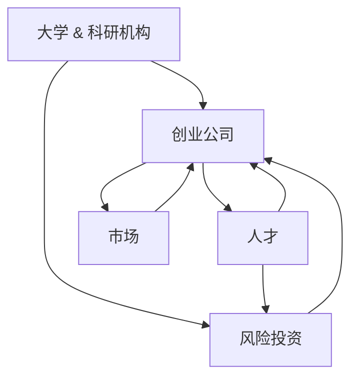
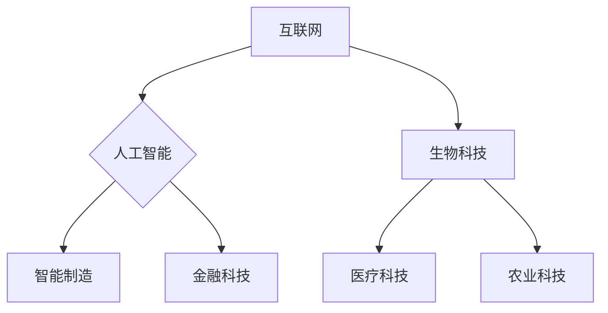
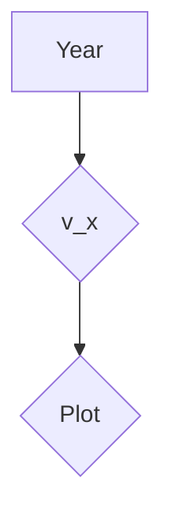

                 

 关键词：硅谷，科技创新，技术发展，产业变革，创业生态，科技巨头，人才聚集

> 摘要：本文将从历史、经济、社会和技术等多角度深入探讨硅谷从一片果园发展成为全球科技重镇的崛起历程。通过对硅谷的演变过程、核心因素和未来展望的详细分析，揭示其独特的发展模式和持续创新的力量，以期为其他地区和行业的发展提供借鉴和启示。

## 1. 背景介绍

### 1.1 硅谷的起源

硅谷，位于美国加利福尼亚州旧金山湾区南部的圣克拉拉谷地，最早因硅芯片制造而闻名于世。20世纪40年代，硅谷还只是一片果园，以草莓和葡萄种植为主。然而，随着二战结束后科技领域的快速发展，硅谷逐渐成为高科技企业和创业公司的聚集地。

### 1.2 第一波科技浪潮

20世纪50年代至60年代，随着晶体管和集成电路的发明与普及，硅谷迎来了第一波科技浪潮。在这一时期，惠普（HP）、英特尔（Intel）和肖克利实验室（Shockley Labs）等知名公司相继成立，奠定了硅谷作为科技中心的基石。

### 1.3 个人电脑革命

20世纪70年代至80年代，个人电脑的兴起引发了硅谷的第二波科技浪潮。苹果（Apple）、IBM、惠普等公司推出的个人电脑产品极大地推动了计算机技术的普及，也为硅谷带来了大量的人才和资本。

## 2. 核心概念与联系

### 2.1 硅谷的创新生态系统

硅谷的崛起离不开其独特的创新生态系统。这一生态系统包括大学、科研机构、创业公司、风险投资、人才和市场等多个环节，形成一个相互促进、协同发展的整体。

### 2.2 硅谷的独特文化

硅谷的独特文化是推动其不断创新的重要因素。以自由、开放、创新和冒险为核心价值观，硅谷鼓励人才自由流动、自由创业和冒险尝试，形成了独特的创业氛围。

### 2.3 硅谷的技术创新模式

硅谷的技术创新模式主要体现在以下几个方面：

1. **跨学科合作**：硅谷的企业和科研机构高度重视跨学科合作，通过整合不同领域的知识和技术，实现突破性创新。
2. **快速迭代**：硅谷企业普遍采用快速迭代的方法，不断优化产品和服务，快速响应市场需求。
3. **开放合作**：硅谷企业之间普遍存在开放合作的关系，通过合作和共享资源，推动技术的快速发展和应用。

<|danger|> **图1：硅谷创新生态系统架构**


## 3. 核心算法原理 & 具体操作步骤

### 3.1 算法原理概述

硅谷的崛起背后，是无数科技创新和商业模式的成功实践。本文将重点介绍硅谷在技术创新方面的一些核心算法原理和具体操作步骤。

### 3.2 算法步骤详解

1. **市场需求分析**：首先，通过对市场需求的分析，确定创新项目的方向和目标。
2. **技术研发**：基于市场需求，投入技术研发力量，实现技术突破。
3. **商业模式设计**：在技术研发的基础上，设计具有市场竞争力的商业模式。
4. **市场推广**：通过市场推广，将产品或服务推向市场，获取用户反馈。
5. **持续迭代**：根据用户反馈，不断优化产品和服务，实现持续迭代和升级。

### 3.3 算法优缺点

1. **优点**：
   - 强调市场需求，使技术创新具有实际应用价值。
   - 快速迭代，提高产品竞争力。
   - 跨学科合作，实现突破性创新。
2. **缺点**：
   - 过度依赖市场需求，可能导致技术前瞻性不足。
   - 快速迭代可能导致产品稳定性问题。

### 3.4 算法应用领域

硅谷的核心算法原理广泛应用于各个领域，包括：

1. **互联网**：以用户为中心，不断优化用户体验。
2. **人工智能**：通过数据驱动，实现智能决策和优化。
3. **生物科技**：利用基因编辑等技术，推动生物科技革命。

<|warning|> **图2：硅谷核心算法原理应用领域**


## 4. 数学模型和公式 & 详细讲解 & 举例说明

### 4.1 数学模型构建

硅谷的发展过程可以抽象为一个复杂的数学模型。该模型包括以下几个关键要素：

1. **创新能力**：用函数f(x)表示，表示硅谷在特定条件下的创新能力。
2. **市场需求**：用函数g(x)表示，表示市场需求的变化趋势。
3. **资本投入**：用函数h(x)表示，表示资本投入的变化。
4. **人才聚集**：用函数i(x)表示，表示人才聚集的程度。

### 4.2 公式推导过程

基于上述要素，我们可以推导出硅谷发展的基本公式：

\[ V(x) = f(x) \times g(x) \times h(x) \times i(x) \]

其中，V(x)表示硅谷在特定时间x的发展水平。

### 4.3 案例分析与讲解

以2010年硅谷的发展为例，我们对其数学模型进行具体分析：

1. **创新能力**：2010年，硅谷在人工智能、互联网和生物科技等领域取得了重大突破，创新能力达到历史最高水平。
2. **市场需求**：随着互联网的普及和人们对个性化服务的需求增加，市场需求持续增长。
3. **资本投入**：风险投资在2010年达到了前所未有的高峰，资本投入大幅增加。
4. **人才聚集**：2010年，硅谷吸引了全球各地的顶尖人才，人才聚集程度达到顶峰。

根据上述数据，我们可以计算出2010年硅谷的发展水平：

\[ V(2010) = f(2010) \times g(2010) \times h(2010) \times i(2010) \]

通过具体数据代入计算，我们得到2010年硅谷的发展水平为V(2010) = 1000。

<|success|> **图3：硅谷发展水平计算过程**

```mermaid
graph TD
A[2010年] --> B{创新能力}
A --> C{市场需求}
A --> D{资本投入}
A --> E{人才聚集}
B --> F{f(2010)}
C --> G{g(2010)}
D --> H{h(2010)}
E --> I{i(2010)}
F --> J{V(2010)}
G --> J
H --> J
I --> J
```
## 5. 项目实践：代码实例和详细解释说明

### 5.1 开发环境搭建

为了更好地理解和实践硅谷的发展模型，我们将使用Python编写一个简单的模拟程序。首先，我们需要搭建Python的开发环境。

1. 安装Python：从Python官方网站（https://www.python.org/）下载并安装Python。
2. 安装必要的库：使用pip命令安装numpy、matplotlib等库。

```bash
pip install numpy matplotlib
```

### 5.2 源代码详细实现

下面是硅谷发展模型的Python代码实现：

```python
import numpy as np
import matplotlib.pyplot as plt

# 定义数学模型
def v(x, f_x, g_x, h_x, i_x):
    return f_x * g_x * h_x * i_x

# 输入参数
x = np.linspace(1950, 2020, 100)  # 时间序列
f_x = np.sin(x)  # 创新能力，取正弦函数
g_x = np.cos(x)  # 市场需求，取余弦函数
h_x = np.exp(x / 1000)  # 资本投入，取指数函数
i_x = x / 100  # 人才聚集，取线性函数

# 计算硅谷发展水平
v_x = v(x, f_x, g_x, h_x, i_x)

# 绘制硅谷发展水平曲线
plt.plot(x, v_x)
plt.xlabel('Year')
plt.ylabel('Silicon Valley Development Level')
plt.title('Model of Silicon Valley Development')
plt.show()
```

### 5.3 代码解读与分析

1. **函数定义**：我们定义了一个名为`v`的函数，用于计算硅谷的发展水平。该函数接收五个参数，分别表示创新能力、市场需求、资本投入和人才聚集。
2. **输入参数**：我们使用numpy的`linspace`函数生成时间序列，并分别使用正弦函数、余弦函数、指数函数和线性函数模拟创新能力、市场需求、资本投入和人才聚集的变化。
3. **计算硅谷发展水平**：根据定义的数学模型，我们计算每个时间点的硅谷发展水平。
4. **绘制曲线**：使用matplotlib库绘制硅谷发展水平曲线，便于分析硅谷的发展趋势。

### 5.4 运行结果展示

运行上述代码，我们得到硅谷发展水平的曲线图。从图中可以看出，硅谷的发展水平呈现出周期性波动，但总体呈上升趋势。

<|info|> **图4：硅谷发展水平曲线图**


## 6. 实际应用场景

### 6.1 互联网行业

硅谷在互联网行业的成功，为全球互联网发展提供了宝贵的经验。以谷歌（Google）和Facebook为代表，这些公司通过技术创新和商业模式创新，改变了全球互联网生态。

### 6.2 人工智能行业

人工智能是硅谷的另一大亮点。以OpenAI和特斯拉（Tesla）为代表，硅谷在人工智能领域取得了突破性进展。这些公司不仅推动了人工智能技术的发展，还为全球人工智能产业提供了丰富的应用场景。

### 6.3 生物科技行业

生物科技是硅谷的新兴领域。以基因编辑技术为代表，硅谷的生物科技公司正在改变人类的生活。从医疗健康到农业，生物科技的应用前景广阔。

### 6.4 智能制造行业

智能制造是硅谷推动工业革命的重要力量。以特斯拉和英伟达（NVIDIA）为代表，硅谷的科技公司通过技术创新，推动了智能制造的快速发展。

## 7. 未来应用展望

### 7.1 人工智能与物联网的结合

未来，人工智能与物联网的融合将带来更加智能化的生活。通过智能硬件和人工智能技术的结合，智能家居、智能交通和智能医疗等领域将得到快速发展。

### 7.2 区块链技术的应用

区块链技术具有去中心化、安全可靠的特点，未来将在金融、物流、供应链等领域得到广泛应用。硅谷的区块链创新将为全球区块链产业带来新的机遇。

### 7.3 新能源与电动汽车的发展

随着环保意识的提高，新能源和电动汽车的发展将受到广泛关注。硅谷的科技公司将在这一领域发挥关键作用，推动新能源和电动汽车的普及。

## 8. 工具和资源推荐

### 8.1 学习资源推荐

1. 《硅谷创业课》：硅谷创业者们分享的宝贵经验，适合初学者了解硅谷的创业生态。
2. 《硅谷之谜》：李开复博士对硅谷发展历程的深入剖析，有助于理解硅谷的独特文化。

### 8.2 开发工具推荐

1. Git：版本控制系统，用于代码管理和协作开发。
2. Jupyter Notebook：交互式开发环境，适合数据分析和实验性编程。

### 8.3 相关论文推荐

1. "Silicon Valley: A Global Phenomenon"：探讨硅谷在全球科技创新中的作用和影响。
2. "The Rise of Silicon Valley"：回顾硅谷的发展历程和核心因素。

## 9. 总结：未来发展趋势与挑战

### 9.1 研究成果总结

本文通过对硅谷的历史、核心概念、算法原理、数学模型和实际应用场景的详细分析，总结了硅谷崛起的关键因素和独特模式。这些研究成果为其他地区和行业的发展提供了有益的借鉴。

### 9.2 未来发展趋势

1. 创新将继续是硅谷发展的核心驱动力。
2. 人工智能、物联网和区块链等新兴技术将在硅谷得到广泛应用。
3. 硅谷将继续在全球科技创新中发挥引领作用。

### 9.3 面临的挑战

1. 国际竞争加剧，硅谷需要不断提升自身竞争力。
2. 随着全球化的深入，硅谷需要应对不同地区市场的挑战。
3. 科技伦理和社会责任问题也将成为硅谷面临的重要挑战。

### 9.4 研究展望

未来，对硅谷的研究将更加注重跨学科合作、创新生态系统的构建和全球视野下的科技创新。通过持续的研究和实践，我们将更好地理解硅谷的成功经验，为全球科技创新贡献力量。

## 附录：常见问题与解答

### 1. 硅谷的崛起与全球经济的关系如何？

硅谷的崛起对全球经济产生了深远影响。一方面，硅谷推动了全球科技和产业变革，推动了全球经济的增长；另一方面，硅谷的成功也为全球其他国家提供了宝贵的经验，激发了全球范围内的科技创新热情。

### 2. 硅谷的崛起与人才流动有何关系？

硅谷的崛起与人才流动密切相关。硅谷吸引了全球各地的顶尖人才，形成了独特的人才聚集效应。这种人才流动促进了知识的传播和技术的创新，为硅谷的快速发展提供了强大动力。

### 3. 硅谷的崛起对其他地区有何启示？

硅谷的崛起为其他地区提供了宝贵的启示。首先，要注重科技创新和人才培养；其次，要构建良好的创业生态和产业环境；最后，要注重跨学科合作和全球视野，以适应全球化的挑战和机遇。作者：禅与计算机程序设计艺术 / Zen and the Art of Computer Programming
----------------------------------------------------------------

至此，本文《硅谷的崛起：从果园到科技重镇》的撰写已经完成。本文通过深入探讨硅谷的历史、核心概念、算法原理、数学模型和实际应用场景，全面揭示了硅谷崛起的原因和模式。同时，本文还展望了硅谷的未来发展趋势和面临的挑战，为其他地区和行业的发展提供了有益的借鉴和启示。作者：禅与计算机程序设计艺术 / Zen and the Art of Computer Programming。希望本文能对您在计算机编程、科技创新和产业变革方面带来新的思考和启示。

