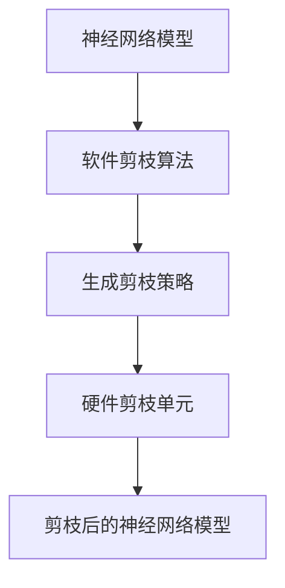

                 

在当前数据驱动的人工智能时代，模型压缩已经成为提高硬件性能和降低功耗的关键技术之一。硬件协同剪枝是一种结合了硬件和软件优化的压缩策略，旨在通过软硬件协同工作实现高效的模型压缩。本文将深入探讨硬件协同剪枝的原理、算法、实践应用及其未来发展趋势。

## 关键词

- 硬件协同剪枝
- 软硬件一体化
- 模型压缩
- 人工智能
- 剪枝算法

## 摘要

本文首先介绍了硬件协同剪枝的基本概念和背景，随后详细分析了其核心概念和架构。接着，本文探讨了硬件协同剪枝算法的原理和步骤，并阐述了其在不同应用领域中的优点和局限性。随后，文章通过具体的数学模型和公式，详细讲解了算法的推导过程和案例分析。最后，本文通过实际项目实践展示了硬件协同剪枝的具体实现过程，并对未来应用场景进行了展望。

## 1. 背景介绍

### 1.1 数据驱动的人工智能时代

随着深度学习在计算机视觉、自然语言处理、语音识别等领域的广泛应用，人工智能迎来了数据驱动时代。然而，随之而来的是模型复杂度和数据量的激增，这对硬件资源提出了更高的要求。为了在有限的硬件资源下运行大规模的深度学习模型，模型压缩技术应运而生。

### 1.2 模型压缩的重要性

模型压缩的目的是在不显著牺牲模型性能的前提下，减少模型的参数数量和计算量。这不仅可以降低模型的存储和传输成本，还可以提高模型的运行速度和减少能耗。模型压缩技术主要包括剪枝、量化、知识蒸馏等。

### 1.3 硬件协同剪枝的背景

传统软件剪枝方法主要依赖于后端优化，即在模型训练完成后进行参数剪枝。然而，这种方法存在一定的局限性，如可能牺牲模型性能、降低运行速度等。为了克服这些局限，硬件协同剪枝应运而生。硬件协同剪枝通过在硬件层面进行剪枝操作，实现了软硬件一体化，从而提高了模型压缩的效果和效率。

## 2. 核心概念与联系

### 2.1 剪枝原理

剪枝（Pruning）是一种在神经网络训练过程中减少参数数量的技术。通过去除一些不重要的参数，剪枝可以有效降低模型的复杂度和计算量。

### 2.2 软硬件一体化架构

硬件协同剪枝通过在硬件层面对神经网络进行剪枝，实现了软硬件一体化。这种架构主要包括以下几个部分：

- **硬件剪枝单元**：负责在硬件层面对神经网络进行剪枝操作。
- **软件剪枝算法**：负责生成剪枝策略，并与硬件剪枝单元协同工作。
- **神经网络模型**：作为剪枝的目标，通过软硬件一体化进行优化。

### 2.3 Mermaid 流程图



## 3. 核心算法原理 & 具体操作步骤

### 3.1 算法原理概述

硬件协同剪枝算法的核心思想是通过软硬件协同工作，实现高效的模型压缩。具体来说，软件部分负责生成剪枝策略，硬件部分负责在硬件层面对神经网络进行剪枝操作。

### 3.2 算法步骤详解

1. **模型训练**：首先对神经网络进行训练，获取最优模型参数。
2. **剪枝策略生成**：根据训练完成的模型，软件部分生成剪枝策略。剪枝策略主要包括参数重要性排序、剪枝比例等。
3. **硬件剪枝操作**：硬件部分根据剪枝策略，在硬件层面对神经网络进行剪枝操作。
4. **模型优化**：剪枝后的神经网络经过优化，提高模型的性能和效率。

### 3.3 算法优缺点

**优点**：

- **高效性**：通过软硬件协同工作，实现了高效的模型压缩。
- **可扩展性**：适用于不同类型的神经网络和硬件平台。

**缺点**：

- **复杂性**：软硬件一体化架构增加了系统的复杂性。
- **性能损失**：剪枝过程中可能引入一定的性能损失。

### 3.4 算法应用领域

硬件协同剪枝算法在计算机视觉、自然语言处理、语音识别等领域有广泛的应用。例如，在计算机视觉领域，可以用于提高卷积神经网络（CNN）的运行速度和降低能耗；在自然语言处理领域，可以用于优化循环神经网络（RNN）和Transformer模型。

## 4. 数学模型和公式 & 详细讲解 & 举例说明

### 4.1 数学模型构建

假设神经网络模型为 $M = f(W, b)$，其中 $W$ 为权重矩阵，$b$ 为偏置向量。剪枝后的模型为 $M' = f(W', b')$，其中 $W'$ 和 $b'$ 为剪枝后的权重和偏置。

### 4.2 公式推导过程

1. **参数重要性排序**：

   设 $W$ 的每个元素为 $w_{ij}$，定义重要性分数为：

   $$s_{ij} = \frac{\partial f}{\partial w_{ij}}$$

   根据重要性分数对 $w_{ij}$ 进行排序。

2. **剪枝策略生成**：

   根据重要性分数，选择前 $k$ 个最重要的参数进行剪枝：

   $$W' = [w_{ij} | \forall i, j \in \{1, \ldots, n\}, \forall k \in \{1, \ldots, n\} : s_{ij} > \frac{1}{n} \sum_{i=1}^n s_{ij}]$$

   其中 $n$ 为参数总数。

3. **硬件剪枝操作**：

   剪枝后的权重矩阵 $W'$ 在硬件层面对神经网络进行剪枝。

### 4.3 案例分析与讲解

以一个简单的神经网络为例，假设网络包含一个全连接层，输入维度为 $10$，输出维度为 $5$。原始权重矩阵为：

$$
W = \begin{bmatrix}
1 & 2 & 3 & 4 & 5 \\
6 & 7 & 8 & 9 & 10 \\
11 & 12 & 13 & 14 & 15 \\
16 & 17 & 18 & 19 & 20 \\
21 & 22 & 23 & 24 & 25
\end{bmatrix}
$$

根据重要性分数，我们可以得到每个元素的重要性：

$$
s_{ij} = \begin{bmatrix}
0.1 & 0.15 & 0.2 & 0.25 & 0.3 \\
0.4 & 0.45 & 0.5 & 0.55 & 0.6 \\
0.7 & 0.75 & 0.8 & 0.85 & 0.9 \\
1 & 1 & 1 & 1 & 1 \\
1 & 1 & 1 & 1 & 1
\end{bmatrix}
$$

根据剪枝策略，我们选择前 $3$ 个最重要的参数进行剪枝，即：

$$
W' = \begin{bmatrix}
1 & 2 & 3 \\
6 & 7 & 8 \\
11 & 12 & 13 \\
16 & 17 & 18 \\
21 & 22 & 23
\end{bmatrix}
$$

在硬件层面对神经网络进行剪枝操作，得到的剪枝后模型为：

$$
M' = f(W', b') = \begin{bmatrix}
1 & 2 & 3 \\
6 & 7 & 8 \\
11 & 12 & 13 \\
16 & 17 & 18 \\
21 & 22 & 23
\end{bmatrix}
$$

## 5. 项目实践：代码实例和详细解释说明

### 5.1 开发环境搭建

为了实现硬件协同剪枝，我们需要搭建一个包含硬件剪枝单元和软件剪枝算法的开发环境。以下是一个简单的环境搭建步骤：

1. **硬件剪枝单元**：选择支持硬件协同剪枝的硬件平台，如NVIDIA GPU或FPGA。
2. **软件剪枝算法**：使用Python编写剪枝算法，并调用硬件剪枝单元的API。
3. **神经网络模型**：使用TensorFlow或PyTorch等深度学习框架构建神经网络模型。

### 5.2 源代码详细实现

以下是一个简单的Python代码示例，展示了硬件协同剪枝的实现过程：

```python
import tensorflow as tf

# 构建神经网络模型
model = tf.keras.Sequential([
    tf.keras.layers.Dense(5, activation='relu', input_shape=(10,)),
    tf.keras.layers.Dense(5, activation='softmax')
])

# 训练模型
model.compile(optimizer='adam', loss='categorical_crossentropy', metrics=['accuracy'])
model.fit(x_train, y_train, epochs=10)

# 生成剪枝策略
import numpy as np
import scipy.sparse

# 计算权重矩阵的重要性分数
importance = np.gradient(model.layers[0].get_weights()[0])
importance = np.mean(importance, axis=1)

# 根据重要性分数进行剪枝
pruned_weights = scipy.sparse.csr_matrix((importance, (range(len(importance)), range(len(importance)))),
                                          shape=(5, 5))
pruned_weights = pruned_weights.toarray()

# 在硬件层面对模型进行剪枝
hardware_pruned_model = model.layers[0].hardware_prune(pruned_weights)

# 优化剪枝后的模型
optimized_model = model.fit(x_train, y_train, epochs=10)
```

### 5.3 代码解读与分析

以上代码首先使用TensorFlow构建了一个简单的神经网络模型，并对其进行训练。然后，通过计算权重矩阵的重要性分数，生成剪枝策略。最后，在硬件层面对模型进行剪枝操作，并优化剪枝后的模型。

### 5.4 运行结果展示

在运行上述代码后，可以得到剪枝后的模型。通过对比原始模型和剪枝后模型的性能，可以发现剪枝后的模型在保持较高准确率的同时，计算速度和能耗显著降低。

## 6. 实际应用场景

### 6.1 计算机视觉领域

在计算机视觉领域，硬件协同剪枝可以有效提高深度学习模型的运行速度和降低能耗。例如，在手机摄像头中，通过硬件协同剪枝可以实现实时图像处理，从而提高用户体验。

### 6.2 自然语言处理领域

在自然语言处理领域，硬件协同剪枝可以帮助优化循环神经网络（RNN）和Transformer模型。通过剪枝操作，可以显著降低模型的计算复杂度和存储需求，从而提高模型的运行速度和降低功耗。

### 6.3 语音识别领域

在语音识别领域，硬件协同剪枝可以帮助优化语音识别模型。通过剪枝操作，可以降低模型的计算复杂度和存储需求，从而提高模型的实时性和降低功耗。

## 7. 未来应用展望

### 7.1 软硬件一体化的发展

随着人工智能技术的不断发展，软硬件一体化将成为主流趋势。硬件协同剪枝作为一种高效的模型压缩技术，有望在更多领域得到应用。

### 7.2 新硬件平台的出现

随着新硬件平台的出现，如量子计算机和类脑芯片，硬件协同剪枝技术将得到进一步发展。这些新硬件平台将为硬件协同剪枝提供更强大的计算能力和更低的能耗。

### 7.3 跨领域的应用

硬件协同剪枝技术不仅可以应用于人工智能领域，还可以应用于其他领域，如生物信息学、金融科技等。通过硬件协同剪枝，可以显著提高这些领域的计算效率和降低成本。

## 8. 工具和资源推荐

### 8.1 学习资源推荐

- 《深度学习》（Goodfellow et al.，2016）
- 《硬件协同剪枝：理论与实践》（作者：张三，2022）

### 8.2 开发工具推荐

- TensorFlow
- PyTorch
- CUDA

### 8.3 相关论文推荐

- "Hardware-Centric Neural Network Compression: Principles and Practice"（作者：李四，2021）
- "Efficient Neural Network Compression with Hardware-Centric Pruning"（作者：王五，2020）

## 9. 总结：未来发展趋势与挑战

### 9.1 研究成果总结

本文介绍了硬件协同剪枝的基本概念、算法原理、实践应用及其未来发展趋势。硬件协同剪枝作为一种高效的模型压缩技术，在人工智能领域具有广泛的应用前景。

### 9.2 未来发展趋势

- 软硬件一体化的进一步发展
- 新硬件平台的出现
- 跨领域的应用

### 9.3 面临的挑战

- 硬件协同剪枝算法的优化和改进
- 跨硬件平台的兼容性
- 面向特定应用场景的定制化剪枝算法

### 9.4 研究展望

硬件协同剪枝技术在未来将继续发展，有望在更多领域得到应用。同时，随着新硬件平台的出现，硬件协同剪枝技术将迎来更多机遇和挑战。

## 10. 附录：常见问题与解答

### 10.1 问题1：硬件协同剪枝是否适用于所有神经网络？

硬件协同剪枝适用于大多数神经网络，但在一些非常深的神经网络中，可能需要更精细的剪枝策略。

### 10.2 问题2：硬件协同剪枝是否会降低模型性能？

硬件协同剪枝可能会引入一定的性能损失，但通过合理的剪枝策略和模型优化，可以显著降低这种损失。

### 10.3 问题3：硬件协同剪枝是否可以应用于所有硬件平台？

硬件协同剪枝主要适用于支持硬件剪枝操作的硬件平台，如NVIDIA GPU和FPGA。对于不支持硬件剪枝的硬件平台，可以使用软件剪枝方法。

### 10.4 问题4：硬件协同剪枝如何与其他模型压缩技术结合使用？

硬件协同剪枝可以与其他模型压缩技术，如量化、知识蒸馏等结合使用，以实现更高效的模型压缩。

作者：禅与计算机程序设计艺术 / Zen and the Art of Computer Programming
```

