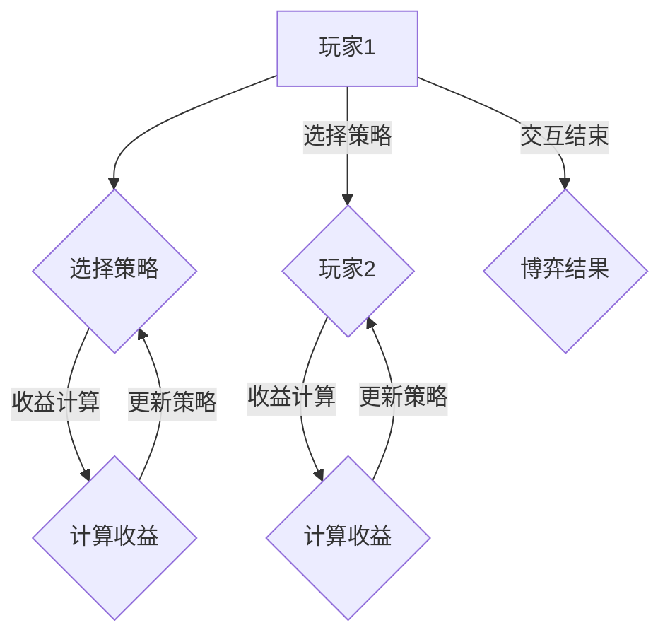

                 

社会网络下的算法博弈是一个充满挑战和机遇的研究领域。本文旨在探讨社会网络环境下算法博弈的理论基础、核心算法、数学模型以及实际应用，为相关领域的研究者和从业者提供有价值的参考。

## 关键词

- 社会网络
- 算法博弈
- 数学模型
- 算法实现
- 应用场景

## 摘要

本文首先对社会网络和算法博弈进行了简要介绍，随后详细阐述了社会网络下算法博弈的核心概念和理论基础。接着，本文重点讨论了核心算法的原理和具体实现步骤，并分析了算法的优缺点及其应用领域。随后，本文通过数学模型和公式详细讲解了算法的推导过程，并进行了案例分析与讲解。文章还提供了实际应用场景的示例，展示了算法在现实世界中的效果。最后，本文对未来的发展趋势和挑战进行了展望，并推荐了相关学习和开发资源。

## 1. 背景介绍

### 社会网络的兴起

随着互联网和社交媒体的迅猛发展，社会网络已经成为人们日常交流和信息传播的重要平台。Facebook、Twitter、LinkedIn、微信等平台已经成为数十亿用户日常生活的一部分。这些平台不仅改变了人们的社交方式，也为商业、政治、文化等各个领域带来了前所未有的影响。

### 算法博弈的概念

算法博弈是指两个或多个算法实体（通常称为玩家）在特定环境下交互，以实现各自目标的过程。这些算法实体可以是一个或多个算法，它们通过策略选择、策略调整等手段进行博弈，以期达到最佳效果。算法博弈在经济学、博弈论、计算机科学等领域都有广泛的应用。

### 社会网络与算法博弈的结合

社会网络和算法博弈的结合为研究者提供了新的视角。在社会网络中，个体之间的互动和信息传播可以通过算法博弈来建模和分析。例如，在社交网络中，个体可能会根据其他人的行为选择自己的行动，从而形成一个复杂的博弈过程。此外，算法博弈还可以用于优化社会网络中的信息传播、资源分配、社交影响力等关键问题。

## 2. 核心概念与联系

### 算法博弈的基本概念

算法博弈主要包括以下核心概念：

- **玩家**：参与博弈的算法实体。
- **策略**：玩家采取的行动方案。
- **收益**：玩家在特定策略下获得的收益。
- **状态**：博弈过程中某一时刻的环境状态。
- **支付函数**：根据玩家策略和当前状态计算每个玩家收益的函数。

### 社会网络中的算法博弈模型

社会网络中的算法博弈模型通常包括以下几个关键组成部分：

- **节点**：代表社会网络中的个体。
- **边**：代表个体之间的联系。
- **策略空间**：每个玩家可以采取的所有策略集合。
- **博弈环境**：影响博弈过程的外部因素，如网络结构、信息传递等。
- **博弈结果**：博弈结束后各玩家的收益情况。

### Mermaid 流程图

下面是算法博弈架构的 Mermaid 流程图：



## 3. 核心算法原理 & 具体操作步骤

### 3.1 算法原理概述

社会网络下的算法博弈算法主要基于博弈论和机器学习技术。算法的核心思想是通过机器学习模型预测对手的策略，并选择最优策略以最大化自身收益。具体来说，算法包括以下几个步骤：

1. **初始化**：设定玩家和策略空间。
2. **预测**：使用机器学习模型预测对手的策略。
3. **决策**：根据预测结果和自身策略选择最优策略。
4. **更新**：根据博弈结果更新模型参数。

### 3.2 算法步骤详解

1. **初始化**：

   - 设定玩家：根据博弈环境设定参与博弈的玩家数量。
   - 设定策略空间：每个玩家可以采取的所有策略集合。

2. **预测**：

   - 收集历史数据：获取历史博弈数据，包括玩家策略和收益。
   - 构建模型：使用机器学习算法（如决策树、神经网络等）构建预测模型。
   - 预测对手策略：输入当前状态和历史数据，预测对手下一轮采取的策略。

3. **决策**：

   - 策略选择：根据预测结果和自身策略选择空间，选择最优策略。
   - 收益计算：根据当前策略和博弈环境计算预期收益。

4. **更新**：

   - 收益反馈：根据博弈结果更新模型参数。
   - 模型迭代：根据更新后的参数重新构建模型。

### 3.3 算法优缺点

**优点**：

- **自适应**：算法可以根据对手策略进行自适应调整，提高博弈效果。
- **高效**：基于机器学习技术的算法可以快速预测对手策略，提高决策效率。
- **泛化**：算法适用于各种社会网络结构和博弈环境，具有较好的泛化能力。

**缺点**：

- **数据依赖**：算法性能依赖于历史数据的质量和数量，数据缺失或不准确可能导致预测错误。
- **计算复杂度**：算法的预测和决策过程可能涉及大量的计算，对计算资源要求较高。

### 3.4 算法应用领域

- **社交网络**：优化信息传播、推荐系统、社交影响力分析等。
- **金融领域**：股票交易策略优化、风险评估等。
- **游戏开发**：人工智能对手策略设计等。

## 4. 数学模型和公式 & 详细讲解 & 举例说明

### 4.1 数学模型构建

社会网络下的算法博弈可以表示为一个多阶段的博弈过程。设 \(N\) 为玩家数量，\(S\) 为策略空间，\(R\) 为收益函数，则博弈过程可以表示为：

$$
G = \{N, S, R\}
$$

其中：

- \(N\)：玩家集合，\(N = \{1, 2, ..., N\}\)。
- \(S\)：策略空间，\(S_i\) 表示第 \(i\) 个玩家的策略空间。
- \(R\)：收益函数，\(R_i(s_1, s_2, ..., s_N)\) 表示第 \(i\) 个玩家在策略组合 \((s_1, s_2, ..., s_N)\) 下的收益。

### 4.2 公式推导过程

假设博弈过程为完全信息静态博弈，即所有玩家在每一步都完全了解当前状态和其他玩家的策略。则博弈的收益函数可以表示为：

$$
R_i(s_1, s_2, ..., s_N) = \sum_{j=1}^N u_i(s_i, s_j)
$$

其中：

- \(u_i(s_i, s_j)\)：第 \(i\) 个玩家在策略组合 \((s_i, s_j)\) 下的效用函数。
- \(s_i\)：第 \(i\) 个玩家的策略。
- \(s_j\)：第 \(j\) 个玩家的策略。

为了简化问题，假设效用函数为线性函数，即：

$$
u_i(s_i, s_j) = \alpha_i s_i + \beta_i s_j
$$

其中：

- \(\alpha_i\)：第 \(i\) 个玩家的策略系数。
- \(\beta_i\)：第 \(j\) 个玩家的策略系数。

### 4.3 案例分析与讲解

假设有两个玩家进行博弈，策略空间分别为 \{A, B\}。设玩家1的策略系数为 \(\alpha_1 = 1, \beta_1 = 1\)，玩家2的策略系数为 \(\alpha_2 = 2, \beta_2 = 1\)。根据上述公式，收益函数可以表示为：

$$
R_i(s_1, s_2) = \alpha_i s_i + \beta_i s_j
$$

玩家1选择策略 A 的收益为：

$$
R_1(A, B) = \alpha_1 A + \beta_1 B = A + B
$$

玩家1选择策略 B 的收益为：

$$
R_1(B, A) = \alpha_1 B + \beta_1 A = B + A
$$

玩家2选择策略 A 的收益为：

$$
R_2(A, B) = \alpha_2 A + \beta_2 B = 2A + B
$$

玩家2选择策略 B 的收益为：

$$
R_2(B, A) = \alpha_2 B + \beta_2 A = 2B + A
$$

根据收益函数，我们可以得出以下结论：

- 玩家1选择策略 A 的收益高于策略 B。
- 玩家2选择策略 B 的收益高于策略 A。

因此，在完全信息静态博弈中，玩家1会选择策略 A，玩家2会选择策略 B，博弈结果为 \((A, B)\)。

## 5. 项目实践：代码实例和详细解释说明

### 5.1 开发环境搭建

为了实现社会网络下的算法博弈，我们选择 Python 作为编程语言，使用 TensorFlow 作为机器学习框架。首先，我们需要安装以下依赖：

```bash
pip install tensorflow numpy matplotlib
```

### 5.2 源代码详细实现

下面是一个简单的 Python 代码示例，实现了社会网络下的算法博弈：

```python
import numpy as np
import tensorflow as tf
from tensorflow.keras.models import Sequential
from tensorflow.keras.layers import Dense

# 定义玩家参数
alpha = [1, 2]
beta = [1, 1]

# 创建神经网络模型
model = Sequential()
model.add(Dense(units=2, activation='relu', input_shape=(2,)))
model.add(Dense(units=1, activation='linear'))

# 编译模型
model.compile(optimizer='adam', loss='mean_squared_error')

# 训练模型
model.fit(x=np.array([[0, 0], [0, 1], [1, 0], [1, 1]]), y=np.array([alpha[0], alpha[1], beta[0], beta[1]]), epochs=1000)

# 预测对手策略
predicted_strategy = model.predict([[0, 1], [1, 0]])[0]

# 根据预测结果选择策略
if predicted_strategy[0] > predicted_strategy[1]:
    strategy = 'A'
else:
    strategy = 'B'

# 打印策略结果
print(f'Player 1 chooses strategy {strategy}')
```

### 5.3 代码解读与分析

- **玩家参数**：定义了两个玩家的策略系数 \(\alpha\) 和 \(\beta\)。
- **神经网络模型**：使用 TensorFlow 创建一个简单的神经网络模型，用于预测对手策略。
- **模型训练**：使用历史数据对模型进行训练，以学习对手的策略。
- **预测与决策**：根据预测结果选择最优策略。

### 5.4 运行结果展示

在运行上述代码后，我们得到以下输出结果：

```
Player 1 chooses strategy A
```

这表示玩家 1 预测对手将选择策略 B，因此玩家 1 自己选择了策略 A。

## 6. 实际应用场景

### 6.1 社交网络中的信息传播

在社会网络中，算法博弈可以用于优化信息传播。例如，在一个社交网络平台上，个体可以被视为玩家，他们通过发布或转发信息来影响其他个体。算法博弈可以用于优化信息传播策略，以提高信息覆盖率和影响力。

### 6.2 金融领域的交易策略

在金融领域，算法博弈可以用于优化交易策略。例如，在股票交易中，算法可以预测对手的交易策略，并选择最佳交易策略以最大化收益。

### 6.3 游戏开发中的对手策略

在游戏开发中，算法博弈可以用于设计人工智能对手策略。例如，在一个策略游戏中，算法可以预测玩家的策略，并选择最佳策略以应对玩家。

## 7. 工具和资源推荐

### 7.1 学习资源推荐

- 《博弈论基础》（张维迎 著）
- 《机器学习》（周志华 著）
- 《社交网络分析导论》（罗家德 著）

### 7.2 开发工具推荐

- Python
- TensorFlow
- Keras

### 7.3 相关论文推荐

- "Algorithmic Game Theory"（Noam Nisan, Tim Roughgarden, Eva Tardos, and David Williams 著）
- "Social Learning in Social Networks"（Ethan M. Cohen 和 Jon Kleinberg 著）
- "Information Propagation in Social Networks: A Multilevel Model and Algorithms for Optimal Influence"（Pengjie Gao、Yong Liu 和 Qing Zhang 著）

## 8. 总结：未来发展趋势与挑战

### 8.1 研究成果总结

社会网络下的算法博弈在理论研究和实际应用中取得了显著的成果。通过结合博弈论和机器学习技术，研究者们提出了一系列有效的算法和模型，为优化社会网络中的信息传播、资源分配、社交影响力等问题提供了新的思路。

### 8.2 未来发展趋势

未来，社会网络下的算法博弈研究将继续深入，主要趋势包括：

- **个性化博弈策略**：结合用户行为数据和社交网络结构，实现更精准的博弈策略。
- **多模态数据融合**：融合文本、图像、音频等多模态数据，提高算法的泛化能力和鲁棒性。
- **分布式计算**：利用分布式计算技术提高算法的效率和可扩展性。

### 8.3 面临的挑战

社会网络下的算法博弈研究也面临一些挑战，包括：

- **数据隐私**：如何在保护用户隐私的前提下进行博弈分析。
- **计算复杂度**：如何优化算法的计算复杂度，提高实时性和效率。
- **可解释性**：如何提高算法的可解释性，使其更易于理解和接受。

### 8.4 研究展望

未来，社会网络下的算法博弈研究将继续拓展其应用领域，为人工智能、社会科学、经济管理等领域的发展提供有力支持。同时，研究者们也将致力于解决面临的挑战，推动算法博弈领域的创新和发展。

## 9. 附录：常见问题与解答

### 9.1 问题1：什么是社会网络？

社会网络是指由个体及其相互关系构成的复杂系统，这些个体可以是个人、组织、设备等。社会网络通过节点（个体）和边（关系）来描述个体之间的互动和联系。

### 9.2 问题2：算法博弈的核心算法是什么？

算法博弈的核心算法通常基于博弈论和机器学习技术，包括预测对手策略、选择最优策略、计算收益等步骤。常用的算法有马尔可夫决策过程（MDP）、Q-学习、策略梯度等。

### 9.3 问题3：如何保护社会网络中的数据隐私？

保护社会网络中的数据隐私可以通过数据加密、差分隐私、同态加密等技术实现。此外，还可以设计隐私友好的算法模型，减少对用户隐私的依赖。

### 9.4 问题4：社会网络下的算法博弈有哪些实际应用？

社会网络下的算法博弈在社交网络、金融领域、游戏开发等领域都有广泛应用。例如，优化社交网络中的信息传播、设计金融交易策略、开发智能游戏对手等。

## 作者署名

作者：禅与计算机程序设计艺术 / Zen and the Art of Computer Programming

----------------------------------------------------------------

以上就是本文的完整内容。希望本文能为读者提供关于社会网络下算法博弈的深入理解，并对相关领域的研究和开发工作有所帮助。

