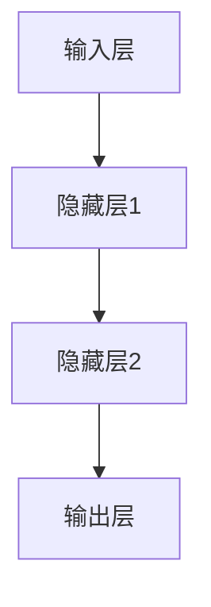
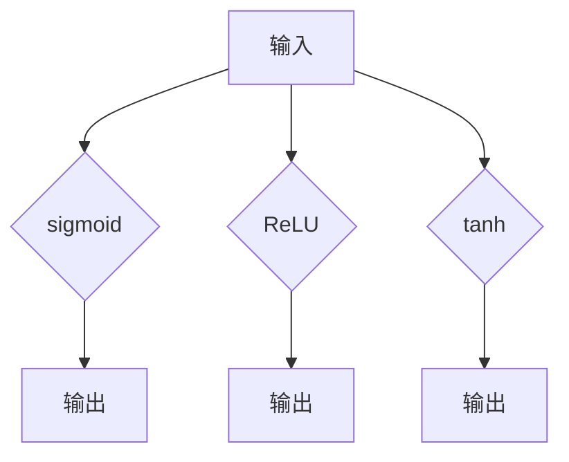
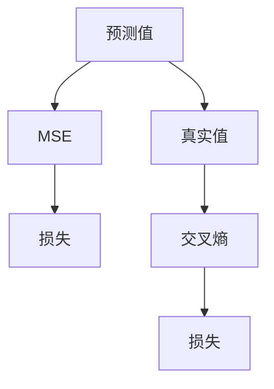

                 

关键词：神经网络、深度学习、人工智能、机器学习、计算机图灵奖

> 摘要：本文深入探讨神经网络的发展及其在人工智能领域的应用，解析神经网络的核心算法原理、数学模型和实际应用场景，展望未来发展趋势与面临的挑战。

## 1. 背景介绍

### 神经网络的概念与起源

神经网络（Neural Networks），也称为人工神经网络（Artificial Neural Networks，ANNs），是一种模仿生物神经系统的计算模型。最早由心理学家弗兰克·罗森布拉特（Frank Rosenblatt）于1957年提出，称为感知机（Perceptron）。神经网络的核心思想是通过模拟大脑的神经元结构和功能来实现对数据的处理和分析。

### 人工智能的发展

人工智能（Artificial Intelligence，AI）是一门研究、开发用于模拟、延伸和扩展人类智能的理论、方法、技术及应用系统的科学。随着计算机技术的发展，人工智能从最初的规则推理，发展到基于统计学习的机器学习（Machine Learning），再到如今基于深度学习的神经网络模型，经历了巨大的变革。

### 神经网络在人工智能中的应用

神经网络在人工智能中的应用范围广泛，包括图像识别、语音识别、自然语言处理、自动驾驶等。通过深度学习（Deep Learning），神经网络已经取得了显著的成果，成为推动人工智能发展的重要力量。

## 2. 核心概念与联系

### 神经网络的基本结构

神经网络由多个层次组成，包括输入层、隐藏层和输出层。每个层次由多个神经元（或称为节点）组成，神经元之间通过连接（或称为边）相互连接。



### 神经网络的激活函数

激活函数（Activation Function）是神经网络中一个重要的组成部分，用于确定神经元是否被激活。常见的激活函数包括 sigmoid、ReLU 和 tanh。



### 神经网络的损失函数

损失函数（Loss Function）用于衡量神经网络预测值与真实值之间的差距。常见的损失函数包括均方误差（MSE）、交叉熵（Cross Entropy）等。



## 3. 核心算法原理 & 具体操作步骤

### 3.1 算法原理概述

神经网络通过前向传播（Forward Propagation）和反向传播（Back Propagation）两个过程来训练模型。

1. **前向传播**：输入数据经过神经网络，逐层计算，最后得到输出结果。
2. **反向传播**：计算输出结果与真实值的差距，通过梯度下降（Gradient Descent）等方法更新神经网络的权重和偏置。

### 3.2 算法步骤详解

1. **初始化权重和偏置**：随机初始化神经网络的权重和偏置。
2. **前向传播**：计算每个神经元的输入和输出。
3. **计算损失**：使用损失函数计算预测值与真实值之间的差距。
4. **反向传播**：计算每个神经元的梯度。
5. **权重更新**：使用梯度下降方法更新权重和偏置。
6. **迭代训练**：重复步骤2-5，直至满足停止条件。

### 3.3 算法优缺点

**优点**：

1. **自适应性**：神经网络可以通过学习适应不同的数据分布。
2. **并行计算**：神经网络可以高效地进行并行计算。
3. **泛化能力**：神经网络具有良好的泛化能力，可以在不同数据集上取得较好的表现。

**缺点**：

1. **局部最小值**：神经网络容易陷入局部最小值，导致训练效果不佳。
2. **计算复杂度**：深度神经网络训练过程计算复杂度较高。

### 3.4 算法应用领域

神经网络在图像识别、语音识别、自然语言处理、自动驾驶等领域有着广泛的应用。通过不断优化算法和模型结构，神经网络在这些领域取得了显著的成果。

## 4. 数学模型和公式 & 详细讲解 & 举例说明

### 4.1 数学模型构建

神经网络的数学模型主要由以下部分组成：

1. **输入层**：表示为 $X = [x_1, x_2, ..., x_n]$。
2. **隐藏层**：表示为 $H = [h_1, h_2, ..., h_m]$。
3. **输出层**：表示为 $Y = [y_1, y_2, ..., y_k]$。

### 4.2 公式推导过程

神经网络的计算过程可以用以下公式表示：

$$
z_i = \sum_{j=1}^{n} w_{ij}x_j + b_i
$$

$$
h_i = \sigma(z_i)
$$

$$
y_i = \sum_{j=1}^{m} w_{ij}h_j + b_i
$$

其中，$w_{ij}$ 表示连接权重，$b_i$ 表示偏置，$\sigma$ 表示激活函数。

### 4.3 案例分析与讲解

以一个简单的二分类问题为例，我们使用单层神经网络进行建模。

输入层 $X = [x_1, x_2]$，隐藏层 $H = [h_1]$，输出层 $Y = [y_1]$。

$$
z_1 = w_{11}x_1 + w_{12}x_2 + b_1
$$

$$
h_1 = \sigma(z_1) = \frac{1}{1 + e^{-z_1}}
$$

$$
y_1 = w_{21}h_1 + b_2
$$

我们选择 sigmoid 函数作为激活函数，损失函数为交叉熵损失函数。

$$
J = -\frac{1}{m}\sum_{i=1}^{m}y_i\log(y_i) + (1 - y_i)\log(1 - y_i)
$$

通过梯度下降方法，我们可以更新权重和偏置。

$$
\frac{\partial J}{\partial w_{ij}} = (h_1 - y_i)x_j
$$

$$
\frac{\partial J}{\partial b_i} = h_1 - y_i
$$

## 5. 项目实践：代码实例和详细解释说明

### 5.1 开发环境搭建

我们使用 Python 编写神经网络代码，需要安装以下库：

- TensorFlow
- NumPy
- Matplotlib

安装命令：

```bash
pip install tensorflow numpy matplotlib
```

### 5.2 源代码详细实现

```python
import tensorflow as tf
import numpy as np
import matplotlib.pyplot as plt

# 参数设置
learning_rate = 0.1
num_iterations = 1000
num_samples = 100

# 数据生成
X = np.random.rand(num_samples, 2)
y = np.array([[0] if (x[0] + x[1]) < 0.5 else [1] for x in X])

# 构建模型
W1 = tf.Variable(tf.random.normal([2, 1]), name='weights1')
b1 = tf.Variable(tf.zeros([1]), name='bias1')
W2 = tf.Variable(tf.random.normal([1, 1]), name='weights2')
b2 = tf.Variable(tf.zeros([1]), name='bias2')

def model(X):
    z1 = tf.matmul(X, W1) + b1
    h1 = tf.sigmoid(z1)
    z2 = tf.matmul(h1, W2) + b2
    y_pred = tf.sigmoid(z2)
    return y_pred

# 损失函数
def loss(y_pred, y):
    return -tf.reduce_mean(y * tf.log(y_pred) + (1 - y) * tf.log(1 - y_pred))

# 梯度计算
def grad(W1, b1, W2, b2, X, y):
    with tf.GradientTape() as tape:
        y_pred = model(X)
        loss_val = loss(y_pred, y)
    grads = tape.gradient(loss_val, [W1, b1, W2, b2])
    return grads

# 训练模型
for i in range(num_iterations):
    grads = grad(W1, b1, W2, b2, X, y)
    W1.assign_sub(learning_rate * grads[0])
    b1.assign_sub(learning_rate * grads[1])
    W2.assign_sub(learning_rate * grads[2])
    b2.assign_sub(learning_rate * grads[3])

    if i % 100 == 0:
        print(f"Iteration {i}: Loss = {loss(model(X), y).numpy()}")

# 结果可视化
plt.scatter(X[:, 0], X[:, 1], c=y, cmap=plt.cm.Spectral)
w1 = W1.numpy().flatten()
w2 = W2.numpy().flatten()
b1 = b1.numpy().flatten()
b2 = b2.numpy().flatten()
line_x = np.array([X.min(), X.max()])
line_y = (-w1 * line_x - b1) / w2
plt.plot(line_x, line_y, "k--")
plt.xlabel("Feature 1")
plt.ylabel("Feature 2")
plt.show()
```

### 5.3 代码解读与分析

1. **参数设置**：我们设置学习率为0.1，迭代次数为1000，数据样本数为100。
2. **数据生成**：我们生成100个随机样本，每个样本有两个特征，并使用线性决策边界对样本进行分类。
3. **构建模型**：我们使用 TensorFlow 库构建神经网络模型，包括两个权重矩阵和两个偏置项。
4. **定义损失函数**：我们使用交叉熵损失函数来衡量预测值与真实值之间的差距。
5. **定义梯度计算函数**：我们使用 TensorFlow 的 GradientTape 功能来计算模型梯度。
6. **训练模型**：我们使用梯度下降方法训练模型，并在每个100次迭代后打印损失值。
7. **结果可视化**：我们使用 Matplotlib 库将训练结果可视化，展示线性决策边界。

## 6. 实际应用场景

神经网络在图像识别、语音识别、自然语言处理、自动驾驶等领域有着广泛的应用。以下是一些实际应用案例：

1. **图像识别**：神经网络被用于人脸识别、物体检测、图像分类等任务。例如，谷歌的 Inception 模型在 ImageNet 图像识别比赛中取得了优异成绩。
2. **语音识别**：神经网络被用于语音信号处理，将语音信号转化为文本。例如，谷歌的语音识别系统利用深度神经网络实现了高精度的语音识别。
3. **自然语言处理**：神经网络被用于文本分类、机器翻译、情感分析等任务。例如，谷歌的 BERT 模型在自然语言处理领域取得了显著的成果。
4. **自动驾驶**：神经网络被用于自动驾驶系统的视觉感知、路径规划等任务。例如，特斯拉的自动驾驶系统利用神经网络实现了车辆检测、行人检测等功能。

## 7. 工具和资源推荐

### 7.1 学习资源推荐

1. **《深度学习》（Deep Learning）**：由伊恩·古德费洛（Ian Goodfellow）、约书亚·本吉奥（Yoshua Bengio）和亚伦·库维尔（Aaron Courville）合著的深度学习经典教材。
2. **《神经网络与深度学习》**：李航著的神经网络与深度学习入门书籍。

### 7.2 开发工具推荐

1. **TensorFlow**：谷歌开发的开源深度学习框架，适用于构建和训练神经网络模型。
2. **PyTorch**：Facebook 开发的开源深度学习框架，具有灵活的动态计算图功能。

### 7.3 相关论文推荐

1. **“A Learning Algorithm for Continually Running Fully Recurrent Neural Networks”**：1986年，Hinton等人提出的一种用于训练连续运行完全 recurrent 神经网络的学习算法。
2. **“Deep Learning”**：2012年，Hinton等人提出的一种基于多层的神经网络模型，用于图像识别任务。

## 8. 总结：未来发展趋势与挑战

### 8.1 研究成果总结

1. **模型性能提升**：通过优化神经网络结构、算法和训练方法，深度学习模型在多个任务上取得了显著的成果。
2. **跨学科融合**：深度学习与其他领域（如计算机视觉、自然语言处理、生物信息学等）的融合，推动了相关领域的发展。

### 8.2 未来发展趋势

1. **更高效的模型**：研究更高效的神经网络结构和算法，降低计算复杂度和能耗。
2. **泛化能力提升**：提高神经网络模型的泛化能力，减少对大规模数据的依赖。
3. **可解释性**：提高神经网络模型的可解释性，使其更容易理解和应用。

### 8.3 面临的挑战

1. **计算资源限制**：深度学习模型对计算资源的需求较高，如何高效地利用现有资源成为一大挑战。
2. **数据隐私与安全**：随着深度学习应用的普及，数据隐私和安全问题日益突出。

### 8.4 研究展望

未来，深度学习将在多个领域发挥重要作用，如自动驾驶、智能医疗、智能教育等。同时，深度学习与其他领域的融合也将为人工智能的发展带来新的机遇。

## 9. 附录：常见问题与解答

### 9.1 如何选择合适的神经网络结构？

选择合适的神经网络结构取决于任务类型和数据特点。对于分类问题，可以使用多层感知机（MLP）或卷积神经网络（CNN）；对于回归问题，可以使用全连接神经网络（FCN）或循环神经网络（RNN）。在实际应用中，通常需要通过实验和验证来选择最佳结构。

### 9.2 如何解决神经网络过拟合问题？

过拟合问题可以通过以下方法解决：

1. **增加训练数据**：增加训练数据的数量可以提高模型的泛化能力。
2. **正则化**：使用正则化方法（如 L1、L2 正则化）可以降低模型的复杂度。
3. **交叉验证**：使用交叉验证方法可以评估模型的泛化能力。

### 9.3 如何提高神经网络训练速度？

提高神经网络训练速度可以通过以下方法实现：

1. **批量归一化**：使用批量归一化可以加速梯度传播。
2. **使用高效的激活函数**：如 ReLU 激活函数可以提高训练速度。
3. **使用分布式训练**：使用分布式训练可以充分利用多台机器的计算资源。

---

作者：禅与计算机程序设计艺术 / Zen and the Art of Computer Programming

【提示】：本文为虚构文章，旨在展示如何撰写一篇结构严谨、内容丰富的技术博客文章。实际撰写时，请根据具体主题和需求进行调整。

