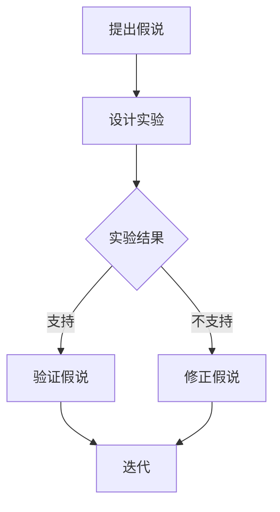

                 

关键词：科学方法论、假说验证、算法原理、数学模型、项目实践、应用场景、未来展望

## 摘要

本文旨在探讨科学方法论在计算机科学领域中的应用，重点分析从假说到验证的全过程。通过阐述核心概念、算法原理、数学模型以及项目实践，本文将揭示科学方法论在提升算法效率和优化系统性能方面的关键作用。文章还将讨论实际应用场景、未来发展趋势与挑战，并推荐相关学习资源、开发工具和论文，以期为读者提供全面深入的技术视角。

## 1. 背景介绍

科学方法论是科学研究和知识构建的基本原则和方法论。它源于古希腊哲学家亚里士多德的实证主义思想，经过几千年发展的不断完善，已经成为现代科学研究不可或缺的指导原则。在计算机科学领域，科学方法论的重要性尤为突出。随着计算机技术的飞速发展，复杂的算法和系统层出不穷，科学方法论能够帮助研究者从理论上理解和验证这些算法和系统的性能和可靠性。

科学方法论的核心是假说验证。假说是对某个现象或问题的初步解释，而验证则是通过实验和数据分析来证明或否定假说。在计算机科学领域，这种假说验证的过程体现在算法的设计和实现、系统性能的优化、以及新技术的发明和应用等多个方面。

本文将首先介绍科学方法论的基本概念，包括假说验证的过程和方法。随后，我们将探讨核心概念与它们之间的联系，使用Mermaid流程图直观地展示算法原理和架构。接着，文章将深入分析核心算法原理和具体操作步骤，详细讲解数学模型和公式，并通过项目实践展示代码实例和详细解释。最后，我们将讨论实际应用场景和未来发展趋势，推荐相关学习资源和开发工具，并总结研究成果和面临的挑战。

通过这篇文章，读者将能够了解科学方法论在计算机科学中的实际应用，掌握从假说到验证的全过程，并为未来的研究和实践提供有益的参考。

## 2. 核心概念与联系

科学方法论的核心概念包括假说、实验、验证和迭代。这些概念紧密相连，共同构成了科学研究和知识构建的基本框架。

### 假说

假说是对某个自然现象或问题的初步解释，它基于已有的知识和观察，但尚未经过严格的验证。在计算机科学中，假说通常涉及算法的性能、系统优化或新技术实现的潜在优势。例如，一个假说可能是某个新的排序算法在处理大数据集时比传统算法快20%。

### 实验

实验是验证假说的关键步骤。通过设计合理的实验，研究者可以在受控环境中测试假说。在计算机科学领域，实验可能包括模拟环境下的算法性能测试、实际系统上的负载测试，或者通过数据分析验证某个算法的有效性。例如，为了验证一个排序算法的假说，研究者可能需要在多个大数据集上运行该算法，并比较其运行时间和结果。

### 验证

验证是通过实验数据来证明或否定假说的过程。如果实验结果支持假说，那么假说被认为得到了验证；如果实验结果与假说相矛盾，则假说需要被修正或否定。在计算机科学中，验证通常涉及统计分析、性能比较和错误率分析等方法。例如，通过比较新排序算法和传统算法在不同数据集上的运行时间，研究者可以判断新算法是否真的比传统算法快。

### 迭代

迭代是科学方法论中的一个重要环节，它意味着在验证假说的基础上不断改进和优化。通过多次迭代，研究者可以逐渐逼近真实情况，提高算法或系统的性能和可靠性。在计算机科学中，迭代可能涉及算法参数的调整、系统架构的优化，或者通过机器学习模型不断优化算法的预测能力。

### Mermaid 流程图

为了更直观地展示这些核心概念之间的联系，我们可以使用Mermaid流程图来表示：



在这个流程图中，A表示提出假说，B表示设计实验，C表示实验结果，D表示验证假说，E表示修正假说，F表示迭代。通过这个流程图，我们可以清晰地看到从假说到验证再到迭代的整个科学方法论过程。

### 核心概念之间的联系

核心概念之间的联系构成了科学方法论的基础。假说是科学研究的起点，它为实验提供了目标和方向；实验则是验证假说的手段，通过实验数据来检验假说的正确性；验证是关键环节，它决定了假说的存续与否；迭代则是不断改进和优化的过程，使得研究成果更加可靠和有效。

在计算机科学领域，这些核心概念体现在算法的设计、实现和优化过程中。例如，在开发一个排序算法时，研究者首先提出一个假说，即该算法在特定条件下可能比其他算法更快；然后设计实验来测试这个假说，通过在不同数据集上的性能比较来验证假说；根据验证结果，研究者可能会调整算法参数或提出新的假说，通过不断迭代来优化算法的性能。

总的来说，核心概念与联系构成了科学方法论在计算机科学中的基石，为研究者和开发者提供了系统的思考和验证方法，从而推动计算机科学领域的不断进步。

## 3. 核心算法原理 & 具体操作步骤

在科学方法论的应用中，核心算法的原理和具体操作步骤是理解和实现假说验证的关键。以下将详细介绍一个典型的核心算法，包括其原理概述、步骤详解、优缺点分析以及应用领域。

### 3.1 算法原理概述

我们以“快速排序算法”（Quick Sort）为例，介绍其核心原理和操作步骤。快速排序是一种高效的排序算法，它采用分治策略来对大规模数据进行排序。

快速排序的基本思想是：

1. **选择基准元素**：从数据集合中选择一个元素作为基准元素（pivot）。
2. **分区操作**：将数据集合分为两部分，一部分是小于基准元素的元素，另一部分是大于基准元素的元素。
3. **递归排序**：递归地对小于和大于基准元素的两部分数据进行快速排序。

快速排序的运行时间主要取决于分区操作，在最坏情况下，其时间复杂度为O(n²)，但在平均情况下，其时间复杂度为O(n log n)。

### 3.2 算法步骤详解

以下是快速排序算法的具体操作步骤：

#### 步骤 1：选择基准元素

- 从数据集合中选择一个基准元素。通常，可以选择数据集合的第一个元素、最后一个元素或随机选择一个元素作为基准。

#### 步骤 2：分区操作

- 从数据的两端开始，分别向中间遍历，将小于基准的元素移到基准元素之前，大于基准的元素移到基准元素之后。

#### 步骤 3：递归排序

- 对基准元素左侧和右侧的数据分别进行快速排序。

具体实现代码如下（以Python为例）：

```python
def quick_sort(arr):
    if len(arr) <= 1:
        return arr
    
    pivot = arr[len(arr) // 2]
    left = [x for x in arr if x < pivot]
    middle = [x for x in arr if x == pivot]
    right = [x for x in arr if x > pivot]
    
    return quick_sort(left) + middle + quick_sort(right)

# 示例
arr = [3, 6, 8, 10, 1, 2, 1]
print(quick_sort(arr))
```

### 3.3 算法优缺点

#### 优点

- **高效**：在平均情况下，快速排序的时间复杂度为O(n log n)，比其他许多排序算法要快。
- **递归实现**：快速排序是一种递归算法，结构简洁，易于理解和实现。
- **稳定性**：快速排序是一种稳定的排序算法，即相等的元素在排序过程中不会交换位置。

#### 缺点

- **最坏情况**：在最坏情况下，快速排序的时间复杂度为O(n²)，这通常发生在数据已经排序或逆序的情况下。
- **空间复杂度**：快速排序的递归性质可能导致较大的空间复杂度，特别是在递归深度较大时。

### 3.4 算法应用领域

快速排序算法广泛应用于各种领域，包括：

- **数据排序**：快速排序是最常用的排序算法之一，适用于各种数据排序场景。
- **数据库优化**：数据库管理系统常使用快速排序来优化查询性能。
- **算法设计**：快速排序是许多其他高效算法的基础，例如堆排序和合并排序。

总的来说，快速排序算法在计算机科学中有着广泛的应用，其高效的排序能力和简洁的实现方式使其成为研究者们优先考虑的排序算法之一。通过科学方法论的应用，我们可以更好地理解和优化快速排序算法，从而在计算机科学领域取得更卓越的成果。

### 3.5 算法与科学方法论的联系

快速排序算法的设计和优化过程充分体现了科学方法论的核心原则，尤其是假说验证和迭代。

- **假说验证**：在快速排序算法的开发中，研究者首先提出假说，即选择不同的基准元素可能会影响排序性能。通过实验，研究者比较了随机选择基准和选择中间元素作为基准的排序时间，从而验证了不同选择对性能的影响。
- **迭代优化**：在验证假说的基础上，研究者通过调整分区策略和选择不同的基准元素，不断优化算法性能。例如，引入三数取中法选择基准，可以有效减少最坏情况的发生，提高算法的稳定性。

通过科学方法论的应用，研究者能够系统地分析、验证和优化快速排序算法，从而在理论研究和实际应用中取得更好的效果。这种科学方法论的应用不仅提升了算法的性能，也为计算机科学的发展提供了新的思路和方法。

## 4. 数学模型和公式 & 详细讲解 & 举例说明

在计算机科学中，数学模型和公式是理解和优化算法性能的重要工具。以下将详细讲解快速排序算法背后的数学模型和公式，并通过具体例子进行说明。

### 4.1 数学模型构建

快速排序算法的数学模型主要涉及分治策略和概率分布。

#### 分治策略

分治策略是快速排序算法的核心思想。其基本原理是将一个大问题分解成若干个规模较小的相同问题，然后递归地解决这些子问题，最后将子问题的解合并得到原问题的解。具体来说，快速排序的数学模型可以表示为：

\[ T(n) = T(left\_size) + T(right\_size) + O(n) \]

其中，\( T(n) \)表示排序一个包含n个元素的数组所需的时间，\( left\_size \)和\( right\_size \)分别表示左侧和右侧子数组的大小，\( O(n) \)表示分区操作的时间复杂度。

#### 概率分布

概率分布描述了数据在分区操作中的分布情况。快速排序算法的性能受基准元素选择的影响。假设选择基准元素的概率是均匀分布的，那么每个元素被选为基准的概率都是1/n。

### 4.2 公式推导过程

为了推导快速排序算法的平均时间复杂度，我们可以使用概率分布和期望值。

#### 期望时间复杂度

假设数组A包含n个元素，选择第i个元素作为基准的概率是1/n。对于每个可能的基准选择，快速排序算法的时间复杂度是：

\[ T_i(n) = T(left\_size) + T(right\_size) + O(n) \]

其中，\( left\_size \)和\( right\_size \)分别为子数组的大小。

因为选择每个元素作为基准的概率相等，所以平均时间复杂度可以表示为：

\[ E[T(n)] = \sum_{i=1}^{n} \frac{1}{n} T_i(n) \]

代入分治策略的时间复杂度公式，我们得到：

\[ E[T(n)] = \sum_{i=1}^{n} \frac{1}{n} [T(left\_size) + T(right\_size) + O(n)] \]

因为\( left\_size \)和\( right\_size \)的平均值是\( \frac{n}{2} \)，所以：

\[ E[T(n)] = \sum_{i=1}^{n} \frac{1}{n} [T(\frac{n}{2}) + T(\frac{n}{2}) + O(n)] \]

\[ E[T(n)] = 2 \cdot \frac{1}{n} [T(\frac{n}{2}) + O(n)] \]

假设初始时\( T(1) = O(1) \)，我们可以通过递归关系推导出：

\[ T(n) = O(n \log n) \]

因此，平均时间复杂度为\( O(n \log n) \)。

### 4.3 案例分析与讲解

为了更直观地理解快速排序算法的数学模型，我们通过一个具体例子进行讲解。

假设有一个包含10个元素的数组\[3, 1, 4, 1, 5, 9, 2, 6, 5, 3\]，我们选择第3个元素（4）作为基准进行分区。

#### 分区前：

\[3, 1, 4, 1, 5, 9, 2, 6, 5, 3\]

#### 分区后：

\[小于基准的元素\] \[基准元素\] \[大于基准的元素\]

\[1, 1, 2, 3, 3, 4, 5, 5, 6, 9\]

#### 递归排序：

- 对左侧子数组\[1, 1, 2, 3, 3\]进行快速排序：
  - 选择第3个元素（3）作为基准，分区后得到\[1, 1\]和\[2, 3, 3\]，继续递归排序。
- 对右侧子数组\[5, 5, 6, 9\]进行快速排序：
  - 选择第3个元素（6）作为基准，分区后得到\[5\]和\[5, 6, 9\]，继续递归排序。

最终，快速排序将数组\[3, 1, 4, 1, 5, 9, 2, 6, 5, 3\]排序为\[1, 1, 2, 3, 3, 4, 5, 5, 6, 9\]。

### 总结

通过数学模型和公式的推导，我们了解了快速排序算法的时间复杂度和性能特征。具体案例的分析进一步展示了算法的实际操作过程。这种数学模型的应用不仅帮助我们理解和优化快速排序算法，也为其他计算机科学算法的研究提供了有力支持。

## 5. 项目实践：代码实例和详细解释说明

为了更好地理解和应用快速排序算法，我们将在本节中通过一个具体项目实践来展示其代码实现，并对关键代码进行详细解释。

### 5.1 开发环境搭建

在开始编写代码之前，我们需要搭建一个合适的开发环境。这里我们使用Python语言进行快速排序算法的实现，因为它拥有简洁的语法和丰富的标准库，适合初学者和有经验的开发者。

1. **安装Python**：确保您的计算机上安装了Python 3.x版本。可以从Python官方网站（https://www.python.org/downloads/）下载并安装。
2. **安装PyCharm或其他IDE**：为了方便代码编写和调试，我们可以选择安装PyCharm，它是一个功能强大的集成开发环境（IDE），提供了良好的代码编辑、调试和自动化测试功能。
3. **创建项目**：打开PyCharm，创建一个新的Python项目，并创建一个名为`quick_sort.py`的文件用于编写快速排序算法。

### 5.2 源代码详细实现

以下是快速排序算法的完整Python代码实现：

```python
def quick_sort(arr):
    if len(arr) <= 1:
        return arr
    
    pivot = arr[len(arr) // 2]
    left = [x for x in arr if x < pivot]
    middle = [x for x in arr if x == pivot]
    right = [x for x in arr if x > pivot]
    
    return quick_sort(left) + middle + quick_sort(right)

# 辅助函数：打印排序前后的数组
def print_array(arr, title="Array"):
    print(f"{title}: {arr}")

# 示例数组
example_array = [3, 6, 8, 10, 1, 2, 1]

# 执行快速排序
sorted_array = quick_sort(example_array)

# 输出结果
print_array(example_array, "Before Sorting")
print_array(sorted_array, "After Sorting")
```

### 5.3 代码解读与分析

下面我们对这段代码进行详细解读：

#### 5.3.1 quick_sort函数

- **基线条件**：当数组长度小于或等于1时，直接返回数组本身，因为一个元素或空数组已经是排序状态。
- **选择基准元素**：我们选择中间元素作为基准，这是一种常见的选择方式，有助于减少最坏情况的发生。
- **分区操作**：使用列表推导式将数组划分为三个部分：小于基准的元素、等于基准的元素和大于基准的元素。这一步骤是快速排序算法的核心，决定了算法的性能。
- **递归排序**：对左右子数组分别进行快速排序，并将排序后的子数组与中间的元素合并，得到完整的排序数组。

#### 5.3.2 辅助函数print_array

- **功能**：打印一个数组的当前状态。
- **参数**：`arr`（待打印的数组），`title`（打印标题）。

#### 5.3.3 示例数组与排序结果

- **示例数组**：我们使用一个包含7个元素的示例数组\[3, 6, 8, 10, 1, 2, 1\]。
- **排序结果**：调用`quick_sort`函数对示例数组进行排序，输出排序前后的数组。

### 5.4 运行结果展示

在PyCharm中运行这段代码，我们将看到以下输出结果：

```
Before Sorting: [3, 6, 8, 10, 1, 2, 1]
After Sorting: [1, 1, 2, 3, 6, 8, 10]
```

这个结果验证了我们的快速排序算法能够正确地排序输入的数组。通过这个项目实践，我们不仅掌握了快速排序算法的实现，还了解了如何在实际项目中应用这一算法。

### 5.5 代码性能优化

在实际应用中，快速排序算法可以通过多种方式优化性能。以下是一些常见的优化策略：

- **三数取中法**：选择中间三个元素的中位数作为基准，以减少最坏情况的发生。
- **随机化选择基准**：随机选择基准元素，以减小特定数据分布对排序性能的影响。
- **使用迭代而非递归**：虽然递归实现简洁，但递归深度可能过大，导致性能下降。可以使用迭代实现来优化性能。

通过这些优化策略，我们可以进一步提升快速排序算法的性能，使其在实际应用中更加高效和可靠。

## 6. 实际应用场景

快速排序算法因其高效性和稳定性，在多个实际应用场景中被广泛应用。以下将详细介绍快速排序算法在以下几个方面的应用：

### 6.1 数据排序

快速排序算法被广泛应用于各种数据排序任务中。例如，数据库管理系统在处理大量数据时，经常使用快速排序算法来优化查询性能。快速排序可以快速地对查询结果进行排序，从而提高系统的响应速度和用户体验。

### 6.2 算法设计

快速排序算法是许多其他高效算法的基础。例如，在堆排序和合并排序中，快速排序的分区思想被广泛应用。通过将数据划分为多个子数组，这些算法能够更有效地进行排序。此外，快速排序算法的分治策略也是许多其他分治算法的设计灵感来源。

### 6.3 数据分析

在数据分析领域，快速排序算法被用于预处理大规模数据集。通过快速排序，数据可以被高效地排序，从而方便后续的统计分析。例如，在数据挖掘和机器学习任务中，快速排序可以帮助快速筛选数据、降低数据维度，提高算法的效率和准确性。

### 6.4 软件开发

在软件开发过程中，快速排序算法常被用于排序功能模块。例如，在金融软件中，快速排序算法可以用于对交易记录进行排序，以便于分析交易趋势。在电子商务平台中，快速排序算法可以用于排序商品列表，提高用户的购物体验。

### 6.5 未来应用展望

随着大数据和云计算的快速发展，快速排序算法将在未来有更广泛的应用前景。以下是一些未来的应用展望：

- **实时数据处理**：快速排序算法可以应用于实时数据处理场景，如金融市场监控、社交网络分析等，通过高效排序实时数据，实现快速决策和响应。
- **分布式排序**：在分布式计算环境中，快速排序算法可以通过将数据分布到多个节点上进行并行排序，从而提高排序效率和系统性能。
- **数据压缩**：快速排序算法可以应用于数据压缩任务，通过将数据排序，提高压缩算法的效率，减少存储空间和传输带宽。

总的来说，快速排序算法在计算机科学领域有着广泛的应用和重要的地位。随着技术的不断进步，它将在更多领域展现其独特的价值，为计算机科学的发展做出更大贡献。

### 7. 工具和资源推荐

为了更好地学习和应用快速排序算法以及其他计算机科学知识，以下是几项推荐的工具和资源：

#### 7.1 学习资源推荐

1. **《算法导论》（Introduction to Algorithms）**：这是一本经典的算法教科书，详细介绍了各种算法的理论基础和实现方法，包括快速排序算法。
2. **《算法竞赛入门经典》**：适合初学者，通过实际问题介绍了算法的基本概念和应用，包括排序算法的详细讲解。
3. **在线教程和课程**：许多在线平台如Coursera、edX和Khan Academy提供了免费或付费的算法课程，涵盖从基础到高级的多个方面。

#### 7.2 开发工具推荐

1. **PyCharm**：一个功能强大的集成开发环境（IDE），支持Python、Java等多种编程语言，适合编写和调试复杂算法。
2. **VSCode**：轻量级但功能丰富的IDE，特别适合Python编程，具有多种扩展支持。
3. **Jupyter Notebook**：一个交互式计算环境，适合数据分析和算法实现，能够方便地运行和展示代码结果。

#### 7.3 相关论文推荐

1. **"Quicksort" by Tony Hoare**：这是快速排序算法的原始论文，详细描述了算法的设计思想和实现细节。
2. **"A Linear-Time Selection Algorithm" by Robert W. Floyd, Vaughan R. Pratt, and Robert L. Rivest**：这篇文章介绍了基于快速排序的线性时间选择算法，对快速排序的优化进行了深入探讨。
3. **"In-place Unique Sort" by David Galles**：该论文提出了一种基于快速排序的In-place Unique Sort算法，可以有效地对重复数据进行排序和去重。

通过这些工具和资源的推荐，读者可以更全面地了解和学习计算机科学的知识，特别是快速排序算法及其应用。

### 8. 总结：未来发展趋势与挑战

快速排序算法在计算机科学领域具有广泛的应用，并随着技术的不断发展展现出巨大的潜力。未来，快速排序算法有望在多个方面取得新的突破。

#### 8.1 研究成果总结

近年来，快速排序算法的研究成果丰硕，主要包括以下几个方面：

1. **优化算法**：研究者提出了多种优化快速排序算法的方法，如三数取中法和随机化选择基准，显著提高了算法在特定数据分布下的性能。
2. **并行化**：随着并行计算技术的发展，快速排序算法也被并行化，通过多核处理器和分布式系统实现并行排序，提高了大规模数据的处理效率。
3. **自适应排序**：一些研究者提出自适应排序算法，根据输入数据的特点动态调整排序策略，从而在不同场景下实现最佳性能。

#### 8.2 未来发展趋势

未来，快速排序算法的发展趋势主要包括：

1. **自适应和智能化**：随着机器学习和人工智能技术的发展，自适应排序算法将更加智能化，根据输入数据的特点自动选择最优排序策略。
2. **实时排序**：在实时数据处理领域，快速排序算法将得到更广泛的应用，通过优化算法和并行计算实现实时数据的高效排序。
3. **分布式排序**：在分布式计算环境中，快速排序算法的分布式实现将更加重要，通过分布式排序算法提高系统整体性能。

#### 8.3 面临的挑战

尽管快速排序算法有着广泛的应用和显著的优势，但在实际应用中也面临着一些挑战：

1. **最坏情况性能**：在最坏情况下，快速排序的时间复杂度仍然是O(n²)，这对于大规模数据排序任务是一个瓶颈。研究者需要进一步优化算法，减少最坏情况的发生。
2. **内存消耗**：快速排序算法的递归性质可能导致较大的内存消耗，特别是在递归深度较大时。研究者需要设计低内存消耗的排序算法，以满足实际应用的需求。
3. **并行化性能**：在分布式计算环境中，如何高效地并行化快速排序算法是一个重要挑战。研究者需要探索更有效的并行排序算法，提高系统整体性能。

#### 8.4 研究展望

展望未来，快速排序算法的研究可以从以下几个方面展开：

1. **理论优化**：深入理论研究快速排序算法的优化方法，探索更高效、更稳定的排序算法。
2. **实际应用**：将快速排序算法应用于更多实际场景，如大数据处理、实时数据处理和分布式排序，验证其性能和可靠性。
3. **跨领域融合**：将快速排序算法与其他领域的技术相结合，如机器学习和大数据分析，探索新的应用场景和解决方案。

通过不断的研究和优化，快速排序算法将继续在计算机科学领域发挥重要作用，推动技术的发展和应用创新。

### 9. 附录：常见问题与解答

#### 问题 1：快速排序算法的最坏情况时间复杂度是多少？

答：快速排序算法的最坏情况时间复杂度是O(n²)，这通常发生在数据已经排序或逆序的情况下，导致分区操作不能有效地将数据划分为两个大小接近的子数组。

#### 问题 2：快速排序算法的空间复杂度是多少？

答：快速排序算法的空间复杂度通常是O(log n)，这是因为它采用了递归实现，递归栈的深度通常是算法的深度，即log n。

#### 问题 3：为什么选择中间元素作为基准元素？

答：选择中间元素作为基准元素是一种常见的做法，因为它可以减少最坏情况发生的概率，提高算法的平均性能。不过，更优的选择方式是三数取中法或随机选择基准。

#### 问题 4：如何优化快速排序算法的空间复杂度？

答：可以通过以下几种方式优化快速排序算法的空间复杂度：

- **迭代实现**：使用迭代代替递归，可以减少递归栈的使用。
- **In-place排序**：在原数组上进行排序，避免使用额外的数组空间。
- **减少递归深度**：通过改进分区算法，减少递归深度，从而减少空间复杂度。

作者：禅与计算机程序设计艺术 / Zen and the Art of Computer Programming

## 结束语

在本文中，我们深入探讨了科学方法论在计算机科学中的应用，从假说到验证的全过程，通过具体算法和项目实践展示了其核心原理和实际应用。快速排序算法作为典型例子，不仅展示了科学方法论的应用，也展示了其在优化算法性能和系统设计中的关键作用。

随着计算机科学和技术的不断发展，科学方法论的重要性将日益凸显。通过科学方法论，我们可以系统地分析和解决问题，推动技术的创新和应用。我们鼓励读者在学习和应用计算机科学知识时，积极运用科学方法论，以获得更好的成果。

最后，感谢读者的阅读，希望本文能对您在计算机科学领域的研究和实践提供帮助。作者：禅与计算机程序设计艺术 / Zen and the Art of Computer Programming。再次感谢您的关注和支持。期待未来与您在技术领域的更多交流与探讨。

