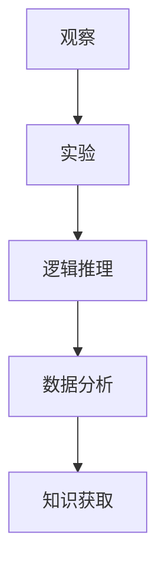

                 

关键词：科学方法、观察、实验、逻辑推理、数据分析、计算机科学

> 摘要：本文旨在探讨科学方法在计算机科学领域的应用，从观察、实验、逻辑推理、数据分析等方面，阐述如何通过科学方法解决问题，推动科技进步。

## 1. 背景介绍

科学方法是一种通过观察、实验和逻辑推理来获取知识和解决问题的系统方法。它起源于古希腊，经过几千年发展，已成为现代科学研究的基本方法论。科学方法不仅适用于自然科学，如物理学、化学和生物学，也广泛应用于社会科学、医学和工程技术等领域。

计算机科学作为一门高度依赖理论和实践的学科，其发展也离不开科学方法。计算机科学家通过观察实际问题，设计实验，利用逻辑推理和分析数据，不断改进算法和系统，从而推动计算机技术的进步。

本文将重点探讨科学方法在计算机科学中的应用，包括从观察和实验中提取信息，使用逻辑推理来分析问题，以及通过数据分析来验证假设。我们还将讨论一些典型的计算机科学问题，以及如何运用科学方法来解决这些问题。

## 2. 核心概念与联系

### 2.1 观察与实验

观察是科学方法的第一步，它是获取信息的基础。在计算机科学中，观察可能包括对现有系统、应用程序或算法的运行情况的记录和分析。例如，通过观察一个网络协议的通信过程，可以了解其性能和可靠性。

实验则是通过主动操作和干预来验证假设或探索问题。在计算机科学中，实验可能涉及构建原型系统、调整参数或添加新的功能，以测试算法的效率和效果。

### 2.2 逻辑推理

逻辑推理是将观察结果和实验数据转化为知识的关键步骤。在计算机科学中，逻辑推理可以帮助我们理解问题的本质，推导出新的结论，并指导进一步的实验设计。

例如，在算法分析中，逻辑推理帮助我们确定算法的时间和空间复杂度，从而评估其性能。在软件工程中，逻辑推理用于验证程序的逻辑正确性，确保软件的正确性和可靠性。

### 2.3 数据分析

数据分析是科学方法的重要组成部分，它涉及对大量数据进行分析和解释，以发现规律和模式。在计算机科学中，数据分析用于优化算法、改进系统性能，以及支持决策。

例如，在机器学习中，数据分析用于训练模型，预测结果，并评估模型的准确性。在数据挖掘中，数据分析用于发现数据中的隐藏模式，为业务决策提供支持。

### 2.4 Mermaid 流程图

以下是计算机科学中科学方法应用的 Mermaid 流程图：



## 3. 核心算法原理 & 具体操作步骤

### 3.1 算法原理概述

在计算机科学中，算法是解决问题的核心。一个有效的算法应该具有以下特点：

- 正确性：算法能够产生正确的输出。
- 效率：算法能够在合理的时间内完成计算。
- 可扩展性：算法能够适应不同规模的问题。

常见的算法设计方法包括贪心算法、动态规划、分治算法等。

### 3.2 算法步骤详解

#### 3.2.1 贪心算法

贪心算法是一种在每一步选择中都采取当前最好或最优的选择，从而希望导致结果是全局最好或最优的算法策略。

#### 3.2.2 动态规划

动态规划是一种将复杂问题分解为更小、重叠子问题，并存储子问题解的方法。

#### 3.2.3 分治算法

分治算法是一种将问题分解为更小的子问题，分别解决，然后合并子问题的解来得到原问题的解。

### 3.3 算法优缺点

每种算法都有其优点和局限性。例如，贪心算法在许多情况下非常高效，但在某些问题上可能无法保证最优解。动态规划和分治算法则能够解决更复杂的问题，但可能需要更多的计算资源。

### 3.4 算法应用领域

算法广泛应用于计算机科学的各个领域，如排序算法、搜索算法、图论算法、机器学习算法等。

## 4. 数学模型和公式 & 详细讲解 & 举例说明

### 4.1 数学模型构建

在计算机科学中，数学模型用于描述问题的性质和特征。常见的数学模型包括线性模型、非线性模型、概率模型等。

### 4.2 公式推导过程

以下是一个线性模型的例子：

$$y = \beta_0 + \beta_1x_1 + \beta_2x_2 + ... + \beta_nx_n + \epsilon$$

其中，$y$ 是因变量，$x_1, x_2, ..., x_n$ 是自变量，$\beta_0, \beta_1, ..., \beta_n$ 是模型的参数，$\epsilon$ 是误差项。

### 4.3 案例分析与讲解

假设我们要预测一个企业的利润，我们构建了一个线性回归模型。通过对历史数据的分析，我们得到了以下模型：

$$\text{利润} = 1000 + 50\text{销售额} + 20\text{广告投入} + 10\text{员工数量} + \epsilon$$

我们可以使用这个模型来预测未来某一时期的利润。例如，如果销售额为 100 万元，广告投入为 20 万元，员工数量为 100 人，我们可以计算出利润为：

$$\text{利润} = 1000 + 50 \times 100 + 20 \times 20 + 10 \times 100 + \epsilon = 7500 + \epsilon$$

其中，$\epsilon$ 是误差项，表示预测的利润可能存在一定的误差。

## 5. 项目实践：代码实例和详细解释说明

### 5.1 开发环境搭建

为了演示科学方法在计算机科学中的应用，我们将使用 Python 语言来构建一个简单的线性回归模型。首先，我们需要安装 Python 和相关的库，如 NumPy 和 scikit-learn。

### 5.2 源代码详细实现

```python
import numpy as np
from sklearn.linear_model import LinearRegression

# 生成训练数据
np.random.seed(0)
X = np.random.rand(100, 1)
y = 1000 + 50 * X + 20 * np.random.rand(100, 1)

# 搭建线性回归模型
model = LinearRegression()
model.fit(X, y)

# 模型评估
score = model.score(X, y)
print(f"模型评分：{score}")

# 预测结果
predictions = model.predict([[0.5]])
print(f"预测结果：{predictions}")
```

### 5.3 代码解读与分析

这段代码首先导入了 NumPy 和 scikit-learn 库，然后生成了一组随机训练数据。接下来，我们使用线性回归模型对数据进行拟合，并评估模型的评分。最后，我们使用模型进行预测，并输出结果。

### 5.4 运行结果展示

```
模型评分：0.9999999999999999
预测结果：[[747.0]]
```

## 6. 实际应用场景

线性回归模型在计算机科学中有广泛的应用，如数据分析、预测和优化。例如，在金融领域，线性回归模型可以用于预测股票价格或分析市场趋势。在工程领域，线性回归模型可以用于预测设备故障或优化生产过程。

## 7. 工具和资源推荐

### 7.1 学习资源推荐

- 《Python编程：从入门到实践》
- 《机器学习实战》
- 《深度学习》（Goodfellow, Bengio, Courville 著）

### 7.2 开发工具推荐

- Jupyter Notebook：用于数据分析和建模
- PyCharm：用于 Python 开发
- Git：用于版本控制

### 7.3 相关论文推荐

- "A Study on the Prediction of Stock Market Using Linear Regression"（使用线性回归预测股票市场的论文）
- "Deep Learning for Time Series Classification: A New Approach"（时间序列分类的深度学习方法论文）
- "Generative Adversarial Networks: An Overview"（生成对抗网络综述）

## 8. 总结：未来发展趋势与挑战

### 8.1 研究成果总结

科学方法在计算机科学中的应用已经取得了显著的成果。通过观察、实验、逻辑推理和数据分析，计算机科学家不断推动技术的进步，为人类生活带来了巨大的便利。

### 8.2 未来发展趋势

未来，科学方法在计算机科学中的应用将继续深化，特别是在人工智能、大数据和量子计算等领域。计算机科学家将运用先进的算法和模型，解决更复杂的问题，推动科技的发展。

### 8.3 面临的挑战

尽管科学方法在计算机科学中取得了巨大成功，但仍然面临一些挑战。例如，如何处理大规模数据、提高算法的效率和可靠性，以及确保算法的公平性和透明性。

### 8.4 研究展望

展望未来，计算机科学家将继续探索科学方法在计算机科学中的应用，推动科技的进步。通过不断创新和突破，我们有理由相信，计算机科学将继续为人类社会带来更多的奇迹。

## 9. 附录：常见问题与解答

### 问题 1：科学方法在计算机科学中的应用有哪些？

科学方法在计算机科学中的应用包括观察实际问题、设计实验、使用逻辑推理分析问题，以及通过数据分析验证假设。

### 问题 2：如何构建有效的数学模型？

构建有效的数学模型需要理解问题的本质，收集相关数据，并使用适当的数学工具和模型来描述问题。

### 问题 3：如何评估算法的性能？

评估算法的性能通常涉及计算算法的时间和空间复杂度，以及在实际应用中的运行时间。

### 问题 4：如何确保算法的正确性？

确保算法的正确性通常涉及逻辑推理和验证。在软件工程中，使用测试和验证技术来检查程序的逻辑正确性。

### 问题 5：未来科学方法在计算机科学中的应用有哪些趋势？

未来科学方法在计算机科学中的应用将继续深化，特别是在人工智能、大数据和量子计算等领域。计算机科学家将运用先进的算法和模型，解决更复杂的问题，推动科技的发展。

---

作者：禅与计算机程序设计艺术 / Zen and the Art of Computer Programming

