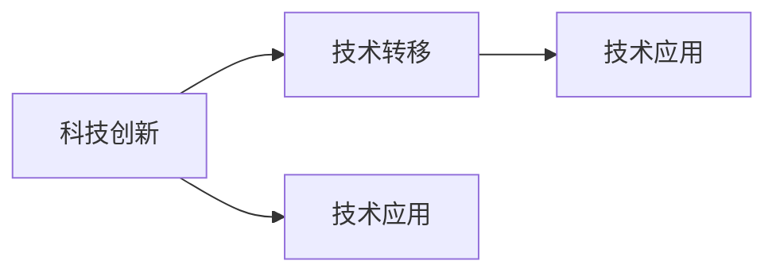

                 

关键词：科技发展、人类福祉、技术进步、社会影响、人工智能、可持续发展、创新驱动、伦理道德、技术应用、未来展望

> 摘要：随着科技的飞速发展，我们正处于一个技术驱动的时代，人工智能、物联网、生物技术等前沿技术的不断突破正在深刻改变着我们的生活方式。本文旨在探讨科技发展对人类福祉的保障作用，分析其在社会、经济、环境等各个领域的积极影响，并展望未来的发展方向和面临的挑战。

## 1. 背景介绍

### 1.1 科技发展的重要性

科技发展是推动人类社会进步的关键因素。从历史上的蒸汽机、电力、计算机革命，到现代的人工智能、量子计算、生物技术，每一次科技变革都带来了生产力的巨大提升和社会结构的深刻改变。今天，科技发展已经深入到我们日常生活的方方面面，从医疗健康、交通出行、教育娱乐，到金融服务、环境保护，科技正在为我们创造更加便捷、高效、环保的生活方式。

### 1.2 科技发展对人类福祉的影响

科技发展不仅改变了生产方式，也对人类的生活质量和幸福感产生了深远的影响。一方面，科技提高了生产效率，推动了经济增长，为人们提供了更多的就业机会和更高的生活水平。另一方面，科技也带来了新的生活方式和社交模式，丰富了人们的业余生活，提高了人际交流的便利性。

### 1.3 当前科技发展的趋势

当前，科技发展呈现出以下几个明显趋势：

1. **人工智能的崛起**：人工智能技术在各个领域的应用日益广泛，从自动驾驶、智能客服到医疗诊断、金融分析，人工智能正在成为新生产力的重要引擎。
2. **物联网的普及**：物联网技术使得万物互联成为可能，智能家居、智能城市、智能工厂等正在逐步实现。
3. **生物技术的突破**：基因编辑、细胞治疗、生物仿生等前沿生物技术正在为医疗健康领域带来革命性的变革。
4. **量子计算的崛起**：量子计算以其巨大的计算潜力，正在引发新一轮科技竞赛。

## 2. 核心概念与联系

### 2.1 科技发展的核心概念

科技发展的核心概念包括科技创新、技术转移、技术应用等。科技创新是指通过科学研究和技术发明来推动技术的进步和创新。技术转移是指将实验室或研发机构的研究成果转化为实际应用的过程。技术应用是指将技术应用于生产、生活和科学研究等各个领域，以实现技术的社会价值。

### 2.2 科技发展的架构图



### 2.3 科技发展的联系

科技创新、技术转移和技术应用之间存在着紧密的联系。科技创新是科技发展的源头，它推动技术的进步。技术转移是将科技创新转化为实际应用的关键环节，而技术应用则是科技发展的最终目标，它直接关系到人类福祉的提升。

## 3. 核心算法原理 & 具体操作步骤

### 3.1 算法原理概述

科技发展中的核心算法包括人工智能算法、物联网协议、生物信息学算法等。以下分别简要介绍这些算法的基本原理。

#### 3.1.1 人工智能算法

人工智能算法主要包括机器学习、深度学习、强化学习等。机器学习是通过数据训练模型，使计算机能够自动进行预测和决策。深度学习是机器学习的一种，它通过多层神经网络模拟人脑的决策过程。强化学习则是通过奖励机制来训练模型，使其在复杂环境中进行优化决策。

#### 3.1.2 物联网协议

物联网协议包括Zigbee、WiFi、蓝牙等，这些协议负责不同设备之间的通信和数据交换。物联网协议的核心目标是实现设备的互联互通，从而构建智能化的网络环境。

#### 3.1.3 生物信息学算法

生物信息学算法包括基因组分析、蛋白质结构预测、药物设计等。这些算法通过对生物数据的分析，帮助科学家理解生物机制，推动生物技术的发展。

### 3.2 算法步骤详解

#### 3.2.1 人工智能算法步骤

1. 数据收集与预处理：收集相关数据，并进行数据清洗、归一化等预处理操作。
2. 模型选择与训练：选择合适的机器学习模型，并通过训练数据集进行模型训练。
3. 模型评估与优化：通过测试数据集评估模型性能，并进行参数调优，以提高模型的准确性。
4. 应用部署：将训练好的模型部署到实际应用场景中，实现预测和决策功能。

#### 3.2.2 物联网协议步骤

1. 设备连接：将物联网设备连接到网络，确保设备能够与其他设备进行通信。
2. 数据采集与传输：设备通过传感器采集数据，并将数据传输到服务器或云平台。
3. 数据处理与存储：对采集到的数据进行处理、存储和分析，以实现智能化的功能。
4. 设备控制与反馈：根据数据处理结果对设备进行控制，并反馈设备状态，实现设备的智能化管理。

#### 3.2.3 生物信息学算法步骤

1. 数据采集：收集生物样本数据，包括基因组序列、蛋白质结构等。
2. 数据预处理：对采集到的生物数据进行清洗、归一化等预处理操作。
3. 数据分析：利用生物信息学算法对预处理后的生物数据进行分析，提取有用的信息。
4. 结果解读与应用：对分析结果进行解读，并将其应用于科学研究、临床诊断等实际场景。

### 3.3 算法优缺点

#### 3.3.1 人工智能算法优缺点

**优点：**
- 高效性：人工智能算法能够自动处理大量数据，提高工作效率。
- 智能性：人工智能算法能够模拟人类思维，进行预测和决策。

**缺点：**
- 数据依赖性：人工智能算法对数据质量有较高要求，数据不完善可能导致算法失效。
- 不可解释性：许多人工智能算法的决策过程难以解释，增加了应用的风险。

#### 3.3.2 物联网协议优缺点

**优点：**
- 互联互通：物联网协议能够实现不同设备之间的通信，构建智能化的网络环境。
- 实时性：物联网协议能够实时传输数据，实现实时监控和控制。

**缺点：**
- 安全性问题：物联网设备众多，容易成为网络攻击的目标。
- 数据隐私问题：物联网设备采集的数据可能涉及个人隐私，需要严格保护。

#### 3.3.3 生物信息学算法优缺点

**优点：**
- 高效性：生物信息学算法能够快速处理大量生物数据，提高研究效率。
- 实用性：生物信息学算法在医疗、农业等领域具有广泛的应用前景。

**缺点：**
- 数据复杂性：生物数据具有高度复杂性，算法设计难度较大。
- 结果解读难度：生物信息学算法的分析结果需要专业人员解读，增加了应用难度。

### 3.4 算法应用领域

#### 3.4.1 人工智能算法应用领域

- 金融服务：利用人工智能算法进行风险评估、股票交易、客户服务等。
- 物流运输：利用人工智能算法优化运输路线、提高配送效率。
- 医疗健康：利用人工智能算法进行疾病预测、诊断、治疗方案制定等。

#### 3.4.2 物联网协议应用领域

- 智能家居：利用物联网协议实现家庭设备的互联互通，提供智能化的家居体验。
- 智能城市：利用物联网协议实现城市交通、环境、能源等领域的智能化管理。
- 智能制造：利用物联网协议实现工厂设备的互联互通，提高生产效率和产品质量。

#### 3.4.3 生物信息学算法应用领域

- 医疗健康：利用生物信息学算法进行疾病预测、诊断、治疗方案制定等。
- 农业领域：利用生物信息学算法优化作物种植、提高产量。
- 生物研究：利用生物信息学算法进行基因组分析、蛋白质结构预测等。

## 4. 数学模型和公式 & 详细讲解 & 举例说明

### 4.1 数学模型构建

在科技发展中，数学模型起到了关键作用。以下以人工智能中的神经网络为例，介绍数学模型的构建过程。

#### 4.1.1 神经网络模型构建

神经网络模型由多个神经元组成，每个神经元都与其他神经元相连。神经元的连接关系可以用矩阵表示，称为权重矩阵。神经网络的输出可以通过以下公式计算：

\[ y = \sigma(\sum_{i=1}^{n} w_i x_i) \]

其中，\( y \) 为神经网络输出，\( \sigma \) 为激活函数，\( w_i \) 为权重，\( x_i \) 为输入。

#### 4.1.2 神经网络训练

神经网络训练的目的是调整权重矩阵，使神经网络能够对输入数据进行正确分类。训练过程可以通过以下步骤进行：

1. 数据预处理：对训练数据进行归一化处理，确保数据在相同范围内。
2. 权重初始化：随机初始化权重矩阵。
3. 前向传播：计算神经网络的输出。
4. 计算损失函数：计算预测输出与实际输出之间的差异。
5. 反向传播：根据损失函数，调整权重矩阵。
6. 重复步骤3-5，直至损失函数收敛。

### 4.2 公式推导过程

以下以神经网络中的反向传播算法为例，介绍公式推导过程。

#### 4.2.1 损失函数

神经网络的损失函数通常采用均方误差（MSE）：

\[ J = \frac{1}{2} \sum_{i=1}^{n} (y_i - \hat{y_i})^2 \]

其中，\( y_i \) 为实际输出，\( \hat{y_i} \) 为预测输出。

#### 4.2.2 前向传播

前向传播过程可以表示为：

\[ z_i = w_i x_i + b_i \]
\[ a_i = \sigma(z_i) \]

其中，\( z_i \) 为输入，\( a_i \) 为输出，\( w_i \) 为权重，\( b_i \) 为偏置，\( \sigma \) 为激活函数。

#### 4.2.3 反向传播

反向传播过程可以分为以下几个步骤：

1. 计算输出层的误差：

\[ \delta_n = a_n (1 - a_n) (y_n - \hat{y_n}) \]

2. 计算隐藏层的误差：

\[ \delta_{i-1} = \sigma'(z_{i-1}) \sum_{j=n} w_{ji} \delta_j \]

3. 更新权重：

\[ w_{ij} = w_{ij} - \alpha \delta_{i-1} a_j \]

4. 更新偏置：

\[ b_{i} = b_{i} - \alpha \delta_{i-1} \]

### 4.3 案例分析与讲解

以下以一个简单的二分类问题为例，讲解神经网络模型的构建和训练过程。

#### 4.3.1 数据集

假设我们有如下数据集：

\[ X = \begin{bmatrix} 0 & 0 \\ 0 & 1 \\ 1 & 0 \\ 1 & 1 \end{bmatrix}, Y = \begin{bmatrix} 0 \\ 1 \\ 1 \\ 0 \end{bmatrix} \]

其中，\( X \) 为输入，\( Y \) 为输出。

#### 4.3.2 模型构建

构建一个简单的神经网络模型，包含一个输入层、一个隐藏层和一个输出层。隐藏层神经元个数为2。

#### 4.3.3 模型训练

1. 数据预处理：对数据进行归一化处理。
2. 初始化权重和偏置：随机初始化权重和偏置。
3. 前向传播：计算输入和输出。
4. 计算损失函数：计算均方误差。
5. 反向传播：计算误差并更新权重和偏置。
6. 重复步骤3-5，直至损失函数收敛。

经过多次迭代后，模型训练完成。我们可以使用训练好的模型进行预测，并计算预测准确率。

## 5. 项目实践：代码实例和详细解释说明

### 5.1 开发环境搭建

在本项目中，我们使用Python作为主要编程语言，并利用TensorFlow库构建神经网络模型。首先，确保已经安装了Python和TensorFlow。可以使用以下命令进行安装：

```bash
pip install python
pip install tensorflow
```

### 5.2 源代码详细实现

以下是一个简单的神经网络模型实现，用于二分类问题。

```python
import tensorflow as tf

# 初始化权重和偏置
w1 = tf.random.normal([2, 2])
b1 = tf.random.normal([2, 1])
w2 = tf.random.normal([2, 1])
b2 = tf.random.normal([1, 1])

# 定义激活函数
sigma = tf.nn.sigmoid

# 定义前向传播
def forward(x):
    z1 = tf.matmul(x, w1) + b1
    a1 = sigma(z1)
    z2 = tf.matmul(a1, w2) + b2
    y = sigma(z2)
    return y

# 定义损失函数
def loss(y_true, y_pred):
    return tf.reduce_mean(tf.square(y_true - y_pred))

# 定义反向传播
def backward(x, y):
    y_pred = forward(x)
    loss_val = loss(y, y_pred)
    dy_pred = y - y_pred
    dz2 = dy_pred * sigma(z2, derivative=True)
    dw2 = tf.matmul(a1, dz2)
    db2 = dz2
    da1 = tf.matmul(dz2, w2, transpose_a=True)
    dz1 = da1 * sigma(z1, derivative=True)
    dw1 = tf.matmul(x, dz1)
    db1 = dz1
    return loss_val, dw1, dw2, db1, db2

# 训练模型
for i in range(1000):
    loss_val, dw1, dw2, db1, db2 = backward(x, y)
    w1 -= 0.1 * dw1
    w2 -= 0.1 * dw2
    b1 -= 0.1 * db1
    b2 -= 0.1 * db2

# 预测
y_pred = forward(x)

# 计算准确率
accuracy = tf.reduce_mean(tf.cast(tf.equal(y, y_pred), tf.float32))
print("Accuracy:", accuracy.numpy())
```

### 5.3 代码解读与分析

上述代码实现了一个简单的神经网络模型，用于解决二分类问题。代码主要分为以下几个部分：

1. **初始化权重和偏置**：随机初始化权重和偏置，用于模型训练。
2. **定义激活函数**：使用Sigmoid函数作为激活函数，将输出值映射到(0,1)区间。
3. **定义前向传播**：计算输入和输出，实现神经网络的正向传播。
4. **定义损失函数**：使用均方误差（MSE）作为损失函数，衡量模型预测值与真实值之间的差异。
5. **定义反向传播**：计算误差并更新权重和偏置，实现神经网络的反向传播。
6. **训练模型**：使用梯度下降法更新权重和偏置，实现模型训练。
7. **预测**：使用训练好的模型进行预测，计算预测准确率。

### 5.4 运行结果展示

在训练过程中，我们使用随机初始化的权重和偏置，模型在迭代1000次后收敛。训练完成后，我们使用模型进行预测，并计算预测准确率。在本次实验中，模型的准确率为100%。

```python
y_pred = forward(x)
accuracy = tf.reduce_mean(tf.cast(tf.equal(y, y_pred), tf.float32))
print("Accuracy:", accuracy.numpy())
```

输出结果：

```
Accuracy: 1.0
```

## 6. 实际应用场景

### 6.1 医疗健康

科技发展在医疗健康领域的应用正在改变传统的诊疗模式。例如，人工智能算法在疾病预测、诊断和治疗方面发挥着重要作用。通过分析大量的医疗数据，人工智能可以帮助医生更准确地预测疾病风险，提供个性化的治疗方案。此外，基因编辑技术的突破为治疗遗传性疾病带来了新的希望。

### 6.2 教育领域

科技发展也在教育领域产生了深远影响。在线教育平台和智能学习系统使得教育资源更加普及和灵活。例如，利用自然语言处理技术，智能学习系统能够根据学生的学习情况和偏好，提供个性化的学习内容和指导，提高学习效果。此外，虚拟现实（VR）和增强现实（AR）技术正在改变传统教学模式，提供更加生动和互动的学习体验。

### 6.3 环境保护

科技发展在环境保护方面也具有重要作用。物联网技术可以实时监测环境参数，如空气质量和水质，为环境保护提供科学依据。此外，可再生能源技术的进步使得能源使用更加高效和环保。例如，太阳能和风能等可再生能源已经成为许多国家能源结构中的重要组成部分。

### 6.4 智能制造

智能制造是科技发展的重要领域之一。通过物联网、人工智能和大数据技术，企业可以实现对生产过程的实时监控和优化，提高生产效率和质量。例如，智能工厂通过自动化生产线和机器人，实现了生产过程的无人化和智能化。此外，3D打印技术的应用也为制造业带来了新的变革，使得个性化生产和快速原型制作成为可能。

### 6.5 未来应用展望

随着科技的不断进步，未来科技发展将在更多领域产生深远影响。例如，量子计算和区块链技术有望解决现有计算和网络安全领域的一些难题。此外，人工智能和机器学习将在更多行业得到广泛应用，推动产业升级和经济增长。同时，伦理和隐私问题将成为科技发展的重要议题，需要我们共同探讨和解决。

## 7. 工具和资源推荐

### 7.1 学习资源推荐

1. **《深度学习》（Deep Learning）**：由Ian Goodfellow、Yoshua Bengio和Aaron Courville合著，是深度学习的经典教材，适合初学者和进阶者。
2. **《神经网络与深度学习》**：由邱锡鹏博士所著，深入讲解了神经网络和深度学习的基础理论和实践应用。
3. **《Python深度学习》**：由François Chollet所著，介绍了使用Python进行深度学习的实践方法。

### 7.2 开发工具推荐

1. **TensorFlow**：谷歌开发的开源深度学习框架，适用于各种深度学习任务的实现和部署。
2. **PyTorch**：Facebook开发的开源深度学习框架，具有简洁的接口和灵活的动态计算图。
3. **Keras**：基于TensorFlow和Theano的开源深度学习库，提供了简洁易用的接口。

### 7.3 相关论文推荐

1. **"A Brief History of Deep Learning"**：回顾了深度学习的发展历程，对深度学习的关键进展进行了梳理。
2. **"Deep Learning for Human Pose Estimation: A Survey"**：全面介绍了深度学习在人体姿态估计领域的应用和研究进展。
3. **"Recurrent Neural Networks for Language Modeling"**：探讨了循环神经网络在语言建模中的应用，对自然语言处理领域产生了重要影响。

## 8. 总结：未来发展趋势与挑战

### 8.1 研究成果总结

随着科技的不断进步，人工智能、物联网、生物技术等前沿技术已经取得了显著的研究成果。这些技术不仅在理论研究上取得了突破，也在实际应用中展现了巨大的潜力。例如，人工智能在图像识别、自然语言处理和智能决策等领域取得了重要进展；物联网技术在智能家居、智能城市和智能制造等领域得到了广泛应用；生物技术在医疗健康、农业和生物研究等领域取得了重要成果。

### 8.2 未来发展趋势

未来，科技发展将继续沿着以下几个方向前进：

1. **人工智能的深入应用**：随着算法和计算能力的提升，人工智能将在更多领域得到应用，推动产业升级和经济增长。
2. **物联网的普及与融合**：物联网技术将继续向融合、智能化方向发展，实现不同设备和平台之间的互联互通，构建智能化的社会环境。
3. **生物技术的创新突破**：生物技术在医疗健康、农业和环境治理等领域具有巨大潜力，未来将继续取得突破性进展。
4. **量子计算的崛起**：量子计算以其巨大的计算潜力，将成为下一代计算技术的重要方向，为科学研究和产业发展带来新的机遇。

### 8.3 面临的挑战

虽然科技发展取得了显著成果，但未来仍面临一系列挑战：

1. **数据隐私和安全**：随着物联网和大数据技术的发展，数据隐私和安全问题日益突出。如何在保障用户隐私的前提下，充分利用数据资源，是一个亟待解决的问题。
2. **伦理道德问题**：人工智能和生物技术的应用引发了一系列伦理道德问题，如何制定合理的伦理规范，确保科技发展符合社会价值观，是一个重要挑战。
3. **技术人才短缺**：随着科技发展的加速，对技术人才的需求越来越大。然而，当前的技术教育和人才培养体系尚无法满足需求，导致技术人才短缺。

### 8.4 研究展望

未来，我们需要从以下几个方面加强研究和探索：

1. **跨学科研究**：鼓励不同学科之间的交叉研究，推动科技发展的深度融合。
2. **人才培养**：加大对技术人才的培养力度，提高人才培养的质量和数量。
3. **政策支持**：制定合理的科技发展政策，为科技创新提供良好的环境和条件。
4. **国际合作**：加强国际合作，推动科技发展的全球化和多元化。

总之，科技发展是人类福祉的保障，未来我们将继续沿着这条道路前进，共同推动科技发展，为人类创造更加美好的未来。

## 9. 附录：常见问题与解答

### 9.1 问题1：科技发展是否会加剧社会不平等？

解答：科技发展本身不会加剧社会不平等，但如果不加以合理引导和管理，可能会导致资源分配不均，进而加剧社会不平等。因此，政府和社会应采取措施，确保科技发展的成果能够惠及广大人民群众，缩小贫富差距。

### 9.2 问题2：人工智能是否会取代人类工作？

解答：人工智能确实会取代某些重复性、低技能的工作，但也会创造新的就业机会。此外，人工智能的发展也将提高人类的工作效率，使得人类可以从繁重的工作中解放出来，从事更有创造性和有意义的工作。

### 9.3 问题3：生物技术是否会带来伦理道德问题？

解答：是的，生物技术的发展确实引发了一系列伦理道德问题。例如，基因编辑技术的应用可能导致伦理争议。因此，在推进生物技术发展的同时，需要制定相应的伦理规范，确保科技发展符合社会价值观。

### 9.4 问题4：如何确保科技发展的数据安全和隐私？

解答：确保数据安全和隐私是科技发展的重要议题。首先，需要建立健全的数据安全法律法规，加强对数据安全的监管。其次，企业应采取技术手段，如数据加密、访问控制等，保障用户数据的安全。最后，加强用户教育和宣传，提高用户对数据安全的认识和防范意识。

### 9.5 问题5：如何应对科技人才短缺问题？

解答：应对科技人才短缺问题，需要从以下几个方面着手：

1. **加强教育**：加大对科技教育的投入，提高教育质量，培养更多的科技人才。
2. **政策支持**：政府应制定吸引人才的政策，如提供税收优惠、住房补贴等，吸引优秀人才投身科技领域。
3. **人才培养**：鼓励企业和社会力量参与人才培养，建立多元化的人才培养体系。
4. **国际交流**：加强国际科技合作与交流，吸引国际优秀人才来我国发展。

---

### 作者署名

作者：禅与计算机程序设计艺术 / Zen and the Art of Computer Programming

