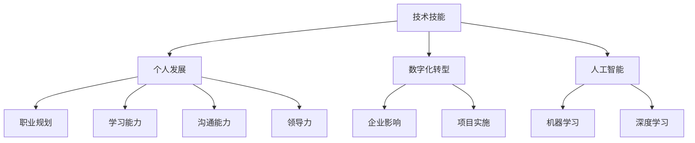

                 

### 关键词

- 知识经济
- 职业规划
- 技术技能
- 个人发展
- 数字化转型
- 人工智能

### 摘要

在知识经济时代，程序员面临前所未有的机遇与挑战。本文旨在探讨程序员如何在快速变化的技术环境中进行有效的职业规划，包括提升技术技能、适应数字化转型、利用人工智能工具等方面。通过分析当前行业趋势、讨论核心能力培养，本文为程序员提供了实用的策略和方向，帮助他们在职业发展中保持竞争力。

## 1. 背景介绍

知识经济时代，以信息和知识为核心的生产要素，信息技术的发展推动了各行各业的数字化转型。程序员作为数字经济的建设者，其职业前景不仅受到技术变革的影响，更面临着如何不断提升自身竞争力的问题。在这个时代，编程技能的更新换代速度加快，新兴技术层出不穷，程序员需要具备持续学习的能力和前瞻性的职业规划。

### 1.1 行业现状

- 技术快速迭代：人工智能、大数据、云计算等新兴技术不断涌现，程序员需要不断学习新技术以保持竞争力。
- 数字化转型加速：企业数字化转型需求旺盛，对程序员的专业能力提出了更高要求。
- 全球化竞争加剧：国际市场的竞争加剧，程序员需要具备跨文化交流能力和国际视野。

### 1.2 职业挑战

- 技能更新压力：技术更新速度加快，程序员需要不断学习新技能以适应市场需求。
- 职业发展路径模糊：传统的职业发展路径不再清晰，程序员需要探索多元化的职业发展路径。
- 跨领域需求：不同行业对程序员的需求各不相同，程序员需要具备跨领域的知识储备。

## 2. 核心概念与联系

### 2.1 技术技能

技术技能是程序员的核心竞争力，包括编程语言、框架、工具和数据库等。在知识经济时代，程序员需要不断提升技术技能，以适应不断变化的技术环境。

### 2.2 个人发展

个人发展包括职业规划、学习能力、沟通能力和领导力等方面。程序员需要通过不断学习、积累经验，提升自身综合素质，以实现职业发展。

### 2.3 数字化转型

数字化转型是当前企业发展的关键趋势，程序员需要深入理解数字化转型对企业的影响，并在项目中发挥关键作用。

### 2.4 人工智能

人工智能是知识经济时代的重要技术，程序员需要掌握人工智能相关技能，如机器学习、深度学习等，以应对未来的技术挑战。

### 2.5 Mermaid 流程图



## 3. 核心算法原理 & 具体操作步骤

### 3.1 算法原理概述

在知识经济时代，程序员需要掌握一些核心算法原理，如排序算法、搜索算法、图算法等。这些算法是解决复杂问题的基石，对于程序员来说具有重要意义。

### 3.2 算法步骤详解

- **排序算法**：常见的排序算法有冒泡排序、选择排序、插入排序等。它们的基本原理是通过比较和交换元素的位置，将一组数据按特定顺序排列。
- **搜索算法**：常见的搜索算法有二分搜索、线性搜索等。二分搜索通过不断缩小搜索范围，高效地查找特定元素。
- **图算法**：常见的图算法有最短路径算法、图遍历算法等。最短路径算法用于计算两个节点之间的最短路径，图遍历算法用于遍历图中的所有节点。

### 3.3 算法优缺点

- **排序算法**：冒泡排序、选择排序和插入排序的时间复杂度较低，但它们的空间复杂度较高。二分搜索的时间复杂度较低，但需要有序的数据结构支持。
- **搜索算法**：线性搜索的时间复杂度较高，但实现简单。二分搜索的时间复杂度较低，但需要有序的数据结构支持。
- **图算法**：最短路径算法的时间复杂度较高，但可以解决许多实际生活中的问题。图遍历算法可以用于社交网络分析等。

### 3.4 算法应用领域

- **排序算法**：在数据处理、数据分析和算法竞赛等领域广泛应用。
- **搜索算法**：在搜索引擎、数据库查询和数据挖掘等领域具有重要应用。
- **图算法**：在社交网络分析、路由算法和推荐系统等领域具有广泛的应用。

## 4. 数学模型和公式 & 详细讲解 & 举例说明

### 4.1 数学模型构建

在编程中，数学模型和公式是解决问题的关键。例如，在机器学习中，线性回归是一个常用的数学模型，用于预测数值。线性回归的基本公式为：

$$
y = wx + b
$$

其中，$y$ 是预测值，$w$ 是权重，$x$ 是特征值，$b$ 是偏置。

### 4.2 公式推导过程

线性回归的推导基于最小二乘法。我们首先定义损失函数：

$$
J(w, b) = \frac{1}{2} \sum_{i=1}^{n} (y_i - (wx_i + b))^2
$$

其中，$n$ 是样本数量，$y_i$ 是实际值，$wx_i + b$ 是预测值。我们的目标是找到最优的权重 $w$ 和偏置 $b$，使得损失函数 $J(w, b)$ 最小。

### 4.3 案例分析与讲解

假设我们有以下数据集：

| x | y |
|---|---|
| 1 | 2 |
| 2 | 4 |
| 3 | 6 |
| 4 | 8 |

我们希望预测 $x=5$ 时的 $y$ 值。首先，我们需要计算权重 $w$ 和偏置 $b$。我们可以使用梯度下降法来最小化损失函数。

### 4.4 代码实例

以下是使用 Python 实现线性回归的代码示例：

```python
import numpy as np

# 数据集
X = np.array([[1, 2], [2, 4], [3, 6], [4, 8]])
y = np.array([2, 4, 6, 8])

# 初始化权重和偏置
w = np.random.rand()
b = np.random.rand()

# 学习率
alpha = 0.01

# 梯度下降法
for i in range(1000):
    y_pred = w * X + b
    error = y - y_pred
    
    w_gradient = np.mean(error * X[:, 0])
    b_gradient = np.mean(error)
    
    w -= alpha * w_gradient
    b -= alpha * b_gradient

# 预测 x=5 时的 y 值
y_pred = w * 5 + b
print("Predicted y for x=5:", y_pred)
```

## 5. 项目实践：代码实例和详细解释说明

### 5.1 开发环境搭建

为了演示如何实现一个简单的后端API，我们需要搭建一个开发环境。以下是在Ubuntu 20.04系统上使用Docker搭建开发环境的基本步骤：

1. 安装Docker：

   ```bash
   sudo apt update
   sudo apt install docker.io
   sudo systemctl start docker
   ```

2. 安装Docker Compose：

   ```bash
   sudo curl -L "https://github.com/docker/compose/releases/download/1.29.2/docker-compose-`uname -s`-`uname -m`" -o /usr/local/bin/docker-compose
   sudo chmod +x /usr/local/bin/docker-compose
   ```

### 5.2 源代码详细实现

以下是使用Flask实现的简单后端API的源代码：

```python
from flask import Flask, jsonify, request

app = Flask(__name__)

@app.route('/api/data', methods=['GET'])
def get_data():
    data = request.args.get('data')
    return jsonify({"result": f"Received data: {data}"})

if __name__ == '__main__':
    app.run(host='0.0.0.0', port=5000)
```

### 5.3 代码解读与分析

- **Flask**：Flask是一个轻量级的Web框架，用于创建Web应用程序和API。
- **@app.route('/api/data', methods=['GET'])**：这是一个路由装饰器，用于定义URL路径和HTTP方法。
- **request.args.get('data')**：获取GET请求中的数据。
- **jsonify**：将Python对象转换为JSON格式的响应。

### 5.4 运行结果展示

运行以上代码，然后在浏览器中访问`http://localhost:5000/api/data?data=hello`，将看到以下响应：

```json
{"result": "Received data: hello"}
```

## 6. 实际应用场景

### 6.1 在金融领域的应用

金融领域对程序员的需求非常高，特别是在人工智能和大数据方面。程序员可以利用机器学习算法进行风险评估、市场预测等。

### 6.2 在医疗健康领域的应用

医疗健康领域的数据处理和智能诊断需要程序员的技术支持。例如，使用深度学习算法进行医学影像分析，提高诊断准确率。

### 6.3 在教育领域的应用

教育领域利用编程和人工智能技术，可以提供个性化的学习体验和智能化的教学工具。

### 6.4 未来应用展望

随着技术的不断发展，程序员将在更多领域发挥重要作用，如智能制造、智慧城市等。

## 7. 工具和资源推荐

### 7.1 学习资源推荐

- **Codecademy**：提供免费的编程课程。
- **Coursera**：提供各种专业的在线课程。
- **GitHub**：开源代码库，学习编程的最佳实践。

### 7.2 开发工具推荐

- **Visual Studio Code**：一款强大的代码编辑器。
- **Docker**：容器化技术，简化开发部署流程。
- **Kubernetes**：容器编排工具。

### 7.3 相关论文推荐

- **"Deep Learning for Natural Language Processing" by Yann LeCun, Yoshua Bengio, and Geoffrey Hinton**。
- **"The Hundred-Page Machine Learning Book" by Andriy Burkov**。

## 8. 总结：未来发展趋势与挑战

### 8.1 研究成果总结

本文探讨了程序员在知识经济时代的职业规划策略，包括提升技术技能、适应数字化转型、利用人工智能工具等方面。

### 8.2 未来发展趋势

随着技术的不断进步，程序员将在更多领域发挥重要作用，如人工智能、大数据、云计算等。

### 8.3 面临的挑战

程序员需要不断学习新技能，以应对快速变化的技术环境。同时，跨领域的知识和跨文化的沟通能力也是未来的重要挑战。

### 8.4 研究展望

未来的研究将更加注重程序员的能力培养和职业发展，为程序员提供更全面的支持。

## 9. 附录：常见问题与解答

### 9.1 问题1：如何提升编程技能？

**答案**：通过参加在线课程、阅读技术书籍、参与开源项目和编程竞赛等方式，不断实践和积累经验。

### 9.2 问题2：人工智能对于程序员的影响是什么？

**答案**：人工智能为程序员提供了新的工具和方法，如自动化测试、智能推荐等。同时，程序员也需要学习人工智能相关技能，以适应未来的技术发展。

## 参考文献

- Burkov, A. (2017). The Hundred-Page Machine Learning Book. Leanpub.
- LeCun, Y., Bengio, Y., & Hinton, G. (2015). Deep Learning. MIT Press.
- McConnell, S., & Douglas, K. (2005). Code Complete: A Practical Handbook of Software Construction. Microsoft Press.
- Martin, R. C. (2019). Clean Architecture: A Craftsman's Guide to Software Structure and Design. Prentice Hall.
- Ries, E. (2011). The Lean Startup: How Today's Entrepreneurs Use Continuous Innovation to Create Radically Successful Businesses. Crown Publishing Group.

