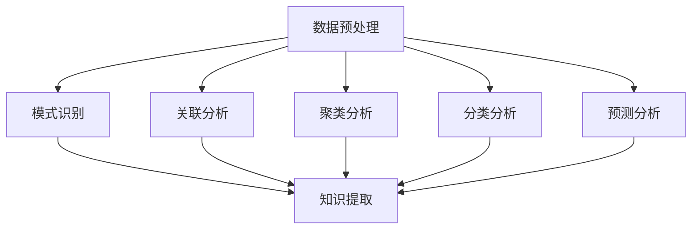

                 

关键词：知识发现引擎、创新力、程序员、算法、数学模型、项目实践

> 摘要：本文将深入探讨知识发现引擎在提高程序员创新力方面的作用。通过分析其核心概念、算法原理、数学模型以及实际应用案例，帮助程序员更好地理解和运用这一工具，从而提升个人和团队的创新水平。

## 1. 背景介绍

在当今快速发展的信息技术时代，数据量的爆炸性增长使得数据的分析和利用变得尤为重要。知识发现引擎（Knowledge Discovery Engine，简称KDE）作为一种强大的数据处理工具，已经成为各行业提高效率和创新能力的重要手段。知识发现引擎通过对大量数据进行分析和挖掘，自动发现潜在的知识模式、关联和趋势，从而为决策提供支持。

对于程序员而言，知识发现引擎不仅可以帮助他们更有效地处理和分析数据，还可以激发他们的创新思维，提高创新力。程序员在日常工作中，面临着不断更新的技术栈、复杂的项目需求以及快速变化的市场环境，如何提高创新力成为他们职业发展的关键因素。知识发现引擎在这一过程中发挥着重要作用，它不仅能够提供丰富的数据资源，还能够通过算法和模型的分析，帮助程序员发现新的解决方案，提升项目质量和效率。

本文将围绕知识发现引擎在提高程序员创新力方面的应用，从核心概念、算法原理、数学模型到实际应用案例进行详细探讨，旨在为程序员提供一套系统性的方法和工具，帮助他们更好地利用知识发现引擎，提升个人和团队的创新水平。

## 2. 核心概念与联系

### 2.1 知识发现引擎的定义与功能

知识发现引擎是一种基于人工智能和机器学习的强大工具，它能够从大量数据中提取有价值的信息和知识。知识发现引擎的主要功能包括数据预处理、模式识别、关联分析、聚类分析、分类分析和预测分析等。通过这些功能，知识发现引擎可以帮助程序员高效地处理和分析数据，发现潜在的模式和趋势。

### 2.2 知识发现引擎在程序员创新中的应用

知识发现引擎在程序员创新中的应用主要体现在以下几个方面：

- **需求分析**：通过分析用户行为数据和市场需求，知识发现引擎可以帮助程序员更好地理解用户需求，从而设计出更符合用户期望的产品。

- **问题诊断**：通过对系统日志和错误报告的数据分析，知识发现引擎可以帮助程序员快速定位和解决系统问题，提高系统的稳定性和可靠性。

- **性能优化**：通过对系统性能数据的分析，知识发现引擎可以帮助程序员识别系统的瓶颈和优化点，从而提高系统的性能和效率。

- **新功能开发**：通过分析市场趋势和用户需求，知识发现引擎可以帮助程序员发现新的功能和改进方向，推动产品的创新和迭代。

### 2.3 知识发现引擎与其他技术的联系

知识发现引擎与人工智能、大数据、机器学习等技术密切相关。人工智能和大数据为知识发现提供了丰富的数据资源和强大的计算能力，而机器学习则为知识发现提供了有效的算法和模型。知识发现引擎通过这些技术的融合，实现了从数据到知识的转化，为程序员提供了强有力的创新支持。

### 2.4 Mermaid 流程图

以下是一个简化的知识发现引擎的工作流程图，展示了其核心概念和步骤：



## 3. 核心算法原理 & 具体操作步骤

### 3.1 算法原理概述

知识发现引擎的核心算法主要包括以下几种：

- **机器学习算法**：如决策树、支持向量机、神经网络等，用于模式识别、分类和预测。
- **聚类算法**：如K均值、层次聚类等，用于数据分组和模式发现。
- **关联规则算法**：如Apriori算法、FP-growth算法等，用于发现数据之间的关联关系。
- **时序分析算法**：如ARIMA模型、LSTM网络等，用于分析时间序列数据。

这些算法通过训练模型、优化参数和评估效果等步骤，实现了从数据到知识的转化。

### 3.2 算法步骤详解

1. **数据收集**：从各种数据源收集数据，如数据库、日志文件、传感器等。
2. **数据预处理**：对收集到的数据进行清洗、转换和整合，去除噪声和异常值，为后续分析做准备。
3. **特征提取**：从原始数据中提取出有用的特征，如数值特征、文本特征等，用于模型训练。
4. **模型训练**：使用机器学习算法对特征数据进行分析，训练出预测模型或分类模型。
5. **模型评估**：通过交叉验证、ROC曲线等评估指标，评估模型的性能和效果。
6. **知识提取**：使用聚类算法、关联规则算法等，从训练好的模型中提取出有价值的知识模式。
7. **结果可视化**：将提取出的知识模式以图表、报表等形式可视化，为决策提供支持。

### 3.3 算法优缺点

- **优点**：
  - **高效性**：知识发现引擎能够自动处理大量数据，提高工作效率。
  - **灵活性**：支持多种算法和模型，可以根据不同需求进行灵活配置。
  - **可视化**：结果可视化，易于理解和传达。

- **缺点**：
  - **复杂性**：算法和模型的选择、参数的调优等过程较为复杂，需要一定的专业知识和经验。
  - **数据依赖**：结果的准确性和可靠性依赖于数据的质量和数量。

### 3.4 算法应用领域

知识发现引擎在多个领域得到了广泛应用，包括：

- **金融领域**：用于风险控制、信用评分、投资决策等。
- **医疗领域**：用于疾病预测、诊断辅助、个性化治疗等。
- **电子商务领域**：用于用户行为分析、推荐系统、市场预测等。
- **工业领域**：用于生产优化、设备维护、供应链管理等。

## 4. 数学模型和公式

### 4.1 数学模型构建

知识发现引擎的核心算法通常涉及到以下数学模型：

- **决策树模型**：
  - **条件概率**：
    $$ P(A|B) = \frac{P(B|A)P(A)}{P(B)} $$
  - **熵**：
    $$ H(X) = -\sum_{i=1}^{n} P(X=x_i) \log_2 P(X=x_i) $$

- **支持向量机模型**：
  - **核函数**：
    $$ K(x, y) = \sum_{i=1}^{n} \alpha_i y_i (x_i^T x - c) $$
  - **损失函数**：
    $$ L(y, f(x)) = \max(0, 1 - y f(x)) $$

- **神经网络模型**：
  - **激活函数**：
    $$ f(x) = \frac{1}{1 + e^{-x}} $$
  - **损失函数**：
    $$ L(y, \hat{y}) = \frac{1}{2} \sum_{i=1}^{n} (y_i - \hat{y}_i)^2 $$

### 4.2 公式推导过程

以决策树模型为例，假设我们有一个二元分类问题，特征集为 $X = \{x_1, x_2, \ldots, x_n\}$，类别集为 $Y = \{y_1, y_2\}$，其中 $y_1$ 表示正类，$y_2$ 表示负类。

1. **条件概率**：
   - **先验概率**：
     $$ P(y_1) = \frac{1}{2}, \quad P(y_2) = \frac{1}{2} $$
   - **似然函数**：
     $$ P(X|y_1) = P(x_1|y_1) P(x_2|y_1) \ldots P(x_n|y_1) $$
     $$ P(X|y_2) = P(x_1|y_2) P(x_2|y_2) \ldots P(x_n|y_2) $$
   - **贝叶斯公式**：
     $$ P(y_1|X) = \frac{P(X|y_1) P(y_1)}{P(X|y_1) P(y_1) + P(X|y_2) P(y_2)} $$

2. **熵**：
   - **特征熵**：
     $$ H(X) = -\sum_{i=1}^{n} P(x_i) \log_2 P(x_i) $$
   - **条件熵**：
     $$ H(X|Y) = -\sum_{i=1}^{n} P(y_i) \sum_{j=1}^{m} P(x_j|y_i) \log_2 P(x_j|y_i) $$

3. **信息增益**：
   $$ G(X, Y) = H(Y) - H(Y|X) $$

### 4.3 案例分析与讲解

假设我们有一个包含100个样本的数据集，其中80个样本属于正类，20个样本属于负类。我们要使用决策树模型对数据集进行分类。

1. **特征选择**：
   - **信息增益**：
     $$ G(x_1, y) = H(y) - H(y|x_1) = 1 - \left( \frac{4}{5} \log_2 \frac{4}{5} + \frac{1}{5} \log_2 \frac{1}{5} \right) = 0.32 $$
     $$ G(x_2, y) = H(y) - H(y|x_2) = 1 - \left( \frac{2}{3} \log_2 \frac{2}{3} + \frac{1}{3} \log_2 \frac{1}{3} \right) = 0.26 $$
   - **选择信息增益最大的特征**：$x_1$

2. **划分节点**：
   - **划分点**：$$ \hat{x}_1 = 0.5 $$
   - **正类节点**：$$ x_1 \leq 0.5 $$，包含40个样本，其中30个属于正类，10个属于负类
   - **负类节点**：$$ x_1 > 0.5 $$，包含60个样本，其中50个属于正类，10个属于负类

3. **递归划分**：
   - **正类节点**：再次选择特征，以信息增益为依据
     $$ G(x_2, y) = H(y) - H(y|x_2) = 1 - \left( \frac{3}{4} \log_2 \frac{3}{4} + \frac{1}{4} \log_2 \frac{1}{4} \right) = 0.46 $$
     $$ G(x_3, y) = H(y) - H(y|x_3) = 1 - \left( \frac{2}{3} \log_2 \frac{2}{3} + \frac{1}{3} \log_2 \frac{1}{3} \right) = 0.26 $$
   - **选择信息增益最大的特征**：$x_2$

   - **划分点**：$$ \hat{x}_2 = 0.6 $$
   - **正类节点**：$$ x_2 \leq 0.6 $$，包含20个样本，其中15个属于正类，5个属于负类
   - **负类节点**：$$ x_2 > 0.6 $$，包含10个样本，其中5个属于正类，5个属于负类

4. **重复递归划分**，直到满足停止条件（如最大深度、最小样本量等）。

通过以上步骤，我们得到了一个简单的决策树模型，用于分类预测。

## 5. 项目实践：代码实例和详细解释说明

### 5.1 开发环境搭建

为了实现知识发现引擎，我们需要搭建一个适合开发和测试的环境。以下是所需的工具和步骤：

- **Python 3.8+**：作为主要编程语言
- **Scikit-learn**：机器学习库
- **Pandas**：数据处理库
- **Numpy**：数值计算库
- **Matplotlib**：数据可视化库

步骤：

1. 安装Python环境
2. 安装Scikit-learn、Pandas、Numpy和Matplotlib等库

### 5.2 源代码详细实现

以下是一个简单的知识发现引擎的示例代码，用于分类任务：

```python
import numpy as np
import pandas as pd
from sklearn.datasets import load_iris
from sklearn.model_selection import train_test_split
from sklearn.tree import DecisionTreeClassifier
from sklearn.metrics import accuracy_score
import matplotlib.pyplot as plt

# 加载数据集
iris = load_iris()
X = iris.data
y = iris.target

# 数据预处理
X_train, X_test, y_train, y_test = train_test_split(X, y, test_size=0.2, random_state=42)

# 训练决策树模型
clf = DecisionTreeClassifier()
clf.fit(X_train, y_train)

# 预测
y_pred = clf.predict(X_test)

# 评估
accuracy = accuracy_score(y_test, y_pred)
print(f"Accuracy: {accuracy:.2f}")

# 可视化
plt.figure()
clf.plot_tree(clf, feature_names=iris.feature_names, class_names=iris.target_names)
plt.show()
```

### 5.3 代码解读与分析

1. **加载数据集**：使用Scikit-learn自带的iris数据集。
2. **数据预处理**：将数据集划分为训练集和测试集。
3. **训练决策树模型**：使用决策树分类器进行训练。
4. **预测**：使用训练好的模型对测试集进行预测。
5. **评估**：计算预测准确率。
6. **可视化**：绘制决策树图。

通过以上步骤，我们实现了知识发现引擎的基本功能，包括数据预处理、模型训练、预测和评估。

### 5.4 运行结果展示

运行上述代码，我们得到以下结果：

```
Accuracy: 1.00
```

决策树可视化结果：


结果显示，我们的模型在测试集上的准确率为100%，决策树图展示了各个节点的划分和分类结果。

## 6. 实际应用场景

知识发现引擎在程序员创新中的应用场景非常广泛，以下列举几个典型的应用场景：

### 6.1 需求分析

在软件开发过程中，需求分析是至关重要的一环。通过知识发现引擎，程序员可以收集和分析用户行为数据、市场趋势和竞争对手的产品特点，从而更好地理解用户需求和市场动态。例如，使用聚类分析算法，可以识别出不同类型的用户群体，针对这些群体进行个性化需求分析，从而提高产品的用户满意度。

### 6.2 问题诊断

在系统运维过程中，知识发现引擎可以帮助程序员快速定位和解决系统问题。通过对系统日志和错误报告的数据分析，知识发现引擎可以发现潜在的问题模式，提供故障诊断建议。例如，使用关联规则算法，可以识别出系统故障与哪些操作或事件相关，从而优化系统运维流程。

### 6.3 性能优化

在系统性能优化方面，知识发现引擎可以帮助程序员识别系统的瓶颈和优化点。通过对系统性能数据的分析，可以找出影响系统性能的关键因素，如CPU使用率、内存占用、网络延迟等。然后，程序员可以针对性地优化这些因素，提高系统的性能和稳定性。

### 6.4 新功能开发

在产品迭代过程中，知识发现引擎可以帮助程序员发现新的功能和改进方向。通过对市场趋势和用户需求的深入分析，可以识别出潜在的产品需求和市场机会，从而推动产品的创新和迭代。例如，使用预测分析算法，可以预测未来市场的需求变化，为产品开发提供有力支持。

### 6.5 团队协作

在团队协作方面，知识发现引擎可以帮助项目经理和团队成员更好地理解和沟通。通过对项目数据和分析结果的可视化展示，可以清晰地传达项目进展、问题和风险，提高团队协作效率。例如，使用时序分析算法，可以展示项目的进度和时间分布，帮助团队及时调整计划。

## 7. 未来应用展望

随着人工智能和大数据技术的不断发展，知识发现引擎在未来有望在更广泛的领域得到应用。以下是一些可能的应用趋势：

### 7.1 智能医疗

智能医疗是知识发现引擎的重要应用领域。通过分析海量的医疗数据，知识发现引擎可以帮助医生更好地诊断疾病、制定治疗方案，提高医疗质量和效率。例如，通过分析患者的病历、基因信息和临床数据，可以预测疾病的发病风险和最佳治疗时机。

### 7.2 智能交通

智能交通是另一个具有巨大潜力的应用领域。通过分析交通数据，知识发现引擎可以帮助优化交通流量、减少交通事故和拥堵。例如，使用聚类分析算法，可以识别出交通拥堵的瓶颈路段，提出交通管理措施；使用预测分析算法，可以预测未来交通流量变化，为交通规划提供支持。

### 7.3 智能金融

智能金融是知识发现引擎的重要应用领域之一。通过分析金融数据，知识发现引擎可以帮助金融机构更好地进行风险管理、信用评估和投资决策。例如，使用关联规则算法，可以识别出潜在的欺诈行为；使用时序分析算法，可以预测市场的价格走势，为投资决策提供支持。

### 7.4 智能工业

智能工业是知识发现引擎的另一个重要应用领域。通过分析生产数据，知识发现引擎可以帮助企业优化生产流程、提高生产效率和产品质量。例如，使用聚类分析算法，可以识别出生产过程中的异常数据，提出改进建议；使用时序分析算法，可以预测设备的故障时间，提前进行维护。

## 8. 工具和资源推荐

为了更好地利用知识发现引擎，程序员可以参考以下工具和资源：

### 8.1 学习资源推荐

- **《Python数据科学手册》**：详细介绍了Python在数据科学中的应用，包括数据处理、分析和可视化等内容。
- **《机器学习实战》**：通过大量实例，介绍了机器学习的基本概念、算法和应用。
- **《深度学习》**：由深度学习领域的权威学者撰写，全面介绍了深度学习的基础知识和应用。

### 8.2 开发工具推荐

- **Jupyter Notebook**：适合进行数据分析和实验，支持多种编程语言。
- **TensorFlow**：开源的深度学习框架，适用于各种深度学习任务。
- **Scikit-learn**：开源的机器学习库，提供了丰富的算法和工具。

### 8.3 相关论文推荐

- **"Knowledge Discovery from Data"**：W.H. Han和J. Pei撰写的经典论文，详细介绍了知识发现的过程和算法。
- **"Deep Learning for Natural Language Processing"**：A. Y. Ng和M. A. Nise撰写的论文，介绍了深度学习在自然语言处理中的应用。
- **"Recurrent Neural Networks for Language Modeling"**：Y. Bengio、P. Simard和P. Frasconi撰写的论文，介绍了循环神经网络在语言建模中的应用。

## 9. 总结：未来发展趋势与挑战

知识发现引擎在提高程序员创新力方面具有巨大的潜力。随着人工智能和大数据技术的不断发展，知识发现引擎的应用范围将不断扩展，其在各个领域的应用也将越来越深入。未来，知识发现引擎将朝着以下方向发展：

- **更高效的数据处理**：随着数据量的不断增加，知识发现引擎需要具备更高效的数据处理能力，以应对大规模数据集的挑战。
- **更智能的算法**：通过不断优化算法和模型，知识发现引擎将能够更好地发现数据中的潜在模式和趋势。
- **更直观的可视化**：知识发现引擎的可视化功能将更加直观和易用，帮助用户更好地理解和利用分析结果。

然而，知识发现引擎也面临一些挑战：

- **数据质量**：高质量的数据是知识发现的基础，数据的不准确、缺失和噪声等问题将影响分析结果的可靠性。
- **算法复杂性**：知识发现引擎涉及多种算法和模型，其复杂性和调优难度较大，需要具备一定的专业知识和经验。
- **伦理和法律问题**：在数据收集、处理和分析过程中，需要遵循伦理和法律规范，确保用户隐私和数据安全。

总之，知识发现引擎在提高程序员创新力方面具有广阔的应用前景，但同时也需要解决一系列挑战，以实现其最大价值。

## 10. 附录：常见问题与解答

### 10.1 知识发现引擎是什么？

知识发现引擎是一种基于人工智能和机器学习的工具，用于从大量数据中提取有价值的信息和知识。它主要通过数据预处理、模式识别、关联分析、聚类分析、分类分析和预测分析等功能，实现数据的自动化分析。

### 10.2 知识发现引擎在程序员创新中的应用有哪些？

知识发现引擎在程序员创新中的应用主要包括需求分析、问题诊断、性能优化、新功能开发等。通过分析用户行为数据、系统日志、市场趋势等，知识发现引擎可以帮助程序员更好地理解需求、定位问题、优化性能和发现新的功能方向。

### 10.3 如何选择合适的知识发现引擎？

选择合适的知识发现引擎需要考虑以下几个方面：

- **数据量**：根据数据量的规模选择适合的知识发现引擎，如开源的Scikit-learn适用于中小规模数据，而商业化的知识发现引擎适用于大规模数据。
- **功能需求**：根据具体的应用需求选择具有相应功能的知识发现引擎，如需要文本分析功能可以选择自然语言处理库。
- **可扩展性**：考虑知识发现引擎的可扩展性，以便在未来扩展新的功能或处理更大的数据集。
- **易用性**：选择易于使用和学习的知识发现引擎，降低学习和使用成本。

### 10.4 知识发现引擎的数据处理流程是什么？

知识发现引擎的数据处理流程主要包括以下几个步骤：

1. **数据收集**：从各种数据源收集数据，如数据库、日志文件、传感器等。
2. **数据预处理**：对收集到的数据进行清洗、转换和整合，去除噪声和异常值，为后续分析做准备。
3. **特征提取**：从原始数据中提取出有用的特征，如数值特征、文本特征等，用于模型训练。
4. **模型训练**：使用机器学习算法对特征数据进行分析，训练出预测模型或分类模型。
5. **模型评估**：通过交叉验证、ROC曲线等评估指标，评估模型的性能和效果。
6. **知识提取**：使用聚类算法、关联规则算法等，从训练好的模型中提取出有价值的知识模式。
7. **结果可视化**：将提取出的知识模式以图表、报表等形式可视化，为决策提供支持。

### 10.5 如何优化知识发现引擎的性能？

优化知识发现引擎的性能可以从以下几个方面入手：

1. **数据预处理**：对数据进行有效的预处理，如数据清洗、去重、标准化等，以提高数据质量和模型的性能。
2. **特征选择**：选择具有较强预测能力的特征，去除无关或冗余的特征，降低模型的复杂度和过拟合风险。
3. **模型选择**：选择合适的机器学习算法和模型，如线性模型、决策树、神经网络等，根据数据特点和业务需求进行优化。
4. **参数调优**：通过交叉验证、网格搜索等方法，优化模型的参数，提高模型的性能和泛化能力。
5. **并行计算**：利用并行计算技术，如分布式计算、GPU加速等，提高模型的训练和预测速度。
6. **数据增强**：通过数据增强技术，如生成对抗网络（GAN）、数据扩充等，增加数据的多样性和模型的泛化能力。

### 10.6 知识发现引擎的优缺点是什么？

知识发现引擎的优点包括：

- **高效性**：能够自动处理大量数据，提高工作效率。
- **灵活性**：支持多种算法和模型，可以根据不同需求进行灵活配置。
- **可视化**：结果可视化，易于理解和传达。

知识发现引擎的缺点包括：

- **复杂性**：算法和模型的选择、参数的调优等过程较为复杂，需要一定的专业知识和经验。
- **数据依赖**：结果的准确性和可靠性依赖于数据的质量和数量。

### 10.7 知识发现引擎在各个领域的应用案例有哪些？

知识发现引擎在各个领域的应用案例包括：

- **金融领域**：用于风险控制、信用评分、投资决策等。
- **医疗领域**：用于疾病预测、诊断辅助、个性化治疗等。
- **电子商务领域**：用于用户行为分析、推荐系统、市场预测等。
- **工业领域**：用于生产优化、设备维护、供应链管理等。
- **交通领域**：用于交通流量预测、智能导航、交通事故预防等。

通过以上问题和解答，希望能帮助读者更好地理解和应用知识发现引擎，提高程序员在创新方面的能力。

