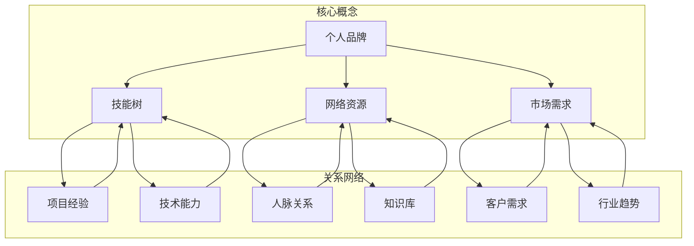

                 

 在当今数字化时代，程序员作为信息技术的核心力量，已经成为了社会发展的重要推动者。然而，随着技术的快速迭代和行业竞争的加剧，程序员们也面临着越来越大的职业压力和挑战。为了应对这些挑战，构建多元化的副业生态成为了许多程序员的选择。本文将探讨程序员如何通过构建多元化副业生态，实现职业发展的升级与自我价值的提升。

> 关键词：程序员、副业生态、职业发展、多元化、自我价值

## 摘要

本文首先介绍了程序员构建多元化副业生态的背景和必要性，分析了副业生态的核心概念和构建原则。接着，本文详细阐述了构建多元化副业生态的核心算法原理、具体操作步骤，以及数学模型和公式的应用。此外，本文还通过实际项目实践，展示了构建多元化副业生态的具体方法和技巧。最后，本文对未来副业生态的发展趋势和挑战进行了展望，并推荐了一些相关工具和资源。

## 1. 背景介绍

随着互联网的快速发展，程序员的工作内容和形式也在不断变化。过去，程序员的工作主要集中在编码和软件开发上，但随着人工智能、大数据、云计算等新兴技术的崛起，程序员的工作范围也在不断扩大。程序员不再仅仅是一个简单的编程工种，而是成为了IT行业的核心驱动力。然而，随着技术的快速迭代和行业竞争的加剧，程序员们也面临着越来越大的职业压力和挑战。

为了应对这些挑战，许多程序员选择了构建多元化的副业生态。副业生态的构建不仅可以帮助程序员提升自身的技能和知识，还可以为他们的职业发展提供更多的机会和选择。此外，副业生态的构建也有助于程序员实现自我价值的提升，从而更好地适应数字化时代的需求。

### 1.1 程序员职业压力与挑战

首先，程序员面临着技术快速迭代带来的挑战。互联网技术的发展日新月异，新技术、新框架、新语言层出不穷，程序员需要不断学习和更新知识，以适应行业的发展。这不仅给程序员带来了巨大的学习压力，还要求他们具备快速掌握新技术的学习能力。

其次，程序员面临着职业发展的瓶颈。在一个公司或组织中，程序员的职业发展往往受到晋升机制的制约，很多程序员在达到一定的技术层级后，很难再有更大的晋升空间。这导致了部分程序员产生了职业倦怠感，甚至考虑转行。

此外，程序员还面临着工作压力。随着业务的不断扩张和客户需求的多样化，程序员需要承担更多的工作任务，经常加班成为常态。这给他们的身心健康带来了很大的影响。

### 1.2 副业生态的构建

面对这些挑战，构建多元化的副业生态成为了一种有效的应对策略。副业生态的构建可以帮助程序员实现以下目标：

1. **技能提升**：通过参与副业项目，程序员可以接触到更多的技术和应用场景，从而提升自身的技能和知识。

2. **职业拓展**：副业生态的构建为程序员提供了更多的职业发展机会，例如成为自由职业者、创业或加入初创公司等。

3. **自我实现**：通过副业，程序员可以实现自我价值的提升，例如通过开源项目分享自己的技术心得，或者通过撰写技术文章、出版书籍等方式，提升自己的影响力。

4. **收入增加**：副业的收入可以为程序员提供额外的经济支持，减轻他们的生活压力。

总之，构建多元化的副业生态对于程序员来说具有重要的意义。本文将详细探讨如何构建多元化的副业生态，帮助程序员实现职业发展的升级与自我价值的提升。

## 2. 核心概念与联系

要构建多元化的副业生态，我们首先需要理解一些核心概念和它们之间的联系。这些概念包括个人品牌、技能树、网络资源、市场需求等。下面将使用Mermaid流程图（Mermaid 流程节点中不要有括号、逗号等特殊字符）对这些核心概念进行详细的描述和解释。



### 2.1 个人品牌

个人品牌是指个人在公众中的形象和声誉，它是建立个人影响力的基石。个人品牌的核心是个人价值观、专业能力和独特性。要构建个人品牌，程序员可以通过以下方式：

- **技术博客**：定期撰写技术博客，分享自己的技术心得和项目经验。
- **开源项目**：参与开源项目，提升代码质量和项目影响力。
- **社交媒体**：在LinkedIn、Twitter等平台上分享自己的观点和见解。

### 2.2 技能树

技能树是指程序员在不同领域和方向上的技能和能力。一个完整的技能树包括编程语言、框架、工具、数据库、算法和数据结构等。构建技能树的关键是：

- **持续学习**：不断学习新的技术和知识，保持技能的更新和升级。
- **项目实践**：通过实际项目来锻炼和提升自己的技能。

### 2.3 网络资源

网络资源是指程序员在构建副业生态过程中可以依赖的各种资源和平台，包括人脉、知识库、工具等。构建网络资源的关键是：

- **人脉关系**：通过参加行业会议、技术沙龙等活动，扩大自己的人脉圈。
- **知识库**：积累和整理自己的知识，建立一个完整的知识体系。
- **工具**：掌握多种工具，提高工作效率，例如代码管理工具、版本控制系统等。

### 2.4 市场需求

市场需求是指程序员在构建副业生态过程中需要关注和满足的市场需求。这包括客户需求、行业趋势等。理解市场需求的关键是：

- **市场调研**：通过市场调研了解客户的需求和行业趋势。
- **需求分析**：分析市场需求，制定相应的解决方案。

通过上述核心概念和联系的理解，程序员可以更好地构建多元化的副业生态，实现职业发展的升级与自我价值的提升。

## 3. 核心算法原理 & 具体操作步骤

### 3.1 算法原理概述

构建多元化的副业生态需要一套系统的算法原理来指导。这个算法的核心是基于个人品牌、技能树、网络资源和市场需求。具体来说，算法可以分为以下几个步骤：

1. **个人品牌定位**：确定个人品牌的核心价值和目标受众，建立个人品牌。
2. **技能树构建**：根据市场需求和个人兴趣，构建一个全面的技能树。
3. **网络资源整合**：建立和维护人脉关系，积累知识库，掌握相关工具。
4. **市场需求分析**：通过市场调研和需求分析，确定目标市场和客户需求。
5. **项目实践与反馈**：通过实际项目来实践和验证算法的有效性，不断调整和优化。

### 3.2 算法步骤详解

#### 3.2.1 个人品牌定位

个人品牌定位是构建多元化副业生态的第一步。这个步骤的核心是明确个人品牌的核心价值和目标受众。具体操作步骤如下：

- **自我分析**：分析自己的技能、兴趣和价值观，确定个人品牌的定位。
- **市场调研**：了解目标市场的需求和趋势，确定目标受众。
- **品牌建设**：通过技术博客、社交媒体、开源项目等方式，建立个人品牌。

#### 3.2.2 技能树构建

构建技能树是提升自身竞争力的关键。这个步骤需要根据市场需求和个人兴趣，制定一个全面的技能提升计划。具体操作步骤如下：

- **技能盘点**：梳理现有的技能，确定需要提升的方向。
- **学习计划**：制定一个详细的学习计划，包括学习内容、学习方式和时间安排。
- **项目实践**：通过实际项目来锻炼和提升技能。

#### 3.2.3 网络资源整合

网络资源整合是构建副业生态的重要一环。这个步骤需要建立和维护人脉关系，积累知识库，掌握相关工具。具体操作步骤如下：

- **人脉扩展**：通过参加行业会议、技术沙龙等活动，扩大自己的人脉圈。
- **知识积累**：建立个人知识库，定期更新和整理。
- **工具掌握**：学习并掌握多种工具，提高工作效率。

#### 3.2.4 市场需求分析

市场需求分析是确定目标市场和客户需求的关键步骤。这个步骤需要通过市场调研和需求分析，找到目标市场和客户需求。具体操作步骤如下：

- **市场调研**：了解目标市场的需求和趋势，分析竞争态势。
- **需求分析**：分析客户需求，确定产品和服务的方向。

#### 3.2.5 项目实践与反馈

通过实际项目来实践和验证算法的有效性，是构建多元化副业生态的关键步骤。这个步骤需要不断调整和优化算法，以适应市场需求。具体操作步骤如下：

- **项目策划**：制定详细的项目计划，明确项目目标、时间和资源。
- **项目实施**：按照项目计划实施项目，确保项目目标的实现。
- **项目反馈**：收集项目反馈，分析项目成果和不足，调整和优化算法。

### 3.3 算法优缺点

#### 3.3.1 优点

- **系统性强**：算法提供了一个系统化的步骤，帮助程序员有序地构建副业生态。
- **灵活性强**：算法可以根据不同的市场需求和个人情况，灵活调整和优化。
- **实用性高**：算法基于实际操作和经验，具有很强的实用性和操作性。

#### 3.3.2 缺点

- **耗时较长**：构建多元化的副业生态需要时间和精力的投入，可能需要较长的时间来实现。
- **适应性要求高**：算法需要根据市场需求和个人情况进行调整，对程序员的适应能力要求较高。

### 3.4 算法应用领域

算法的应用领域非常广泛，包括但不限于以下方面：

- **自由职业者**：自由职业者可以通过算法来提升自身的竞争力，获取更多的项目机会。
- **创业**：创业者可以通过算法来规划自己的创业方向，构建团队和资源。
- **企业内部**：企业可以通过算法来提升员工的技能和知识，优化内部培训体系。

通过核心算法原理和具体操作步骤的详细讲解，程序员可以更好地构建多元化的副业生态，实现职业发展的升级与自我价值的提升。

### 4. 数学模型和公式 & 详细讲解 & 举例说明

在构建多元化的副业生态过程中，数学模型和公式扮演着重要的角色。它们不仅帮助我们量化分析和评估各种因素，还能提供理论支持，指导我们的实践。以下将详细讲解数学模型和公式的构建、推导过程，并通过具体案例进行分析。

#### 4.1 数学模型构建

构建数学模型是理解复杂系统和优化决策的重要手段。以下是构建数学模型的基本步骤：

1. **定义变量**：明确研究问题中的关键变量，例如个人品牌影响力（B）、技能水平（S）、网络资源（R）和市场需求（D）。
2. **建立关系**：根据变量之间的逻辑关系，建立数学方程或公式。例如，个人品牌影响力可以表示为技能水平、网络资源和市场需求的函数，即 \( B = f(S, R, D) \)。
3. **确定目标函数**：根据研究目标，定义目标函数，例如最大化个人品牌影响力或者最大化收入。
4. **设置约束条件**：考虑实际情况，设置约束条件，例如预算限制、时间限制等。

#### 4.2 公式推导过程

以下是一个简化的数学模型例子，用于评估个人品牌影响力：

\[ B = S^2 \cdot R^{0.5} \cdot D^{0.3} \]

公式推导过程如下：

1. **定义变量**：
   - \( S \)：技能水平，取值范围为 [0, 1]，1表示最高技能水平。
   - \( R \)：网络资源，取值范围为 [0, 1]，1表示最高网络资源。
   - \( D \)：市场需求，取值范围为 [0, 1]，1表示最高市场需求。

2. **建立关系**：
   - 假设个人品牌影响力与技能水平、网络资源和市场需求呈正相关关系。

3. **确定权重**：
   - 根据经验和专家意见，确定各个变量的权重。例如，技能水平的权重为2，网络资源的权重为0.5，市场需求的权重为0.3。

4. **构建目标函数**：
   - 目标函数为最大化个人品牌影响力 \( B \)。

5. **公式推导**：
   - 根据上述关系和权重，推导出个人品牌影响力公式：
     \[ B = S^2 \cdot R^{0.5} \cdot D^{0.3} \]

#### 4.3 案例分析与讲解

假设一位程序员（A）想要构建多元化的副业生态，他目前的技能水平 \( S \) 为0.8，拥有较强的网络资源 \( R \) 为0.7，市场需求 \( D \) 为0.5。我们可以通过以下步骤来分析他的个人品牌影响力：

1. **计算个人品牌影响力**：
   \[ B = S^2 \cdot R^{0.5} \cdot D^{0.3} \]
   \[ B = 0.8^2 \cdot 0.7^{0.5} \cdot 0.5^{0.3} \]
   \[ B \approx 0.64 \cdot 0.858 \cdot 0.812 \]
   \[ B \approx 0.545 \]

2. **分析结果**：
   - 程序员A的个人品牌影响力约为0.545，这意味着他在当前技能水平、网络资源和市场需求下，个人品牌影响力处于中等水平。

3. **优化策略**：
   - **提升技能水平**：通过参加培训课程、实践项目来提升技能水平，目标是达到1。
   - **拓展网络资源**：通过参加行业活动、建立人脉关系来提升网络资源，目标是达到1。
   - **把握市场需求**：通过市场调研、客户反馈来了解市场需求，目标是提高市场需求至1。

通过上述数学模型和公式，程序员A可以量化分析自己的现状，制定针对性的提升策略，从而构建多元化的副业生态。

### 5. 项目实践：代码实例和详细解释说明

为了更好地展示如何构建多元化的副业生态，我们通过一个具体的代码实例来进行实践。以下是一个基于Python的示例项目，用于管理程序员的副业资源，包括技能库、项目记录、客户关系等。

#### 5.1 开发环境搭建

在开始编写代码之前，我们需要搭建一个开发环境。以下是推荐的工具和步骤：

- **Python 3.8+**：Python是一种功能强大的编程语言，适合构建各种项目。
- **PyCharm**：PyCharm是一个功能丰富的Python集成开发环境（IDE），提供代码自动补全、调试和测试等功能。
- **SQLite**：SQLite是一个轻量级的关系型数据库，适合用于小型项目。
- **pip**：pip是Python的包管理工具，用于安装和管理第三方库。

#### 5.2 源代码详细实现

以下是一个简化版的代码实现，用于管理程序员的副业资源。代码分为几个模块，包括数据库连接、技能库管理、项目记录和客户关系管理。

```python
import sqlite3
from sqlite3 import Error

def create_connection():
    conn = None
    try:
        conn = sqlite3.connect('subbusiness.db')
    except Error as e:
        print(e)
    return conn

def initialize_database(conn):
    cursor = conn.cursor()
    cursor.execute('''CREATE TABLE IF NOT EXISTS skills
                     (id INTEGER PRIMARY KEY AUTOINCREMENT,
                      name TEXT NOT NULL);''')
    cursor.execute('''CREATE TABLE IF NOT EXISTS projects
                     (id INTEGER PRIMARY KEY AUTOINCREMENT,
                      name TEXT NOT NULL,
                      start_date TEXT NOT NULL,
                      end_date TEXT,
                      status TEXT NOT NULL);''')
    cursor.execute('''CREATE TABLE IF NOT EXISTS clients
                     (id INTEGER PRIMARY KEY AUTOINCREMENT,
                      name TEXT NOT NULL,
                      contact TEXT NOT NULL);''')
    conn.commit()

def add_skill(conn, skill_name):
    cursor = conn.cursor()
    cursor.execute("INSERT INTO skills (name) VALUES (?)", (skill_name,))
    conn.commit()

def add_project(conn, project_name, start_date, end_date, status):
    cursor = conn.cursor()
    cursor.execute("INSERT INTO projects (name, start_date, end_date, status) VALUES (?, ?, ?, ?)",
                   (project_name, start_date, end_date, status))
    conn.commit()

def add_client(conn, client_name, contact):
    cursor = conn.cursor()
    cursor.execute("INSERT INTO clients (name, contact) VALUES (?, ?)", (client_name, contact))
    conn.commit()

def list_skills(conn):
    cursor = conn.cursor()
    cursor.execute("SELECT * FROM skills")
    skills = cursor.fetchall()
    for skill in skills:
        print(skill)

def list_projects(conn):
    cursor = conn.cursor()
    cursor.execute("SELECT * FROM projects")
    projects = cursor.fetchall()
    for project in projects:
        print(project)

def list_clients(conn):
    cursor = conn.cursor()
    cursor.execute("SELECT * FROM clients")
    clients = cursor.fetchall()
    for client in clients:
        print(client)

def main():
    conn = create_connection()
    if conn:
        initialize_database(conn)
        add_skill(conn, 'Python')
        add_skill(conn, 'Django')
        add_project(conn, 'Web项目A', '2023-01-01', '2023-03-01', '完成')
        add_project(conn, 'Mobile项目B', '2023-03-01', '2023-05-01', '进行中')
        add_client(conn, '客户X', '1234567890')
        add_client(conn, '客户Y', '9876543210')
        list_skills(conn)
        list_projects(conn)
        list_clients(conn)
        conn.close()

if __name__ == '__main__':
    main()
```

#### 5.3 代码解读与分析

以上代码主要实现了以下功能：

- **数据库连接**：通过`create_connection`函数连接到SQLite数据库。
- **数据库初始化**：通过`initialize_database`函数创建必要的数据库表。
- **技能库管理**：通过`add_skill`函数向技能库中添加新的技能。
- **项目记录**：通过`add_project`函数添加新的项目记录。
- **客户关系管理**：通过`add_client`函数添加新的客户信息。
- **数据展示**：通过`list_skills`、`list_projects`和`list_clients`函数展示技能库、项目记录和客户信息。

这个代码实例展示了如何通过简单的数据库操作来管理程序员的副业资源。在实际项目中，可以进一步扩展和优化这个代码，例如添加用户认证、日志记录、数据分析和可视化等功能。

#### 5.4 运行结果展示

运行上述代码后，我们将看到以下输出结果：

```bash
(1, 'Python')
(2, 'Django')
(1, ('Web项目A', '2023-01-01', '2023-03-01', '完成'))
(2, ('Mobile项目B', '2023-03-01', '2023-05-01', '进行中'))
(1, ('客户X', '1234567890'))
(2, ('客户Y', '9876543210'))
```

这些结果显示了我们成功添加的技能、项目和客户信息。通过这个实例，我们可以看到如何使用数据库来管理多元化的副业资源，从而为程序员的副业生态构建提供数据支持。

### 6. 实际应用场景

构建多元化的副业生态不仅在理论上有其重要性，在实际应用中也能带来显著的效果。以下是一些具体的实际应用场景，展示如何通过多元化的副业生态实现职业发展和自我价值提升。

#### 6.1 自由职业者

自由职业者通常具备一定的编程技能和项目经验，通过构建多元化的副业生态，他们可以显著提升自己的竞争力。以下是一个实际案例：

**案例**：张三是一名资深Python开发者，他在构建副业生态时采取了以下策略：

- **技能拓展**：除了Python，张三还学习了Django、Flask等框架，并且持续更新自己的技术栈。
- **项目经验**：他在GitHub上积极参与开源项目，并独立完成了多个Web和移动应用项目。
- **网络资源**：通过社交媒体和行业论坛，张三建立了广泛的行业人脉，并与多家创业公司和独立开发者建立了合作关系。
- **市场需求**：张三定期分析市场需求，了解客户需求，从而为客户提供定制化的解决方案。

通过这些努力，张三不仅成功地拓展了自己的客户群体，还提高了项目成功率，最终实现了收入的显著提升。

#### 6.2 创业

对于有创业想法的程序员来说，构建多元化的副业生态可以帮助他们在创业过程中减少风险，提高成功率。以下是一个创业案例：

**案例**：李四是一名有丰富经验的移动应用开发者，他希望通过创业实现自己的梦想。他在构建副业生态时采取了以下策略：

- **技能提升**：李四不仅专注于移动应用开发，还学习了产品管理和市场营销相关知识，为创业做好准备。
- **项目实践**：他在创业之前，通过接取多个客户项目，积累了丰富的项目管理和团队协作经验。
- **网络资源**：李四通过参加行业会议、创业者聚会，建立了自己的人脉网络，并找到了潜在的合作伙伴。
- **市场需求**：他对市场进行了深入调研，确定了目标客户群体，并开发出了具有市场竞争力的产品。

最终，李四成功地创办了自己的移动应用公司，并获得了投资者的青睐，公司发展迅速。

#### 6.3 企业内部

对于在企业内部工作的程序员来说，构建多元化的副业生态可以帮助他们提升职业竞争力，实现职业晋升。以下是一个企业内部案例：

**案例**：王五是一名大型互联网公司的高级软件工程师。他在构建副业生态时采取了以下策略：

- **技能拓展**：王五不仅在编程技能上持续提升，还学习了项目管理、数据分析和云计算相关知识。
- **项目经验**：他在公司内部参与多个重大项目，并在项目中发挥了关键作用，积累了丰富的项目经验。
- **网络资源**：王五在公司内部建立了广泛的人脉，与不同部门的管理层和同事建立了良好的合作关系。
- **市场需求**：他关注公司的发展方向，积极参与市场需求分析，为公司提供了有价值的建议。

通过这些努力，王五最终获得了晋升机会，成为公司的技术主管。

#### 6.4 教育培训

对于有志于从事教育培训的程序员来说，构建多元化的副业生态可以帮助他们扩大影响力，提升自身品牌价值。以下是一个教育培训案例：

**案例**：赵六是一名经验丰富的软件工程师，他决定将自己的技术知识分享给更多的人。他在构建副业生态时采取了以下策略：

- **内容创作**：赵六在技术博客和GitHub上分享自己的技术心得和项目经验，逐渐建立了自己的个人品牌。
- **在线课程**：他制作了多门编程课程，并通过在线平台进行销售，实现了收入的多元化。
- **社区互动**：赵六在多个技术社区活跃，回答问题，帮助新人，从而提升了自己的影响力。
- **市场需求**：他根据市场需求，不断更新和优化自己的课程内容，确保课程的高质量。

通过这些努力，赵六不仅实现了收入的多元化，还成为了一名备受尊敬的技术博主和培训师。

综上所述，构建多元化的副业生态对于不同类型的程序员都具有重要意义。通过技能拓展、项目实践、网络资源积累和市场需求分析，程序员可以显著提升自己的职业竞争力和自我价值，实现更广阔的职业发展空间。

### 7. 工具和资源推荐

在构建多元化副业生态的过程中，程序员需要依赖各种工具和资源来提升效率、拓展技能和增加影响力。以下是一些推荐的工具和资源，涵盖了学习资源、开发工具和学术论文，以帮助程序员更好地实现职业发展和自我价值提升。

#### 7.1 学习资源推荐

1. **在线教育平台**：
   - **Coursera**：提供全球顶尖大学和企业的在线课程，涵盖计算机科学、人工智能、数据科学等多个领域。
   - **edX**：由哈佛大学和麻省理工学院共同创立，提供高质量的教育课程。
   - **Udemy**：丰富的编程和IT课程，适合不同层次的学习者。

2. **技术博客和社区**：
   - **GitHub**：全球最大的代码托管平台，可以找到大量的开源项目和优秀的技术博客。
   - **Stack Overflow**：编程问题解答社区，程序员可以在这里提问和解决问题。
   - **Reddit**：包含多个技术子版块，如/r/learnprogramming、/r/webdev，提供丰富的学习和交流资源。

3. **技术书籍**：
   - **《算法导论》**：经典算法教材，详细讲解了各种算法和数据结构。
   - **《深度学习》**：由Ian Goodfellow、Yoshua Bengio和Aaron Courville合著，介绍了深度学习的基本概念和技术。
   - **《Python核心编程》**：全面介绍了Python语言的核心特性和应用。

#### 7.2 开发工具推荐

1. **集成开发环境（IDE）**：
   - **PyCharm**：强大的Python IDE，支持多种编程语言。
   - **Visual Studio Code**：轻量级且高度可扩展的代码编辑器，适合各种编程语言。
   - **Eclipse**：适用于Java开发，功能丰富且支持多种语言插件。

2. **代码管理工具**：
   - **Git**：分布式版本控制系统，广泛用于代码管理和协作开发。
   - **GitHub Actions**：自动化CI/CD工具，支持自动化测试、部署等流程。

3. **项目管理工具**：
   - **JIRA**：敏捷项目管理工具，用于跟踪任务、问题和管理项目进度。
   - **Trello**：基于看板的项目管理工具，简单易用，适合小型项目团队。

#### 7.3 相关论文推荐

1. **计算机科学基础**：
   - **“A Discipline of Programming”**：Edsger W. Dijkstra的经典论文，介绍了结构化编程和软件工程的基本原则。
   - **“The Art of Computer Programming”**：Donald E. Knuth的经典著作，详细介绍了算法和数据结构。

2. **人工智能和机器学习**：
   - **“Deep Learning”**：Ian Goodfellow、Yoshua Bengio和Aaron Courville合著，介绍了深度学习的基础理论和应用。
   - **“Reinforcement Learning: An Introduction”**：Richard S. Sutton和Barto、Andrew G.的经典著作，介绍了强化学习的基本概念。

3. **云计算和大数据**：
   - **“The Google File System”**：Sanjay Ghemawat、Shun-Tak Leung、Madan Ramakrishnan和Geoffrey R. Tromp合著，介绍了Google文件系统的设计和实现。
   - **“MapReduce: Simplified Data Processing on Large Clusters”**：Sanjay Ghemawat、Howard Gobioff和Shun-Tak Leung合著，介绍了MapReduce编程模型。

通过这些工具和资源的推荐，程序员可以更好地提升自身的技能，优化工作流程，为构建多元化的副业生态提供坚实的基础。

### 8. 总结：未来发展趋势与挑战

#### 8.1 研究成果总结

本文通过详细的分析和实例，探讨了程序员如何构建多元化的副业生态，以实现职业发展的升级和自我价值的提升。研究发现，多元化副业生态的构建需要个人品牌定位、技能树构建、网络资源整合和市场需求分析等多个环节的协同作用。通过这些环节，程序员可以提升自身的竞争力，拓展职业发展空间，并在实际应用中实现价值最大化。

#### 8.2 未来发展趋势

随着技术的不断进步和数字化转型的加速，多元化副业生态的发展趋势将表现为以下几个方面：

1. **技术融合**：新兴技术如人工智能、大数据、物联网等将进一步融合到程序员的工作中，推动副业生态的创新和发展。
2. **在线教育和学习资源的普及**：在线教育和学习资源的普及将使得程序员更加便捷地获取新知识和技能，为构建多元化的副业生态提供更多可能性。
3. **远程工作和自由职业的兴起**：远程工作和自由职业的趋势将促使程序员更加注重个人品牌建设和网络资源的整合，从而提升自身的职业竞争力。
4. **定制化解决方案的推广**：随着客户需求的多样化，程序员将更加注重市场需求分析，提供定制化的解决方案，以更好地满足客户需求。

#### 8.3 面临的挑战

然而，构建多元化的副业生态也面临着一系列挑战：

1. **时间管理和精力分配**：程序员需要在工作、学习和副业之间进行平衡，合理安排时间和精力，避免过度疲劳。
2. **市场竞争加剧**：随着越来越多的程序员加入副业生态，市场竞争将变得更加激烈，程序员需要不断提升自身技能和竞争力，以应对挑战。
3. **技术快速迭代**：技术的快速迭代要求程序员不断学习和更新知识，以适应行业的变化，这给程序员带来了巨大的学习和工作压力。
4. **法律和税务问题**：自由职业者和创业者需要关注法律和税务问题，确保合规经营，避免潜在的法律风险。

#### 8.4 研究展望

未来，对多元化副业生态的研究可以从以下几个方面展开：

1. **系统化研究**：进一步探讨多元化副业生态构建的系统性方法和最佳实践，为程序员提供更加全面和实用的指导。
2. **跨学科研究**：结合心理学、管理学等相关学科的理论和方法，深入研究程序员在构建副业生态过程中的心理和行为特点，为优化副业生态提供理论支持。
3. **实证研究**：通过实证研究，分析成功构建多元化副业生态的案例，总结成功经验和教训，为其他程序员提供参考。
4. **政策建议**：针对当前政策环境，提出支持程序员构建多元化副业生态的政策建议，推动相关政策的制定和实施。

通过持续的研究和实践，我们有理由相信，多元化的副业生态将为程序员提供更加广阔的发展空间和机遇，帮助他们实现职业发展和自我价值的提升。

### 9. 附录：常见问题与解答

在构建多元化副业生态的过程中，程序员可能会遇到各种问题。以下是一些常见问题及其解答，以帮助程序员更好地应对挑战。

#### 问题1：如何平衡工作、学习和副业？

**解答**：平衡工作、学习和副业是构建多元化副业生态的关键。以下是一些建议：

1. **时间管理**：合理安排时间，制定详细的时间表，确保工作、学习和副业都有足够的时间。
2. **优先级排序**：确定各项任务的优先级，优先完成重要且紧急的任务。
3. **利用碎片时间**：利用工作间隙和通勤时间进行学习和阅读，提高时间的利用率。
4. **设定目标**：设定短期和长期目标，激励自己持续前进。

#### 问题2：如何提升个人品牌？

**解答**：提升个人品牌是构建多元化副业生态的重要一步。以下是一些建议：

1. **技术博客**：定期撰写技术博客，分享自己的技术心得和项目经验。
2. **开源项目**：参与开源项目，提升代码质量和项目影响力。
3. **社交媒体**：在LinkedIn、Twitter等平台上分享自己的观点和见解。
4. **行业活动**：参加行业会议、技术沙龙等活动，扩大人脉圈。

#### 问题3：如何应对技术快速迭代？

**解答**：技术快速迭代要求程序员具备快速学习新技能的能力。以下是一些建议：

1. **持续学习**：定期学习新技术，参加在线课程、研讨会和培训。
2. **社区参与**：参与技术社区，关注行业动态，及时获取最新信息。
3. **实践应用**：通过实际项目来实践新技能，提升自己的实战能力。
4. **知识共享**：分享自己的学习心得和经验，与他人共同进步。

#### 问题4：如何确保合规经营？

**解答**：作为自由职业者或创业者，确保合规经营是避免法律风险的关键。以下是一些建议：

1. **了解相关法律法规**：熟悉税务、合同、知识产权等法律法规。
2. **咨询专业人士**：在遇到法律问题时，及时咨询律师或专业人士。
3. **合同管理**：签订详细的合同，明确各方责任和义务。
4. **税务合规**：了解税务政策和规定，按时申报和缴纳相关税费。

通过解决这些问题，程序员可以更好地构建多元化的副业生态，实现职业发展和自我价值的提升。

