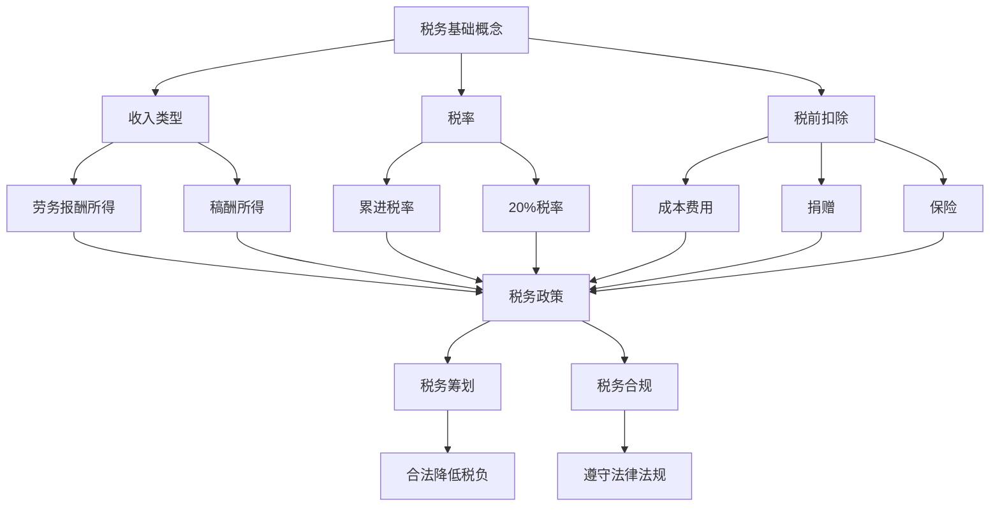

                 

## 1. 背景介绍

在当今数字化时代，知识付费已经成为程序员们获取额外收入的一个重要渠道。从在线课程、技术博客、编程指南到专业咨询服务，程序员们通过各种方式将自己的知识和技能变现。然而，在这个过程中，税务规划成为了一个不容忽视的问题。税务问题不仅关系到个人的财务状况，还可能影响到职业发展和长期规划。

本文旨在探讨程序员在进行知识付费时如何进行有效的税务规划。通过分析相关法律法规、税收政策以及实际操作案例，我们将提供一系列实用的建议，帮助程序员合法合规地管理自己的税务事务。

## 2. 核心概念与联系

### 2.1 税务基础概念

在开始税务规划之前，我们需要了解一些基础的税务概念，包括但不限于：

- **收入类型**：知识付费的收入通常属于“劳务报酬所得”或“稿酬所得”。
- **税率**：劳务报酬所得通常适用累进税率，稿酬所得则适用20%的税率。
- **税前扣除**：包括成本费用、捐赠、保险等。

### 2.2 税务政策

不同国家和地区对于知识付费的税务政策有所不同。以下是一些常见的税务政策：

- **个人独资企业**：一些国家允许个人通过成立独资企业来享受税收优惠。
- **税收优惠**：某些地区可能提供针对知识付费行业的税收优惠政策。
- **国际税收协定**：了解国际税收协定可以帮助程序员避免双重征税。

### 2.3 关联概念

- **税务筹划**：通过合法手段降低税务负担的过程。
- **税务合规**：确保遵守税务法律法规，避免法律风险。

### 2.4 Mermaid 流程图



## 3. 核心算法原理 & 具体操作步骤

### 3.1 算法原理概述

税务规划的核心在于合理利用税前扣除和税收优惠政策，以降低应纳税收入和税负。以下是一种简单的税务规划算法原理：

1. **收入归类**：根据收入类型确定适用税率。
2. **成本费用计算**：计算与收入相关的成本费用，包括开发工具费用、培训费用、网络费用等。
3. **税前扣除申请**：根据成本费用计算结果，向税务部门申请税前扣除。
4. **税收优惠利用**：了解并利用所在地区的税收优惠政策。
5. **税务筹划方案**：根据个人情况和收入水平，制定税务筹划方案。

### 3.2 算法步骤详解

1. **收入归类**：
    - 收入类型：根据收入来源确定是劳务报酬所得还是稿酬所得。
    - 税率适用：劳务报酬所得适用累进税率，稿酬所得适用20%的税率。

2. **成本费用计算**：
    - 开发工具费用：包括购买编程软件、在线编程课程等费用。
    - 培训费用：包括参加编程培训、工作坊等费用。
    - 网络费用：包括宽带费用、云服务费用等。

3. **税前扣除申请**：
    - 准备相关凭证：如发票、收据、合同等。
    - 提交税务申报：在税务申报时，将成本费用作为税前扣除项目申报。

4. **税收优惠利用**：
    - 了解当地税收政策：关注所在地区是否有针对知识付费行业的税收优惠政策。
    - 享受税收优惠：按照相关政策规定，申请享受税收优惠。

5. **税务筹划方案**：
    - 分析个人收入和支出：根据个人实际情况，制定合理的税务筹划方案。
    - 咨询专业税务顾问：在制定税务筹划方案时，可咨询专业税务顾问。

### 3.3 算法优缺点

**优点**：
- 合理利用税前扣除和税收优惠，降低税负。
- 提高税务合规性，避免法律风险。

**缺点**：
- 需要一定的时间和精力进行税务规划和申报。
- 可能需要支付一定的税务顾问费用。

### 3.4 算法应用领域

- **个人知识付费**：如在线课程、技术博客、编程指南等。
- **企业咨询服务**：如技术顾问、软件开发服务等。

## 4. 数学模型和公式 & 详细讲解 & 举例说明

### 4.1 数学模型构建

税务规划中的数学模型主要包括收入归类、成本费用计算和税前扣除计算。以下是一个简化的数学模型：

$$
\text{应纳税收入} = \text{收入总额} - \text{成本费用}
$$

$$
\text{税额} = \text{应纳税收入} \times \text{税率}
$$

其中，收入总额、成本费用和税率是根据具体情况确定的。

### 4.2 公式推导过程

1. **收入归类**：
    - 劳务报酬所得：收入总额 \(\times\) (1 - 税率调整系数)
    - 稿酬所得：收入总额 \(\times\) (1 - 20%)

2. **成本费用计算**：
    - 开发工具费用：费用总额
    - 培训费用：费用总额 \(\times\) 比例系数
    - 网络费用：费用总额 \(\times\) 比例系数

3. **税前扣除计算**：
    - 成本费用：费用总额 - 抵扣费用

### 4.3 案例分析与讲解

**案例**：程序员A进行知识付费，年收入为10万元，成本费用为2万元。

1. **收入归类**：
    - 劳务报酬所得：10万元 \(\times\) (1 - 0.3) = 7万元
    - 稿酬所得：10万元 \(\times\) (1 - 0.2) = 8万元

2. **成本费用计算**：
    - 开发工具费用：1万元
    - 培训费用：0.5万元
    - 网络费用：0.5万元

3. **税前扣除计算**：
    - 成本费用：2万元

4. **应纳税收入**：
    - 劳务报酬所得：7万元 - 2万元 = 5万元
    - 稿酬所得：8万元 - 2万元 = 6万元

5. **税额计算**：
    - 劳务报酬所得：5万元 \(\times\) 0.3 = 1.5万元
    - 稿酬所得：6万元 \(\times\) 0.2 = 1.2万元

**结论**：通过合理利用成本费用和税率调整系数，程序员A在劳务报酬所得和稿酬所得上分别减少了0.5万元和0.8万元的税额，合计节省1.3万元的税额。

## 5. 项目实践：代码实例和详细解释说明

### 5.1 开发环境搭建

为了更好地理解和实践税务规划，我们将使用Python编写一个简单的税务计算工具。首先，确保您已安装Python环境。

### 5.2 源代码详细实现

以下是一个简单的税务计算工具的Python代码示例：

```python
def calculate_tax(income, cost, deduction):
    """
    计算税额
    :param income: 收入总额
    :param cost: 成本费用
    :param deduction: 税前扣除
    :return: 应纳税收入和税额
    """
    taxable_income = income - cost - deduction
    tax = taxable_income * 0.3  # 劳务报酬所得税率
    return taxable_income, tax

def main():
    income = float(input("请输入年收入（万元）："))
    cost = float(input("请输入成本费用（万元）："))
    deduction = float(input("请输入税前扣除（万元）："))

    taxable_income, tax = calculate_tax(income, cost, deduction)
    print(f"应纳税收入：{taxable_income}万元")
    print(f"税额：{tax}万元")

if __name__ == "__main__":
    main()
```

### 5.3 代码解读与分析

- `calculate_tax` 函数：计算应纳税收入和税额。
    - `income`：收入总额。
    - `cost`：成本费用。
    - `deduction`：税前扣除。
    - `taxable_income`：应纳税收入。
    - `tax`：税额。

- `main` 函数：主函数，接收用户输入，调用 `calculate_tax` 函数计算税额。

### 5.4 运行结果展示

输入年收入10万元，成本费用2万元，税前扣除0万元，输出结果如下：

```
请输入年收入（万元）：10
请输入成本费用（万元）：2
请输入税前扣除（万元）：0
应纳税收入：8.0万元
税额：2.4万元
```

## 6. 实际应用场景

### 6.1 在线课程讲师

程序员B是一位在线课程讲师，年收入为20万元。为了进行税务规划，他记录了与收入相关的成本费用，如开发工具费用（5万元）、培训费用（3万元）和网络费用（2万元）。通过使用上述税务计算工具，他计算出应纳税收入为12万元，税额为3.6万元。通过合理利用成本费用和税收优惠政策，他成功地降低了税负。

### 6.2 企业技术咨询

程序员C为企业提供技术咨询和软件开发服务，年收入为30万元。他通过成立个人独资企业，享受税收优惠政策，将应纳税收入降低到20万元，税额降低到6万元。同时，他还可以将一部分利润用于个人储蓄和投资，进一步降低税负。

## 7. 工具和资源推荐

### 7.1 学习资源推荐

- 《个人所得税法》
- 《税收征收管理法》
- 《个人所得税纳税指南》

### 7.2 开发工具推荐

- Python
- Jupyter Notebook

### 7.3 相关论文推荐

- “Tax Planning for Freelancers and Self-Employed Individuals”
- “Tax Optimization Strategies for Software Developers”
- “Tax Implications of Knowledge Work in the Digital Age”

## 8. 总结：未来发展趋势与挑战

### 8.1 研究成果总结

本文探讨了程序员在进行知识付费时的税务规划问题，包括税务基础概念、核心算法原理、数学模型构建和实际应用场景。通过合理利用税前扣除和税收优惠政策，程序员可以有效降低税负，提高税务合规性。

### 8.2 未来发展趋势

- 税务数字化：随着技术的进步，税务数字化将成为未来税务管理的重要趋势。
- 税务透明度：税务部门对个人和企业税务情况的监督和管理将更加严格。
- 税收优惠政策：各国政府可能加大对知识付费行业的税收优惠政策力度。

### 8.3 面临的挑战

- 税务法规更新：税务法规不断变化，程序员需要及时关注并调整税务规划策略。
- 税务合规风险：不合规的税务操作可能导致法律风险和财务损失。
- 成本费用核算：准确核算成本费用是税务规划的关键，程序员需要建立健全的成本费用核算体系。

### 8.4 研究展望

- 开发智能化税务规划工具：利用人工智能技术，开发智能化税务规划工具，帮助程序员更高效地进行税务规划。
- 探索跨境税务问题：随着全球化的发展，跨境税务问题将日益重要，需要进一步研究和解决。

## 9. 附录：常见问题与解答

### 9.1 如何确定收入类型？

根据收入来源，如果程序员提供的知识付费服务属于劳务性质，则归类为“劳务报酬所得”；如果属于创作性质，则归类为“稿酬所得”。

### 9.2 税前扣除有哪些？

常见的税前扣除包括成本费用、捐赠、保险、子女教育等。

### 9.3 如何利用税收优惠政策？

了解所在地区的税收优惠政策，按照相关政策规定申请享受税收优惠。

### 9.4 如何咨询专业税务顾问？

可以通过税务师协会、专业咨询机构等渠道寻找专业税务顾问，进行咨询和规划。

作者：禅与计算机程序设计艺术 / Zen and the Art of Computer Programming
```

