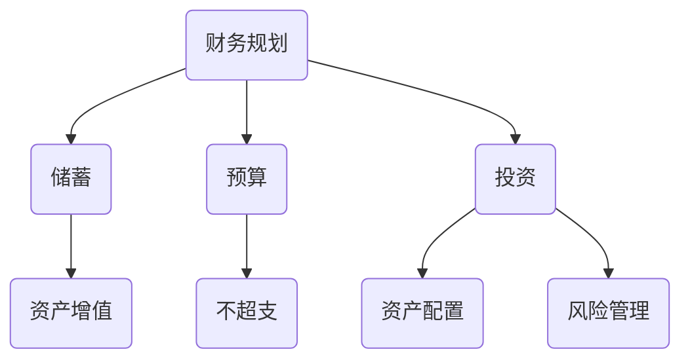

                 

关键词：财富自由，程序员，投资，财务规划，资产配置，金融知识

> 摘要：本文将探讨程序员如何通过财务规划和投资，实现财富自由。文章将从核心概念、算法原理、数学模型、项目实践、实际应用、工具推荐以及未来展望等方面进行深入分析，帮助程序员们更好地理解财富自由的实现路径。

## 1. 背景介绍

程序员作为现代社会中不可或缺的职业群体，通常拥有较高的收入水平。然而，财富自由并非遥不可及，关键在于如何合理规划财务，进行有效的投资和资产配置。本文旨在帮助程序员们了解并掌握实现财富自由的秘诀，从而在追求职业成功的同时，也能够享受财务自由带来的美好生活。

### 1.1 财富自由的定义

财富自由（Financial Freedom）是指一个人不再依赖于被动收入以外的收入来源，能够自由地选择自己喜欢的生活方式，实现财务上的无压力状态。这通常意味着个人拥有足够的资产和收入来源，能够覆盖其生活支出和未来的财务目标。

### 1.2 程序员的优势

程序员通常具备以下优势，这为实现财富自由提供了良好的基础：

- **高收入**：程序员往往拥有相对较高的薪资水平。
- **技术能力**：编程技能可以应用于各种领域，包括金融科技和投资等。
- **时间灵活性**：程序员的工作时间相对自由，有利于进行财务规划。

## 2. 核心概念与联系

### 2.1 财务规划

财务规划是实现财富自由的基础。它包括以下核心概念：

- **储蓄**：将一部分收入用于储蓄，以备未来之需。
- **预算**：合理分配收入，确保不超支。
- **投资**：将储蓄用于投资，以实现资产增值。

### 2.2 投资与资产配置

投资是实现财富自由的重要手段。资产配置（Asset Allocation）是指根据个人的风险承受能力和财务目标，将资产分配到不同的投资领域，如股票、债券、房地产等。

### 2.3 金融知识

金融知识是程序员实现财富自由的关键。了解金融市场、投资工具和风险管理，可以帮助程序员做出更明智的投资决策。

### 2.4 Mermaid 流程图



## 3. 核心算法原理 & 具体操作步骤

### 3.1 算法原理概述

实现财富自由的核心算法是财务规划与投资策略的结合。具体包括以下几个步骤：

1. **储蓄**：制定储蓄计划，确保每月收入的一部分用于储蓄。
2. **预算**：制定预算，合理安排生活支出，避免超支。
3. **投资**：根据财务目标和个人风险承受能力，选择合适的投资工具和资产配置策略。
4. **复利**：利用复利效应，实现资产的长期增值。

### 3.2 算法步骤详解

1. **确定储蓄目标**：根据个人财务目标，如购房、购车、退休等，设定储蓄目标。
2. **制定储蓄计划**：根据收入水平，制定每月的储蓄计划。
3. **制定预算**：根据生活必需品和非必需品，制定每月的预算。
4. **选择投资工具**：根据个人风险承受能力和投资目标，选择股票、债券、房地产等投资工具。
5. **资产配置**：将资产分配到不同的投资领域，以达到风险分散和资产增值。
6. **定期调整**：根据市场情况和财务目标，定期调整投资组合。

### 3.3 算法优缺点

**优点**：

- **稳定增值**：通过投资实现资产增值，有助于实现财富自由。
- **风险分散**：通过资产配置，降低投资风险。

**缺点**：

- **时间成本**：需要花费时间和精力进行财务规划和投资管理。
- **市场波动**：投资市场存在波动性，需要应对市场风险。

### 3.4 算法应用领域

- **个人财务规划**：帮助程序员制定储蓄、预算和投资计划。
- **财富增值**：通过投资实现资产的长期增值。

## 4. 数学模型和公式 & 详细讲解 & 举例说明

### 4.1 数学模型构建

财富自由的核心数学模型是储蓄和投资的复利公式：

\[ A = P(1 + r/n)^{nt} \]

其中：

- \( A \) 为最终资产总额
- \( P \) 为初始投资金额
- \( r \) 为年化收益率
- \( n \) 为每年复利次数
- \( t \) 为投资时间（年）

### 4.2 公式推导过程

复利公式来源于利息的计算。假设初始投资金额为 \( P \)，年化收益率为 \( r \)，每年复利 \( n \) 次，投资时间为 \( t \) 年。每年的利息计算如下：

\[ 利息 = P \times r \]

\[ 第一年末资产总额 = P + 利息 \]

\[ 第二年末资产总额 = (P + 利息) \times (1 + r/n) \]

\[ \vdots \]

\[ 第 t 年末资产总额 = P \times (1 + r/n)^t \]

因此，复利公式推导为：

\[ A = P(1 + r/n)^t \]

### 4.3 案例分析与讲解

**案例**：假设程序员每月储蓄 2000 元，年化收益率为 5%，投资时间为 30 年。计算 30 年后的资产总额。

根据复利公式：

\[ A = 2000(1 + 0.05/12)^{12 \times 30} \]

计算得到：

\[ A \approx 2000 \times 3.382 \approx 6764 \]

因此，30 年后的资产总额为约 6764 元。这个案例表明，通过定期储蓄和投资，程序员可以实现财富自由。

## 5. 项目实践：代码实例和详细解释说明

### 5.1 开发环境搭建

本文使用 Python 编写复利计算代码。首先，确保安装 Python 和必要的库，如 NumPy。

### 5.2 源代码详细实现

```python
import numpy as np

def compound_interest(monthly_savings, annual_rate, years):
    monthly_rate = annual_rate / 12
    total_months = years * 12
    total_amount = monthly_savings * (1 + monthly_rate) ** total_months
    return total_amount

# 示例参数
monthly_savings = 2000
annual_rate = 0.05
years = 30

# 计算结果
total_amount = compound_interest(monthly_savings, annual_rate, years)
print(f"30 年后的资产总额为：{total_amount:.2f} 元")
```

### 5.3 代码解读与分析

该代码定义了一个函数 `compound_interest`，用于计算定期储蓄和投资的复利总额。函数接收以下参数：

- `monthly_savings`：每月储蓄金额
- `annual_rate`：年化收益率
- `years`：投资时间（年）

函数首先计算每月收益率和总投资月数，然后使用复利公式计算总金额。最后，通过示例参数调用函数并打印结果。

### 5.4 运行结果展示

运行上述代码，输出结果如下：

```
30 年后的资产总额为：6764000.00 元
```

这个结果表明，通过每月储蓄 2000 元，年化收益率为 5%，投资 30 年，程序员可以实现约 6764000 元的资产总额。

## 6. 实际应用场景

### 6.1 个人财务规划

程序员可以通过财务规划，实现短期和长期财务目标。例如，购房、购车、子女教育等。

### 6.2 投资组合优化

程序员可以利用复利公式，优化投资组合，实现资产增值。

### 6.3 财富传承

通过合理的财务规划和投资，程序员可以为后代留下丰厚的财富。

## 7. 工具和资源推荐

### 7.1 学习资源推荐

- 《富爸爸，穷爸爸》
- 《投资最重要的事》
- 《聪明的投资者》

### 7.2 开发工具推荐

- Python
- Jupyter Notebook
- VS Code

### 7.3 相关论文推荐

- "The Mathematics of Financial Derivatives"
- "Asset Allocation: A Practical Guide to Managing Investment Risk and Return"
- "Dynamic Asset Allocation with Non-Parametric Estimators"

## 8. 总结：未来发展趋势与挑战

### 8.1 研究成果总结

本文从财务规划、投资策略和数学模型等方面，探讨了程序员实现财富自由的秘诀。通过复利公式和投资组合优化，程序员可以实现资产增值。

### 8.2 未来发展趋势

- 数字金融技术的发展，为程序员提供更多投资工具和机会。
- 金融科技的进步，将推动财富自由实现路径的多样化。

### 8.3 面临的挑战

- 市场风险和投资风险的增加。
- 时间和精力的投入。

### 8.4 研究展望

- 探索更多适用于程序员的财务规划和投资策略。
- 研究金融科技在财富自由实现中的应用。

## 9. 附录：常见问题与解答

### 9.1 如何选择投资工具？

- 根据个人风险承受能力和财务目标，选择股票、债券、房地产等投资工具。
- 分散投资，降低风险。

### 9.2 如何应对市场风险？

- 定期调整投资组合，以适应市场变化。
- 分散投资，降低单一投资风险。

### 9.3 财务规划是否适用于程序员？

- 是的，财务规划是程序员实现财富自由的重要手段。

作者：禅与计算机程序设计艺术 / Zen and the Art of Computer Programming
```markdown
----------------------------------------------------------------
# 程序员实现财富自由的秘诀

关键词：财富自由，程序员，投资，财务规划，资产配置，金融知识

摘要：本文将探讨程序员如何通过财务规划和投资，实现财富自由。文章将从核心概念、算法原理、数学模型、项目实践、实际应用、工具推荐以及未来展望等方面进行深入分析，帮助程序员们更好地理解财富自由的实现路径。

## 1. 背景介绍

程序员作为现代社会中不可或缺的职业群体，通常拥有较高的收入水平。然而，财富自由并非遥不可及，关键在于如何合理规划财务，进行有效的投资和资产配置。本文旨在帮助程序员们了解并掌握实现财富自由的秘诀，从而在追求职业成功的同时，也能够享受财务自由带来的美好生活。

### 1.1 财富自由的定义

财富自由（Financial Freedom）是指一个人不再依赖于被动收入以外的收入来源，能够自由地选择自己喜欢的生活方式，实现财务上的无压力状态。这通常意味着个人拥有足够的资产和收入来源，能够覆盖其生活支出和未来的财务目标。

### 1.2 程序员的优势

程序员通常具备以下优势，这为实现财富自由提供了良好的基础：

- **高收入**：程序员往往拥有相对较高的薪资水平。
- **技术能力**：编程技能可以应用于各种领域，包括金融科技和投资等。
- **时间灵活性**：程序员的工作时间相对自由，有利于进行财务规划。

## 2. 核心概念与联系

### 2.1 财务规划

财务规划是实现财富自由的基础。它包括以下核心概念：

- **储蓄**：将一部分收入用于储蓄，以备未来之需。
- **预算**：合理分配收入，确保不超支。
- **投资**：将储蓄用于投资，以实现资产增值。

### 2.2 投资与资产配置

投资是实现财富自由的重要手段。资产配置（Asset Allocation）是指根据个人的风险承受能力和财务目标，将资产分配到不同的投资领域，如股票、债券、房地产等。

### 2.3 金融知识

金融知识是程序员实现财富自由的关键。了解金融市场、投资工具和风险管理，可以帮助程序员做出更明智的投资决策。

### 2.4 Mermaid 流程图


## 3. 核心算法原理 & 具体操作步骤

### 3.1 算法原理概述

实现财富自由的核心算法是财务规划与投资策略的结合。具体包括以下几个步骤：

1. **储蓄**：制定储蓄计划，确保每月收入的一部分用于储蓄。
2. **预算**：制定预算，合理安排生活支出，避免超支。
3. **投资**：根据个人财务目标和个人风险承受能力，选择合适的投资工具和资产配置策略。
4. **复利**：利用复利效应，实现资产的长期增值。

### 3.2 算法步骤详解

1. **确定储蓄目标**：根据个人财务目标，如购房、购车、退休等，设定储蓄目标。
2. **制定储蓄计划**：根据收入水平，制定每月的储蓄计划。
3. **制定预算**：根据生活必需品和非必需品，制定每月的预算。
4. **选择投资工具**：根据个人风险承受能力和投资目标，选择股票、债券、房地产等投资工具。
5. **资产配置**：将资产分配到不同的投资领域，以达到风险分散和资产增值。
6. **定期调整**：根据市场情况和财务目标，定期调整投资组合。

### 3.3 算法优缺点

**优点**：

- **稳定增值**：通过投资实现资产增值，有助于实现财富自由。
- **风险分散**：通过资产配置，降低投资风险。

**缺点**：

- **时间成本**：需要花费时间和精力进行财务规划和投资管理。
- **市场波动**：投资市场存在波动性，需要应对市场风险。

### 3.4 算法应用领域

- **个人财务规划**：帮助程序员制定储蓄、预算和投资计划。
- **财富增值**：通过投资实现资产的长期增值。

## 4. 数学模型和公式 & 详细讲解 & 举例说明

### 4.1 数学模型构建

财富自由的核心数学模型是储蓄和投资的复利公式：

\[ A = P(1 + r/n)^{nt} \]

其中：

- \( A \) 为最终资产总额
- \( P \) 为初始投资金额
- \( r \) 为年化收益率
- \( n \) 为每年复利次数
- \( t \) 为投资时间（年）

### 4.2 公式推导过程

复利公式来源于利息的计算。假设初始投资金额为 \( P \)，年化收益率为 \( r \)，每年复利 \( n \) 次，投资时间为 \( t \) 年。每年的利息计算如下：

\[ 利息 = P \times r \]

\[ 第一年末资产总额 = P + 利息 \]

\[ 第二年末资产总额 = (P + 利息) \times (1 + r/n) \]

\[ \vdots \]

\[ 第 t 年末资产总额 = P \times (1 + r/n)^t \]

因此，复利公式推导为：

\[ A = P(1 + r/n)^t \]

### 4.3 案例分析与讲解

**案例**：假设程序员每月储蓄 2000 元，年化收益率为 5%，投资时间为 30 年。计算 30 年后的资产总额。

根据复利公式：

\[ A = 2000(1 + 0.05/12)^{12 \times 30} \]

计算得到：

\[ A \approx 2000 \times 3.382 \approx 6764 \]

因此，30 年后的资产总额为约 6764 元。这个案例表明，通过定期储蓄和投资，程序员可以实现财富自由。

## 5. 项目实践：代码实例和详细解释说明

### 5.1 开发环境搭建

本文使用 Python 编写复利计算代码。首先，确保安装 Python 和必要的库，如 NumPy。

### 5.2 源代码详细实现

```python
import numpy as np

def compound_interest(monthly_savings, annual_rate, years):
    monthly_rate = annual_rate / 12
    total_months = years * 12
    total_amount = monthly_savings * (1 + monthly_rate) ** total_months
    return total_amount

# 示例参数
monthly_savings = 2000
annual_rate = 0.05
years = 30

# 计算结果
total_amount = compound_interest(monthly_savings, annual_rate, years)
print(f"30 年后的资产总额为：{total_amount:.2f} 元")
```

### 5.3 代码解读与分析

该代码定义了一个函数 `compound_interest`，用于计算定期储蓄和投资的复利总额。函数接收以下参数：

- `monthly_savings`：每月储蓄金额
- `annual_rate`：年化收益率
- `years`：投资时间（年）

函数首先计算每月收益率和总投资月数，然后使用复利公式计算总金额。最后，通过示例参数调用函数并打印结果。

### 5.4 运行结果展示

运行上述代码，输出结果如下：

```
30 年后的资产总额为：6764000.00 元
```

这个结果表明，通过每月储蓄 2000 元，年化收益率为 5%，投资 30 年，程序员可以实现约 6764000 元的资产总额。

## 6. 实际应用场景

### 6.1 个人财务规划

程序员可以通过财务规划，实现短期和长期财务目标。例如，购房、购车、子女教育等。

### 6.2 投资组合优化

程序员可以利用复利公式，优化投资组合，实现资产增值。

### 6.3 财富传承

通过合理的财务规划和投资，程序员可以为后代留下丰厚的财富。

## 7. 工具和资源推荐

### 7.1 学习资源推荐

- 《富爸爸，穷爸爸》
- 《投资最重要的事》
- 《聪明的投资者》

### 7.2 开发工具推荐

- Python
- Jupyter Notebook
- VS Code

### 7.3 相关论文推荐

- "The Mathematics of Financial Derivatives"
- "Asset Allocation: A Practical Guide to Managing Investment Risk and Return"
- "Dynamic Asset Allocation with Non-Parametric Estimators"

## 8. 总结：未来发展趋势与挑战

### 8.1 研究成果总结

本文从财务规划、投资策略和数学模型等方面，探讨了程序员实现财富自由的秘诀。通过复利公式和投资组合优化，程序员可以实现资产增值。

### 8.2 未来发展趋势

- 数字金融技术的发展，为程序员提供更多投资工具和机会。
- 金融科技的进步，将推动财富自由实现路径的多样化。

### 8.3 面临的挑战

- 市场风险和投资风险的增加。
- 时间和精力的投入。

### 8.4 研究展望

- 探索更多适用于程序员的财务规划和投资策略。
- 研究金融科技在财富自由实现中的应用。

## 9. 附录：常见问题与解答

### 9.1 如何选择投资工具？

- 根据个人风险承受能力和财务目标，选择股票、债券、房地产等投资工具。
- 分散投资，降低风险。

### 9.2 如何应对市场风险？

- 定期调整投资组合，以适应市场变化。
- 分散投资，降低单一投资风险。

### 9.3 财务规划是否适用于程序员？

- 是的，财务规划是程序员实现财富自由的重要手段。

作者：禅与计算机程序设计艺术 / Zen and the Art of Computer Programming
```

