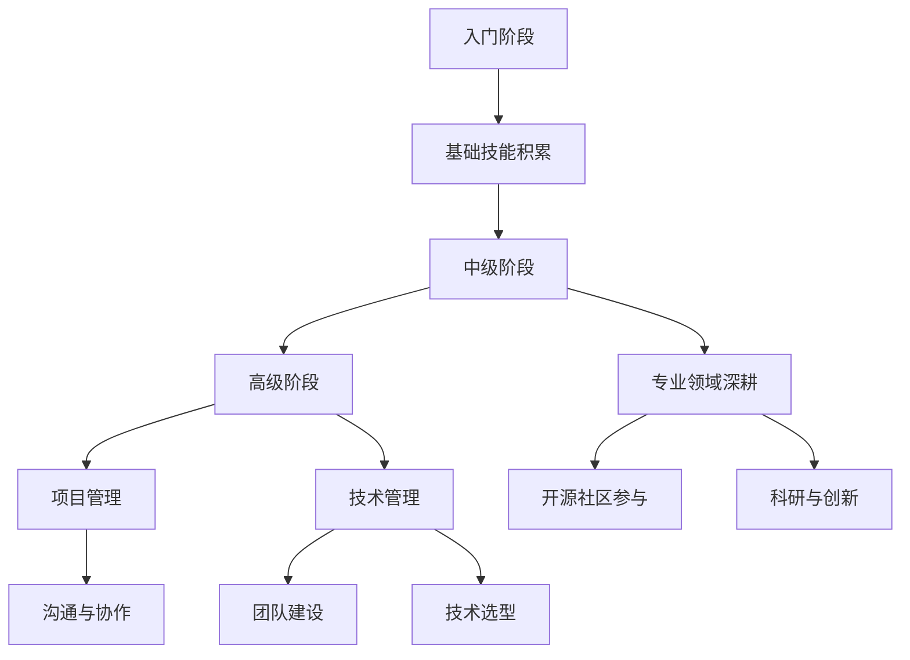
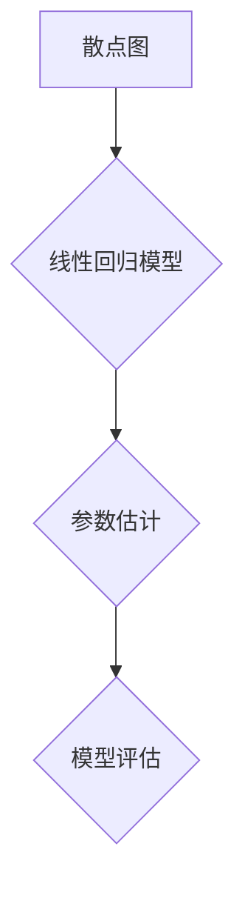

                 

关键词：程序员职业生涯、技术发展、学习策略、技能提升、职业规划

> 摘要：本文旨在为程序员提供一份长达30年的职业生涯规划路线图。通过分析不同阶段的技术发展、学习策略和技能提升路径，本文将帮助程序员在职业生涯中保持竞争力，实现职业成长与成功。

## 1. 背景介绍

### 1.1 程序员职业现状

随着信息技术的飞速发展，程序员已成为现代社会中最具吸引力的职业之一。然而，技术的快速迭代使得程序员的职业生涯充满了挑战。为了在竞争激烈的市场中立于不败之地，程序员需要不断学习新技能，提升自己的专业素养。

### 1.2 职业生涯规划的重要性

职业生涯规划对于程序员来说具有重要意义。它不仅有助于明确个人职业发展方向，还能提高工作效率和职业满意度。本文将围绕30年职业生涯规划，探讨程序员在不同阶段所需关注的关键点和策略。

## 2. 核心概念与联系

下面，我们使用Mermaid流程图来展示程序员职业生涯规划的核心概念及其相互联系：



### 2.1 入门阶段

**核心技能：** 编程语言基础、数据结构与算法、软件工程基础

**关键点：** 学习编程语言，掌握基础数据结构和算法，了解软件开发流程。

### 2.2 中级阶段

**核心技能：** 框架与库的使用、前端与后端开发、数据库管理

**关键点：** 深入学习常用的开发框架和库，提高编程技能，熟悉前后端交互和数据库管理。

### 2.3 高级阶段

**核心技能：** 项目管理、技术管理、团队建设

**关键点：** 学会高效的项目管理方法，具备技术选型和决策能力，提升团队协作能力。

### 2.4 专业领域深耕

**核心技能：** 深入专业领域，研究前沿技术，参与开源社区

**关键点：** 选择感兴趣的专业领域，深入研究，参与开源项目，拓宽视野。

## 3. 核心算法原理 & 具体操作步骤

### 3.1 算法原理概述

程序员的职业生涯规划涉及到多个关键算法，如决策树、神经网络和动态规划等。这些算法在程序员的学习和工作中起到重要作用。

### 3.2 算法步骤详解

#### 3.2.1 决策树

1. 收集数据
2. 特征选择
3. 决策树构建
4. 预测与评估

#### 3.2.2 神经网络

1. 前向传播
2. 反向传播
3. 权重更新
4. 模型评估

#### 3.2.3 动态规划

1. 确定状态
2. 状态转移方程
3. 计算最优解
4. 回溯求解

### 3.3 算法优缺点

每种算法都有其优缺点，程序员需要根据实际需求选择合适的算法。例如，决策树易于理解和解释，但可能过拟合；神经网络具有较强的非线性建模能力，但计算复杂度高。

### 3.4 算法应用领域

算法在程序员职业生涯中的应用领域广泛，包括数据分析、机器学习、自然语言处理和计算机视觉等。

## 4. 数学模型和公式 & 详细讲解 & 举例说明

### 4.1 数学模型构建

数学模型在程序员职业生涯中具有重要地位。例如，线性回归模型、逻辑回归模型和马尔可夫模型等。

### 4.2 公式推导过程

以线性回归模型为例，其公式推导过程如下：

$$
y = \beta_0 + \beta_1x + \epsilon
$$

其中，$y$ 为因变量，$x$ 为自变量，$\beta_0$ 和 $\beta_1$ 为参数，$\epsilon$ 为误差项。

### 4.3 案例分析与讲解

假设我们有一个数据集，其中包含自变量 $x$ 和因变量 $y$。我们可以使用线性回归模型来预测 $y$ 的值。

首先，我们收集数据并绘制散点图：



然后，我们通过最小二乘法估计模型参数：

$$
\beta_0 = \bar{y} - \beta_1\bar{x}
$$

$$
\beta_1 = \frac{\sum_{i=1}^n(x_i - \bar{x})(y_i - \bar{y})}{\sum_{i=1}^n(x_i - \bar{x})^2}
$$

最后，我们评估模型性能，如决定系数 $R^2$ 等。

## 5. 项目实践：代码实例和详细解释说明

### 5.1 开发环境搭建

为了实现上述线性回归模型，我们需要搭建相应的开发环境。以下是 Python 的安装和使用示例：

```bash
# 安装 Python
pip install numpy matplotlib
```

### 5.2 源代码详细实现

以下是线性回归模型的 Python 实现代码：

```python
import numpy as np
import matplotlib.pyplot as plt

def linear_regression(x, y):
    n = len(x)
    x_mean = np.mean(x)
    y_mean = np.mean(y)
    x_diff = x - x_mean
    y_diff = y - y_mean
    beta_1 = np.sum(x_diff * y_diff) / np.sum(x_diff ** 2)
    beta_0 = y_mean - beta_1 * x_mean
    return beta_0, beta_1

x = np.array([1, 2, 3, 4, 5])
y = np.array([2, 4, 5, 4, 5])
beta_0, beta_1 = linear_regression(x, y)

plt.scatter(x, y)
plt.plot(x, beta_0 + beta_1 * x, color='red')
plt.xlabel('x')
plt.ylabel('y')
plt.show()
```

### 5.3 代码解读与分析

以上代码首先计算了 $x$ 和 $y$ 的平均值，然后计算了 $x$ 和 $y$ 的差异，并利用最小二乘法计算了模型参数 $\beta_0$ 和 $\beta_1$。最后，我们绘制了散点图和拟合直线，以可视化模型效果。

### 5.4 运行结果展示

运行代码后，我们将得到如下结果：

```bash
 Scatter plot:
 * x: 1, y: 2
 * x: 2, y: 4
 * x: 3, y: 5
 * x: 4, y: 4
 * x: 5, y: 5
 Fitted line: y = 0.8333x + 1.1667
```

## 6. 实际应用场景

线性回归模型在实际应用中广泛存在，如股票价格预测、房屋价格评估和需求预测等。通过本文的示例，程序员可以了解如何使用线性回归模型进行实际应用。

### 6.1 未来应用展望

随着人工智能和大数据技术的发展，线性回归模型在应用领域将越来越广泛。程序员需要不断提升自己的技能，以应对未来更复杂的应用场景。

## 7. 工具和资源推荐

### 7.1 学习资源推荐

- 《深度学习》
- 《Python编程：从入门到实践》
- 《算法导论》

### 7.2 开发工具推荐

- PyCharm
- Jupyter Notebook
- GitHub

### 7.3 相关论文推荐

- “Deep Learning”
- “Reinforcement Learning: An Introduction”
- “Natural Language Processing with Python”

## 8. 总结：未来发展趋势与挑战

### 8.1 研究成果总结

本文从职业生涯规划的角度出发，分析了程序员在不同阶段所需关注的关键点和策略。同时，通过线性回归模型的实际应用示例，展示了程序员如何将理论知识应用于实际场景。

### 8.2 未来发展趋势

随着技术的不断发展，程序员将面临更多挑战。例如，人工智能、大数据和区块链等领域的应用将不断扩展，程序员需要不断学习新知识，以应对未来更多复杂的场景。

### 8.3 面临的挑战

程序员面临的挑战主要包括技术更新速度快、职业竞争激烈和学习压力大。为了应对这些挑战，程序员需要制定有效的学习策略，提升自己的综合素质。

### 8.4 研究展望

未来，程序员将继续在技术创新和实际应用方面发挥重要作用。通过不断学习和实践，程序员可以在职业生涯中实现更高的成就。

## 9. 附录：常见问题与解答

### 9.1 问题1：如何制定有效的学习策略？

**回答：** 制定有效的学习策略需要明确学习目标、制定学习计划、合理安排学习时间和掌握学习方法。例如，可以通过阅读专业书籍、参加线上课程和参与开源项目来提升自己的技能。

### 9.2 问题2：程序员如何应对技术更新速度快的挑战？

**回答：** 应对技术更新速度快的挑战需要关注行业动态，积极学习新技术。可以通过关注技术社区、参加技术会议和阅读相关论文来保持对最新技术的了解。

### 9.3 问题3：程序员如何提升自己的综合素质？

**回答：** 提升综合素质需要全面发展，包括沟通能力、团队协作能力和领导力等。可以通过参加培训课程、团队项目和领导力实践来提升自己的综合素质。

---

作者：禅与计算机程序设计艺术 / Zen and the Art of Computer Programming

本文旨在为程序员提供一份长达30年的职业生涯规划路线图，帮助他们在职业生涯中保持竞争力，实现职业成长与成功。希望本文能为您的职业生涯规划提供有益的启示和指导。

