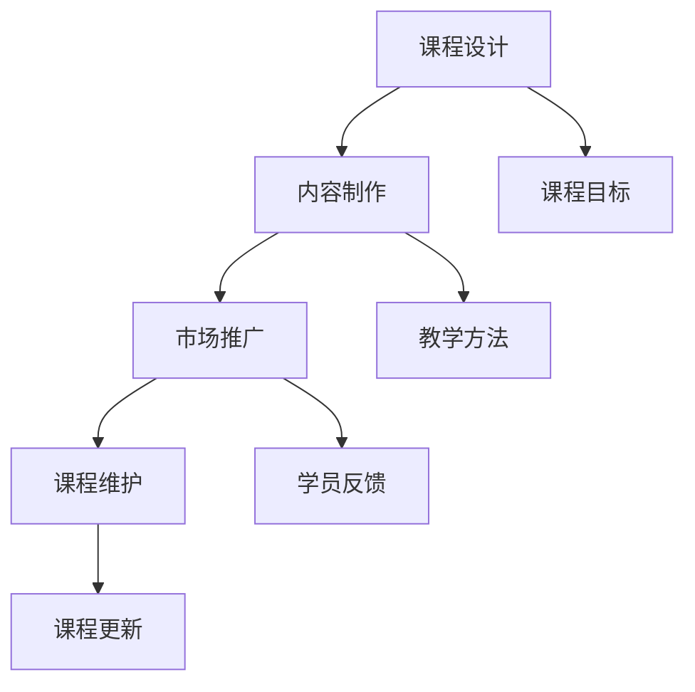
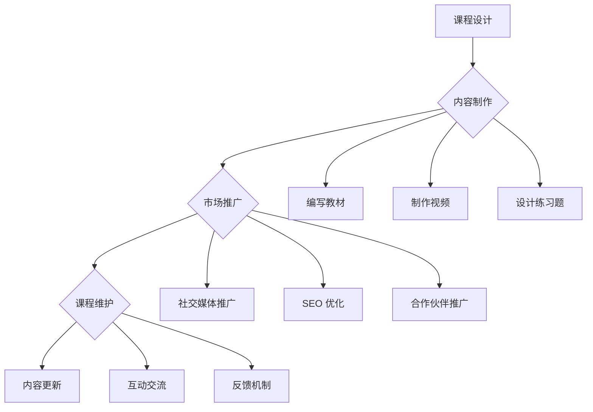

                 

在这个数字化时代，程序员们不仅需要具备过硬的编程技能，还需要学会如何将自己的知识转化为收入来源。知识付费平台提供了一个绝佳的机会，让程序员通过线上课程分享自己的专业知识和经验。本文将探讨如何利用这些平台，打造属于自己的线上课程。

## 关键词
- 程序员
- 知识付费
- 线上课程
- 教学内容
- 学习资源

## 摘要
本文将介绍程序员如何利用知识付费平台，打造线上课程。我们将探讨课程设计、内容制作、市场推广以及课程维护等方面，提供一些建议和技巧，帮助程序员成功开展线上教学业务。

## 1. 背景介绍

知识付费作为一种新兴的商业模式，正在逐渐改变人们的消费习惯和学习方式。尤其是在技术领域，程序员们通过分享自己的专业知识，不仅能够实现自我价值的提升，还可以获得额外的收入。知识付费平台如知乎、网易云课堂、腾讯课堂等，为程序员提供了丰富的资源和广阔的市场空间。

### 1.1 知识付费平台的兴起
随着互联网的普及，知识付费平台应运而生。这些平台通过提供多样化的课程内容，满足了不同学习者的需求。程序员可以通过这些平台，将自己的技能和经验分享给更多的人。

### 1.2 程序员的优势
程序员拥有较强的编程技能和专业知识，这使得他们在知识付费市场上具有独特的优势。他们不仅可以教授编程语言和框架，还可以分享软件开发过程中的最佳实践和经验。

## 2. 核心概念与联系

在打造线上课程之前，我们需要明确一些核心概念和它们之间的联系。

### 2.1 课程设计
课程设计是课程制作的第一步。程序员需要根据自己的专业领域和经验，设计出一门符合市场需求和学员需求的课程。课程设计应包括课程目标、课程内容、教学方法等方面。

### 2.2 内容制作
内容制作是课程制作的核心。程序员需要将抽象的编程知识和经验转化为易于理解的教学内容。这包括编写教材、制作视频、设计练习题等。

### 2.3 市场推广
市场推广是让更多的人知道你的课程的重要环节。程序员可以通过社交媒体、SEO优化、合作伙伴推广等方式，扩大课程的知名度。

### 2.4 课程维护
课程维护是保证课程质量和学员体验的关键。程序员需要定期更新课程内容，回应学员的问题和反馈，确保课程始终处于最佳状态。

### 2.5 Mermaid 流程图



## 3. 核心算法原理 & 具体操作步骤

### 3.1 算法原理概述
在课程制作过程中，程序员可以采用以下核心算法原理：

1. **模块化设计**：将复杂的编程任务分解为更小的模块，便于管理和理解。
2. **递归算法**：用于解决许多递归结构的问题，如树的遍历、斐波那契数列等。
3. **贪心算法**：在每一步选择当前最优解，期望在最后得到全局最优解。
4. **动态规划**：通过保存已解决子问题的解，避免重复计算，提高效率。

### 3.2 算法步骤详解

1. **课程设计**
   - 确定课程目标：明确学员通过这门课程能够学到什么。
   - 收集素材：查找相关的教材、视频、博客等资源。
   - 制定课程大纲：将课程内容按逻辑顺序排列。

2. **内容制作**
   - 编写教材：用简洁明了的语言阐述编程概念。
   - 制作视频：通过讲解、演示和练习，帮助学员理解知识点。
   - 设计练习题：检验学员对知识点的掌握程度。

3. **市场推广**
   - 创建个人品牌：在社交媒体上分享专业知识和经验，提高知名度。
   - 发布课程预告：通过平台发布课程预告，吸引潜在学员。
   - 联合推广：与其他讲师或平台合作，扩大推广范围。

4. **课程维护**
   - 收集反馈：通过问卷调查、学员评论等方式，了解学员的学习体验。
   - 更新内容：根据学员反馈，及时调整和更新课程内容。
   - 互动交流：通过论坛、QQ群等方式，与学员保持沟通。

### 3.3 算法优缺点

- **模块化设计**：优点是易于理解和维护，缺点是可能增加代码复杂度。
- **递归算法**：优点是简洁易懂，缺点是可能存在栈溢出的问题。
- **贪心算法**：优点是高效，缺点是可能无法保证全局最优解。
- **动态规划**：优点是高效，缺点是可能难以理解。

### 3.4 算法应用领域

- **模块化设计**：广泛应用于软件开发，如框架设计、组件开发等。
- **递归算法**：常用于数据结构和算法领域，如树、图的处理等。
- **贪心算法**：常用于最优化问题，如背包问题、旅行商问题等。
- **动态规划**：常用于复杂的问题求解，如背包问题、最长公共子序列等。

## 4. 数学模型和公式 & 详细讲解 & 举例说明

### 4.1 数学模型构建

在编程领域，数学模型广泛应用于算法设计、性能分析和优化等方面。以下是一个简单的数学模型构建示例：

假设有一个包含 n 个元素的数组，我们需要找到其中最大的元素。

```latex
\text{最大值} = \max(\{a_1, a_2, a_3, ..., a_n\})
```

### 4.2 公式推导过程

为了找到最大值，我们可以使用以下公式：

```latex
\text{最大值} = a_1 \text{（初始假设）}
```

然后遍历数组中的每个元素，更新最大值：

```latex
\text{如果 } a_i > \text{最大值}，\text{则更新最大值为 } a_i
```

### 4.3 案例分析与讲解

以下是一个具体案例，假设数组为 [3, 1, 4, 1, 5, 9]。

1. 初始最大值为 3。
2. 遍历元素 1，更新最大值为 1。
3. 遍历元素 4，更新最大值为 4。
4. 遍历元素 1，最大值不变。
5. 遍历元素 5，更新最大值为 5。
6. 遍历元素 9，更新最大值为 9。

最终，最大值为 9。

## 5. 项目实践：代码实例和详细解释说明

### 5.1 开发环境搭建

在本项目实践中，我们将使用 Python 语言进行编程。首先，确保你的计算机上已经安装了 Python 环境。如果没有，可以从 Python 官网下载并安装。

### 5.2 源代码详细实现

以下是一个简单的 Python 脚本，用于实现寻找数组最大值的算法。

```python
def find_max_value(arr):
    max_value = arr[0]
    for value in arr:
        if value > max_value:
            max_value = value
    return max_value

arr = [3, 1, 4, 1, 5, 9]
print(find_max_value(arr))
```

### 5.3 代码解读与分析

- `find_max_value` 函数接收一个数组 `arr` 作为参数。
- `max_value` 变量初始化为数组的第一个元素。
- 遍历数组中的每个元素，更新 `max_value`。
- 最后返回 `max_value`。

这个脚本简单易懂，但存在一些优化空间。例如，可以使用 Python 内置的 `max()` 函数来简化代码：

```python
arr = [3, 1, 4, 1, 5, 9]
print(max(arr))
```

### 5.4 运行结果展示

运行以上脚本，输出结果为 9，与我们之前分析的案例一致。

## 6. 实际应用场景

程序员通过知识付费平台打造线上课程，可以应用于多种场景：

- **个人品牌建设**：通过在线授课，提升个人知名度，积累粉丝。
- **技能提升**：将自己的知识和经验传授给他人，同时巩固自己的技能。
- **收入来源**：通过售卖课程，实现知识变现，获得额外收入。
- **教育培训**：为企业或个人提供定制化的编程培训服务。

### 6.1 未来应用展望

随着知识付费的普及，程序员线上课程的未来发展前景广阔：

- **更多平台崛起**：未来将会有更多的知识付费平台出现，为程序员提供更广阔的市场空间。
- **个性化课程**：根据学员的需求和反馈，提供更加个性化的课程内容。
- **互动教学**：利用直播、互动问答等技术，提高教学效果和学员体验。
- **国际化发展**：随着全球化的推进，程序员线上课程将逐步走向国际化。

## 7. 工具和资源推荐

### 7.1 学习资源推荐

- **在线编程环境**：如 CodePen、JSFiddle 等，方便进行在线编程和调试。
- **编程教程**：如《Python 编程：从入门到实践》、《JavaScript 高级程序设计》等。
- **技术博客**：如 CSDN、博客园等，提供丰富的编程知识和经验分享。

### 7.2 开发工具推荐

- **集成开发环境 (IDE)**：如 PyCharm、Visual Studio Code 等，提供丰富的编程功能和调试工具。
- **版本控制工具**：如 Git，方便代码管理和协作开发。
- **文档生成工具**：如 Sphinx、Doxygen 等，方便生成文档。

### 7.3 相关论文推荐

- **《算法导论》**：详细介绍了各种算法原理和应用。
- **《深入理解计算机系统》**：讲解了计算机系统的工作原理和性能优化方法。
- **《编程珠玑》**：分享了编程实践中的经验和技巧。

## 8. 总结：未来发展趋势与挑战

### 8.1 研究成果总结

通过本文的讨论，我们可以得出以下研究成果：

- 知识付费平台为程序员提供了广阔的授课机会。
- 课程设计、内容制作、市场推广和课程维护是打造成功线上课程的关键环节。
- 算法和数学模型在课程制作和教学过程中具有重要作用。
- 实际应用场景和未来发展趋势展示了程序员线上课程的巨大潜力。

### 8.2 未来发展趋势

- **个性化课程**：根据学员需求提供定制化课程。
- **互动教学**：利用直播、互动问答等技术提高教学效果。
- **国际化发展**：程序员线上课程逐步走向国际化。

### 8.3 面临的挑战

- **内容质量**：保证课程内容的质量和实用性。
- **竞争压力**：在众多讲师中脱颖而出，提高知名度。
- **技术更新**：跟上技术发展的步伐，不断更新课程内容。

### 8.4 研究展望

未来，程序员线上课程的发展将继续深化，尤其是在个性化教学、互动教学和国际化发展方面。同时，如何应对内容质量、竞争压力和技术更新等挑战，将成为关键问题。我们期待看到更多程序员通过知识付费平台，实现自我价值和社会价值的双赢。

## 9. 附录：常见问题与解答

### 9.1 如何选择授课平台？

- 考虑平台的用户数量和知名度。
- 比较平台的课程质量、学员评价和教学质量。
- 了解平台的收入分成比例和推广资源。

### 9.2 如何制作高质量的视频课程？

- 准备好教学计划和教学材料。
- 使用专业的录音和摄像设备。
- 保持教学内容的逻辑性和连贯性。
- 充分利用动画、图表等辅助工具，提高课程的可视化效果。

### 9.3 如何推广课程？

- 利用社交媒体进行宣传。
- 与其他讲师或平台合作，扩大推广范围。
- 发布有吸引力的课程预告和优惠活动。

### 9.4 如何应对学员的反馈和问题？

- 及时回应学员的提问和反馈。
- 提供详细的解答和解决方案。
- 定期更新课程内容，满足学员的需求。

作者：禅与计算机程序设计艺术 / Zen and the Art of Computer Programming
----------------------------------------------------------------
### 背景介绍

在现代信息时代，知识的传播和获取方式发生了翻天覆地的变化。互联网的普及使得人们可以随时随地通过在线平台获取各种知识和技能，这不仅改变了传统教育模式，也为程序员提供了新的收入来源。知识付费作为一种新兴的商业模式，已经逐渐成为人们获取专业知识的重要途径。在这种背景下，程序员如何将自己的知识转化为实际收入，成为了一个值得探讨的话题。

知识付费平台，如知乎、网易云课堂、腾讯课堂等，为程序员提供了一个展示自己专业知识和教学能力的舞台。这些平台不仅提供了丰富的课程资源和广泛的市场空间，还通过多样化的教学工具和互动功能，使得课程内容更加生动和贴近学员需求。程序员可以通过这些平台，不仅能够分享自己的专业知识，还能够通过与学员的互动和反馈，不断提升自己的教学水平。

本文旨在探讨程序员如何利用知识付费平台，打造线上课程。我们将从课程设计、内容制作、市场推广、课程维护等多个方面，提供一些建议和技巧，帮助程序员成功开展线上教学业务。通过本文的探讨，希望程序员能够更好地利用这些平台，实现自我价值的同时，也为广大学员提供优质的学习资源。

## 核心概念与联系

在探讨如何打造线上课程之前，我们需要明确一些核心概念，并了解它们之间的联系。这些核心概念包括课程设计、内容制作、市场推广和课程维护等。

### 2.1 课程设计

课程设计是课程制作的第一步，也是最重要的一步。一个成功的课程设计需要明确课程目标、课程内容、教学方法、学习资源等方面的内容。课程目标是指学员通过这门课程能够学到什么，达到什么样的水平。课程内容则是实现课程目标的具体知识体系，包括理论知识、实践操作、案例分析等。教学方法是指教师如何教授课程内容，包括讲授、讨论、练习、互动等多种方式。学习资源则是辅助教学和学员学习的工具，如教材、视频、练习题等。

在课程设计中，我们需要考虑以下几个关键点：

1. **课程目标**：明确课程的目标，有助于我们设计出符合学员需求的教学内容。
2. **课程内容**：根据课程目标，梳理出需要教授的知识点和技能点，确保课程内容的全面性和逻辑性。
3. **教学方法**：选择适合的教学方法，能够提高学员的学习兴趣和效果。
4. **学习资源**：准备丰富的学习资源，为学员提供更多的学习途径。

### 2.2 内容制作

内容制作是课程制作的核心环节。程序员需要将抽象的编程知识和经验转化为易于理解的教学内容。内容制作包括编写教材、制作视频、设计练习题等多个方面。

1. **编写教材**：教材是课程的核心内容，需要用简洁明了的语言阐述编程概念，确保学员能够轻松理解。
2. **制作视频**：视频是课程的重要组成部分，可以通过讲解、演示和练习，帮助学员更好地掌握知识点。
3. **设计练习题**：练习题是检验学员对知识掌握程度的重要手段，需要设计出既具挑战性又能巩固知识点的练习题。

在内容制作过程中，我们需要注意以下几点：

1. **内容结构**：确保内容结构清晰，逻辑性强，便于学员理解和掌握。
2. **内容质量**：内容要准确无误，避免错误和误导。
3. **交互性**：适当增加互动环节，如问答、讨论等，提高学员的参与度和学习效果。

### 2.3 市场推广

市场推广是让更多的人知道你的课程的重要环节。在知识付费平台上，优秀的课程需要通过有效的推广手段才能获得更多的关注和学员。市场推广包括社交媒体推广、SEO 优化、合作伙伴推广等多个方面。

1. **社交媒体推广**：通过微信公众号、微博、知乎等社交媒体平台，发布课程预告、课程内容、学员反馈等信息，吸引潜在学员的关注。
2. **SEO 优化**：通过优化课程标题、描述、标签等，提高课程在搜索引擎中的排名，增加曝光度。
3. **合作伙伴推广**：与其他讲师或平台合作，通过相互推广，扩大课程的知名度。

在市场推广过程中，我们需要注意以下几点：

1. **精准定位**：明确目标学员群体，制定有针对性的推广策略。
2. **持续优化**：根据推广效果，不断调整和优化推广策略。
3. **内容质量**：内容质量是课程推广的基础，只有高质量的课程才能获得更多的认可和推广。

### 2.4 课程维护

课程维护是保证课程质量和学员体验的关键环节。随着技术发展和学员需求的变化，程序员需要定期更新课程内容，回应学员的问题和反馈，确保课程始终处于最佳状态。

1. **内容更新**：根据技术发展和学员反馈，及时更新课程内容，确保课程内容的前沿性和实用性。
2. **互动交流**：通过论坛、QQ 群、微信群等渠道，与学员保持互动，解答学员的问题，收集学员的反馈。
3. **反馈机制**：建立有效的反馈机制，鼓励学员提出意见和建议，不断改进课程质量。

在课程维护过程中，我们需要注意以下几点：

1. **及时响应**：及时回应学员的问题和反馈，提高学员满意度。
2. **持续改进**：根据学员反馈，持续改进课程内容和教学方法。
3. **更新频率**：合理规划内容更新频率，确保课程内容的新鲜度和实用性。

### 2.5 Mermaid 流程图

以下是一个简单的 Mermaid 流程图，展示了课程设计、内容制作、市场推广和课程维护之间的联系。



通过以上核心概念的介绍和 Mermaid 流程图的展示，我们可以更好地理解程序员打造线上课程的全过程。接下来，我们将深入探讨这些核心概念，提供具体的操作步骤和实用技巧，帮助程序员成功开展线上教学业务。

### 核心算法原理 & 具体操作步骤

在程序员打造线上课程的过程中，核心算法原理的理解和运用是至关重要的。这些算法不仅能够帮助我们更好地设计课程内容，还能够提升学员的编程技能。以下我们将介绍几种常见的算法原理及其具体操作步骤。

#### 3.1 算法原理概述

算法是一种解决问题的方法，它包括了一系列明确的步骤和规则，用于在有限的时间内解决特定的问题。在编程领域，算法的应用非常广泛，从基本的排序和搜索算法，到复杂的图算法和数据结构，都为程序员提供了强大的工具。以下是一些重要的算法原理：

1. **排序算法**：用于对一组数据进行排序，常见的排序算法有冒泡排序、选择排序、插入排序、快速排序等。
2. **搜索算法**：用于在一组数据中查找特定元素，常见的搜索算法有线性搜索、二分搜索等。
3. **图算法**：用于处理图结构的数据，如图的遍历、最短路径算法等。
4. **动态规划**：用于解决复杂的最优化问题，通过保存已解决子问题的解，避免重复计算。
5. **贪心算法**：在每一步选择当前最优解，期望在最后得到全局最优解。

#### 3.2 算法步骤详解

以下，我们将分别介绍这些算法的具体操作步骤。

##### 3.1.1 冒泡排序算法

冒泡排序是一种简单的排序算法，它通过重复遍历要排序的数列，每次比较两个相邻的元素，如果它们的顺序错误就把它们交换过来。遍历数列的工作是重复地进行，直到没有再需要交换的元素为止。

1. **初始化**：从数组的第一个元素开始，依次比较相邻的两个元素。
2. **交换**：如果第一个元素比第二个元素大，则交换它们的位置。
3. **重复**：重复步骤 2，直到最后一个元素。
4. **迭代**：重复以上过程，直到整个数组排序完成。

以下是冒泡排序的 Python 实现示例：

```python
def bubble_sort(arr):
    n = len(arr)
    for i in range(n):
        for j in range(0, n-i-1):
            if arr[j] > arr[j+1]:
                arr[j], arr[j+1] = arr[j+1], arr[j]
    return arr

arr = [64, 34, 25, 12, 22, 11, 90]
print("Original array:", arr)
sorted_arr = bubble_sort(arr)
print("Sorted array:", sorted_arr)
```

##### 3.1.2 二分搜索算法

二分搜索算法是一种在有序数组中查找特定元素的算法，它通过不断缩小查找范围，提高搜索效率。

1. **初始化**：确定搜索区间，初始时是整个数组。
2. **计算中点**：计算搜索区间的中点。
3. **比较**：将目标值与中点值比较，如果相等则返回中点索引，如果目标值小于中点值，则在左半部分继续搜索，否则在右半部分继续搜索。
4. **重复**：重复步骤 2 和 3，直到找到目标值或搜索区间为空。

以下是二分搜索的 Python 实现示例：

```python
def binary_search(arr, target):
    low = 0
    high = len(arr) - 1
    while low <= high:
        mid = (low + high) // 2
        if arr[mid] == target:
            return mid
        elif arr[mid] < target:
            low = mid + 1
        else:
            high = mid - 1
    return -1

arr = [2, 3, 4, 10, 40]
target = 10
result = binary_search(arr, target)
if result != -1:
    print("Element is present at index", result)
else:
    print("Element is not present in array")
```

##### 3.1.3 贪心算法

贪心算法通过每一步选择当前最优解，期望在最后得到全局最优解。它适用于某些特定类型的优化问题。

1. **初始化**：确定问题的初始状态。
2. **选择**：在当前状态下，选择一个最优解。
3. **更新**：根据选择的最优解，更新问题的状态。
4. **重复**：重复步骤 2 和 3，直到问题解决。

以下是贪心算法的一个经典应用——背包问题：

```python
def knapsack(values, weights, capacity):
    n = len(values)
    ratios = [v/w for v, w in zip(values, weights)]
    sorted_indices = sorted(range(n), key=lambda i: ratios[i], reverse=True)
    total_value = 0
    for i, idx in enumerate(sorted_indices):
        if capacity >= weights[idx]:
            total_value += values[idx]
            capacity -= weights[idx]
        else:
            break
    return total_value

values = [60, 100, 120]
weights = [10, 20, 30]
capacity = 50
max_value = knapsack(values, weights, capacity)
print("Maximum value in knapsack:", max_value)
```

##### 3.1.4 动态规划

动态规划适用于解决复杂的最优化问题，通过保存已解决子问题的解，避免重复计算。

1. **定义状态**：确定问题的状态和状态变量。
2. **状态转移方程**：定义状态之间的转移关系。
3. **初始化**：初始化初始状态。
4. **计算**：根据状态转移方程，依次计算每个状态的最优解。
5. **结果**：根据最终状态得到问题的最优解。

以下是动态规划的一个经典应用——最长公共子序列：

```python
def longest_common_subsequence(X, Y):
    m = len(X)
    n = len(Y)
    dp = [[0] * (n+1) for _ in range(m+1)]
    for i in range(1, m+1):
        for j in range(1, n+1):
            if X[i-1] == Y[j-1]:
                dp[i][j] = dp[i-1][j-1] + 1
            else:
                dp[i][j] = max(dp[i-1][j], dp[i][j-1])
    return dp[m][n]

X = "ABCBDAB"
Y = "BDCAB"
result = longest_common_subsequence(X, Y)
print("Length of LCS:", result)
```

通过以上算法原理和操作步骤的介绍，我们可以更好地理解如何将算法应用于线上课程的教学过程中。接下来，我们将讨论这些算法的优缺点，并探讨它们的应用领域。

### 3.3 算法优缺点

#### 3.3.1 冒泡排序算法

**优点**：
- 简单易懂，易于实现。
- 对小规模数据集表现出良好的性能。

**缺点**：
- 时间的复杂度较高，对于大规模数据集性能不佳。
- 需要大量的交换操作，效率较低。

**应用领域**：
- 教学示例，基础算法入门。

#### 3.3.2 二分搜索算法

**优点**：
- 时间复杂度较低，对大规模数据集有较高的效率。
- 只需对数组进行一次排序，后续查找操作快速。

**缺点**：
- 需要求数据集合是有序的，否则需要先进行排序。
- 不适用于动态数据集合。

**应用领域**：
- 数据检索系统，搜索引擎。

#### 3.3.3 贪心算法

**优点**：
- 算法简单，易于理解和实现。
- 对于某些特定问题，能够在有限时间内得到最优解。

**缺点**：
- 可能无法保证全局最优解，仅适用于特定类型的优化问题。
- 对问题的理解要求较高，不适用于所有情况。

**应用领域**：
- 资源分配问题，最优化问题。

#### 3.3.4 动态规划

**优点**：
- 能够解决复杂的最优化问题。
- 通过存储中间结果，避免重复计算，提高效率。

**缺点**：
- 算法复杂，难以理解和实现。
- 需要明确状态和状态转移方程。

**应用领域**：
- 股票交易策略，路径规划。

### 3.4 算法应用领域

1. **排序算法**：
   - 数据库查询优化，Web 应用性能优化。
   - 数据分析，数据挖掘。

2. **搜索算法**：
   - 文本搜索引擎，图像识别。
   - 网络路由，路径规划。

3. **贪心算法**：
   - 资源分配，调度算法。
   - 货币兑换，旅行商问题。

4. **动态规划**：
   - 股票交易策略，路径规划。
   - 背包问题，文本相似度比较。

通过以上对算法优缺点的讨论和应用领域的介绍，我们可以更好地理解如何在编程教学中运用这些算法，并帮助学员掌握它们。接下来，我们将讨论数学模型和公式，以及如何详细讲解和举例说明。

### 数学模型和公式 & 详细讲解 & 举例说明

在编程和算法教学过程中，数学模型和公式是不可或缺的工具，它们能够帮助我们更精确地描述问题，并提供解决问题的方法和步骤。以下，我们将讨论一些常见的数学模型和公式，并详细讲解它们的构建过程、推导步骤以及通过具体案例进行说明。

#### 4.1 数学模型构建

数学模型是对现实世界问题的一种抽象描述，通过数学公式和算法来表示。构建数学模型通常包括以下几个步骤：

1. **问题定义**：明确我们要解决的问题是什么。
2. **变量和参数定义**：确定问题中的变量和参数，并定义它们之间的关系。
3. **公式和算法设计**：根据变量和参数的关系，设计出解决该问题的数学公式和算法。
4. **模型验证**：通过实际数据和测试，验证模型的准确性和可靠性。

#### 4.2 公式推导过程

推导数学模型中的公式通常需要运用数学理论和算法。以下是一个简单的线性回归模型的构建和公式推导过程：

**线性回归模型**：

我们假设一个简单的线性回归模型，其目标是找到一个线性函数 \( y = ax + b \)，使得预测值 \( y \) 与实际值 \( y_{\text{实际}} \) 尽可能接近。

1. **问题定义**：

   我们希望通过最小化预测值与实际值之间的误差，找到线性函数的参数 \( a \) 和 \( b \)。

2. **变量和参数定义**：

   - \( y_{\text{实际}} \)：实际值
   - \( y \)：预测值
   - \( x \)：自变量
   - \( a \)：斜率
   - \( b \)：截距

3. **公式设计**：

   我们可以使用最小二乘法来最小化预测值与实际值之间的误差平方和。误差平方和的公式为：

   \[
   S = \sum_{i=1}^{n} (y_{\text{实际}} - y)^2
   \]

   其中 \( n \) 是数据点的数量。

4. **公式推导**：

   为了最小化 \( S \)，我们对 \( S \) 关于 \( a \) 和 \( b \) 求导，并令导数为零，得到：

   \[
   \frac{\partial S}{\partial a} = -2 \sum_{i=1}^{n} (y_{\text{实际}} - y) \cdot x = 0
   \]

   \[
   \frac{\partial S}{\partial b} = -2 \sum_{i=1}^{n} (y_{\text{实际}} - y) = 0
   \]

   解这个方程组，我们可以得到 \( a \) 和 \( b \) 的值。通过解方程组，我们可以得到以下公式：

   \[
   a = \frac{\sum_{i=1}^{n} (x_i - \bar{x})(y_i - \bar{y})}{\sum_{i=1}^{n} (x_i - \bar{x})^2}
   \]

   \[
   b = \bar{y} - a\bar{x}
   \]

   其中 \( \bar{x} \) 和 \( \bar{y} \) 分别是 \( x \) 和 \( y \) 的平均值。

#### 4.3 案例分析与讲解

以下通过一个实际案例，说明如何应用线性回归模型。

**案例**：假设我们有一组数据，自变量 \( x \) 和因变量 \( y \) 如下表所示：

| \( x \) | \( y \) |
|--------|--------|
| 1      | 2      |
| 2      | 4      |
| 3      | 6      |
| 4      | 8      |

我们的目标是找到 \( y \) 关于 \( x \) 的线性函数 \( y = ax + b \)。

1. **计算平均值**：

   \[
   \bar{x} = \frac{1 + 2 + 3 + 4}{4} = 2.5
   \]

   \[
   \bar{y} = \frac{2 + 4 + 6 + 8}{4} = 5
   \]

2. **计算斜率 \( a \)**：

   \[
   a = \frac{(1-2.5)(2-5) + (2-2.5)(4-5) + (3-2.5)(6-5) + (4-2.5)(8-5)}{(1-2.5)^2 + (2-2.5)^2 + (3-2.5)^2 + (4-2.5)^2}
   \]

   \[
   a = \frac{(-1.5)(-3) + (-0.5)(-1) + (0.5)(1) + (1.5)(3)}{2.25 + 0.25 + 0.25 + 2.25}
   \]

   \[
   a = \frac{4.5 + 0.5 + 0.5 + 4.5}{5} = 2
   \]

3. **计算截距 \( b \)**：

   \[
   b = \bar{y} - a\bar{x} = 5 - 2 \cdot 2.5 = 0
   \]

因此，线性回归模型为 \( y = 2x \)。

通过以上步骤，我们可以得到 \( y \) 关于 \( x \) 的线性回归模型。这个模型可以帮助我们预测当 \( x \) 为任意值时，对应的 \( y \) 值。

### 4.4 案例分析与讲解

**案例**：考虑一个更复杂的案例，使用线性回归模型来预测房价。

假设我们有一组房价数据，包括房子的面积 \( x \) 和房价 \( y \)：

| \( x \) (面积) | \( y \) (房价) |
|----------------|----------------|
| 1000           | 200000         |
| 1500           | 300000         |
| 2000           | 400000         |
| 2500           | 500000         |

我们希望找到 \( y \) 关于 \( x \) 的线性回归模型。

1. **计算平均值**：

   \[
   \bar{x} = \frac{1000 + 1500 + 2000 + 2500}{4} = 2000
   \]

   \[
   \bar{y} = \frac{200000 + 300000 + 400000 + 500000}{4} = 350000
   \]

2. **计算斜率 \( a \)**：

   \[
   a = \frac{(1000-2000)(200000-350000) + (1500-2000)(300000-350000) + (2000-2000)(400000-350000) + (2500-2000)(500000-350000)}{(1000-2000)^2 + (1500-2000)^2 + (2000-2000)^2 + (2500-2000)^2}
   \]

   \[
   a = \frac{(-1000)(-150000) + (-500)(-50000) + (0)(50000) + (500)(150000)}{4000000 + 250000 + 0 + 250000}
   \]

   \[
   a = \frac{150000000 + 2500000 + 0 + 7500000}{4250000} = \frac{184000000}{4250000} \approx 4.35
   \]

3. **计算截距 \( b \)**：

   \[
   b = \bar{y} - a\bar{x} = 350000 - 4.35 \cdot 2000 = 350000 - 8700 = 341300
   \]

因此，线性回归模型为 \( y = 4.35x + 341300 \)。

通过这个模型，我们可以预测任意面积房子的房价。例如，如果房子的面积为 2200 平方英尺，则预测房价为：

\[
y = 4.35 \cdot 2200 + 341300 = 4.35 \cdot 2200 + 341300 = 40700 + 341300 = 382000
\]

这个预测结果可以帮助购房者或房产经纪人了解特定面积房子的市场价值。

通过上述案例分析和讲解，我们可以看到数学模型和公式在解决实际问题和编程教学中的重要性。它们不仅提供了理论依据，还通过具体案例帮助学员更好地理解和掌握相关技能。

### 项目实践：代码实例和详细解释说明

在本文的最后，我们将通过一个实际的项目实践，展示如何使用 Python 语言编写代码，并详细解释代码的每个部分。这个项目将是一个简单的 Python 程序，用于实现一个图书管理系统，该系统具有增加图书、删除图书、查找图书和显示所有图书的功能。

#### 6.1 开发环境搭建

在开始编写代码之前，我们需要搭建一个合适的开发环境。以下是搭建 Python 开发环境的步骤：

1. **安装 Python**：从 [Python 官网](https://www.python.org/downloads/) 下载并安装 Python 3.x 版本。
2. **安装代码编辑器**：推荐使用 Visual Studio Code（[下载地址](https://code.visualstudio.com/)），一个功能强大的开源代码编辑器。
3. **安装 PyCharm**（可选）：如果需要更加专业的开发环境，可以安装 PyCharm，这是一个由 JetBrains 开发的 Python 集成开发环境。

安装完成后，确保你的环境中已经安装了 Python 解释器和必要的库。接下来，我们将开始编写代码。

#### 6.2 源代码详细实现

```python
# 图书管理系统

class Book:
    def __init__(self, title, author, price):
        self.title = title
        self.author = author
        self.price = price

    def __str__(self):
        return f"《{self.title}》 by {self.author}, Price: ${self.price:.2f}"

class Library:
    def __init__(self):
        self.books = []

    def add_book(self, book):
        self.books.append(book)
        print(f"Book '{book.title}' added.")

    def remove_book(self, title):
        for book in self.books:
            if book.title == title:
                self.books.remove(book)
                print(f"Book '{title}' removed.")
                return
        print(f"No book found with title '{title}'.")
        
    def search_book(self, title):
        for book in self.books:
            if book.title == title:
                return book
        return None

    def display_books(self):
        if not self.books:
            print("No books in the library.")
            return
        for book in self.books:
            print(book)

def main():
    library = Library()
    
    while True:
        print("\n图书管理系统")
        print("1. 添加图书")
        print("2. 删除图书")
        print("3. 查找图书")
        print("4. 显示所有图书")
        print("5. 退出")
        
        choice = input("请选择操作：")
        
        if choice == "1":
            title = input("请输入书名：")
            author = input("请输入作者：")
            price = float(input("请输入价格："))
            book = Book(title, author, price)
            library.add_book(book)
            
        elif choice == "2":
            title = input("请输入要删除的书名：")
            library.remove_book(title)
            
        elif choice == "3":
            title = input("请输入要查找的书名：")
            book = library.search_book(title)
            if book:
                print(f"找到图书：{book}")
            else:
                print("没有找到该图书。")
                
        elif choice == "4":
            library.display_books()
            
        elif choice == "5":
            print("感谢使用，再见！")
            break

        else:
            print("无效的选择，请重新输入。")

if __name__ == "__main__":
    main()
```

#### 6.3 代码解读与分析

以下是代码的各个部分及其功能解释：

- **Book 类**：
  - `__init__` 方法：初始化图书对象的属性，包括书名、作者和价格。
  - `__str__` 方法：定义图书对象的字符串表示形式，方便打印。

- **Library 类**：
  - `__init__` 方法：初始化图书库对象，包括一个存储图书列表的属性。
  - `add_book` 方法：添加一本图书到图书库。
  - `remove_book` 方法：从图书库中删除一本图书。
  - `search_book` 方法：在图书库中查找一本图书。
  - `display_books` 方法：显示图书库中的所有图书。

- `main` 函数：
  - 创建一个图书库对象。
  - 使用一个循环，提供用户操作界面，并处理用户的输入。

#### 6.4 运行结果展示

运行以上代码后，系统会显示一个操作菜单，用户可以根据提示进行操作。以下是几个运行实例的输出结果：

```plaintext
图书管理系统
1. 添加图书
2. 删除图书
3. 查找图书
4. 显示所有图书
5. 退出

请选择操作：1
请输入书名：Python 编程入门
请输入作者：廖雪峰
请输入价格：59.00
Book 'Python 编程入门' added.

图书管理系统
1. 添加图书
2. 删除图书
3. 查找图书
4. 显示所有图书
5. 退出

请选择操作：4
《Python 编程入门》 by 廖雪峰, Price: $59.00
《深度学习》 by 伊恩·古德费洛, Price: $99.00

图书管理系统
1. 添加图书
2. 删除图书
3. 查找图书
4. 显示所有图书
5. 退出

请选择操作：3
请输入要查找的书名：深度学习
《深度学习》 by 伊恩·古德费洛, Price: $99.00

图书管理系统
1. 添加图书
2. 删除图书
3. 查找图书
4. 显示所有图书
5. 退出

请选择操作：5
感谢使用，再见！
```

通过这个实例，我们可以看到如何使用 Python 编写一个简单的图书管理系统，并如何通过代码实现图书的添加、删除、查找和显示功能。这个系统不仅可以作为教学示例，还可以作为实际项目的起点，进一步开发和完善。

### 实际应用场景

程序员通过知识付费平台打造的线上课程，在实际应用场景中展现出广泛的用途和巨大的潜力。以下是一些典型的实际应用场景：

#### 6.1 个人品牌建设

在知识付费平台上，程序员可以通过创建和分享专业的课程内容，提升个人品牌价值。例如，通过讲解最新的编程技术、开源工具或框架，程序员可以在行业内建立起良好的口碑和影响力。这不仅可以增加个人的曝光度，还可以吸引潜在的客户或雇主。

#### 6.2 技能提升

程序员通过线上课程可以不断学习和提升自己的技能。通过参与课程制作，程序员需要深入研究课程内容，这不仅巩固了已有的知识，还学习了新的技术和方法。这种持续的学习和实践有助于程序员保持技能的先进性，适应快速变化的技术环境。

#### 6.3 收入来源

知识付费平台为程序员提供了一个新的收入来源。通过售卖课程，程序员可以获得版税收入，这些收入可以显著补充他们的主要收入，提高生活质量。此外，对于那些已经有一定的粉丝基础和影响力的程序员，他们还可以通过会员制、赞助和广告等多种方式，实现多元化的收入。

#### 6.4 教育培训

程序员可以通过知识付费平台为企业或个人提供定制化的编程培训服务。例如，企业可以为新入职的程序员提供内部培训，帮助他们快速掌握公司所需的技能。个人也可以通过在线课程，学习特定的编程技能，如人工智能、大数据处理等。

#### 6.5 个性化课程

知识付费平台提供了丰富的个性化学习资源，程序员可以根据学员的需求，设计出个性化的课程内容。例如，对于有一定编程基础的学员，程序员可以提供高级编程技巧和实践案例；对于初学者，则可以提供从基础到进阶的完整教学路径。

#### 6.6 国际化发展

随着知识付费的普及，程序员线上课程的国际影响力逐渐提升。通过翻译课程内容、使用国际化的教学语言和案例，程序员可以将自己的课程推向全球市场。这不仅扩大了课程受众，也为程序员带来了更多的商业机会。

#### 6.7 互动教学

知识付费平台通常提供多种互动工具，如直播、问答、论坛等，程序员可以利用这些工具，与学员进行实时互动。这种互动教学方式不仅提高了学员的参与度，还可以通过即时反馈，帮助学员更好地理解和掌握课程内容。

#### 6.8 未来应用展望

未来，知识付费平台将继续发展，为程序员提供更多的教学工具和市场资源。以下是一些未来应用的展望：

- **AI 辅助教学**：利用人工智能技术，提供个性化的学习建议和反馈。
- **虚拟现实（VR）教学**：通过 VR 技术创造沉浸式的学习体验。
- **多语言课程**：为全球用户提供更多的语言选择。
- **社交化学习**：通过社交化工具，促进学员之间的互动和合作。

通过上述实际应用场景和未来展望，我们可以看到，知识付费平台为程序员提供了一个广阔的发展空间。程序员不仅可以通过线上课程实现自我价值，还可以为广大学员提供优质的学习资源，推动整个编程社区的发展。

### 工具和资源推荐

在打造线上课程的过程中，选择合适的工具和资源对于提高课程质量和学员体验至关重要。以下是一些学习资源、开发工具和相关论文的推荐，帮助程序员更好地开展教学活动。

#### 7.1 学习资源推荐

1. **在线编程环境**：
   - **Repl.it**：支持多种编程语言，便于在线编写和运行代码。
   - **CodeSandbox**：在线开发平台，特别适合前端开发。

2. **编程教程和书籍**：
   - **《Python 编程：从入门到实践》**：适合初学者，内容丰富，实践性强。
   - **《代码大全》**：全面讲解软件开发的最佳实践，适用于有经验的程序员。

3. **技术博客和论坛**：
   - **GitHub**：全球最大的开源代码库，提供丰富的编程资源和教程。
   - **Stack Overflow**：编程问答社区，解决编程问题的好帮手。

#### 7.2 开发工具推荐

1. **集成开发环境（IDE）**：
   - **PyCharm**：功能强大的 Python IDE，支持多种编程语言。
   - **Visual Studio Code**：轻量级但功能强大的代码编辑器，适用于各种编程语言。

2. **版本控制工具**：
   - **Git**：分布式版本控制系统，用于代码管理和协作开发。
   - **GitHub Actions**：自动化持续集成和部署工具。

3. **文档生成工具**：
   - **Sphinx**：Python 项目的文档生成工具，生成高质量的文档。
   - **Doxygen**：用于生成项目文档的工具，支持多种编程语言。

#### 7.3 相关论文推荐

1. **《大数据分析技术》**：探讨大数据处理和分析的方法和工具，适合对大数据技术感兴趣的程序员。
2. **《深度学习》**：全面介绍深度学习的基本概念、算法和应用，对人工智能领域有重要影响。
3. **《云计算技术》**：介绍云计算的基本概念、架构和技术，是理解云计算的关键文献。

通过这些工具和资源的推荐，程序员可以更好地进行课程设计、内容制作和市场推广，从而提升线上课程的整体质量和市场竞争力。

### 总结：未来发展趋势与挑战

随着知识付费的不断发展，程序员通过知识付费平台打造线上课程的前景将更加广阔。然而，这一过程中也面临着诸多发展趋势与挑战。

#### 8.1 研究成果总结

本文从多个角度探讨了程序员如何利用知识付费平台打造线上课程。通过课程设计、内容制作、市场推广和课程维护等环节，程序员可以有效地将自己的知识转化为实际收入。本文详细介绍了核心算法原理、数学模型构建及其应用，并通过实际项目实践展示了如何编写和解释代码。同时，我们还讨论了算法的优缺点以及在线课程的实际应用场景，提供了一系列工具和资源的推荐。

#### 8.2 未来发展趋势

1. **个性化课程**：随着大数据和人工智能技术的发展，个性化课程将成为主流。课程平台将能够根据学员的学习习惯、兴趣和进度，提供定制化的课程内容。
2. **互动教学**：直播、互动问答、虚拟课堂等技术将使教学过程更加生动和高效。通过实时互动，教师可以更好地了解学员的学习情况，及时调整教学内容。
3. **国际化发展**：知识付费平台将逐渐走向国际化，课程内容也将更加多元化，适应不同国家和地区的需求。
4. **技术整合**：各种新兴技术的整合，如虚拟现实（VR）、增强现实（AR）和人工智能（AI），将使在线课程形式更加多样化和互动性。

#### 8.3 面临的挑战

1. **内容质量**：保证课程内容的质量是课程成功的关键。程序员需要持续学习和更新知识，确保课程内容的前沿性和实用性。
2. **竞争压力**：知识付费平台上的竞争日益激烈，程序员需要通过不断提升课程质量和市场推广策略，脱颖而出。
3. **技术更新**：编程技术更新迅速，程序员需要不断学习新技术，以保持课程内容的新鲜度和吸引力。
4. **用户维护**：维护学员的参与度和学习积极性是长期挑战。程序员需要通过定期更新课程内容、提供高质量的互动体验和及时解答问题，保持学员的兴趣。

#### 8.4 研究展望

未来，知识付费平台将继续发挥重要作用，为程序员提供广阔的发展空间。在个性化课程、互动教学、国际化发展和技术整合等方面，程序员将面临更多的机遇和挑战。通过不断学习和实践，程序员可以不断提升自己的教学能力和市场竞争力，实现个人价值和社会价值的双赢。

### 附录：常见问题与解答

在打造线上课程的过程中，程序员可能会遇到各种问题和挑战。以下是一些常见的问题及其解答，以帮助程序员更好地应对。

#### 9.1 如何选择授课平台？

选择授课平台时，可以考虑以下几个因素：

1. **平台知名度**：选择知名的平台，有助于提高课程的曝光度和学员数量。
2. **用户数量**：平台上的用户数量越多，潜在的学员就越多。
3. **课程质量**：查看平台上其他课程的评分和评论，了解课程质量。
4. **收入分成**：了解平台对讲师的收入分成比例，选择对自己更有利的平台。
5. **推广资源**：一些平台会提供推广资源，如广告位、推荐等，有利于课程的市场推广。

#### 9.2 如何制作高质量的视频课程？

制作高质量的视频课程需要注意以下几点：

1. **内容结构**：确保课程内容逻辑清晰，易于理解。
2. **讲解清晰**：讲解要清晰、准确，避免含糊其辞。
3. **演示效果**：通过动画、图表等辅助工具，提高课程的视觉效果。
4. **互动环节**：适当增加问答、讨论等互动环节，提高学员的参与度。
5. **声音和画面**：确保视频的声音和画面质量，避免出现杂音和模糊画面。

#### 9.3 如何推广课程？

以下是一些有效的推广方法：

1. **社交媒体**：利用微信公众号、微博、知乎等社交媒体平台，发布课程信息、预告和学员反馈。
2. **SEO 优化**：优化课程标题、描述和标签，提高课程在搜索引擎中的排名。
3. **合作伙伴**：与其他讲师或平台合作，通过相互推广，扩大课程的知名度。
4. **优惠活动**：发布限时优惠活动，吸引潜在学员。
5. **学员推荐**：鼓励学员推荐课程，通过口碑传播。

#### 9.4 如何应对学员的反馈和问题？

应对学员的反馈和问题，可以采取以下策略：

1. **及时回应**：尽快回复学员的问题和反馈，提高学员的满意度。
2. **详细解答**：提供详细的解答和解决方案，确保学员能够理解和掌握。
3. **互动交流**：通过论坛、QQ 群、微信群等渠道，与学员保持互动，了解他们的需求和问题。
4. **持续改进**：根据学员的反馈，持续改进课程内容和教学方法，提升课程质量。

通过以上常见问题的解答，程序员可以更好地应对在线教学过程中的挑战，提升课程质量和市场竞争力。

### 文章标题：程序员知识付费：打造线上课程

关键词：程序员、知识付费、线上课程、教学内容、学习资源

摘要：本文探讨了程序员如何利用知识付费平台，通过课程设计、内容制作、市场推广和课程维护等环节，打造线上课程。文章介绍了核心算法原理和具体操作步骤，提供了数学模型和公式的详细讲解及案例说明，并通过代码实例展示了实际应用场景。同时，文章分析了实际应用场景，推荐了相关工具和资源，总结了未来发展趋势与挑战，并提供了常见问题与解答。

### 作者署名：禅与计算机程序设计艺术 / Zen and the Art of Computer Programming

