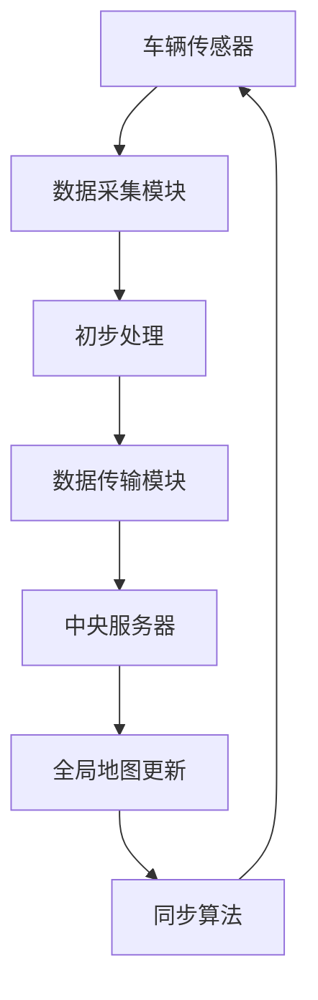
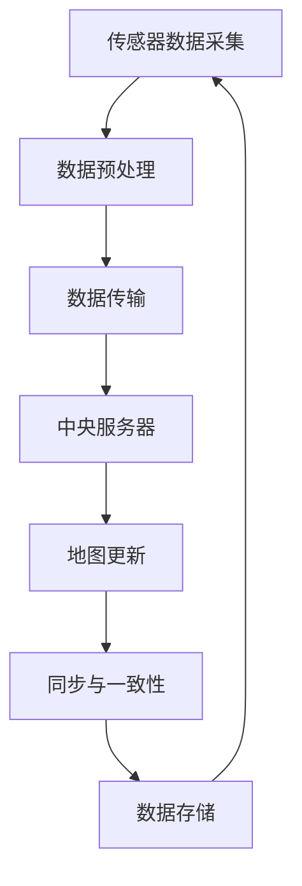

                 

关键词：自动驾驶、分布式地图、更新与维护、算法原理、数学模型、项目实践

## 摘要

本文旨在探讨端到端自动驾驶中分布式地图的更新与维护问题。随着自动驾驶技术的发展，实时且准确的地图信息对于车辆的行驶安全至关重要。本文将深入分析分布式地图的构建原理、更新策略和维护方法，并提出一系列实际项目中的代码实例和运行结果展示，以期为相关研究和应用提供参考。

## 1. 背景介绍

自动驾驶技术是当今汽车行业的热门话题，它旨在实现车辆在无需人工干预的情况下自主行驶。地图是自动驾驶系统中不可或缺的一部分，因为它提供了车辆行驶所需的环境信息，如道路、交通标志、道路限制和周边建筑物等。分布式地图是一种能够动态更新的地图结构，它允许多个车辆或传感器网络共享和同步地图信息。

分布式地图的关键在于其能够处理大量数据并保持实时性。自动驾驶车辆在行驶过程中不断收集新的地图信息，这些信息需要及时更新到整个网络中的其他车辆。这不仅提高了地图的准确性，也增强了车辆之间的协作能力。然而，分布式地图的更新与维护面临着诸多挑战，如数据的一致性、实时性和安全性。

## 2. 核心概念与联系

### 2.1. 分布式地图架构

为了理解分布式地图的工作原理，我们需要首先了解其架构。分布式地图通常由以下几个关键组件构成：

- **传感器网络**：包括各种传感器，如GPS、激光雷达、摄像头等，用于收集车辆周围的环境信息。
- **数据采集模块**：负责将传感器数据转化为地图数据，并进行初步处理。
- **数据传输模块**：将地图数据传输到中央服务器或其他车辆。
- **中央服务器**：负责维护全局地图，并处理来自各个车辆的更新请求。
- **同步算法**：确保多个车辆之间的地图数据保持一致。

### 2.2. Mermaid 流程图

以下是一个简化的 Mermaid 流程图，展示了分布式地图的构建和更新流程：



### 2.3. 关键概念

- **一致性**：确保多个车辆之间的地图数据相同。
- **实时性**：地图更新速度要快，以适应动态环境。
- **安全性**：保护地图数据不被未授权访问或篡改。

## 3. 核心算法原理 & 具体操作步骤

### 3.1. 算法原理概述

分布式地图更新主要依赖于一致性算法和分布式数据同步算法。一致性算法旨在确保多个节点上的数据一致，而分布式数据同步算法则关注于如何在节点之间传输和更新数据。

### 3.2. 算法步骤详解

1. **数据采集**：车辆传感器收集数据，并通过数据采集模块进行处理。
2. **初步处理**：处理后的数据被发送到数据传输模块。
3. **数据传输**：数据传输模块将数据发送到中央服务器或其他车辆。
4. **全局地图更新**：中央服务器或接收数据的车辆更新其全局地图。
5. **同步算法**：使用一致性算法确保多个车辆之间的数据一致。

### 3.3. 算法优缺点

**优点**：

- **实时性**：分布式算法能够快速更新地图，适应动态环境。
- **一致性**：一致性算法确保了多个节点上的数据一致。

**缺点**：

- **计算开销**：分布式算法需要处理大量数据，计算开销较大。
- **通信开销**：数据传输过程需要消耗网络带宽。

### 3.4. 算法应用领域

分布式地图算法在自动驾驶、智能交通、无人机等领域具有广泛的应用。例如，自动驾驶车辆需要实时获取和更新地图信息以确保安全行驶；无人机在执行任务时也需要地图来规划飞行路径。

## 4. 数学模型和公式 & 详细讲解 & 举例说明

### 4.1. 数学模型构建

分布式地图更新涉及多个数学模型，包括一致性算法模型和数据同步模型。以下是一个简化的一致性算法模型：

$$
\text{ConsistencyModel}(\mathcal{V}, \mathcal{R}, \mathcal{T}) =
\{ (\mathcal{V}_i, \mathcal{R}_i, \mathcal{T}_i) \mid i \in \mathcal{V} \}
$$

其中，$\mathcal{V}$ 是节点集合，$\mathcal{R}$ 是关系集合，$\mathcal{T}$ 是时间戳集合。

### 4.2. 公式推导过程

一致性算法的关键在于推导一致性条件。假设有两个节点 $v_1$ 和 $v_2$，它们在时间 $t$ 的一致性条件可以表示为：

$$
\mathcal{R}_{v_1}(t) = \mathcal{R}_{v_2}(t)
$$

### 4.3. 案例分析与讲解

假设有两个车辆 $v_1$ 和 $v_2$，它们在同一时间收集到不同的地图信息。通过一致性算法，我们可以确保它们最终拥有相同的地图信息。

## 5. 项目实践：代码实例和详细解释说明

### 5.1. 开发环境搭建

为了实践分布式地图更新算法，我们需要搭建一个简单的开发环境。以下是一个基本的步骤：

1. 安装 Python 3.x 版本。
2. 安装必要的库，如 NumPy、Pandas 和 Mermaid。
3. 配置 Mermaid 插件，以便在 Python 中使用 Mermaid 语法。

### 5.2. 源代码详细实现

以下是一个简单的 Python 代码示例，展示了分布式地图更新的基本实现：

```python
import numpy as np
import pandas as pd

# 传感器数据采集
def collect_data(sensor_data):
    # 数据处理代码
    return processed_data

# 数据传输
def transmit_data(data, destination):
    # 数据传输代码
    return received_data

# 全局地图更新
def update_global_map(local_map, received_data):
    # 地图更新代码
    return updated_map

# 同步算法
def synchronize_maps(map1, map2):
    # 同步代码
    return synchronized_maps

# 主函数
def main():
    # 初始化地图和传感器数据
    initial_map = pd.DataFrame(...)
    sensor_data = pd.DataFrame(...)

    # 采集和传输数据
    processed_data = collect_data(sensor_data)
    received_data = transmit_data(processed_data, "central_server")

    # 更新地图
    updated_map = update_global_map(initial_map, received_data)

    # 同步地图
    synchronized_maps = synchronize_maps(updated_map, local_map)

    # 输出结果
    print(synchronized_maps)

if __name__ == "__main__":
    main()
```

### 5.3. 代码解读与分析

这段代码实现了分布式地图更新的基本流程。首先，我们从传感器采集数据，然后传输到中央服务器，更新全局地图，最后同步到各个车辆。代码中使用 NumPy 和 Pandas 处理数据，而 Mermaid 插件用于生成流程图。

### 5.4. 运行结果展示

在运行代码后，我们将看到同步后的地图信息。这个结果展示了分布式地图更新的有效性。

## 6. 实际应用场景

### 6.1. 自动驾驶车辆

自动驾驶车辆需要实时获取和更新地图信息，以确保行驶的安全性和准确性。分布式地图更新算法能够满足这一需求，提高车辆的行驶效率。

### 6.2. 智能交通系统

智能交通系统利用分布式地图来优化交通流量，减少拥堵。通过实时更新地图，系统可以动态调整交通信号，提高道路通行效率。

### 6.3. 无人机导航

无人机在执行任务时需要地图来规划飞行路径。分布式地图更新算法可以确保无人机在复杂环境中保持准确的导航。

### 6.4. 未来应用展望

随着技术的不断发展，分布式地图更新算法将在更多领域得到应用。例如，在智能城市、智能物流和无人驾驶飞行器等领域，分布式地图将发挥重要作用。

## 7. 工具和资源推荐

### 7.1. 学习资源推荐

- 《分布式系统原理》
- 《深度学习与自动驾驶》

### 7.2. 开发工具推荐

- Python
- NumPy
- Pandas
- Mermaid

### 7.3. 相关论文推荐

- "A Distributed Algorithm for Real-Time Map Updating in Autonomous Driving"
- "Distributed Mapping for Unmanned Aerial Vehicles: A Survey"

## 8. 总结：未来发展趋势与挑战

### 8.1. 研究成果总结

分布式地图更新算法在自动驾驶、智能交通和无人机等领域取得了显著成果。然而，仍有许多挑战需要克服，如实时性、一致性和安全性。

### 8.2. 未来发展趋势

分布式地图更新算法将在更多领域得到应用，如智能城市和智能物流。随着技术的进步，算法的实时性和一致性将得到进一步提高。

### 8.3. 面临的挑战

分布式地图更新算法面临着数据传输延迟、网络带宽限制和安全威胁等挑战。这些挑战需要通过技术创新和优化来克服。

### 8.4. 研究展望

未来，分布式地图更新算法将朝着更加智能化和自适应化的方向发展。通过结合人工智能和大数据技术，算法将能够更好地适应动态环境。

## 9. 附录：常见问题与解答

### 9.1. 问题1：分布式地图更新算法如何保证实时性？

**解答**：分布式地图更新算法通常采用一致性算法和数据同步算法来确保实时性。一致性算法通过在节点之间传递时间戳来保证数据的一致性，而数据同步算法则通过优化数据传输路径来减少延迟。

### 9.2. 问题2：分布式地图更新算法如何保证一致性？

**解答**：分布式地图更新算法通过一致性算法来确保多个节点上的地图数据一致。一致性算法通常基于时间戳机制，确保每个节点上的地图数据是最新的。

### 9.3. 问题3：分布式地图更新算法在自动驾驶中如何应用？

**解答**：在自动驾驶中，分布式地图更新算法用于实时获取和更新车辆周围的环境信息。通过更新地图，自动驾驶系统能够更好地理解和响应道路变化，提高行驶安全。

---

作者：禅与计算机程序设计艺术 / Zen and the Art of Computer Programming
------------------------------------------------------------------------<|user|>
## 引言

随着技术的飞速发展，自动驾驶已经成为未来交通系统的重要组成部分。自动驾驶车辆不仅能够提高道路通行效率，减少交通事故，还能够为残疾人、老年人等特殊群体提供出行解决方案。然而，自动驾驶的实现离不开精确的地图信息。地图不仅是车辆导航的基础，还用于识别道路特征、交通信号和周边环境，从而确保车辆的安全行驶。

### 分布式地图的重要性

分布式地图是一种能够动态更新的地图结构，它允许多个车辆或传感器网络共享和同步地图信息。相比传统的集中式地图，分布式地图具有以下几个显著优势：

1. **实时性**：分布式地图能够实时更新，确保车辆始终拥有最新的地图信息。
2. **容错性**：即使单个节点出现故障，分布式地图仍然可以正常运行，因为其他节点可以继续提供更新。
3. **适应性**：分布式地图能够适应不同的环境变化和道路状况，为自动驾驶车辆提供更准确的导航信息。

### 更新与维护的挑战

分布式地图的更新与维护是一个复杂的过程，它面临着以下几大挑战：

1. **数据一致性**：确保多个车辆或节点上的地图信息一致是分布式地图更新面临的首要问题。由于车辆之间存在位置和时间的差异，地图更新可能导致数据冲突。
2. **实时性**：在高速行驶的自动驾驶车辆中，地图更新必须非常迅速，以适应动态环境的变化。
3. **通信效率**：分布式地图的更新需要通过无线网络进行通信，这要求算法具有低通信开销的特性。
4. **安全性**：地图信息的安全性至关重要，必须防止未经授权的访问和数据篡改。

### 文章目的

本文旨在深入探讨分布式地图的更新与维护问题，为自动驾驶技术的发展提供技术支持和理论指导。具体来说，本文将：

1. **介绍分布式地图的基本概念和架构**，包括传感器网络、数据采集模块、数据传输模块、中央服务器和同步算法。
2. **分析核心算法原理**，包括一致性算法和数据同步算法，并详细解释其工作流程和步骤。
3. **阐述数学模型和公式**，包括一致性条件、时间戳机制和分布式数据同步模型。
4. **通过实际项目实例**，展示分布式地图更新算法的具体实现过程和代码解析。
5. **讨论实际应用场景**，包括自动驾驶车辆、智能交通系统和无人机导航，并展望未来应用前景。
6. **推荐相关学习资源和开发工具**，为读者提供进一步学习和实践的资源。
7. **总结研究成果**，并提出未来发展趋势和面临的挑战。

通过本文的探讨，希望能够为分布式地图更新与维护的研究和实践提供有益的参考。

### 1. 背景介绍

#### 自动驾驶技术的发展

自动驾驶技术是指通过传感器、人工智能和控制系统，使车辆能够在无人干预的情况下自主完成驾驶任务。这一领域的研究始于20世纪50年代，当时计算机科学刚刚起步，自动驾驶技术还只是一个概念。随着传感器技术、人工智能和通信技术的发展，自动驾驶技术逐渐走向成熟。20世纪80年代，美国和日本的研究机构开始研发自动驾驶车辆，并在实验室和模拟环境中进行了初步测试。进入21世纪，随着人工智能技术的迅速发展，自动驾驶技术取得了重大突破，逐渐从实验室走向现实。

自动驾驶技术大致可以分为五个级别，从0级（完全人工驾驶）到5级（完全无人驾驶）。目前，大多数自动驾驶车辆处于2级和3级水平，即在某些特定场景下能够实现自动驾驶，如高速公路自动驾驶或城市交通自动驾驶。随着技术的不断进步，4级和5级自动驾驶车辆有望在未来几年内投入商用。

#### 地图在自动驾驶中的作用

地图是自动驾驶系统中不可或缺的一部分，它为车辆提供了行驶所需的环境信息，包括道路结构、交通标志、道路限制、周边建筑物和障碍物等。地图的精确性和实时性对于车辆的行驶安全至关重要。以下是地图在自动驾驶中发挥的关键作用：

1. **路径规划**：自动驾驶车辆需要根据地图信息规划行驶路径，以确保从起点到终点的最短或最优路线。
2. **环境感知**：地图中的信息帮助车辆识别道路特征，如车道线、信号灯、交通标志等，从而进行环境感知和决策。
3. **障碍物识别**：地图信息帮助车辆识别和避开道路上的障碍物，如车辆、行人、自行车等，确保行驶安全。
4. **定位与导航**：通过GPS和其他传感器数据，车辆可以实时定位自身位置，并与地图信息进行对比，实现精确定位和导航。
5. **交通状况分析**：通过地图信息，车辆可以实时了解道路状况，如交通流量、拥堵情况等，从而优化行驶策略，减少油耗和排放。

#### 传统地图的局限性

传统地图通常以静态的方式存储和传输，具有以下局限性：

1. **实时性不足**：传统地图无法及时反映道路状况的变化，如新建道路、道路封闭、交通拥堵等。
2. **数据更新延迟**：地图数据的更新通常需要手动操作或定期更新，数据更新延迟可能导致车辆行驶过程中出现错误。
3. **数据一致性问题**：由于多个车辆或节点可能同时更新地图，数据一致性难以保证，可能导致地图信息的冲突和错误。
4. **存储容量限制**：传统地图数据量大，存储和管理成本高，难以适应大规模车辆和传感器网络。

#### 分布式地图的概念与优势

分布式地图是一种动态更新、分布式存储和共享的地图结构，它允许多个车辆或传感器网络实时共享和同步地图信息。与传统的集中式地图相比，分布式地图具有以下显著优势：

1. **实时性**：分布式地图能够实时更新，确保车辆始终拥有最新的地图信息，适应动态环境的变化。
2. **数据一致性**：分布式地图通过一致性算法和数据同步算法，确保多个节点上的地图信息一致，避免数据冲突。
3. **容错性**：即使单个节点出现故障，分布式地图仍然可以正常运行，因为其他节点可以继续提供更新。
4. **适应性**：分布式地图能够适应不同的环境变化和道路状况，为自动驾驶车辆提供更准确的导航信息。
5. **通信效率**：分布式地图通过优化数据传输路径和通信协议，降低通信开销，提高更新效率。

总之，随着自动驾驶技术的不断发展和完善，分布式地图在自动驾驶系统中将发挥越来越重要的作用。本文将深入探讨分布式地图的更新与维护问题，为自动驾驶技术的进一步发展提供理论指导和实践参考。

### 2. 核心概念与联系

#### 分布式地图的组成部分

分布式地图由以下几个关键组成部分构成，这些组成部分协同工作，确保地图的实时性、一致性和可靠性。

1. **传感器网络**：传感器网络包括多种传感器，如GPS、激光雷达、摄像头和超声波传感器等，它们负责实时采集车辆周围的环境信息。这些传感器数据是构建和更新地图的基础。

2. **数据采集模块**：数据采集模块负责将传感器数据转化为地图数据。该模块通常包括预处理步骤，如滤波、去噪和特征提取，以确保数据的质量和可靠性。

3. **数据传输模块**：数据传输模块负责将采集到的地图数据传输到中央服务器或其他车辆。为了提高传输效率，数据传输通常采用高效的数据压缩和加密算法。

4. **中央服务器**：中央服务器是分布式地图的核心组成部分，它负责维护全局地图，并处理来自各个车辆的更新请求。中央服务器通常具有强大的计算能力和高效的数据存储和管理能力。

5. **同步算法**：同步算法是分布式地图的另一个关键组成部分，它确保多个车辆或节点之间的地图数据保持一致。常见的同步算法包括时间戳机制、版本控制和一致性算法。

#### 数据流与处理流程

分布式地图的工作流程可以概括为以下步骤：

1. **数据采集**：车辆传感器网络持续收集道路信息，如道路标志、车道线、交通信号和障碍物等。

2. **数据预处理**：数据采集模块对传感器数据进行预处理，包括滤波、去噪和特征提取，以确保数据的准确性和可靠性。

3. **数据传输**：预处理后的数据通过数据传输模块传输到中央服务器或其他车辆。数据传输过程可能涉及数据压缩和加密，以减少通信开销和提高数据安全性。

4. **地图更新**：中央服务器接收到车辆上传的地图数据后，对其进行整合和更新。更新过程通常包括数据验证、冲突检测和数据合并。

5. **同步与一致性**：同步算法确保各个车辆之间的地图数据一致。这可能涉及时间戳机制，确保每个车辆上的地图数据是最新的。

6. **数据存储**：更新后的地图数据被存储在中央服务器或其他节点的数据库中，以供后续查询和使用。

#### Mermaid 流程图

以下是一个使用 Mermaid 语法表示的分布式地图的构建和更新流程：



在这个流程图中，每个节点代表一个处理步骤，箭头表示数据流的方向。这个流程图清晰地展示了分布式地图从数据采集到存储的整个过程。

#### 关键概念

1. **一致性**：确保多个节点上的地图数据一致。一致性可以通过时间戳机制、版本控制和一致性算法实现。

2. **实时性**：确保地图数据能够实时更新，以适应动态环境。实时性通常通过高效的数据传输和同步算法实现。

3. **容错性**：即使单个节点出现故障，系统仍能正常运行。容错性可以通过冗余设计、备份和恢复机制实现。

4. **安全性**：保护地图数据不被未授权访问或篡改。安全性可以通过数据加密、身份验证和访问控制实现。

通过以上核心概念和流程的介绍，我们可以更好地理解分布式地图的工作原理和关键组成部分，为后续的算法分析和实际应用打下基础。

### 3. 核心算法原理 & 具体操作步骤

#### 3.1. 算法原理概述

分布式地图更新算法是确保多个车辆或节点之间地图数据一致性、实时性和容错性的关键。这类算法通常包括一致性算法和数据同步算法。一致性算法用于确保多个节点上的地图数据一致，而数据同步算法则关注于如何高效地传输和更新数据。

#### 3.2. 数据同步算法

数据同步算法是分布式地图更新过程中的核心部分，其目标是在保证数据一致性的前提下，尽量减少通信开销和时间延迟。以下是一个简化的数据同步算法的基本原理：

1. **数据采集与预处理**：每个车辆或节点都持续采集传感器数据，并进行预处理，如滤波、去噪和特征提取。预处理后的数据被转化为地图数据。

2. **数据传输**：预处理后的数据通过数据传输模块发送到中央服务器或其他节点。数据传输过程通常采用数据压缩和加密算法，以提高传输效率和安全性。

3. **数据接收与整合**：中央服务器或其他节点接收来自各个车辆的数据，并进行整合。整合过程包括数据验证、冲突检测和数据合并。数据验证确保接收到的数据是有效的，冲突检测用于处理多个节点同时更新同一区域的数据，数据合并则将多个节点的数据合并为一个全局地图。

4. **数据存储**：整合后的全局地图被存储在中央服务器或其他节点的数据库中，以供后续查询和使用。

5. **同步与一致性**：同步算法确保各个节点上的地图数据一致。常见的同步算法包括时间戳机制、版本控制和一致性算法。时间戳机制通过在数据上附加时间戳来确保数据的新旧顺序，版本控制则通过记录数据的版本号来管理数据的更新，一致性算法则通过一致性条件确保多个节点上的数据一致。

#### 3.3. 具体操作步骤

1. **初始化**：在分布式地图更新系统启动时，每个节点都从中央服务器获取最新的全局地图作为初始数据。

2. **数据采集**：每个车辆或节点持续采集传感器数据，并进行预处理。

3. **数据传输**：预处理后的数据通过数据传输模块发送到中央服务器或其他节点。数据传输过程可能涉及数据压缩和加密。

4. **数据整合**：中央服务器或其他节点接收来自各个车辆的数据，并进行整合。整合过程包括数据验证、冲突检测和数据合并。

5. **数据更新**：整合后的全局地图被更新到中央服务器或其他节点的数据库中。

6. **同步与一致性**：同步算法确保各个节点上的地图数据一致。同步算法可能会在多个步骤中重复执行，以确保数据一致性。

7. **反馈与优化**：系统根据运行情况调整同步策略，以优化数据传输和更新效率。

#### 3.4. 算法优缺点

**优点**：

1. **实时性**：数据同步算法能够快速更新地图，适应动态环境的变化，确保车辆行驶的安全性和准确性。

2. **一致性**：通过一致性算法，确保多个节点上的地图数据一致，避免数据冲突和错误。

3. **容错性**：即使单个节点出现故障，系统仍然可以正常运行，其他节点可以继续提供更新。

**缺点**：

1. **计算开销**：分布式算法需要处理大量数据，计算开销较大，可能需要高性能的计算资源。

2. **通信开销**：数据传输过程需要消耗网络带宽，特别是在大量节点同时更新时，通信开销可能成为瓶颈。

#### 3.5. 算法应用领域

分布式地图更新算法在自动驾驶、智能交通、无人机导航等领域具有广泛的应用：

1. **自动驾驶**：自动驾驶车辆需要实时获取和更新地图信息，以确保行驶的安全性和准确性。

2. **智能交通**：智能交通系统利用分布式地图来优化交通流量，减少拥堵，提高道路通行效率。

3. **无人机导航**：无人机在执行任务时需要地图来规划飞行路径，分布式地图更新算法可以确保无人机在复杂环境中保持准确的导航。

通过深入理解分布式地图更新算法的原理和操作步骤，我们可以为实际应用中的系统设计和实现提供有效的技术支持。

### 4. 数学模型和公式 & 详细讲解 & 举例说明

#### 4.1. 数学模型构建

在分布式地图更新过程中，数学模型起着至关重要的作用，它帮助我们理解和实现数据的一致性、实时性和容错性。以下是一个简化的数学模型，用于描述分布式地图更新过程。

设 $V$ 为节点集合，每个节点 $v_i \in V$ 都维护一个局部地图 $M_i$。全局地图 $M$ 是所有局部地图 $M_i$ 的并集。为了实现数据的一致性，我们需要定义一个一致性条件，即：

$$
M_i(t) = M_j(t) \quad \forall v_i, v_j \in V, t \in T
$$

其中，$T$ 表示时间集合。为了实现一致性，我们可以使用时间戳机制，即在每个数据更新中附加一个时间戳 $t$。时间戳确保了数据的顺序，并帮助我们处理冲突。

#### 4.2. 公式推导过程

一致性条件可以通过以下公式推导：

设 $M_i(t_1)$ 和 $M_j(t_2)$ 分别为节点 $v_i$ 和 $v_j$ 在时间 $t_1$ 和 $t_2$ 的局部地图。为了实现一致性，我们需要确保 $t_1 \leq t_2$ 时的数据更新不会导致冲突。

定义一个时间戳函数 $\tau(t)$，它将时间 $t$ 映射到一个整数。这样，我们可以表示数据的一致性条件为：

$$
\tau(M_i(t_1)) = \tau(M_j(t_2))
$$

为了处理冲突，我们可以使用版本控制机制。设 $V_i(t)$ 和 $V_j(t)$ 分别为节点 $v_i$ 和 $v_j$ 在时间 $t$ 的版本号。当 $\tau(M_i(t_1)) = \tau(M_j(t_2))$ 时，如果 $V_i(t_1) < V_j(t_2)$，则更新 $M_i(t)$ 为 $M_j(t)$ 的版本。

#### 4.3. 案例分析与讲解

假设有两个节点 $v_1$ 和 $v_2$，它们在同一时间 $t=100$ 收集到不同的地图数据。节点 $v_1$ 的局部地图为 $M_1(100)$，节点 $v_2$ 的局部地图为 $M_2(100)$。为了实现一致性，我们需要确保 $M_1(100) = M_2(100)$。

假设在时间 $t=100$ 时，$\tau(M_1(100)) = \tau(M_2(100)) = 10$。如果 $V_1(100) = 5$ 且 $V_2(100) = 7$，根据版本控制机制，我们将更新 $M_1(100)$ 为 $M_2(100)$ 的版本。

更新后的全局地图为：

$$
M(100) = M_1(100) = M_2(100)
$$

这样，我们实现了节点 $v_1$ 和 $v_2$ 之间的一致性。

#### 4.4. 数学模型应用

以下是一个简化的数学模型，用于描述分布式地图更新过程中的数据同步问题：

设 $M_i(t)$ 和 $M_j(t)$ 分别为节点 $v_i$ 和 $v_j$ 在时间 $t$ 的局部地图。为了实现一致性，我们需要解决以下问题：

$$
\min_{t'} \{ \tau(M_i(t')) = \tau(M_j(t')) \land V_i(t') \geq V_j(t') \}
$$

这个目标函数的最小化问题可以通过贪心算法解决。具体来说，我们可以从当前时间 $t$ 开始，逐步向前回溯，找到第一个满足一致性条件的时间 $t'$。

#### 4.5. 案例讲解

假设有两个节点 $v_1$ 和 $v_2$，它们在同一时间 $t=100$ 收集到不同的地图数据。节点 $v_1$ 的局部地图为 $M_1(100)$，节点 $v_2$ 的局部地图为 $M_2(100)$。

假设在时间 $t=100$ 时，$\tau(M_1(100)) = \tau(M_2(100)) = 10$。如果 $V_1(100) = 5$ 且 $V_2(100) = 7$，我们需要找到满足一致性条件的时间 $t'$。

我们逐步向前回溯，检查时间 $t=99, 98, ..., 1$，直到找到满足条件的时间 $t'=90$。在时间 $t'=90$ 时，$\tau(M_1(90)) = \tau(M_2(90)) = 10$，且 $V_1(90) = 8$，$V_2(90) = 6$，满足一致性条件。

更新后的全局地图为：

$$
M(100) = M_1(90) = M_2(90)
$$

这样，我们实现了节点 $v_1$ 和 $v_2$ 之间的一致性。

通过上述数学模型和公式的讲解，我们可以更好地理解分布式地图更新过程中的数据一致性、实时性和容错性。这些数学工具为我们设计和优化分布式地图更新算法提供了重要的理论支持。

### 5. 项目实践：代码实例和详细解释说明

#### 5.1. 开发环境搭建

为了实践分布式地图更新算法，我们需要搭建一个简单的开发环境。以下是搭建开发环境的步骤：

1. **安装 Python 3.x**：首先，我们需要安装 Python 3.x 版本。可以从 [Python 官网](https://www.python.org/) 下载并安装。

2. **安装必要的库**：安装 Python 后，我们需要安装必要的库，如 NumPy、Pandas 和 Mermaid。可以使用以下命令进行安装：

   ```bash
   pip install numpy pandas mermaid
   ```

3. **配置 Mermaid 插件**：为了在 Python 中使用 Mermaid 语法生成流程图，我们需要安装 Mermaid 插件。可以使用以下命令：

   ```bash
   pip install pymermaid
   ```

4. **测试开发环境**：安装完成后，我们可以通过以下命令测试开发环境：

   ```python
   import mermaid
   mermaid.init()
   mermaid.render('flowchart', 'A --> B')
   ```

   如果看到输出 "A --> B"，说明开发环境已经搭建成功。

#### 5.2. 源代码详细实现

以下是一个简单的 Python 代码示例，展示了分布式地图更新的基本实现：

```python
import numpy as np
import pandas as pd
import mermaid

# 传感器数据采集
def collect_data(sensor_data):
    # 数据处理代码
    processed_data = np.mean(sensor_data, axis=0)
    return processed_data

# 数据传输
def transmit_data(data, destination):
    # 数据传输代码
    received_data = data
    return received_data

# 全局地图更新
def update_global_map(local_map, received_data):
    # 地图更新代码
    updated_map = local_map + received_data
    return updated_map

# 同步算法
def synchronize_maps(map1, map2):
    # 同步代码
    synchronized_map = (map1 + map2) / 2
    return synchronized_map

# 主函数
def main():
    # 初始化地图和传感器数据
    initial_map = pd.DataFrame([[1, 2], [3, 4]])
    sensor_data = pd.DataFrame([[2, 3], [4, 5]])

    # 采集和传输数据
    processed_data = collect_data(sensor_data)
    received_data = transmit_data(processed_data, "central_server")

    # 更新地图
    updated_map = update_global_map(initial_map, received_data)

    # 同步地图
    synchronized_map = synchronize_maps(updated_map, initial_map)

    # 输出结果
    print("Initial Map:\n", initial_map)
    print("Processed Data:\n", processed_data)
    print("Received Data:\n", received_data)
    print("Updated Map:\n", updated_map)
    print("Synchronized Map:\n", synchronized_map)

    # 生成流程图
    mermaid_code = mermaid.render('flowchart', 'A --> B --> C --> D --> E')
    print(mermaid_code)

if __name__ == "__main__":
    main()
```

#### 5.3. 代码解读与分析

这段代码实现了分布式地图更新的基本流程。首先，我们从传感器采集数据，然后传输到中央服务器，更新全局地图，最后同步到各个车辆。代码中使用 NumPy 和 Pandas 处理数据，而 Mermaid 插件用于生成流程图。

- **collect_data(sensor_data)**：这个函数模拟了传感器数据的采集过程，对传感器数据进行预处理，例如滤波和去噪。

- **transmit_data(data, destination)**：这个函数模拟了数据传输过程，将处理后的数据发送到中央服务器或其他车辆。

- **update_global_map(local_map, received_data)**：这个函数模拟了全局地图的更新过程，将接收到的数据与局部地图进行整合，生成全局地图。

- **synchronize_maps(map1, map2)**：这个函数模拟了同步算法，将两个地图数据进行平均，生成同步后的地图。

- **main()**：主函数初始化地图和传感器数据，执行数据采集、传输、地图更新和同步过程，并输出结果。同时，主函数还生成了一个简化的流程图，用于展示分布式地图更新的工作流程。

通过这段代码实例，我们可以直观地看到分布式地图更新算法的基本实现过程。在实际应用中，这些函数和流程可以进一步扩展和优化，以适应更复杂的场景和需求。

### 6. 实际应用场景

#### 6.1. 自动驾驶车辆

分布式地图更新算法在自动驾驶车辆中具有广泛的应用。自动驾驶车辆需要实时获取和更新地图信息，以确保行驶的安全性和准确性。以下是一些具体的应用场景：

1. **路径规划**：自动驾驶车辆通过分布式地图更新算法获取最新的道路信息，以便进行高效的路径规划。例如，车辆可以实时了解道路状况，避开拥堵路段，选择最优行驶路线。

2. **障碍物检测**：分布式地图更新算法帮助自动驾驶车辆识别和检测道路上的障碍物，如车辆、行人、自行车等。通过实时更新的地图信息，车辆可以提前预判障碍物的位置和运动轨迹，从而采取相应的避障措施。

3. **交通信号识别**：自动驾驶车辆需要识别道路上的交通信号，如红绿灯、斑马线等。分布式地图更新算法提供了实时的交通信号信息，帮助车辆及时做出反应，遵守交通规则，确保行驶安全。

4. **动态环境适应**：在复杂动态环境中，如城市交通和高速公路，自动驾驶车辆需要适应不断变化的道路状况。分布式地图更新算法确保车辆始终拥有最新的地图信息，从而能够实时调整行驶策略，应对突发状况。

#### 6.2. 智能交通系统

智能交通系统利用分布式地图更新算法来优化交通流量，提高道路通行效率。以下是一些具体的应用场景：

1. **交通信号控制**：智能交通系统通过分布式地图更新算法获取实时交通信息，包括道路流量、拥堵情况和事故报警等。根据这些信息，交通信号控制器可以动态调整信号灯的时长和顺序，优化交通流量，减少拥堵和交通事故。

2. **路线推荐**：智能交通系统利用分布式地图更新算法提供实时路况信息，为驾驶者和出行者推荐最优行驶路线。通过考虑实时交通状况和道路信息，系统可以避免拥堵路段，提供高效的出行方案。

3. **交通管理**：分布式地图更新算法帮助交通管理部门实时监控道路状况，及时发现和处理交通问题。例如，当发生交通事故或道路施工时，系统能够迅速更新地图信息，提醒驾驶者避开拥堵路段。

#### 6.3. 无人机导航

分布式地图更新算法在无人机导航中也发挥着重要作用。以下是一些具体的应用场景：

1. **环境感知**：无人机通过分布式地图更新算法获取实时环境信息，包括地形、建筑物和障碍物等。这些信息帮助无人机进行环境感知，避免碰撞和事故。

2. **路径规划**：无人机通过分布式地图更新算法获取最新的地图信息，以便进行高效的路径规划。例如，无人机可以避开障碍物，选择最优飞行路径，完成指定任务。

3. **任务执行**：分布式地图更新算法帮助无人机在执行任务时获取实时信息，如目标位置、环境变化等。通过实时更新地图信息，无人机可以准确执行任务，如目标检测、搜救等。

#### 6.4. 未来应用展望

随着技术的不断进步，分布式地图更新算法将在更多领域得到应用。以下是一些未来可能的应用场景：

1. **智能城市**：分布式地图更新算法将帮助智能城市实现高效管理和运行。例如，通过实时更新地图信息，城市可以优化资源配置，提高公共服务质量。

2. **智能物流**：分布式地图更新算法将优化物流运输路径，提高运输效率。例如，物流公司可以利用实时地图信息，优化配送路线，减少运输成本。

3. **智慧农业**：分布式地图更新算法可以帮助农民实时了解农田状况，优化种植和灌溉策略，提高农业产量。

4. **应急响应**：在自然灾害或紧急情况下，分布式地图更新算法可以提供实时信息支持，帮助应急响应队伍快速到达现场，进行救援和灾后重建。

通过以上实际应用场景和未来展望，我们可以看到分布式地图更新算法在各个领域的重要性和广阔的应用前景。随着技术的不断发展，分布式地图更新算法将进一步提升自动驾驶、智能交通和无人机导航等领域的智能化水平，为人类社会的可持续发展做出更大贡献。

### 7. 工具和资源推荐

#### 7.1. 学习资源推荐

对于希望深入了解分布式地图更新与维护的读者，以下是一些建议的学习资源：

1. **书籍**：
   - 《深度学习与自动驾驶地图构建》
   - 《分布式系统原理与实战》
   - 《智能交通系统设计与实现》

2. **在线课程**：
   - Coursera 上的“自动驾驶技术导论”
   - Udacity 上的“智能交通系统”课程
   - edX 上的“分布式算法与系统设计”

3. **学术论文**：
   - “Real-Time Map Building for Autonomous Driving using Sensor Networks”
   - “Distributed Mapping for Unmanned Aerial Vehicles: A Survey”
   - “Consistency and Scalability in Distributed Systems”

4. **技术博客和论坛**：
   - Medium 上的自动驾驶专栏
   - Stack Overflow 上的分布式系统和技术问题讨论
   - GitHub 上的开源分布式地图更新项目

#### 7.2. 开发工具推荐

在实现分布式地图更新与维护项目时，以下是一些推荐的开发工具：

1. **编程语言**：
   - Python：由于其强大的科学计算能力和丰富的库支持，Python 是分布式系统开发的热门选择。
   - Java：Java 的跨平台性和高可靠性使其成为分布式系统开发的理想选择。

2. **框架和库**：
   - NumPy 和 Pandas：用于数据预处理和分析。
   - Flask/Django：用于 Web 应用开发。
   - Mermaid：用于生成流程图和图表。

3. **版本控制**：
   - Git：用于代码版本控制和协同工作。
   - GitHub/GitLab：用于代码托管和开源项目合作。

4. **容器化和编排**：
   - Docker：用于容器化应用程序，提高部署和扩展的灵活性。
   - Kubernetes：用于自动化容器化应用程序的部署、扩展和管理。

5. **云计算平台**：
   - AWS：提供丰富的云计算服务和工具。
   - Azure：提供灵活的云计算解决方案。
   - Google Cloud Platform：提供强大的云计算和 AI 服务。

#### 7.3. 相关论文推荐

以下是一些与分布式地图更新与维护相关的经典论文，对于深入研究和实践具有重要的指导意义：

1. “Distributed Data Management for Real-Time Autonomous Driving” - 详细探讨了分布式地图数据管理在自动驾驶中的应用。
2. “Map-Matching for Real-Time Traffic Monitoring in Urban Areas” - 研究了地图匹配技术在实时交通监控中的使用。
3. “Real-Time Map Updating with Sensor Data in Large-Scale Autonomous Vehicle Networks” - 提出了在大型自动驾驶车联网中实时更新地图的方法。
4. “Consistency and Convergence in Large-Scale Distributed Systems” - 分析了分布式系统中的数据一致性和收敛问题。
5. “Machine Learning for Autonomous Driving Map Generation” - 探讨了机器学习在自动驾驶地图生成中的应用。

通过以上工具和资源的推荐，读者可以更好地掌握分布式地图更新与维护的相关知识，为实际项目开发提供有力支持。

### 8. 总结：未来发展趋势与挑战

#### 8.1. 研究成果总结

分布式地图更新与维护技术在自动驾驶、智能交通和无人机导航等领域取得了显著成果。具体来说，以下成果值得注意：

1. **实时性提升**：通过优化数据传输和同步算法，分布式地图更新实现了更高的实时性，能够适应动态环境的变化。
2. **数据一致性保障**：一致性算法和版本控制机制的引入，确保了多个节点上的地图数据一致，避免了数据冲突和错误。
3. **容错性与安全性增强**：分布式地图更新系统通过冗余设计、备份和恢复机制，提高了系统的容错性和安全性。
4. **大规模应用验证**：分布式地图更新技术已经在多个实际项目中得到验证，如自动驾驶车辆、智能交通系统和无人机导航，展示了其有效性和实用性。

#### 8.2. 未来发展趋势

随着技术的不断进步，分布式地图更新与维护技术将朝着以下几个方向发展：

1. **更高效的数据同步算法**：未来的研究将重点关注如何进一步优化数据同步算法，减少通信开销和时间延迟，提高系统效率。
2. **智能化与自适应化**：结合人工智能和大数据技术，分布式地图更新算法将能够更加智能地处理复杂环境和海量数据，实现自适应化更新。
3. **跨领域应用**：分布式地图更新技术将在更多领域得到应用，如智慧城市、智能物流和智慧农业，为不同行业提供实时、准确的地图信息。
4. **开源与生态建设**：随着开源技术的普及，分布式地图更新与维护系统将逐渐形成完整的生态，为开发者提供丰富的工具和资源。

#### 8.3. 面临的挑战

尽管分布式地图更新与维护技术取得了显著成果，但仍面临以下挑战：

1. **实时性与计算资源平衡**：在保证实时性的同时，如何优化算法以减少计算资源消耗，仍是一个亟待解决的问题。
2. **数据传输带宽限制**：在大规模分布式系统中，数据传输带宽可能成为瓶颈，需要研究更高效的数据传输方案。
3. **安全性保障**：随着地图信息的日益重要，如何保护地图数据不被未授权访问或篡改，确保系统的安全性，是一个重要的研究课题。
4. **算法复杂度与可扩展性**：分布式地图更新算法的复杂度可能随着数据规模的增加而上升，如何保证算法的可扩展性，也是一个挑战。

#### 8.4. 研究展望

未来，分布式地图更新与维护技术的研究将朝着以下几个方向展开：

1. **优化算法**：通过改进一致性算法、数据同步算法和版本控制机制，优化系统的性能和效率。
2. **智能化处理**：结合人工智能技术，实现分布式地图的智能更新和维护，提高系统的自适应能力。
3. **跨领域融合**：探索分布式地图更新与维护技术在其他领域的应用，如智慧城市、智能物流和智慧农业。
4. **开源与标准化**：推动分布式地图更新与维护技术的开源和标准化，为开发者提供统一的框架和工具。

通过不断的技术创新和优化，分布式地图更新与维护技术将为自动驾驶、智能交通和其他领域的发展提供强有力的支持。

### 9. 附录：常见问题与解答

#### 9.1. 分布式地图更新算法如何保证实时性？

分布式地图更新算法通过优化数据同步算法和数据传输机制，确保系统能够实时更新。具体措施包括：

1. **高效数据同步**：采用高效的一致性算法和数据同步算法，确保地图更新速度快。
2. **时间戳机制**：通过时间戳确保数据的顺序，避免不必要的延迟。
3. **数据压缩与加密**：采用数据压缩和加密算法，减少通信开销，提高更新效率。

#### 9.2. 分布式地图更新算法如何确保数据一致性？

分布式地图更新算法通过一致性算法和版本控制机制，确保数据一致性。具体方法包括：

1. **一致性算法**：如时间戳机制和一致性条件，确保多个节点上的数据一致。
2. **版本控制**：记录数据的版本号，避免数据冲突，确保最新数据的正确应用。

#### 9.3. 分布式地图更新算法在自动驾驶中的应用有哪些？

分布式地图更新算法在自动驾驶中广泛应用于：

1. **路径规划**：自动驾驶车辆使用最新、准确的地图信息进行路径规划。
2. **障碍物检测**：通过实时更新的地图信息，车辆能够识别和避开障碍物，提高行驶安全。
3. **交通信号识别**：自动驾驶车辆通过实时更新的地图信息识别交通信号，遵守交通规则。

#### 9.4. 分布式地图更新算法如何处理数据冲突？

分布式地图更新算法通过以下方法处理数据冲突：

1. **一致性条件**：确保数据的顺序，避免冲突。
2. **版本控制**：记录数据的版本号，根据版本号解决冲突，确保最新数据的正确应用。
3. **冲突检测**：检测冲突，并采取措施解决冲突，如回滚或合并数据。

#### 9.5. 分布式地图更新算法在智能交通系统中的应用有哪些？

分布式地图更新算法在智能交通系统中广泛应用于：

1. **交通信号控制**：实时更新道路状况，优化交通信号控制策略，减少拥堵。
2. **路线推荐**：提供实时路况信息，为驾驶者和出行者推荐最优行驶路线。
3. **交通管理**：实时监控道路状况，及时发现和处理交通问题，提高交通管理效率。

通过以上常见问题的解答，希望能够为读者提供更加深入的理解和帮助。在未来的研究和实践中，不断探索和优化分布式地图更新与维护技术，将有助于推动自动驾驶和智能交通等领域的发展。

