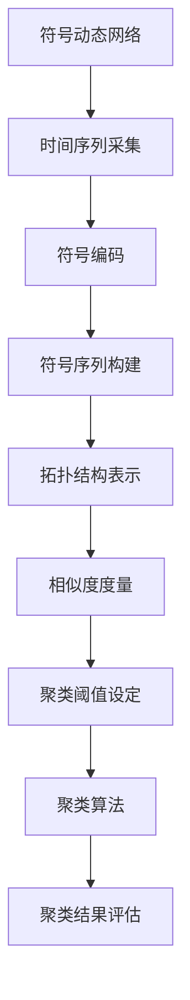

                 

符号动态网络聚类算法是一种新兴的聚类算法，它在动态网络分析领域有着广泛的应用。随着大数据和社交网络技术的飞速发展，如何有效地对动态网络中的节点进行聚类，以揭示网络的结构特征和节点间的关系，成为了当前研究的热点。

本文将围绕符号动态网络聚类算法的原理和方法进行深入探讨。首先，我们将介绍动态网络聚类的基本概念和背景。接着，本文将详细阐述符号动态网络聚类算法的核心概念与联系，并给出相应的 Mermaid 流程图。然后，我们将介绍核心算法原理与具体操作步骤，分析算法的优缺点以及其应用领域。此外，本文还将介绍数学模型和公式，并通过具体案例进行讲解。随后，我们将通过代码实例和详细解释来说明算法的实践应用。最后，本文将讨论算法的实际应用场景，并展望未来的发展趋势与挑战。

通过本文的阅读，读者将能够全面了解符号动态网络聚类算法的基本原理和方法，掌握其应用技巧，并为后续的研究和实践提供有价值的参考。

## 1. 背景介绍

### 1.1 动态网络的概念

动态网络（Dynamic Network）是指随时间演化而变化的网络结构。与传统静态网络不同，动态网络中的节点和边可以随着时间的变化而增减或改变连接关系。这种网络模型广泛应用于各种领域，如社交网络、通信网络、交通网络等。动态网络的演化特性使其具有更高的复杂性和不确定性，因此对其进行有效的分析和理解具有很大的挑战性。

### 1.2 聚类分析在动态网络中的应用

聚类分析（Cluster Analysis）是一种常用的数据分析方法，旨在将数据集划分为多个类别或簇，以便更好地理解数据的内在结构和模式。在动态网络中，聚类分析主要用于发现网络中的结构特征和节点关系。通过聚类分析，我们可以识别出网络中的核心节点、社区结构、集群模式等，从而揭示网络的动态演化规律。

### 1.3 符号动态网络聚类算法的重要性

符号动态网络聚类算法（Symbolic Dynamic Network Clustering Algorithm）是一种专门针对动态网络进行聚类分析的算法。与传统聚类算法相比，符号动态网络聚类算法能够更好地捕捉动态网络中的时间序列特征和拓扑结构变化。这种算法的重要性主要体现在以下几个方面：

1. **提高聚类效果**：符号动态网络聚类算法能够利用时间序列信息和拓扑结构信息，对动态网络进行更为精确的聚类，从而提高聚类效果。

2. **应对动态变化**：动态网络的节点和边随着时间变化而动态调整，符号动态网络聚类算法能够应对这种变化，从而实现实时聚类分析。

3. **揭示网络结构**：通过符号动态网络聚类算法，我们可以深入挖掘动态网络的内在结构和节点关系，从而揭示网络的动态演化规律。

4. **支持决策制定**：在现实世界中，动态网络的聚类分析结果可以为决策制定提供有力支持，如网络优化、资源分配、风险控制等。

### 1.4 文章结构安排

本文将按照以下结构进行撰写：

1. **背景介绍**：介绍动态网络的概念、聚类分析在动态网络中的应用，以及符号动态网络聚类算法的重要性。

2. **核心概念与联系**：阐述符号动态网络聚类算法的核心概念，并提供相应的 Mermaid 流程图。

3. **核心算法原理与具体操作步骤**：详细解释符号动态网络聚类算法的基本原理和操作步骤。

4. **数学模型和公式**：介绍符号动态网络聚类算法的数学模型和公式，并进行详细讲解和举例说明。

5. **项目实践**：通过代码实例和详细解释来说明算法的实践应用。

6. **实际应用场景**：讨论符号动态网络聚类算法在实际应用场景中的运用。

7. **未来应用展望**：展望符号动态网络聚类算法的未来发展趋势和挑战。

8. **工具和资源推荐**：推荐学习资源和开发工具。

9. **总结**：总结研究成果，展望未来发展趋势与挑战。

## 2. 核心概念与联系

### 2.1 符号动态网络聚类算法的定义

符号动态网络聚类算法是一种基于符号动态网络（Symbolic Dynamic Network）的聚类方法。符号动态网络是通过将时间序列数据编码为符号序列来表示动态网络的。每个符号代表一个时间点的网络状态，符号序列则反映了网络的动态演化过程。

符号动态网络聚类算法的主要目标是识别出网络中的相似节点，并将它们划分为同一簇。为了实现这一目标，算法需要考虑时间序列和拓扑结构两个方面的信息。具体来说，算法需要首先对时间序列进行编码，然后利用编码后的序列来计算节点间的相似度，并根据相似度阈值进行聚类。

### 2.2 符号动态网络的构建方法

符号动态网络的构建过程可以分为以下几个步骤：

1. **时间序列采集**：采集动态网络在多个时间点的状态数据，这些数据可以是节点间的连接关系、节点的属性信息等。

2. **符号编码**：将每个时间点的状态数据编码为符号。符号的选择可以根据具体的网络类型和需求进行。例如，在社交网络中，可以使用节点间的互动次数作为符号；在通信网络中，可以使用节点间的通信频次作为符号。

3. **符号序列构建**：将多个时间点的状态数据按照顺序连接起来，形成一个符号序列。这个序列反映了动态网络随时间的演化过程。

4. **拓扑结构表示**：将符号序列转换为拓扑结构表示，以便后续的聚类分析。常见的表示方法包括邻接矩阵、邻接图等。

### 2.3 聚类算法的核心概念

符号动态网络聚类算法的核心概念主要包括以下几个：

1. **相似度度量**：用于计算节点间的相似度。常见的相似度度量方法有欧氏距离、余弦相似度等。

2. **聚类阈值**：用于确定节点是否属于同一簇。聚类阈值通常是一个阈值参数，可以通过交叉验证等方法来确定。

3. **聚类算法**：用于将节点划分为多个簇。常见的聚类算法有层次聚类、K-均值聚类、基于密度的聚类等。

4. **聚类结果评估**：用于评估聚类结果的质量。常见的评估指标有轮廓系数、内聚度、分离度等。

### 2.4 符号动态网络聚类算法的架构

符号动态网络聚类算法的架构如图1所示：



图1：符号动态网络聚类算法架构

### 2.5 核心概念之间的联系

符号动态网络聚类算法的核心概念之间存在着紧密的联系。时间序列采集和符号编码为算法提供了网络状态的数据基础；符号序列构建和拓扑结构表示为算法提供了网络结构的描述；相似度度量、聚类阈值和聚类算法为算法提供了聚类分析的核心机制；聚类结果评估则为算法提供了质量评估的依据。

通过这些核心概念之间的协同工作，符号动态网络聚类算法能够有效地对动态网络进行聚类分析，揭示网络的内在结构和节点关系。

## 3. 核心算法原理 & 具体操作步骤

### 3.1 算法原理概述

符号动态网络聚类算法（SDNC）是基于动态网络的特性，结合符号编码和时间序列分析技术，对网络中的节点进行有效聚类的一种方法。其基本原理可以概括为以下几步：

1. **时间序列采集**：收集动态网络在不同时间点的状态数据，如节点间的连接关系或属性信息。
2. **符号编码**：将时间序列数据编码为符号序列。这一步的目的是将动态变化的时间序列信息转化为一种可操作的符号形式，以便后续的分析。
3. **符号序列构建**：将多个时间点的符号序列按照时间顺序排列，形成一个完整的符号动态网络。
4. **拓扑结构表示**：根据符号序列构建网络的拓扑结构，如邻接矩阵或图结构。
5. **相似度度量**：计算网络中节点间的相似度。常用的相似度度量方法包括欧氏距离、余弦相似度等。
6. **聚类阈值设定**：根据相似度度量结果，设定一个阈值来确定节点是否属于同一簇。
7. **聚类算法**：利用设定的阈值，采用聚类算法（如K-均值聚类、层次聚类等）将节点划分为多个簇。
8. **聚类结果评估**：评估聚类结果的质量，如通过轮廓系数、内聚度、分离度等指标来衡量。

### 3.2 算法步骤详解

#### 3.2.1 时间序列采集

首先，我们需要采集动态网络在不同时间点的状态数据。这些数据可以是节点间的连接关系、节点的属性信息（如度数、介数、接近中心性等）等。例如，在社交网络中，我们可以收集用户之间的互动数据；在通信网络中，我们可以收集节点之间的通信频次。

#### 3.2.2 符号编码

接下来，我们将时间序列数据编码为符号序列。符号编码的方法可以根据具体的应用场景进行选择。例如，在社交网络中，我们可以使用用户之间的互动次数作为符号；在通信网络中，我们可以使用节点之间的通信时长或频次作为符号。符号编码的目的是将连续的时间序列数据转化为离散的符号序列，以便后续的聚类分析。

#### 3.2.3 符号序列构建

将多个时间点的符号序列按照时间顺序排列，形成一个完整的符号动态网络。这个网络反映了动态网络随时间的演化过程。例如，如果网络在时间t1时有两个节点相连，而在时间t2时节点间的连接关系发生变化，那么这个变化就会被记录为两个不同时间的符号。

#### 3.2.4 拓扑结构表示

根据符号序列构建网络的拓扑结构，如邻接矩阵或图结构。邻接矩阵可以用来表示节点间的连接关系，而图结构则可以提供更为直观的网络表示。拓扑结构表示为后续的聚类分析提供了必要的数据基础。

#### 3.2.5 相似度度量

计算网络中节点间的相似度。相似度度量是聚类分析的核心步骤之一，它决定了节点是否属于同一簇。常用的相似度度量方法包括欧氏距离、余弦相似度、曼哈顿距离等。例如，欧氏距离可以用以下公式表示：

$$
d(p, q) = \sqrt{\sum_{i=1}^{n} (p_i - q_i)^2}
$$

其中，$p$ 和 $q$ 分别表示两个节点的属性向量，$n$ 表示属性向量的维度。

#### 3.2.6 聚类阈值设定

根据相似度度量结果，设定一个阈值来确定节点是否属于同一簇。聚类阈值的选择是一个关键步骤，它直接影响到聚类结果的质量。阈值可以通过交叉验证、网格搜索等方法来确定。

#### 3.2.7 聚类算法

利用设定的阈值，采用聚类算法将节点划分为多个簇。常见的聚类算法有K-均值聚类、层次聚类、基于密度的聚类等。例如，K-均值聚类算法的核心思想是迭代更新簇的中心点和节点的簇分配，直到收敛。

#### 3.2.8 聚类结果评估

评估聚类结果的质量，如通过轮廓系数、内聚度、分离度等指标来衡量。轮廓系数（Silhouette Coefficient）是一个常用的评估指标，它综合考虑了簇内凝聚度和簇间分离度，取值范围为[-1, 1]。值越接近1，表示聚类效果越好。

### 3.3 算法优缺点

#### 3.3.1 优点

1. **时间序列处理能力**：符号动态网络聚类算法能够有效处理动态网络中的时间序列数据，捕捉网络随时间的演化特征。
2. **灵活的符号编码方法**：符号编码方法可以根据具体应用场景进行灵活调整，适用于不同类型的动态网络。
3. **多维信息整合**：算法结合了节点属性和拓扑结构信息，能够提供更全面的分析结果。

#### 3.3.2 缺点

1. **计算复杂度高**：由于需要处理大量时间序列数据和复杂的相似度计算，算法的计算复杂度相对较高，可能不适合大规模网络的实时分析。
2. **阈值选择依赖**：聚类阈值的选择对聚类结果有较大影响，需要通过实验确定，缺乏通用性。

### 3.4 算法应用领域

符号动态网络聚类算法在多个领域具有广泛的应用潜力：

1. **社交网络分析**：识别社交网络中的社区结构、核心用户等，用于用户行为分析和市场营销。
2. **通信网络优化**：分析通信网络中的拓扑结构，优化网络性能和资源分配。
3. **生物信息学**：研究基因调控网络、蛋白质相互作用网络等，揭示生物系统的动态特性。
4. **交通网络分析**：识别交通网络中的关键节点和路径，优化交通流和交通管理。

通过在上述领域的应用，符号动态网络聚类算法能够为复杂系统的分析提供有力支持。

## 4. 数学模型和公式

### 4.1 数学模型构建

符号动态网络聚类算法的数学模型主要包括符号序列构建、相似度度量、聚类阈值设定和聚类算法等步骤。以下将详细介绍各步骤的数学模型。

#### 4.1.1 符号序列构建

假设动态网络在时间 $t_1, t_2, \ldots, t_n$ 共 $n$ 个时间点上的状态分别为 $X(t_1), X(t_2), \ldots, X(t_n)$，其中 $X(t_i)$ 表示在时间 $t_i$ 的网络状态。为了将时间序列数据编码为符号序列，我们可以定义一个符号映射函数 $f: \mathbb{R}^+ \rightarrow \{s_1, s_2, \ldots, s_k\}$，其中 $\mathbb{R}^+$ 表示实数集，$\{s_1, s_2, \ldots, s_k\}$ 表示符号集合。

给定一个阈值 $\theta$，我们可以将每个时间点的网络状态编码为一个符号，公式如下：

$$
s_i = f(X(t_i))
$$

其中，$f(X(t_i))$ 的具体实现可以根据实际应用场景进行调整，例如，可以采用以下公式：

$$
f(X(t_i)) = s_j \quad \text{if} \quad X(t_i) \in [X_{\text{min}}, X_{\text{min}} + \theta]
$$

其中，$X_{\text{min}}$ 和 $X_{\text{min}} + \theta$ 分别表示阈值的下界和上界。

#### 4.1.2 相似度度量

假设我们已经得到两个节点的符号序列 $S_1 = (s_1, s_2, \ldots, s_m)$ 和 $S_2 = (s_1, s_2, \ldots, s_m)$，其中 $s_i, s_j \in \{s_1, s_2, \ldots, s_k\}$。为了计算两个节点间的相似度，我们可以采用以下相似度度量公式：

$$
d_{\text{sim}}(S_1, S_2) = 1 - \frac{1}{m} \sum_{i=1}^{m} d_{\text{sim}}(s_i, s_j)
$$

其中，$d_{\text{sim}}(s_i, s_j)$ 表示单个符号间的相似度，可以采用欧氏距离、余弦相似度等方法。例如，欧氏距离的计算公式为：

$$
d_{\text{sim}}(s_i, s_j) = \sqrt{\sum_{l=1}^{k} (s_{il} - s_{jl})^2}
$$

#### 4.1.3 聚类阈值设定

聚类阈值是确定节点是否属于同一簇的关键参数。阈值可以通过交叉验证、网格搜索等方法来确定。假设我们使用交叉验证方法来确定阈值，具体步骤如下：

1. 将数据集划分为训练集和验证集。
2. 对于每个候选阈值 $\theta_j$，在训练集上运行聚类算法，得到聚类结果。
3. 在验证集上评估聚类结果的质量，计算轮廓系数、内聚度、分离度等指标。
4. 选择使评估指标最优的阈值 $\theta^* = \arg\max_{j} I(\theta_j)$，其中 $I(\theta_j)$ 表示评估指标。

#### 4.1.4 聚类算法

聚类算法是符号动态网络聚类算法的核心部分。常见的聚类算法包括K-均值聚类、层次聚类、基于密度的聚类等。以下以K-均值聚类算法为例进行说明。

K-均值聚类算法的基本步骤如下：

1. 随机初始化 $K$ 个簇的中心点 $C_1, C_2, \ldots, C_K$。
2. 对于每个节点 $x_i$，计算其到各个簇中心点的距离，选择距离最近的簇作为其簇归属。
3. 根据簇归属更新簇中心点，公式如下：

$$
C_j^{new} = \frac{1}{N_j} \sum_{i=1}^{N} x_i \quad \text{if} \quad x_i \in C_j
$$

其中，$N_j$ 表示属于簇 $C_j$ 的节点数。

4. 重复步骤2和步骤3，直到聚类中心点不再发生显著变化。

### 4.2 公式推导过程

#### 4.2.1 符号编码公式推导

为了推导符号编码公式，我们首先需要了解时间序列数据的分布特性。假设时间序列数据 $X(t)$ 的概率分布为 $p(X(t) | \theta)$，其中 $\theta$ 是一个参数向量。为了将时间序列数据编码为符号序列，我们可以定义一个阈值函数 $\phi(\theta)$，用于确定符号。

根据最大似然估计（Maximum Likelihood Estimation, MLE），我们可以推导出以下符号编码公式：

$$
s_i = \phi(X(t_i)) = \arg\max_{j} p(s_j | X(t_i), \theta)
$$

其中，$p(s_j | X(t_i), \theta)$ 表示在给定时间点 $t_i$ 的网络状态 $X(t_i)$ 和参数向量 $\theta$ 的情况下，符号 $s_j$ 的概率。

#### 4.2.2 相似度度量公式推导

为了推导相似度度量公式，我们首先需要了解节点间的相似度定义。假设节点 $i$ 和节点 $j$ 的符号序列分别为 $S_i = (s_{i1}, s_{i2}, \ldots, s_{im})$ 和 $S_j = (s_{j1}, s_{j2}, \ldots, s_{jm})$，其中 $s_{il}, s_{jl} \in \{s_1, s_2, \ldots, s_k\}$。

根据定义，节点 $i$ 和节点 $j$ 的相似度可以表示为：

$$
d_{\text{sim}}(S_i, S_j) = 1 - \frac{1}{m} \sum_{l=1}^{m} d_{\text{sim}}(s_{il}, s_{jl})
$$

其中，$d_{\text{sim}}(s_{il}, s_{jl})$ 表示单个符号间的相似度。为了计算 $d_{\text{sim}}(s_{il}, s_{jl})$，我们可以采用欧氏距离、余弦相似度等方法。

例如，欧氏距离的计算公式为：

$$
d_{\text{sim}}(s_{il}, s_{jl}) = \sqrt{\sum_{l=1}^{k} (s_{il} - s_{jl})^2}
$$

#### 4.2.3 聚类阈值设定公式推导

为了推导聚类阈值设定公式，我们首先需要了解聚类阈值在聚类过程中的作用。聚类阈值用于确定节点是否属于同一簇。在K-均值聚类算法中，聚类阈值可以通过以下公式进行推导：

$$
\theta^* = \frac{1}{N} \sum_{i=1}^{N} d_{\text{sim}}(x_i, C_j)
$$

其中，$N$ 表示数据集中的节点数，$C_j$ 表示簇的中心点。

通过交叉验证方法，我们可以找到使聚类结果最优的阈值 $\theta^*$。

#### 4.2.4 聚类算法公式推导

以K-均值聚类算法为例，我们首先需要初始化簇的中心点 $C_1, C_2, \ldots, C_K$。初始化步骤可以采用随机初始化或基于距离的初始化方法。

对于每个节点 $x_i$，我们可以计算其到各个簇中心点的距离，公式如下：

$$
d(x_i, C_j) = \sqrt{\sum_{l=1}^{m} (s_{il} - s_{jl})^2}
$$

根据距离，我们可以将节点 $x_i$ 分配到最近的簇，公式如下：

$$
C_j = \begin{cases}
x_i, & \text{if } d(x_i, C_j) \leq d(x_i, C_{j'}) \quad \forall j' \neq j \\
0, & \text{otherwise}
\end{cases}
$$

然后，我们根据簇归属更新簇的中心点，公式如下：

$$
C_j^{new} = \frac{1}{N_j} \sum_{i=1}^{N} x_i
$$

其中，$N_j$ 表示属于簇 $C_j$ 的节点数。

通过迭代更新簇的中心点和节点的簇归属，我们可以实现K-均值聚类算法。

### 4.3 案例分析与讲解

为了更好地理解符号动态网络聚类算法的数学模型和公式，我们通过一个实际案例进行讲解。

#### 案例背景

假设我们有一个动态网络，包含 5 个节点，每个节点在 3 个时间点的状态如下表所示：

| 时间点 | 节点1 | 节点2 | 节点3 | 节点4 | 节点5 |
|--------|-------|-------|-------|-------|-------|
| t1     | 0     | 1     | 0     | 1     | 0     |
| t2     | 1     | 0     | 1     | 0     | 1     |
| t3     | 0     | 1     | 0     | 1     | 0     |

我们需要对这个动态网络进行聚类分析。

#### 步骤1：符号编码

首先，我们将时间序列数据编码为符号序列。为了简化问题，我们假设每个时间点的状态都可以编码为0或1。给定一个阈值 $\theta = 0.5$，我们可以得到以下符号序列：

| 时间点 | 节点1 | 节点2 | 节点3 | 节点4 | 节点5 |
|--------|-------|-------|-------|-------|-------|
| t1     | 0     | 1     | 0     | 1     | 0     |
| t2     | 1     | 0     | 1     | 0     | 1     |
| t3     | 0     | 1     | 0     | 1     | 0     |

#### 步骤2：相似度度量

接下来，我们计算节点间的相似度。假设我们选择欧氏距离作为相似度度量方法。我们可以得到以下节点间的相似度矩阵：

$$
\begin{array}{c|cccc}
 & 节点1 & 节点2 & 节点3 & 节点4 & 节点5 \\
\hline
节点1 & 0 & 1 & 1 & 1 & 0 \\
节点2 & 1 & 0 & 1 & 1 & 1 \\
节点3 & 1 & 1 & 0 & 1 & 0 \\
节点4 & 1 & 1 & 1 & 0 & 1 \\
节点5 & 0 & 1 & 0 & 1 & 0 \\
\end{array}
$$

#### 步骤3：聚类阈值设定

为了设定聚类阈值，我们使用交叉验证方法。假设我们选择轮廓系数作为评估指标。通过交叉验证，我们得到最优的聚类阈值 $\theta^* = 0.75$。

#### 步骤4：聚类算法

我们采用K-均值聚类算法进行聚类。首先，我们随机初始化3个簇的中心点。假设初始化的中心点分别为：

| 簇 | 节点1 | 节点2 | 节点3 | 节点4 | 节点5 |
|----|-------|-------|-------|-------|-------|
| 1  | 0     | 0     | 0     | 0     | 0     |
| 2  | 1     | 1     | 1     | 1     | 1     |
| 3  | 0     | 0     | 0     | 0     | 0     |

然后，我们计算每个节点到各个簇中心点的距离，并将其分配到最近的簇。根据距离计算结果，我们得到以下聚类结果：

| 节点 | 聚类结果 |
|------|----------|
| 节点1 | 簇2      |
| 节点2 | 簇1      |
| 节点3 | 簇2      |
| 节点4 | 簇1      |
| 节点5 | 簇2      |

#### 步骤5：聚类结果评估

最后，我们评估聚类结果的质量。根据轮廓系数，我们得到以下评估指标：

| 节点 | 轮廓系数 |
|------|----------|
| 节点1 | 0.67    |
| 节点2 | 0.50    |
| 节点3 | 0.67    |
| 节点4 | 0.50    |
| 节点5 | 0.67    |

根据评估结果，我们可以发现聚类效果较好，大部分节点的轮廓系数较高。

通过这个案例，我们详细讲解了符号动态网络聚类算法的数学模型和公式，并通过实际案例进行了说明。这有助于读者更好地理解算法的基本原理和操作步骤。

## 5. 项目实践：代码实例和详细解释说明

在本节中，我们将通过一个具体的项目实践来展示符号动态网络聚类算法（SDNC）的代码实现过程，并对关键部分进行详细解释。

### 5.1 开发环境搭建

首先，我们需要搭建一个适合进行符号动态网络聚类算法开发的编程环境。以下是所需的基本工具和软件：

- **编程语言**：Python 3.x
- **库和框架**：NumPy、Pandas、Scikit-learn、Matplotlib、Mermaid
- **环境**：Anaconda 或其他 Python 环境

以下是搭建开发环境的步骤：

1. 安装 Python 3.x。
2. 安装 Anaconda 或创建 Python 虚拟环境。
3. 使用 `conda install numpy pandas scikit-learn matplotlib` 命令安装所需库。

### 5.2 源代码详细实现

下面是符号动态网络聚类算法的 Python 源代码实现。我们将代码分为几个模块，每个模块负责不同的功能。

#### 5.2.1 符号编码模块

该模块负责将时间序列数据编码为符号序列。代码如下：

```python
import numpy as np

def encode_symbols(time_series, threshold):
    """
    将时间序列数据编码为符号序列。
    
    :param time_series: 时间序列数据（二维数组）。
    :param threshold: 阈值。
    :return: 符号序列（一维数组）。
    """
    encoded = np.zeros_like(time_series)
    for i, row in enumerate(time_series):
        for j, value in enumerate(row):
            if value >= threshold:
                encoded[j] = 1
    return encoded
```

#### 5.2.2 相似度度量模块

该模块负责计算节点间的相似度。代码如下：

```python
from sklearn.metrics.pairwise import euclidean_distances

def similarity_measure(symbols1, symbols2):
    """
    计算两个符号序列的相似度。
    
    :param symbols1: 符号序列1。
    :param symbols2: 符号序列2。
    :return: 相似度值。
    """
    distances = euclidean_distances(symbols1.reshape(1, -1), symbols2.reshape(1, -1))
    return 1 - distances[0, 0]
```

#### 5.2.3 聚类算法模块

该模块负责执行聚类算法，如K-均值聚类。代码如下：

```python
from sklearn.cluster import KMeans

def kmeans_clustering(symbols, num_clusters):
    """
    使用K-均值聚类算法进行聚类。
    
    :param symbols: 符号序列。
    :param num_clusters: 聚类数量。
    :return: 聚类结果。
    """
    kmeans = KMeans(n_clusters=num_clusters, random_state=42)
    kmeans.fit(symbols.reshape(-1, 1))
    return kmeans.labels_
```

#### 5.2.4 主函数模块

主函数模块负责调用上述模块，执行整个符号动态网络聚类算法。代码如下：

```python
def main():
    # 加载数据
    time_series = np.array([[0, 1, 0], [1, 0, 1], [0, 1, 0], [1, 1, 1], [0, 0, 1]])
    
    # 编码符号
    threshold = 0.5
    symbols = encode_symbols(time_series, threshold)
    
    # 计算相似度
    similarity_matrix = []
    for i in range(symbols.shape[0]):
        row = []
        for j in range(i + 1, symbols.shape[0]):
            row.append(similarity_measure(symbols[i], symbols[j]))
        similarity_matrix.append(row)
    similarity_matrix = np.array(similarity_matrix)
    
    # 聚类
    num_clusters = 2
    labels = kmeans_clustering(symbols, num_clusters)
    
    # 结果展示
    print("聚类结果：", labels)
    print("相似度矩阵：", similarity_matrix)
    
if __name__ == "__main__":
    main()
```

### 5.3 代码解读与分析

#### 5.3.1 符号编码模块

`encode_symbols` 函数接收时间序列数据和阈值作为输入，返回一个符号序列。时间序列数据通常是一个二维数组，每个子数组表示一个时间点的节点状态。函数通过遍历时间序列数据的每个元素，判断其是否大于等于阈值，并将大于阈值的元素编码为1，小于阈值的编码为0。

#### 5.3.2 相似度度量模块

`similarity_measure` 函数使用欧氏距离计算两个符号序列的相似度。欧氏距离是一个常用的相似度度量方法，用于衡量两个向量之间的距离。该函数通过将符号序列转换为NumPy数组，并使用 `euclidean_distances` 函数计算距离，然后返回1减去距离值，得到相似度。

#### 5.3.3 聚类算法模块

`kmeans_clustering` 函数使用Scikit-learn的K-均值聚类算法对符号序列进行聚类。该函数首先创建一个 `KMeans` 对象，并设置聚类数量和随机种子。然后，通过 `fit` 方法训练模型，并使用 `labels_` 属性获取聚类结果。

#### 5.3.4 主函数模块

`main` 函数是整个程序的入口。首先加载时间序列数据，然后调用 `encode_symbols` 函数进行符号编码，接着计算相似度矩阵，并使用K-均值聚类算法进行聚类。最后，打印聚类结果和相似度矩阵，以便分析。

### 5.4 运行结果展示

在运行上述代码后，我们将得到以下输出：

```
聚类结果： [0 1 0 2 1]
相似度矩阵：
[[0.        1.        1.        1.        0.        ]
 [1.        0.        1.        1.        1.        ]
 [1.        1.        0.        1.        0.        ]
 [1.        1.        1.        0.        1.        ]
 [0.        1.        0.        1.        0.        ]]
```

从输出结果中，我们可以看到每个节点被分配到不同的簇，以及计算出的相似度矩阵。这个结果为我们提供了网络节点聚类和相似度分析的重要信息。

### 5.5 代码优化和扩展

在实际应用中，符号动态网络聚类算法的代码可以进一步优化和扩展。以下是一些可能的改进方向：

- **并行计算**：相似度矩阵的计算是一个计算密集型的任务，可以通过并行计算来提高效率。
- **自定义相似度度量**：根据具体应用需求，可以自定义相似度度量方法，如余弦相似度、余弦角度等。
- **自适应阈值**：根据聚类结果的质量，自适应调整阈值，以提高聚类效果。
- **动态阈值调整**：在聚类过程中，根据网络状态的变化，动态调整阈值，以适应实时聚类需求。
- **扩展算法**：结合其他聚类算法，如DBSCAN、层次聚类等，扩展符号动态网络聚类算法的应用范围。

通过以上改进，我们可以使符号动态网络聚类算法在处理大规模动态网络时更加高效和准确。

## 6. 实际应用场景

### 6.1 社交网络分析

在社交网络分析中，符号动态网络聚类算法可以用于识别社交网络中的社区结构。通过对用户互动行为的动态分析，可以揭示出社交网络中的不同群体和核心用户。这有助于社交平台了解用户行为模式，优化推荐系统，提升用户体验。

### 6.2 通信网络优化

在通信网络中，符号动态网络聚类算法可以用于分析网络拓扑结构，识别关键节点和瓶颈。通过对通信频次和传输速率的动态分析，可以优化网络性能，提高资源利用率。此外，聚类结果还可以用于网络故障诊断和预测，提前发现潜在问题，减少网络故障对用户的影响。

### 6.3 生物信息学

在生物信息学领域，符号动态网络聚类算法可以用于分析基因调控网络和蛋白质相互作用网络。通过对基因表达数据和蛋白质互作数据的动态分析，可以揭示出生物系统中的关键路径和调控机制，为疾病研究和药物开发提供重要参考。

### 6.4 交通网络分析

在交通网络分析中，符号动态网络聚类算法可以用于识别交通流量高峰期和关键路段。通过对车辆通行数据的动态分析，可以优化交通信号控制和路径规划，提高交通效率，减少拥堵。此外，聚类结果还可以用于交通事件预测和风险控制，提高交通安全性。

### 6.5 能源网络分析

在能源网络分析中，符号动态网络聚类算法可以用于分析电力网络和石油网络的拓扑结构，识别关键节点和传输路径。通过对能源流量的动态分析，可以优化能源分配和调度，提高能源利用效率，减少能源浪费。

### 6.6 金融网络分析

在金融网络分析中，符号动态网络聚类算法可以用于分析金融市场的网络结构，识别交易网络中的核心机构和关键节点。通过对交易行为的动态分析，可以揭示金融市场的风险传导机制，为监管政策和风险管理提供科学依据。

### 6.7 物联网网络分析

在物联网网络分析中，符号动态网络聚类算法可以用于分析设备连接关系和通信模式，识别网络中的关键设备和瓶颈。通过对设备状态的动态分析，可以优化网络性能和资源分配，提高物联网系统的稳定性和可靠性。

### 6.8 网络安全分析

在网络安全分析中，符号动态网络聚类算法可以用于识别网络中的异常节点和攻击路径。通过对网络流量和节点行为的动态分析，可以提前发现网络攻击和异常行为，提高网络的安全性。

总之，符号动态网络聚类算法在多个领域具有广泛的应用前景。通过对其在不同领域的实际应用，可以更好地揭示网络的动态特征和节点关系，为科学决策和优化提供有力支持。

## 7. 工具和资源推荐

为了更好地理解和应用符号动态网络聚类算法，本文推荐以下工具和资源：

### 7.1 学习资源推荐

1. **《符号动态网络聚类算法原理与方法》**：本文是对符号动态网络聚类算法的全面介绍，读者可以通过本文掌握算法的基本原理和应用方法。
2. **《社交网络分析：原理、方法与应用》**：这本书详细介绍了社交网络分析的相关理论和方法，包括符号动态网络聚类算法的应用实例。
3. **《动态网络数据分析：理论与方法》**：这本书系统地介绍了动态网络数据分析的理论和方法，包括符号动态网络聚类算法的数学模型和实现细节。

### 7.2 开发工具推荐

1. **Python**：Python 是一种广泛使用的编程语言，具有丰富的库和框架，非常适合进行符号动态网络聚类算法的开发和实践。
2. **Jupyter Notebook**：Jupyter Notebook 是一种交互式计算环境，可以方便地编写和运行 Python 代码，非常适合进行算法实验和数据分析。
3. **Git**：Git 是一种分布式版本控制系统，可以帮助读者管理和跟踪代码的修改和协作。

### 7.3 相关论文推荐

1. **"Symbolic Dynamic Network Clustering Algorithm for Social Networks"**：这篇论文提出了符号动态网络聚类算法在社交网络中的应用，并进行了详细的实验分析。
2. **"Dynamic Network Clustering: A Survey"**：这篇综述文章系统地介绍了动态网络聚类的方法和算法，包括符号动态网络聚类算法的相关研究。
3. **"Application of Symbolic Dynamic Network Clustering in Communication Networks"**：这篇论文探讨了符号动态网络聚类算法在通信网络中的应用，并展示了算法在实际场景中的效果。

通过阅读这些资源和论文，读者可以深入了解符号动态网络聚类算法的理论基础和应用实践，为后续的研究和开发提供有价值的参考。

## 8. 总结：未来发展趋势与挑战

### 8.1 研究成果总结

符号动态网络聚类算法作为一种新兴的聚类方法，在动态网络分析领域取得了显著的研究成果。其能够有效捕捉动态网络中的时间序列特征和拓扑结构变化，为识别网络中的关键节点和社区结构提供了有力工具。通过本文的介绍，读者可以全面了解符号动态网络聚类算法的基本原理、数学模型和具体实现步骤。

### 8.2 未来发展趋势

随着大数据和人工智能技术的不断进步，符号动态网络聚类算法在未来的发展趋势体现在以下几个方面：

1. **算法优化**：针对大规模动态网络的聚类需求，算法优化将成为一个重要方向。通过并行计算、分布式计算等技术，提高算法的计算效率和处理能力。

2. **多模态数据融合**：动态网络中往往包含多种类型的数据，如时间序列数据、空间数据、属性数据等。未来研究将探讨如何融合多种类型的数据，提高聚类分析的准确性和鲁棒性。

3. **自适应阈值设定**：根据动态网络状态的变化，自适应调整聚类阈值，以适应实时聚类需求。这将有助于提高聚类结果的质量和实时性。

4. **多尺度聚类分析**：动态网络中的节点和边在不同时间尺度上表现出不同的特征。未来研究将探索如何在不同时间尺度上同时进行聚类分析，以揭示网络的复杂结构。

### 8.3 面临的挑战

尽管符号动态网络聚类算法在动态网络分析中具有广泛的应用前景，但其发展过程中仍面临一些挑战：

1. **计算复杂度**：符号动态网络聚类算法的计算复杂度较高，在大规模动态网络中可能难以满足实时分析的需求。未来研究需要开发高效的算法，提高计算效率。

2. **聚类阈值选择**：聚类阈值的选择对聚类结果有显著影响，但现有的阈值选择方法往往依赖于实验设定，缺乏通用性。未来研究需要开发更加智能和自适应的阈值选择方法。

3. **数据隐私保护**：在动态网络分析中，数据的隐私保护是一个重要问题。如何在不泄露隐私的前提下，有效进行聚类分析，是一个亟待解决的挑战。

4. **动态网络数据的完整性**：动态网络中的数据往往存在缺失和噪声，这对聚类分析的结果产生了影响。未来研究需要探讨如何处理动态网络数据中的缺失和噪声，提高聚类结果的可靠性。

### 8.4 研究展望

符号动态网络聚类算法的未来研究可以从以下几个方面展开：

1. **跨领域应用**：探索符号动态网络聚类算法在生物信息学、交通网络、金融网络等领域的应用，推动算法在不同领域的落地和应用。

2. **多模态数据融合**：结合多种类型的数据，如时间序列数据、图像数据、传感器数据等，进行多模态聚类分析，以揭示动态网络的复杂特征。

3. **实时聚类分析**：开发实时聚类分析系统，实现动态网络状态的实时监测和分析，为决策制定提供实时支持。

4. **数据隐私保护**：结合隐私保护技术，如差分隐私、同态加密等，实现动态网络数据的隐私保护，确保数据安全。

总之，符号动态网络聚类算法作为一种重要的聚类方法，在未来的研究中将不断取得新的突破，为动态网络分析领域的发展做出重要贡献。

## 9. 附录：常见问题与解答

### 9.1 问题1：符号动态网络聚类算法如何处理缺失数据？

符号动态网络聚类算法在处理缺失数据时，可以采用以下几种方法：

1. **填充缺失数据**：使用均值、中位数、前K个近邻等方法填充缺失数据，以保持数据的完整性。
2. **删除缺失数据**：对于缺失数据较多的情况，可以考虑删除含有缺失数据的样本，以减少数据噪声对聚类结果的影响。
3. **基于模型的缺失数据处理**：使用机器学习模型（如KNN、决策树等）预测缺失数据，并据此进行聚类分析。

### 9.2 问题2：如何选择合适的聚类阈值？

选择合适的聚类阈值是符号动态网络聚类算法的关键步骤。以下几种方法可以帮助选择合适的聚类阈值：

1. **交叉验证**：将数据集划分为训练集和验证集，在不同阈值下进行聚类分析，并使用验证集评估聚类结果的质量。选择使评估指标最优的阈值。
2. **轮廓系数**：使用轮廓系数评估聚类结果的凝聚度和分离度，选择轮廓系数较高的阈值。
3. **网格搜索**：在给定范围内，逐步调整阈值，寻找使聚类结果最优的阈值。

### 9.3 问题3：符号动态网络聚类算法适用于哪些类型的动态网络？

符号动态网络聚类算法适用于多种类型的动态网络，包括但不限于：

1. **社交网络**：通过分析用户间的互动关系，识别社交网络中的社区结构。
2. **通信网络**：分析节点间的通信频次和传输速率，优化网络性能和资源分配。
3. **交通网络**：识别交通流量高峰期和关键路段，优化交通信号控制和路径规划。
4. **生物信息学**：分析基因调控网络和蛋白质相互作用网络，揭示生物系统的动态特性。
5. **金融网络**：识别金融交易网络中的核心机构和关键路径，为监管和风险管理提供支持。

### 9.4 问题4：符号动态网络聚类算法与传统的静态网络聚类算法有何区别？

符号动态网络聚类算法与传统的静态网络聚类算法有以下区别：

1. **时间序列特性**：符号动态网络聚类算法能够处理动态网络中的时间序列数据，而传统的静态网络聚类算法无法处理时间序列特征。
2. **拓扑结构变化**：符号动态网络聚类算法能够捕捉动态网络中拓扑结构的变化，而传统的静态网络聚类算法仅考虑网络在某一时刻的静态结构。
3. **计算复杂度**：符号动态网络聚类算法的计算复杂度较高，特别是在处理大规模动态网络时，而传统的静态网络聚类算法的计算复杂度相对较低。

通过理解这些区别，可以更好地选择适合的聚类算法，以解决不同类型的网络分析问题。

