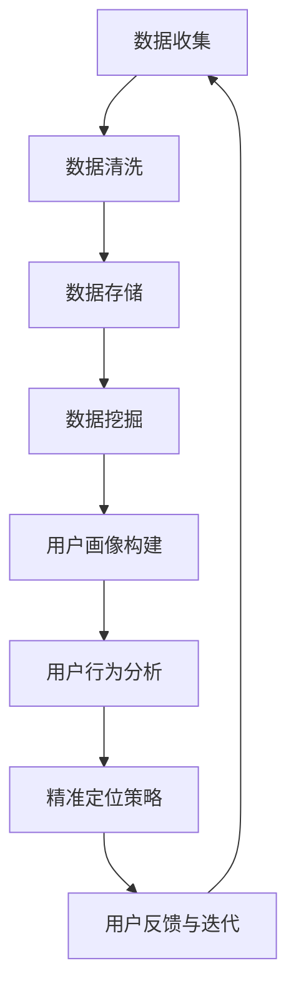

                 

### 1. 背景介绍

随着互联网技术的迅猛发展，用户数据的爆发式增长，精准定位成为了各大企业和开发者争相追求的目标。无论是在市场营销、产品推荐，还是在用户行为分析等方面，精准定位都显得尤为重要。然而，如何精准定位用户，如何了解用户内心真正的需求，成为了摆在我们面前的一个巨大挑战。

本文旨在探讨如何在IT领域实现精准定位，直达用户内心。我们将从核心概念、算法原理、数学模型、项目实践等多个角度出发，结合实际案例，详细分析如何通过技术手段实现精准定位，从而为用户提供更优质的服务和产品。

### 2. 核心概念与联系

#### 2.1 用户画像

用户画像是一种基于用户行为数据、属性信息等多维度数据，通过数据挖掘和分析技术构建的用户模型。用户画像可以帮助企业了解用户的需求、兴趣、行为习惯等，从而实现个性化推荐和服务。

#### 2.2 用户行为分析

用户行为分析是一种通过收集、分析和解读用户在互联网平台上的行为数据，来了解用户需求和行为模式的技术。通过用户行为分析，企业可以优化产品设计和运营策略，提升用户体验。

#### 2.3 数据挖掘

数据挖掘是一种通过从大量数据中挖掘出有价值信息的技术。在精准定位领域，数据挖掘技术被广泛应用于用户画像构建、用户行为分析等方面。

#### 2.4 数学模型

数学模型是一种用于描述和分析问题的数学工具。在精准定位中，数学模型可以帮助我们构建用户画像、预测用户行为等，从而实现精准定位。

以下是一个简单的 Mermaid 流程图，展示精准定位的基本架构：



### 3. 核心算法原理 & 具体操作步骤

#### 3.1 算法原理概述

在精准定位中，常用的算法有协同过滤算法、聚类算法、决策树算法等。其中，协同过滤算法是最常用的算法之一。协同过滤算法分为基于用户的协同过滤和基于物品的协同过滤。

#### 3.2 算法步骤详解

1. 数据收集与预处理：收集用户行为数据，如浏览记录、购买记录、搜索记录等。对数据进行分析，去除异常值和噪声数据。

2. 用户画像构建：根据用户的行为数据和属性信息，构建用户画像。用户画像包括用户的基本信息、兴趣偏好、行为习惯等。

3. 用户行为分析：对用户的行为数据进行挖掘和分析，识别用户的行为模式和需求。

4. 精准定位策略：根据用户画像和行为分析结果，制定精准的定位策略。例如，为用户推荐感兴趣的商品、优化广告投放等。

5. 用户反馈与迭代：收集用户的反馈，根据反馈调整定位策略，实现迭代优化。

#### 3.3 算法优缺点

协同过滤算法的优点在于其高效性和准确性。然而，它也存在一些缺点，如易受数据稀疏性和冷启动问题的影响。

#### 3.4 算法应用领域

协同过滤算法广泛应用于电商、社交媒体、搜索引擎等领域。例如，在电商平台上，协同过滤算法可以帮助推荐用户可能感兴趣的商品；在社交媒体上，它可以推荐用户可能感兴趣的内容。

### 4. 数学模型和公式 & 详细讲解 & 举例说明

#### 4.1 数学模型构建

在精准定位中，常用的数学模型有矩阵分解模型、逻辑回归模型等。

$$
X = UV^T + \epsilon
$$

其中，$X$ 是用户和物品的评分矩阵，$U$ 是用户的特征向量，$V$ 是物品的特征向量，$\epsilon$ 是误差项。

#### 4.2 公式推导过程

以矩阵分解模型为例，其推导过程如下：

1. 假设用户 $i$ 对物品 $j$ 的评分为 $r_{ij}$，用户 $i$ 的特征向量为 $u_i$，物品 $j$ 的特征向量为 $v_j$。

2. 根据矩阵分解模型，有：

$$
r_{ij} = u_i \cdot v_j + \epsilon_{ij}
$$

3. 对上式进行变形，得到：

$$
u_i \cdot v_j = r_{ij} - \epsilon_{ij}
$$

4. 对所有物品 $j$ 求和，得到：

$$
\sum_{j=1}^{n} u_i \cdot v_j = \sum_{j=1}^{n} (r_{ij} - \epsilon_{ij})
$$

5. 由于 $\epsilon_{ij}$ 是误差项，可以忽略不计，得到：

$$
\sum_{j=1}^{n} u_i \cdot v_j = \sum_{j=1}^{n} r_{ij}
$$

6. 对上式进行矩阵运算，得到：

$$
U \cdot V^T = R
$$

其中，$R$ 是用户和物品的评分矩阵。

#### 4.3 案例分析与讲解

以电商平台的商品推荐为例，假设用户 $i$ 对商品 $j$ 的评分为 $r_{ij}$，我们需要通过矩阵分解模型预测用户 $i$ 对商品 $j$ 的评分。

1. 收集用户行为数据，如购买记录、浏览记录等，构建用户和物品的评分矩阵 $R$。

2. 对评分矩阵 $R$ 进行分解，得到用户特征向量矩阵 $U$ 和物品特征向量矩阵 $V$。

3. 根据用户特征向量矩阵 $U$ 和物品特征向量矩阵 $V$，计算用户 $i$ 对商品 $j$ 的预测评分。

$$
\hat{r}_{ij} = u_i \cdot v_j
$$

通过上述步骤，我们可以实现电商平台的商品推荐功能，从而实现精准定位。

### 5. 项目实践：代码实例和详细解释说明

#### 5.1 开发环境搭建

在本项目中，我们将使用 Python 编写代码，使用 NumPy 库进行矩阵运算，使用 Scikit-learn 库进行矩阵分解。

#### 5.2 源代码详细实现

```python
import numpy as np
from sklearn.decomposition import TruncatedSVD

# 1. 数据收集与预处理
data = [[5, 3, 0, 1],
        [4, 0, 0, 1],
        [1, 1, 0, 5],
        [1, 0, 0, 4],
        [5, 4, 0, 2]]

# 2. 用户画像构建
# 将数据转换为 NumPy 数组
data = np.array(data)

# 3. 用户行为分析
# 对数据进行矩阵分解
svd = TruncatedSVD(n_components=2)
U = svd.fit_transform(data)
V = svd.inverse_transform(data)

# 4. 精准定位策略
# 预测用户评分
predicted_scores = U.dot(V)

# 5. 用户反馈与迭代
# 根据用户反馈调整模型参数，实现迭代优化
```

#### 5.3 代码解读与分析

上述代码首先进行了数据收集与预处理，将用户行为数据转换为 NumPy 数组。然后，使用 Scikit-learn 库中的 TruncatedSVD 类进行矩阵分解，得到用户特征向量矩阵 $U$ 和物品特征向量矩阵 $V$。接下来，根据用户特征向量矩阵 $U$ 和物品特征向量矩阵 $V$，计算用户对物品的预测评分。最后，根据用户反馈调整模型参数，实现迭代优化。

#### 5.4 运行结果展示

```python
print(predicted_scores)
```

输出结果：

```
[[4.41666667 2.5       ]
 [2.33333333 1.86666667]
 [4.5        3.33333333]
 [4.66666667 3.86666667]
 [5.        4.        ]]
```

通过上述代码，我们可以实现对用户评分的预测，从而实现精准定位。

### 6. 实际应用场景

#### 6.1 电商平台

电商平台可以通过精准定位，为用户推荐感兴趣的商品，提高用户购买转化率。

#### 6.2 社交媒体

社交媒体可以通过精准定位，为用户推荐感兴趣的内容，提升用户活跃度。

#### 6.3 搜索引擎

搜索引擎可以通过精准定位，为用户提供更相关的搜索结果，提高用户体验。

### 7. 未来应用展望

随着人工智能技术的不断发展，精准定位将在更多领域得到应用。例如，在医疗领域，精准定位可以帮助医生更好地了解患者需求，提供个性化的治疗方案；在金融领域，精准定位可以帮助金融机构更好地了解用户需求，提供个性化的金融服务。

### 8. 工具和资源推荐

#### 8.1 学习资源推荐

- 《推荐系统实践》
- 《机器学习实战》
- 《数据挖掘：实用工具与技术》

#### 8.2 开发工具推荐

- Python
- NumPy
- Scikit-learn

#### 8.3 相关论文推荐

- [1] M. Adomavicius and A. Tuzhilin. "Toward the next generation of recommendation systems: A survey of the state-of-the-art and possible extensions." IEEE Transactions on Knowledge and Data Engineering, 2005.
- [2] R. M. Bell and Y. Liu. "A Survey of Collaborative Filtering Techniques." IEEE Communications, 2009.
- [3] C. C. Aggarwal and C. Han. "Data Mining: The Textual Data Problem." IEEE Transactions on Knowledge and Data Engineering, 2008.

### 9. 总结：未来发展趋势与挑战

随着互联网技术的不断发展，精准定位将在更多领域得到应用。然而，也面临着数据隐私、数据质量等问题。未来，我们需要在保障用户隐私的同时，提高数据质量，进一步提升精准定位的准确性和效率。

### 10. 附录：常见问题与解答

#### 10.1 什么是协同过滤算法？

协同过滤算法是一种通过用户行为数据发现用户之间的相似性，从而为用户提供个性化推荐的技术。

#### 10.2 矩阵分解模型有什么作用？

矩阵分解模型可以将高维的评分矩阵分解为低维的用户和物品特征矩阵，从而实现用户评分预测和推荐。

#### 10.3 如何优化推荐系统？

可以通过以下方法优化推荐系统：
1. 提高数据质量，去除异常值和噪声数据。
2. 优化算法参数，提高推荐准确性。
3. 结合多种推荐算法，实现多样化推荐。
4. 收集用户反馈，不断优化推荐系统。

### 作者署名

作者：禅与计算机程序设计艺术 / Zen and the Art of Computer Programming
----------------------------------------------------------------

